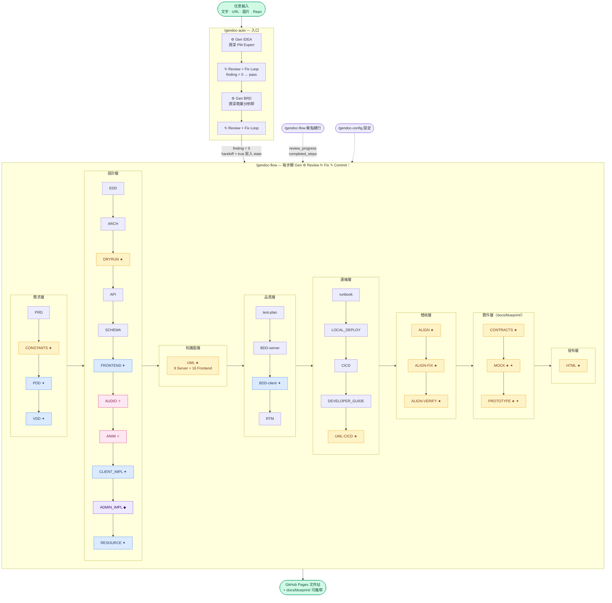
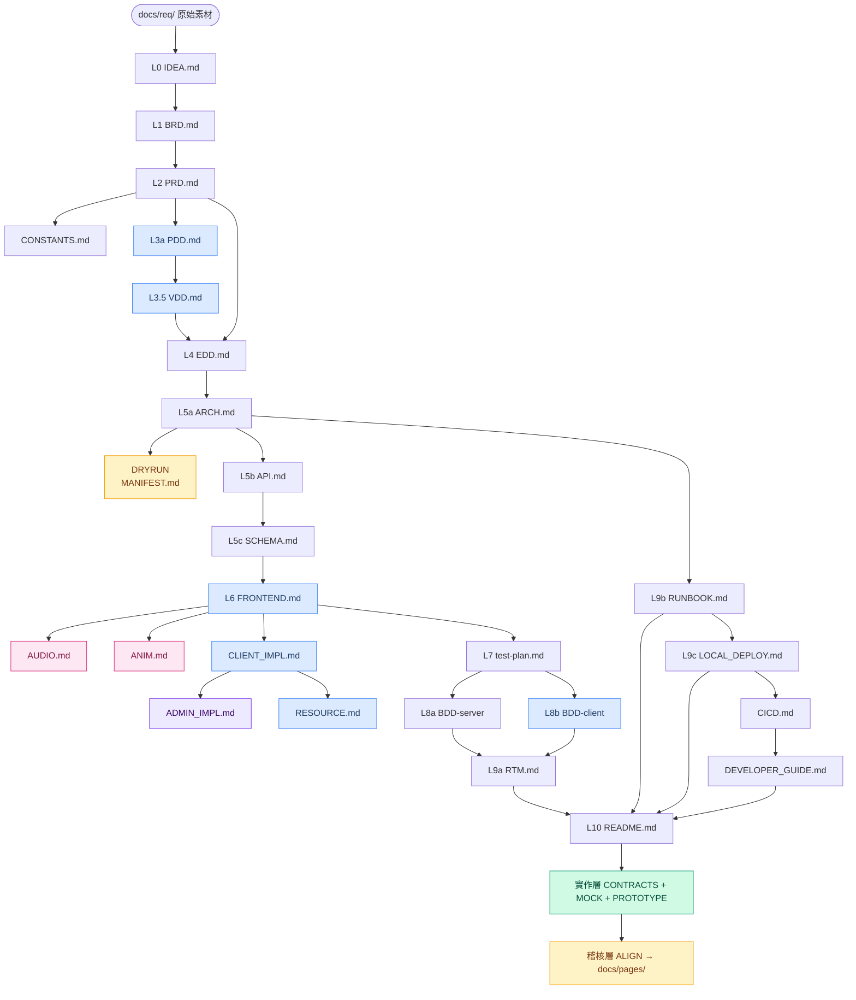

# gendoc

[](LICENSE)
[](https://github.com/ibalasite/gendoc)
[](https://claude.ai/code)

**AI-driven engineering document generation system for Claude Code.** One command generates a complete implementation blueprint — IDEA, BRD, PRD, **CONSTANTS**, PDD, VDD, EDD, ARCH, **DRYRUN**, API, Schema, FRONTEND, AUDIO, ANIM, **CLIENT_IMPL**, **ADMIN_IMPL**, **RESOURCE**, test-plan, BDD, RTM, Runbook, LOCAL_DEPLOY, CONTRACTS (OpenAPI/JSON Schema/Pact/IaC/Seed Code), MOCK, **PROTOTYPE**, and an HTML documentation site — all output consolidated under `docs/blueprint/` for portability — each document inheriting knowledge from all upstream docs automatically. For game projects (`client_type=game`), AUDIO and ANIM design documents are also generated. CLIENT_IMPL is generated for any project with a client (`client_type ≠ api-only`) and auto-routes to the correct engine: Cocos Creator / Unity WebGL / React / Vue / HTML5. ADMIN_IMPL is generated when `has_admin_backend=true`.

---

## Overview

`gendoc` is a Claude Code skill suite that automates the full engineering documentation lifecycle. Using a three-layer template architecture (`TYPE.md` structure + `TYPE.gen.md` generation rules + `TYPE.review.md` review criteria), it generates and iteratively reviews production-quality engineering documents from an initial idea through deployment runbooks.

Key capabilities:
- **Cumulative upstream reading** — every doc reads all ancestor docs, never just its direct parent
- **Universal generation** — `/gendoc <type>` for any document type, driven by templates
- **Universal review loop** — `/reviewdoc <type>` with configurable strategy (rapid / standard / exhaustive / tiered / custom)
- **Reliable breakpoint resume** — `review_progress` schema tracks each review round; any step can be safely interrupted and resumed at the exact round
- **Quality status tracking** — `passed` / `degraded` / `failed` per step; CRITICAL/HIGH findings block completion, MEDIUM/LOW log as degraded
- **Three-value project type** — `game` (AUDIO+ANIM+UI prototype) / `web` (SaaS/App, UI prototype) / `api-only` (API Explorer prototype); auto-detected from IDEA/BRD/PRD keywords, re-verified after PRD generation (P-14)
- **Interactive prototypes** — `/gendoc-gen-prototype` generates a clickable HTML prototype for any project type: UI flow prototype (web/game) or API Explorer with mock responses (api-only, like Postman)
- **Implementation-ready UML (1:1 standard)** — `/gendoc-gen-diagrams` generates all 9 Server UML types + 16 Frontend UML types (Step 2B, auto-triggered when `client_type ≠ none` and `FRONTEND.md` exists) with enough precision that a developer can implement the entire system from diagrams alone: exact attribute types, full method signatures, enum values fully listed, cardinality + role labels on every relation, exact method names + typed params on every sequence arrow, `trigger [guard] / action` on every state transition (no `<br/>` in stateDiagram-v2), swimlanes per actor in activity diagrams, technology + version + port on every component/deployment node
- **Cross-browser Mermaid enforcement** — all diagram-generating templates prohibit `<br/>` in `stateDiagram-v2` transition labels (Safari/Firefox break) and `sequenceDiagram` participant aliases; experimental charts (`pie` / `xychart-beta` / `bar`) are banned in favour of `graph TD` or HTML tables
- **Pipeline integrity check** — P-15 verifies all expected steps have a record before marking complete
- **5-way client engine routing** — `CLIENT_IMPL` detects `CLIENT_ENGINE` from EDD §3.3 and generates engine-specific scene structure, asset loading, AudioManager, and VFX specs for Cocos Creator / Unity WebGL / React / Vue / HTML5; aliases `cocos`, `unity`, `react-impl`, `vue-impl` all resolve to CLIENT_IMPL
- **pipeline.json as single source of truth** — `gendoc-config` step picker, `gendoc-shared` STEP_SEQUENCE / STEP_ORDER / Review Loop list all read `pipeline.json` dynamically at runtime; adding a new pipeline step requires editing only `pipeline.json` — all skills auto-update
- **Context-isolated review loops** — `gendoc-flow` Phase D-2 wraps each document's review→fix loop in an Agent subagent, preventing 12+ documents × 5 rounds of review output from bloating the main Claude context; results returned as compact REVIEW_LOOP_RESULT
- **Centralized state file guard** — `gendoc-shared` is the single executable entry point for R-01 guard logic; `gendoc-config` is the sole creator of state files; `gendoc-auto` and `gendoc-flow` delegate via one-line Skill call
- **Uniform review loops** — IDEA and BRD review loops in `gendoc-auto` use the same Phase D-2 pattern as `gendoc-flow`: main Claude directly drives Review→Fix→Round Summary→Commit per round with full output visibility
- **Local Developer Platform (Production Parity)** — `/gendoc cicd` generates a complete CI/CD platform design: Gitea (local git server, Port 3000) + Jenkins on k3s (CI, Port 8080) + ArgoCD (CD GitOps, Port 8443); dev-tool ports are fully separate from the app's single Port 80; `make dev-tools-up` starts everything in one command; non-developers can run the full pipeline without knowing Kubernetes; local environment uses the exact same toolchain as production (only scale and TLS differ) — compliant with 12-Factor App #10 Dev/Prod Parity
- **Developer Daily Operations Manual** — `/gendoc developer-guide` generates the day-to-day developer operations handbook that pairs with `local-deploy`: covers the complete daily workflow (git push → Jenkins trigger → pipeline monitoring → ArgoCD sync → app verification), CI/CD troubleshooting (Jenkins not triggered, stage failed, ArgoCD OutOfSync, Gitea webhook issues), quick-reference make targets (`make dev-status` / `make dev-logs` / `make dev-restart`), common local environment issues with step-by-step fixes, and environment maintenance procedures (secret rotation, image cleanup, full reset); distinct from `runbook.md` which targets production on-call SREs
- **Auto-update via SessionStart hook** — harness-enforced, LLM-independent, runs in background
- **Windows native support** — Python-based hook for Windows, bash for macOS/Linux

---

## Skills

| Skill | Command | Purpose |
|-------|---------|---------|
| `gendoc` | `/gendoc <type>` | Generate any document type |
| `reviewdoc` | `/reviewdoc <type>` | Review & iteratively fix any document |
| `gendoc-auto` | `/gendoc-auto` | Full pipeline entry point: IDEA + BRD generation, then hands off to gendoc-flow |
| `gendoc-flow` | `/gendoc-flow` | Template-driven orchestrator (PRD→HTML full pipeline) with reliable breakpoint resume, P-14/P-15 |
| `gendoc-config` | `/gendoc-config` | Interactive two-level menu: configure client_type, has_admin_backend, review strategy, restart step; supports multi-edit loop with mandatory-field check (Step 4c) before save |
| `gendoc-gen-dryrun` | `/gendoc dryrun` or via `gendoc-flow` | Generate quantitative baseline MANIFEST.md + .gendoc-rules/*.json from EDD/PRD/ARCH — lock numbers that review loops enforce (D-DRYRUN) |
| `gendoc-align-check` | `/gendoc-align-check` | Cross-document alignment scan (ALIGN) — use `gendoc-align-verify` to confirm fix completeness |
| `gendoc-align-fix` | `/gendoc-align-fix` | Auto-fix alignment issues |
| `gendoc-gen-html` | `/gendoc-gen-html` | Generate HTML documentation site v3.0 (HTML) — converts all docs/*.md + docs/diagrams/*.md to HTML pages; 3-section sidebar (文件 / Server UML / Frontend UML) |
| `gendoc-gen-contracts` | `/gendoc-gen-contracts` | Generate machine-readable specs: OpenAPI 3.1, JSON Schema, Pact contracts, IaC (Helm/docker-compose), Seed Code skeleton (CONTRACTS) |
| `gendoc-gen-mock` | `/gendoc-gen-mock` | Generate FastAPI Mock Server from API.md — 1:1 endpoint mapping, realistic fake data, Windows/Mac ready, Postman-importable (MOCK; skipped for api-only) |
| `gendoc-gen-prototype` | `/gendoc-gen-prototype` | Interactive HTML prototype — UI flow (web/game) or API Explorer with mock engine (api-only) |
| `gendoc-gen-diagrams` | `/gendoc-gen-diagrams` | Generate Server 9 UML types + Frontend 16 UML types (UML) + class-inventory.md; 30+ precision validation checks; enforces no `<br/>` in stateDiagram-v2 / sequenceDiagram; bans experimental charts (pie/xychart-beta/bar) |
| `gendoc-gen-client-bdd` | `/gendoc-gen-client-bdd` | Client-facing BDD feature files (web/game projects) |
| `gendoc-repair` | `/gendoc-repair` | DRYRUN-aware backfill — brings any incomplete project to the same state as `gendoc-auto` + `gendoc-flow` would produce. Requires `docs/BRD.md` to exist. Binary gate: if `.gendoc-rules/*.json` absent or DRYRUN not in completed_steps → Branch A (complete upstream steps → run DRYRUN); otherwise → Branch B (compare all post-DRYRUN steps against `.gendoc-rules/*.json` quality gates using two-layer FAIL detection: output missing + rules not met → redo, loop until all pass, max 3 retries) |
| `gendoc-rebuild-templates` | `/gendoc-rebuild-templates` | Rebuild all document templates from scratch |
| `gendoc-upgrade` | `/gendoc-upgrade` | Manual skill upgrade |
| `reviewtemplate` | `/reviewtemplate <TYPE>` | Review & iteratively fix a template three-file set (TYPE.md + .gen.md + .review.md) |

### Supported Document Types

`idea` · `brd` · `prd` · `constants` · `pdd` · `vdd` · `edd` · `arch` · `dryrun` · `api` · `schema` · `frontend` · `audio` · `anim` · `client-impl` · `admin-impl` · `resource` · `test-plan` · `bdd` · `rtm` · `runbook` · `local-deploy` · `cicd` · `developer-guide` · `readme` · `contracts` · `mock` · `prototype`

> `audio` and `anim` are only generated for `client_type=game` projects (games, HTML5 game engines).
> `client-impl` is generated for any project with a client (`client_type ≠ api-only`). Aliases: `cocos`, `unity`, `react-impl`, `vue-impl`, `client_impl`.
> `cicd` generates the full CI/CD pipeline design document — Jenkinsfile skeleton, Shared Make Targets, PR Gate, Jenkins on k3s, ArgoCD GitOps, **Local Developer Platform** (Gitea + production parity).
> `developer-guide` generates the developer daily operations manual — pairs with `local-deploy` (setup) to cover day-to-day workflow: git push → CI trigger → pipeline monitoring → ArgoCD sync → app verification; CI/CD troubleshooting; local quick commands; common issues; environment maintenance.

---

## Quick Start

### Install (macOS / Linux / WSL)

```bash
# 1. Clone + install in one go
git clone https://github.com/ibalasite/gendoc.git ~/.claude/skills/gendoc
~/.claude/skills/gendoc/setup

# 2. Restart Claude Code — skills are now available
```

### Install (Windows native)

```powershell
# Requires: Git for Windows + Python 3
git clone https://github.com/ibalasite/gendoc.git "$env:USERPROFILE\.claude\skills\gendoc"
& "$env:USERPROFILE\.claude\skills\gendoc\setup.ps1"
```

### Uninstall

```bash
~/.claude/skills/gendoc/setup uninstall   # macOS/Linux
# Or: & "$env:USERPROFILE\.claude\skills\gendoc\setup.ps1" uninstall   # Windows
```

---

## Usage

```bash
# Full pipeline — start a new project
/gendoc-auto "I want to build an AI-powered customer service bot"

# Resume after interruption — gendoc-flow auto-resumes from last completed step
/gendoc-flow

# Configure review strategy or restart from a specific step
/gendoc-config

# Generate a single document
/gendoc edd
/gendoc brd
/gendoc runbook

# Review a document with iterative fix loop
/reviewdoc edd
/reviewdoc runbook

# Generate machine-readable specs (OpenAPI, JSON Schema, Pact, IaC, Seed Code)
/gendoc-gen-contracts

# Generate FastAPI mock server for frontend development
/gendoc-gen-mock

# Generate HTML docs site and deploy to GitHub Pages
/gendoc-gen-html

# Manual upgrade
/gendoc-upgrade
```

---

## Auto-Update

After `./setup`, a **SessionStart hook** is registered in `~/.claude/settings.json`. Every time Claude Code starts a session, the harness automatically runs `git pull + install` in the background (throttled to once per hour). No LLM involvement — 100% reliable.

```
Session start → harness triggers hook → git pull (background) → skills updated
```

Manual update: `/gendoc-upgrade` or `~/.claude/skills/gendoc/setup upgrade`

---

## Design Principles

gendoc enforces three non-negotiable architectural principles on all generated documents:

**1. HA / SCALE / SPOF / BCP from Day One**  
Every generated system has ≥ 2 replicas at minimum. There is no "small" or "single-instance" mode. Cost is the minimum number of servers required to eliminate all single points of failure.

**2. Spring Modulith — Microservice Decomposability**  
All subsystems (e.g. member / wallet / deposit / lobby / game) are designed as Bounded Contexts from Day 1. They can be deployed together (minimum HA cost) or independently extracted as microservices (maximum scale). Five hard constraints apply to every generated design:

| # | Constraint |
|---|---|
| HC-1 | No cross-module DB table access — each BC owns its schema exclusively |
| HC-2 | Cross-module calls only via Public Interface (no internal class calls) |
| HC-3 | Async event-driven inter-module communication (in-process → message broker without code change) |
| HC-4 | No shared mutable state across module boundaries |
| HC-5 | Module dependency graph must be a DAG (no circular dependencies) |

References: Martin Fowler "MonolithFirst" (2015) · Sam Newman *Monolith to Microservices* (O'Reilly 2019) · Spring Modulith (spring.io, 2022)

**3. Clean Architecture + SOLID — Dependency Rule Enforced**  
Every generated backend system follows Robert C. Martin's 4-layer Clean Architecture with explicit dependency direction. EDD §3.1b anchors the SOLID table and Dependency Rule; all downstream documents (ARCH, test-plan, DEVELOPER_GUIDE) are enforced to align.

| Layer | Role | Import Rule |
|-------|------|-------------|
| Presentation | Controllers, Request/Response DTOs | → Application only |
| Application | Use Cases, Application Services | → Domain only |
| Domain | Entities, Value Objects, Repository **Interfaces** | No outward imports |
| Infrastructure | RepositoryImpl, Adapters, ORM, external SDKs | → Domain interfaces (DIP) |

**禁止清單 (Hard Constraints):**
- Domain layer must not import any ORM / DB / HTTP / external SDK
- Application layer must not directly `new` any Infrastructure concrete class (use DIP via constructor injection)
- All 5 SOLID principles must be named with concrete class/interface examples in EDD §3.1b

References: Robert C. Martin *Clean Architecture* (2017) · *Agile Software Development* SOLID chapters (2002)

---

## Pipeline Architecture — Single Source of Truth (SSOT)

The DRYRUN step enforces a **Single Source of Truth (SSOT)** architecture for all quantitative metrics and document specification rules. It reads upstream docs (EDD/PRD/ARCH) to derive a quantitative baseline, writes `MANIFEST.md` + `.gendoc-rules/*.json`, and provides the quality gates that all downstream review loops enforce.

The pipeline has two phases separated by the DRYRUN gate:

```
DRYRUN 前的 step（內容層）                Gate          DRYRUN 后的 step（技術文件層）
IDEA → BRD → PRD → EDD → ARCH    →    DRYRUN    →    API → SCHEMA → … → HTML
                                           ↑
                              reads EDD/PRD/ARCH, derives
                              quantitative baseline, writes
                              .gendoc-rules/*.json
```

### pipeline.json Structure

`templates/pipeline.json` is the single definition file for every pipeline step. Its actual structure is:

```json
{
  "version": "1.0",
  "description": "gendoc pipeline step definitions",
  "steps": [
    {
      "id": "API",
      "spec_rules": {
        "min_endpoint_count": "max(5, {rest_endpoint_count})",
        "min_h2_sections": 3,
        "required_sections": ["Overview", "Endpoints", "Error Codes"]
      }
    }
  ]
}
```

Each step entry has a flat `spec_rules` object — key/value pairs where values may reference DRYRUN-derived parameters (e.g. `{rest_endpoint_count}`). There is no `metrics[]` array and no nested `quantitative_specs` / `content_mapping` / `cross_file_validation` sub-objects.

### How It Works

**`dryrun_core.py` — Parameter Extraction**

`dryrun_core.py` reads EDD, PRD, and ARCH, then calls `extract_parameters()` which extracts 7 quantitative parameters via dedicated private methods:

```python
def extract_parameters(self):
    return {
        "rest_endpoint_count":  self._extract_rest_endpoint_count(),
        "entity_count":         self._extract_entity_count(),
        "user_story_count":     self._extract_user_story_count(),
        "module_count":         self._extract_module_count(),
        "db_table_count":       self._extract_db_table_count(),
        "actor_count":          self._extract_actor_count(),
        "bc_count":             self._extract_bc_count(),
    }
```

These parameters are substituted into each step's `spec_rules` values and written to `.gendoc-rules/<step-id>-rules.json`. Downstream review loops read those files as quality gates.

**Adding a new step**: edit `pipeline.json` + add the three-file template set (`.md`, `.gen.md`, `.review.md`) — no code changes needed.

### Validation Layers

The DRYRUN output (`MANIFEST.md` + `.gendoc-rules/*.json`) is validated by `tools/bin/review.sh`, which implements 20 `measure_*` functions covering structural checks (placeholder count, section count, endpoint count, required sections, etc.) and cross-document consistency.

See `tools/bin/review.sh` for all 20 built-in quantitative rules. Each rule includes a `suggested_fix` hint for automated or manual remediation.

---

## Document Architecture — SDLC Foundation

gendoc's document pipeline is grounded in established **Software Development Lifecycle (SDLC)** theory. The Requirements Engineering and Design phases are decomposed into four distinct layers, each answering a single question for a specific audience:

| Layer | Documents | Question | Audience |
|-------|-----------|----------|----------|
| **L1 — Business Requirements** | IDEA · BRD | **Why** — market opportunity & business value | Executives, Product Owners |
| **L2 — System Requirements** | PRD · CONSTANTS | **What** — feature scope & acceptance criteria | PM, QA, Stakeholders |
| **L3 — UX / Interaction Design** | PDD · VDD · FRONTEND | **How it works** — user flows & experience design | UX Designers, Frontend Devs |
| **L4 — Architecture / Detailed Design** | EDD · ARCH · API · SCHEMA | **How to build** — system architecture & implementation | Engineers, DevOps |

Each layer speaks to its audience in its own language. Downstream layers inherit and refine upstream decisions via gendoc's **cumulative upstream reading** mechanism — ensuring SCHEMA.md cannot contradict API.md, and EDD.md cannot contradict PRD.md.

### Theoretical Basis

**International Standards**
- **ISO/IEC/IEEE 29148:2018** — Requirements Engineering life cycle: BRS → StRS → SyRS hierarchy maps directly to L1 → L2
- **ISO/IEC/IEEE 42010:2011** — Architecture Description: establishes L4 as a separate artifact from L1–L3 requirements
- **IEEE Std 830-1998** — SRS "what, not how" principle: canonical basis for L2 / L4 separation

**Academic References**
- Wiegers & Beatty, *Software Requirements* 3rd ed. (Microsoft Press, 2013) — three-tier business / user / system decomposition
- Robertson & Robertson, *Mastering the Requirements Process* 3rd ed. (Addison-Wesley, 2012) — Volere Template: project purpose (L1) → product scope (L2) → behavioral requirements (L3)
- Cockburn, *Writing Effective Use Cases* (Addison-Wesley, 2000) — goal-level hierarchy: organization (L1) → user-goal (L2) → sub-function (L3/L4)
- Kruchten, "Architectural Blueprints: The 4+1 View Model" (*IEEE Software*, 1995) — use-case view (L2/L3) vs. logical/physical architecture views (L4)
- Nuseibeh & Easterbrook, "Requirements Engineering: A Roadmap" (*ICSE 2000*) — problem space (L1/L2) vs. solution space (L3/L4)

**Industry Frameworks**
- IIBA BABOK v3 (2015) — business requirements vs. solution requirements as distinct knowledge areas
- IREB CPRE Syllabus (2022) — professional RE certification: system context → elicitation → specification layers
- TOGAF Standard 10th Ed. (The Open Group, 2022) — Business → Data → Application → Technology architecture, adopted by 80% of Global 50 companies

**AI-Driven SDLC Research**
- Hong et al., "MetaGPT" (*ICLR 2024*, arXiv:2308.00352) — SOP-encoded multi-agent pipeline (PRD → System Design → Code) outperforms single-LLM approaches, validating layered document decomposition as a prerequisite for reliable AI software engineering
- Qian et al., "ChatDev" (*ACL 2024*, arXiv:2307.07924) — multi-agent SDLC automation following requirements → design → implementation phases; confirms ambiguous upstream documents cause cascading implementation failures

> **Core insight**: Decomposing SDLC into explicit document layers is not bureaucratic overhead — it is the structural prerequisite for reliable AI-assisted development. Ambiguous upstream documents cause cascading failures downstream; precise layered specifications enable AI agents (and human engineers) to implement without guesswork.

---

## Template Architecture

```
templates/
├── <TYPE>.md          ← document structure skeleton
├── <TYPE>.gen.md      ← AI generation rules (Iron Law: must be read first)
└── <TYPE>.review.md   ← review criteria & quality gates
```

The **Iron Law**: no document is generated without reading both `TYPE.md` AND `TYPE.gen.md` first. Templates are the single source of truth — editing a template immediately changes behavior of all `/gendoc` and `/reviewdoc` calls.

### Pipeline



> **✦ 藍色節點**（PDD / VDD / FRONTEND / CLIENT_IMPL / RESOURCE / BDD-client / MOCK / PROTOTYPE）：`client_type ≠ api-only` 時啟用。**✧ 粉紅節點**（AUDIO / ANIM）：`client_type = game` 專屬。**◆ 紫色節點**（ADMIN_IMPL）：`has_admin_backend = true` 才啟用。**★ 黃色節點**：special_skill（不走三專家，直接呼叫 Skill）。

### 文件上下層關係（Document Hierarchy）



> **✦ 藍色節點**（PDD / VDD / FRONTEND / CLIENT_IMPL / RESOURCE / BDD-client / MOCK / PROTOTYPE）：`client_type ≠ api-only` 時啟用。**✧ 粉紅節點**（AUDIO / ANIM）：`client_type = game` 專屬。**◆ 紫色節點**（ADMIN_IMPL）：`has_admin_backend = true` 才啟用。**★ 黃色節點**：special_skill（不走三專家，直接呼叫 Skill）。

Each document accumulates knowledge from **all** ancestors (skips silently if missing). Blue nodes only run when `client_type ≠ api-only`.

---

## Repository Structure

```
gendoc/
├── SKILL.md            # /gendoc entry skill
├── setup               # Unified tool: install / uninstall / upgrade (macOS/Linux)
├── setup.ps1           # Unified tool: install / uninstall / upgrade (Windows)
├── bin/
│   ├── gendoc-env.sh              # Path single source of truth (GENDOC_DIR etc.)
│   ├── gendoc-session-update      # SessionStart hook — throttle wrapper (bash)
│   ├── gendoc-session-update.py   # SessionStart hook — throttle wrapper (Python)
│   ├── _gendoc-update-worker.py   # Background update worker
│   ├── gendoc-settings-hook       # settings.json editor (bash wrapper)
│   └── gendoc-settings-hook.py    # settings.json editor (Python)
├── tools/
│   └── bin/                       # Pipeline tools (gen_html.py etc.)
├── skills/                        # Source of truth for all SKILL.md files
│   ├── gendoc-auto/
│   ├── gendoc-flow/
│   └── ...
├── templates/                     # Document templates (structure + gen rules + review)
│   ├── EDD.md / EDD.gen.md
│   ├── BRD.md / BRD.gen.md
│   └── ...
└── docs/                          # gendoc's own project documentation
    ├── PRD.md                     # Product Requirements Document (v3.6)
    ├── gendoc-redesign-decisions.md  # Architecture design decisions log
    └── pages/                     # Generated HTML site (GitHub Pages)
```

---

## Review Strategies

Configure via `/gendoc-config`:

| Strategy | Max Rounds | Stop Condition |
|----------|-----------|----------------|
| `rapid` | 3 | first round with 0 findings |
| `standard` | 5 | first round with 0 findings (default) |
| `exhaustive` | unlimited | findings = 0 |
| `tiered` | unlimited | rounds 1–5: findings=0; round 6+: CRITICAL+HIGH+MEDIUM=0 |
| `custom` | unlimited | user-defined condition |

---

## Requirements

| Platform | Requirements |
|----------|-------------|
| macOS / Linux | Git, Python 3, Claude Code |
| Windows (PowerShell) | Git for Windows, Python 3, Claude Code |
| Windows (WSL / git-bash) | Same as macOS/Linux |

---

## Contributing

1. Edit skill files in `skills/<skill-name>/SKILL.md` or templates in `templates/`
2. Commit and push to remote
3. On any machine: run `/gendoc-upgrade` or `~/.claude/skills/gendoc/setup upgrade`
4. Test with Claude Code — SessionStart hook auto-pulls every hour

---

## License

MIT © ibalasite
