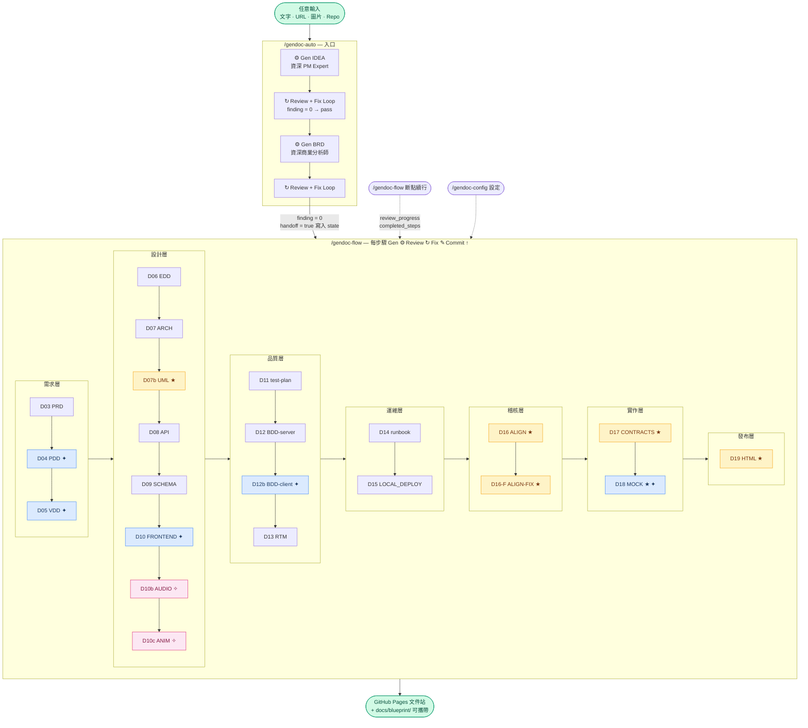
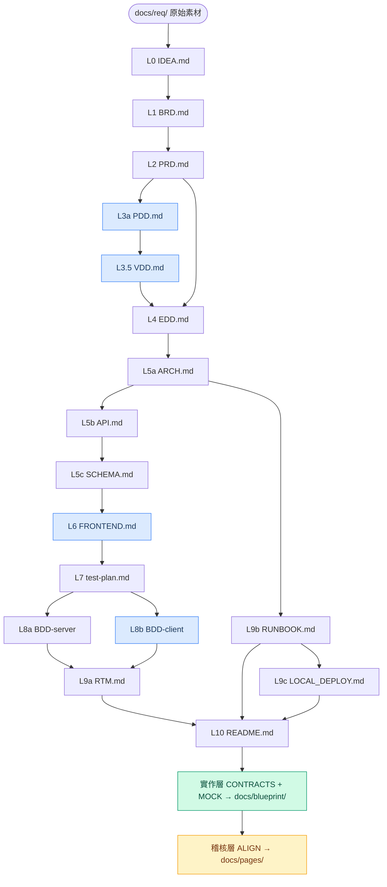

# gendoc

[](LICENSE)
[](https://github.com/ibalasite/gendoc)
[](https://claude.ai/code)

**AI-driven engineering document generation system for Claude Code.** One command generates a complete implementation blueprint — IDEA, BRD, PRD, PDD, VDD, EDD, ARCH, API, Schema, FRONTEND, AUDIO, ANIM, **CLIENT_IMPL**, test-plan, BDD, RTM, Runbook, LOCAL_DEPLOY, CONTRACTS (OpenAPI/JSON Schema/Pact/IaC/Seed Code), and an HTML documentation site — all output consolidated under `docs/blueprint/` for portability — each document inheriting knowledge from all upstream docs automatically. For game projects (`client_type=game`), AUDIO and ANIM design documents are also generated. CLIENT_IMPL is generated for any project with a client (`client_type ≠ api-only`) and auto-routes to the correct engine: Cocos Creator / Unity WebGL / React / Vue / HTML5.

---

## Overview

`gendoc` is a Claude Code skill suite that automates the full engineering documentation lifecycle. Using a three-layer template architecture (`TYPE.md` structure + `TYPE.gen.md` generation rules + `TYPE.review.md` review criteria), it generates and iteratively reviews production-quality engineering documents from an initial idea through deployment runbooks.

Key capabilities:
- **Cumulative upstream reading** — every doc reads all ancestor docs, never just its direct parent
- **Universal generation** — `/gendoc <type>` for any document type, driven by templates
- **Universal review loop** — `/reviewdoc <type>` with configurable strategy (rapid / standard / exhaustive / tiered / custom)
- **Reliable breakpoint resume** — `review_progress` schema tracks each review round; any step can be safely interrupted and resumed at the exact round
- **Quality status tracking** — `passed` / `degraded` / `failed` per step; CRITICAL/HIGH findings block completion, MEDIUM/LOW log as degraded
- **Three-value project type** — `game` (AUDIO+ANIM+UI prototype) / `web` (SaaS/App, UI prototype) / `api-only` (API Explorer prototype); auto-detected from IDEA/BRD/PRD keywords, re-verified after PRD generation (P-14)
- **Interactive prototypes** — `/gendoc-gen-prototype` generates a clickable HTML prototype for any project type: UI flow prototype (web/game) or API Explorer with mock responses (api-only, like Postman)
- **Implementation-ready UML (1:1 standard)** — `/gendoc-gen-diagrams` generates all 9 Server UML types + 16 Frontend UML types (Step 2B, auto-triggered when `client_type ≠ none` and `FRONTEND.md` exists) with enough precision that a developer can implement the entire system from diagrams alone: exact attribute types, full method signatures, enum values fully listed, cardinality + role labels on every relation, exact method names + typed params on every sequence arrow, `trigger [guard] / action` on every state transition (no `<br/>` in stateDiagram-v2), swimlanes per actor in activity diagrams, technology + version + port on every component/deployment node
- **Cross-browser Mermaid enforcement** — all diagram-generating templates prohibit `<br/>` in `stateDiagram-v2` transition labels (Safari/Firefox break) and `sequenceDiagram` participant aliases; experimental charts (`pie` / `xychart-beta` / `bar`) are banned in favour of `graph TD` or HTML tables
- **Pipeline integrity check** — P-15 verifies all expected steps have a record before marking complete
- **5-way client engine routing** — `CLIENT_IMPL` (D10d) detects `CLIENT_ENGINE` from EDD §3.3 and generates engine-specific scene structure, asset loading, AudioManager, and VFX specs for Cocos Creator / Unity WebGL / React / Vue / HTML5; aliases `cocos`, `unity`, `react-impl`, `vue-impl` all resolve to CLIENT_IMPL
- **pipeline.json as single source of truth** — `gendoc-config` step picker, `gendoc-shared` STEP_SEQUENCE / STEP_ORDER / Review Loop list all read `pipeline.json` dynamically at runtime; adding a new pipeline step requires editing only `pipeline.json` — all skills auto-update
- **Context-isolated review loops** — `gendoc-flow` Phase D-2 wraps each document's review→fix loop in an Agent subagent, preventing 12+ documents × 5 rounds of review output from bloating the main Claude context; results returned as compact REVIEW_LOOP_RESULT
- **Centralized state file guard** — `gendoc-shared` is the single executable entry point for R-01 guard logic; `gendoc-config` is the sole creator of state files; `gendoc-auto` and `gendoc-flow` delegate via one-line Skill call
- **Uniform review loops** — IDEA and BRD review loops in `gendoc-auto` use the same Phase D-2 pattern as `gendoc-flow`: main Claude directly drives Review→Fix→Round Summary→Commit per round with full output visibility
- **Auto-update via SessionStart hook** — harness-enforced, LLM-independent, runs in background
- **Windows native support** — Python-based hook for Windows, bash for macOS/Linux

---

## Skills

| Skill | Command | Purpose |
|-------|---------|---------|
| `gendoc` | `/gendoc <type>` | Generate any document type |
| `reviewdoc` | `/reviewdoc <type>` | Review & iteratively fix any document |
| `gendoc-auto` | `/gendoc-auto` | Full pipeline entry point: IDEA + BRD generation, then hands off to gendoc-flow |
| `gendoc-flow` | `/gendoc-flow` | Template-driven orchestrator (D03–D19) with reliable breakpoint resume, P-14/P-15 |
| `gendoc-config` | `/gendoc-config` | Configure execution mode, review strategy, client_type & restart step interactively |
| `gendoc-align-check` | `/gendoc-align-check` | Cross-document alignment scan (D16) |
| `gendoc-align-fix` | `/gendoc-align-fix` | Auto-fix alignment issues |
| `gendoc-gen-html` | `/gendoc-gen-html` | Generate HTML documentation site v3.0 (D19) — converts all docs/*.md + docs/diagrams/*.md to HTML pages; 3-section sidebar (文件 / Server UML / Frontend UML) |
| `gendoc-gen-contracts` | `/gendoc-gen-contracts` | Generate machine-readable specs: OpenAPI 3.1, JSON Schema, Pact contracts, IaC (Helm/docker-compose), Seed Code skeleton (D17) |
| `gendoc-gen-mock` | `/gendoc-gen-mock` | Generate FastAPI Mock Server from API.md — 1:1 endpoint mapping, realistic fake data, Windows/Mac ready, Postman-importable (D18; skipped for api-only) |
| `gendoc-gen-prototype` | `/gendoc-gen-prototype` | Interactive HTML prototype — UI flow (web/game) or API Explorer with mock engine (api-only) |
| `gendoc-gen-diagrams` | `/gendoc-gen-diagrams` | Generate Server 9 UML types + Frontend 16 UML types (Step 2B, when client_type≠none+FRONTEND.md exists) + class-inventory.md (D07b); 30+ precision validation checks; enforces no `<br/>` in stateDiagram-v2 / sequenceDiagram; bans experimental charts (pie/xychart-beta/bar) |
| `gendoc-gen-client-bdd` | `/gendoc-gen-client-bdd` | Client-facing BDD feature files (web/game projects) |
| `gendoc-repair` | `/gendoc-repair` | Diff completed_steps vs pipeline.json, list missing steps, and optionally resume gendoc-flow from the first gap |
| `gendoc-rebuild-templates` | `/gendoc-rebuild-templates` | Rebuild all document templates from scratch |
| `gendoc-update` | `/gendoc-update` | Manual skill upgrade |
| `reviewtemplate` | `/reviewtemplate <TYPE>` | Review & iteratively fix a template three-file set (TYPE.md + .gen.md + .review.md) |

### Supported Document Types

`idea` · `brd` · `prd` · `pdd` · `vdd` · `edd` · `arch` · `api` · `schema` · `frontend` · `audio` · `anim` · `client-impl` · `test-plan` · `bdd` · `rtm` · `runbook` · `local-deploy` · `readme` · `contracts` · `mock`

> `audio` and `anim` are only generated for `client_type=game` projects (games, HTML5 game engines).
> `client-impl` is generated for any project with a client (`client_type ≠ api-only`). Aliases: `cocos`, `unity`, `react-impl`, `vue-impl`, `client_impl`.

---

## Quick Start

### Install (macOS / Linux / WSL)

```bash
# 1. Clone + install in one go
git clone https://github.com/ibalasite/gendoc.git ~/.claude/skills/gendoc
~/.claude/skills/gendoc/setup

# 2. Restart Claude Code — skills are now available
```

### Install (Windows native)

```powershell
# Requires: Git for Windows + Python 3
git clone https://github.com/ibalasite/gendoc.git "$env:USERPROFILE\.claude\skills\gendoc"
& "$env:USERPROFILE\.claude\skills\gendoc\setup.ps1"
```

### Uninstall

```bash
~/.claude/skills/gendoc/setup uninstall   # macOS/Linux
# Or: & "$env:USERPROFILE\.claude\skills\gendoc\setup.ps1" uninstall   # Windows
```

---

## Usage

```bash
# Full pipeline — start a new project
/gendoc-auto "I want to build an AI-powered customer service bot"

# Resume after interruption — gendoc-flow auto-resumes from last completed step
/gendoc-flow

# Configure review strategy or restart from a specific step
/gendoc-config

# Generate a single document
/gendoc edd
/gendoc brd
/gendoc runbook

# Review a document with iterative fix loop
/reviewdoc edd
/reviewdoc runbook

# Generate machine-readable specs (OpenAPI, JSON Schema, Pact, IaC, Seed Code)
/gendoc-gen-contracts

# Generate FastAPI mock server for frontend development
/gendoc-gen-mock

# Generate HTML docs site and deploy to GitHub Pages
/gendoc-gen-html

# Manual upgrade
/gendoc-update
```

---

## Auto-Update

After `./setup`, a **SessionStart hook** is registered in `~/.claude/settings.json`. Every time Claude Code starts a session, the harness automatically runs `git pull + install` in the background (throttled to once per hour). No LLM involvement — 100% reliable.

```
Session start → harness triggers hook → git pull (background) → skills updated
```

Manual update: `/gendoc-upgrade` or `~/.claude/skills/gendoc/setup upgrade`

---

## Design Principles

gendoc enforces two non-negotiable architectural principles on all generated documents:

**1. HA / SCALE / SPOF / BCP from Day One**  
Every generated system has ≥ 2 replicas at minimum. There is no "small" or "single-instance" mode. Cost is the minimum number of servers required to eliminate all single points of failure.

**2. Spring Modulith — Microservice Decomposability**  
All subsystems (e.g. member / wallet / deposit / lobby / game) are designed as Bounded Contexts from Day 1. They can be deployed together (minimum HA cost) or independently extracted as microservices (maximum scale). Five hard constraints apply to every generated design:

| # | Constraint |
|---|---|
| HC-1 | No cross-module DB table access — each BC owns its schema exclusively |
| HC-2 | Cross-module calls only via Public Interface (no internal class calls) |
| HC-3 | Async event-driven inter-module communication (in-process → message broker without code change) |
| HC-4 | No shared mutable state across module boundaries |
| HC-5 | Module dependency graph must be a DAG (no circular dependencies) |

References: Martin Fowler "MonolithFirst" (2015) · Sam Newman *Monolith to Microservices* (O'Reilly 2019) · Spring Modulith (spring.io, 2022)

---

## Template Architecture

```
templates/
├── <TYPE>.md          ← document structure skeleton
├── <TYPE>.gen.md      ← AI generation rules (Iron Law: must be read first)
└── <TYPE>.review.md   ← review criteria & quality gates
```

The **Iron Law**: no document is generated without reading both `TYPE.md` AND `TYPE.gen.md` first. Templates are the single source of truth — editing a template immediately changes behavior of all `/gendoc` and `/reviewdoc` calls.

### Pipeline (D01–D19)



> **✦ 藍色節點**（PDD / VDD / FRONTEND / BDD-client / MOCK）：`client_type=web` 或 `game` 才啟用（MOCK 同時跳過 `api-only`）。**✧ 粉紅節點**（AUDIO / ANIM）：`client_type=game` 專屬。**★ 黃色節點**：特殊步驟（special_skill）— 含 D16-ALIGN-FIX（依 ALIGN_REPORT.md 自動修復對齊問題）、D07b-UML（gen-diagrams: 9 Server UML + 16 Frontend UML）。

### 文件上下層關係（Document Hierarchy）



Each document accumulates knowledge from **all** ancestors (skips silently if missing). Blue nodes only run when `client_type ≠ none`.

---

## Repository Structure

```
gendoc/
├── SKILL.md            # /gendoc entry skill
├── setup               # Unified tool: install / uninstall / upgrade (macOS/Linux)
├── setup.ps1           # Unified tool: install / uninstall / upgrade (Windows)
├── bin/
│   ├── gendoc-env.sh              # Path single source of truth (GENDOC_DIR etc.)
│   ├── gendoc-session-update      # SessionStart hook — throttle wrapper (bash)
│   ├── gendoc-session-update.py   # SessionStart hook — throttle wrapper (Python)
│   ├── _gendoc-update-worker.py   # Background update worker
│   ├── gendoc-settings-hook       # settings.json editor (bash wrapper)
│   └── gendoc-settings-hook.py    # settings.json editor (Python)
├── tools/
│   └── bin/                       # Pipeline tools (gen_html.py etc.)
├── skills/                        # Source of truth for all SKILL.md files
│   ├── gendoc-auto/
│   ├── gendoc-flow/
│   └── ...
├── templates/                     # Document templates (structure + gen rules + review)
│   ├── EDD.md / EDD.gen.md
│   ├── BRD.md / BRD.gen.md
│   └── ...
└── docs/                          # gendoc's own project documentation
    ├── PRD.md                     # Product Requirements Document (v1.9)
    ├── gendoc-redesign-decisions.md  # Architecture design decisions log
    └── pages/                     # Generated HTML site (GitHub Pages)
```

---

## Review Strategies

Configure via `/gendoc-config`:

| Strategy | Max Rounds | Stop Condition |
|----------|-----------|----------------|
| `rapid` | 3 | first round with 0 findings |
| `standard` | 5 | first round with 0 findings (default) |
| `exhaustive` | unlimited | findings = 0 |
| `tiered` | unlimited | rounds 1–5: findings=0; round 6+: CRITICAL+HIGH+MEDIUM=0 |
| `custom` | unlimited | user-defined condition |

---

## Requirements

| Platform | Requirements |
|----------|-------------|
| macOS / Linux | Git, Python 3, Claude Code |
| Windows (PowerShell) | Git for Windows, Python 3, Claude Code |
| Windows (WSL / git-bash) | Same as macOS/Linux |

---

## Contributing

1. Edit skill files in `skills/<skill-name>/SKILL.md` or templates in `templates/`
2. Commit and push to remote
3. On any machine: run `/gendoc-upgrade` or `~/.claude/skills/gendoc/setup upgrade`
4. Test with Claude Code — SessionStart hook auto-pulls every hour

---

## License

MIT © ibalasite
