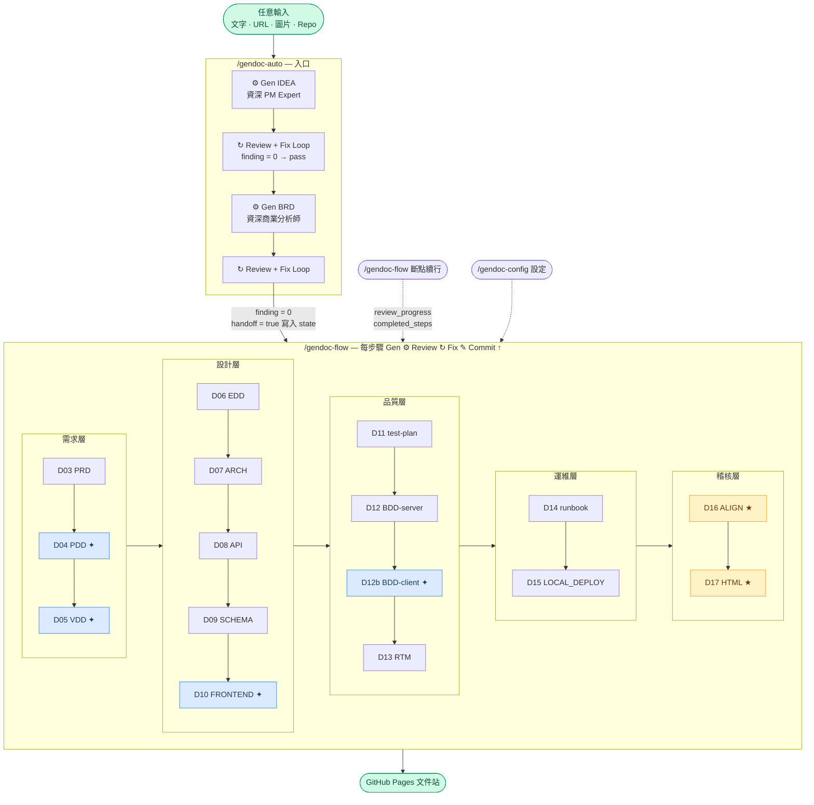
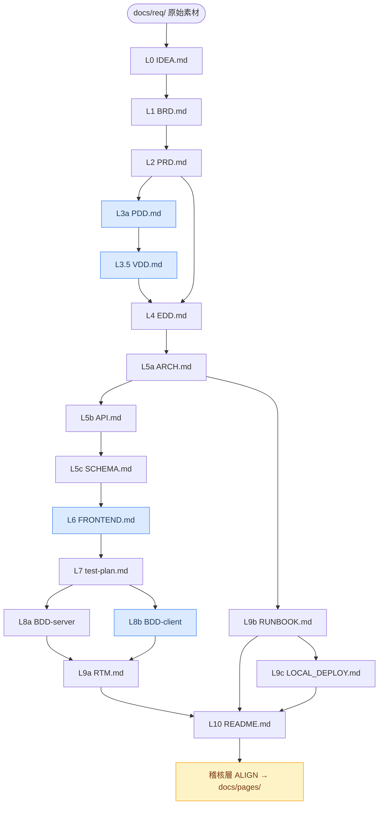

# gendoc

[](LICENSE)
[](https://github.com/ibalasite/gendoc)
[](https://claude.ai/code)

**AI-driven engineering document generation system for Claude Code.** One command generates a complete 17-document implementation blueprint — IDEA, BRD, PRD, PDD, VDD, EDD, ARCH, API, Schema, FRONTEND, test-plan, BDD, RTM, Runbook, LOCAL_DEPLOY, and an HTML documentation site — each document inheriting knowledge from all upstream docs automatically.

---

## Overview

`gendoc` is a Claude Code skill suite that automates the full engineering documentation lifecycle. Using a three-layer template architecture (`TYPE.md` structure + `TYPE.gen.md` generation rules + `TYPE.review.md` review criteria), it generates and iteratively reviews production-quality engineering documents from an initial idea through deployment runbooks.

Key capabilities:
- **Cumulative upstream reading** — every doc reads all ancestor docs, never just its direct parent
- **Universal generation** — `/gendoc <type>` for any document type, driven by templates
- **Universal review loop** — `/reviewdoc <type>` with configurable strategy (rapid / standard / exhaustive / tiered / custom)
- **Reliable breakpoint resume** — `review_progress` schema tracks each review round; any step can be safely interrupted and resumed at the exact round
- **Quality status tracking** — `passed` / `degraded` / `failed` per step; CRITICAL/HIGH findings block completion, MEDIUM/LOW log as degraded
- **Auto-update via SessionStart hook** — harness-enforced, LLM-independent, runs in background
- **Windows native support** — Python-based hook for Windows, bash for macOS/Linux

---

## Skills

| Skill | Command | Purpose |
|-------|---------|---------|
| `gendoc` | `/gendoc <type>` | Generate any document type |
| `reviewdoc` | `/reviewdoc <type>` | Review & iteratively fix any document |
| `gendoc-auto` | `/gendoc-auto` | Full pipeline entry point: IDEA + BRD generation, then hands off to gendoc-flow |
| `gendoc-flow` | `/gendoc-flow` | Template-driven orchestrator (D03–D17) with reliable breakpoint resume |
| `gendoc-config` | `/gendoc-config` | Configure execution mode, review strategy & restart step interactively |
| `gendoc-align-check` | `/gendoc-align-check` | Cross-document alignment scan (D16) |
| `gendoc-align-fix` | `/gendoc-align-fix` | Auto-fix alignment issues |
| `gendoc-gen-html` | `/gendoc-gen-html` | Generate HTML documentation site (D17) |
| `gendoc-gen-diagrams` | `/gendoc-gen-diagrams` | Generate architecture diagrams |
| `gendoc-gen-client-bdd` | `/gendoc-gen-client-bdd` | Client-facing BDD feature files |
| `gendoc-rebuild-templates` | `/gendoc-rebuild-templates` | Rebuild all document templates from scratch |
| `gendoc-update` | `/gendoc-update` | Manual skill upgrade |

### Supported Document Types

`idea` · `brd` · `prd` · `pdd` · `vdd` · `edd` · `arch` · `api` · `schema` · `frontend` · `test-plan` · `bdd` · `rtm` · `runbook` · `local-deploy` · `readme`

---

## Quick Start

### Install (macOS / Linux / WSL)

```bash
# 1. Clone
git clone https://github.com/ibalasite/gendoc.git ~/projects/gendoc

# 2. Install skills + register auto-update hook
cd ~/projects/gendoc && ./setup

# 3. Restart Claude Code — skills are now available
```

### Install (Windows native)

```powershell
# Requires: Git for Windows + Python 3
git clone https://github.com/ibalasite/gendoc.git ~/projects/gendoc
cd ~/projects/gendoc
.\setup.ps1
```

### Uninstall

```bash
~/projects/gendoc/setup --uninstall   # macOS/Linux
# Or: .\setup.ps1 -Uninstall          # Windows
```

---

## Usage

```bash
# Full pipeline — start a new project
/gendoc-auto "I want to build an AI-powered customer service bot"

# Resume after interruption — gendoc-flow auto-resumes from last completed step
/gendoc-flow

# Configure review strategy or restart from a specific step
/gendoc-config

# Generate a single document
/gendoc edd
/gendoc brd
/gendoc runbook

# Review a document with iterative fix loop
/reviewdoc edd
/reviewdoc runbook

# Generate HTML docs site and deploy to GitHub Pages
/gendoc-gen-html

# Manual upgrade
/gendoc-update
```

---

## Auto-Update

After `./setup`, a **SessionStart hook** is registered in `~/.claude/settings.json`. Every time Claude Code starts a session, the harness automatically runs `git pull + install` in the background (throttled to once per hour). No LLM involvement — 100% reliable.

```
Session start → harness triggers hook → git pull (background) → skills updated
```

Manual update: `/gendoc-update` or `~/projects/gendoc/bin/gendoc-upgrade`

---

## Template Architecture

```
templates/
├── <TYPE>.md          ← document structure skeleton
├── <TYPE>.gen.md      ← AI generation rules (Iron Law: must be read first)
└── <TYPE>.review.md   ← review criteria & quality gates
```

The **Iron Law**: no document is generated without reading both `TYPE.md` AND `TYPE.gen.md` first. Templates are the single source of truth — editing a template immediately changes behavior of all `/gendoc` and `/reviewdoc` calls.

### Pipeline (D01–D17)



> **✦ 藍色節點**（PDD / VDD / FRONTEND / BDD-client）：`client_type ≠ none` 才啟用。**★ 黃色節點**：稽核層特殊步驟。

### 文件上下層關係（Document Hierarchy）



Each document accumulates knowledge from **all** ancestors (skips silently if missing). Blue nodes only run when `client_type ≠ none`.

---

## Repository Structure

```
gendoc/
├── setup               # Install script (macOS/Linux)
├── setup.ps1           # Install script (Windows PowerShell)
├── install.sh          # Sync skills/ → ~/.claude/skills/ (bash)
├── install.py          # Sync skills/ → ~/.claude/skills/ (Python/Windows)
├── bin/
│   ├── gendoc-session-update      # SessionStart hook (bash)
│   ├── gendoc-session-update.py   # SessionStart hook (Python)
│   ├── _gendoc-update-worker.py   # Background update worker
│   ├── gendoc-settings-hook       # settings.json editor (bash wrapper)
│   ├── gendoc-settings-hook.py    # settings.json editor (Python)
│   └── gendoc-upgrade             # Manual upgrade script
├── skills/                        # Source of truth for all SKILL.md files
│   ├── gendoc/
│   ├── gendoc-auto/
│   ├── gendoc-flow/
│   └── ...
├── templates/                     # Document templates (structure + gen rules + review)
│   ├── EDD.md / EDD.gen.md
│   ├── BRD.md / BRD.gen.md
│   └── ...
└── docs/                          # gendoc's own project documentation
    ├── PRD.md                     # Product Requirements Document (v1.5)
    ├── gendoc-redesign-decisions.md  # Architecture design decisions log
    └── pages/                     # Generated HTML site (GitHub Pages)
```

---

## Review Strategies

Configure via `/gendoc-config`:

| Strategy | Max Rounds | Stop Condition |
|----------|-----------|----------------|
| `rapid` | 3 | first round with 0 findings |
| `standard` | 5 | first round with 0 findings (default) |
| `exhaustive` | unlimited | findings = 0 |
| `tiered` | unlimited | rounds 1–5: findings=0; round 6+: CRITICAL+HIGH+MEDIUM=0 |
| `custom` | unlimited | user-defined condition |

---

## Requirements

| Platform | Requirements |
|----------|-------------|
| macOS / Linux | Git, Python 3, Claude Code |
| Windows (PowerShell) | Git for Windows, Python 3, Claude Code |
| Windows (WSL / git-bash) | Same as macOS/Linux |

---

## Contributing

1. Edit skill files in `skills/<skill-name>/SKILL.md` or templates in `templates/`
2. Run `./install.sh` to deploy changes to `~/.claude/skills/`
3. Test with Claude Code
4. Commit and push — other machines auto-pull via SessionStart hook

---

## License

MIT © ibalasite
