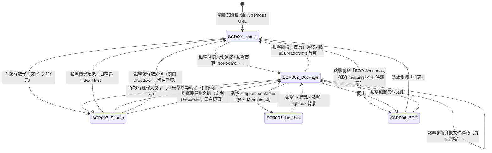

# CLIENT — Client Frontend Design Document (FDD)
<!-- SDLC Client Layer — Frontend Architecture, Screen Flow, Cross-platform Compatibility -->
<!-- 對應角色：Client/Frontend Expert -->
<!-- 回答：前端用什麼技術？畫面怎麼流？跨平台如何相容？如何與靜態資源整合？如何測試？ -->

---

## Document Control

| 欄位 | 內容 |
|------|------|
| **DOC-ID** | CLIENT-GENDOC-20260423 |
| **專案名稱** | gendoc — AI-Driven Implementation Blueprint Generator（HTML 文件站） |
| **文件版本** | v1.0 |
| **狀態** | DRAFT |
| **作者** | Client/Frontend Expert Agent |
| **日期** | 2026-04-23 |
| **上游 PRD** | [PRD.md](PRD.md) |
| **上游 API** | 不適用（靜態站，無後端 API；見 §6） |
| **上游 PDD** | 不存在（見 §5.2 備註） |
| **審閱者** | Tech Lead、QA Lead |

> **注意**：本文件的上游鏈中，BRD、IDEA、PDD、EDD、API.md 均不存在。
> 所有平台選型、功能對齊及效能目標均依 PRD 推斷，並以 `[INFERRED_FROM_PRD]` 標注。

---

## Change Log

| 版本 | 日期 | 作者 | 變更摘要 |
|------|------|------|---------|
| v1.0 | 2026-04-23 | Client/Frontend Expert Agent | 初稿，依 PRD v1.1 及 docs/pages/ 現有實作生成 |

---

## 1. Overview & Purpose

gendoc 的文件站（`docs/pages/`）是一個以 Vanilla HTML/CSS/JavaScript 實作的靜態文件入口網站，部署於 GitHub Pages，由 Python 腳本 `gen_html.py` 在每次文件更新後重新生成。前端不依賴任何 JavaScript 框架或建構工具，所有互動邏輯（側欄切換、拖拉縮放、全文搜尋、Mermaid 圖表 Lightbox）均以原生 DOM API 實作，CDN 載入 Mermaid 11 與 Prism.js 作為唯一外部執行期依賴。本文件涵蓋 HTML 文件站的技術選型、畫面清單與流程、靜態資源整合策略、跨瀏覽器相容性，以及測試與效能目標；不涵蓋 Claude Code skill 的後端 CLI 邏輯（見 PRD §5）或 GitHub Actions 部署設定（見 LOCAL_DEPLOY.md，如存在）。

**適用對象**：前端工程師、QA、技術主管
**不包含**：gendoc skill 的 Python/Bash 邏輯、Claude API 呼叫、K8s 部署

---

## 2. Frontend Tech Stack

### 2.1 Framework Selection

| 項目 | 選型 | 版本 | 選型理由 |
|------|------|------|---------|
| **核心框架** | Vanilla HTML / CSS / JavaScript（無框架） | ES2020+ | 靜態文件站無需 SPA 框架，零依賴降低維護成本；所有邏輯不超過 110 行 JS |
| **語言** | JavaScript（無 TypeScript） | ES2020 | 輕量嵌入式工具，無需型別系統額外複雜度 |
| **建構工具** | Python 腳本（`docs/pages/gen_html.py`） | Python 3（任意現代版） | Markdown → HTML 轉換，自動注入側欄、搜尋索引；無 bundler |
| **套件管理** | 無（CDN 直接載入外部庫） | — | 靜態站，無 node_modules；CDN 版本鎖定於 semver |

### 2.2 平台選型

| 客戶端類型 | 技術方案 | 適用情境 |
|-----------|---------|---------|
| Web 桌面瀏覽器 | 靜態 HTML + CSS Grid + Vanilla JS | 主要使用場景：開發者閱讀生成的技術藍圖 |
| Web 行動瀏覽器 | 響應式 CSS（768px 斷點隱藏側欄） | 技術主管手機查閱文件摘要 |

### 2.3 核心相依套件

| 套件 | 用途 | 版本（CDN 鎖定） |
|------|------|------|
| `mermaid` | 渲染 Mermaid 圖表（flowchart / sequence / ER / C4） | 11.x（`mermaid@11`） |
| `prismjs` | 程式碼語法高亮（Python / Bash / YAML / SQL / Go / TypeScript / JSON） | 1.29.0 |
| `prism-tomorrow` theme | Prism 暗色主題 CSS | 1.29.0（與 Prism 同步） |
| 內建 `fetch` API | 載入 `search-data.json` 進行全文搜尋 | 瀏覽器原生 |
| 內建 `localStorage` | 儲存側欄展開/收合狀態及自訂寬度 | 瀏覽器原生 |

> [INFERRED_FROM_PRD] 以上套件清單從 `gen_html.py` 的 HTML 模板及 `app.js` 直接提取，非推斷。

---

## 3. Target Platforms & Compatibility Matrix

### 3.1 平台支援矩陣

> [INFERRED_FROM_PRD] BRD 不存在，目標平台依 PRD §3.1（「開發者 / PM」、「技術主管 / 客戶」、「AI 開發工具」為主要使用者）及 GitHub Pages 部署環境推斷。

| 平台 | 支援等級 | 最低版本 | 備註 |
|------|---------|---------|------|
| Web（Chrome） | P0-Must | Chrome 100+ | 主要開發者使用瀏覽器 |
| Web（Firefox） | P0-Must | Firefox 100+ | 開源社群標準支援 |
| Web（Safari） | P0-Must | Safari 15.4+（macOS 12.3+） | Apple 生態系開發者常用 |
| Web（Edge） | P1-Should | Edge 100+ | Chromium 核心，相容性高 |
| iOS Safari | P1-Should | iOS 15+ | 技術主管行動查閱；側欄在 768px 以下隱藏 |
| Android Chrome | P1-Should | Android 10+ | 同上 |
| IE 11 / Legacy Edge | Not Supported | — | 顯示「請使用支援的瀏覽器」提示 |

**支援等級定義**：
- **P0-Must**：必須完全相容，任何功能差異為 Critical Bug
- **P1-Should**：目標相容，輕微 UI 差異可接受
- **P2-Nice**：盡力相容，功能降級可接受
- **Not Supported**：明確不支援，顯示「請使用支援的瀏覽器」提示

### 3.2 螢幕尺寸支援

| 類別 | 尺寸範圍 | 代表裝置 | 支援等級 |
|------|---------|---------|---------|
| Mobile S | 320px–375px | iPhone SE | P1-Should（側欄隱藏，單欄閱讀） |
| Mobile L | 376px–428px | iPhone 14 | P1-Should |
| Tablet | 768px–1024px | iPad | P1-Should（768px 臨界點：側欄消失） |
| Desktop | 1280px–1440px | MacBook | P0-Must（主要使用場景） |
| Wide | 1920px+ | 大型顯示器 | P0-Must（側欄寬度自動擴展至 300px+） |

### 3.3 Feature Detection vs User Agent

優先使用 Feature Detection（CSS @supports、ES feature 測試），不依賴 User Agent sniffing。Mermaid 與 Prism 均有各自的 runtime feature check。`localStorage` 存取使用 try/catch 防範 Safari Private Mode 的 SecurityError。

---

## 4. Screen Flow & Navigation Architecture

### 4.1 畫面清單

> [INFERRED_FROM_PRD] 畫面對應來源：PRD §6.6（HTML 文件網站）、PRD §5.1（gendoc-gen-html）

| Screen ID | 名稱 | 路由（GitHub Pages 路徑） | 對應 PRD US/功能 |
|-----------|------|--------------------------|----------------|
| SCR-001 | 文件首頁（Index） | `index.html` / `/` | PRD §6.6 — HTML 文件網站；README.md 轉換為首頁內容 |
| SCR-002 | 文件閱讀頁（Document Page） | `{doc-slug}.html`（如 `prd.html`、`edd.html`） | PRD §6.6 — 每份 Markdown 文件轉換為獨立 HTML 頁面 |
| SCR-003 | 全文搜尋結果（Search Dropdown） | 疊加於 SCR-001 / SCR-002 上方（非獨立頁面） | PRD §6.6 — 自動生成導覽；search-data.json 搜尋索引 |
| SCR-004 | BDD Scenarios 頁 | `bdd.html` | PRD §5.1（gendoc-gen-client-bdd）；僅在 `features/` 目錄有 .feature 檔時生成 |

**畫面生成規則**：SCR-002 的實際數量取決於 `docs/*.md` 的文件數量，由 `gen_html.py` 動態發現。當前已知文件頁包含：`prd.html`。未來生成後將依序增加 `idea.html`、`brd.html`、`edd.html`、`api.html`、`schema.html`、`test-plan.html` 等。

### 4.2 Navigation Map（Mermaid）



**注意**：此文件站為靜態網站，無認證機制，所有頁面均為公開存取。Auth Guard 不適用（見 §4.4）。

### 4.3 Deep Link / URL Scheme

| 路由 | 對應 Screen | 參數 | Guard |
|------|------------|------|-------|
| `index.html` 或 `/` | SCR-001 文件首頁 | — | 無（公開） |
| `prd.html` | SCR-002 PRD 文件頁 | — | 無（公開） |
| `{doc-slug}.html` | SCR-002 任意文件頁 | doc-slug: 文件名稱（小寫） | 無（公開） |
| `bdd.html` | SCR-004 BDD Scenarios | — | 無（公開；僅在 features/ 存在時生成） |
| `search-data.json` | 非頁面（搜尋資料） | — | 無（同域 fetch） |

**Deep Link 行為**：GitHub Pages 直接對應靜態檔案路徑，無需 SPA 路由設定。所有 URL 均為真實檔案，不依賴 history API。

### 4.4 Auth Guard 規則

**不適用。** 此文件站為靜態公開網站，部署於 GitHub Pages，無使用者認證機制。`localStorage` 僅用於儲存 UI 偏好（側欄展開狀態、側欄寬度），不儲存任何身份資訊或 Token。

---

## 5. Component Architecture

### 5.1 Component 層次

> 此站為靜態 HTML，無 JavaScript Component 框架。以 HTML 結構層次描述：

```
HTML 頁面（每個 .html 為獨立文件，由 gen_html.py 生成）
├── <header class="top-nav">          # 頂部導覽列（全域，每頁相同）
│   ├── .nav-brand                    # 品牌連結（返回首頁）
│   └── .nav-controls
│       ├── .search-wrap              # 搜尋框 + 下拉結果
│       │   ├── .search-input         # <input type="search">
│       │   └── .search-results       # 動態插入搜尋結果 Dropdown
│       ├── .nav-gh-link              # GitHub 連結按鈕
│       └── #sidebarToggle            # 側欄展開/收合按鈕
├── <div class="doc-page-banner">     # 頁面標題橫幅
│   ├── .banner-breadcrumb            # 麵包屑導覽
│   └── .banner-title                 # 頁面主標題
├── <div class="page-wrapper">        # 主體 CSS Grid 布局
│   ├── <aside class="sidebar">       # 側邊欄（文件目錄）
│   │   └── .sidebar__link × N        # 每份文件一個連結（active 狀態）
│   ├── #sidebarResizer               # 側欄寬度拖拉把手
│   └── <main class="doc-content">    # 文件內容區域
│       ├── h1 / h2 / h3 / h4         # 標題層次（Markdown 轉換）
│       ├── table                     # Markdown 表格
│       ├── pre / code                # 程式碼區塊（Prism 高亮）
│       ├── .diagram-container        # Mermaid 圖表容器（可點擊放大）
│       └── .index-card × N           # 首頁文件卡片（僅 index.html）
└── .lightbox                         # 圖表放大 Lightbox（JS 動態插入）
    ├── .lightbox__close              # ✕ 關閉按鈕
    └── .lightbox__content            # 放大後的圖表內容
```

### 5.2 共用 UI 組件規格

> PDD 不存在 [INFERRED_FROM_PRD]，規格從 `style.css` 及 `gen_html.py` 模板直接提取。

| Component | 關鍵 CSS Class / HTML | States | 對應 PDD |
|-----------|----------------------|--------|---------|
| 頂部導覽列 | `.top-nav` | — | PDD 未定義；從 style.css 提取 |
| 搜尋輸入框 | `.search-input` | default / focus（border-color: var(--nav-accent)）/ with-results | PDD 未定義 |
| 搜尋結果 Dropdown | `.search-results` / `.search-result-item` | hidden（display:none）/ visible / item:hover | PDD 未定義 |
| 側欄連結 | `.sidebar__link` | default / hover / active（border-left: var(--accent)） | PDD 未定義 |
| 文件卡片（首頁）| `.index-card` | default / hover（translateY(-2px) + shadow） | PDD 未定義 |
| Mermaid 圖表容器 | `.diagram-container` | default / hover（border-color: var(--accent)）/ lightbox-open | PDD 未定義 |
| Lightbox | `.lightbox` / `.lightbox.active` | hidden / visible | PDD 未定義 |
| 側欄拖拉把手 | `.sidebar-resizer` | default / hover / dragging（background: var(--accent)） | PDD 未定義 |
| 側欄收合按鈕 | `.sidebar-toggle` | default / hover | PDD 未定義 |

### 5.3 組件通訊策略

> Vanilla JS，無框架，無 State Management 庫。

| 場景 | 通訊方式 | 理由 |
|------|---------|------|
| 搜尋輸入 → 結果顯示 | DOM Event（`input` event → 直接操作 DOM） | 無需狀態庫；邏輯單純 |
| 側欄收合狀態持久化 | `localStorage.setItem / getItem` | 跨頁面保持 UI 偏好 |
| 側欄寬度持久化 | `localStorage`（key: `sidebar-width`） + CSS custom property | 用 `document.documentElement.style.setProperty` 直接更新 |
| Lightbox 開關 | DOM classList toggle（`.lightbox.active`） | 純 CSS 控制顯示/隱藏 |
| 圖表放大內容傳遞 | `cloneNode(true)` 複製 `.diagram-container` 到 Lightbox | 避免 DOM 共享問題 |
| 搜尋資料初始化 | `async fetch('search-data.json')` → 模組變數 `searchData` | 非同步載入，一次性 |

---

## 6. API Integration Map

### 6.1 Screen × API Endpoint 矩陣

> 此文件站為**完全靜態**，無後端 API 呼叫。唯一的非同步資源請求為搜尋索引載入。

| Screen | 資源請求 | 方法 | 時機 | 失敗處理 |
|--------|---------|------|------|---------|
| SCR-001 / SCR-002 / SCR-003 | `fetch('search-data.json')` | GET（同域靜態檔案） | 頁面初始化（`initSearch()` 呼叫） | `try/catch` 靜默處理；`searchData` 保持 `null`；搜尋功能降級為無反應（不顯示錯誤） |
| SCR-002 | Mermaid ESM（CDN） | `import` via `<script type="module">` | `<head>` 載入時 | CDN 失敗時 Mermaid 區塊顯示原始文字；Prism 失敗時 code 無高亮 |
| SCR-002 | Prism.js + Components（CDN） | `<script src>` | 頁面載入 | 同上 |

**注意**：`search-data.json` 的路徑為**相對路徑**，在 GitHub Pages 子路徑部署時，如果 HTML 頁面不與 `search-data.json` 同層，需調整路徑。目前 `gen_html.py` 將所有檔案輸出至 `docs/pages/`，同層級存取正確。

### 6.2 Auth Token 管理

**不適用。** 靜態公開網站，無認證機制，無 Token。`localStorage` 僅儲存 UI 狀態（`sidebar-collapsed`：boolean、`sidebar-width`：px 字串），與身份驗證無關。

### 6.3 Loading / Skeleton 狀態設計

| 資料類型 | Loading 呈現 | 空資料呈現 | 錯誤呈現 |
|---------|------------|----------|---------|
| 搜尋索引（search-data.json） | 無（fetch 為背景非同步，不阻塞渲染） | 搜尋無反應（Dropdown 不顯示） | 搜尋框 `placeholder` 文字改為「搜尋暫不可用」（attr via JS after catch）；滑鼠指標改為 `not-allowed`；不顯示 Toast（進階增強 §9.3 Baseline — 不影響文件閱讀） |
| Mermaid 圖表渲染 | 顯示原始 `<pre class="mermaid">` 文字直到渲染完成 | — | 顯示原始 Mermaid 語法文字 |
| 文件內容 | 靜態 HTML，無載入狀態 | — | — |

### 6.4 Request / Response 攔截器

> 靜態站無 HTTP Client，無攔截器需求。以下為 `app.js` 中 `initSearch()` 的實際實作摘要：

```javascript
// app.js — initSearch()
let searchData = null;

async function initSearch() {
  try {
    const res = await fetch('search-data.json');
    if (res.ok) searchData = await res.json();
  } catch {
    // 靜默失敗：搜尋功能不可用，但頁面正常運作
  }
}
```

**錯誤策略**：網路錯誤或 HTTP 非 2xx 均靜默處理，搜尋功能降級為不可用，不影響文件閱讀主功能。此設計符合漸進增強原則（§9.3）。

**搜尋索引載入失敗**：更新 `input.placeholder` 為「搜尋暫不可用」並設 `cursor: not-allowed` — 不 throw，不 Toast。

---

## 7. State Management Design

### 7.1 Global State Schema

> Vanilla JS，無 TypeScript，無 Global State 庫。以下為實際執行期的狀態描述：

```javascript
// app.js 模組層級變數（非框架 state）
let searchData = null;  // null = 未載入 / Object = 已載入搜尋索引

// localStorage 持久化狀態
// key: 'sidebar-collapsed'  value: 'true' | 'false'
// key: 'sidebar-width'      value: '{n}px'（如 '260px'）

// DOM 狀態（無 JS 變數，直接透過 CSS class 管理）
// .page-wrapper.sidebar-collapsed — 側欄是否收合
// .lightbox.active              — Lightbox 是否開啟
// .sidebar-resizer.dragging     — 拖拉把手是否啟動中
```

### 7.2 State 分層規則

| 狀態類型 | 管理方式 | 範例 |
|---------|---------|------|
| 非同步資料 | 模組變數（`let searchData`） | 搜尋索引 JSON |
| 持久化 UI 偏好 | `localStorage` | 側欄展開/收合、側欄寬度 |
| 瞬態 UI 狀態 | DOM className / CSS class toggle | Lightbox 開關、搜尋 Dropdown 顯示 |
| 頁面路由狀態 | 無（靜態多頁面，URL = 檔案路徑） | — |

### 7.3 Cache 與持久化

| 資料 | 持久化策略 | TTL | 清除時機 |
|------|----------|-----|---------|
| 側欄收合狀態 | `localStorage`（key: `sidebar-collapsed`） | 永久（用戶手動清除前） | 用戶點擊側欄收合按鈕時更新 |
| 側欄自訂寬度 | `localStorage`（key: `sidebar-width`） | 永久 | 用戶拖拉調整後更新 |
| 搜尋索引 | 記憶體（`searchData` 變數） | 頁面 Session | 頁面卸載時自動釋放 |

---

## 8. Responsive Design & Adaptive Layout

### 8.1 Breakpoint 系統

> 以下 CSS custom properties 從 `docs/pages/assets/style.css` 直接提取（非推斷）：

```css
/* docs/pages/assets/style.css — 實際定義 */
:root {
  --nav-h:      56px;
  --sidebar-w:  260px;       /* 預設側欄寬度 */
}

@media (min-width: 1440px) { :root { --sidebar-w: 280px; } }
@media (min-width: 1920px) { :root { --sidebar-w: 300px; --content-pad-h: 4rem; } }
@media (min-width: 2560px) { :root { --sidebar-w: 320px; --content-pad-h: 5rem; } }

@media (max-width: 768px) {
  /* 行動裝置：單欄布局，側欄隱藏，搜尋框縮短 */
}
```

**斷點總結**：

| 斷點名稱 | 觸發條件 | 側欄寬度 |
|---------|---------|---------|
| Mobile（< 768px） | max-width: 768px | 隱藏（display: none） |
| Desktop（預設）| 768px–1440px | 260px |
| Wide（≥ 1440px） | min-width: 1440px | 280px |
| XWide（≥ 1920px） | min-width: 1920px | 300px |
| XXWide（≥ 2560px） | min-width: 2560px | 320px |

> [INFERRED_FROM_PRD] PDD 不存在，此斷點系統直接對應 style.css 現有實作，無衝突。

### 8.2 Layout Grid 規格

| Breakpoint | 布局方式 | 側欄 | 內容區 Padding |
|-----------|---------|------|---------------|
| Mobile（< 768px） | 單欄（`grid-template-columns: 1fr`） | 隱藏 | 1.5rem 上下 / 1rem 左右 |
| Desktop（768px+） | CSS Grid（`var(--sidebar-w) 4px 1fr`） | 260px | 2.5rem 上下 / 3rem 左右 |
| Wide（1920px+） | 同上 | 300px | 2.5rem 上下 / 4rem 左右 |

### 8.3 自適應策略

Mobile First 原則：`max-width: 768px` 為唯一響應式斷點。

| 元件 | Mobile（< 768px） | Desktop（768px+） | Wide（1920px+） |
|------|------------------|------------------|----------------|
| 側欄 | `display: none`（隱藏） | `position: sticky`，260px 寬，可拖拉縮放 | 自動擴展至 300–320px |
| 搜尋框 | 縮短至 140px 寬 | 200px 寬 | 200px 寬 |
| GitHub 連結按鈕 | `display: none`（隱藏） | 顯示 | 顯示 |
| 文件橫幅 | `padding: 1.5rem 1rem 1rem` | `padding: 2.5rem 2rem 2rem` | 同 Desktop |
| 首頁卡片格 | 單欄自動填充（`auto-fill, minmax(220px, 1fr)`） | 多欄自動填充 | 多欄自動填充 |

### 8.4 Fluid Typography

```css
/* docs/pages/assets/style.css — 實際定義 */
body { font-size: 15px; line-height: 1.7; }
.doc-content h1 { font-size: clamp(1.5rem, 3vw, 2rem); }
.doc-content h2 { font-size: clamp(1.125rem, 2vw, 1.5rem); }
.banner-title    { font-size: clamp(1.5rem, 3vw, 2.25rem); }
```

---

## 9. Cross-Platform Compatibility

### 9.1 Feature Parity Matrix

| 功能 | Web Chrome | Web Firefox | Web Safari | iOS Safari | Android Chrome |
|------|-----------|------------|-----------|-----------|----------------|
| 文件閱讀（靜態 HTML） | ✅ | ✅ | ✅ | ✅ | ✅ |
| 全文搜尋（fetch + DOM） | ✅ | ✅ | ✅ | ✅ | ✅ |
| Mermaid 圖表（ESM import） | ✅ | ✅ | ✅ | ✅（iOS 15+） | ✅ |
| Prism 語法高亮 | ✅ | ✅ | ✅ | ✅ | ✅ |
| Lightbox（CSS + DOM） | ✅ | ✅ | ✅ | ✅ | ✅ |
| 側欄拖拉縮放（mousedown/move） | ✅ | ✅ | ✅ | ⚠️ 不支援（無 mouse events） | ⚠️ 不支援 |
| localStorage | ✅ | ✅ | ✅ | ⚠️ Private Mode 拋 SecurityError | ✅ |
| CSS Grid（sidebar layout） | ✅ | ✅ | ✅ | ✅（iOS 15+） | ✅ |
| CSS Custom Properties | ✅ | ✅ | ✅ | ✅ | ✅ |
| `scroll-behavior: smooth` | ✅ | ✅ | ✅ | ✅（iOS 15.4+） | ✅ |

**圖例**：✅ 完整支援 ｜ ⚠️ 降級/workaround ｜ ❌ 不支援

### 9.2 Platform-Specific Workarounds

| 問題 | 影響平台 | Workaround | 測試驗證方式 |
|------|---------|-----------|------------|
| iOS Safari Private Mode 中 `localStorage.setItem` 拋出 SecurityError | iOS Safari（所有版本 Private Mode） | `app.js` 中 `localStorage` 存取已包裹於 `try/catch`（現有實作）；失敗時 UI 偏好不持久，但功能正常 | 在 iOS Safari Private 模式開啟頁面，確認無 JS 錯誤，側欄正常顯示 |
| iOS Safari 無 `mousedown / mousemove` 事件 | iOS Safari、iOS Chrome | 側欄拖拉縮放功能在 touch 裝置上不可用；Mobile 斷點下側欄本已隱藏，影響範圍僅限平板橫向（768px–1024px）桌面模式 | 在 iPad 上驗證側欄固定寬度無法拖拉，但不影響閱讀 |
| Safari autoplay 限制 | iOS Safari 14 以下 | 本站不含 `<audio>` / `<video>` 自動播放，不適用 | — |
| `position: sticky` 在 overflow 容器內失效 | Safari 15 以下 | `.sidebar` 的 `position: sticky` 依賴 `.page-wrapper` 無 `overflow: hidden`；現有 CSS 已符合此要求 | Safari 15 下滾動頁面確認側欄固定 |
| 100vh 在 iOS Safari 底部工具列問題 | iOS Safari（所有版本） | 本站 `min-height: calc(100vh - var(--nav-h))` 僅用於容器最小高度，不影響關鍵功能；視覺上底部可能有空白 | 在 iPhone Safari 中確認頁面無內容被工具列遮蓋 |

### 9.3 Progressive Enhancement

| 功能層級 | 適用平台 | 實作方式 |
|---------|---------|---------|
| Baseline | 所有 P0/P1 平台 | 靜態 HTML + CSS 文件閱讀（無 JS 也可閱讀內容） |
| Enhanced | 支援 ES2020 + fetch 的現代瀏覽器 | 搜尋功能、側欄互動、Lightbox、UI 偏好持久化 |
| Full-featured | 支援 ESM import（ES2022+）的現代瀏覽器 | Mermaid 圖表渲染、Prism 語法高亮、圖表放大 Lightbox |

---

## 10. Frontend Test Strategy

### 10.1 測試金字塔

```
         ┌─────────────┐
         │  E2E Tests  │  (Playwright)
         │  ~10%       │  P0 Screen Flows
    ┌────┴─────────────┴────┐
    │  Integration Tests    │  — 靜態站，僅需驗證 gen_html.py 輸出正確性
    │  ~20%                 │  Python pytest（驗證 HTML 結構）
┌───┴───────────────────────┴───┐
│  Unit Tests                   │  (Playwright component / 目前無框架 unit test)
│  ~70%                         │  (Vitest 可測試純函式，目前 JS 邏輯僅 110 行)
└───────────────────────────────┘
```

> [INFERRED_FROM_PRD] 測試框架依 CLIENT.gen.md 技術推斷規則：Vanilla JS → Playwright（E2E）/ Vitest（unit）。

### 10.2 Unit Test 規範

| 測試類型 | 框架 | 覆蓋率目標 | 對應 BDD Tag |
|---------|------|----------|------------|
| `gen_html.py` Python 邏輯（Markdown 解析、HTML 生成） | pytest | 95%+ | @unit |
| `app.js` 純函式（搜尋過濾邏輯，如提取） | Vitest | 90%+ | @unit |
| CSS 視覺迴歸 | Playwright 截圖 | 關鍵 Screens × 2 Breakpoints | @visual |

> **覆蓋率類別對照**：`app.js` DOM 互動邏輯 → Component（80%+）；`app.js` initSearch / initSidebar 函式 → Hook/Service（90%+）；`gen_html.py` Python 工具函式 → Utils（95%+）。

### 10.3 E2E 測試覆蓋

| 流程 | 工具 | 覆蓋 Screen | 優先度 |
|------|------|------------|-------|
| 文件首頁載入 + 側欄顯示 + index-card 點擊進入文件頁 | Playwright | SCR-001 → SCR-002 | P0 |
| 搜尋輸入 → 搜尋結果 Dropdown 顯示 → 點擊跳轉 | Playwright | SCR-001/002 → SCR-003 → SCR-002 | P0 |
| Mermaid 圖表顯示 + 點擊放大 + Lightbox 關閉 | Playwright | SCR-002 + Lightbox | P0 |
| 側欄收合 → 展開 → 狀態持久化（重新載入） | Playwright | SCR-001 / SCR-002 | P1 |
| 行動版（375px）—— 側欄隱藏、單欄閱讀 | Playwright（mobile viewport） | SCR-001 / SCR-002 | P1 |
| BDD Scenarios 頁面（條件式） | Playwright | SCR-004 | P1 |

> **SCR-004 注意**：僅當 `features/` 目錄存在時執行；驗證 `bdd.html` 正確生成且側欄顯示 BDD Scenarios 連結。

### 10.4 Visual Regression

| 工具 | 快照目標 | 閾值 |
|------|---------|------|
| Playwright 截圖比對 | SCR-001（Index）× 2 Breakpoints（375px / 1440px）；SCR-002（PRD 頁）× 2 Breakpoints | < 0.1% diff |

> PDD 不存在，Visual Regression 以 Playwright 截圖為主要品質保證手段。

### 10.5 Cross-browser 自動化

| 工具 | 涵蓋瀏覽器 | CI 觸發條件 |
|------|-----------|-----------|
| Playwright（多瀏覽器模式） | Chromium、Firefox、WebKit（Safari） | PR merge 或 `gen_html.py` 更新後 |

---

## 11. Performance Budget

### 11.1 Bundle Size 上限

> 靜態站無 JS bundle（無 bundler），以下為每頁傳輸量估算：

| 資源 | 大小估算 | 備註 |
|------|---------|------|
| HTML 頁面（每頁） | < 50KB（未壓縮） | Markdown 轉換的 HTML，含模板 |
| `assets/style.css` | < 10KB（未壓縮） | 目前約 6KB |
| `assets/app.js` | < 5KB（未壓縮） | 目前約 3.4KB（110 行） |
| `search-data.json` | < 50KB（依文件數量） | 9 份文件預估 ~20KB |
| Mermaid ESM（CDN） | ~900KB（未壓縮）/ ~300KB gzip | CDN 快取，不計入 initial load |
| Prism.js + themes（CDN） | ~150KB total（未壓縮）/ ~50KB gzip | CDN 快取 |

**總 Initial Load（不含 CDN）**：< 120KB 未壓縮，遠低於 350KB 預算上限。

### 11.2 Core Web Vitals 目標

| 指標 | 目標 | 測量工具 |
|------|------|---------|
| LCP | < 2.5s | Lighthouse / WebPageTest（GitHub Pages） |
| INP | < 200ms | Chrome UX Report（互動：搜尋輸入、側欄點擊） |
| CLS | < 0.1 | Lighthouse（主要風險：Mermaid 渲染後的 layout shift） |
| FCP | < 1.5s | Lighthouse（靜態 HTML，無 JS 阻塞渲染） |
| TBT | < 200ms | Lighthouse（Mermaid ESM 為非同步載入，不阻塞主線程） |

**CLS 風險注意**：Mermaid `<pre class="mermaid">` 渲染完成後，圖表尺寸可能導致 layout shift。建議在 `.diagram-container` 上設定 `min-height` 預留空間（見 §12.3 及 §13.3）。

### 11.3 Asset 最佳化規則

| 資源類型 | 最佳化策略 |
|---------|----------|
| HTML | `gen_html.py` 輸出不含多餘空白；CDN 資源版本鎖定（避免意外升級） |
| CSS | 單一 `style.css`，無需 critical CSS 提取（首屏 CSS 全部 < 10KB） |
| 字型 | 系統字型優先（`system-ui, "Segoe UI", "PingFang TC", ...`），無自訂字型，無字型預載需求 |
| 圖片 | 目前僅有 README badge 圖片，使用 `loading="lazy"` 及 `onerror` fallback |
| Mermaid / Prism | 非同步 CDN 載入，不阻塞首屏渲染；版本鎖定防止 CDN 更新破壞相容性 |

---

## 12. Frontend Security

### 12.1 XSS 防護

| 風險點 | 防護措施 |
|-------|---------|
| Markdown → HTML 轉換 | `gen_html.py` 使用 `html.escape()` 轉義純文字內容；僅 code block、inline code 及特定 HTML 元素例外 |
| 搜尋結果 Dropdown | `app.js` 使用 template literal 插入 `${d.title}` 及 `${d.excerpt}`；`search-data.json` 由 `gen_html.py` 在建構期生成，非用戶輸入，但仍建議在 `gen_html.py` 輸出時對 title / excerpt 做 HTML escape |
| `innerHTML` 使用 | `app.js` 中 `searchResultsEl.innerHTML = hits.map(...)` 使用模板字串插入 CDN-linted 路徑及 `gen_html.py` 生成的 excerpt；風險低（非用戶輸入），但需確保 `gen_html.py` 輸出的 excerpt 已 escape |
| `cloneNode(true)` | Lightbox 使用 `cloneNode` 複製 DOM，不引入新的 XSS 向量 |

**建議改進**（非阻塞）：在 `app.js` 的搜尋結果渲染中，使用 `document.createElement` + `textContent` 替代 `innerHTML` 模板字串插入，以消除潛在 XSS 風險。

### 12.2 Content Security Policy（CSP）

> [INFERRED_FROM_PRD] GitHub Pages 目前不支援自訂 HTTP Response Headers（需透過 meta 標籤或第三方 CDN 如 Cloudflare）。以下為建議的 CSP 配置，可於未來遷移至支援 headers 設定的平台時啟用。

```
Content-Security-Policy:
  default-src 'self';
  script-src 'self'
    https://cdn.jsdelivr.net;
  style-src 'self' 'unsafe-inline'
    https://cdn.jsdelivr.net;
  img-src 'self' data: https:;
  connect-src 'self'
    https://ibalasite.github.io;
  font-src 'self';
  frame-src 'none';
  object-src 'none';
  base-uri 'self';
```

**說明**：
- `script-src https://cdn.jsdelivr.net`：Mermaid ESM + Prism.js
- `style-src 'unsafe-inline'`：Mermaid 和 Prism 動態插入 style；可在確認 nonce 方案後收緊
- `connect-src https://ibalasite.github.io`：`fetch('search-data.json')` 的同源請求（GitHub Pages 域名）
- **注意**：Mermaid ESM 使用 `import()` 動態載入，CSP 的 `script-src` 需包含 `https://cdn.jsdelivr.net`

### 12.3 敏感資料處理

| 資料類型 | 禁止行為 | 正確處理 |
|---------|---------|---------|
| `localStorage` UI 偏好 | 不存入任何用戶身份資訊或 API key | 僅存 `sidebar-collapsed`（boolean）和 `sidebar-width`（px）|
| 文件內容 | 不在文件中 inline 任何 secret 或 private key | 文件為公開技術規格，設計上不含敏感資訊 |
| GitHub 倉庫 URL | `GITHUB_REPO` 硬編碼於 `gen_html.py` 中（公開 URL，無 secret） | 公開 URL 符合規範 |

---

## 13. Build & Bundle Configuration

### 13.1 Build 目標與指令

| 環境 | 指令 | 輸出目錄 | 備註 |
|------|------|---------|------|
| 本地開發 / 預覽 | `python docs/pages/gen_html.py` | `docs/pages/` | 需 Python 3；直接在瀏覽器開啟 `docs/pages/index.html` 或使用 `python -m http.server` |
| Staging | 不適用（無獨立 staging 環境；PR preview 依賴 GitHub Actions 自動部署至 gh-pages branch） | `docs/pages/` 同 prod | External |
| GitHub Pages 部署 | 同上（由 GitHub Actions 或手動執行後 push） | `docs/pages/`（`docs/` 作為 Pages source） | 無獨立 staging 環境；由 git push 觸發 Pages 更新 |

> 此為靜態站，無 webpack / Vite / esbuild。「建構」即執行 `gen_html.py` 將 `docs/*.md` 轉換為 `docs/pages/*.html`。

### 13.2 環境變數規範

| 變數名稱 | 位置 | 用途 | 值 |
|---------|------|------|-----|
| `GITHUB_REPO` | `gen_html.py` 第 16 行（Python 常數） | GitHub 倉庫連結，用於 Nav bar 和首頁 Breadcrumb | `https://github.com/ibalasite/gendoc` |
| `APP_NAME` | `gen_html.py` 第 17 行（Python 常數） | 顯示於頂部導覽列和頁面標題 | `gendoc` |

> ⚠️ 以上均為**公開值**，硬編碼於 `gen_html.py` 中。無前端環境變數（無 .env 或 build-time injection），嚴禁包含 API Secret、Private Key 等敏感資訊。

### 13.3 Code Splitting 策略

**不適用（無 bundler）。** 資源載入策略如下：

| 資源 | 載入方式 | 預載策略 |
|-----|---------|---------|
| `assets/style.css` | `<link rel="stylesheet">`（同步） | 首屏關鍵 CSS，完整載入 |
| `assets/app.js` | `<script src>`（defer 行為，因位於 `</body>` 前） | 不阻塞渲染 |
| Mermaid ESM | `<script type="module">` 內 `import mermaid from CDN` | 非同步，不阻塞 |
| Prism.js | `<script src>`（位於 `</body>` 前） | 不阻塞渲染 |
| `search-data.json` | `fetch()`（JS 執行後非同步載入） | 非阻塞背景載入 |

**Mermaid CLS 緩解**：建議在 `.diagram-container` 新增 `min-height: 100px`，以減少 Mermaid 渲染完成後的 Layout Shift（見 §11.2）。

---

## 14. Internationalization（i18n）

### 14.1 語言支援

**現階段不支援多語系。** 文件站以繁體中文為主（`lang="zh-Hant"`），UI 文字（搜尋框 placeholder、側欄 label、頁面標題）均為繁體中文硬編碼於 `gen_html.py` 模板中。英文內容（README、PRD 英文段落）以原文呈現。

| Locale | 語言 | 預設 | 備註 |
|--------|------|------|------|
| `zh-TW` | 繁體中文 | ✅ | UI 及文件主語言 |
| `en` | 英文 | ❌ | README 及部分文件含英文內容，以原文呈現 |

### 14.2 UI 文字來源

所有 UI 文字硬編碼於 `gen_html.py` 的 `HTML_TEMPLATE` 及 `PAGE_META` 字典中。如需支援多語系，需修改 `gen_html.py` 的模板生成邏輯，加入語言切換機制。

### 14.3 日期 / 數字格式

文件站不含動態日期/數字顯示（所有內容均為靜態 Markdown 轉換），此節不適用。

---

## 15. Appendix

### 15.1 前端資料夾結構

```
docs/
├── pages/                   # gen_html.py 的輸出目錄（GitHub Pages source）
│   ├── index.html           # SCR-001 文件首頁（README.md 轉換）
│   ├── prd.html             # SCR-002 PRD 文件頁（PRD.md 轉換）
│   ├── {doc-slug}.html      # SCR-002 其他文件頁（依 docs/*.md 動態生成）
│   ├── bdd.html             # SCR-004 BDD Scenarios（依 features/ 存在而生成）
│   ├── search-data.json     # 全文搜尋索引（gen_html.py 生成）
│   └── assets/
│       ├── style.css        # 全站 CSS（Design Token、Layout、Component 樣式）
│       └── app.js           # 全站 JS（搜尋、側欄互動、Lightbox）
├── gen_html.py              # HTML 生成腳本（Python 3，版本 2.8.0）
│                            # ⚠️ 注意：此檔案在 docs/pages/ 目錄下，而非 docs/ 下
```

> **注意**：`gen_html.py` 的實際位置為 `docs/pages/gen_html.py`，讀取上層 `docs/*.md` 作為輸入，輸出至同層 `docs/pages/*.html`。

### 15.2 Git Commit 規範（Frontend / HTML 文件站）

```
feat(client): 新增 {doc-slug}.html 頁面（{文件名} 文件頁）
fix(client): 修正側欄在 Safari 15 的 position:sticky 問題
fix(client): 修正 iOS Safari Private Mode localStorage 錯誤
refactor(client): 重構 gen_html.py md_to_html() 邏輯
perf(client): 降低 Mermaid 渲染的 CLS（新增 min-height 預留）
style(client): 更新 style.css Design Token（斷點、側欄寬度）
test(client): 新增 Playwright E2E — 搜尋 Dropdown 流程
```

### 15.3 已知限制與未來改進

| 項目 | 現況 | 建議改進 |
|------|------|---------|
| 搜尋功能 | 僅支援 title + excerpt 字串比對，無全文搜尋 | 考慮使用 Fuse.js 或 FlexSearch 加強搜尋品質 |
| 側欄 Touch 支援 | 拖拉縮放僅支援 mouse events，不支援 touch | 新增 `touchstart/touchmove/touchend` 事件支援 |
| Mermaid CLS | 圖表渲染後可能有 Layout Shift | 在 `.diagram-container` 新增 `min-height` |
| `innerHTML` XSS | 搜尋結果使用 `innerHTML` 插入（低風險） | 改用 `createElement` + `textContent` |
| GitHub Pages CSP | 無法設定 HTTP Response Headers | 遷移至 Cloudflare Pages 或使用 `<meta http-equiv="Content-Security-Policy">` |
| BDD 頁面 | 僅在 `features/` 存在時生成，目前不存在 | 執行 `gendoc-gen-client-bdd` 後自動生成 |

---
