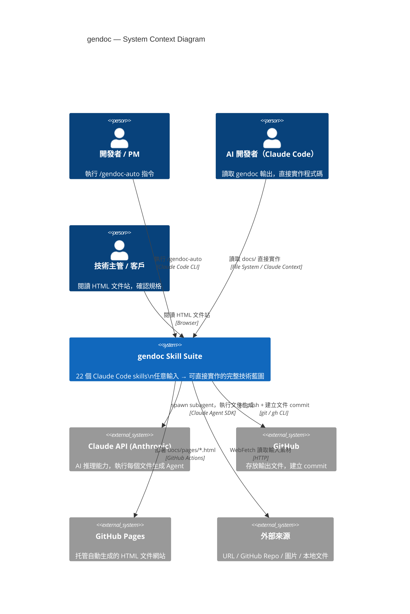
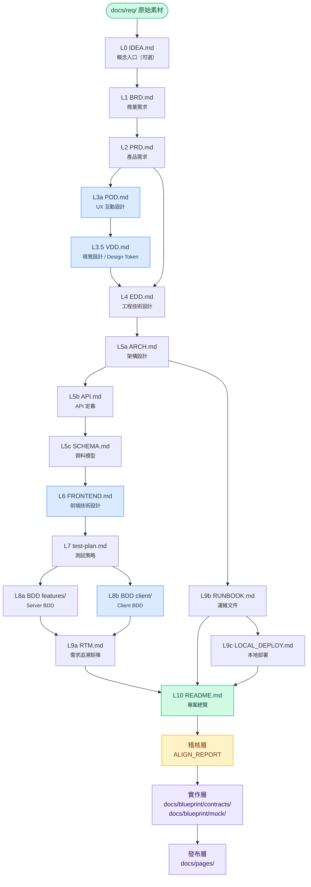
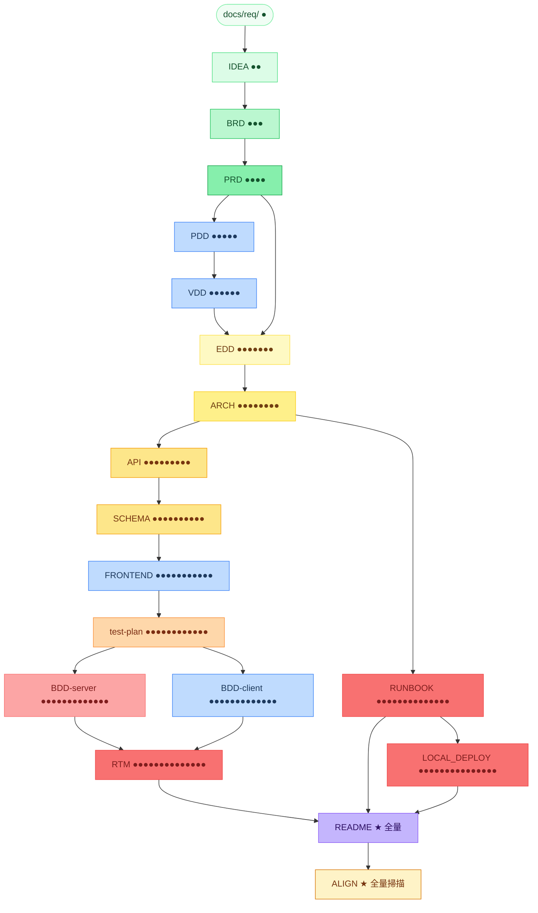

# PRD — Product Requirements Document
<!-- 對應學術標準：IEEE 830 (SRS)，對應業界：Google PRD / Amazon PRFAQ -->
<!-- Version: v3.6 | Status: ACTIVE | DOC-ID: PRD-GENDOC-20260422 -->

---

## Document Control

| 欄位 | 內容 |
|------|------|
| **DOC-ID** | PRD-GENDOC-20260422 |
| **產品名稱** | gendoc — AI-Driven Implementation Blueprint Generator |
| **文件版本** | v3.6 |
| **狀態** | ACTIVE |
| **作者（PM）** | AI Product Manager Agent |
| **日期** | 2026-05-04 |
| **上游來源** | gendoc 開源專案（github.com/ibalasite/gendoc） |
| **審閱者** | 技術架構師、QA Lead |
| **核准者** | 待定 |

---

## Change Log

| 版本 | 日期 | 作者 | 變更摘要 |
|------|------|------|---------|
| v3.6 | 2026-05-04 | PM Agent | **Clean Architecture / SOLID 全 pipeline 嵌入 + HA / Spring Modulith HC-1~HC-5 完整審計**：(1) **EDD §3.1b 新增 Clean Architecture & SOLID 契約**：§1.2 設計原則改為固定 CA+SOLID 錨點（移除 placeholder）；新插入 §3.1b 骨架節，含 5 原則 SOLID 表（SRP/OCP/LSP/ISP/DIP 各填本系統 class/interface 名稱）、Dependency Rule 方向圖（Presentation → Application → Domain ← Infrastructure）、禁止清單（Domain 不得 import ORM/DB/HTTP；Application 不得直接 new Infrastructure 具體類別）；EDD.gen.md 重命名章節（「Clean Code 架構」→「§3.1b Clean Architecture & SOLID 原則」）並加入 3 項自我檢查；EDD.review.md 新增 [HIGH] 1b — SOLID 宣告缺失（具體 class 名稱未填）；(2) **CA/SOLID 下游對齊全面補完**：ARCH.gen.md 加入 EDD §3.1b 讀取清單（DIP Interface 名稱 → ARCH §2 前置）、ARCH.review.md 新增 [HIGH] 11b（依賴方向與 §3.1b 不一致）；`gendoc-gen-diagrams` SKILL.md 加入 §3.1b 讀取 + 2 個 CA 品質閘門（Domain 層禁 RepositoryImpl / Infrastructure 箭頭方向驗證）；test-plan.gen.md §3.1 Unit Test 依 CA 分層重寫（Domain ≥90% / Application ≥80% / Infrastructure →Integration）；test-plan.review.md 新增 [HIGH] 9b（Unit Test 未依 CA 分層）；DEVELOPER_GUIDE.gen.md 新增 Step 6b（§7 CA 分層說明生成：Import 規則表 + SOLID 快速對照 + DIP 注入 FAQ）；DEVELOPER_GUIDE.review.md 新增 [HIGH] R-12b（§7 CA 分層缺失或 SOLID 表仍為佔位符）；(3) **HA / SCALE / BCP + Spring Modulith HC-1~HC-5 全 pipeline 審計與缺口補完**：對所有 gen.md + review.md 進行系統性掃描，識別 5 個缺口並全部補完：ARCH.gen.md §5.3 新增 HC-3 強制規則（跨 BC 通訊必須用版本化 Domain Event，事件定義表加 Schema 版本欄 + Consumer BC(s)）；ARCH.review.md 新增 AM-02b [HIGH]（HC-3 Domain Event 缺失），Layer 5B 更新為 HC-1～HC-5 共 5 項；SCHEMA.review.md 新增 Layer 7 BC 隔離（[CRITICAL] 29 跨 BC DB-level FK 存在 / [HIGH] 30 缺 BC Ownership 宣告）；API.review.md 新增 Layer 10 Spring Modulith BC 對齊（[CRITICAL] BC-01 §3 未依 BC 分組 / [HIGH] BC-02 跨 BC 呼叫端點未標注 / [MEDIUM] BC-03 §14 HA 核查清單缺 Domain Event 冪等性）；test-plan.review.md 新增 Layer 7 Spring Modulith 驗證測試（[CRITICAL] SM-T01 §3.8 缺失 / [HIGH] SM-T02 未納入 CI 阻斷條件 / [MEDIUM] SM-T03 HC-3 冪等性測試缺失）；確認 EDD / LOCAL_DEPLOY / runbook 已完整覆蓋，無需修改；(4) **README 第 3 設計原則**：新增「Clean Architecture + SOLID — Dependency Rule Enforced」，包含 4 層架構表、Import 規則、禁止清單，引用 Robert C. Martin 文獻。 |
| v3.5 | 2026-05-03 | PM Agent | **Pipeline.json SSOT 完全化 + get-upstream 輸入抽象層**：(1) **刪除冗餘定義**：移除 `metrics[]` 陣列和 `condition_syntax` 物件，縮小 pipeline.json 規模（metrics 提取規則應在各 step .gen.md 定義，condition 解釋屬於文檔層面，不在 pipeline.json 中）；(2) **各 step 加 `input` 字段**：定義該 step 所需的上游文件清單——無章節標記（`"docs/IDEA.md"`）讀整個檔案，有章節標記（`"docs/BRD.md§2"`）只讀該章節；DRYRUN 例：`input: ["docs/IDEA.md", "docs/BRD.md", ..., "docs/ARCH.md"]`，API 等 step 按現有 .gen.md 的上游文件清單搬遷；(3) **新增 `get-upstream` 工具**（`tools/bin/get-upstream.sh`）：根據 pipeline.json 的 step input 定義，讀取並返回目標項目中的檔案/章節內容（JSON 格式）；無複雜邏輯，純文件讀取 + 章節篩選；(4) **各 step .gen.md 改動**：Step 0 改為調用 `get-upstream --step <STEP_ID>`，取得 INPUT_DATA（包含所有所需文件內容），後續步驟從 INPUT_DATA 中 grep/sed 提取 metrics 和資料（原有邏輯不動）；刪除硬編碼的「上游文件清單」；(5) **職責邊界明確**：pipeline.json 只定義「需要什麼文件」，get-upstream 只負責「讀什麼文件」，.gen.md 仍負責「如何提取和轉換資料」；三層分工，無重複定義。 |
| v3.4 | 2026-05-03 | PM Agent | **DRYRUN 完全 SSOT 架構 + 動態規格推導引擎**（確定方案）：核心改變為**完全 Single Source of Truth**，所有指標定義與規格規則均從 `templates/pipeline.json` 動態讀取（無硬編碼）。(1) **metrics 陣列**：20 個量化指標定義（id、source_step、grep_pattern、fallback）⚠️ **[SUPERSEDED by v3.5]**：metrics[] 陣列已於 v3.5 刪除，指標提取邏輯改為 dryrun_core.py 內的 7 個專用私有方法；(2) **spec_rules 欄位**：每個 DRYRUN 后的 step 的檢查規格（quantitative_specs、content_mapping、cross_file_validation）⚠️ **[SUPERSEDED by v3.5]**：巢狀子物件已平坦化為 flat key/value；(3) **核心承諾**：新增節點時只需修改 pipeline.json + 三件套模板，無需改代碼（仍有效）；(4) **DRYRUN 代碼**：移除 502 行硬編碼，精簡至 205 行，純通用邏輯⚠️ **[SUPERSEDED]**：目前 dryrun_core.py 為 644 行，含 7 個參數提取私有方法；(5) **擴展性**：DRYRUN 前後新增節點時自動適應，DRYRUN 無需改動（仍有效）；(6) **統一檢查工具 review.sh**（200+ 行），支援 4 種完整檢查模式⚠️ **[SUPERSEDED by v3.5]**：review.sh 為單一模式，20 個 measure_* 函數，不支援 4 種模式；(7) **DRYRUN 后的 step 雙層檢查**：AI findings + Shell findings 合併驗收（仍有效）。實施順序：D-ARCH-SSOT（3 天）→ R-3（2 天）→ R1-2-4 驗證（1 天）。 |
| v3.3 | 2026-05-03 | PM Agent | _(版本號保留；此批次變更與 v3.4 合併發布，無獨立 Change Log 條目)_ |
| v3.2 | 2026-05-03 | PM Agent | **UML Class Diagram 品質強化 + UML-CLASS 三件套 + 誤導性引用清除**：(1) **gendoc-gen-diagrams §2.9 補 3 個品質閘門**：每張 class diagram 含 ≥ 6 個 class（含 ≥ 1 `<<interface>>`）、全部 6 種關聯類型（Inheritance / Realization / Composition / Aggregation / Association / Dependency）各 ≥ 1 次、每張圖末端附「技術說明」＋「白話說明」段落；(2) **建立 UML-CLASS 三件套實驗工具**（`templates/UML-CLASS.md` + `templates/UML-CLASS.gen.md` + `templates/UML-CLASS.review.md`）：完全隔離的獨立工具，不進生產流程，供 `/gendoc UML-CLASS` 呼叫；(3) **清除 5 處誤導性 UML-CLASS-GUIDE.md 引用**：`UML-CLASS-GUIDE.md`（1111 行靜態教學文件）確認為 pipeline 完全不讀取的早期手動期遺留物，已 `git rm`；`EDD.review.md` Fix hint（2 處）改為正確指向 `gendoc-gen-diagrams` skill；`PRD.md` UML 輸出描述改為正確的 gendoc-gen-diagrams 四輸出欄位；`SKILL.md` alias `uml-class → UML-CLASS`（修正路由錯誤）；`skills/reviewdoc/SKILL.md` 移除實驗工具 alias；(4) **設計原則寫入 CLAUDE.md**：gendoc-gen-diagrams 是唯一 UML 生成來源，/gendoc UML-CLASS 是實驗性工具完全隔離，不進生產流程或任何生產文件。 |
| v3.1 | 2026-05-03 | PM Agent | **gendoc-repair v2.0：DRYRUN-aware 補全 + DRYRUN 整合**：目標從「列出缺漏步驟」升級為「把任何不完整的目標專案補到與 gendoc-auto + gendoc-flow 從頭執行完全一致的狀態」。核心改動：(1) **相位邊界識別**：diff 結果分三區顯示——DRYRUN 前的 step（pre-DRYRUN：IDEA→ARCH）、DRYRUN Gate（量化基線校準器）、DRYRUN 后的 step（post-DRYRUN：API→HTML）；報告清楚顯示三區缺漏，而非 flat list；(2) **DRYRUN 三態偵測**（新 Step 1.6）：偵測 DRYRUN 狀態為「未執行」/「用預設值執行」/「正常執行」，並輸出機器可讀標記 `DRYRUN_STATUS`；(3) **DRYRUN 上游就緒度預檢**：在建議執行 DRYRUN 前，掃描 EDD entity count、PRD US count、ARCH layer count，不足時警告「DRYRUN 將使用保守預設值，品質閘門可能偏鬆」；(4) **DRYRUN 基線過時偵測**：比對 git 時間戳——若 EDD/PRD/ARCH 比 `.gendoc-rules/` 更新，標示基線可能過時並建議重跑；(5) **Step 1.5 品質門檻驗證升級**：原本只查檔案存在，升級為讀取 `.gendoc-rules/<step-id>-rules.json` 驗 min_h2_sections / required_sections 存在 / no_placeholder_strings，新增 QUALITY_FAIL 嚴重性層級；(6) **DRYRUN-aware Step 3 提示**：三條件分支——DRYRUN 前缺漏（維持現有補跑）、DRYRUN 前完整但 DRYRUN 未跑（引導先跑 DRYRUN）、DRYRUN 完整但 DRYRUN 后缺漏（顯示品質基線可用後補跑）；(7) **兩階段補跑模式**：選項「先補 DRYRUN 前 → 自動觸發 DRYRUN → 再補 DRYRUN 后」，完整實作三段接力執行流程。**硬性約束**：本版只修改 gendoc-repair skill，不動其他任何 skill。 |
| v3.0 | 2026-05-03 | PM Agent | **gendoc-config UX 重設計：兩層選單 + 循環修改 + Step 4c 必填補問**：(1) **主選單四項**：「重設流程進度」/ 「修改審查強度」/ 「修改專案設定」/ 「✅ 確認完成，儲存離開」；(2) **兩層設計**：「修改專案設定」展開第二層（client_type / has_admin_backend / 清除全部設定），「重設流程進度」展開第二層（全部重跑 / 從某 STEP 開始），解決 AskUserQuestion 4 選項上限問題；(3) **循環模式**：每個設定完成後回到 Step 1 主選單，使用者可多次修改，完成後選「✅ 確認完成」才儲存離開；(4) **Step 4c 必填強制補問**：選「確認完成」前先檢查 client_type / has_admin_backend / review_strategy 是否均已設定，缺哪項就強制問哪項，確保 state file 無空值；(5) **has_admin_backend 可設定**：從 gendoc-config 互動設定，影響 ADMIN_IMPL 步驟是否執行；(6) **pipeline.json 動態讀取**：step picker 第二層選單從 pipeline.json 動態生成，新增步驟不需改 gendoc-config。 |
| v2.9 | 2026-05-02 | PM Agent | **DEVELOPER_GUIDE.md — 開發者日常操作手冊（建置之後的每日操作層）**：(1) **填補真實空白**：LOCAL_DEPLOY.md 負責「第一次建起來」（一次性），runbook.md 負責「生產事故處理」，CICD.md 負責「pipeline 設計」；三者均不覆蓋開發者建置完成後的每日操作；(2) **新增 `DEVELOPER_GUIDE.md` template 三件套**：§1 每日開發工作流程 step-by-step（git push → Jenkins 觸發 → pipeline 監控 → ArgoCD sync → 應用驗證）；§2 CI/CD 診斷（Jenkins 未觸發 / stage 失敗重跑 / ArgoCD OutOfSync / Gitea webhook 除錯）；§3 本地環境快速指令（`make dev-status` / `make dev-logs` / `make dev-restart` / `make dev-health`）；§4 常見問題 + 解法（本地 namespace 版本，與 runbook.md 的生產版本明確區隔）；§5 環境維護（密碼 rotate、image 清理、完全重置）；(3) **受眾明確分離**：runbook.md 目標讀者 = SRE / On-call（生產事故）；DEVELOPER_GUIDE.md 目標讀者 = 開發者（日常開發操作），不混用；(4) **pipeline.json 新增 D21-DEVELOPER_GUIDE step**；文件類型 `developer-guide` 可通過 `/gendoc developer-guide` 生成；(5) **PRD LOCAL_DEPLOY 標準 #6 補充**：DEVELOPER_GUIDE.md 作為 LOCAL_DEPLOY.md 的日常操作配套文件納入藍圖品質標準 |
| v2.8 | 2026-05-02 | PM Agent | **Local Developer Platform：Gitea + Production Parity + 非開發者可用的完整 CI/CD**：(1) **核心需求**：任何人（含非開發者）在本機執行 `make dev-tools-up` 後，即擁有完整的 CI/CD flow——Gitea（本地 git server）→ Jenkins（CI pipeline）→ ArgoCD（CD GitOps）→ 應用自動部署——不需要遠端 GitHub/GitLab 帳號，不需要了解 k8s；(2) **Production Parity 原則**（12-Factor App #10）：本地環境與生產環境使用完全相同的工具鏈（Jenkins + ArgoCD + Kubernetes），差異只在規模與 TLS；本地通過的 pipeline 在生產不會因「工具不同」而失敗；(3) **Port 域分離設計**：應用域（Port 80，面向使用者/測試人員）與開發工具域（Port 3000 Gitea / Port 8080 Jenkins / Port 8443 ArgoCD，面向開發者）明確分開，不衝突、可同時運行；(4) **CICD.md 新增章節**：§8 Local Developer Platform（Gitea pod 設計、dev-tools namespace 架構圖、Gitea→Jenkins webhook、ArgoCD 以 Gitea 為 source）；§9 Makefile dev-tools targets（`make dev-tools-up` / `make gitea-ui` / `make jenkins-ui` / `make argocd-ui` / `make dev-tools-status`）；(5) **LOCAL_DEPLOY.md §21 更新**：完整 Gitea 安裝步驟、本地 git push workflow、Jenkins SCM 指向本地 Gitea、非開發者 onboarding 指引（4 步驟完成完整 CI/CD 環境設置）；(6) **CICD.md 新增**至 pipeline.json（D20-CICD）；文件類型 `cicd` 可通過 `/gendoc cicd` 生成；(7) **PRD LOCAL_DEPLOY 標準 #6 擴充**：CI/CD 工具平台需求加入藍圖品質標準 |
| v2.7 | 2026-05-01 | PM Agent | **架構重設計：Dev/Runtime 分離 + 統一 setup 工具**：(1) **Clone 位置根本性修正** — 從 `~/projects/gendoc/`（開發目錄兼 runtime）改為 `~/.claude/skills/gendoc/`（純 runtime），徹底解決 SessionStart hook 每小時 `git pull` 可能覆蓋開發者未提交工作的風險；`~/projects/gendoc/` 恢復為純開發目錄，不再是任何人的 runtime 依賴。(2) **統一 `setup` 工具**：廢除 `install.sh`、`install.py`、`bin/gendoc-upgrade` 三個重複入口，整合為單一 `setup` 指令（預設=install）支援 `install` / `uninstall` / `upgrade` 三個子命令；macOS/Linux 用 `setup`、Windows 用 `setup.ps1`。(3) **`bin/gendoc-env.sh` 路徑唯一真相**：新增環境變數宣告檔（`GENDOC_DIR` / `GENDOC_BIN` / `GENDOC_TEMPLATES` / `GENDOC_TOOLS`），所有 skill 和腳本均 `source` 此檔取得路徑，消除各處硬編碼 `~/projects/gendoc` 的違規。(4) **`tools/bin/` Pipeline 工具目錄**：`gen_html.py` 從 `bin/` 移至 `tools/bin/`，區分基礎設施腳本（`bin/`）與流水線工具（`tools/bin/`）。(5) **SKILL.md 移至 repo 根目錄**：從 `skills/gendoc/SKILL.md` 移至 `SKILL.md`，與 gstack 慣例一致。(6) **Fix-D 修正**：`gendoc-auto`、`gendoc-flow`、`gendoc-repair`、`reviewdoc` 4 個 skill 移除硬編碼 `$HOME/projects/gendoc` 路徑，改為 source `gendoc-env.sh` 後呼叫 `$GENDOC_DIR/setup upgrade`。(7) **架構違規稽核**：建立 `VIOLATION_AUDIT.md`，記錄並解決 20 項架構違規（7×P2、8×P3、3×P4、2×D）。 |
| v2.6 | 2026-04-28 | PM Agent | **CLIENT_IMPL 客戶端實作規格書 + pipeline.json 成為唯一維護入口 + Phase D-2 Agent 包裝**：(1) 新增 D10d-CLIENT_IMPL 步驟（條件 `client_type != none`，位於 D10c-ANIM 之後），三件套模板（CLIENT_IMPL.md + CLIENT_IMPL.gen.md + CLIENT_IMPL.review.md），5-way 引擎路由 —— 依 EDD §3.3 自動偵測 CLIENT_ENGINE，分別為 Cocos Creator（cc.Node 樹、cc.assetManager.loadBundle、cc.EventTarget 事件驅動、cc.AudioSource pool、Prefab Object Pool）/ Unity WebGL（Hierarchy GameObject 樹、Addressables、Animator.SetTrigger、AudioMixer）/ React（JSX 組件樹、React.lazy + Suspense、Framer Motion / GSAP、pages/components/store 三層）/ Vue（SFC 組件樹、defineAsyncComponent、Pinia stores / composables）/ HTML5（DOM 結構、Web Audio API / Howler.js、Preload Manager、requestAnimationFrame）展開對應場景結構、資源載入策略、動畫觸發、AudioManager 架構、VFX 整合規格；`gendoc/SKILL.md` 新增 client-impl / client_impl / cocos / unity / react-impl / vue-impl 等 6 個型別別名。(2) **pipeline.json 成為唯一維護入口**：`gendoc-config` step picker 和 `gendoc-shared` STEP_SEQUENCE / STEP_ORDER / Review Loop 適用清單全部改為執行時動態讀取 pipeline.json（python3 解析），消除 skill 間硬編碼同步問題；新增步驟只需修改 pipeline.json 一個檔案，其他所有 skill 自動跟上。(3) **gendoc-flow Phase D-2 → Agent subagent 包裝**：每份文件的 review→fix loop 改由 Agent tool 委派給獨立 subagent 執行，主 Claude context 不再累積 12+ 文件 × 5 輪的 review/fix 輸出，pipeline 可持續運行至 D19 不被 context window 撐爆，回傳格式統一為 REVIEW_LOOP_RESULT 緊湊結構。 |
| v2.5 | 2026-04-28 | PM Agent | **具體建置成功標準明確化**：在「什麼是可實作的藍圖」新增 LOCAL_DEPLOY / Runbook / 跨文件一致性三條標準，明確定義 gendoc 產出必須能讓 AI 或人類 step-by-step 在 local 建置完整 k8s 環境（Rancher Desktop）、client 封進 k8s pod、對外僅一個 port、docker-compose 為輔助工具、所有 Unit / Integration / E2E 測試可完整執行、跨文件品質如各自聲明的標準且上下文對齊無缺漏。 |
| v2.4 | 2026-04-26 | PM Agent | **gendoc-shared 集中守衛 + Phase D-2 Review Loop**：`gendoc-shared` 從純參考文件改為可執行 Skill 入口（`allowed-tools: [Bash, Skill]`），負責執行 R-01 State File Guard（檢查 state file 是否存在，不存在則完整呼叫 `gendoc-config`）；`gendoc-auto` / `gendoc-flow` Step -1 移除 inline guard 邏輯，改為一行 Skill tool 呼叫 `gendoc-shared`，等其完全回傳後才繼續（禁止在 Skill tool 回傳前讀取任何檔案或執行任何準備動作），達成 **單一維護點**原則。`gendoc-config` 確立為 state file 唯一建立者，其他所有 skill 禁止自行建立 state file。`gendoc-auto` Step 5.5（IDEA Review Loop）與 Step 5.7（BRD Review Loop）從 Agent→subagent→reviewdoc 雙重委派架構改為 **Phase D-2** 模式：主 Claude 直接驅動 Review subagent → Fix subagent → Round Summary → Commit per round，與 `gendoc-flow` 統一，解決雙重委派導致 review 輸出不可見、每輪 Summary 消失的問題。 |
| v2.3 | 2026-04-25 | PM Agent | **Mermaid 跨瀏覽器相容性強化（全模板套用）**：將 `stateDiagram-v2` transition label 禁止 `<br/>` 的規則從 Frontend-only 擴展至所有會生成 stateDiagram 的 template —— `FRONTEND.gen.md` §4.2、`PDD.gen.md` §4、`PRD.gen.md` §6 均補入明確禁止聲明；`gendoc-gen-diagrams/SKILL.md` §2.8 Server State Machine 同步補齊（之前只有 Frontend 段落有此規則）。新增 `sequenceDiagram` participant 名稱禁止 `<br/>` 規則（改用 `participant alias as 簡短名稱` 格式）至 `gendoc-gen-diagrams/SKILL.md` 參與者宣告段落。新增禁止使用 Mermaid 實驗性圖表（`pie` / `xychart-beta` / `bar`）的規則至 `gendoc-gen-diagrams/SKILL.md` Step 4 注意清單 —— 跨瀏覽器相容性差，資料分佈改用 `graph TD` 或 HTML 表格替代。新增 EDD.review.md CRITICAL 審查門 `5b-sm`：stateDiagram-v2 transition label `<br/>` 檢查（Safari/Firefox 破圖風險）。根本原因：fishgame 專案 HTML 文件站出現多個 Mermaid 破圖，追溯至 `<br/>` 語法不相容問題，本版修補所有生成規則源頭。 |
| v2.2 | 2026-04-25 | PM Agent | **Frontend UML 全覆蓋 + HTML 文件站圖表頁面 + D16-ALIGN-F 自動修復步驟**：gendoc-gen-diagrams 新增 Step 2B —— 條件觸發（`client_type != none` AND `FRONTEND.md` 存在），從 FRONTEND.md / PDD.md / VDD.md 生成 16 種前端 UML 圖（use-case / class×3 [元件層/場景控制器/Client 服務] / object / sequence×3 [WS 協議/場景切換/主遊戲交互] / state×2 [場景/UI 元件] / activity×3 [遊戲主流程/UI 互動/客戶端初始化] / component [引擎節點樹] / deployment [建構管線] / communication [WS 協議互動]），全部輸出至 `docs/diagrams/frontend-*.md`；強制規範：stateDiagram-v2 transition label 禁止使用 `<br/>` 語法（改用 `trigger [guard] / action` 格式 + `note` 區塊）。gendoc-gen-html 升級至 **v3.0.0** —— gen_html.py 新增 `scan_diagram_pages()` 掃描 `docs/diagrams/*.md`，每個圖表生成獨立 HTML 頁面（`diag-{stem}.html`）；側欄從單一「文件」區改為三區（文件 / Server UML / Frontend UML）；新增 `DIAGRAM_META` 對應 35+ 圖表類型。D16-ALIGN-F 新增至 pipeline.json（位於 D16-ALIGN 之後）—— special_skill: gendoc-align-fix，依 ALIGN_REPORT.md 逐條自動修復對齊問題，每條 fix 驗證後 commit，不走標準 gen→review 流程。 |
| v2.1 | 2026-04-25 | PM Agent | **流水線 D17–D19 重組 + 實作藍圖目錄統一**：新增 D17-CONTRACTS（gendoc-gen-contracts）—— 從所有設計文件提取機器可讀規格（OpenAPI 3.1 YAML / JSON Schema / Pact / Helm values.yaml / Seed Code），輸出集中至 `docs/blueprint/contracts/` + `docs/blueprint/infra/` + `docs/blueprint/scaffold/`；新增 D18-MOCK（gendoc-gen-mock）—— 生成 FastAPI mock server（含擬真假資料 JSON 檔、CORS、Swagger UI、Postman 支援、Windows/macOS 跨平台啟動手冊），輸出至 `docs/blueprint/mock/`（整個目錄可帶走使用）；D19-HTML（gendoc-gen-html）後移至最後，確保 HTML 文件站可收錄所有藍圖內容；pipeline.json 更新 step 語意編號（D16=ALIGN 稽核、D17=CONTRACTS 實作、D18=MOCK 實作、D19=HTML 發布）；gendoc-config 重跑選單同步更新；gendoc-shared §5 STEP_SEQUENCE 以 D-prefix dict 格式完整對應 pipeline.json 23 步驟。 |
| v2.0 | 2026-04-25 | PM Agent | **UML 1:1 實作完整度升級**：EDD.gen.md §4.5 和 gendoc-gen-diagrams/SKILL.md §2.1–§2.11 全面重寫——從「最少幾張、含哪些類型」升級為「開發者只有 UML 圖、沒有其他文件，也能 1:1 實作出完整系統」的精確規格。強制標準：Class Diagram 屬性 `visibility name: Type`、方法完整簽名、Enum 列全值、關聯線兩端 cardinality + role label；Sequence Diagram 每個箭頭精確方法名 + 型別 + 回傳型別、alt 分支有具體條件、每個 Mutation ≥ 3 個 Error Path；State Machine 每個 transition `trigger [guard] / action` 三段必填；Activity Diagram 泳道強制 + 決策點兩分支具體標注；Component / Deployment 技術版本 + 埠號 + 協定在每個節點和連線上都要有。驗證清單擴充為 30+ 條精確檢查項目。**Template 生成規則章節對應修正**：runbook.gen.md 補充 §8 Routine Maintenance（維護排程 / DB 維護 / Log 輪替 / 容量審查）；LOCAL_DEPLOY.gen.md 補充 §8 Test Data & Fixtures / §11 Logs & Debugging / §12 Port Reference / §13 Local HTTPS 生成規則；SCHEMA.gen.md Self-Check §3 → §2.4 Soft Delete 修正章節對應；RTM.gen.md 補充 §2 Status Code 靜態對照表生成規則。 |
| v1.9 | 2026-04-25 | PM Agent | **專案類型三值化**：client_type 從二值（web/none）擴展為三值（`game`/`web`/`api-only`）；AUDIO/ANIM 條件從 `client_type != none` 改為 `client_type == game`（僅遊戲專案生成）；game 偵測關鍵字新增 20+ 詞（魚機/捕魚/博弈/canvas/webgl/phaser 等）。**新增 gendoc-gen-prototype skill**：偵測 client_type 自動選擇原型模式 — game/web 生成可點擊 UI 原型（HTML5 自包含，模擬動線）、api-only 生成 API Explorer（雙模式參數輸入：Chip 快選 + 自由輸入；預設值建議；Request Body Preset；localStorage auth；Copy as cURL；hash 深連結）。**新增 reviewtemplate skill**：TYPE.md + TYPE.gen.md + TYPE.review.md 三件套品質審查與修復 loop，支援 standard/exhaustive 策略。**P-14**：D03-PRD 完成後重新驗證 client_type（Step 0-C 執行時 PRD 尚未生成，可能漏判遊戲關鍵字）；`client_type_source: "manual"` 防止自動偵測覆寫手動設定。**P-15**：Total Summary 前 Pipeline 完整性掃描，驗證所有預期步驟均有記錄，防止誤標 `pipeline_complete`。**gendoc-config** 新增第 5 選項「手動設定 client_type」。 |
| v1.8 | 2026-04-24 | PM Agent | 新增音效與動畫特效設計文件：AUDIO.md（BGM/SFX/VO 清單、音效觸發狀態機、Cocos/Unity/HTML5 Howler.js 引擎設定、資產規格、效能預算）+ ANIM.md（骨骼/幀/Tween 動畫、粒子特效、Shader 特效、Cocos/Unity/HTML5 PixiJS 引擎設定、效能預算 + LOD 三級策略）；各含 gen.md（3 角色專家、引擎自動偵測、品質門）與 review.md（18~20 條審查項，含 CRITICAL/HIGH 覆蓋邏輯與效能閘）；pipeline.json 新增 D10b-AUDIO + D10c-ANIM（條件 client_type != none，位於 FRONTEND 之後、test-plan 之前）|
| v1.7 | 2026-04-24 | PM Agent | UML 9 大圖完整性強化（P1-P3）：新增 D07b-UML 流水線步驟（pipeline.json）；gendoc-gen-diagrams 完全重寫 → 輸出 9 種 UML + class-inventory.md（1:1:N class→test 追蹤）；EDD.gen.md §4.5 修正編號對齊、新增多圖原則強制規定；EDD.review.md 新增 CRITICAL 5b/5c UML 完整性與 class inventory 審查門；test-plan.gen.md 讀取 class-inventory 並依 TC-ID 格式（TC-UNIT-{MODULE}-{SEQ}-{S/E/B}）展開測試；RTM.md/RTM.gen.md 新增 §15.3 UML 圖追蹤矩陣與 §15.4 Class→Test 覆蓋追蹤（method 覆蓋率 <80% 觸發 WARNING）；PRD.gen.md/PRD.md User Story 新增 Activity Diagram 關聯欄位；API.review.md 新增 Layer 8 Sequence Diagram 完整性檢查 |
| v1.6 | 2026-04-24 | PM Agent | P-13 client_type 自動推斷修補：gendoc-flow Step 0-C 新增 IDEA/BRD/PRD 關鍵字掃描（50+ UI 關鍵字，含遊戲/魚機/觸控螢幕），空值或舊 "none" 自動修正為 "web" 或 "api-only"；gendoc-shared state schema 更新（"" 取代 "none" 為預設值，新增 "api-only" 顯式跳過語意）；修正漁機等嵌入式 UI 專案被錯誤跳過的問題 |
| v1.5 | 2026-04-24 | PM Agent | 視覺化圖表：§5.2 SOP Mermaid 流程圖、§5.3 文件層次關係圖（graph TD）+ 累積上游關聯圖（graph LR，色彩深度反映知識密度）；4 個 skill 同步更新（reviewdoc、gendoc-gen-client-bdd、gendoc-align-check 文件樹、gendoc-config step ID）；新增 docs/gendoc-redesign-decisions.md 設計決策記錄；修正 Document Control 上游來源欄位 |
| v1.4 | 2026-04-24 | PM Agent | 12 項流水線可靠性修補（P-01～P-12）：斷點續行重寫（review_progress schema）、quality_status 三態分類、failed_steps 追蹤、special_completed 旗標、pipeline_hash 版本偵測、BDD 增量生成模式、commit trailer 完整記錄 |
| v1.3 | 2026-04-24 | PM Agent | 補入 §5.5 Gen/Review/Fix 三專家模式與 Expert Roles 完整表；修正 §7.5/§8 BDD 模板欄位（BDD.md → BDD-server.md + BDD-client.md）；State file 完整欄位說明 |
| v1.2 | 2026-04-24 | PM Agent | 重建文件流水線：加入 VDD（視覺設計）、FRONTEND 獨立步驟、RTM 移至 BDD 之後；修正累積上游鏈；D01-D17 完整編號（後於 v2.1 擴展至 D01-D19） |
| v1.1 | 2026-04-22 | PM Agent | 重新定位核心使命：從文件生成工具 → 可直接實作的開發藍圖生成器；補充藍圖細粒度品質標準 |
| v1.0 | 2026-04-22 | PM Agent | 初版 PRD，從既有 SDLC 自動化工具萃取文件生成子系統，建立獨立 gendoc skill 套件 |

---

## 1. Executive Summary

### 核心使命

**gendoc 的目標是：讓任何人或任何 AI，拿到產出的文件後，不需要問任何問題，就能直接開始實作。**

市面上的文件生成工具產出的是「可閱讀的說明文件」，但 gendoc 產出的是「可實作的開發藍圖」。兩者的差距在於細粒度：

| 普通技術文件 | gendoc 開發藍圖 |
|------------|---------------|
| 描述功能意圖 | 定義到 class、method 簽名、參數型別 |
| 說明 API 端點 | 包含每個欄位的型別、驗證規則、錯誤回應範例 |
| 提及需要測試 | 列出具體測試情境、邊界值、等價類劃分 |
| 描述資料結構 | 給出 Schema DDL、index 策略、constraint 定義 |
| 說明架構組件 | 包含 sequence diagram、component 間呼叫合約 |

### 什麼是「可實作的藍圖」

gendoc 生成的每份文件都必須達到以下標準，才視為合格輸出：

1. **EDD（Engineering Design Doc）**：每個 module 的 class 清單；每個 class 的 method 簽名、參數名稱、型別、回傳值、例外行為；跨 class 的呼叫關係圖
2. **API.md**：每個端點的 URL、HTTP method、request body schema（含欄位、型別、是否必填、驗證規則）、response schema、error code 列舉、Rate Limit
3. **SCHEMA.md**：完整 DDL；每個欄位的型別、nullable、default、constraint；全部 index（含 composite）；外鍵關係；migration 策略
4. **test-plan.md**：每個功能點的正向測試、負向測試、邊界值分析（BVA）；等價類劃分（EP）；具體輸入值與預期輸出值的對照表
5. **BDD.md**：每個 Scenario 的 Given/When/Then 完整定義；edge case Scenario；unhappy path Scenario
6. **LOCAL_DEPLOY.md + DEVELOPER_GUIDE.md（配套二件）**：LOCAL_DEPLOY.md 負責第一次建置（step-by-step，含 k8s 環境、所有服務、CI/CD 工具平台）；DEVELOPER_GUIDE.md 負責建置後的每日操作（git push → CI → CD → 驗證的完整工作流程，CI/CD 診斷，本地快速指令，常見問題，環境維護）；**client 也封進 k8s pod**，所有服務均在 k8s 內；**對外只有一個 port（Port 80）**，測試入口單一；同時提供 docker-compose 版本作為輔助（兩種方式均可無礙建置，不能有缺漏步驟或 TBD）；**Local Developer Platform 完整可用**：Gitea（Port 3000）+ Jenkins（Port 8080）+ ArgoCD（Port 8443）均以 k3s pod 運行，透過 `make dev-tools-up` 一鍵啟動；開發工具 port 與應用 port 80 域分離、不衝突；**Production Parity**：本地與生產使用完全相同工具鏈，差異只在規模與 TLS
7. **Runbook.md**：所有操作步驟具體到指令層級（含 namespace、context、port-forward 指令）；不含模糊描述；含驗證指令讓執行者確認每步成功
8. **跨文件上下文一致性**：所有文件（BRD → PRD → PDD → EDD → ARCH → API → SCHEMA → test-plan → BDD → Runbook → LOCAL_DEPLOY）的內容必須互相對齊，上游定義的規格下游必須遵守，不得有衝突或沉默遺漏；任何一份文件聲明的品質標準，其產出必須如實達到，不能打折

### 雙受眾設計

| 受眾 | 如何使用 gendoc 產出 |
|------|--------------------|
| **AI（LLM / Claude Code）** | 直接餵入文件，不需追問，依 EDD 建 class、依 SCHEMA 寫 migration、依 test-plan 寫 test cases |
| **人類開發者** | 開箱即用的任務清單：每個 class 是一張卡片，每個 method 是一個 subtask，每個 test 情境是一個 checklist item |

### 一句話定位

> gendoc 是一套 Claude Code Skill 系統，從任意形式的輸入（文字 / 圖片 / URL / Git repo），在 60 分鐘內生成一份「細到任何人都能直接開始寫程式碼」的完整技術藍圖，包含 IDEA → BRD → PRD → PDD → VDD → EDD → ARCH → API → SCHEMA → FRONTEND → Test Plan → BDD → RTM → Runbook → LOCAL_DEPLOY → **Contracts（OpenAPI/Schema/Pact）→ Mock Server（FastAPI）**，以及自動部署的 HTML 文件站（含完整 UML 圖表頁：Server 端 9 大 UML + 前端 16 種 UML，側欄自動分三區）。

---

### 1.4 設計依據 — SDLC 文件架構分層原則

#### 1.4.1 文件流程的理論基礎

gendoc 的文件流程植根於**軟體開發生命週期（Software Development Lifecycle, SDLC）**，並將傳統 Requirements Engineering 與 Design 階段進一步細分為四個層次，以提升跨職能團隊的溝通效率與決策品質：

| 層次 | 文件 | 核心問題 | 標準對應 | 主要受眾 |
|------|------|---------|---------|---------|
| **L1 — Business Requirements（商業需求）** | IDEA · BRD | **Why**：市場機會與商業價值 | ISO/IEC/IEEE 29148 BRS、IIBA BABOK v3 | 決策者、產品負責人 |
| **L2 — System Requirements（系統需求）** | PRD · CONSTANTS | **What**：功能範圍與需求定義 | IEEE 830 SRS、ISO 29148 SyRS | PM、QA、利害關係人 |
| **L3 — UX / Interaction Design（互動設計）** | PDD · VDD · FRONTEND | **How it works**：使用流程與體驗設計 | Cockburn Goal-Level Use Cases | UX 設計師、前端工程師 |
| **L4 — Architecture / Detailed Design（詳細設計）** | EDD · ARCH · API · SCHEMA | **How to build**：系統架構與實作方式 | ISO/IEC/IEEE 42010、Kruchten 4+1 Views | 後端工程師、DevOps |

此分層原則的核心洞察：**每個層次只回答一個問題、只服務一個受眾**。業務決策（Why）不應與技術實作細節（How to build）混在同一份文件，否則每個受眾都需要讀完全文才能找到自己需要的資訊，跨職能溝通效率極低。

#### 1.4.2 學術與行業標準依據

**國際標準**

| 標準 | 發布機構 | 年份 | 與 gendoc 的關聯 |
|------|---------|------|----------------|
| **ISO/IEC/IEEE 29148:2018** — Requirements Engineering Life Cycle Processes | ISO / IEC / IEEE | 2018（取代 IEEE 830） | 定義三層需求架構：BRS → StRS → SyRS，直接對應 gendoc 的 L1（BRD）→ L2（PRD）邊界 |
| **ISO/IEC/IEEE 42010:2011** — Architecture Description | ISO / IEC / IEEE | 2011（取代 IEEE 1471） | 確立架構描述（L4）獨立於需求規格（L1–L3），以 viewpoint + view 記錄架構決策 |
| **IEEE Std 830-1998** — Software Requirements Specifications | IEEE | 1998 | 確立 SRS「描述 what，不描述 how」黃金原則；L2（PRD）與 L4（EDD）分層的規範基礎 |
| **IEEE 1471-2000** — Architecture Description of Software-Intensive Systems | IEEE | 2000 | 以 stakeholder concerns 驅動架構視角，強化需求與架構的分離設計 |

**學術著作**

- **Wiegers & Beatty, *Software Requirements* 3rd ed. (Microsoft Press, 2013)**  
  業界最廣泛引用的需求工程實踐指引，明確三層：*business requirements*（Why）→ *user requirements*（What users do）→ *functional requirements*（What system does），直接對應 L1 → L2 邊界。

- **Robertson & Robertson, *Mastering the Requirements Process* 3rd ed. (Addison-Wesley, 2012)**  
  Volere Requirements Specification Template（全球超過 20,000 次下載）以 Project Purpose（商業目標＝L1）→ Product Scope（系統範圍＝L2）→ Functional Requirements（行為需求＝L2/L3）分層描述需求。

- **Cockburn, *Writing Effective Use Cases* (Addison-Wesley, 2000)**  
  使用案例目標層級：Summary（雲端，組織目標＝L1）→ User-goal（海平面，使用者目標＝L2）→ Sub-function（魚類，實作細節＝L3/L4）。Design Scope 概念正式化「系統做什麼」與「如何實作」的分界。

- **Nuseibeh & Easterbrook, "Requirements Engineering: A Roadmap" (*ICSE 2000*, ACM)**  
  RE 領域基礎調查論文（引用 1,000+ 次）。明確區分 *problem space*（業務領域與利害關係人目標）與 *solution space*（系統規格與設計），支持 L1/L2 與 L3/L4 的邊界設計。

- **Kruchten, "Architectural Blueprints: The 4+1 View Model" (*IEEE Software*, 1995)**  
  Use Case View（使用案例＝L2/L3）→ Logical / Process / Physical Views（架構＝L4）的四加一視圖模型，是 gendoc ARCH.md 設計的直接參考來源。

- **Evans, *Domain-Driven Design* (Addison-Wesley, 2003)**  
  Bounded Context 與 Ubiquitous Language 對齊業務需求（L1/L2）與系統設計（L4）的方法論；gendoc CONSTANTS.md 的跨層詞彙對齊機制即植根於此。

**行業框架**

- **IIBA BABOK v3 (2015)** — 全球業務分析標準，明確 business requirements（Why）與 solution requirements（What/How）為獨立知識領域，對應 L1 vs. L2
- **IREB CPRE Syllabus (2022)** — 全球 70+ 國 RE 認證課綱，區分商業需求、系統需求與設計約束三層
- **TOGAF Standard 10th Edition (The Open Group, 2022)** — Business → Data → Application → Technology 四層企業架構，80% Global 50 企業採用，與 L1–L4 分層一致
- **Scrum Guide (Schwaber & Sutherland, 2020)** — Product Goal（L1）→ Product Backlog（L2）→ Sprint / DoD（L3/L4）的敏捷三層化，為輕量級 SDLC 的業界標準

#### 1.4.3 AI 驅動 SDLC 的學術驗證

最新 AI 多智能體研究進一步驗證：**明確的文件分層是 AI 可靠實作的結構性前提**。

- **MetaGPT (ICLR 2024, arXiv:2308.00352)** — Sirui Hong et al., DeepWisdom  
  以標準化作業程序（SOP）驅動 LLM 多智能體 pipeline，依序產出 PRD → System Design → Code。在 HumanEval 等基準上遠超單一 LLM。驗證「分層文件先行」不是選項，而是 AI 軟體工程的必要條件。

- **ChatDev (ACL 2024, arXiv:2307.07924)** — Chen Qian et al., Tsinghua University  
  多智能體軟體工廠，以角色分工（需求分析師 → 系統設計師 → 程式設計師 → 測試員）模擬完整 SDLC chat chain。驗證：需求模糊 → 設計偏差 → 實作錯誤的因果鏈；gendoc 的分層精確性正是打斷此因果鏈的機制。

**核心結論**：gendoc 的四層文件架構不是繁文縟節，而是 Requirements Engineering 學術研究 40 年與 AI 工程研究 5 年共同指向的答案——**分層、精確、可傳遞的知識表達，是人類與 AI 都能可靠實作的最小前提**。

---

## 2. Problem Statement

### 2.1 現狀痛點

#### 問題一：「可閱讀」≠「可實作」

現有技術文件工具（包括 AI 生成）產出的文件偏向說明性，缺乏足夠細節讓實作者直接動手。常見問題：

- EDD 只說「需要一個 UserService 處理使用者邏輯」，但沒有列出 `UserService` 裡有哪些 method
- API 文件列出端點路徑，但 request 欄位的 validation rule、error code 的 HTTP status mapping 都缺失
- 測試文件只說「測試登入功能」，但沒有給出：密碼長度邊界（7 / 8 / 129 / 130 字元）、特殊字元處理、並發登入、token 過期邊界等具體場景

結果：開發者或 AI 拿到文件後，仍需大量「填空」，等同於沒有藍圖。

#### 問題二：AI 開發者的需求更嚴苛

當「開發者」是 AI（如 Claude Code 驅動的 AI Agent）時，模糊的文件直接導致錯誤實作：

- class 邊界不清 → AI 可能把不同職責混在同一 class
- method 簽名未定義 → AI 可能自創不相容的介面
- 測試情境未列 → AI 生成的 test 只覆蓋 happy path，缺少 edge case
- 邊界值未定義 → AI 無從判斷 `0 ≤ quantity ≤ 999` 還是 `1 ≤ quantity ≤ 9999`

**gendoc 的核心假設**：如果文件細到 AI 能直接實作，人類一定也能。但反過來不成立。

#### 問題三：技術文件生成需要完整 SDLC 工具

市面上的 SDLC 自動化工具通常功能繁多。許多場景只需文件生成能力，安裝整套是過度設計。

#### 問題四：模板系統缺乏細粒度品質標準

現有模板描述「這份文件應包含哪些章節」，但沒有定義每個章節的「細粒度完成標準」。

#### 問題五：Local 建置文件無法閉環驗證

現有文件常見問題：LOCAL_DEPLOY / Runbook 只說「執行 kubectl apply」但沒有給出完整的 namespace、context、port-forward 指令；client 未封進 k8s pod 導致需要額外手動步驟；docker-compose 與 k8s 設定不同步；無法用文件中的指令跑完所有 Unit / Integration / E2E 測試而不需額外猜測或補充步驟。

### 2.2 根本原因分析

- **根本原因一**：文件生成的品質目標設定錯了——目標應是「可實作且可閉環驗證」，而非「可閱讀」
- **根本原因二**：現有 AI 生成文件缺乏細粒度驗證機制，無從判斷文件是否達到「可直接實作」的標準
- **根本原因三**：原有文件生成子系統與 SDLC 完整工具緊耦合，無法單獨萃取
- **根本原因四**：LOCAL_DEPLOY / Runbook 缺乏「建置閉環」概念——文件視為說明書而非可執行的 SOP，導致 k8s 建置、client 封裝、port 管理步驟散落且缺漏

### 2.3 機會假設

| ID | 假設 | 驗證指標 |
|----|------|---------|
| H-1 | 若 EDD 細到 class + method 層級，AI 實作時的重構次數可降低 60% 以上 | 對比有/無細粒度 EDD 的 AI 實作輪次 |
| H-2 | 若 test-plan 包含具體 BVA + EP 情境，測試覆蓋率首次執行即可達 85% 以上 | 首次 AI 生成 test 的覆蓋率 |
| H-3 | 若 gendoc 可獨立安裝，安裝成本降低 80%，使用者從安裝到產出第一份文件 ≤ 5 分鐘 | 安裝到完成 IDEA.md 的時間 |
| H-4 | Full-Auto 模式下 60 分鐘內完成 9 份完整文件集 | 端對端生成時間 |

### 2.4 System Context Diagram



---

## 3. Stakeholders & Users

### 3.1 Stakeholder Map

| 角色 | 關係 | 主要關切 |
|------|------|---------|
| 獨立開發者 | 主要使用者 | 快速從構想生成完整可實作藍圖 |
| AI 開發工具（Claude Code / Cursor） | 主要消費者 | 文件細粒度夠高，可直接依文件建 class / 寫 test |
| 技術主管 | 次要使用者 | 文件品質、結構一致性、規格完整性 |
| 開源專案維護者 | 次要使用者 | 從現有 codebase 生成規格文件 |

### 3.2 User Personas

#### Persona A：獨立開發者 / 技術文件需求者

| 欄位 | 內容 |
|------|------|
| **背景** | 全端工程師，需要為新專案快速生成完整技術文件集，再交給 AI（或團隊）實作 |
| **核心需求** | 文件細到不需要再補充說明，AI 拿去就能生成第一版可運行程式碼 |
| **痛點** | 手工撰寫文件耗時 2-4 週；AI 生成文件太模糊，實作時仍需大量追問 |
| **成功標準** | 60 分鐘內完成 9 份文件；Claude Code 讀取文件後首次生成程式碼通過 CI |

#### Persona B：開源專案維護者

| 欄位 | 內容 |
|------|------|
| **背景** | 有現有 Git repo，想為其生成正式規格文件，供 contributor 或 AI 參考實作 |
| **核心需求** | 從 codebase 逆向生成包含 class 設計、API spec、test 情境的完整文件集 |
| **痛點** | 逆向工程文件品質低落，缺少測試情境、邊界值定義 |
| **使用場景** | `/gendoc-auto https://github.com/user/repo`，輸入類型自動偵測為 `codebase_git` |

#### Persona C：AI 開發工具（Claude Code）

| 欄位 | 內容 |
|------|------|
| **背景** | 作為後續程式碼生成工具，讀取 gendoc 產出的 docs/ 目錄，依文件實作系統 |
| **核心需求** | EDD 中每個 class 的 method 列表；SCHEMA 的完整 DDL；test-plan 的具體輸入/輸出對照 |
| **失敗條件** | 文件中有「TBD」、「待定」、「視情況而定」等未決定項目 → 視為文件不合格 |

---

## 4. 藍圖品質標準（Blueprint Depth Standard）

這是 gendoc 的核心品質定義。每份文件生成後，Review Loop 必須驗證這些標準。

### 4.1 EDD（Engineering Design Document）細粒度標準

每份 EDD 必須包含：

**UML 1:1 實作完整度標準（Server 端 9 大 UML + 前端 16 種 UML）**

每張 UML 圖必須讓開發者在沒有其他文件的情況下，能夠 1:1 實作出完整系統：

| UML 圖類型 | 強制內容（精確到可直接實作） |
|-----------|--------------------------|
| Class Diagram | 屬性：`visibility name: Type`；方法：`visibility name(param: Type): ReturnType`；Enum 獨立定義且列全所有枚舉值；關聯線兩端都有 cardinality + role label |
| Object Diagram | 所有屬性填具體業務範例值（UUID 字串、枚舉值名、實際數字），禁止型別名稱作為值 |
| Sequence Diagram | 每個箭頭精確方法名 + 參數名稱和型別；回傳箭頭有型別或 HTTP 狀態碼 + 回應體結構；alt 分支有具體條件描述；每個 Mutation ≥ 3 個 Error Path |
| State Machine | 每個 transition：`trigger [guard] / action` 三段必填；**禁止** `<br/>` 語法（Mermaid stateDiagram-v2 不支援，改用 `note right of STATE` 區塊描述細節）；有業務邏輯的狀態有 entry/exit 動作；所有終態連到 `[*]` |
| Activity Diagram | 泳道（每個 Actor / 系統元件一個 subgraph）；決策點兩分支都有具體條件；有並行路徑用 fork/join |
| Component Diagram | 每個節點：技術名稱 + 精確版本號 + 通訊埠；每條連線：協定 + 埠號（同步/非同步已區分） |
| Deployment Diagram | 每個節點：Image:tag + CPU/Mem limit + Replicas；網路區域 subgraph（DMZ/Internal/DataZone）；連線有協定 + 埠號 |

**前端 UML 補充（Step 2B，條件觸發：`client_type != none` + `FRONTEND.md` 存在）**

在 Server 端 9 大 UML 之外，gendoc-gen-diagrams 額外生成 16 種前端 UML，輸出至 `docs/diagrams/frontend-*.md`：

| 分類 | 圖表（16 種）| 引擎適配 |
|------|------------|---------|
| Use Case | `frontend-use-case.md` | 前端 Actor + UC-F 編號 |
| Class × 3 | `frontend-class-component.md`（UI 元件層）、`frontend-class-scene.md`（場景控制器）、`frontend-class-services.md`（Client 服務） | Cocos/Unity/React 引擎 API |
| Object | `frontend-object-snapshot.md`（UI 執行時快照）| 具體 instance 值 |
| Sequence × 3 | `frontend-sequence-ws.md`（WS 協議）、`frontend-sequence-scene.md`（場景切換）、`frontend-sequence-shoot.md`（主遊戲交互）| 含 heartbeat/重連 |
| State × 2 | `frontend-state-scene.md`（場景狀態機）、`frontend-state-ui.md`（UI 元件狀態機）| 無 `<br/>` |
| Activity × 3 | `frontend-activity-gameplay.md`（遊戲主流程）、`frontend-activity-ui.md`（UI 互動）、`frontend-activity-init.md`（客戶端初始化）| swimlane Player/Client/Server |
| Component | `frontend-component.md`（引擎節點樹）| Cocos Node Tree / Unity Hierarchy |
| Deployment | `frontend-deployment.md`（建構管線）| Web/iOS/Android/Desktop |
| Communication | `frontend-communication.md`（WS 協議互動）| 雙向訊息完整覆蓋 |

**Class-Level 設計**
```
ClassName
├── 職責說明（≤ 2 句話，若超過 2 句表示職責過重）
├── 依賴注入清單（constructor 接受的參數型別）
└── Method 清單：
    ├── methodName(param1: Type, param2: Type): ReturnType
    │   ├── 前置條件（Pre-condition）
    │   ├── 後置條件（Post-condition）
    ├── 例外行為（throws XxxException when ...）
    └── 邊界行為（param1 為 null 時、param1 超出範圍時）
```

**範例（合格 EDD 片段）**
```
class UserAuthService
  職責：驗證使用者身份，簽發 JWT token
  依賴：UserRepository, PasswordHasher, TokenSigner

  Method: authenticate(email: string, password: string): AuthResult
    Pre-condition: email 符合 RFC 5321；password 長度 8-128 字元
    Post-condition: 成功時 AuthResult.token 為有效 JWT，exp = now + 24h
    throws: InvalidCredentialsException（email 不存在 or 密碼錯誤，統一訊息不區分）
    throws: AccountLockedException（連續失敗 ≥ 5 次且距上次失敗 < 30 分鐘）
    邊界：password 為空字串 → throws ValidationException（不進行 DB 查詢）
    邊界：email 大小寫不敏感（db 查詢前 toLower）

  Method: logout(userId: UUID, tokenJti: string): void
    Post-condition: tokenJti 加入 blacklist，TTL = 原 token 剩餘時間
    邊界：tokenJti 已在 blacklist → 靜默成功（冪等）
    邊界：userId 不存在 → 靜默成功（不拋例外）
```

### 4.2 API.md 細粒度標準

每個端點必須包含：

```
POST /api/v1/auth/login
  Summary: 使用者登入，取得 access token 與 refresh token
  Request Body (application/json):
    email        string  required  RFC 5321 格式；大小寫不敏感
    password     string  required  長度 8-128；至少 1 大寫、1 數字
    remember_me  boolean optional  default: false；true 時 refresh_token TTL = 30d

  Response 200 OK:
    access_token   string  JWT；exp = now + 15m
    refresh_token  string  Opaque token；exp = now + 7d（or 30d）
    token_type     string  "Bearer"（固定值）

  Error Responses:
    400 Bad Request      欄位格式錯誤；body: { code: "VALIDATION_ERROR", fields: [...] }
    401 Unauthorized     email 不存在 or 密碼錯誤；body: { code: "INVALID_CREDENTIALS" }
    423 Locked           帳號鎖定；body: { code: "ACCOUNT_LOCKED", unlock_at: ISO8601 }
    429 Too Many Req.    IP 限速（> 10 次/分鐘）；header: Retry-After: 60

  Rate Limit: 10 req/min per IP（未登入）；不限（已登入）
  Auth Required: No
  Idempotent: No
```

### 4.3 SCHEMA.md 細粒度標準

每個 Table 必須包含完整 DDL：

```sql
-- users 表
CREATE TABLE users (
  id          UUID         PRIMARY KEY DEFAULT gen_random_uuid(),
  email       VARCHAR(254) NOT NULL,
  password_hash VARCHAR(255) NOT NULL,                  -- bcrypt $2b$, cost factor 12
  is_verified BOOLEAN      NOT NULL DEFAULT FALSE,
  is_locked   BOOLEAN      NOT NULL DEFAULT FALSE,
  lock_until  TIMESTAMPTZ  NULL,                        -- NULL = 未鎖定
  failed_attempts SMALLINT NOT NULL DEFAULT 0,          -- 範圍 0-127
  created_at  TIMESTAMPTZ  NOT NULL DEFAULT NOW(),
  updated_at  TIMESTAMPTZ  NOT NULL DEFAULT NOW()
);

-- Index 策略（必須列出理由）
CREATE UNIQUE INDEX idx_users_email ON users (LOWER(email));  -- 大小寫不敏感唯一索引
CREATE INDEX idx_users_is_locked ON users (is_locked) WHERE is_locked = TRUE;  -- Partial index，只索引鎖定帳號

-- Constraint
ALTER TABLE users ADD CONSTRAINT chk_failed_attempts CHECK (failed_attempts >= 0);
ALTER TABLE users ADD CONSTRAINT chk_email_format CHECK (email ~* '^[^@]+@[^@]+\.[^@]+$');

-- Migration 策略
-- 新增 failed_attempts 欄位（已存在的 row 預設值為 0，無 downtime）
-- ALTER TABLE users ADD COLUMN IF NOT EXISTS failed_attempts SMALLINT NOT NULL DEFAULT 0;
```

### 4.4 test-plan.md 細粒度標準

每個功能必須包含以下測試類型，並給出**具體輸入值與預期輸出**：

**等價類劃分（Equivalence Partitioning, EP）**

| 測試類別 | 輸入 | 預期輸出 |
|---------|------|---------|
| 正向：合法登入 | email=`user@example.com`, password=`Passw0rd!` | 200 + tokens |
| 負向：email 不存在 | email=`noone@example.com`, password=`Passw0rd!` | 401 INVALID_CREDENTIALS |
| 負向：密碼錯誤 | email=`user@example.com`, password=`WrongPass1!` | 401 INVALID_CREDENTIALS |
| 負向：格式錯誤 email | email=`notanemail`, password=`Passw0rd!` | 400 VALIDATION_ERROR |
| 負向：帳號鎖定 | 連續失敗 5 次後再試 | 423 ACCOUNT_LOCKED |

**邊界值分析（Boundary Value Analysis, BVA）**

| 欄位 | 邊界值 | 預期行為 |
|------|-------|---------|
| password 長度 | 7 字元 | 400（低於最小值） |
| password 長度 | 8 字元 | 正常處理（最小合法值） |
| password 長度 | 128 字元 | 正常處理（最大合法值） |
| password 長度 | 129 字元 | 400（超過最大值） |
| password 長度 | 0（空字串） | 400（不觸發 DB 查詢） |
| failed_attempts | 4 次錯誤後 | 401（不鎖定） |
| failed_attempts | 第 5 次錯誤 | 423（鎖定，lock_until = now + 30m） |
| failed_attempts | 第 5 次錯誤後 30 分 1 秒 | 401（自動解鎖，重置計數） |

**並發與冪等性測試**

| 情境 | 測試方法 | 預期行為 |
|------|---------|---------|
| 同一帳號同時登入（10 並發） | 同時送出 10 個合法登入請求 | 全部返回 200，token 各自獨立 |
| 重複登出同一 token | 兩次 POST /logout 同一 jti | 兩次都返回 200（冪等） |
| 登入時 DB unavailable | Mock DB 拋出 connection timeout | 503 SERVICE_UNAVAILABLE（不返回 500） |

### 4.5 BDD.md 細粒度標準

每個 Feature 必須涵蓋 happy path、unhappy path、edge case：

```gherkin
Feature: 使用者登入
  Background:
    Given 存在帳號 "user@example.com" 密碼 "Passw0rd!"
    And 該帳號未被鎖定

  Scenario: 正常登入取得 token
    When 我以 "user@example.com" / "Passw0rd!" 發送登入請求
    Then 回應狀態碼為 200
    And 回應包含 access_token（JWT 格式）
    And 回應包含 refresh_token
    And access_token 的 exp 距現在 15 分鐘以內

  Scenario: 密碼錯誤登入
    When 我以 "user@example.com" / "WrongPass" 發送登入請求
    Then 回應狀態碼為 401
    And 回應 body 的 code 為 "INVALID_CREDENTIALS"
    And 回應不揭示是 email 不存在還是密碼錯誤

  Scenario Outline: 連續失敗 N 次後的行為
    When 我連續失敗登入 <次數> 次
    Then 帳號狀態為 <狀態>
    And 回應狀態碼為 <HTTP狀態碼>

    Examples:
      | 次數 | 狀態   | HTTP狀態碼 |
      | 4    | 正常   | 401       |
      | 5    | 鎖定   | 423       |
      | 6    | 鎖定   | 423       |

  Scenario: 密碼邊界值（7 字元，低於最小）
    When 我以 "user@example.com" / "Pass0r!" 發送登入請求（7字元密碼）
    Then 回應狀態碼為 400
    And 回應 body 的 code 為 "VALIDATION_ERROR"
    And 回應不查詢資料庫

  Scenario: 鎖定後 30 分鐘自動解鎖
    Given 帳號已被鎖定（lock_until = 30 分鐘前）
    When 我以正確密碼發送登入請求
    Then 回應狀態碼為 200
    And 帳號的 failed_attempts 重置為 0
```

---

## 5. Skill 架構與流程

### 5.1 Skill 清單（19 個）

> 標準文件生成（IDEA/BRD/PRD/EDD/API/SCHEMA…）由 `gendoc-flow` 透過 `templates/*.gen.md` 派送 subagent 執行，不以獨立 skill 存在。

| 分層 | Skill 名稱 | 功能 |
|------|-----------|------|
| **入口層** | `gendoc` | 快捷入口，自動判斷從 gendoc-auto 或 gendoc-flow 進入 |
| | `gendoc-auto` | 任意輸入→IDEA+BRD→移交 gendoc-flow |
| **流水線層** | `gendoc-flow` | PRD→HTML 完整流水線，含 P-14/P-15 |
| **設定層** | `gendoc-config` | 互動兩層選單：設定 client_type、has_admin_backend、Review 策略、重跑起點；循環修改，確認完成前 Step 4c 強制補問未設定的必填欄位 |
| **共用層** | `gendoc-shared` | 共用邏輯參考（狀態管理、Review 策略、STEP_SEQUENCE） |
| **更新層** | `gendoc-update` | 版本自動更新（從 GitHub 拉取最新 skill） |
| **特殊生成層** | `gendoc-gen-diagrams` | 生成 9 大 UML 圖 + class-inventory.md（UML）；以及 5 張 CI/CD UML 圖（UML-CICD） |
| | `gendoc-gen-dryrun` | 讀取 EDD/PRD/ARCH 生成量化基線 docs/MANIFEST.md + .gendoc-rules/*.json（DRYRUN） |
| | `gendoc-gen-client-bdd` | 生成客戶端 BDD feature files（BDD-client，client_type≠api-only） |
| | `gendoc-gen-prototype` | 生成可互動 HTML 原型：UI 原型（web/game）或 API Explorer（api-only） |
| | `gendoc-gen-contracts` | 提取機器可讀規格至 docs/blueprint/（OpenAPI/Schema/Pact/IaC/Seed Code，CONTRACTS） |
| | `gendoc-gen-mock` | 生成 FastAPI mock server + 擬真假資料 + 使用手冊（docs/blueprint/mock/，MOCK） |
| | `gendoc-gen-html` | 生成靜態 HTML 文件網站（先呼叫 gen-readme，再轉換 MD→HTML，HTML） |
| **Review 層** | `gendoc-align-check` | 四維度跨文件對齊審查（ALIGN），輸出 ALIGN_REPORT.md |
| | `gendoc-align-fix` | 自動修復對齊問題（ALIGN-FIX） |
| | `reviewdoc` | 單一文件 Review + Fix Loop（任意 TYPE） |
| | `reviewtemplate` | 模板三件套品質審查與修復 loop（TYPE.md + .gen.md + .review.md） |
| **維護層** | `gendoc-rebuild-templates` | 從頭重建所有文件模板（緊急修復用） |

### 5.2 完整流程圖（SOP）

每個標準步驟執行**三專家子代理模式**：Gen ⚙ → Review ↻ → Fix ✎ → Commit ↑，直至 finding = 0 或達 max_rounds。  
`✦` = client_type ≠ none 時執行（有 UI 的產品）　`★` = special_skill（不走三專家，直接呼叫 Skill）

```mermaid
flowchart TD
    INPUT([任意輸入\n文字 · URL · 圖片 · Repo]) --> AUTO
    subgraph AUTO["/gendoc-auto — 入口"]
        G1["⚙ Gen IDEA\n資深 PM Expert"] --> R1["↻ Review + Fix Loop\nfinding = 0 → pass\nfinding > 0 → Fix → re-Review"]
        R1 --> G2["⚙ Gen BRD\n資深商業分析師"]
        G2 --> R2["↻ Review + Fix Loop"]
    end
    R2 -->|"finding = 0\nhandoff = true 寫入 state"| FLOW
    subgraph FLOW["/gendoc-flow — 每步驟 Gen ⚙ Review ↻ Fix ✎ Commit ↑"]
        direction TD
        subgraph REQ["需求層"]
            NP["PRD"] --> NCO["CONSTANTS ★"] --> NPD["PDD ✦"] --> NVD["VDD ✦"]
        end
        subgraph DES["設計層"]
            NED["EDD"] --> NAR["ARCH"] --> NDR["DRYRUN ★"] --> NAPI["API"] --> NSC["SCHEMA"] --> NFR["FRONTEND ✦"] --> NAU["AUDIO ✧"] --> NAN["ANIM ✧"] --> NCI["CLIENT_IMPL ✦"] --> NAIM["ADMIN_IMPL ◆"] --> NRS["RESOURCE ✦"]
        end
        subgraph UML_L["知識圖層"]
            NUML["UML ★\n9 Server + 16 Frontend"]
        end
        subgraph QA["品質層"]
            NTP["test-plan"] --> NBS["BDD-server"] --> NBC["BDD-client ✦"] --> NRTM["RTM"]
        end
        subgraph OPS["運維層"]
            NRB["runbook"] --> NLD["LOCAL_DEPLOY"] --> NCIC["CICD"] --> NDG["DEVELOPER_GUIDE"] --> NUC["UML-CICD ★"]
        end
        subgraph AUDIT["稽核層"]
            NAL["ALIGN ★"] --> NALF["ALIGN-FIX ★"] --> NALV["ALIGN-VERIFY ★"]
        end
        subgraph IMPL["實作層（docs/blueprint/）"]
            NCT["CONTRACTS ★"] --> NMK["MOCK ★ ✦"] --> NPRT["PROTOTYPE ★ ✦"]
        end
        subgraph PUB["發布層"]
            NHL["HTML ★"]
        end
        REQ --> DES --> UML_L --> QA --> OPS --> AUDIT --> IMPL --> PUB
    end
    FLOW --> DONE([GitHub Pages 文件站\n+ docs/blueprint/ 可攜帶])
    RESUME(["/gendoc-flow\n斷點續行"]) -.->|"review_progress\ncompleted_steps"| FLOW
    CONFIG(["/gendoc-config\n設定強度 / 重跑點"]) -.-> FLOW
    classDef condNode fill:#dbeafe,stroke:#3b82f6,color:#1e3a5f
    classDef gameNode fill:#fce7f3,stroke:#db2777,color:#831843
    classDef specNode fill:#fef3c7,stroke:#f59e0b,color:#78350f
    classDef adminNode fill:#ede9fe,stroke:#7c3aed,color:#3b0764
    classDef ioNode fill:#d1fae5,stroke:#059669,color:#064e3b
    class NPD,NVD,NFR,NBC,NCI,NRS,NMK,NPRT condNode
    class NAU,NAN gameNode
    class NCO,NDR,NUML,NUC,NAL,NALF,NALV,NCT,NMK,NPRT,NHL specNode
    class NAIM adminNode
    class INPUT,DONE ioNode
```



### 5.3 文件流水線依賴鏈（Pipeline Dependency Chain）

每份文件生成時**必須讀取所有上游文件**（累積鏈，非僅直接父文件）。以下為各文件類型的權威累積上游依賴，來源為各 `templates/*.gen.md` 的 `upstream-docs` 欄位。

#### 層次樹（Hierarchical Tree）

```
docs/req/（原始輸入層，所有文件的最終上游）
│
└─► IDEA.md（Layer 0：概念入口，可選）
     └─► BRD.md（Layer 1：商業需求）
          └─► PRD.md（Layer 2：產品需求）
               ├─► PDD.md（Layer 3a：UX 互動設計，可選）
               │    └─► VDD.md（Layer 3.5：視覺設計、Design Token，可選）
               │         └─► EDD.md（Layer 4：工程技術設計）
               │              ├─► ARCH.md（Layer 5a：架構設計）
               │              │    ├─► API.md（Layer 5b：API 定義）
               │              │    │    └─► SCHEMA.md（Layer 5c：資料模型）
               │              │    │         └─► FRONTEND.md（Layer 6：前端技術設計，可選）
               │              │    │              └─► test-plan.md（Layer 7：測試策略）
               │              │    │                   ├─► BDD features/（Layer 8a：Server BDD）
               │              │    │                   │    └─► RTM.md（Layer 9：需求追溯矩陣）
               │              │    │                   └─► BDD client/（Layer 8b：Client BDD，可選）
               │              │    │
               │              │    └─► RUNBOOK.md（Layer 9：運維文件）
               │              │         └─► LOCAL_DEPLOY.md（Layer 9：本地部署）
               │              │
               │              └─[稽核層] ALIGN_REPORT.md + README.md → docs/pages/
```

#### 文件上下層關係圖（Document Hierarchy Diagram）



> **✦ 藍色節點**（PDD / VDD / FRONTEND / CLIENT_IMPL / RESOURCE / BDD-client / MOCK / PROTOTYPE）：`client_type ≠ api-only` 時啟用。**✧ 粉紅節點**（AUDIO / ANIM）：`client_type = game` 專屬。**◆ 紫色節點**（ADMIN_IMPL）：`has_admin_backend = true` 才啟用。**★ 黃色節點**：special_skill（不走三專家，直接呼叫 Skill）— 含 DRYRUN、UML、UML-CICD、ALIGN 三步驟、CONTRACTS、MOCK、PROTOTYPE、HTML。

#### 累積上游依賴表（Cumulative Upstream Table）

| 文件 | 層級 | 必須讀取的累積上游 | 可選條件 |
|------|------|------|------|
| **IDEA.md** | Layer 0 | `docs/req/` 所有素材 | 可選 |
| **BRD.md** | Layer 1 | `docs/req/` + IDEA | — |
| **PRD.md** | Layer 2 | `docs/req/` + IDEA + BRD | — |
| **PDD.md** | Layer 3a | `docs/req/` + IDEA + BRD + PRD | client_type ≠ none |
| **VDD.md** | Layer 3.5 | `docs/req/` + IDEA + BRD + PRD + PDD | client_type ≠ none |
| **EDD.md** | Layer 4 | `docs/req/` + IDEA + BRD + PRD + PDD + VDD | — |
| **ARCH.md** | Layer 5a | `docs/req/` + IDEA + BRD + PRD + PDD + VDD + EDD | — |
| **API.md** | Layer 5b | `docs/req/` + IDEA + BRD + PRD + PDD + EDD + ARCH | — |
| **SCHEMA.md** | Layer 5c | `docs/req/` + IDEA + BRD + PRD + PDD + EDD + ARCH + API | — |
| **FRONTEND.md** | Layer 6 | `docs/req/` + IDEA + BRD + PRD + PDD + **VDD** + EDD + ARCH + API | client_type ≠ none |
| **test-plan.md** | Layer 7 | `docs/req/` + IDEA ~ SCHEMA + **FRONTEND** | — |
| **BDD features/** | Layer 8a | `docs/req/` + IDEA ~ SCHEMA + FRONTEND + test-plan | — |
| **BDD client/** | Layer 8b | 同 Layer 8a | client_type ≠ none |
| **RTM.md** | Layer 9 | `docs/req/` + IDEA ~ SCHEMA + FRONTEND + test-plan + BDD | — |
| **RUNBOOK.md** | Layer 9 | `docs/req/` + IDEA ~ SCHEMA + **FRONTEND** + test-plan + BDD | — |
| **LOCAL_DEPLOY.md** | Layer 9 | `docs/req/` + IDEA ~ SCHEMA + **FRONTEND** + test-plan + BDD | — |
| **README.md** | Layer 10 | 全部文件（含 RUNBOOK + LOCAL_DEPLOY） | — |
| **ALIGN_REPORT.md** | 稽核層 | 全部已生成文件（由 align-check 掃描） | — |

> **IDEA Appendix C 特殊處理**：讀取 IDEA.md 時，同步讀取其 Appendix C 列出的所有 `docs/req/` 素材。若上游文件不存在，靜默跳過，不降低覆蓋深度。

#### 累積上游關聯圖（Cumulative Reference Visualization）

每個節點顏色深度代表累積讀取的文件層數；箭頭方向為「讀取方向」（下游文件讀上游文件）。



> 顏色深度從綠（少量上游）→ 黃 → 橙 → 紅（大量上游）→ 紫（全量），反映生成時的知識密度。**藍色**節點為條件啟用。

#### 設計決策說明

| 決策 | 說明 |
|------|------|
| VDD 在 EDD 之前 | VDD 定義 Design Token 命名空間和資產格式規格，EDD 的 CDN/Build Pipeline 技術選型依賴此資訊 |
| FRONTEND 在 SCHEMA 之後 | FRONTEND 依賴 API + ARCH（工程契約），但不依賴 SCHEMA（純後端資料層） |
| FRONTEND 在 test-plan 之前 | E2E 測試範圍和 VRT 覆蓋清單必須以 FRONTEND 的 Screen 清單為基準 |
| RTM 在 BDD 之後 | RTM 建立 US↔TC↔BDD Scenario 三向追溯，BDD 必須先完成 |
| RUNBOOK/LOCAL_DEPLOY 讀 FRONTEND | 有 UI 的產品必須包含前端部署和本地啟動設定 |

#### 合法跳過條件

| 文件 | 跳過條件 |
|------|------|
| PDD、VDD、FRONTEND、Client BDD | `client_type = none`（純 API / CLI 服務，無 UI） |
| 任何文件的特定章節 | 功能明確列在 BRD `## Out of Scope` 章節 |
| 上游文件不存在 | 靜默跳過，不降低生成覆蓋深度 |

### 5.4 State File 管理

```
.gendoc-state-{git_user}-{git_branch}.json
```

State file 記錄：

**核心控制欄位**
- `execution_mode`：`full-auto` / `interactive`
- `review_strategy`：`rapid` / `standard` / `exhaustive` / `tiered` / `custom`
- `max_rounds`：Review Loop 最大輪次
- `stop_condition`：Review Loop 停止條件描述

**斷點續行欄位**
- `completed_steps`：已完成步驟 ID 清單（review 通過，quality_status ≠ failed）
- `failed_steps`：quality_status=failed 的步驟 ID 清單（CRITICAL/HIGH 未清除，不計入 completed）
- `start_step`：斷點續行起始步驟 ID（與 pipeline.json step.id 完全一致）
- `review_progress`：每步驟 Review Loop 進度字典（P-02/P-04/P-05 Skip 判斷依據）
  ```json
  {
    "EDD": {
      "rounds_done": 3,
      "terminated": true,
      "terminate_reason": "zero_finding",
      "quality_status": "passed",
      "last_updated": "2026-04-24T05:00:00Z"
    }
  }
  ```
  - `quality_status` 三態：`passed`（finding=0）/ `degraded`（僅 MEDIUM/LOW）/ `failed`（有 CRITICAL/HIGH）
  - `terminate_reason` 代碼：`zero_finding` / `tiered_clean` / `max_rounds` / `rapid_cap`

**特殊步驟欄位**
- `special_completed`：ALIGN / ALIGN-FIX / ALIGN-VERIFY / CONTRACTS / MOCK / PROTOTYPE / HTML 完成旗標（比 file-exists 更可靠）
  ```json
  { "ALIGN": true, "ALIGN-FIX": true, "ALIGN-VERIFY": true, "CONTRACTS": true, "MOCK": true, "PROTOTYPE": true, "HTML": true }
  ```

**版本與移交欄位**
- `pipeline_hash`：SHA256 of pipeline.json（P-11 版本漂移偵測）
- `handoff`：true（gendoc-auto → gendoc-flow 移交完成標記）
- `idea_review_passed` / `brd_review_passed`：IDEA/BRD Review Loop 通過旗標（P-01 skip guard）
- `skill_source`：`gendoc-auto`（防止跨套件誤用）

**專案配置欄位**
- `client_type`：`web` / `game` / `api-only`（控制條件步驟；web/game 啟用 PDD/VDD/FRONTEND/CLIENT_IMPL；game 另啟用 AUDIO/ANIM；api-only 跳過所有 client 側文件）
- `has_admin_backend`：`true` / `false`（控制 ADMIN_IMPL 步驟；由 /gendoc-config 設定）
- `lang_stack`：技術棧標籤（`node/typescript`、`python/fastapi` 等）
- `github_repo`：GitHub 倉庫 URL（用於 README badge 生成）
- `last_completed`：最後一個完成的 step ID
- `last_updated`：ISO 8601 時間戳

---

### 5.5 Gen / Review / Fix 三專家模式（Standard Step Pattern）

每個標準流水線步驟（非 `special_skill` 步驟）都遵循以下三階段子代理模式：

#### 三專家角色

```
┌─────────────────────────────────────────────────────────────┐
│  Step Execution Pattern（每個 D0X 步驟的標準執行流程）        │
│                                                             │
│  主 Claude（協調者）                                         │
│       │                                                     │
│       ├─► [Gen Subagent] ─── 讀 TYPE.gen.md + 所有上游文件   │
│       │         │              生成初稿 → 寫入 output 文件    │
│       │         ▼                                           │
│       ├─► [Review Subagent] ─ 讀 TYPE.review.md + 初稿       │
│       │         │              輸出 REVIEW_JSON findings     │
│       │         ▼                                           │
│       └─► [Fix Subagent] ─── 讀 findings + 當前文件          │
│                 │              修復每個 finding，輸出 diff     │
│                 ▼                                           │
│       主 Claude 判斷：finding=0 或達 max_rounds → 結束        │
│       否則 → 下一輪 Review Subagent                          │
└─────────────────────────────────────────────────────────────┘
```

#### 各文件類型的專家角色

| 文件類型 | Gen Subagent 角色 | Review Subagent 角色 |
|---------|------------------|---------------------|
| **IDEA** | 資深 PM + 產品策略師 | PM + 商業分析師 |
| **BRD** | 資深商業分析師 + PM | 業務架構師 + PM |
| **PRD** | 資深 PM | PM + QA Lead |
| **PDD** | UX Designer + Interaction Designer | UX Architect + Frontend Lead |
| **VDD** | 資深 Visual Designer / Art Director | Art Director + Brand Strategist |
| **EDD** | 資深系統架構師 + Software Engineer | Software Architect + Senior Engineer |
| **ARCH** | 資深 Solution Architect | Cloud Architect + DevOps Lead |
| **API** | 資深 API Architect + Backend Engineer | API Architect + Security Engineer |
| **SCHEMA** | 資深 DBA + Backend Engineer | DBA + Backend Architect |
| **FRONTEND** | 資深 Frontend Architect | Frontend Architect + UX Engineer |
| **test-plan** | 資深 QA Architect + Test Lead | QA Architect + PM |
| **BDD-server** | 資深 BDD Expert + Backend QA Architect | BDD Expert + Backend Engineer |
| **BDD-client** | 資深 Frontend QA Expert + E2E Specialist | Frontend QA + BDD Expert |
| **RTM** | 資深 QA Architect | QA Architect + PM |
| **runbook** | 資深 SRE | SRE + DevOps Engineer |
| **LOCAL_DEPLOY** | 資深 DevOps Engineer | DevOps + Backend Engineer |

#### 模板讀取時序（每步驟的 Gen Subagent 讀取順序）

```
Gen Subagent 被呼叫時：

1. 讀 templates/{TYPE}.gen.md          ← 生成規則（Iron Rule 累積上游）
2. 讀 templates/{TYPE}.md              ← 文件結構模板
3. 依 gen.md 的 upstream-docs 欄位，
   讀取所有上游文件（累積鏈）          ← PRD 說「讀 BRD + IDEA」時，
                                         gen.md 明確列出哪些章節必讀
4. 寫入 output 文件                    ← step.output[0]（或多檔案 output_glob）
```

#### 特殊步驟（special_skill）

以下步驟不走 Gen/Review/Fix 三階段，而是直接呼叫 Skill tool：

| Step ID | special_skill | 行為 |
|---------|--------------|------|
| ALIGN | `gendoc-align-check` | 四維度跨文件對齊掃描，輸出 ALIGN_REPORT.md |
| ALIGN-FIX | `gendoc-align-fix` | 依 ALIGN_REPORT.md 自動修復所有對齊問題（all layers），每條 fix verify 後 commit |
| ALIGN-VERIFY | `gendoc-align-check` | ALIGN-FIX 後重新執行對齊掃描，確認修復效果 |
| CONTRACTS | `gendoc-gen-contracts` | 從設計文件提取機器可讀規格：OpenAPI 3.1 YAML、JSON Schema、Pact contracts、Helm values.yaml、docker-compose.yml、Seed Code skeleton → `docs/blueprint/` |
| MOCK | `gendoc-gen-mock` | 生成 FastAPI mock server + 擬真假資料 JSON + MOCK_SERVER_GUIDE.md → `docs/blueprint/mock/`（整個目錄可帶走；client_type=api-only 跳過） |
| PROTOTYPE | `gendoc-gen-prototype` | 依 PDD/FRONTEND/API.md 生成可點擊 HTML prototype（UI flow 或 API Explorer）→ `docs/pages/prototype/` |
| HTML | `gendoc-gen-html` | MD→HTML 轉換，生成 docs/pages/ 靜態文件站 |

#### 多文件步驟（multi_file=true）

BDD-server（D12）和 BDD-client（D12b）生成多個 `.feature` 檔案而非單一 md：

```
BDD-server：
  Gen 讀 BDD-server.gen.md → 生成 features/*.feature（多個）
  Review 讀 BDD-server.review.md → 掃描 features/ 下所有 .feature
  commit：test(gendoc)[BDD-server]: gen — 生成 N 個 .feature 檔案

BDD-client：
  Gen 讀 BDD-client.gen.md → 生成 features/client/*.feature（多個）
  Review 讀 BDD-client.review.md → 掃描 features/client/ 下所有 .feature
  commit：test(gendoc)[BDD-client]: gen — 生成 N 個 client .feature 檔案
```

---

## 6. 功能需求

### 6.1 多元輸入支援（F-01）

| 輸入類型 | 觸發條件 | 處理方式 |
|---------|---------|---------|
| `text_idea` | 純文字描述 | 直接作為 IDEA 來源 |
| `image_url` | http(s):// + 圖片副檔名 | WebFetch + Vision 分析 |
| `doc_git` | github.com / gitlab.com URL | WebFetch 讀取 README/docs |
| `doc_url` | http(s):// + .pdf/.md/.docx | WebFetch 下載 + 文字提取 |
| `doc_local` | 本地檔案路徑 | Read 工具讀取 |
| `codebase_local` | 本地目錄路徑 | tree + 關鍵文件 cp |
| `codebase_git` | git@/. git URL | git clone --depth 1 + 掃描 |

### 6.2 執行模式（F-02）

- **Full-Auto**：全自動，AI 自動選所有預設值，無需人工介入，透過 `/gendoc-config` 設定
- **Interactive**：互動引導，關鍵決策點等待使用者輸入，帶 AI 推薦預設選項

### 6.3 Review 策略（F-03）

| 策略 | 最大輪次 | 停止條件 |
|------|---------|---------|
| `rapid` | 3 輪 | 任一輪 finding=0 |
| `standard` | 5 輪 | 任一輪 finding=0（預設）|
| `exhaustive` | 無上限 | finding=0 |
| `tiered` | 無上限 | 前 5 輪 finding=0；第 6 輪起 CRITICAL+HIGH+MEDIUM=0 |

Review finding 的嚴重等級涵蓋：
- **CRITICAL**：缺少 class 邊界定義、API 缺少 error code、test 缺少 BVA
- **HIGH**：method 缺少例外行為、Schema 缺少 index 策略
- **MEDIUM**：Scenario 缺少 edge case、文件間術語不一致
- **LOW**：格式問題、遣詞建議

### 6.4 素材管理（F-04）

- 所有輸入素材保存至 `docs/req/`（**唯讀原則**：不修改原始來源）
- 舊版文件歸檔至 `docs/req/old-{DOC}-{timestamp}.md`
- `completed_steps` 追蹤已完成步驟，支援斷點續行

### 6.5 模板驅動生成（F-05）

- 所有文件結構由 `templates/*.md` 決定
- gen-* skill 只做流程編排，不 inline 定義文件結構
- 模板位於 `~/projects/gendoc/templates/`（14 份文件模板）

### 6.6 HTML 文件網站（F-06）

- `gendoc-gen-html` 將所有 docs/*.md 轉換為靜態 HTML
- 自動生成導覽、TOC、文件版本資訊
- 支援部署至 GitHub Pages

---

## 7. 非功能需求

### 7.1 效能

- Full-Auto 模式下，完整 9 份文件生成時間目標：≤ 60 分鐘
- 每份文件 Review Loop 時間目標：≤ 10 分鐘（standard 策略）

### 7.2 可靠性

**斷點續行（TF-02）**：任何步驟中斷後重啟，自動從上次完成點繼續。v1.4 以 `review_progress` schema 精確記錄每步驟 Review Loop 進度，支援三種恢復路徑：

| 情境 | 恢復行為 |
|------|---------|
| 文件已生成，review 完整完成 | Skip 整個步驟（不重新 gen，不重新 review） |
| 文件已生成，review 跑到第 N 輪中斷 | Skip gen，從 Round N+1 繼續 review |
| 文件已生成，review 尚未開始 | Skip gen，從 Round 1 開始 review |
| 文件未生成 | 完整執行 gen → review |

**品質保證**：
- State file 原子寫入（tmp → replace），防止部分寫入損毀
- `quality_status=failed`（CRITICAL/HIGH 未清除）步驟寫入 `failed_steps`，不計入 `completed_steps`
- 流水線結束時 Total Summary 列出所有 `failed_steps` 及修復建議
- IDEA/BRD 重跑保護（P-01）：`idea_review_passed` / `brd_review_passed` 旗標防止已完成步驟被重複歸檔與生成

### 7.3 安全性

- 唯讀原則：本地路徑來源嚴禁寫入、刪除、修改原始目錄
- State file 的 `skill_source` 欄位防止跨套件誤用（`gendoc-auto` 鎖定）

### 7.4 可維護性

- 每個 gen-* skill 獨立，可單獨更新或替換
- 模板與 skill 邏輯分離，更新模板不需修改 skill

### 7.5 文件品質保證（Blueprint Quality Gate）

每份文件必須通過的最低標準（由 Review Loop 執行驗證）：

| 文件 | 必過項目 |
|------|---------|
| EDD | 每個 class 有 method 列表；每個 method 有型別簽名；有 pre/post-condition；有例外行為 |
| API.md | 每個端點有完整 request schema；有全部 error code；有 Rate Limit 定義 |
| SCHEMA.md | 完整 DDL；有 index 策略（含理由）；有 constraint；有 migration 說明 |
| test-plan.md | 每個功能有 EP 測試表；有 BVA 邊界值對照表；有並發/冪等性情境 |
| BDD-server（features/） | 每個 PRD P0 AC 有 Server Gherkin Scenario；6 種 HTTP 錯誤碼（401/403/404/409/422/429）全部覆蓋；無任何 UI 步驟 |
| BDD-client（features/client/） | 每個 P0 Screen 有 E2E Scenario；含 happy path、error flow、auth guard；無後端邏輯驗證 |

### 7.6 目標系統架構原則（生成文件強制遵守）

gendoc 所生成的所有文件，其描述的目標系統必須遵守以下架構原則。這些原則是設計前提，不是選項，不得讓使用者選擇是否採用。

**核心原則：Design for HA / SCALE / BCP from Day One**

| 原則 | 說明 |
|------|------|
| **零 SPOF（Zero Single Point of Failure）** | 每個元件都必須有備援。任何單一 instance 失敗不得導致服務中斷。 |
| **水平可擴展（Horizontal Scale）** | 流量增加以增加 replica 解決，不是升級單機規格（scale up）。架構設計必須支援無狀態或共享狀態。 |
| **高可用（HA）** | 服務可用性設計目標 ≥ 99.9%。Multi-AZ 或 Multi-Region 部署為標準，不是可選項。 |
| **業務持續（BCP）** | 任何元件（DB、Cache、Queue、Storage）都必須有 Failover 策略和 RTO/RPO 定義。 |

**成本模型：最小啟動成本 ≠ 最小架構**

- 成本估算的基準是「消除所有 SPOF 所需的最少 server 數」
- 不得以「節省成本」為理由設計 SPOF
- 流量成長 → 水平 scale 解決，成本線性增長，不需要重新設計架構

**最小 Replica 要求**

| 元件 | 最小副本數 | 說明 |
|------|-----------|------|
| API Server | ≥ 2 | 消除 SPOF，支援滾動更新 |
| Worker / Scheduler | ≥ 2 | 消除 SPOF，支援冪等處理 |
| DB（PostgreSQL）| Primary + 1 Standby | 消除 SPOF，支援 Failover |
| Cache（Redis）| ≥ 3 nodes（Sentinel 或 Cluster）| 消除 SPOF |
| Message Queue | ≥ 3 nodes | 消除 SPOF |
| Object Storage | Cross-region replication | 消除 AZ 級故障 |

**Local 環境（LOCAL_DEPLOY）也必須支援小 HA**

HA 的程式寫法與單台不同（session 存放、distributed lock、pub/sub、WebSocket 狀態），若 local 只跑單 pod，開發者無法測試 HA 程式邏輯是否正確。LOCAL_DEPLOY 必須支援 API Server ≥ 2 replica。

**對文件生成的影響**

- EDD：必須定義各元件 minimum replica 數、分散式設計模式、零 SPOF 驗證
- ARCH：架構圖必須呈現 HA 拓撲，必須有 SPOF 識別與消除說明
- runbook：MIN_POD_COUNT ≥ 2，不得設計為可配置為 1
- LOCAL_DEPLOY：API server 必須支援 ≥ 2 replica 本地測試
- 所有 review checklist：必須包含 HA / SCALE / SPOF 驗證項目

**核心原則：Spring Modulith — 微服務可拆解性（Microservice Decomposability）**

| 維度 | 內容 |
|------|------|
| 架構模式 | Spring Modulith（Modular Monolith with Microservice-Ready Boundaries） |
| 設計目標 | 各子系統（member / wallet / deposit / lobby / game 等）可合部署（最小 HA 成本），也可獨立拆出 Scale（最大擴展彈性） |
| 適用時機 | 所有多子系統設計；客戶端類型不限（game / web / api-only） |
| 文獻依據 | Martin Fowler "MonolithFirst"（2015）；Sam Newman《Monolith to Microservices》O'Reilly 2019；Spring Modulith（spring.io，2022） |

**五條硬約束（Five Hard Constraints）— 缺一不可**

| # | 約束 | 違反後果 |
|---|------|---------|
| HC-1 | 無跨模組 DB 直接存取：每個 Bounded Context 擁有且只擁有自己的 DB Schema，跨 BC 存取只能透過 Public API 或 Domain Event | 無法按 Schema 邊界切割，DB 成為提取障礙 |
| HC-2 | 跨模組只透過 Public Interface：禁止直接呼叫其他模組的 internal class / function / repository | 提取時需重寫所有呼叫路徑 |
| HC-3 | 跨模組通訊事件驅動（Async）：Domain Event 合部署時走 in-process bus，拆出後切 Kafka/RabbitMQ，程式碼不變 | 強耦合；拆出後需改程式碼 |
| HC-4 | 無跨模組 Shared Mutable State：Redis key namespace 隔離；無跨 BC 共享可變物件 | 跨服務 Cache 一致性問題；拆出後需分別管理 State |
| HC-5 | 模組依賴圖為 DAG：任何循環依賴（A→B→A）設計時必須消除 | 循環依賴無法拆分為獨立服務 |

**對文件生成的影響**

- EDD：§3.4 Bounded Context 必須含 Schema 擁有權清單；§4 模組間依賴必須驗證為 DAG；§4.6 Domain Event 必須含版本化 Schema
- ARCH：§4 服務邊界表必須列出每個 BC 擁有的具體 DB 表名；§15 Checklist 必須包含 Decomposability MD-01～MD-05
- SCHEMA：每份 SCHEMA 文件必須宣告 Owning Bounded Context；禁止跨 BC 的 DB-level FOREIGN KEY
- API：每份 API 文件必須宣告 Owning Bounded Context；端點不得依賴其他 BC 的 DB 表
- test-plan：必須含 Module Decomposability Tests（合約測試、Schema 隔離測試、DAG 驗證）
- runbook：必須含 Subsystem Boundary Reference 和 Subsystem Extraction Procedure
- LOCAL_DEPLOY：必須支援 Single Subsystem Startup（獨立子系統啟動驗證）
- 所有 review checklist：必須包含 HC-1～HC-5 驗證項目

---

## 7.7 Phase 分相管制與 DRYRUN 規格推導

gendoc pipeline 分為兩個相位（Phase），中間由 DRYRUN 作為獨立驗證閘門：

| 相位 | 步驟 | 特徵 | 品質驗收 |
|------|------|------|---------|
| **DRYRUN 前的 step（內容相）** | IDEA → BRD → PRD → CONSTANTS → PDD → VDD → EDD → ARCH | 完全由 AI 從上游文件推導，無量化基線 | 文件自身完整性 + 跨文件上下文一致 |
| **DRYRUN 閘門** | 讀取 DRYRUN 前全部 8 份文件，推導 DRYRUN 后各 step 的量化期望規格 | 期望規格計算 → `.gendoc-rules/*.json` | — |
| **DRYRUN 后的 step（技術相）** | API → SCHEMA → FRONTEND → ... → HTML | 各 step **獨立實現**，生成實際檔案 | **機械式審查**：期望規格 vs 實際生成 |

### DRYRUN 設計原則

#### 核心架構：兩條獨立路徑

DRYRUN 是**獨立的量化基線推導器**。存在理由只有一個：讓「期望」與「實現」來自兩條完全獨立的路徑，當結果不一致時，才能判斷「某一邊有問題」。

```
DRYRUN 前的文件（EDD、PRD、ARCH...）
         │
         ├──→ [DRYRUN 推導路徑]           → 上游視角推估「應該有多少？」
         │    dryrun_core.py                → .gendoc-rules/{step}-rules.json
         │
         └──→ [gen.md 實現路徑]            → business logic 視角「我判斷要生成多少」
              *.gen.md                      → docs/{STEP}.md
                                                  ↓
                                          [review.sh 機械比對]
                                          期望 10 vs 實際 8 → ❌ FAIL
```

**獨立性原則（禁止「先射箭再畫靶」）**：

DRYRUN 推導路徑與 gen.md 實現路徑必須使用**不同的計算邏輯**。若兩者讀同一份定義、用同一個公式，review.sh 永遠 PASS，無法偵測問題。

| 正確 ✅ | 錯誤 ❌ |
|--------|--------|
| DRYRUN：從 EDD entity 數量推算 min_table_count | DRYRUN 與 SCHEMA.gen.md 共用同一個計數公式 |
| gen.md：讀 EDD + PDD + CONSTANTS，按 business logic 建 table | gen.md 讀 .gendoc-rules/ 直接複製期望數字作為輸出目標 |

---

#### Anti-fake 追蹤（必要條件）

**僅追蹤總量不足**。AI 可能生成「數量達標但內容為空殼」的文件（假文件）：

- endpoint 只有標題，無 request/response body
- class 只有名稱，無 fields/methods
- table 只有 id 欄位
- section 只有標題，無實質內容
- 含未替換的 `{{PLACEHOLDER}}`

**所有 spec_rules 必須同時包含**：

| 指標類型 | 說明 | 範例 |
|---------|------|------|
| **總量指標** | 最少要有幾個單元 | `min_endpoint_count: 12` |
| **深度指標** | 每個單元必須有實質內容 | `min_fields_per_endpoint: 2` |
| **Placeholder 指標** | 未替換佔位符數量必須為 0 | `max_placeholder_count: 0` |

---

#### DRYRUN 提取的上游參數（7 個）

`dryrun_core.py` 從 DRYRUN 前的 8 份文件中提取以下參數，**全部是整數**：

| 參數 | 來源文件 | 提取方式 |
|------|---------|---------|
| `entity_count` | EDD.md | `### ClassName` 格式的 class 定義數量 |
| `avg_entity_field_count` | EDD.md | 每個 entity 的 field 定義平均數（用於 anti-fake 深度指標） |
| `rest_endpoint_count` | PRD.md | `GET\|POST\|PUT\|DELETE\|PATCH /path` 格式數量 |
| `user_story_count` | PRD.md | `### US-N` 格式的 User Story 數量 |
| `acceptance_criteria_count` | PRD.md | US 下 AC 條目的平均數（用於 BDD steps 深度指標） |
| `arch_layer_count` | ARCH.md | `### *Layer\|*Service\|*層\|*服務` 格式數量 |
| `component_count` | ARCH.md | 各 layer 下的 component 定義總數 |

所有參數保守設定：提取失敗時使用安全下界（entity_count fallback=3、rest_endpoint_count fallback=5 等）。

---

#### spec_rules：單層量化設計（SSOT）

每個 DRYRUN 后的 step 在 `pipeline.json` 中定義一個 **`spec_rules`** 物件，所有欄位必須是 `review.sh` 可機械驗證的量化規格。

**格式（單層，全部量化）**：

```json
"spec_rules": {
  "min_endpoint_count": "max(5, {rest_endpoint_count})",
  "min_fields_per_endpoint": 2,
  "min_h2_sections": 3,
  "max_placeholder_count": 0
}
```

**公式字串規則**：
- 含 `{param}` 佔位符的字串，由 `dryrun_core.py` 評估為實際整數後寫入 `.gendoc-rules/`
- 不含 `{param}` 的直接數字，直接寫入
- `review.sh` 讀取的 `.gendoc-rules/*.json` 中**只有整數，無公式字串**

**禁止放入 spec_rules 的內容**：
- 文字描述（`"All entities must be referenced..."`）— 這屬於 *.review.md 的審查說明
- 無法機械驗證的判斷（`"content is consistent with PRD"`）

---

#### DRYRUN 推導規格清單（各 step 的量化規格）

| DRYRUN 后的 step | 總量指標 | 深度指標 | 來源參數 |
|-----------------|---------|---------|---------|
| **API** | `min_endpoint_count = max(5, rest_endpoint_count)` | `min_fields_per_endpoint = 2` | PRD |
| **SCHEMA** | `min_table_count = max(3, entity_count)` | `min_columns_per_table = max(3, avg_entity_field_count)` | EDD |
| **test-plan** | `min_h2_sections = arch_layer_count + 4` | `min_lines_per_section = 3` | ARCH |
| **BDD-server** | `min_scenario_count = ceil(user_story_count * 0.8)` | `min_steps_per_scenario = 3` | PRD |
| **BDD-client** | `min_scenario_count = ceil(user_story_count * 0.6)` | `min_steps_per_scenario = 3` | PRD |
| **RTM** | `min_row_count = max(1, user_story_count)` | `min_columns_per_row = 4` | PRD |
| **所有 step** | — | `max_placeholder_count = 0` | — |

---

#### DRYRUN 執行流程

1. **讀取上游**：調用 `get-upstream --step DRYRUN`，根據 `pipeline.json` DRYRUN step 的 `input[]` 讀取 8 份文件內容
2. **提取 7 個參數**：從文件內容中 pattern-match 提取，結果存記憶體
3. **評估 spec_rules**：遍歷 pipeline.json 所有 step 的 spec_rules，將公式字串中的 `{param}` 替換為實際整數
4. **寫入 `.gendoc-rules/`**：每個 active step 一個 `<step-id>-rules.json`，內容全為整數
5. **生成 MANIFEST.md**：列出所有 step 的量化基線（供人類檢查）

#### DRYRUN 的輸出

**`.gendoc-rules/<step-id>-rules.json`**（每個 DRYRUN 后的 step 一個）：

```json
{
  "step_id": "API",
  "min_endpoint_count": 12,
  "min_fields_per_endpoint": 2,
  "min_h2_sections": 3,
  "max_placeholder_count": 0,
  "source": "DRYRUN",
  "timestamp": "2026-05-04T12:34:56Z"
}
```

所有值為整數（公式已被評估），`review.sh` 直接讀取數字比對。

---

#### 審查層（review.sh）

對每個 DRYRUN 后的 step，`review.sh` 機械比對：

| spec_rules 欄位 | review.sh 如何驗證 |
|----------------|------------------|
| `min_endpoint_count` | `grep -c "^#### (GET\|POST\|...) /" docs/API.md` |
| `min_fields_per_endpoint` | 每個 endpoint block 的 field 行數 |
| `min_table_count` | `grep -c "^## " docs/SCHEMA.md`（或 table header 數） |
| `min_columns_per_table` | 每個 table 的欄位定義行數 |
| `min_h2_sections` | `grep -c "^## " docs/test-plan.md` |
| `min_lines_per_section` | 每個 `## section` 到下個 `## ` 之間的非空行數 |
| `max_placeholder_count` | `grep -c "{{" docs/{STEP}.md` |

驗收標準：所有 spec_rules 欄位的實際值必須滿足期望值，否則輸出 FAIL 並記錄到 `docs/DRYRUN_REVIEW_REPORT.md`。

---

#### 擴展性：新增 DRYRUN 后的 step

新增節點只需兩步，無需改代碼：

```
1. 編輯 templates/pipeline.json
   └─ 在 steps[] 新增 step（id、input、output）
   └─ 定義 spec_rules（單層量化，所有欄位可機械驗證）

2. 建立三件套模板
   ├─ templates/{TYPE}.md       ← 文件結構骨架
   ├─ templates/{TYPE}.gen.md   ← 生成規則（Quality Gate 與 spec_rules 同步）
   └─ templates/{TYPE}.review.md ← AI 審查說明（文字描述放這裡，不放 spec_rules）
```

**DRYRUN 和 review.sh 自動適用新 step，無需修改**。

---

## 8. 模板系統

### 8.1 模板三件套設計

每種文件類型由三個檔案組成，放在 `templates/` 目錄：

```
templates/
├── {TYPE}.md          ← 文件結構骨架（章節標題 + placeholder 說明）
├── {TYPE}.gen.md      ← AI 生成規則（Iron Law、專家角色、逐章節生成步驟、Quality Gate）
└── {TYPE}.review.md   ← 審查標準（CRITICAL/HIGH/MEDIUM/LOW 審查項、Fix 指引）
```

| 檔案 | 用途 | 讀取時機 |
|------|------|---------|
| `TYPE.md` | 定義輸出文件的章節結構與格式要求 | Gen Subagent 生成前讀取 |
| `TYPE.gen.md` | Iron Law（必讀清單）、上游累積依賴、逐 §章節生成指令、Quality Gate 自我檢查 | Gen Subagent 生成前讀取 |
| `TYPE.review.md` | 審查角色定義、CRITICAL/HIGH/MEDIUM/LOW 分級審查項、每項含 Check + Risk + Fix | Review Subagent 審查前讀取 |

**新增文件類型**只需三步（與 DRYRUN SSOT 架構整合）：

1. **編輯 `templates/pipeline.json`**：
   - 在 `steps` 陣列加入新 step（id、type、layer、output、condition）
   - **新增 `spec_rules` 欄位**，定義該 step 的檢查規格（quantitative_specs、content_mapping、cross_file_validation）
   - 如果是 DRYRUN 前的節點，同時在 `metrics` 陣列中新增相關量化指標

2. **建立 `templates/{TYPE}.md`**：
   - 文件結構骨架（章節標題 + placeholder 說明）

3. **建立 `templates/{TYPE}.gen.md` + `templates/{TYPE}.review.md`**：
   - gen.md：Iron Law、Quality Gate（應與 pipeline.json 的 spec_rules 同步）
   - review.md：審查項目（應與 pipeline.json 的 spec_rules 同步）

**不需修改任何 skill 程式碼**。`gendoc-flow` 和 `DRYRUN` 自動從 `pipeline.json` 讀取：
- 文件結構模板
- 量化指標定義
- 檢查規格規則

### 8.2 現有模板清單

| 文件 | 模板 | 對應 gen.md | 層級 | 細粒度要求 |
|------|------|------------|------|-----------|
| `docs/IDEA.md` | `IDEA.md` | `IDEA.gen.md` | Layer 0 | 問題定義、使用者、解法假設、Appendix C 素材索引 |
| `docs/BRD.md` | `BRD.md` | `BRD.gen.md` | Layer 1 | 業務需求、MoSCoW、成功指標、範疇 |
| `docs/PRD.md` | `PRD.md` | `PRD.gen.md` | Layer 2 | User Stories + Acceptance Criteria、功能/非功能需求 |
| `docs/PDD.md` | `PDD.md` | `PDD.gen.md` | Layer 3a | UX Flow、Wireframe 描述、Persona、Journey Map（client_type≠none） |
| `docs/VDD.md` | `VDD.md` | `VDD.gen.md` | Layer 3.5 | Art Direction、Brand Identity、**Design Token 三層架構**、資產管線規格（client_type≠none） |
| `docs/EDD.md` | `EDD.md` | `EDD.gen.md` | Layer 4 | **class + method 簽名 + 型別 + 例外**、UML 9 大圖 |
| `docs/ARCH.md` | `ARCH.md` | `ARCH.gen.md` | Layer 5a | C4 Model、元件圖、sequence diagram、ADR |
| `docs/API.md` | `API.md` | `API.gen.md` | Layer 5b | **完整 request/response/error schema**、Rate Limit |
| `docs/SCHEMA.md` | `SCHEMA.md` | `SCHEMA.gen.md` | Layer 5c | **DDL + index + constraint**、ER 圖、Migration 策略 |
| `docs/FRONTEND.md` | `FRONTEND.md` | `FRONTEND.gen.md` | Layer 6 | 元件架構、State Management、**實作 VDD Design Token**（client_type=web/game） |
| `docs/AUDIO.md` | `AUDIO.md` | `AUDIO.gen.md` | Layer 6.5 | BGM/SFX/VO 清單、音效觸發狀態機、引擎設定（Cocos/Unity/HTML5 Howler.js）、資產規格、效能預算（**client_type=game 才生成**） |
| `docs/ANIM.md` | `ANIM.md` | `ANIM.gen.md` | Layer 6.5 | 骨骼/幀/Tween 動畫、粒子特效、Shader 特效、引擎設定（Cocos/Unity/HTML5 PixiJS）、效能預算 + LOD 三級策略（**client_type=game 才生成**） |
| `docs/test-plan.md` | `test-plan.md` | `test-plan.gen.md` | Layer 7 | **EP + BVA + 並發**、測試金字塔 |
| `features/*.feature` | `BDD-server.md` | `BDD-server.gen.md` | Layer 8a | **Gherkin Scenario + edge case + unhappy path**（Server API BDD） |
| `features/client/*.feature` | `BDD-client.md` | `BDD-client.gen.md` | Layer 8b | Client E2E Scenario（client_type≠none） |
| `docs/RTM.md` | `RTM.md` | `RTM.gen.md` | Layer 9 | US↔TC↔BDD Scenario 三向追溯矩陣 |
| `docs/RUNBOOK.md` | `runbook.md` | `runbook.gen.md` | Layer 9 | 凌晨 3 點可直接執行，零前情提要 |
| `docs/LOCAL_DEPLOY.md` | `LOCAL_DEPLOY.md` | `LOCAL_DEPLOY.gen.md` | Layer 9 | 新進工程師 5 分鐘內完成本地環境 |
| `docs/README.md` | `README.md` | `README.gen.md` | Layer 10 | 安裝、快速開始、API 概覽 |
| `docs/ALIGN_REPORT.md` | `ALIGN_REPORT.review.md` | align-check skill | 稽核層（ALIGN） | 跨文件不一致清單 |
| `docs/blueprint/contracts/` `docs/blueprint/infra/` `docs/blueprint/scaffold/` | — | gendoc-gen-contracts | 實作層（CONTRACTS） | OpenAPI 3.1 / JSON Schema / Pact / Helm / docker-compose / Seed Code |
| `docs/blueprint/mock/` | — | gendoc-gen-mock | 實作層（MOCK） | FastAPI main.py / data/*.json / requirements.txt / MOCK_SERVER_GUIDE.md（client_type≠api-only） |
| `docs/diagrams/class-domain.md` `docs/diagrams/class-application.md` `docs/diagrams/class-infra-presentation.md` `docs/diagrams/class-inventory.md` | — | gendoc-gen-diagrams（D07b-UML） | Layer 5（UML 圖集） | Clean Architecture 三層 Class Diagram + Class Inventory；生成規則 inline 於 gendoc-gen-diagrams §2.2-2.4 |
| — | `pipeline.json` | 流水線定義 | — | 所有步驟順序、條件、輸出路徑的唯一來源 |

---

## 9. Skill 使用時機與範例

### 9.1 Skill 使用時機速查

| 情境 | 建議 Skill | 說明 |
|------|-----------|------|
| 有新想法，從零開始 | `/gendoc` 或 `/gendoc-auto` | 自動從 IDEA 開始，生成完整藍圖 |
| 已有 BRD，要繼續後續文件 | `/gendoc-flow` | 從 PRD 開始，跑到 HTML |
| 想重跑某一步 / 換審查強度 | `/gendoc-config` | 互動式設定 start_step、review_strategy、client_type |
| 某份文件品質不佳，想重新審查 | `/reviewdoc TYPE` | 例：`/reviewdoc API` → API.md Review + Fix Loop |
| 模板三件套設計有問題 | `/reviewtemplate TYPE` | 例：`/reviewtemplate EDD` → 審查 EDD.md + EDD.gen.md + EDD.review.md |
| 跨文件不一致（術語/API/欄位） | `/gendoc-flow`（從 ALIGN） | 或直接呼叫 gendoc-align-check |
| 需要 FastAPI mock server | `/gendoc-flow`（從 MOCK） | 輸出至 docs/blueprint/mock/，可獨立帶走 |
| 需要 OpenAPI / Pact 規格 | `/gendoc-flow`（從 CONTRACTS） | 輸出至 docs/blueprint/contracts/ |
| 更新 HTML 文件站 | `/gendoc-flow`（從 HTML） | 或 `/gendoc-gen-html` |
| 想從某步重新開始而不清除文件 | `/gendoc-config` → 從某個 STEP 重新開始 | 保留已完成的其他文件 |
| 安裝最新版 skill | `/gendoc-update` | 從 GitHub 拉取最新版本 |

### 9.2 使用範例

#### 場景一：全新專案，從零到 HTML 文件站

```bash
# 方法 A：最簡單，一行搞定
/gendoc-auto 我想做一個訂餐系統，支援多店家、線上支付、即時訂單追蹤

# 方法 B：從本地需求文件開始
/gendoc-auto ~/Downloads/requirement.pdf

# 方法 C：從現有 GitHub repo 逆向生成文件
/gendoc-auto https://github.com/yourteam/your-app
```

gendoc-auto 完成後，gendoc-flow 自動接手，跑完 PRD→HTML，最終產出 GitHub Pages 文件站。

---

#### 場景二：設定 Review 強度與專案類型

```bash
/gendoc-config
```

互動選單：
- 選「重新跑全部流程」→ 選 `exhaustive`（關鍵系統，無限輪次直到 finding=0）
- 選「只更換審查強度」→ 選 `rapid`（小型文件，快速驗收）
- 選「手動設定 client_type」→ 選 `game`（遊戲專案，啟用 AUDIO + ANIM 步驟）

---

#### 場景三：已有 API 設計，從 API 插入流水線

```bash
/gendoc-config
# → 選「從某個 STEP 重新開始」
# → 選「API：API 設計文件生成」

/gendoc-flow
# 從 API 開始，重新生成 API.md → SCHEMA.md → ... → HTML
```

---

#### 場景四：單獨重新審查某份文件

```bash
# 審查 EDD.md（含 Review + Fix Loop，直到 finding=0 或達 max_rounds）
/reviewdoc EDD

# 審查 API.md
/reviewdoc API

# 審查 SCHEMA.md
/reviewdoc SCHEMA
```

---

#### 場景五：只需要 Mock Server（前端開發用）

```bash
/gendoc-config
# → 選「從某個 STEP 重新開始」→「MOCK」

/gendoc-flow
# 生成 docs/blueprint/mock/
# 目錄結構：
#   main.py           ← FastAPI app（含 CORS、Pydantic models、CRUD）
#   requirements.txt  ← fastapi + uvicorn
#   data/             ← 各資源的 JSON 假資料（normal + empty 情境）
#   MOCK_SERVER_GUIDE.md ← Windows/macOS 安裝啟動手冊

# 前端工程師拿到 mock/ 目錄後：
pip install -r requirements.txt
uvicorn main:app --reload
# → http://localhost:8000/docs  （Swagger UI）
```

---

#### 場景六：審查並修復模板品質

```bash
# 審查 AUDIO 模板三件套（適合新增模板後驗證品質）
/reviewtemplate AUDIO

# 審查 EDD 模板
/reviewtemplate EDD
```

輸出：CRITICAL/HIGH/MEDIUM/LOW findings → 自動 Fix → 最多 max_rounds 輪 → Summary。

---

#### 場景七：跨文件對齊掃描

```bash
/gendoc-config
# → 從 ALIGN 重新開始

/gendoc-flow
# gendoc-align-check 掃描四維度：
#   - 術語一致性（API 名稱、欄位名稱）
#   - Schema 欄位與 API request/response 對齊
#   - Test Plan 與 BDD Scenario 覆蓋對齊
#   - RTM 追溯完整性
# 輸出：docs/ALIGN_REPORT.md + 自動修復（ALIGN-FIX）
```

### 9.3 安裝

```bash
# macOS / Linux / WSL
git clone https://github.com/ibalasite/gendoc.git ~/.claude/skills/gendoc
~/.claude/skills/gendoc/setup

# Windows PowerShell
git clone https://github.com/ibalasite/gendoc.git "$env:USERPROFILE\.claude\skills\gendoc"
& "$env:USERPROFILE\.claude\skills\gendoc\setup.ps1"

# 驗證安裝（重啟 Claude Code 後）
/gendoc-auto 測試
```

**系統需求**：Claude Code CLI、Python 3.x（gen_html.py）、`pip`（mock server 使用）

### 9.4 設定模式對照

| 模式 | 入口 | 特性 |
|------|------|------|
| Full-Auto | `/gendoc-auto` 或 `/gendoc-flow` | AI 自動選所有預設值，無問答，適合批量生成 |
| Interactive | `/gendoc-config` 設定後執行 | 關鍵決策點等待確認，適合首次設定或調整策略 |
| 斷點續行 | `/gendoc-flow`（有 state file） | 自動從上次中斷點繼續，不重複已完成步驟 |

---

## 10. 未來規劃（Out of Scope v1.0）

- 與外部完整 SDLC 流水線的雙向同步（已有 BRD 可直接銜接自動化開發流程）
- 多語言文件輸出（目前以中文為主，英文模板為輔）
- 文件版本差異比較（diff-based document review）
- CI/CD 觸發自動文件更新（code change → doc refresh）
- 程式碼品質反推文件更新（如 test coverage < 80% → 自動更新 test-plan 缺口）

---

## 11. 成功指標

| 指標 | 目標 |
|------|------|
| 完整文件集生成成功率（Full-Auto） | ≥ 90% |
| 平均生成時間（9 份文件） | ≤ 60 分鐘 |
| EDD class + method 完整率 | 100%（每個 class 有 method 列表） |
| test-plan BVA 覆蓋率 | 每個功能至少有邊界值對照表 |
| 跨文件一致性（align-check finding=0 比例） | ≥ 80% |
| AI 讀取文件後首次生成程式碼通過 CI 率 | ≥ 70% |
| 斷點續行成功率 | 100% |
| 安裝步驟數 | ≤ 3 步 |
