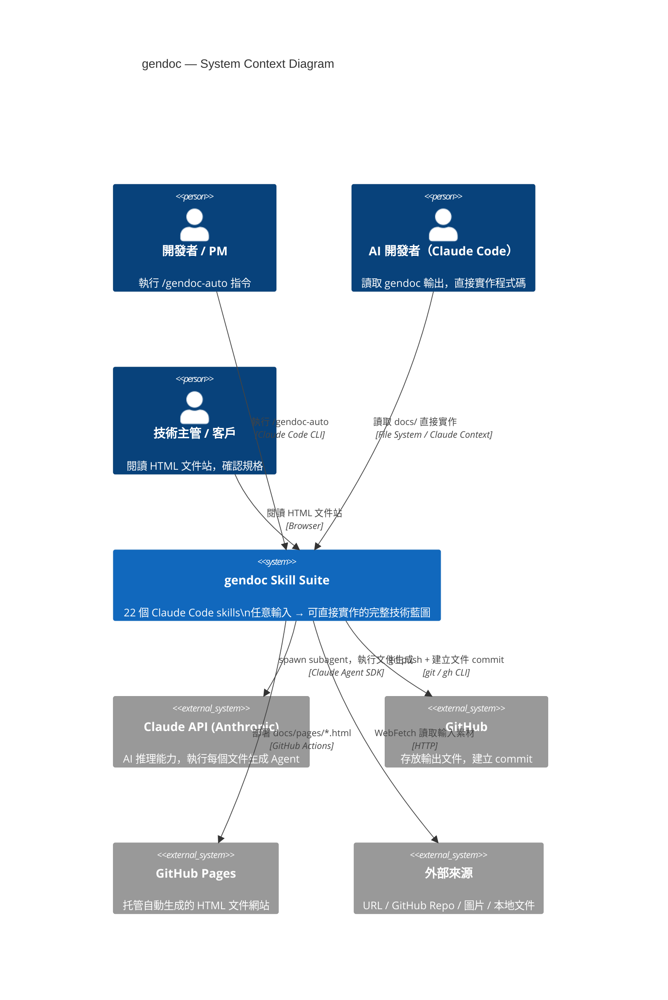

# PRD — Product Requirements Document
<!-- 對應學術標準：IEEE 830 (SRS)，對應業界：Google PRD / Amazon PRFAQ -->
<!-- Version: v1.1 | Status: DRAFT | DOC-ID: PRD-GENDOC-20260422 -->

---

## Document Control

| 欄位 | 內容 |
|------|------|
| **DOC-ID** | PRD-GENDOC-20260422 |
| **產品名稱** | gendoc — AI-Driven Implementation Blueprint Generator |
| **文件版本** | v1.1 |
| **狀態** | DRAFT |
| **作者（PM）** | AI Product Manager Agent |
| **日期** | 2026-04-22 |
| **上游來源** | MYDEVSOP 文件生成流水線（devsop-gendoc / devsop-autogen） |
| **審閱者** | 技術架構師、QA Lead |
| **核准者** | 待定 |

---

## Change Log

| 版本 | 日期 | 作者 | 變更摘要 |
|------|------|------|---------|
| v1.1 | 2026-04-22 | PM Agent | 重新定位核心使命：從文件生成工具 → 可直接實作的開發藍圖生成器；補充藍圖細粒度品質標準 |
| v1.0 | 2026-04-22 | PM Agent | 初版 PRD，從 MYDEVSOP 文件生成子系統萃取，建立獨立 gendoc skill 套件 |

---

## 1. Executive Summary

### 核心使命

**gendoc 的目標是：讓任何人或任何 AI，拿到產出的文件後，不需要問任何問題，就能直接開始實作。**

市面上的文件生成工具產出的是「可閱讀的說明文件」，但 gendoc 產出的是「可實作的開發藍圖」。兩者的差距在於細粒度：

| 普通技術文件 | gendoc 開發藍圖 |
|------------|---------------|
| 描述功能意圖 | 定義到 class、method 簽名、參數型別 |
| 說明 API 端點 | 包含每個欄位的型別、驗證規則、錯誤回應範例 |
| 提及需要測試 | 列出具體測試情境、邊界值、等價類劃分 |
| 描述資料結構 | 給出 Schema DDL、index 策略、constraint 定義 |
| 說明架構組件 | 包含 sequence diagram、component 間呼叫合約 |

### 什麼是「可實作的藍圖」

gendoc 生成的每份文件都必須達到以下標準，才視為合格輸出：

1. **EDD（Engineering Design Doc）**：每個 module 的 class 清單；每個 class 的 method 簽名、參數名稱、型別、回傳值、例外行為；跨 class 的呼叫關係圖
2. **API.md**：每個端點的 URL、HTTP method、request body schema（含欄位、型別、是否必填、驗證規則）、response schema、error code 列舉、Rate Limit
3. **SCHEMA.md**：完整 DDL；每個欄位的型別、nullable、default、constraint；全部 index（含 composite）；外鍵關係；migration 策略
4. **test-plan.md**：每個功能點的正向測試、負向測試、邊界值分析（BVA）；等價類劃分（EP）；具體輸入值與預期輸出值的對照表
5. **BDD.md**：每個 Scenario 的 Given/When/Then 完整定義；edge case Scenario；unhappy path Scenario

### 雙受眾設計

| 受眾 | 如何使用 gendoc 產出 |
|------|--------------------|
| **AI（LLM / Claude Code）** | 直接餵入文件，不需追問，依 EDD 建 class、依 SCHEMA 寫 migration、依 test-plan 寫 test cases |
| **人類開發者** | 開箱即用的任務清單：每個 class 是一張卡片，每個 method 是一個 subtask，每個 test 情境是一個 checklist item |

### 一句話定位

> gendoc 是一套 Claude Code Skill 系統，從任意形式的輸入（文字 / 圖片 / URL / Git repo），在 60 分鐘內生成一份「細到任何人都能直接開始寫程式碼」的完整技術藍圖，包含 IDEA → BRD → PRD → PDD → EDD → ARCH → API → SCHEMA → Test Plan → BDD → RTM，以及自動部署的 HTML 文件站。

---

## 2. Problem Statement

### 2.1 現狀痛點

#### 問題一：「可閱讀」≠「可實作」

現有技術文件工具（包括 AI 生成）產出的文件偏向說明性，缺乏足夠細節讓實作者直接動手。常見問題：

- EDD 只說「需要一個 UserService 處理使用者邏輯」，但沒有列出 `UserService` 裡有哪些 method
- API 文件列出端點路徑，但 request 欄位的 validation rule、error code 的 HTTP status mapping 都缺失
- 測試文件只說「測試登入功能」，但沒有給出：密碼長度邊界（7 / 8 / 129 / 130 字元）、特殊字元處理、並發登入、token 過期邊界等具體場景

結果：開發者或 AI 拿到文件後，仍需大量「填空」，等同於沒有藍圖。

#### 問題二：AI 開發者的需求更嚴苛

當「開發者」是 AI（如 Claude Code + MYDEVSOP）時，模糊的文件直接導致錯誤實作：

- class 邊界不清 → AI 可能把不同職責混在同一 class
- method 簽名未定義 → AI 可能自創不相容的介面
- 測試情境未列 → AI 生成的 test 只覆蓋 happy path，缺少 edge case
- 邊界值未定義 → AI 無從判斷 `0 ≤ quantity ≤ 999` 還是 `1 ≤ quantity ≤ 9999`

**gendoc 的核心假設**：如果文件細到 AI 能直接實作，人類一定也能。但反過來不成立。

#### 問題三：技術文件生成需要完整 SDLC 工具

MYDEVSOP 是一套完整的 31-STEP SDLC 自動化工具。許多場景只需文件生成能力，安裝整套是過度設計。

#### 問題四：模板系統缺乏細粒度品質標準

現有模板描述「這份文件應包含哪些章節」，但沒有定義每個章節的「細粒度完成標準」。

### 2.2 根本原因分析

- **根本原因一**：文件生成的品質目標設定錯了——目標應是「可實作」，而非「可閱讀」
- **根本原因二**：現有 AI 生成文件缺乏細粒度驗證機制，無從判斷文件是否達到「可直接實作」的標準
- **根本原因三**：MYDEVSOP 文件生成子系統與 SDLC 完整工具緊耦合，無法單獨萃取

### 2.3 機會假設

| ID | 假設 | 驗證指標 |
|----|------|---------|
| H-1 | 若 EDD 細到 class + method 層級，AI 實作時的重構次數可降低 60% 以上 | 對比有/無細粒度 EDD 的 AI 實作輪次 |
| H-2 | 若 test-plan 包含具體 BVA + EP 情境，測試覆蓋率首次執行即可達 85% 以上 | 首次 AI 生成 test 的覆蓋率 |
| H-3 | 若 gendoc 可獨立安裝，安裝成本降低 80%，使用者從安裝到產出第一份文件 ≤ 5 分鐘 | 安裝到完成 IDEA.md 的時間 |
| H-4 | Full-Auto 模式下 60 分鐘內完成 9 份完整文件集 | 端對端生成時間 |

### 2.4 System Context Diagram



---

## 3. Stakeholders & Users

### 3.1 Stakeholder Map

| 角色 | 關係 | 主要關切 |
|------|------|---------|
| 獨立開發者 | 主要使用者 | 快速從構想生成完整可實作藍圖 |
| AI 開發工具（Claude Code / Cursor） | 主要消費者 | 文件細粒度夠高，可直接依文件建 class / 寫 test |
| 技術主管 | 次要使用者 | 文件品質、結構一致性、規格完整性 |
| 開源專案維護者 | 次要使用者 | 從現有 codebase 生成規格文件 |

### 3.2 User Personas

#### Persona A：獨立開發者 / 技術文件需求者

| 欄位 | 內容 |
|------|------|
| **背景** | 全端工程師，需要為新專案快速生成完整技術文件集，再交給 AI（或團隊）實作 |
| **核心需求** | 文件細到不需要再補充說明，AI 拿去就能生成第一版可運行程式碼 |
| **痛點** | 手工撰寫文件耗時 2-4 週；AI 生成文件太模糊，實作時仍需大量追問 |
| **成功標準** | 60 分鐘內完成 9 份文件；Claude Code 讀取文件後首次生成程式碼通過 CI |

#### Persona B：開源專案維護者

| 欄位 | 內容 |
|------|------|
| **背景** | 有現有 Git repo，想為其生成正式規格文件，供 contributor 或 AI 參考實作 |
| **核心需求** | 從 codebase 逆向生成包含 class 設計、API spec、test 情境的完整文件集 |
| **痛點** | 逆向工程文件品質低落，缺少測試情境、邊界值定義 |
| **使用場景** | `/gendoc-auto https://github.com/user/repo`，輸入類型自動偵測為 `codebase_git` |

#### Persona C：AI 開發工具（Claude Code）

| 欄位 | 內容 |
|------|------|
| **背景** | 作為後續程式碼生成工具，讀取 gendoc 產出的 docs/ 目錄，依文件實作系統 |
| **核心需求** | EDD 中每個 class 的 method 列表；SCHEMA 的完整 DDL；test-plan 的具體輸入/輸出對照 |
| **失敗條件** | 文件中有「TBD」、「待定」、「視情況而定」等未決定項目 → 視為文件不合格 |

---

## 4. 藍圖品質標準（Blueprint Depth Standard）

這是 gendoc 的核心品質定義。每份文件生成後，Review Loop 必須驗證這些標準。

### 4.1 EDD（Engineering Design Document）細粒度標準

每份 EDD 必須包含：

**Class-Level 設計**
```
ClassName
├── 職責說明（≤ 2 句話，若超過 2 句表示職責過重）
├── 依賴注入清單（constructor 接受的參數型別）
└── Method 清單：
    ├── methodName(param1: Type, param2: Type): ReturnType
    │   ├── 前置條件（Pre-condition）
    │   ├── 後置條件（Post-condition）
    ├── 例外行為（throws XxxException when ...）
    └── 邊界行為（param1 為 null 時、param1 超出範圍時）
```

**範例（合格 EDD 片段）**
```
class UserAuthService
  職責：驗證使用者身份，簽發 JWT token
  依賴：UserRepository, PasswordHasher, TokenSigner

  Method: authenticate(email: string, password: string): AuthResult
    Pre-condition: email 符合 RFC 5321；password 長度 8-128 字元
    Post-condition: 成功時 AuthResult.token 為有效 JWT，exp = now + 24h
    throws: InvalidCredentialsException（email 不存在 or 密碼錯誤，統一訊息不區分）
    throws: AccountLockedException（連續失敗 ≥ 5 次且距上次失敗 < 30 分鐘）
    邊界：password 為空字串 → throws ValidationException（不進行 DB 查詢）
    邊界：email 大小寫不敏感（db 查詢前 toLower）

  Method: logout(userId: UUID, tokenJti: string): void
    Post-condition: tokenJti 加入 blacklist，TTL = 原 token 剩餘時間
    邊界：tokenJti 已在 blacklist → 靜默成功（冪等）
    邊界：userId 不存在 → 靜默成功（不拋例外）
```

### 4.2 API.md 細粒度標準

每個端點必須包含：

```
POST /api/v1/auth/login
  Summary: 使用者登入，取得 access token 與 refresh token
  Request Body (application/json):
    email        string  required  RFC 5321 格式；大小寫不敏感
    password     string  required  長度 8-128；至少 1 大寫、1 數字
    remember_me  boolean optional  default: false；true 時 refresh_token TTL = 30d

  Response 200 OK:
    access_token   string  JWT；exp = now + 15m
    refresh_token  string  Opaque token；exp = now + 7d（or 30d）
    token_type     string  "Bearer"（固定值）

  Error Responses:
    400 Bad Request      欄位格式錯誤；body: { code: "VALIDATION_ERROR", fields: [...] }
    401 Unauthorized     email 不存在 or 密碼錯誤；body: { code: "INVALID_CREDENTIALS" }
    423 Locked           帳號鎖定；body: { code: "ACCOUNT_LOCKED", unlock_at: ISO8601 }
    429 Too Many Req.    IP 限速（> 10 次/分鐘）；header: Retry-After: 60

  Rate Limit: 10 req/min per IP（未登入）；不限（已登入）
  Auth Required: No
  Idempotent: No
```

### 4.3 SCHEMA.md 細粒度標準

每個 Table 必須包含完整 DDL：

```sql
-- users 表
CREATE TABLE users (
  id          UUID         PRIMARY KEY DEFAULT gen_random_uuid(),
  email       VARCHAR(254) NOT NULL,
  password_hash VARCHAR(255) NOT NULL,                  -- bcrypt $2b$, cost factor 12
  is_verified BOOLEAN      NOT NULL DEFAULT FALSE,
  is_locked   BOOLEAN      NOT NULL DEFAULT FALSE,
  lock_until  TIMESTAMPTZ  NULL,                        -- NULL = 未鎖定
  failed_attempts SMALLINT NOT NULL DEFAULT 0,          -- 範圍 0-127
  created_at  TIMESTAMPTZ  NOT NULL DEFAULT NOW(),
  updated_at  TIMESTAMPTZ  NOT NULL DEFAULT NOW()
);

-- Index 策略（必須列出理由）
CREATE UNIQUE INDEX idx_users_email ON users (LOWER(email));  -- 大小寫不敏感唯一索引
CREATE INDEX idx_users_is_locked ON users (is_locked) WHERE is_locked = TRUE;  -- Partial index，只索引鎖定帳號

-- Constraint
ALTER TABLE users ADD CONSTRAINT chk_failed_attempts CHECK (failed_attempts >= 0);
ALTER TABLE users ADD CONSTRAINT chk_email_format CHECK (email ~* '^[^@]+@[^@]+\.[^@]+$');

-- Migration 策略
-- 新增 failed_attempts 欄位（已存在的 row 預設值為 0，無 downtime）
-- ALTER TABLE users ADD COLUMN IF NOT EXISTS failed_attempts SMALLINT NOT NULL DEFAULT 0;
```

### 4.4 test-plan.md 細粒度標準

每個功能必須包含以下測試類型，並給出**具體輸入值與預期輸出**：

**等價類劃分（Equivalence Partitioning, EP）**

| 測試類別 | 輸入 | 預期輸出 |
|---------|------|---------|
| 正向：合法登入 | email=`user@example.com`, password=`Passw0rd!` | 200 + tokens |
| 負向：email 不存在 | email=`noone@example.com`, password=`Passw0rd!` | 401 INVALID_CREDENTIALS |
| 負向：密碼錯誤 | email=`user@example.com`, password=`WrongPass1!` | 401 INVALID_CREDENTIALS |
| 負向：格式錯誤 email | email=`notanemail`, password=`Passw0rd!` | 400 VALIDATION_ERROR |
| 負向：帳號鎖定 | 連續失敗 5 次後再試 | 423 ACCOUNT_LOCKED |

**邊界值分析（Boundary Value Analysis, BVA）**

| 欄位 | 邊界值 | 預期行為 |
|------|-------|---------|
| password 長度 | 7 字元 | 400（低於最小值） |
| password 長度 | 8 字元 | 正常處理（最小合法值） |
| password 長度 | 128 字元 | 正常處理（最大合法值） |
| password 長度 | 129 字元 | 400（超過最大值） |
| password 長度 | 0（空字串） | 400（不觸發 DB 查詢） |
| failed_attempts | 4 次錯誤後 | 401（不鎖定） |
| failed_attempts | 第 5 次錯誤 | 423（鎖定，lock_until = now + 30m） |
| failed_attempts | 第 5 次錯誤後 30 分 1 秒 | 401（自動解鎖，重置計數） |

**並發與冪等性測試**

| 情境 | 測試方法 | 預期行為 |
|------|---------|---------|
| 同一帳號同時登入（10 並發） | 同時送出 10 個合法登入請求 | 全部返回 200，token 各自獨立 |
| 重複登出同一 token | 兩次 POST /logout 同一 jti | 兩次都返回 200（冪等） |
| 登入時 DB unavailable | Mock DB 拋出 connection timeout | 503 SERVICE_UNAVAILABLE（不返回 500） |

### 4.5 BDD.md 細粒度標準

每個 Feature 必須涵蓋 happy path、unhappy path、edge case：

```gherkin
Feature: 使用者登入
  Background:
    Given 存在帳號 "user@example.com" 密碼 "Passw0rd!"
    And 該帳號未被鎖定

  Scenario: 正常登入取得 token
    When 我以 "user@example.com" / "Passw0rd!" 發送登入請求
    Then 回應狀態碼為 200
    And 回應包含 access_token（JWT 格式）
    And 回應包含 refresh_token
    And access_token 的 exp 距現在 15 分鐘以內

  Scenario: 密碼錯誤登入
    When 我以 "user@example.com" / "WrongPass" 發送登入請求
    Then 回應狀態碼為 401
    And 回應 body 的 code 為 "INVALID_CREDENTIALS"
    And 回應不揭示是 email 不存在還是密碼錯誤

  Scenario Outline: 連續失敗 N 次後的行為
    When 我連續失敗登入 <次數> 次
    Then 帳號狀態為 <狀態>
    And 回應狀態碼為 <HTTP狀態碼>

    Examples:
      | 次數 | 狀態   | HTTP狀態碼 |
      | 4    | 正常   | 401       |
      | 5    | 鎖定   | 423       |
      | 6    | 鎖定   | 423       |

  Scenario: 密碼邊界值（7 字元，低於最小）
    When 我以 "user@example.com" / "Pass0r!" 發送登入請求（7字元密碼）
    Then 回應狀態碼為 400
    And 回應 body 的 code 為 "VALIDATION_ERROR"
    And 回應不查詢資料庫

  Scenario: 鎖定後 30 分鐘自動解鎖
    Given 帳號已被鎖定（lock_until = 30 分鐘前）
    When 我以正確密碼發送登入請求
    Then 回應狀態碼為 200
    And 帳號的 failed_attempts 重置為 0
```

---

## 5. Skill 架構與流程

### 5.1 Skill 清單（22 個）

| 分層 | Skill 名稱 | 功能 |
|------|-----------|------|
| **入口層** | `gendoc-auto` | 任意輸入→IDEA+BRD→移交 gendoc-flow |
| **流水線層** | `gendoc-flow` | 純文件生成流水線（PRD→BDD→HTML） |
| **共用層** | `gendoc-shared` | 共用邏輯參考（狀態管理、Review 策略） |
| **更新層** | `gendoc-update` | 版本自動更新 |
| **生成層** | `gendoc-gen-idea` | 生成 IDEA.md |
| | `gendoc-gen-brd` | 生成 BRD.md |
| | `gendoc-gen-prd` | 生成 PRD.md |
| | `gendoc-gen-pdd` | 生成 PDD.md |
| | `gendoc-gen-edd` | 生成 EDD.md（含 class + method 細節） |
| | `gendoc-gen-arch` | 生成 ARCH.md（含 sequence diagram） |
| | `gendoc-gen-api` | 生成 API.md（含完整 request/response schema） |
| | `gendoc-gen-schema` | 生成 SCHEMA.md（含完整 DDL + index 策略） |
| | `gendoc-gen-test-plan` | 生成 test-plan.md（含 BVA + EP 具體值）+ RTM.md |
| | `gendoc-gen-bdd` | 生成 BDD.md（含 edge case Scenario） |
| | `gendoc-gen-diagrams` | 生成 UML / Mermaid 圖表 |
| | `gendoc-gen-readme` | 生成 README.md |
| | `gendoc-gen-html` | 生成靜態 HTML 文件網站 |
| | `gendoc-gen-client-bdd` | 生成客戶端 BDD（可選） |
| **Review 層** | `gendoc-idea-review` | IDEA.md Review Loop |
| | `gendoc-brd-review` | BRD.md Review Loop |
| | `gendoc-align-check` | 跨文件對齊審查 |
| | `gendoc-align-fix` | 自動修復對齊問題 |

### 5.2 完整流程圖

```
使用者輸入（文字/圖片/URL/Git/本地）
    ↓
/gendoc-auto
    ├── 輸入類型偵測（text/image_url/doc_url/doc_git/codebase_local/codebase_git）
    ├── 素材保存至 docs/req/（唯讀原則）
    ├── PM Expert 分析（產品/技術雙視角）
    ├── 網路背景研究（WebSearch × 3）
    ├── gendoc-gen-idea → docs/IDEA.md
    ├── gendoc-idea-review（Review Loop，驗證藍圖完整性）
    ├── gendoc-gen-brd → docs/BRD.md
    ├── gendoc-brd-review（Review Loop）
    └── 移交 /gendoc-flow
         ↓
/gendoc-flow
    ├── DOC-03: gendoc-gen-prd    → docs/PRD.md
    ├── DOC-04: gendoc-gen-pdd    → docs/PDD.md
    ├── DOC-05: gendoc-gen-edd    → docs/EDD.md     ← class + method 細節
    ├── DOC-06: gendoc-gen-arch   → docs/ARCH.md    ← sequence diagram
    ├── DOC-07: gendoc-gen-api    → docs/API.md     ← 完整 request/response schema
    ├── DOC-08: gendoc-gen-schema → docs/SCHEMA.md  ← DDL + index 策略
    ├── DOC-09: gendoc-gen-test-plan → docs/test-plan.md + RTM.md  ← BVA + EP
    ├── DOC-10: gendoc-gen-bdd    → docs/BDD.md     ← edge case Scenario
    ├── DOC-11: gendoc-align-check → 跨文件對齊審查
    └── DOC-12: gendoc-gen-html   → docs/pages/ + GitHub Pages
```

### 5.3 State File 管理

```
.gendoc-state-{git_user}-{git_branch}.json
```

State file 記錄：
- `execution_mode`：`full-auto` / `interactive`
- `review_strategy`：`rapid` / `standard` / `exhaustive` / `tiered`
- `completed_steps`：已完成步驟清單（支援斷點續行）
- `skill_source`：`gendoc-auto`（防止跨套件誤用）
- `handoff`：true（gendoc-auto → gendoc-flow 移交標記）

---

## 6. 功能需求

### 6.1 多元輸入支援（F-01）

| 輸入類型 | 觸發條件 | 處理方式 |
|---------|---------|---------|
| `text_idea` | 純文字描述 | 直接作為 IDEA 來源 |
| `image_url` | http(s):// + 圖片副檔名 | WebFetch + Vision 分析 |
| `doc_git` | github.com / gitlab.com URL | WebFetch 讀取 README/docs |
| `doc_url` | http(s):// + .pdf/.md/.docx | WebFetch 下載 + 文字提取 |
| `doc_local` | 本地檔案路徑 | Read 工具讀取 |
| `codebase_local` | 本地目錄路徑 | tree + 關鍵文件 cp |
| `codebase_git` | git@/. git URL | git clone --depth 1 + 掃描 |

### 6.2 執行模式（F-02）

- **Full-Auto**：全自動，AI 自動選所有預設值，無需人工介入，透過 `/gendoc-config` 設定
- **Interactive**：互動引導，關鍵決策點等待使用者輸入，帶 AI 推薦預設選項

### 6.3 Review 策略（F-03）

| 策略 | 最大輪次 | 停止條件 |
|------|---------|---------|
| `rapid` | 3 輪 | 任一輪 finding=0 |
| `standard` | 5 輪 | 任一輪 finding=0（預設）|
| `exhaustive` | 無上限 | finding=0 |
| `tiered` | 無上限 | 前 5 輪 finding=0；第 6 輪起 CRITICAL+HIGH+MEDIUM=0 |

Review finding 的嚴重等級涵蓋：
- **CRITICAL**：缺少 class 邊界定義、API 缺少 error code、test 缺少 BVA
- **HIGH**：method 缺少例外行為、Schema 缺少 index 策略
- **MEDIUM**：Scenario 缺少 edge case、文件間術語不一致
- **LOW**：格式問題、遣詞建議

### 6.4 素材管理（F-04）

- 所有輸入素材保存至 `docs/req/`（**唯讀原則**：不修改原始來源）
- 舊版文件歸檔至 `docs/req/old-{DOC}-{timestamp}.md`
- `completed_steps` 追蹤已完成步驟，支援斷點續行

### 6.5 模板驅動生成（F-05）

- 所有文件結構由 `templates/*.md` 決定
- gen-* skill 只做流程編排，不 inline 定義文件結構
- 模板位於 `~/projects/gendoc/templates/`（14 份文件模板）

### 6.6 HTML 文件網站（F-06）

- `gendoc-gen-html` 將所有 docs/*.md 轉換為靜態 HTML
- 自動生成導覽、TOC、文件版本資訊
- 支援部署至 GitHub Pages

---

## 7. 非功能需求

### 7.1 效能

- Full-Auto 模式下，完整 9 份文件生成時間目標：≤ 60 分鐘
- 每份文件 Review Loop 時間目標：≤ 10 分鐘（standard 策略）

### 7.2 可靠性

- TF-02 斷點續行：任何步驟中斷後重啟，自動從上次完成點繼續
- State file 原子寫入，防止部分寫入導致的損毀

### 7.3 安全性

- 唯讀原則：本地路徑來源嚴禁寫入、刪除、修改原始目錄
- State file 的 `skill_source` 欄位防止跨套件誤用（`gendoc-auto` 鎖定）

### 7.4 可維護性

- 每個 gen-* skill 獨立，可單獨更新或替換
- 模板與 skill 邏輯分離，更新模板不需修改 skill

### 7.5 文件品質保證（Blueprint Quality Gate）

每份文件必須通過的最低標準（由 Review Loop 執行驗證）：

| 文件 | 必過項目 |
|------|---------|
| EDD | 每個 class 有 method 列表；每個 method 有型別簽名；有 pre/post-condition；有例外行為 |
| API.md | 每個端點有完整 request schema；有全部 error code；有 Rate Limit 定義 |
| SCHEMA.md | 完整 DDL；有 index 策略（含理由）；有 constraint；有 migration 說明 |
| test-plan.md | 每個功能有 EP 測試表；有 BVA 邊界值對照表；有並發/冪等性情境 |
| BDD.md | 每個 Feature 有 happy path、unhappy path、邊界值 Scenario |

---

## 8. 模板清單

| 模板檔案 | 對應文件 | 生成 Skill | 細粒度要求 |
|---------|---------|-----------|-----------|
| `IDEA.md` | docs/IDEA.md | gendoc-gen-idea | 問題定義、使用者、解法假設 |
| `BRD.md` | docs/BRD.md | gendoc-gen-brd | 業務需求、成功指標、範圍 |
| `PRD.md` | docs/PRD.md | gendoc-gen-prd | 功能需求、非功能需求 |
| `PDD.md` | docs/PDD.md | gendoc-gen-pdd | Product Design：UX flow、wireframe 描述 |
| `EDD.md` | docs/EDD.md | gendoc-gen-edd | **class + method + 型別 + 例外**（4.1 標準） |
| `ARCH.md` | docs/ARCH.md | gendoc-gen-arch | 元件圖、sequence diagram |
| `API.md` | docs/API.md | gendoc-gen-api | **完整 request/response/error schema**（4.2 標準） |
| `SCHEMA.md` | docs/SCHEMA.md | gendoc-gen-schema | **DDL + index + constraint**（4.3 標準） |
| `test-plan.md` | docs/test-plan.md | gendoc-gen-test-plan | **EP + BVA + 並發**（4.4 標準） |
| `RTM.md` | docs/RTM.md | gendoc-gen-test-plan | 需求追蹤矩陣 |
| `BDD.md` | docs/BDD.md | gendoc-gen-bdd | **edge case Scenario**（4.5 標準） |
| `README.md` | 專案 README | gendoc-gen-readme | 安裝、快速開始、API 概覽 |
| `LOCAL_DEPLOY.md` | 部署說明 | gendoc-gen-html | 本地部署步驟 |
| `UML-CLASS-GUIDE.md` | UML 指南 | gendoc-gen-diagrams | Class diagram 規範 |

---

## 9. 安裝與使用

### 9.1 安裝

```bash
# Skills 安裝（22 個 skill 位於 ~/.claude/skills/gendoc-*/）
# Templates 安裝（14 份模板位於 ~/projects/gendoc/templates/）
# 無其他依賴，開箱即用
```

### 9.2 基本使用

```bash
# 純文字輸入
/gendoc-auto 我想做一個 AI 驅動的客服機器人

# URL 輸入
/gendoc-auto https://github.com/some/repo

# 本地目錄輸入
/gendoc-auto ~/projects/my-existing-app

# 已有 BRD 直接進入流水線
/gendoc-flow

# 設定執行模式與 Review 策略
/gendoc-config
```

### 9.3 設定模式

- **gendoc-auto**：直接執行，Full-Auto 模式，無任何問答
- **gendoc-config**：互動設定執行模式、Review 策略、從哪個 STEP 重跑

---

## 10. 未來規劃（Out of Scope v1.0）

- 與 MYDEVSOP 完整 SDLC 流水線的雙向同步（已有 BRD 直接接 devsop-autodev）
- 多語言文件輸出（目前以中文為主，英文模板為輔）
- 文件版本差異比較（diff-based document review）
- CI/CD 觸發自動文件更新（code change → doc refresh）
- 程式碼品質反推文件更新（如 test coverage < 80% → 自動更新 test-plan 缺口）

---

## 11. 成功指標

| 指標 | 目標 |
|------|------|
| 完整文件集生成成功率（Full-Auto） | ≥ 90% |
| 平均生成時間（9 份文件） | ≤ 60 分鐘 |
| EDD class + method 完整率 | 100%（每個 class 有 method 列表） |
| test-plan BVA 覆蓋率 | 每個功能至少有邊界值對照表 |
| 跨文件一致性（align-check finding=0 比例） | ≥ 80% |
| AI 讀取文件後首次生成程式碼通過 CI 率 | ≥ 70% |
| 斷點續行成功率 | 100% |
| 安裝步驟數 | ≤ 3 步 |
