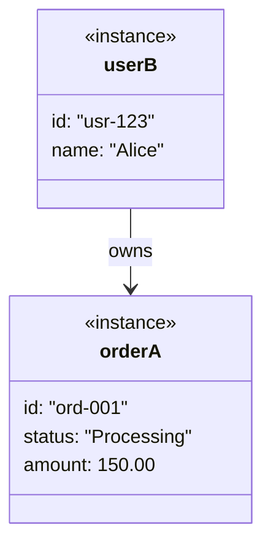

# gendoc-gen-diagrams — 生成九大 UML 圖（多張，無模糊空間）

從 EDD Mermaid 架構圖章節提取所有圖，並依 API.md / PRD.md / ARCH.md 補充多張 Sequence、Activity、State Machine，
輸出至 `docs/diagrams/`，並額外產生 `class-inventory.md`（class → test file 對應表）。

**核心原則（優先順序）：**
1. **提取**：EDD §10（新版）或 §4.5（舊版）已有的 Mermaid 程式碼直接提取，不修改內容
2. **補充**：EDD 某類圖不足時，從 API.md（Sequence）/ PRD.md（Activity）/ ARCH.md（Component/Deployment）推斷並生成
3. **強制完整**：9 種 UML 類型缺一不可，生成後做完整性驗證，缺少的類型依上游文件合成
4. **最低張數**：Sequence ≥ 3、Activity ≥ 3、State Machine ≥ 每個有狀態 Entity 各一、Class 固定 3 張

---

## Step -1：版本自動更新檢查

遵循 `gendoc-shared §-1`（R-00）：靜默檢查版本，有新版時以 Agent subagent 執行 `/gendoc-update` 後繼續。

---

## Step 0：讀取環境與 state

```bash
_CWD="$(pwd)"
_DOCS_DIR="${_CWD}/docs"
_DIAGRAMS_DIR="${_DOCS_DIR}/diagrams"
mkdir -p "$_DIAGRAMS_DIR"
_APP_NAME=$(python3 -c "import json; d=json.load(open('.gendoc-state.json')); print(d.get('project_name','') or '$(basename $_CWD)')" 2>/dev/null || basename "$_CWD")
_LANG_STACK=$(python3 -c "import json; d=json.load(open('.gendoc-state.json')); print(d.get('lang_stack','unknown'))" 2>/dev/null || echo "unknown")
echo "專案：$_APP_NAME"
echo "語言：$_LANG_STACK"
echo "=== 掃描上游文件 ==="
for f in EDD.md ARCH.md API.md SCHEMA.md PRD.md PDD.md; do
  [[ -f "${_DOCS_DIR}/$f" ]] && echo "✓ $f" || echo "✗ $f（跳過）"
done
```

---

## Step 1：讀取上游文件

讀取順序（缺檔靜默跳過）：

| 文件 | 讀取目標 | 用途 |
|------|---------|------|
| `docs/EDD.md` | **全文掃描**（優先看 §4.5 UML 9 大圖，其次 §10，其次全文） | 九大 UML 圖的 Mermaid 程式碼（**主要來源**）|
| `docs/ARCH.md` | Component / Deployment 章節 | Component Diagram、Deployment Diagram 補充 |
| `docs/API.md` | 所有 Endpoint 列表 | 補充生成多張 Sequence Diagram |
| `docs/SCHEMA.md` | 資料模型章節 | ER Diagram（額外，非 UML 9 之一）|
| `docs/PRD.md` | §User Stories / §業務流程 | 補充生成多張 Activity Diagram |

**提取規則：**

- **EDD 掃描策略（含版本 fallback，防止 section 編號差異導致漏圖）：**
  1. 優先讀取 EDD §4.5（UML 9 大圖，骨架標準位置）整節，提取所有 mermaid 程式碼塊
  2. 若 §4.5 找不到或圖數 < 3，嘗試 EDD §10（舊版因規則錯誤而落地於此的 UML）
  3. 最後 fallback：掃描 EDD 全文，以 mermaid 塊類型分類（`classDiagram` / `stateDiagram-v2` / `sequenceDiagram` / `erDiagram` / `flowchart` / `graph`）
  4. 以找到圖最多的那個策略為準，並在摘要中記錄「提取源：§4.5 / §10 / 全文掃描」
- 從 API.md 提取 Endpoint 列表（格式：`METHOD /path — 說明`），每個 P0 Endpoint 生成一張 Sequence Diagram
- 從 PRD §User Stories 提取每個主要業務流程，每個生成一張 Activity Diagram
- EDD 中若某類圖缺失，則依 EDD 其他章節的描述推斷並生成（非憑空捏造）
- 若相關上游文件均不存在，則跳過對應圖，在摘要中標注「✗ 跳過（缺乏來源）」

---

## Step 2：生成九大 UML 圖

逐一生成以下檔案，使用 **Write 工具**寫入 `docs/diagrams/`。

每個檔案的標準格式：

```markdown
---
diagram: <圖表識別名>
uml-type: <UML 圖類型中文名>
source: <來源文件及章節>
generated: <ISO8601 時間戳>
---

# <圖表標題>

> 來源：<文件> §<章節>

\`\`\`mermaid
<從上游文件提取或依上游文件內容推斷的 Mermaid 程式碼>
\`\`\`
```

---

### 2.1 use-case.md — Use Case Diagram

**UML 類型**：Use Case Diagram（UML 九大之一）

**來源**：EDD §10.1（新版）/ §4.5.1（舊版）

展示所有 Actor 和 Use Case 邊界。因 Mermaid 不支援原生 usecase 語法，使用 `flowchart TD`：
- 橢圓形節點（`(( ))`）表示 Use Case
- 矩形節點（`[ ]`）表示 Actor
- 系統邊界用 `subgraph` 表示

若 EDD §10.1 或 §4.5.1 已有 Mermaid 程式碼，**直接提取**；若無，依 EDD §2（系統功能列表）和 §3（DDD 用例）推斷。

---

### 2.2 class-domain.md — Class Diagram（Domain Layer）

**UML 類型**：Class Diagram（UML 九大之一）

**來源**：EDD §10.2（新版）/ §4.5.2（舊版）

提取 Domain 層 `classDiagram`，包含：
- Entity（`<<Entity>>`）
- Value Object（`<<ValueObject>>`）
- Domain Event（`<<DomainEvent>>`）
- Repository Interface（`<<Repository>>`，抽象）
- Aggregate Root（`<<AggregateRoot>>`）

若 EDD §10.2 或 §4.5.2 按層次提供多個 classDiagram，提取 Domain 層那張；若只有一張完整 classDiagram，從中篩選 Domain 層的 class。

---

### 2.3 class-application.md — Class Diagram（Application Layer）

**UML 類型**：Class Diagram（UML 九大之一）

**來源**：EDD §10.2（新版）/ §4.5.2（舊版）

提取 Application 層 `classDiagram`，包含：
- Use Case / Command Handler（`<<UseCase>>` 或 `<<CommandHandler>>`）
- Application Service（`<<ApplicationService>>`）
- DTO（`<<DTO>>`）
- Port / Interface（`<<Port>>`）

---

### 2.4 class-infra-presentation.md — Class Diagram（Infrastructure + Presentation Layer）

**UML 類型**：Class Diagram（UML 九大之一）

**來源**：EDD §10.2（新版）/ §4.5.2（舊版）

提取 Infrastructure 和 Presentation 層，包含：
- Repository 實作（`<<RepositoryImpl>>`）
- 外部服務 Adapter（`<<Adapter>>`）
- Controller（`<<Controller>>`）
- REST DTO（`<<RequestDTO>>`, `<<ResponseDTO>>`）

**若 EDD §10.2 或 §4.5.2 未按層次分張**，則從整體 Class Diagram 依架構層次拆分成 2–3 張，每張對應一個層次。

---

### 2.5 object-snapshot.md — Object Diagram

**UML 類型**：Object Diagram（UML 九大之一）

**來源**：EDD §10.3（新版）/ §4.5.3（舊版）

展示具體物件實例快照（特定場景下的物件狀態）。使用 `classDiagram` 語法，以具名實例（`objectName : ClassName`）表示：



**觸發條件（強制）**：若 EDD §4.5.2 Class Diagram 中有任何 `<<AggregateRoot>>` class，**必須**為每個 Aggregate Root 生成至少 1 張 Object Diagram，展示該 Aggregate 在某個具體業務狀態下的欄位值（非型別定義，需填入真實範例值如 `"ord-001"`, `"Processing"`, `150.00`）。

若 EDD §10.3 或 §4.5.3 已有程式碼，直接提取；若無，依 EDD §4.5.2 Class Diagram 中的 `<<AggregateRoot>>` class 推斷一個具代表性的實例狀態。

若系統確實無任何 Aggregate（純無狀態 API），則生成 1 張說明 DTO 實例快照，並標注 `> 本系統為無狀態服務，無 Aggregate Root`。

---

### 2.6 sequence-{flow-name}.md — Sequence Diagram（每個主要業務流程一張）

**UML 類型**：Sequence Diagram（UML 九大之一）

**來源**：EDD §10.4（新版）/ §4.5.4（舊版）主 + API.md Endpoint（補充）

**生成規則**：
1. EDD §10 或 §4.5 中的每個 `sequenceDiagram` 區塊，各自存成一個獨立檔案
2. 從每個 sequenceDiagram 的第一行 `Note over` 或流程說明提取 flow-name
3. **最低張數要求：≥ API.md §3 中 Mutation Endpoint（POST/PATCH/PUT/DELETE）數量，且不得少於 3 張**
   - 每個 Mutation Endpoint 對應一張，名稱含 Happy Path
   - 每張必須另附 Error Path（可以同一 md 檔中 `---` 分隔，或獨立 `sequence-{flow}-error.md`）
   - GET 列表查詢操作：≥ 1 張代表性序列（若端點 > 5，取最複雜的）
4. 若 API.md 有核心 Endpoint（CRUD 主操作）但 EDD 無對應 Sequence Diagram，**必須**依 API endpoint 說明和 EDD 架構推斷並生成
5. **每張序列圖粒度規範**：
   - 標注所有參與者（Controller / Service / Repository / DB，加上 Cache / Queue / ExternalService 若有用到）
   - 非同步操作使用 `par [async]` 塊
   - 重試機制使用 `loop [retry N times]` 塊
   - Error Path 至少包含：1 個業務規則違反（422/409） + 1 個系統錯誤（503/TIMEOUT）
6. **上下游一致性**：對同一業務操作，本節序列圖（服務內部視角）必須與 API.md §1 序列圖（Client 視角）邏輯一致；若有差異，在圖頂部標注 `> ⚠️ [UPSTREAM_CONFLICT] 與 API.md §1 {endpoint} 有差異，待 ADR 釐清`

**檔名格式**：`sequence-{flow-name}.md`

範例：`sequence-login.md`, `sequence-create-order.md`, `sequence-payment-callback.md`

---

### 2.7 communication.md — Communication Diagram

**UML 類型**：Communication Diagram（UML 九大之一）

**來源**：EDD §10.5（新版）/ §4.5.5（舊版）

展示物件間的協作關係與訊息傳遞（強調結構關係，不同於 Sequence 的時序）。
使用 `flowchart LR`，邊上標注訊息序號（`1: message`、`2: response`）。

**觸發條件**：
- **若系統有 Message Queue / Event Bus**（EDD §4.6 Domain Events 非空），**必須**生成，展示事件驅動的服務間訊息流向
- **若系統為同步架構（無 Queue）**，生成 1 張展示主要服務間的 HTTP 呼叫協作，並標注 `> 本系統為同步架構，無事件匯流排`

若 EDD §10.5 或 §4.5.5 已有程式碼，直接提取；若無，依 EDD §4.6 Domain Events 表推斷事件訂閱關係，或依 ARCH.md §4 服務邊界圖推斷主要協作路徑。

---

### 2.8 state-machine-{entity}.md — State Machine Diagram（每個有狀態 Entity 一張）

**UML 類型**：State Machine Diagram（UML 九大之一）

**來源**：EDD §10.6（新版）/ §4.5.6（舊版）

**生成規則**：
1. 從 EDD §10.6 或 §4.5.6 提取每個 `stateDiagram-v2` 區塊
2. 每個有狀態的 Entity 獨立一個檔案
3. **最低張數：≥ 1 張**；若 EDD 有多個有狀態 Entity（如 Order、Payment、Shipment 各有獨立狀態機），全部分別提取
4. **識別有狀態 Entity 的方法**：class-domain.md 中含有 `status: String` 或 `state: String` 欄位的 Entity，或 EDD §3（Domain Events）中有明確狀態轉移事件的 Aggregate

**檔名格式**：`state-machine-{entity-name}.md`

範例：`state-machine-order.md`, `state-machine-payment.md`, `state-machine-shipment.md`

**降級處理**：若 EDD §10.6 / §4.5.6 為空或只有佔位符，從 EDD §3 Domain Events 的狀態轉移描述推斷並生成（至少 1 張，覆蓋最核心的 Entity），不得跳過此圖類型。

---

### 2.9 activity-{flow}.md — Activity Diagram（每個主要業務流程一張）

**UML 類型**：Activity Diagram（UML 九大之一）

**來源**：EDD §10.7（新版）/ §4.5.7（舊版）主 + PRD §User Stories（補充）

**生成規則**：
1. 從 EDD §10.7 或 §4.5.7 提取每個業務流程的 Activity Diagram
2. 使用 `flowchart TD`：決策點用菱形（`{ }`），平行流程用 `subgraph`，開始/結束用（`([ ])`）
3. **最低張數要求：≥ 3 張**，必須涵蓋：
   - 用戶主線操作流程（1 張，如「下單流程」「登入流程」）
   - 系統內部處理流程（1 張，如「支付處理流程」「訂單履行流程」）
   - 異常/補救流程（1 張，如「退款流程」「錯誤重試流程」）
4. 若 PRD 有 User Story 但 EDD §10.7 / §4.5.7 無對應 Activity，依 User Story 描述推斷並生成
5. 若已提取的 Activity 張數 < 3，**必須補充**至 ≥ 3 張（從 PRD User Stories 或 EDD §2 功能列表推斷）

**檔名格式**：`activity-{flow-name}.md`

範例：`activity-user-registration.md`, `activity-checkout.md`, `activity-refund.md`

---

### 2.10 component.md — Component Diagram

**UML 類型**：Component Diagram（UML 九大之一）

**來源**：EDD §10.8（新版）/ §4.5.8（舊版）主 + ARCH.md（補充）

展示微服務 / 模組邊界、內外部依賴關係。使用 `graph TD`：
- `subgraph` 表示服務邊界
- 箭頭表示依賴關係（`-->` 同步，`-.->` 非同步）

若 EDD §10.8 或 §4.5.8 已有程式碼，直接提取；若無，從 ARCH.md 元件架構章節推斷。**不得跳過此圖類型**：即使 EDD 沒有，也必須依 ARCH.md 或 EDD §2 功能模組列表生成。

---

### 2.11 deployment.md — Deployment Diagram

**UML 類型**：Deployment Diagram（UML 九大之一）

**來源**：EDD §10.9（新版）/ §4.5.9（舊版）主 + ARCH.md 部署章節（補充）

展示部署拓撲（k8s Namespace / Cloud Service / Docker Compose 視專案類型而定）。
使用 `graph TD`，以 `subgraph` 表示服務邊界。

若 EDD §10.9 或 §4.5.9 已有程式碼，直接提取；若無，從 ARCH.md §部署 或 EDD §CI/CD 推斷。**不得跳過此圖類型**：即使 EDD 沒有，也必須依 ARCH.md 部署架構生成。

---

### 2.12 er-diagram.md — ER Diagram（額外，非 UML 9 之一）

**類型**：ER Diagram（資料庫關聯圖）

**來源**：SCHEMA.md

**明確標注**：此為資料庫表格關聯圖，與 UML Class Diagram 性質不同：
- ER Diagram → 資料庫表格、欄位、外鍵關係（`erDiagram`）
- Class Diagram → 物件模型、方法、繼承、介面實作

直接複製 SCHEMA.md 的 `erDiagram` 區塊。若 SCHEMA.md 不存在，跳過此圖。

Frontmatter 中加入：

```yaml
diagram: er-diagram
uml-type: ER Diagram（資料庫關聯圖，非 UML Class Diagram）
note: 此圖描述資料庫表格關聯，請勿與 class-*.md 的物件模型混淆
```

---

## Step 2.9（完整性驗證）：9 種 UML 類型全覆蓋強制檢查

**在 class-inventory.md 之前，必須執行此驗證步驟。**

```
╔════════════════════════════════════════════════════════════╗
║  UML 完整性驗證（9 種缺一不可）                             ║
╠════════════════════════════════════════════════════════════╣
║  [1] Use Case Diagram       → use-case.md             ✓/✗ ║
║  [2] Class Diagram          → class-*.md（≥3張）       ✓/✗ ║
║  [3] Object Diagram         → object-snapshot.md      ✓/✗ ║
║  [4] Sequence Diagram       → sequence-*.md（≥Mutation端點數，≥3）✓/✗ ║
║  [5] Communication Diagram  → communication.md        ✓/✗ ║
║  [6] State Machine Diagram  → state-machine-*.md（≥1）✓/✗ ║
║  [7] Activity Diagram       → activity-*.md（≥3張）    ✓/✗ ║
║  [8] Component Diagram      → component.md            ✓/✗ ║
║  [9] Deployment Diagram     → deployment.md           ✓/✗ ║
╚════════════════════════════════════════════════════════════╝
```

**驗證規則：**
- 列出 `docs/diagrams/` 目錄下實際生成的檔案
- 對照上表，標出 ✓（已生成）/ ✗（缺失）
- **任何 ✗ 必須立即補生成**，不得在摘要中標注「跳過」後結束
- 補生成策略（按優先順序）：
  1. 重新掃描 EDD 全文，尋找對應的 mermaid 塊
  2. 依 ARCH.md / API.md / PRD.md 相關章節推斷並生成
  3. 若所有來源均無線索，依專案類型和現有圖表合理推斷（標注「推斷生成」）

**額外驗證項目（9 種圖通過後執行）：**

- [ ] **Sequence Diagram 張數**：≥ API.md §3 中 Mutation Endpoint（POST/PATCH/PUT/DELETE）總數（且 ≥ 3）
- [ ] **Class Diagram stereotype 完整**：所有 class 均有 stereotype，無裸 class
- [ ] **Class Diagram 最低規格**：Domain Layer 含 ≥ 1 AggregateRoot、≥ 2 Entity、≥ 1 Repository Interface
- [ ] **Object Diagram 觸發**：每個 AggregateRoot 有對應 Object Diagram（若無 Aggregate，標注說明）
- [ ] **Domain Event 對齊**：EDD §4.6 Domain Events 表中的每個事件在 Class Diagram 中有 `<<DomainEvent>>` class
- [ ] **命名一致性**：Class Diagram 的 Entity 名稱與 ARCH.md §3 Domain 模型和 SCHEMA.md Table 名稱對應

---

## Step 3：生成 class-inventory.md

這是最重要的額外輸出，供 `test-plan` 和 RTM 讀取。

**來源**：解析 Step 2 生成的所有 `class-*.md` 中的 `class ClassName` 定義。

### 推斷 src/test 路徑規則

從 `.gendoc-state.json` 的 `lang_stack` 欄位判斷：

| lang_stack | src 副檔名 | src 根路徑 | test 命名 | test 根路徑 |
|-----------|-----------|-----------|---------|-----------|
| `typescript` / `javascript` | `.ts` / `.js` | `src/` | `*.test.ts` | `tests/unit/` |
| `python` | `.py` | `src/` | `test_*.py` | `tests/unit/` |
| `java` | `.java` | `src/main/java/` | `*Test.java` | `src/test/java/` |
| `golang` / `go` | `.go` | `internal/` | `*_test.go` | `internal/`（同目錄）|
| `csharp` / `dotnet` | `.cs` | `src/` | `*.Tests.cs` | `tests/unit/` |
| `php` | `.php` | `src/` | `*Test.php` | `tests/unit/` |
| 其他 | 標注 `（待確認）` | — | — | — |

### 路徑推斷邏輯

1. 從 classDiagram 中解析每個 `class ClassName` 和其 stereotype（`<<Entity>>`, `<<UseCase>>`, `<<Controller>>` 等）
2. 依 stereotype 對應架構層次（Domain / Application / Infrastructure / Presentation）
3. 依層次對應目錄結構：
   - Domain → `src/domain/{entity-name}/`
   - Application → `src/application/{use-case-name}/`
   - Infrastructure → `src/infrastructure/{adapter-name}/`
   - Presentation → `src/presentation/{controller-name}/` 或 `src/api/`
4. 生成 TC-ID 前綴：`TC-UNIT-{CLASSNAME-UPPER}`

### class-inventory.md 格式

```markdown
---
generated: <ISO8601>
source: docs/diagrams/class-*.md
purpose: class-to-test mapping for test-plan RTM
---

# Class Inventory — 類別清單與測試追蹤

> 自動生成自 docs/diagrams/class-*.md
> 規則：1 Class → 1 src/ 實作檔 → 1 tests/unit/ 測試檔

## 類別清單

| Class | Stereotype | Layer | src 路徑（推斷）| test 路徑（推斷）| TC-ID 前綴 |
|-------|-----------|-------|--------------|--------------|-----------|
| User | Entity | Domain | src/domain/user/User.ts | tests/unit/domain/User.test.ts | TC-UNIT-USER |
| IUserRepository | interface/Repository | Domain | src/domain/user/IUserRepository.ts | tests/unit/domain/IUserRepository.test.ts | TC-UNIT-IUSERREPO |
| CreateUserUseCase | UseCase | Application | src/application/user/CreateUserUseCase.ts | tests/unit/application/CreateUserUseCase.test.ts | TC-UNIT-CREATEUSER |
| UserRepositoryImpl | RepositoryImpl | Infrastructure | src/infrastructure/user/UserRepositoryImpl.ts | tests/unit/infrastructure/UserRepositoryImpl.test.ts | TC-UNIT-USERREPOIMPL |
| UserController | Controller | Presentation | src/presentation/user/UserController.ts | tests/unit/presentation/UserController.test.ts | TC-UNIT-USERCTRL |

## 測試追蹤統計

| 層次 | Class 數 | 預期 Test File 數 |
|------|---------|----------------|
| Domain | N | N |
| Application | N | N |
| Infrastructure | N | N |
| Presentation | N | N |
| **合計** | **N** | **N** |

## 1:1:N 規則提醒

- 每個 Class 對應一個測試檔案（1:1）
- 每個 Public Method 至少 3 個測試案例：S（Success）/ E（Error）/ B（Boundary）（1:N）

## 給 test-plan 的指示

test-plan.md §15.2 Unit Test RTM 應從本表格填充 Class 和 Test File 欄位。
每個 TC-ID 前綴後接 `-S01`, `-E01`, `-B01` 等流水號。
```

---

## Step 4：輸出摘要

生成完成後輸出以下摘要：

```
=== gendoc-gen-diagrams 完成 ===
  輸出目錄：docs/diagrams/
  
  UML 九大圖：
    ✓/✗ use-case.md                  （Use Case Diagram，來自 EDD §4.5.1）
    ✓/✗ class-domain.md              （Class Diagram - Domain，來自 EDD §4.5.2）
    ✓/✗ class-application.md        （Class Diagram - Application，來自 EDD §4.5.2）
    ✓/✗ class-infra-presentation.md （Class Diagram - Infra/Presentation，來自 EDD §4.5.2）
    ✓/✗ object-snapshot.md          （Object Diagram，來自 EDD §4.5.3）
    ✓/✗ sequence-{flow}.md          （Sequence Diagram，共 N 張，來自 EDD §4.5.4 + API.md）
    ✓/✗ communication.md            （Communication Diagram，來自 EDD §4.5.5）
    ✓/✗ state-machine-{entity}.md   （State Machine Diagram，共 N 張，來自 EDD §4.5.6）
    ✓/✗ activity-{flow}.md          （Activity Diagram，共 N 張，來自 EDD §4.5.7 + PRD.md）
    ✓/✗ component.md                （Component Diagram，來自 EDD §4.5.8）
    ✓/✗ deployment.md               （Deployment Diagram，來自 EDD §4.5.9）
  
  額外圖表：
    ✓/✗ er-diagram.md               （ER Diagram，資料庫關聯圖，來自 SCHEMA.md）
  
  關鍵輸出：
    ✓/✗ class-inventory.md          （Class → Test File 對應表，共 N 個 class）

  注意：
    - test-plan.md §15.2 RTM 應讀取 class-inventory.md 填充 Class 欄位
    - ER Diagram ≠ Class Diagram（前者為 DB 表格，後者為物件模型）
    - Sequence Diagram 每個主要業務流程各一張（共 N 張）

總計：N 個 UML 圖 + 1 個 er-diagram.md + class-inventory.md
```

---

## 附錄：UML 九大圖對照表

| # | UML 圖類型 | EDD §章節（新版→舊版）| 輸出檔案 | Mermaid 語法 | 最低張數 |
|---|-----------|---------------------|---------|-------------|---------|
| 1 | Use Case Diagram | §10.1 → §4.5.1 | `use-case.md` | `flowchart TD` | 1 |
| 2 | Class Diagram | §10.2 → §4.5.2 | `class-domain.md`, `class-application.md`, `class-infra-presentation.md` | `classDiagram` | 3（固定）|
| 3 | Object Diagram | §10.3 → §4.5.3 | `object-snapshot.md` | `classDiagram`（instance 模式）| 1 |
| 4 | Sequence Diagram | §10.4 → §4.5.4 + API.md | `sequence-{flow}.md`（多張）| `sequenceDiagram` | **≥ 3** |
| 5 | Communication Diagram | §10.5 → §4.5.5 | `communication.md` | `flowchart LR` | 1 |
| 6 | State Machine Diagram | §10.6 → §4.5.6 | `state-machine-{entity}.md`（多張）| `stateDiagram-v2` | **≥ 1 per Entity** |
| 7 | Activity Diagram | §10.7 → §4.5.7 + PRD.md | `activity-{flow}.md`（多張）| `flowchart TD` | **≥ 3** |
| 8 | Component Diagram | §10.8 → §4.5.8 + ARCH.md | `component.md` | `graph TD` | 1 |
| 9 | Deployment Diagram | §10.9 → §4.5.9 + ARCH.md | `deployment.md` | `graph TD` | 1 |
| — | ER Diagram（額外）| SCHEMA.md | `er-diagram.md` | `erDiagram` | 1（可選）|
