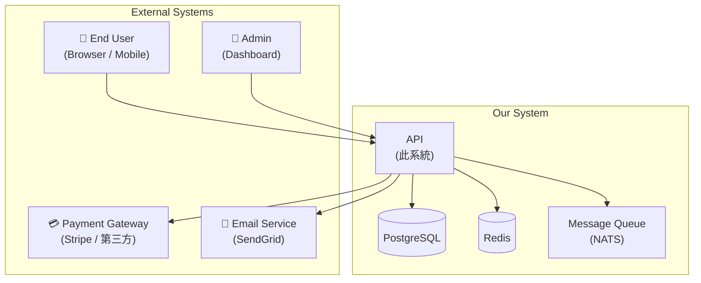
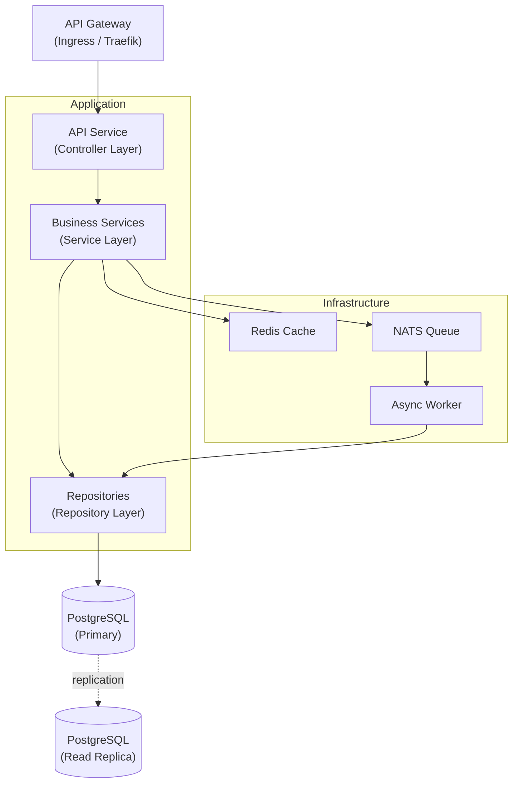
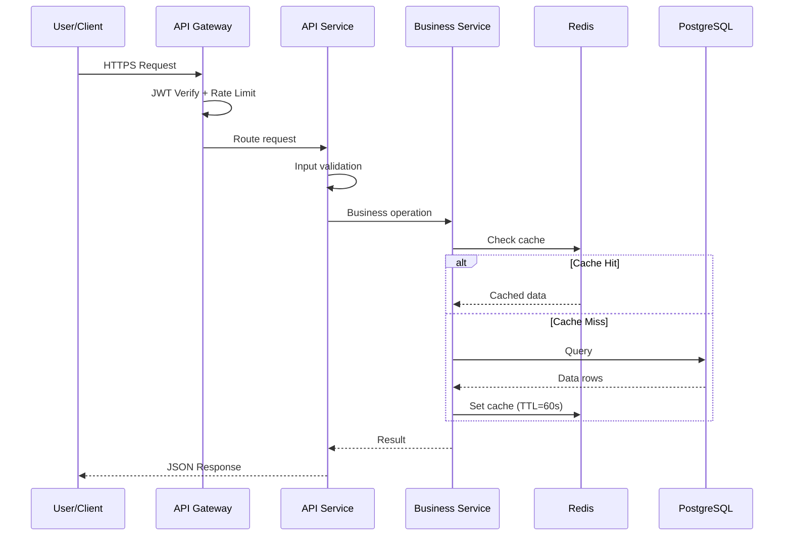
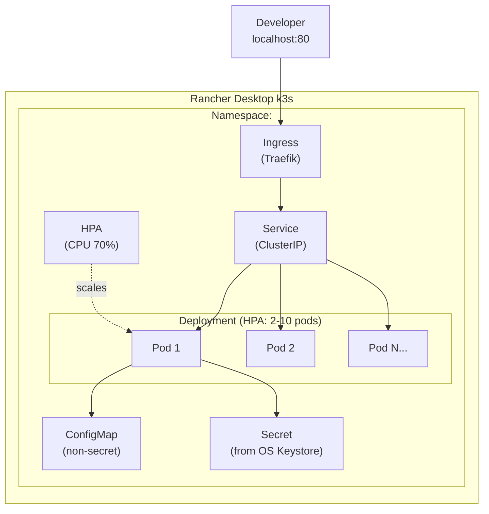
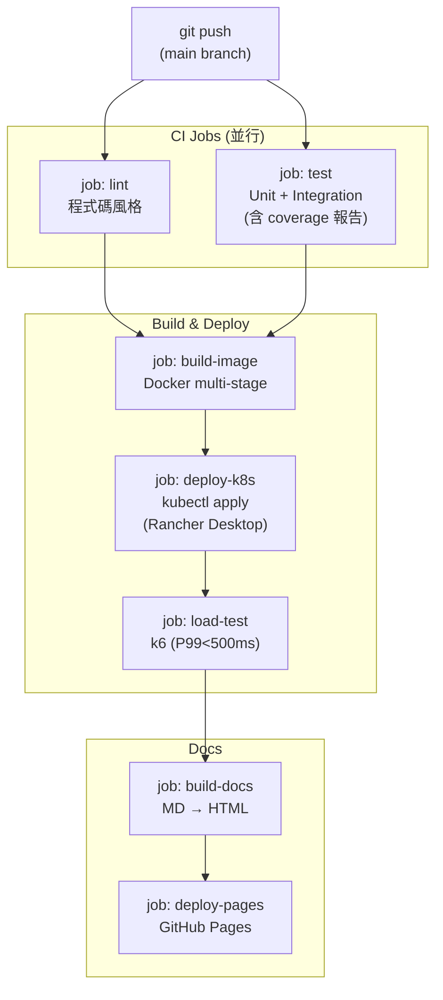
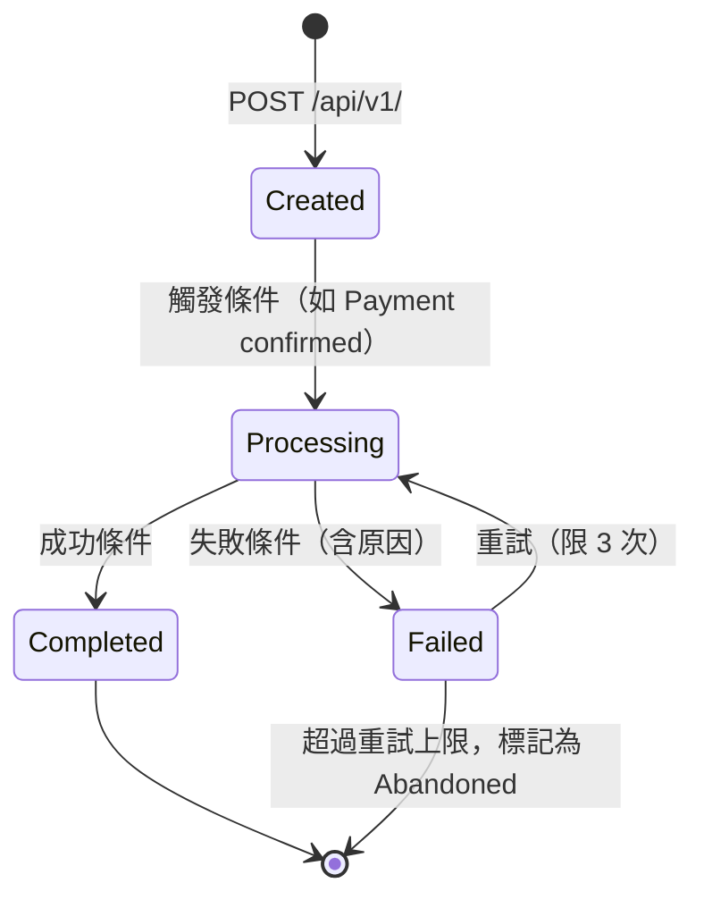

# gendoc-gen-diagrams — 自動生成 Mermaid 圖表

從各設計文件提取架構資訊，輸出到 docs/diagrams/*.md。

---

## Step -1：版本自動更新檢查

遵循 `gendoc-shared §-1`（R-00）：靜默檢查版本，有新版時以 Agent subagent 執行 `/gendoc-update` 後繼續。

---

## Step 1：讀取輸入

```bash
_DOCS="${_DOCS:-$(pwd)/docs}"
_BRD="${_BRD:-$_DOCS/BRD.md}"
_PRD="${_PRD:-$_DOCS/PRD.md}"
_PDD="${_PDD:-$_DOCS/PDD.md}"
_EDD="${_EDD:-$_DOCS/EDD.md}"
_ARCH="${_ARCH:-$_DOCS/ARCH.md}"
_API="${_API:-$_DOCS/API.md}"
_SCHEMA="${_SCHEMA:-$_DOCS/SCHEMA.md}"
_DIAGRAMS="${_DIAGRAMS:-$_DOCS/diagrams}"
```

### 1.1 讀取累積上游文件鏈

依「全上游對齊」規則，Mermaid 圖表生成需讀取完整上游鏈：

| 文件 | 必讀章節 | 用途 |
|------|---------|------|
| `BRD.md` | §2 Problem Statement、業務流程 | **Business Process Diagram**：業務事件觸發鏈、使用者角色關係圖 |
| `PRD.md` | §6 User Flows、State Machine | **User Flow 圖**（使用者操作路徑）、**State Machine 圖**（功能狀態轉換）|
| `PDD.md`（若存在）| §6 互動設計、§4 畫面清單 | **Screen Flow Diagram**（畫面跳轉圖）；UI 元件與後端 API 的互動序列 |
| `EDD.md` | §2 C4 Model、§3 DDD、§6 Domain Events | System Context 圖、Data Flow 圖、部署拓撲圖 |
| `ARCH.md` | §3 元件架構、§9 部署 | System Architecture 圖、元件依賴圖 |
| `API.md` | 所有 Endpoint | API Sequence Diagram（呼叫順序）|
| `SCHEMA.md` | 資料模型 | ER Diagram |

若某文件不存在，靜默跳過，略過對應圖表或以已存在文件替代素材。

---

## Step 2：生成圖表清單

依文件內容，生成以下圖表（依實際系統調整，最少 6 個）：

| 檔案 | 來源 | 類型 | 方向 |
|------|------|------|------|
| `system-context.md` | EDD | `graph TD` | TD |
| `system-arch.md` | EDD / ARCH | `graph TD` | TD |
| `data-flow.md` | EDD | `sequenceDiagram` | 例外（橫向）|
| `deployment.md` | EDD / k8s | `graph TD` | TD |
| `er-diagram.md` | SCHEMA | `erDiagram` | TD |
| `cicd-pipeline.md` | EDD §9（CI/CD 設計）| `graph TD` | TD |
| `state-machine.md` | EDD（若有）| `stateDiagram-v2` | TD |
| `api-flow.md` | API | `sequenceDiagram` | 例外（橫向）|

---

## Step 3：每個圖表的 .md 格式

每個檔案使用以下 frontmatter + 標題 + 說明 + Mermaid 程式碼區塊：

```markdown
---
diagram: <圖表名稱，如 system-arch>
source: <來源文件，如 EDD.md>
generated: <ISO 8601 時間戳>
direction: <TD 或 sequenceDiagram>
---

# <圖表標題>

> 自動生成自 <來源文件> §<章節>

\`\`\`mermaid
<Mermaid 語法>
\`\`\`
```

---

## Step 4：各圖表生成規範

### 4.1 system-context.md（系統邊界圖）

展示系統的外部邊界：哪些是此系統，哪些是外部系統：



### 4.2 system-arch.md（系統元件依賴圖）

從 EDD §10.1 / ARCH §8 提取，展示所有服務元件與依賴：



### 4.3 data-flow.md（主要請求資料流）

從 EDD §10.2 提取，展示請求完整流程（sequenceDiagram）：



### 4.4 deployment.md（k8s 部署架構）

從 EDD §10.3 提取，展示 k8s 資源關係：



### 4.5 er-diagram.md（資料庫 ER 圖）

從 SCHEMA §1 提取，主表在上，外鍵表向下展開：

直接複製 SCHEMA.md 的 erDiagram 區塊並包成獨立 .md 檔。

### 4.6 cicd-pipeline.md（CI/CD 流水線）

**來源：EDD §9（CI/CD 設計）**。從 EDD §9 提取 Job 設計和依賴關係，
不讀取 `.github/workflows/` 實際檔案——以 EDD 為準，避免與已生成的 workflow 產生循環依賴。

展示 GitHub Actions Pipeline 的 Job 依賴關係：



### 4.7 state-machine.md（業務狀態機，若有）

**判斷條件**：讀取 EDD §10.4 的 stateDiagram-v2 區塊。
若該區塊包含實際狀態節點定義（即不只是純佔位符文字如 `[*] --> State1` 的空模板），則生成 state-machine.md；
否則跳過此圖（不生成空白或無意義的狀態圖）。

從 EDD §10.4 提取，若 EDD 無狀態機則略過此圖：



### 4.8 api-flow.md（API 呼叫序列）

從 API.md §4 提取最重要的 API 序列圖（直接複製）：

sequenceDiagram（橫向，為唯一例外，符合時序閱讀習慣）。

---

## Step 5：確認清單

- [ ] 所有架構圖使用 `graph TD`（禁止 LR）
- [ ] sequenceDiagram 除外（橫向可接受）
- [ ] erDiagram 主表在最上方
- [ ] 每個 .md 有正確 frontmatter（diagram / source / generated / direction）
- [ ] state-machine.md 僅在 EDD 有狀態機時生成

---

## Step 6：寫入並輸出摘要

將所有圖表 .md 寫入 `$_DIAGRAMS/` 目錄。

```
Mermaid 圖表生成完成：
  輸出目錄：$_DIAGRAMS/
  生成圖表：
    + system-context.md（graph TD）
    + system-arch.md（graph TD）
    + data-flow.md（sequenceDiagram）
    + deployment.md（graph TD）
    + er-diagram.md（erDiagram）
    + cicd-pipeline.md（graph TD）
    + state-machine.md（stateDiagram-v2）[若有]
    + api-flow.md（sequenceDiagram）
  總計：N 個圖表
```
