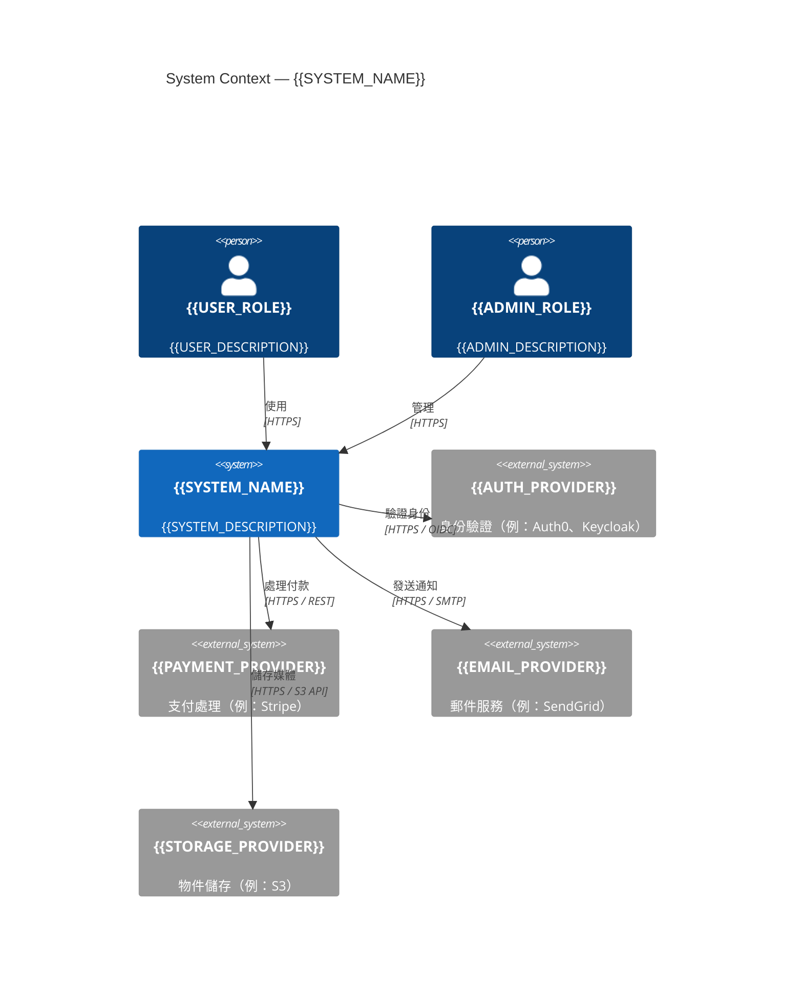
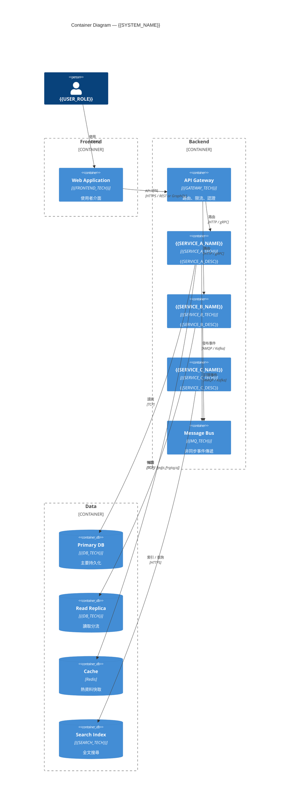
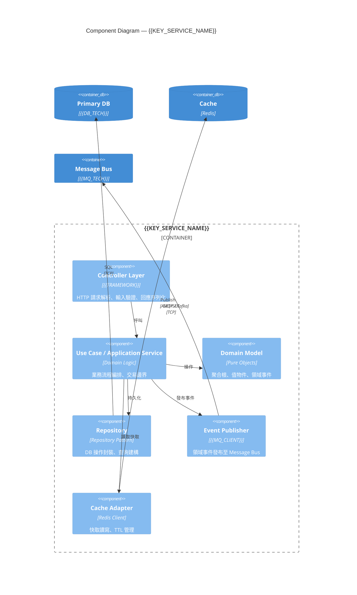
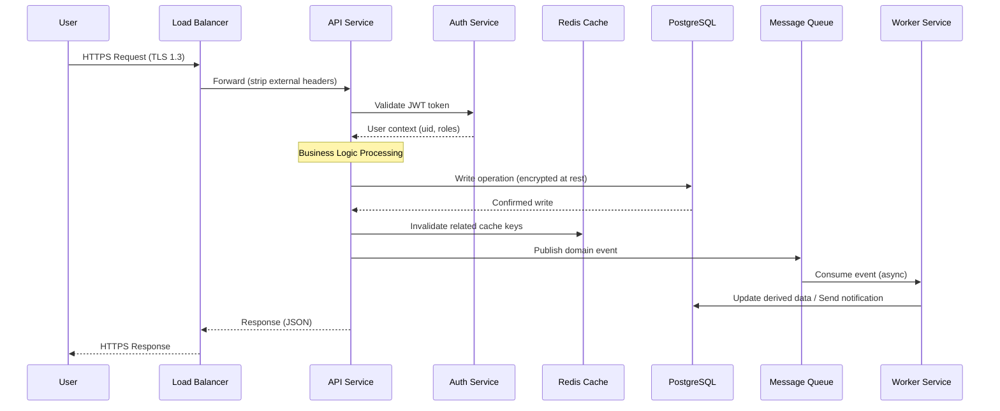
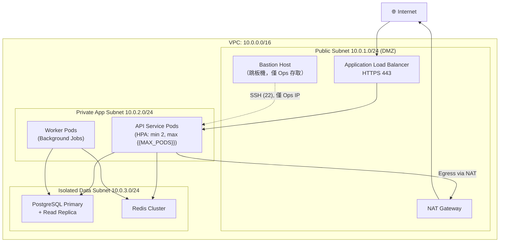
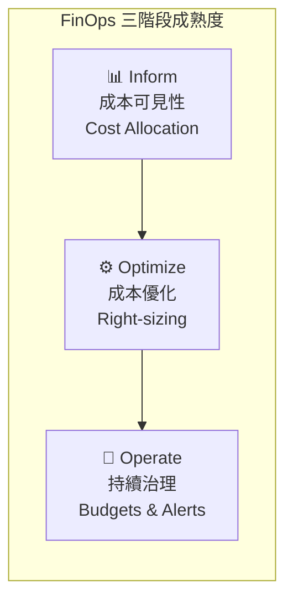
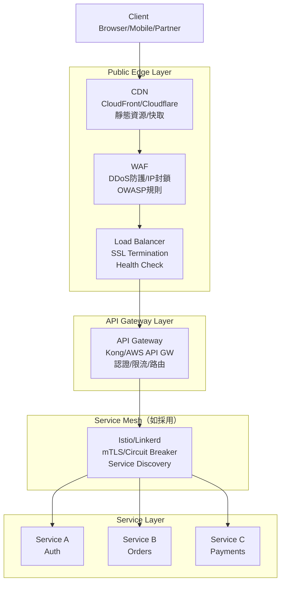
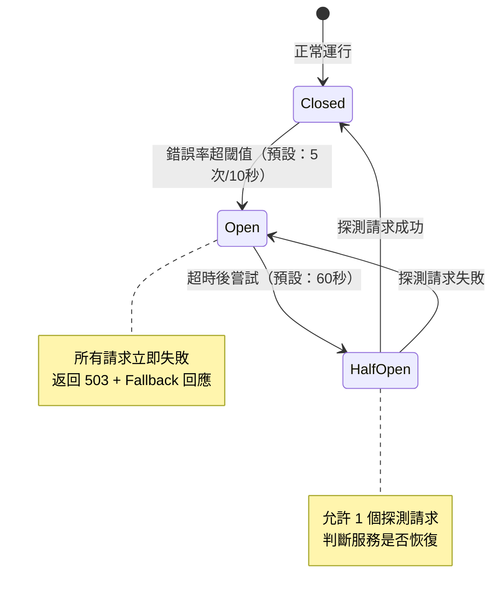
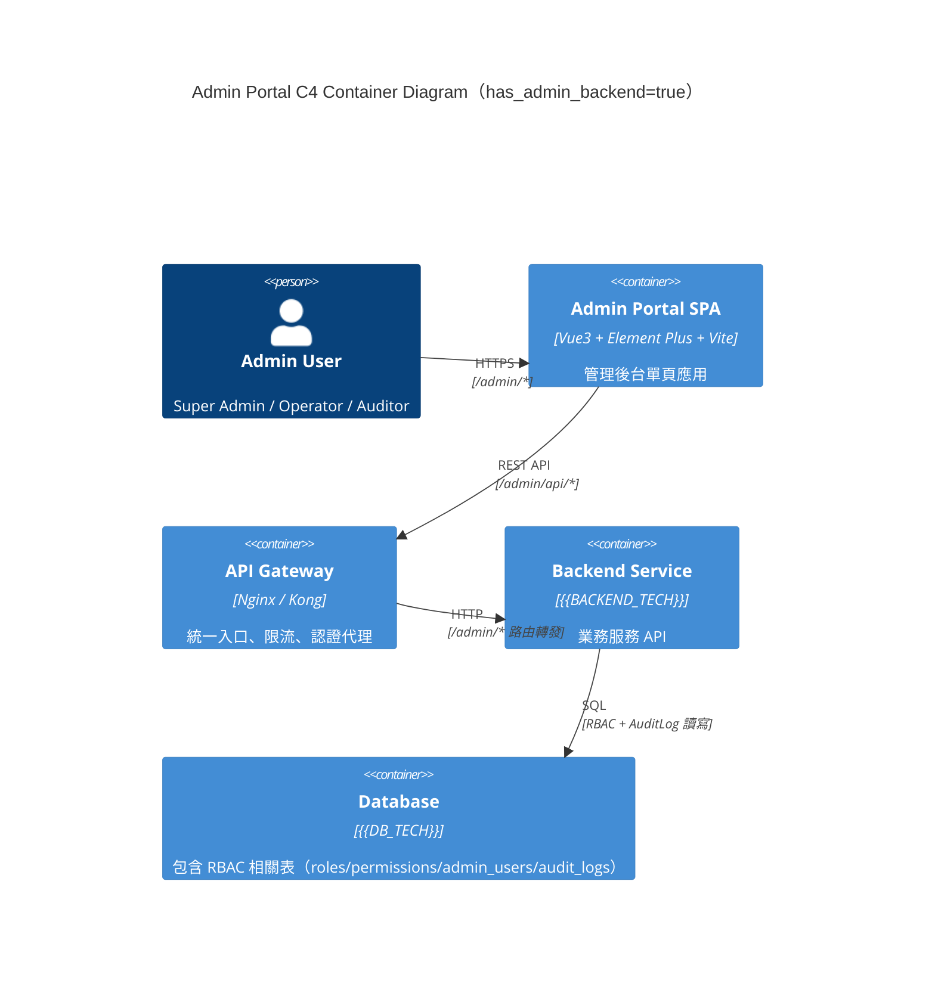

# ARCH — 架構設計文件（Architecture Design）

---

## Document Control

| 欄位 | 內容 |
|------|------|
| **DOC-ID** | ARCH-{{PROJECT_SLUG}}-{{YYYYMMDD}} |
| **專案名稱** | {{PROJECT_NAME}} |
| **文件版本** | v1.0 |
| **狀態** | DRAFT / IN_REVIEW / APPROVED |
| **作者（Tech Lead / Architect）** | {{AUTHOR}} |
| **日期** | {{DATE}} |
| **上游 EDD** | [EDD.md](EDD.md) |
| **上游 PDD** | [PDD.md](PDD.md)（若存在）|
| **審閱者** | {{REVIEWER_1}}, {{REVIEWER_2}} |
| **核准者** | {{APPROVER}} |

---

## Change Log

| 版本 | 日期 | 作者 | 變更摘要 |
|------|------|------|---------|
| v1.0 | {{DATE}} | {{AUTHOR}} | 初稿 |

---

## 目錄

1. 架構目標
   - 1.1 品質屬性需求（QAR）
   - 1.2 Architecture Decision Record（ADR）索引
2. 架構模式選擇
3. 系統元件圖
   - 3.1 C4 Model — System Context（L1）
   - 3.2 C4 Model — Container（L2）
   - 3.3 C4 Model — Component（L3）
4. 服務邊界
5. 通訊模式
   - 5.1 同步 / 非同步通訊矩陣
   - 5.2 Service Mesh / API Gateway
   - 5.3 Event-Driven Communication
6. 資料分層
7. 高可用設計
8. 災難恢復（DR）
9. 安全架構
   - 9.1 縱深防禦層次圖
   - 9.2 Zero-Trust Network Policy
   - 9.3 Secret 輪換策略
10. 擴展策略
11. 技術棧全覽
12. Observability 架構
13. 外部依賴地圖
14. Architecture Decision Records（完整）
15. 架構審查檢查清單

---

## 1. 架構目標

### 1.1 品質屬性需求（Quality Attribute Requirements）

| 屬性 | 目標值 | 測量方式 | 優先級 |
|------|--------|---------|--------|
| 可用性（Availability） | {{SLA_TARGET}}（例：99.9%） | Uptime 監控、Synthetic probe | P0 |
| 延遲（Latency） | P95 < {{LATENCY_P95}}ms | APM trace histogram | P0 |
| 吞吐量（Throughput） | {{TPS}} TPS（峰值） | Load test — k6 / Locust | P0 |
| 可擴展性（Scalability） | 水平擴展至 {{MAX_REPLICAS}} 副本 | HPA 觸發測試 | P1 |
| 可維護性（Maintainability） | 模組化邊界、API-first | Code coupling metrics | P1 |
| 安全性（Security） | Zero-trust、least privilege | Penetration test、SAST | P0 |
| 可觀測性（Observability） | Trace coverage > 90% | Jaeger sampling rate | P1 |

**約束條件（Constraints）：**

- 預算上限：{{BUDGET_CONSTRAINT}}
- 法規遵循：{{COMPLIANCE_REQUIREMENT}}（例：GDPR、PCI-DSS、SOC2）
- 既有系統整合：{{LEGACY_INTEGRATION}}
- 團隊技術棧偏好：{{TEAM_STACK_PREFERENCE}}

---

### 1.2 Architecture Decision Record（ADR）索引

以下為本專案重大架構決策的追蹤索引，詳細內容見 §14。

| ADR-ID | 決策標題 | 狀態 | 決策日期 | 影響範圍 |
|--------|---------|------|---------|---------|
| ADR-001 | 選用 {{DB_CHOICE}} 作為主要持久化層 | Accepted | {{DATE}} | 資料層、服務層 |
| ADR-002 | 採用 {{ARCH_PATTERN}} 架構模式 | Accepted | {{DATE}} | 全系統 |
| ADR-003 | API Gateway 選型（{{GATEWAY_CHOICE}}） | Accepted | {{DATE}} | 網路入口 |
| ADR-004 | 訊息佇列選型（{{MQ_CHOICE}}） | Proposed | {{DATE}} | 非同步通訊 |
| ADR-005 | 容器編排平台（{{ORCHESTRATION_CHOICE}}） | Accepted | {{DATE}} | 部署層 |

> 新決策須先建立 ADR 草稿、完成 RFC 討論，再更新此索引。

---

## 2. 架構模式選擇

**選用架構：** {{ARCH_PATTERN}}（單體 / 微服務 / 模組化單體 / 事件驅動 / Serverless / Hybrid）

**選擇理由：**

- {{REASON_1}}（例：團隊規模 <10 人，模組化單體降低營運複雜度）
- {{REASON_2}}（例：業務邊界清晰，各域 SLA 差異大，適合微服務獨立擴展）
- {{REASON_3}}（例：事件驅動解耦合，支援未來新增消費者而不修改生產者）

**未選擇的替代方案：**

| 方案 | 排除理由 |
|------|---------|
| {{ALT_1}} | {{REJECT_REASON_1}} |
| {{ALT_2}} | {{REJECT_REASON_2}} |

**架構演進路徑：**

```
Phase 1（{{PHASE1_DATE}}）：{{PHASE1_ARCH}}
Phase 2（{{PHASE2_DATE}}）：{{PHASE2_ARCH}}（觸發條件：{{TRIGGER}}）
```

---

## 3. 系統元件圖

### 3.1 C4 Model — System Context（L1）



---

### 3.2 C4 Model — Container（L2）



---

### 3.3 C4 Model — Component（L3）

以 `{{KEY_SERVICE_NAME}}` 為例，展示核心服務內部元件分解：



---

### 3.4 Data Flow Diagram（資料流向圖）

#### 請求資料流（Write Path）



#### 敏感資料流動圖（Sensitive Data Map）

| 資料類型 | 流動路徑 | 加密方式 | 存取控制 | 稽核日誌 |
|---------|---------|---------|---------|---------|
| 用戶 PII（姓名、email）| User → API → DB | In-transit: TLS 1.3<br>At-rest: AES-256 | 僅 API Service Account + DPO | 完整稽核 |
| 密碼 / 憑證 | User → API → Auth | 單向 Hash（Argon2id）| 僅 Auth Service | 登入/失敗稽核 |
| 支付資訊（若有）| User → Payment Gateway | 不儲存（PCI DSS）| 僅 Token 存 DB | 完整稽核 |
| 系統日誌 | All Services → Log Aggregator | In-transit: TLS<br>At-rest: 加密 | SRE + Security Team | 稽核保留 1 年 |
| {{CUSTOM_DATA}} | {{FLOW}} | {{ENCRYPTION}} | {{ACCESS}} | {{AUDIT}} |

*注意：PII 欄位在寫入 Log 前必須自動 Mask（如 email → e***@example.com）*

---

## 4. 服務邊界

| 服務 / 模組 | 職責 | 邊界說明 | 擁有資料 | 對外 API |
|------------|------|---------|---------|---------|
| API Gateway | 請求路由、認證、限流、TLS 終止 | 不含業務邏輯 | 無（stateless） | - |
| {{SERVICE_A}} | {{SERVICE_A_RESPONSIBILITY}} | {{SERVICE_A_BOUNDARY}} | {{SERVICE_A_DATA}} | {{SERVICE_A_API}} |
| {{SERVICE_B}} | {{SERVICE_B_RESPONSIBILITY}} | {{SERVICE_B_BOUNDARY}} | {{SERVICE_B_DATA}} | {{SERVICE_B_API}} |
| {{SERVICE_C}} | {{SERVICE_C_RESPONSIBILITY}} | {{SERVICE_C_BOUNDARY}} | {{SERVICE_C_DATA}} | {{SERVICE_C_API}} |
| Notification Service | 郵件 / SMS / Push 通知 | 純輸出，不擁有業務狀態 | 通知 log | Webhook / Event |

**邊界原則：**

- 每個服務擁有且只擁有自己的資料庫 schema；跨服務資料存取透過 API 或 Event 進行
- 避免分散式交易；優先使用 Saga Pattern 或最終一致性
- 服務間不共享 ORM Entity 或 Domain Object

---

## 5. 通訊模式

### 5.1 同步 / 非同步通訊矩陣

| 通訊方（From → To） | 方式 | 協定 | 逾時設定 | 重試策略 | 備注 |
|--------------------|------|------|---------|---------|------|
| 前端 → API Gateway | 同步 | HTTPS REST | 30s | 前端 3 次指數退避 | JWT Bearer Token |
| API Gateway → Service A | 同步 | HTTP/2 gRPC | 10s | 2 次重試 | mTLS |
| Service A → Service B | 非同步 | Message Queue | N/A | at-least-once | Idempotency Key 必須 |
| Service B → Notification | 非同步 | Event Bus | N/A | DLQ 後人工處理 | Fire-and-forget |
| 批次作業 → DB | 同步 | TCP | 60s | 3 次線性退避 | 僅離峰執行 |

---

### 5.2 Service Mesh / API Gateway

**選用方案：** {{GATEWAY_CHOICE}}（例：Kong、AWS API Gateway、Nginx、Istio Gateway）

**請求路由規則：**

```yaml
# 示範路由表（Kong / Nginx 風格）
routes:
  - path: /api/v1/users
    upstream: {{SERVICE_A}}
    strip_prefix: false
    plugins: [jwt-auth, rate-limit, request-log]

  - path: /api/v1/orders
    upstream: {{SERVICE_B}}
    strip_prefix: false
    plugins: [jwt-auth, rate-limit, request-log]

  - path: /api/v1/admin
    upstream: {{SERVICE_C}}
    strip_prefix: false
    plugins: [jwt-auth, role-check(admin), audit-log]
```

**Circuit Breaker 設定：**

| 參數 | 值 | 說明 |
|------|-----|------|
| 錯誤率閾值（Error Rate Threshold） | {{CB_ERROR_RATE}}%（例：50%） | 觸發熔斷 |
| 滑動視窗（Sliding Window） | {{CB_WINDOW}}s（例：60s） | 計算錯誤率的時間窗口 |
| 熔斷持續時間（Open Duration） | {{CB_OPEN_DURATION}}s（例：30s） | 熔斷後等待時間 |
| Half-Open 探測請求數 | {{CB_PROBE_COUNT}}（例：5） | 嘗試恢復時的試探請求數 |

**重試策略（Retry Policy）：**

```
最大重試次數：{{MAX_RETRIES}}（例：3）
退避策略：指數退避（Exponential Backoff）
初始間隔：{{RETRY_INITIAL_INTERVAL}}ms（例：100ms）
最大間隔：{{RETRY_MAX_INTERVAL}}ms（例：5000ms）
Jitter：±30%（避免 thundering herd）
不重試的狀態碼：400、401、403、404（客戶端錯誤不重試）
```

---

### 5.3 Event-Driven Communication

**選用 Event Bus：** {{EVENT_BUS_CHOICE}}（例：Apache Kafka、RabbitMQ、AWS EventBridge、NATS）

**Topic / Queue 命名慣例：**

```
格式：{env}.{domain}.{entity}.{event_type}
範例：
  prod.order.order.created
  prod.order.order.payment_confirmed
  prod.user.user.profile_updated
  staging.notification.email.delivery_failed
```

**事件結構（Event Envelope）：**

```json
{
  "event_id": "uuid-v7",
  "event_type": "order.created",
  "event_version": "1.0",
  "produced_at": "ISO8601",
  "producer": "order-service",
  "correlation_id": "trace-id",
  "payload": { "...": "業務資料" },
  "metadata": {
    "idempotency_key": "uuid",
    "schema_version": "1.0"
  }
}
```

**Consumer Group 策略：**

| Topic | Consumer Group | 處理模式 | DLQ | 備注 |
|-------|---------------|---------|-----|------|
| {{TOPIC_1}} | {{CG_1}} | at-least-once | {{DLQ_1}} | 冪等性由消費者保證 |
| {{TOPIC_2}} | {{CG_2}} | exactly-once（Kafka Txn） | {{DLQ_2}} | 支付相關，必須精確一次 |
| {{TOPIC_3}} | {{CG_3}} | at-least-once | {{DLQ_3}} | 通知可接受重複發送 |

**Dead Letter Queue（DLQ）處理：**

- 最大重試：{{DLQ_MAX_RETRIES}} 次後移入 DLQ
- DLQ 保留期：{{DLQ_RETENTION}} 天
- 告警：DLQ 有新訊息時觸發 PagerDuty / Slack 告警
- 人工處理 SLA：{{DLQ_SLA}} 小時內人工審查

---

## 6. 資料分層

```
┌─────────────────────────────────────────────────┐
│  Application Layer（應用層）                      │
│  ● 業務邏輯、Use Case 編排                        │
│  ● 不直接操作 DB，透過 Repository 介面            │
├─────────────────────────────────────────────────┤
│  Repository Layer（資料存取層）                   │
│  ● 封裝所有 DB 操作（CRUD、複雜查詢）             │
│  ● 實作 Repository Interface，可替換底層儲存      │
│  ● 查詢建構器 / ORM 僅存在於此層                 │
├─────────────────────────────────────────────────┤
│  Primary DB（主資料庫）                           │
│  ● {{DB_TECH}}                                  │
│  ● 所有寫入操作                                  │
│  ● 強一致性讀取（讀主庫）                         │
├─────────────────────────────────────────────────┤
│  Read Replica（讀取副本）                         │
│  ● 非同步複製，延遲 < {{REPLICA_LAG}}ms          │
│  ● 報表查詢、清單查詢走副本                       │
├─────────────────────────────────────────────────┤
│  Cache Layer（快取層）                            │
│  ● Redis {{REDIS_VERSION}}                       │
│  ● TTL 策略：{{CACHE_TTL_STRATEGY}}              │
│  ● 快取失效：{{CACHE_INVALIDATION_STRATEGY}}     │
│  ● 熱資料命中率目標：> {{CACHE_HIT_RATE}}%       │
├─────────────────────────────────────────────────┤
│  Search Index（搜尋索引）                         │
│  ● {{SEARCH_TECH}}（例：Elasticsearch、Typesense）│
│  ● 從 DB 非同步同步，可接受短暫延遲              │
└─────────────────────────────────────────────────┘
```

**資料一致性策略：**

| 場景 | 一致性模型 | 實作方式 |
|------|-----------|---------|
| 金融交易 | 強一致性（Strong） | ACID 交易、讀主庫 |
| 使用者個人資料 | 最終一致性（Eventual） | Write-through cache + 非同步同步 |
| 搜尋結果 | 最終一致性（Eventual） | 事件驅動索引更新 |
| 分析統計 | 弱一致性（Weak） | 批次聚合，可接受 T+1 |

---

## 7. 高可用設計

**服務副本數（最小值）：**

| 服務 | Min Replicas | Max Replicas | Pod Disruption Budget |
|------|-------------|-------------|----------------------|
| API Gateway | {{GW_MIN_REPLICAS}} | {{GW_MAX_REPLICAS}} | minAvailable: {{GW_PDB}} |
| {{SERVICE_A}} | {{SVC_A_MIN}} | {{SVC_A_MAX}} | minAvailable: {{SVC_A_PDB}} |
| {{SERVICE_B}} | {{SVC_B_MIN}} | {{SVC_B_MAX}} | minAvailable: {{SVC_B_PDB}} |

**健康檢查策略：**

```yaml
livenessProbe:
  httpGet:
    path: /healthz
    port: {{SERVICE_PORT}}
  initialDelaySeconds: {{LIVENESS_DELAY}}
  periodSeconds: 10
  failureThreshold: 3

readinessProbe:
  httpGet:
    path: /readyz
    port: {{SERVICE_PORT}}
  initialDelaySeconds: {{READINESS_DELAY}}
  periodSeconds: 5
  failureThreshold: 2
```

**自動重啟策略：**

- 容器 OOM：`restartPolicy: Always`，指數退避（max 5min）
- Node 故障：Kubernetes 自動重新調度，目標 < {{NODE_FAILOVER_TIME}}s
- 應用 panic / crash：崩潰後 {{RESTART_DELAY}}s 重啟，超過 {{MAX_RESTARTS}} 次通知 On-call

**跨可用區（AZ）部署：**

- 最少分散至 {{MIN_AZ}} 個可用區
- Kubernetes `topologySpreadConstraints` 確保 Pod 分佈均勻
- 資料庫 Multi-AZ 部署，同步複製

---

## 8. 災難恢復（DR）

| 指標 | 目標值 | 說明 |
|------|--------|------|
| RPO（Recovery Point Objective） | {{RPO}} | 可接受的最大資料損失時間 |
| RTO（Recovery Time Objective） | {{RTO}} | 從故障到恢復服務的最大時間 |

**備份策略：**

| 資料類型 | 備份頻率 | 保留期 | 儲存位置 | 驗證頻率 |
|---------|---------|--------|---------|---------|
| DB 全量備份 | 每日 | {{DB_BACKUP_RETENTION}} 天 | {{BACKUP_STORAGE}} | 每週還原測試 |
| DB WAL / Binlog | 持續 | {{WAL_RETENTION}} 小時 | {{BACKUP_STORAGE}} | - |
| 應用設定 / Secrets | 每次變更 | {{CONFIG_RETENTION}} 版本 | Git + Secret Manager | - |
| 媒體物件（S3） | 跨區域複製 | {{MEDIA_RETENTION}} | {{MEDIA_BACKUP_REGION}} | 季度抽查 |

**Failover 機制：**

```
1. 主資料庫故障
   偵測 → {{DB_DETECT_TIME}}s → 自動切換 Read Replica 為主庫 → DNS 更新 → 服務恢復
   預計 RTO：{{DB_FAILOVER_RTO}}

2. 服務 Pod 全滅
   Kubernetes 自動重新調度 → 新 Node 拉取 Image → Health Check 通過 → 接收流量
   預計 RTO：{{POD_FAILOVER_RTO}}

3. 整個 AZ 故障
   Load Balancer 自動移除不健康節點 → 流量切至其他 AZ → 觸發 Scale-out
   預計 RTO：{{AZ_FAILOVER_RTO}}
```

**DR 演練計畫：**

- 頻率：每 {{DR_DRILL_FREQUENCY}} 個月執行一次 DR 演練
- 範圍：{{DR_DRILL_SCOPE}}（例：單 AZ 模擬故障、資料庫切換）
- 負責人：{{DR_OWNER}}
- 演練 Runbook：{{DR_RUNBOOK_LINK}}

---

## 9. 安全架構

### 9.1 縱深防禦層次圖

```
Internet
   │
   ▼
[DDoS Protection / WAF]          ← L7 過濾、IP 封鎖、OWASP 規則
   │
   ▼
[Cloud Load Balancer]            ← TLS 終止、健康檢查
   │
   ▼
[DMZ — API Gateway]              ← JWT 驗證、Rate Limit、CORS
   │
   ▼
[Private Subnet — Services]      ← mTLS 服務間通訊、RBAC
   │
   ▼
[Data Subnet — DB / Cache]       ← 僅允許 Service Subnet 存取
   │
   ▼
[Encrypted Storage]              ← AES-256 at-rest 加密
```

**網路分層：**

- 外部子網（DMZ）：僅 API Gateway / Load Balancer
- 服務子網（Private）：所有後端服務，無外部入口
- 資料子網（Isolated）：DB、Cache，Security Group 僅允許服務子網

**認證與授權：**

- 外部用戶：{{AUTH_PROVIDER}}（OIDC / OAuth 2.0）+ JWT（exp {{JWT_TTL}}）
- 服務間：mTLS + Service Account（{{SERVICE_IDENTITY_PROVIDER}}，例：SPIFFE/SPIRE）
- 管理操作：MFA 強制、短期 Token（{{ADMIN_TOKEN_TTL}}）

---

### 9.2 Zero-Trust Network Policy

**原則：** 永不信任，始終驗證（Never Trust, Always Verify）

**Ingress 規則：**

```yaml
# Kubernetes NetworkPolicy 示範
apiVersion: networking.k8s.io/v1
kind: NetworkPolicy
metadata:
  name: {{SERVICE_A}}-ingress
spec:
  podSelector:
    matchLabels:
      app: {{SERVICE_A}}
  policyTypes:
    - Ingress
  ingress:
    # 僅允許 API Gateway 呼叫
    - from:
        - podSelector:
            matchLabels:
              app: api-gateway
      ports:
        - protocol: TCP
          port: {{SERVICE_PORT}}
    # 僅允許 Prometheus 抓取 metrics
    - from:
        - namespaceSelector:
            matchLabels:
              name: monitoring
      ports:
        - protocol: TCP
          port: 9090
```

**服務間驗證矩陣：**

| 發起方 | 目標方 | 驗證方式 | 允許操作 |
|--------|--------|---------|---------|
| API Gateway | {{SERVICE_A}} | mTLS + Service Token | GET, POST, PUT |
| {{SERVICE_A}} | DB | DB User（最小權限） | SELECT, INSERT, UPDATE |
| {{SERVICE_A}} | Cache | Redis ACL | GET, SET, DEL |
| {{SERVICE_B}} | {{SERVICE_A}} | mTLS + Service Token | GET（唯讀） |
| 外部 | 任何服務 | 禁止直連 | - |

---

### 9.3 Secret 輪換策略

**Secret 分類與輪換政策：**

| Secret 類型 | 存放位置 | 輪換頻率 | 輪換方式 | 負責人 | Runbook |
|------------|---------|---------|---------|--------|---------|
| DB 密碼 | {{SECRET_MANAGER}}（例：AWS Secrets Manager、Vault） | 每 {{DB_SECRET_ROTATION}} 天 | 自動輪換（無停機） | Platform Team | {{DB_ROTATION_RUNBOOK}} |
| API Keys（第三方） | {{SECRET_MANAGER}} | 每 {{API_KEY_ROTATION}} 天 | 手動輪換 + 通知 | Service Owner | {{API_ROTATION_RUNBOOK}} |
| JWT Signing Key | {{SECRET_MANAGER}} | 每 {{JWT_KEY_ROTATION}} 天 | 金鑰滾動（新舊並存 {{JWT_OVERLAP}} 天） | Security Team | {{JWT_ROTATION_RUNBOOK}} |
| mTLS 憑證 | {{CERT_MANAGER}}（例：cert-manager + Let's Encrypt） | 每 {{CERT_ROTATION}} 天（自動） | 自動更新 | Platform Team | {{CERT_ROTATION_RUNBOOK}} |
| 服務帳號 Token | Kubernetes Secret（加密 etcd） | 每 {{SA_TOKEN_ROTATION}} 天 | 自動輪換 | Platform Team | - |

**緊急輪換程序：**

1. 懷疑 Secret 洩漏 → 立即通知 Security Team
2. 在 {{EMERGENCY_ROTATION_SLA}} 小時內完成緊急輪換
3. 審查所有存取 Log，確認異常使用
4. 事後撰寫 Incident Report

---

### 9.4 Network Architecture（網路架構）

#### VPC / 網路拓撲



#### Security Group 規則

| 資源 | Inbound | Outbound | 說明 |
|------|---------|---------|------|
| ALB | 0.0.0.0/0 : 443（HTTPS）| App Subnet : 8080 | 對外 HTTPS 入口 |
| API Pods | ALB SG : 8080 | Data Subnet : 5432,6379<br>0.0.0.0/0 : 443（Egress via NAT）| API 服務 |
| DB（Primary）| App Subnet : 5432 | — | 僅 App Subnet 可存取 |
| DB（Replica）| App Subnet : 5432 | — | 只讀流量分流 |
| Redis | App Subnet : 6379 | — | 僅 App Subnet 可存取 |
| Bastion | Ops IP range : 22 | App Subnet : 22 | 維運跳板，需 MFA |

#### 資料中心 / 可用區配置

| 可用區 | 元件 | 備註 |
|--------|------|------|
| {{AZ_1}} | ALB, API (primary), DB Primary | 主要 AZ |
| {{AZ_2}} | ALB, API (standby), DB Replica | 故障切換 AZ |
| {{AZ_3}} | Worker, Cache Replica | 僅有必要時 |

*RTO（恢復時間目標）：{{RTO}} 分鐘；RPO（復原點目標）：{{RPO}} 分鐘*

---

### 9.5 Compliance Architecture Mapping（合規架構對應）

> 識別哪些系統元件處理受規範資料，確保合規措施落實在架構層而非僅文件層。

| 法規 / 標準 | 受影響元件 | 資料類型 | 技術措施 | 驗證方式 |
|-----------|---------|---------|---------|---------|
| GDPR（若適用）| API Service, DB, Log System | EU 用戶 PII | 資料最小化、刪除 API、DPA 協議 | 年度 DPIA |
| 個人資料保護法 | API, DB | 台灣用戶個資 | 本地化存儲、用戶同意管理 | 內部稽核 |
| PCI DSS（若有支付）| Payment 元件 | 持卡人資料 | 不自行存儲 PAN、使用 PSP Token | QSA 稽核 |
| SOC 2 Type II（若有）| All Components | 客戶資料 | 存取控制、稽核日誌、加密 | 第三方稽核 |
| ISO 27001（若認證）| All | 資訊資產 | ISMS 框架實施 | 認證稽核 |
| {{CUSTOM_COMPLIANCE}} | {{COMPONENTS}} | {{DATA_TYPE}} | {{MEASURES}} | {{VALIDATION}} |

#### 合規區隔（Compliance Zones）

```
[PCI Zone]        ← 僅限支付相關元件，最嚴格隔離
[PII Zone]        ← 處理個人資料的元件，加密 + DLP
[Internal Zone]   ← 一般業務邏輯，標準安全
[Public Zone]     ← 公開 API，WAF + Rate Limit + DDoS 防護
```

#### 稽核日誌（Audit Trail）架構

| 事件類型 | 記錄哪些欄位 | 保留期限 | 防竄改機制 |
|---------|-----------|---------|---------|
| 用戶身份驗證 | `timestamp, user_id, ip, action, result` | 1 年 | WORM S3 Bucket |
| 資料存取（PII）| `timestamp, user_id, data_type, operation` | 3 年 | WORM + 加密 |
| 系統管理操作 | `timestamp, admin_id, target, before, after` | 5 年 | WORM + Hash Chain |
| 支付操作 | `timestamp, user_id, amount, gateway_ref` | 7 年（法規）| PCI DSS 合規存儲 |

---

## 10. 擴展策略

**水平擴展（Horizontal Pod Autoscaler）：**

| 瓶頸點 | 擴展方式 | 觸發條件（Scale-out） | 縮減條件（Scale-in） | 冷卻時間 |
|--------|---------|---------------------|---------------------|---------|
| API Gateway | HPA — 水平擴展 | CPU > {{GW_CPU_THRESHOLD}}% | CPU < {{GW_SCALE_IN}}% 持續 5min | Scale-out: 60s |
| {{SERVICE_A}} | HPA — 水平擴展 | CPU > {{SVC_CPU_THRESHOLD}}% 或 RPS > {{SVC_RPS}} | CPU < {{SVC_SCALE_IN}}% 持續 5min | Scale-in: 300s |
| DB（讀）| Read Replica 增加 | QPS > {{DB_READ_QPS}} | QPS < {{DB_SCALE_IN_QPS}} 持續 10min | 手動觸發或 Aurora Auto Scaling |
| Cache | Redis Cluster 擴展 | Memory > {{CACHE_MEM_THRESHOLD}}% | Memory < {{CACHE_SCALE_IN}}% | 手動規劃 |

**垂直擴展（Vertical Pod Autoscaler）：**

- 適用對象：有狀態服務（DB、Cache）或無法水平擴展的元件
- VPA Mode：`updateMode: "Off"`（僅建議，不自動更新 Pod）

**容量規劃：**

- 峰值假設：正常流量的 {{PEAK_MULTIPLIER}} 倍
- 資源預備：正常使用量保持在 60% 以下，確保有緩衝
- 年度容量審查：每年 Q{{CAPACITY_REVIEW_QUARTER}} 執行

### 10.2 Scalability Ceiling Analysis（擴展上限分析）

> 在不改變架構的前提下，此系統最多支撐多大規模？突破上限時的應對策略是什麼？

| 瓶頸點 | 現有上限 | 觸發條件 | 突破後影響 | 突破策略 |
|--------|:-------:|---------|---------|---------|
| DB 單節點寫入 | ~{{DB_MAX_WRITE}} QPS | 寫入流量 > 80% 上限 | 寫入延遲急劇上升 | 水平分片（Sharding）或 CQRS |
| DB 連線數 | {{DB_MAX_CONN}} | 總連線 > 上限 | 連線拒絕 503 | PgBouncer 連線池 |
| 單 Redis 節點 | ~{{REDIS_MAX_MEM}} GB | Memory > 80% | LRU 驅逐 + 命中率下降 | Redis Cluster（分片）|
| API 單節點吞吐 | ~{{API_MAX_QPS}} QPS | CPU > 70% 持續 | 回應時間上升 | HPA + 垂直擴展 |
| 單 Region 部署 | 受限於 {{REGION}} AZ 數量 | 區域故障 | 服務完全不可用 | Multi-Region Active-Passive |
| 存儲容量 | {{STORAGE_CEILING}} TB | 使用率 > 80% | 寫入失敗 | 分層存儲 + 冷資料歸檔 |

**架構演進路線（隨規模成長）：**

```
Phase 1（0–{{P1_USERS}} 用戶）：單區單體服務 + 托管 DB
Phase 2（{{P1_USERS}}–{{P2_USERS}}）：微服務拆分 + Read Replica + PgBouncer
Phase 3（{{P2_USERS}}–{{P3_USERS}}）：Multi-Region + CQRS + Event Sourcing
Phase 4（{{P3_USERS}}+）：全球分佈 + 資料分片 + 專用搜尋引擎
```

---

## 11. 技術棧全覽

| 層次 | 技術 | 版本 | 選型理由 | License |
|------|------|------|---------|---------|
| Runtime | {{RUNTIME}} | {{RUNTIME_VERSION}} | {{RUNTIME_REASON}} | {{RUNTIME_LICENSE}} |
| Framework | {{FRAMEWORK}} | {{FRAMEWORK_VERSION}} | {{FRAMEWORK_REASON}} | {{FRAMEWORK_LICENSE}} |
| ORM / Query Builder | {{ORM}} | {{ORM_VERSION}} | {{ORM_REASON}} | - |
| Cache Client | Redis Client | {{REDIS_CLIENT_VERSION}} | - | - |
| Primary DB | {{DB_TECH}} | {{DB_VERSION}} | {{DB_REASON}} | - |
| Search | {{SEARCH_TECH}} | {{SEARCH_VERSION}} | {{SEARCH_REASON}} | - |
| Message Queue | {{MQ_TECH}} | {{MQ_VERSION}} | {{MQ_REASON}} | - |
| API Gateway | {{GATEWAY_TECH}} | {{GATEWAY_VERSION}} | {{GATEWAY_REASON}} | - |
| Service Mesh | {{SERVICE_MESH}} | {{MESH_VERSION}} | {{MESH_REASON}} | - |
| Container | Docker | {{DOCKER_VERSION}} | 業界標準 | Apache 2.0 |
| Orchestration | {{ORCHESTRATION}} | {{ORCHESTRATION_VERSION}} | {{ORCHESTRATION_REASON}} | - |
| CI/CD | {{CICD_TECH}} | {{CICD_VERSION}} | {{CICD_REASON}} | - |
| IaC | {{IAC_TECH}} | {{IAC_VERSION}} | {{IAC_REASON}} | - |
| Secret Manager | {{SECRET_MANAGER}} | - | {{SECRET_REASON}} | - |
| Monitoring | {{MONITORING_TECH}} | {{MONITORING_VERSION}} | {{MONITORING_REASON}} | - |

---

## 12. Observability 架構

### 12.1 三支柱概覽（Three Pillars）

```
                    ┌────────────────────────────────────┐
                    │          Observability Platform      │
  ┌─────────┐       ├──────────┬──────────┬──────────────┤
  │ Services│──────►│  Logs    │ Metrics  │    Traces    │
  └─────────┘       │ Pipeline │ Pipeline │   Pipeline   │
                    └────┬─────┴────┬─────┴──────┬───────┘
                         │          │             │
                    ┌────▼──┐  ┌────▼────┐  ┌────▼──────┐
                    │Loki / │  │Prometheus│  │  Jaeger / │
                    │OpenSearch  │/ VictoriaM │  Tempo    │
                    └────┬──┘  └────┬────┘  └────┬──────┘
                         │          │             │
                    ┌────▼──────────▼─────────────▼──────┐
                    │              Grafana                 │
                    │   Dashboards | Alerts | Explore     │
                    └────────────────────────────────────┘
```

### 12.2 Logging Pipeline

**結構化日誌格式（Structured JSON）：**

```json
{
  "timestamp": "ISO8601",
  "level": "INFO | WARN | ERROR | DEBUG",
  "service": "{{SERVICE_NAME}}",
  "version": "{{SERVICE_VERSION}}",
  "trace_id": "W3C Trace Context",
  "span_id": "string",
  "user_id": "string（若有）",
  "request_id": "uuid",
  "message": "human-readable message",
  "error": { "type": "string", "message": "string", "stack": "string（僅 ERROR level）" },
  "duration_ms": 42,
  "http": { "method": "POST", "path": "/api/v1/orders", "status": 201 }
}
```

**Pipeline 流程：**

```
Application → stdout（JSON）→ Container Runtime
                              → Log Agent（Fluent Bit / Vector）
                                → Log Aggregator（{{LOG_AGGREGATOR}}）
                                  → Long-term Storage（{{LOG_STORAGE}}）
                                  → Alert Engine（Grafana Alerting / ElastAlert）
```

**日誌保留政策：**

| 等級 | Hot Storage | Warm Storage | Cold Storage |
|------|------------|--------------|--------------|
| ERROR / CRITICAL | {{ERROR_HOT}} 天 | {{ERROR_WARM}} 天 | {{ERROR_COLD}} 天 |
| WARN | {{WARN_HOT}} 天 | {{WARN_WARM}} 天 | - |
| INFO | {{INFO_HOT}} 天 | - | - |
| DEBUG | {{DEBUG_HOT}} 天（僅 staging） | - | - |

---

### 12.3 Metrics Pipeline

**關鍵 SLI / SLO 指標：**

| 指標 | SLO 目標 | 告警閾值 | Dashboard |
|------|---------|---------|---------|
| API 成功率（非 5xx） | > {{API_SUCCESS_SLO}}% | < {{API_SUCCESS_ALERT}}% 持續 5min | {{DASHBOARD_LINK}} |
| P95 延遲 | < {{LATENCY_P95}}ms | > {{LATENCY_ALERT}}ms 持續 5min | {{DASHBOARD_LINK}} |
| DB 連線池使用率 | < {{DB_POOL_SLO}}% | > {{DB_POOL_ALERT}}% 持續 3min | {{DASHBOARD_LINK}} |
| Cache 命中率 | > {{CACHE_HIT_SLO}}% | < {{CACHE_HIT_ALERT}}% 持續 10min | {{DASHBOARD_LINK}} |
| Error Budget 消耗 | 每月 < {{ERROR_BUDGET}}% | Error Budget 消耗 > 50% | {{DASHBOARD_LINK}} |

**Scrape 設定：**

- Prometheus scrape interval：{{SCRAPE_INTERVAL}}s
- 長期儲存：{{METRICS_RETENTION}} 天（Thanos / VictoriaMetrics）
- Custom Metrics：所有服務必須暴露 `/metrics` endpoint（Prometheus 格式）

---

### 12.4 Distributed Tracing

**選用方案：** {{TRACING_TECH}}（例：Jaeger、Grafana Tempo、AWS X-Ray）

**Instrumentation 標準：**

- 協定：OpenTelemetry（OTLP）
- Sampling Rate：生產環境 {{SAMPLING_RATE}}%（Head-based sampling）
- 必須傳播：W3C `traceparent` header
- Span 命名：`{service}.{operation}`（例：`order-service.create_order`）

**必須追蹤的關鍵路徑：**

- [ ] 所有 HTTP 請求（inbound / outbound）
- [ ] 所有 DB 查詢（slow query 閾值：{{SLOW_QUERY_THRESHOLD}}ms）
- [ ] 所有 Cache 操作
- [ ] 所有 Message Queue publish / consume
- [ ] 所有外部 API 呼叫

---

### 12.5 告警規則（Alerting Rules）

| 告警名稱 | 條件 | 持續時間 | 嚴重度 | 通知渠道 | 值班 Runbook |
|---------|------|---------|--------|---------|------------|
| HighErrorRate | 5xx Rate > {{ERROR_RATE_THRESHOLD}}% | 5min | P1 | PagerDuty + Slack #incidents | {{RUNBOOK_LINK}} |
| HighLatency | P95 > {{LATENCY_CRITICAL}}ms | 5min | P1 | PagerDuty | {{RUNBOOK_LINK}} |
| PodCrashLooping | CrashLoopBackOff 次數 > 3 | 10min | P2 | Slack #alerts | {{RUNBOOK_LINK}} |
| DBConnectionPoolExhausted | Pool 使用率 > {{DB_POOL_CRITICAL}}% | 3min | P1 | PagerDuty | {{RUNBOOK_LINK}} |
| DLQMessageAccumulating | DLQ 訊息數 > {{DLQ_THRESHOLD}} | 15min | P2 | Slack #alerts | {{RUNBOOK_LINK}} |
| CertificateExpiringSoon | 憑證到期 < {{CERT_EXPIRY_WARN}} 天 | - | P2 | Email + Slack | {{RUNBOOK_LINK}} |
| ErrorBudgetBurnRate | 1h burn rate > 14.4x SLO | 1min | P1 | PagerDuty | {{RUNBOOK_LINK}} |

---

## 13. 外部依賴地圖

| 服務名稱 | 版本 / API | 用途 | 提供商 SLA | 我方 Fallback 策略 | 負責人 | 合約到期 |
|---------|-----------|------|-----------|------------------|--------|---------|
| {{AUTH_PROVIDER}} | {{AUTH_VERSION}} | 使用者身份驗證 | {{AUTH_SLA}} | 本地 JWT 快取（{{JWT_CACHE_TTL}}） | {{AUTH_OWNER}} | {{AUTH_EXPIRY}} |
| {{PAYMENT_PROVIDER}} | {{PAYMENT_VERSION}} | 支付處理 | {{PAYMENT_SLA}} | 備用支付商（{{PAYMENT_FALLBACK}}） | {{PAYMENT_OWNER}} | {{PAYMENT_EXPIRY}} |
| {{EMAIL_PROVIDER}} | {{EMAIL_VERSION}} | 郵件發送 | {{EMAIL_SLA}} | 備用 SMTP / 降級為佇列 | {{EMAIL_OWNER}} | {{EMAIL_EXPIRY}} |
| {{STORAGE_PROVIDER}} | S3 API v4 | 媒體儲存 | {{STORAGE_SLA}} | 跨區域複製，讀取降級 | {{STORAGE_OWNER}} | - |
| {{MAP_PROVIDER}} | {{MAP_VERSION}} | 地圖 / 地理編碼 | {{MAP_SLA}} | 快取最近查詢 {{MAP_CACHE_TTL}} | {{MAP_OWNER}} | {{MAP_EXPIRY}} |
| {{SMS_PROVIDER}} | {{SMS_VERSION}} | SMS 通知 | {{SMS_SLA}} | 降級為 Email 通知 | {{SMS_OWNER}} | {{SMS_EXPIRY}} |

**依賴風險評估：**

| 風險等級 | 定義 | 對應依賴 |
|---------|------|---------|
| Critical（P0） | 故障直接導致核心功能不可用 | {{CRITICAL_DEPS}} |
| High（P1） | 故障影響部分功能，有 Fallback | {{HIGH_DEPS}} |
| Medium（P2） | 故障影響非核心功能 | {{MEDIUM_DEPS}} |
| Low（P3） | 故障僅影響次要功能 | {{LOW_DEPS}} |

---

## 14. Architecture Decision Records（完整）

### ADR-001：選用 {{DB_CHOICE}} 作為主要持久化層

```
ADR-ID：ADR-001
狀態：Accepted
日期：{{ADR_001_DATE}}
決策者：{{ADR_001_DECIDERS}}
```

**背景（Context）：**

本系統需要持久化 {{DATA_DESCRIPTION}}。需求包含：

- 強一致性 ACID 交易（{{ACID_REQUIREMENT}}）
- 結構化查詢與複雜 JOIN 操作
- 預估資料量：{{DATA_VOLUME}}，年成長率 {{DATA_GROWTH}}%
- 團隊對關聯式資料庫有豐富經驗

**考量選項：**

| 選項 | 優點 | 缺點 |
|------|------|------|
| {{DB_CHOICE}}（採用） | ACID 支援、成熟生態、豐富的查詢能力 | 水平擴展需要 sharding 規劃 |
| MongoDB | 彈性 Schema、水平擴展容易 | 跨集合 ACID 較弱 |
| CockroachDB | 分散式 ACID | 運維複雜度高 |

**決策（Decision）：**

採用 {{DB_CHOICE}}，搭配 Read Replica 分流讀取流量。分片（sharding）策略待資料量超過 {{SHARDING_THRESHOLD}} 時再評估。

**後果（Consequences）：**

- 正面：ACID 保證滿足金融交易需求；查詢彈性高
- 負面：水平寫入擴展受限；需要定期 VACUUM / ANALYZE（PostgreSQL 特有）
- 風險：{{DB_CHOICE}} 升級版本需要停機維護視窗

**相關決策：** ADR-003（Connection Pooling 選型）

---

### ADR-002：採用 {{ARCH_PATTERN}} 架構模式

```
ADR-ID：ADR-002
狀態：Accepted
日期：{{ADR_002_DATE}}
決策者：{{ADR_002_DECIDERS}}
```

**背景（Context）：**

專案初始團隊規模為 {{TEAM_SIZE}} 人，預計 {{SCALE_TIMELINE}} 內擴展至 {{TARGET_TEAM_SIZE}} 人。業務域包含 {{DOMAIN_LIST}}，各域 SLA 需求差異 {{SLA_VARIANCE}}。

**考量選項：**

| 選項 | 適用場景 | 本專案評估 |
|------|---------|-----------|
| 微服務 | 大型團隊、域邊界清晰 | 早期過度工程，運維成本高 |
| 模組化單體 | 中小型團隊、域邊界尚需探索 | 平衡開發效率與未來可拆分性 |
| {{ARCH_PATTERN}}（採用） | {{ARCH_FIT_REASON}} | {{ARCH_EVALUATION}} |

**決策（Decision）：**

採用 {{ARCH_PATTERN}}。{{ARCH_DETAIL_EXPLANATION}}。

**遷移路徑（若未來需要拆分）：**

1. 識別熱點域（{{HOTSPOT_DOMAIN}}）
2. 以 Strangler Fig Pattern 逐步提取為獨立服務
3. 建立 API 契約與整合測試
4. 切換流量並監控

**後果（Consequences）：**

- 正面：{{ARCH_POSITIVE_CONSEQUENCES}}
- 負面：{{ARCH_NEGATIVE_CONSEQUENCES}}
- 決策點（觸發重新評估）：{{ARCH_REVIEW_TRIGGER}}

---

## 15. 架構審查檢查清單

> 用途：PR 合併前、重大架構變更前、季度架構審查時使用。
> 每項需標記 ✅ 通過 / ❌ 未通過 / ➖ 不適用，並填寫審查者與日期。

### 安全性（Security）

- [ ] **S-01** 所有外部入口均有 TLS 1.2+ 加密，不接受降級協定
- [ ] **S-02** 認證與授權機制已實作，並有單元測試覆蓋
- [ ] **S-03** 服務間通訊使用 mTLS 或等效機制
- [ ] **S-04** 所有 Secrets 存放於 Secret Manager，程式碼中無明文憑證
- [ ] **S-05** Secret 輪換策略已定義，並有自動化機制
- [ ] **S-06** 網路政策（Network Policy）限制服務間非必要連線

### 可擴展性（Scalability）

- [ ] **SC-01** HPA / Auto Scaling 已設定，觸發條件與閾值已驗證
- [ ] **SC-02** 有狀態服務（DB、Cache）的擴展策略已明確定義
- [ ] **SC-03** 單點故障（SPOF）已識別，並有對應緩解措施
- [ ] **SC-04** 資料庫連線池大小與服務副本數匹配，不會耗盡連線

### 可觀測性（Observability）

- [ ] **O-01** 所有服務輸出結構化 JSON 日誌，含 trace_id
- [ ] **O-02** 關鍵 SLI 指標已在 Prometheus 暴露，Grafana Dashboard 已建立
- [ ] **O-03** 分散式追蹤已啟用，關鍵路徑 Span 均有覆蓋
- [ ] **O-04** P1 告警規則已設定，並有對應 Runbook
- [ ] **O-05** 健康檢查端點（/healthz、/readyz）已實作且正確

### 資料完整性（Data Integrity）

- [ ] **D-01** 資料庫 Schema 變更使用版本控制的 Migration（Flyway / Liquibase / Alembic）
- [ ] **D-02** 跨服務資料一致性策略已明確（Saga / 最終一致性），並有補償機制
- [ ] **D-03** 訊息消費者已實作冪等性（Idempotency），重複訊息不會造成副作用
- [ ] **D-04** 備份策略已實作，RPO / RTO 目標已在演練中驗證
- [ ] **D-05** 敏感資料欄位有加密或遮罩處理（PII、金融資料）

### 故障模式（Failure Modes）

- [ ] **F-01** Circuit Breaker 已設定，防止級聯故障（Cascade Failure）
- [ ] **F-02** 外部依賴的 Fallback 策略已實作並測試
- [ ] **F-03** 逾時（Timeout）與重試（Retry）已設定，避免無限等待
- [ ] **F-04** DLQ 有監控告警，Dead Letter 處理流程已定義
- [ ] **F-05** 混沌工程（Chaos Engineering）或故障注入測試已規劃

### 架構治理（Governance）

- [ ] **G-01** 本次變更有對應的 ADR 記錄，決策理由清楚
- [ ] **G-02** API 變更有版本控制策略，舊版 API 有明確的 Deprecation 計畫
- [ ] **G-03** 所有外部依賴均已列入依賴地圖，SLA 與 Fallback 已評估
- [ ] **G-04** 技術棧選型符合組織標準，或有書面豁免申請
- [ ] **G-05** 容量規劃已更新，預估資源需求已與 FinOps 確認成本

---

**審查紀錄：**

| 審查日期 | 審查者 | 結果 | 未通過項目 | 下次審查日期 |
|---------|--------|------|-----------|------------|
| {{REVIEW_DATE}} | {{REVIEWER}} | Pass / Conditional Pass / Fail | {{FAILED_ITEMS}} | {{NEXT_REVIEW_DATE}} |

---

*文件最後更新：{{YYYYMMDD}} | 維護者：{{MAINTAINER}} | 變更歷史：[CHANGELOG](CHANGELOG.md)*

---

## 16. Cost Optimization & FinOps Architecture

### 16.1 FinOps 成本可見性框架

> **目標**：讓工程、產品、財務三方共同擁有雲端成本，消除「成本黑箱」。



### 16.2 成本分配策略（Cost Allocation）

| 分配維度 | 實作方式 | 工具 |
|---------|---------|------|
| 按環境 | AWS Tags: `Environment=production/staging/dev` | AWS Cost Explorer |
| 按服務 | AWS Tags: `Service=api/worker/cache` | AWS Resource Groups |
| 按團隊 | AWS Tags: `Team=backend/frontend/data` | AWS Cost Categories |
| 按功能 | K8s Labels + Kubecost | Kubecost / OpenCost |

**Tag 強制執行（AWS Service Control Policy）：**

```json
{
  "Version": "2012-10-17",
  "Statement": [{
    "Sid": "RequireCostAllocationTags",
    "Effect": "Deny",
    "Action": ["ec2:RunInstances", "rds:CreateDBInstance"],
    "Resource": "*",
    "Condition": {
      "Null": {
        "aws:RequestTag/Environment": "true",
        "aws:RequestTag/Service": "true",
        "aws:RequestTag/Team": "true"
      }
    }
  }]
}
```

### 16.3 成本優化策略矩陣

| 服務類型 | 優化策略 | 預估節省 | 實作複雜度 |
|---------|---------|---------|---------|
| EC2 / ECS | 使用 Spot Instances（批次/非關鍵工作負載） | 60-80% | 中 |
| EC2 / ECS | Savings Plans / Reserved Instances（基礎負載） | 30-40% | 低 |
| RDS | 非生產環境排程停機（週末、深夜） | 40-60% | 低 |
| RDS | 使用 Aurora Serverless v2（低流量服務） | 可變 | 中 |
| S3 | Intelligent-Tiering（存取模式不規律） | 20-40% | 低 |
| S3 | Lifecycle Policy（日誌歸檔至 Glacier） | 60-70% | 低 |
| Lambda | 正確配置 Memory 大小（影響 CPU 比例） | 10-30% | 低 |
| Data Transfer | 使用 VPC Endpoints（避免 NAT Gateway 費用） | 可觀 | 中 |

### 16.4 Kubernetes 成本優化

```yaml
# 每個 Deployment 必須設定 Resource Requests + Limits
resources:
  requests:          # Scheduler 用於資源分配決策
    memory: "256Mi"  # 根據實際 P95 使用量設定
    cpu: "100m"
  limits:            # 防止單個 Pod 無限消耗資源
    memory: "512Mi"
    cpu: "500m"

# HPA（Horizontal Pod Autoscaler）
# 根據 CPU/Memory 或自定義指標（如請求 QPS）自動擴縮
apiVersion: autoscaling/v2
kind: HorizontalPodAutoscaler
spec:
  minReplicas: 2     # 最低保障可用性
  maxReplicas: 20    # 防止爆炸性擴容超出預算
  metrics:
  - type: Resource
    resource:
      name: cpu
      target:
        type: Utilization
        averageUtilization: 70  # CPU 使用率 70% 時觸發擴容
```

**Kubecost 成本報告（每週 Sprint 回顧使用）：**

| 命名空間 | 本週費用 | 環比 | 主要原因 |
|---------|---------|------|---------|
| `production` | ${{COST}} | +{} | {{REASON}} |
| `dev` | ${{COST}} | +{{%}} | 開發環境閒置 Pod |

### 16.5 成本預算與警報

```yaml
# AWS Budgets 設定
budgets:
  - name: Monthly-Production-Budget
    amount: ${{MONTHLY_BUDGET}}
    timeUnit: MONTHLY
    alerts:
      - threshold: 80%    # 警告：已使用 80%
        action: email_engineering_lead
      - threshold: 100%   # 超支：立即通知
        action: [email_vp_engineering, page_oncall]
      - threshold: 120%   # 嚴重超支：緊急措施
        action: [disable_non_critical_features, page_cto]
```

### 16.6 成本治理（Cost Governance）

**月度 FinOps Review 議程：**

1. 上月實際 vs. 預算差異分析（±10% 以上需說明原因）
2. Top 5 成本驅動因子
3. 已實施優化的節省驗證
4. 下月成本預測
5. 新功能成本影響評估

**新功能成本評估模板：**

```markdown
## 功能：{{FEATURE_NAME}} 成本影響評估

| 資源 | 數量 | 單位成本 | 月度成本 | 備注 |
|------|------|---------|---------|------|
| EC2 t3.medium | 2 台 | $30/月 | $60 | Always-on API |
| RDS db.t3.medium | 1 台（Multi-AZ） | $120/月 | $120 | — |
| S3 Storage | 1 TB/月 | $23/TB | $23 | 使用者上傳 |
| **總計** | — | — | **$203/月** | — |

預估 ROI 達成時間：{{MONTHS}} 個月（基於 {{REVENUE_ASSUMPTION}}）
```

---

## 17. API Gateway & Service Mesh Architecture

### 17.1 API Gateway 職責分離



### 17.2 API Gateway 配置標準

```yaml
# Kong Declarative Configuration（kong.yaml）
services:
  - name: {{service_name}}
    url: http://{{service_host}}:{{port}}
    routes:
      - name: {{service_name}}-route
        paths: ["/api/v1/{{resource}}"]
        methods: ["GET", "POST", "PATCH", "DELETE"]
    plugins:
      - name: jwt
        config:
          secret_is_base64: false
          claims_to_verify: ["exp"]
      - name: rate-limiting
        config:
          minute: 100
          hour: 5000
          policy: redis
          redis_host: {{REDIS_HOST}}
      - name: request-transformer
        config:
          add:
            headers:
              - "X-Service-Name:{{service_name}}"
      - name: prometheus
        config:
          per_consumer: true
```

### 17.3 Circuit Breaker Pattern



```python
# Circuit Breaker 實作（使用 pybreaker / resilience4j）
from pybreaker import CircuitBreaker, CircuitBreakerError

payment_breaker = CircuitBreaker(
    fail_max=5,           # 10 秒內 5 次失敗觸發
    reset_timeout=60,     # 60 秒後進入 Half-Open
    name="payment_gateway"
)

@payment_breaker
async def call_payment_gateway(request: PaymentRequest):
    return await http_client.post(
        f"{PAYMENT_GATEWAY_URL}/charge",
        json=request.dict(),
        timeout=5.0
    )

async def process_payment(request: PaymentRequest):
    try:
        return await call_payment_gateway(request)
    except CircuitBreakerError:
        # Fallback：排入重試佇列
        await payment_retry_queue.enqueue(request)
        raise ServiceUnavailableError(
            "Payment service temporarily unavailable. Your request is queued for retry."
        )
```

---

## 18. Admin Portal 架構（條件章節）
<!-- 觸發條件：has_admin_backend=true；否則略過此章節 -->

> **觸發條件**：`has_admin_backend=true` 時填寫，否則標注「本專案無 Admin 後台，跳過 §18」。

### 18.1 C4 Container — Admin Portal 整合視圖



### 18.2 Admin RBAC 架構設計

```
Admin RBAC 層次：
  AdminUser ──has many──> AdminUserRole
  AdminUserRole ──belongs to──> Role
  Role ──has many──> RolePermission
  RolePermission ──belongs to──> Permission

Permission 命名規範：
  格式：module.action
  例：user.list / user.delete / role.assign / audit.export

授權流程：
  1. Admin 登入 → 後端驗證 → 返回 AdminJWT（含 admin_id, roles[]）
  2. 每次 API 請求 → API Gateway 驗證 JWT → 轉發含 X-Admin-ID header
  3. 後端 middleware 讀取 roles → 查詢 Permission 集合 → 授權決策
  4. 前端 Vue 路由守衛讀取 permissions → 動態渲染 sidebar + 按鈕
```

### 18.3 Admin vs. 主服務邊界

| 邊界 | 設計決策 |
|------|---------|
| **資料庫** | 共用主資料庫，Admin 使用獨立 `admin_*` schema 前綴表（RBAC/AuditLog 等） |
| **API 端點** | 獨立前綴 `/admin/api/v1/`，由後端 admin 路由分組處理 |
| **認證 Token** | 獨立 Admin JWT（短效），不與 C 端用戶 Token 共用 |
| **部署** | Admin SPA 打包為獨立靜態資源（`/dist/admin/`），Nginx 子路徑路由 |
| **日誌** | Admin 操作寫入獨立 `audit_logs` 表，與業務日誌隔離 |

### 18.4 Admin 安全架構補充

```
縱深防禦（Admin 層）：
  Layer 1: Nginx - IP 白名單（可選）+ Rate Limit（嚴格）
  Layer 2: API Gateway - Admin JWT 驗證 + MFA 檢查
  Layer 3: Backend Middleware - Permission 細粒度授權
  Layer 4: Database - Admin 操作前後狀態均記錄 AuditLog

MFA 要求：
  - super_admin 角色：強制 TOTP（Google Authenticator / FIDO2）
  - 其他角色：可選，建議啟用

Session 安全：
  - Admin Token TTL: 15 min（從 CONSTANTS.md ADMIN_ACCESS_TOKEN_TTL 讀取）
  - Refresh Token TTL: 8 hr
  - 無操作 30 min 自動登出（前端實作）
```

---
