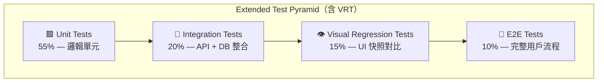

# BDD — Behaviour-Driven Development Feature File Template
<!-- 對應學術標準：Cucumber / Gherkin Specification；對應業界：ATDD，Specification by Example -->
<!-- 本文件定義 BDD .feature 檔案的規範結構，由 gendoc-gen-bdd 或 /gendoc bdd 作為 authoritative 模板遵循 -->
<!-- 上游：PRD（AC 清單）→ 本文件 → 下游：features/<module>/*.feature -->

---

## Document Control

| 欄位 | 內容 |
|------|------|
| **DOC-ID** | BDD-{{PROJECT_SLUG}}-{{YYYYMMDD}} |
| **專案名稱** | {{PROJECT_NAME}} |
| **文件版本** | v1.0 |
| **狀態** | DRAFT / IN_REVIEW / APPROVED |
| **作者（QA Lead / Tech Lead）** | {{AUTHOR}} |
| **日期** | {{DATE}} |
| **上游 PRD** | [PRD.md](PRD.md) §{{PRD_SECTION}} |
| **上游 EDD** | [EDD.md](EDD.md) §5（BDD 設計） |
| **審閱者** | {{QA_LEAD}}, {{ENGINEERING_LEAD}} |
| **核准者** | {{APPROVER}} |

> **Convention（強制規範）**：每個 PRD AC 至少 2 Scenarios（正常路徑 + 錯誤路徑），邊界條件使用 Scenario Outline + Examples Table。

---

## Change Log

| 版本 | 日期 | 作者 | 變更摘要 |
|------|------|------|---------|
| v1.0 | {{DATE}} | {{AUTHOR}} | 初稿 |

---

## 1. Test Pyramid Placement（BDD 在測試金字塔中的定位）

```
           ▲ E2E Tests (少量)
           │  UI 自動化、跨系統整合
           │
          ▲▲▲ BDD / Acceptance Tests  ← 本文件範疇
          │││  Feature files + Step implementations
          │││  驗證業務需求，非技術實作
          │││
         ▲▲▲▲▲ Integration Tests
         │││││  API endpoint、Service boundary、DB queries
         │││││
        ▲▲▲▲▲▲▲ Unit Tests (大量)
               函式、類別、純邏輯
```

**BDD 的正確使用位置：**
- DO：驗收測試（Acceptance Tests）— 以用戶角度描述功能是否正確工作
- DO：用於業務相關 Scenario，對應 PRD 中的 User Story
- DON'T：不適合測試內部實作（函式邏輯、算法細節）
- DON'T：不要用 BDD 取代單元測試（效率低、維護成本高）

**BDD → API Contract 追溯：**
每個 BDD Scenario 應對應至少一個 API endpoint（定義於 `docs/openapi.yaml`）。
Scenario 的 `When` 步驟 = API 呼叫；`Then` 步驟 = API 回應驗收。

---

## 2. Feature File Naming Convention

### 2.1 Path Pattern

**Spring Modulith 兩層目錄結構（HC-1 合規）：**

```
features/{bounded-context}/{domain}/{resource}_{action}.feature
```

- `{bounded-context}`：從 ARCH §4 或 EDD §3.4 推導的 BC 名稱（如 `member`、`wallet`、`game`）
- `{domain}`：BC 內的領域子模組（如 `auth`、`account`、`payment`）
- `{resource}_{action}`：資源名稱 + 動作（如 `user_login`、`order_create`）

> **舊式單層路徑（`features/{domain}/`）已棄用**。所有新 Feature File 必須使用兩層路徑以反映 Bounded Context 邊界。

### 2.2 Naming Examples

| PRD 功能 | Bounded Context | Domain | File Path（兩層） |
|---------|----------------|--------|-----------------|
| 使用者登入 | member | auth | `features/member/auth/user_login.feature` |
| 使用者註冊 | member | auth | `features/member/auth/user_registration.feature` |
| 訂單建立 | order | order | `features/order/order/order_create.feature` |
| 訂單查詢 | order | order | `features/order/order/order_list.feature` |
| 商品搜尋 | catalog | product | `features/catalog/product/product_search.feature` |
| 購物車結帳 | checkout | cart | `features/checkout/cart/cart_checkout.feature` |
| 密碼重設 | member | auth | `features/member/auth/password_reset.feature` |
| 跨 BC 事件契約 | （跨模組）| event | `features/cross-module/event/wallet_credit_event_contract.feature` |

### 2.3 Tag Taxonomy

| Tag | 意義 | 執行頻率 |
|-----|------|---------|
| `@smoke` | 最小可用性驗證，每次部署必跑 | 每次 deploy |
| `@regression` | 完整回歸測試套件 | PR merge / 夜間 |
| `@p0` | 核心業務路徑，阻塞性缺陷 | 每次 deploy |
| `@p1` | 重要功能，高優先 | PR merge |
| `@p2` | 一般功能，中優先 | 夜間 / 周期 |
| `@wip` | 開發中，暫時略過 CI | 手動觸發 |
| `@skip` | 已知失敗 / 暫時停用，需追蹤 issue | 不執行 |
| `@slow` | 執行超過 30 秒的場景 | 夜間專屬 |
| `@api` | 純 API 層測試 | 對應 CI job |
| `@ui` | 瀏覽器 / E2E UI 測試 | 對應 E2E job |

---

## 3. Standard Feature File Template

以下為完整 feature file 結構，涵蓋所有 Gherkin 元素。實際生成時以 PRD AC 為準進行填充。

```gherkin
# features/{{bounded-context}}/{{domain}}/{{resource}}_{{action}}.feature
# 來源：PRD §{{FEATURE_NAME}}，AC-1～AC-N
# DOC-ID: BDD-{{PROJECT_SLUG}}-{{YYYYMMDD}}

@{{domain}} @{{priority_tag}}
Feature: {{功能名稱（與 PRD 功能標題一致）}}
  作為 {{角色（who）}}
  我希望 {{功能描述（what）}}
  以便 {{業務目的（why）}}

  # ─── 共用前置條件 ─────────────────────────────────────
  Background:
    Given {{系統已進入乾淨初始狀態}}
    And {{必要的測試資料已就位}}

  # ─── 正常路徑（來自 AC-1 正常流程）─────────────────────
  @smoke @p0
  Scenario: {{正常路徑描述，使用業務語言}}
    Given {{系統當前狀態 / 前置條件}}
    And {{補充前置條件（選填）}}
    When {{使用者執行的單一動作}}
    Then {{可觀測的預期結果（具體、可測試）}}
    And {{補充斷言（選填）}}

  # ─── 錯誤路徑（來自 AC-2 錯誤流程）─────────────────────
  @regression @p1
  Scenario: {{錯誤路徑描述}}
    Given {{導致錯誤的前置狀態}}
    When {{使用者執行了不合法的動作}}
    Then {{預期的錯誤回應（含 HTTP 狀態碼 / error.code）}}

  # ─── 邊界條件（來自 AC-3 邊界，使用 Scenario Outline）───
  @regression @p1
  Scenario Outline: {{邊界條件描述}}
    Given {{初始狀態}}
    When {{使用者輸入 "<input_field>"}}
    Then {{預期結果為 "<expected_result>"}}

    Examples:
      | input_field | expected_result    |
      | {{value_1}} | {{result_1}}       |
      | {{value_2}} | {{result_2}}       |
      | {{value_3}} | {{result_3}}       |
```

---

## 4. Step Writing Conventions

### 4.1 Given — 系統狀態 / 前置條件

`Given` 描述**測試執行前系統所處的狀態**，不描述動作。

```gherkin
# 正確：描述狀態
Given 使用者已完成 Email 驗證並啟用帳號
Given 購物車中已有 3 件商品，總金額為 $150.00
Given 該 API Key 的每分鐘請求配額剩餘 0 次

# 錯誤：描述動作（Given 不是 When）
Given 使用者呼叫了 POST /api/v1/users        # ❌
Given 系統執行了資料庫 INSERT 操作            # ❌（實作細節）
```

### 4.2 When — 使用者 / 系統動作（每個 When 只有一個動作）

`When` 描述**觸發行為的單一動作**。一個 Scenario 只能有一個主要 `When`。

```gherkin
# 正確：單一動作
When 使用者提交登入表單，email="valid@example.com"，password="Secure123!"
When 使用者點擊「確認付款」按鈕
When 外部系統發送 webhook 事件 order.shipped

# 錯誤：多個動作合併（應拆分為多個 Scenario 或用 And）
When 使用者填寫表單並提交，然後確認 Email    # ❌
When 系統向資料庫寫入記錄並發送通知郵件       # ❌（實作細節）
```

### 4.3 Then — 可觀測的預期結果

`Then` 斷言**使用者能觀察到的結果**，必須具體且可自動化驗證。

```gherkin
# 正確：具體、可測試
Then 回應狀態碼為 201
And 回應 body 包含 order_id 且格式為 UUID
And 使用者收到 email 主旨為「訂單確認」的通知郵件
And 資料庫中該訂單的 status 欄位值為 "confirmed"

# 錯誤：模糊、不可測試
Then 操作成功                      # ❌ 成功的定義是什麼？
Then 系統沒有報錯                  # ❌ 無明確斷言
Then 頁面顯示一些資訊              # ❌ 太籠統
```

### 4.4 And / But — 延續步驟

- `And`：延續同類型 step（Given And、When And、Then And）
- `But`：用於在 Then 中表達「但某事不發生」的否定斷言

```gherkin
Then 回應狀態碼為 200
And 回應含 access_token（JWT 格式）
But 回應不含使用者密碼雜湊值
```

### 4.5 禁止模式（Forbidden Patterns）

| 禁止模式 | 原因 | 修正方式 |
|---------|------|---------|
| When 包含多個動作 | 破壞原子性，無法定位失敗原因 | 拆分為獨立 Scenario |
| Given/Then 暴露 SQL / HTTP 方法 | 耦合實作，重構即破壞測試 | 改用業務語言描述狀態 |
| 在 Step 中硬編碼時間戳（如 `2024-01-01`） | 測試將在未來某日失敗 | 改用相對時間描述（`3天前`）|
| Scenario 無 Then | 沒有驗證，等同無效測試 | 必須有至少一個 Then |
| Background 放置與部分 Scenario 無關的步驟 | 造成混淆，增加執行成本 | 移入各自的 Scenario |

---

## 5. Data Table Pattern

Data Tables 用於傳遞多欄位結構化輸入或驗證多欄位輸出。

### 5.1 多欄位輸入

```gherkin
Scenario: 使用者填寫完整個人資料後成功建立帳號
  Given 系統處於正常運作狀態
  When 使用者提交以下註冊資訊：
    | 欄位     | 值                      |
    | email    | alice@example.com       |
    | password | Secure123!              |
    | name     | Alice Chen              |
    | phone    | +886-912-345-678        |
  Then 回應狀態碼為 201
  And 回應 body 的 user.email 為 "alice@example.com"
```

### 5.2 批次建立測試資料（Fixture）

```gherkin
Background:
  Given 資料庫已初始化
  And 系統中已存在以下商品：
    | product_id | name       | price  | stock |
    | P001       | 無線耳機   | 2999   | 50    |
    | P002       | 藍牙喇叭   | 4999   | 20    |
    | P003       | 充電線     | 299    | 0     |
```

### 5.3 多欄位結果驗證

```gherkin
Scenario: 訂單詳情包含正確的商品資訊
  Given 訂單 order_id="ORD-12345" 已確認
  When 使用者查詢訂單詳情
  Then 回應狀態碼為 200
  And 回應中的訂單明細包含：
    | 欄位           | 預期值                |
    | order_id       | ORD-12345             |
    | status         | confirmed             |
    | total_amount   | 3298                  |
    | item_count     | 2                     |
    | currency       | TWD                   |
```

---

## 6. Scenario Outline Pattern

Scenario Outline 搭配 Examples Table，用於以不同資料集執行相同流程（邊界條件、等價類別劃分）。

```gherkin
@regression @p1
Scenario Outline: 輸入格式驗證涵蓋各類邊界值
  """
  驗證 email 欄位對各種非法格式均回傳 VALIDATION_ERROR，
  確保前端與後端雙重驗證一致。
  """
  Given 系統處於正常運作狀態
  When 使用者以 email="<email>"、password="<password>" 嘗試登入
  Then 回應狀態碼為 <status_code>
  And 回應的 error.code 為 "<error_code>"

  Examples: 空值與格式錯誤
    | email                | password    | status_code | error_code          |
    |                      | Secure123!  | 400         | VALIDATION_ERROR    |
    | notanemail           | Secure123!  | 400         | VALIDATION_ERROR    |
    | @missinglocal.com    | Secure123!  | 400         | VALIDATION_ERROR    |
    | valid@example.com    |             | 400         | VALIDATION_ERROR    |

  Examples: 長度邊界
    | email                                      | password    | status_code | error_code          |
    | a@b.co                                     | Secure123!  | 200         | -                   |
    | aaaaaaaaaaaaaaaaaaaaaaaaaaaaaaa@example.com | Secure123!  | 400         | VALIDATION_ERROR    |
```

---

## 7. Background Section Pattern

### 7.1 何時使用 Background

Background 只放**所有 Scenario 均需要的前置條件**。若某個步驟只有部分 Scenario 需要，放入各自的 `Given`。

```gherkin
# 正確：每個 Scenario 都需要乾淨的 DB + 測試使用者
Background:
  Given 資料庫已初始化（clean state）
  And 已有啟用中的使用者 email="test@example.com"，password="Test1234!"

# 錯誤：並非每個 Scenario 都需要「已登入狀態」
Background:
  Given 資料庫已初始化
  And 使用者已成功登入           # ❌ 僅登入相關測試需要，勿放 Background
```

### 7.2 Background 與 Scenario 的職責分工

| 放 Background | 放各 Scenario Given |
|--------------|---------------------|
| 資料庫初始化 / 清除 | 特定角色或狀態（管理員 / 停用帳號） |
| 通用測試資料建立 | 特定測試的前置資料 |
| 系統層級的組態設定 | Scenario 特有的 mock / stub |
| 共用 stub / mock 伺服器啟動 | 特定的速率限制計數重置 |

---

## 8. Error Scenario Catalog

每個 Feature 應涵蓋以下標準錯誤路徑。`gendoc bdd` 生成時自動對應 PRD AC 的錯誤流程到此目錄。

| HTTP 狀態碼 | error.code | Scenario 描述 | 對應標準 |
|------------|-----------|--------------|---------|
| 400 | `VALIDATION_ERROR` | 必填欄位缺失或格式錯誤 | RFC 9110 |
| 401 | `UNAUTHENTICATED` | 未提供認證憑證或 token 已過期 | RFC 6750 |
| 401 | `INVALID_CREDENTIALS` | 認證憑證無效（帳密錯誤） | RFC 6750 |
| 403 | `FORBIDDEN` | 已認證但無操作權限 | RFC 9110 |
| 403 | `ACCOUNT_INACTIVE` | 帳號已停用或未驗證 | — |
| 404 | `NOT_FOUND` | 資源不存在 | RFC 9110 |
| 409 | `DUPLICATE_RESOURCE` | 資源已存在（如重複 email） | RFC 9110 |
| 422 | `BUSINESS_RULE_VIOLATION` | 業務規則驗證失敗（如庫存不足） | — |
| 429 | `RATE_LIMIT_EXCEEDED` | 超過速率限制，含 Retry-After | RFC 6585 |

### 8.1 標準錯誤 Scenario 寫法範例

```gherkin
Scenario: 未提供認證 token 時拒絕存取（401）
  Given 請求不含 Authorization header
  When 使用者呼叫 GET /api/v1/orders
  Then 回應狀態碼為 401
  And 回應的 error.code 為 "UNAUTHENTICATED"

Scenario: 一般使用者無法存取管理員 API（403）
  Given 使用者已以一般帳號 role="user" 登入
  When 使用者呼叫 DELETE /api/v1/admin/users/123
  Then 回應狀態碼為 403
  And 回應的 error.code 為 "FORBIDDEN"

Scenario: 查詢不存在的訂單（404）
  Given 訂單 "ORD-NONEXISTENT" 在系統中不存在
  When 使用者查詢訂單詳情
  Then 回應狀態碼為 404
  And 回應的 error.code 為 "NOT_FOUND"

Scenario: 重複建立已存在的 Email（409）
  Given 系統中已有 email="existing@example.com" 的使用者
  When 使用者以相同 email 嘗試註冊
  Then 回應狀態碼為 409
  And 回應的 error.code 為 "DUPLICATE_RESOURCE"

Scenario: 觸發速率限制後回傳 429（429）
  Given 同一 IP 在 1 分鐘內已發出 100 次請求
  When 使用者再次發出請求
  Then 回應狀態碼為 429
  And 回應含 Retry-After header
  And 回應的 error.code 為 "RATE_LIMIT_EXCEEDED"
```

---

## 9. Client-Side BDD (UI/E2E) Pattern

前端 / UI Scenario 採用 Page Object 風格的步驟語言，聚焦在使用者可見行為，不暴露 DOM 選擇器或 CSS class。

### 9.1 UI Step 寫作原則

```gherkin
# 正確：Page Object 風格，描述使用者意圖
When 使用者在「電子郵件」欄位輸入 "alice@example.com"
When 使用者點擊「登入」按鈕
Then 頁面標題顯示「訂單列表」
Then 畫面上顯示成功通知「登入成功，歡迎回來！」

# 錯誤：暴露 DOM 實作細節
When 使用者在 CSS selector "#email-input" 輸入值   # ❌
When 使用者點擊 data-testid="submit-btn" 元素      # ❌
Then body.class 包含 "logged-in"                   # ❌
```

### 9.2 UI Feature 範例

```gherkin
# features/ui/auth/login_page.feature

@ui @smoke @p0
Feature: 登入頁面（UI）
  作為訪客使用者
  我希望透過登入頁面輸入帳號密碼
  以便進入系統並存取個人資源

  Background:
    Given 瀏覽器已開啟登入頁面 "/login"

  @smoke
  Scenario: 輸入正確帳密後跳轉至首頁
    When 使用者在「電子郵件」欄位輸入 "valid@example.com"
    And 使用者在「密碼」欄位輸入 "Secure123!"
    And 使用者點擊「登入」按鈕
    Then 頁面跳轉至 "/dashboard"
    And 頁面標題顯示「我的儀表板」
    And 右上角顯示使用者名稱 "Alice Chen"

  Scenario: 輸入錯誤密碼後顯示錯誤提示
    When 使用者在「電子郵件」欄位輸入 "valid@example.com"
    And 使用者在「密碼」欄位輸入 "WrongPass!"
    And 使用者點擊「登入」按鈕
    Then 頁面停留在 "/login"
    And 畫面顯示錯誤訊息「電子郵件或密碼錯誤，請重新輸入」
    And 密碼欄位內容被清空

  Scenario: 未填寫必填欄位時顯示欄位驗證提示
    When 使用者點擊「登入」按鈕，未填寫任何欄位
    Then 「電子郵件」欄位下方顯示「此欄位為必填」
    And 「密碼」欄位下方顯示「此欄位為必填」
    And 焦點移至「電子郵件」欄位
```

---

## 10. Tag Strategy

### 10.1 完整 Tag 分類表

| Tag | 意義 | 何時使用 | 執行頻率 |
|-----|------|---------|---------|
| `@smoke` | 最小可用性驗證 | 核心正常路徑、系統啟動後第一層驗證 | 每次 deploy |
| `@regression` | 完整回歸套件 | 所有功能場景，確保歷史功能未被破壞 | PR merge / 夜間 |
| `@p0` | 阻塞性核心功能 | 系統無法運作的場景（登入、下單、付款） | 每次 deploy |
| `@p1` | 重要功能 | 高影響但非阻塞性場景 | PR merge |
| `@p2` | 一般功能 | 中等影響，非關鍵路徑 | 夜間 |
| `@p3` | 低優先 | 邊緣案例、錯誤訊息格式 | 週期性 |
| `@wip` | 開發中 | 未完成的 Scenario，CI 略過 | 手動觸發 |
| `@skip` | 停用 | 已知失敗，需對應 tracking issue | 不執行 |
| `@slow` | 執行時間長 | 超過 30 秒的場景（E2E 流程、批次作業） | 夜間專屬 |
| `@api` | API 層測試 | 後端 REST / GraphQL endpoint 測試 | 對應 API CI job |
| `@ui` | 瀏覽器 E2E | 前端頁面 / 互動行為測試 | 對應 E2E CI job |
| `@auth` | 認證 / 授權 | 所有涉及身份驗證的場景 | 安全回歸 |
| `@security` | 安全測試 | 越權、注入、速率限制等場景 | 安全回歸 |
| `@ha` | 高可用性驗證 | Pod Failover / DB Failover / Graceful Shutdown | 每次 deploy（pre-flight）|
| `@failover` | 故障切換場景 | 元件故障後自動恢復的 E2E 驗證 | HA 回歸套件 |
| `@chaos` | 混沌工程場景 | 強制終止 Pod / 注入延遲 / 模擬 DB 故障 | 每日夜間 |
| `@admin` | Admin 後台功能 | 所有 Admin 後台相關場景（has_admin_backend=true 時必填）| Admin 回歸 |
| `@rbac` | 角色權限控制 | RBAC 邊界測試（Admin 角色隔離、Permission 邊界）| 安全回歸 |
| `@audit` | 稽核日誌驗證 | 確認高風險操作記錄在 AuditLog 且內容完整 | 安全回歸 |
| `@modulith` | Spring Modulith 邊界測試 | 驗證系統在 Modular Monolith 模式下的 BC 隔離行為 | 架構回歸 |
| `@cross-module` | 跨 BC 呼叫驗證 | 跨 Bounded Context 的 Public API 呼叫場景 | 架構回歸 |
| `@event-contract` | Domain Event 契約測試 | 驗證 event schema version 與 topic name 符合契約 | 架構回歸 |
| `@module-isolation` | BC 冷啟動隔離測試 | 單一 BC 獨立啟動，其他 BC 為 stub，驗證無非法依賴 | 架構回歸 |

### 10.2 Tag 組合原則

每個 Scenario 應包含：**1 個 priority tag**（`@p0~@p3`）+ **1 個 scope tag**（`@api` 或 `@ui`）+ 視情況加 `@smoke` 或 `@regression`。

```gherkin
@smoke @p0 @api       # 最核心的 API 場景
@regression @p1 @api  # 重要但非核心的 API 場景
@regression @p2 @ui   # 一般 UI 功能場景
@wip @p1 @api         # 開發中，CI 略過
```

---

## 11. Example Complete Feature File

以下為生產品質的完整 `.feature` 檔案，作為 `gendoc bdd` 生成輸出的黃金標準。

```gherkin
# features/orders/order_create.feature
# 來源：PRD §訂單管理 > 建立訂單，AC-1～AC-6
# DOC-ID: BDD-MYSHOP-20260420

@orders @api
Feature: 建立訂單
  作為已登入的會員使用者
  我希望將購物車中的商品結帳建立訂單
  以便完成購買流程並取得訂單確認

  Background:
    Given 資料庫已初始化（clean state）
    And 使用者 email="buyer@example.com" 已登入，role="customer"
    And 系統中已有以下商品：
      | product_id | name     | price | stock |
      | P001       | 無線耳機 | 2999  | 10    |
      | P002       | 充電線   | 299   | 0     |

  # ─── AC-1：正常建立訂單 ──────────────────────────────────
  @smoke @p0
  Scenario: 以有效商品和收件地址成功建立訂單
    Given 購物車中已有商品 P001 數量 2
    When 使用者提交結帳，收件地址為台北市信義區信義路五段7號
    Then 回應狀態碼為 201
    And 回應 body 包含 order_id，格式為 UUID
    And 回應的 order.status 為 "pending_payment"
    And 回應的 order.total_amount 為 5998
    And 庫存中 P001 的 stock 減少 2，變為 8

  # ─── AC-2：庫存不足拒絕下單 ─────────────────────────────
  @regression @p1
  Scenario: 商品庫存不足時無法建立訂單
    Given 購物車中已有商品 P002 數量 1
    When 使用者提交結帳
    Then 回應狀態碼為 422
    And 回應的 error.code 為 "BUSINESS_RULE_VIOLATION"
    And 回應的 error.message 包含 "庫存不足"
    And 資料庫中無新訂單建立

  # ─── AC-3：未登入拒絕下單 ───────────────────────────────
  @regression @p0 @security
  Scenario: 未登入使用者無法建立訂單
    Given 請求不含有效的 Authorization token
    When 匿名使用者嘗試提交結帳，商品 P001 數量 1
    Then 回應狀態碼為 401
    And 回應的 error.code 為 "UNAUTHENTICATED"

  # ─── AC-4：收件地址驗證 ─────────────────────────────────
  @regression @p1
  Scenario: 收件地址缺少必填欄位時拒絕建立訂單
    Given 購物車中已有商品 P001 數量 1
    When 使用者提交結帳，收件地址缺少郵遞區號
    Then 回應狀態碼為 400
    And 回應的 error.code 為 "VALIDATION_ERROR"
    And 回應的 error.fields 包含 "shipping_address.postal_code"

  # ─── AC-5：數量邊界條件 ─────────────────────────────────
  @regression @p2
  Scenario Outline: 訂單數量邊界條件驗證
    Given 購物車中已有商品 P001 數量 <quantity>
    When 使用者提交結帳
    Then 回應狀態碼為 <status_code>
    And 回應的 error.code 為 "<error_code>"

    Examples: 數量邊界
      | quantity | status_code | error_code              |
      | 0        | 400         | VALIDATION_ERROR        |
      | -1       | 400         | VALIDATION_ERROR        |
      | 1        | 201         | -                       |
      | 10       | 201         | -                       |
      | 11       | 422         | BUSINESS_RULE_VIOLATION |

  # ─── AC-6：速率限制 ─────────────────────────────────────
  @regression @p2 @security @slow
  Scenario: 同一使用者 1 分鐘內超過 10 次下單觸發速率限制
    Given 同一使用者在 1 分鐘內已成功建立 10 筆訂單
    When 使用者再次嘗試建立第 11 筆訂單
    Then 回應狀態碼為 429
    And 回應含 Retry-After header，值大於 0
    And 回應的 error.code 為 "RATE_LIMIT_EXCEEDED"
```

---

## 12. Contract Testing（契約測試）

> BDD Scenario 應與 API 規格（`docs/openapi.yaml`）雙向追溯，確保 API 契約不被意外破壞。

### 12.1 BDD ↔ OpenAPI 追溯矩陣

| BDD Scenario | 對應 API Endpoint | HTTP Method | 回應碼驗證 | 狀態 |
|-------------|-----------------|:-----------:|:---------:|:---:|
| `@contract-create-{{resource}}` | `POST /api/v1/{{resource}}` | POST | 201, 400, 409 | 🔲 |
| `@contract-list-{{resource}}` | `GET /api/v1/{{resource}}` | GET | 200, 401 | 🔲 |
| `@contract-get-{{resource}}` | `GET /api/v1/{{resource}}/{id}` | GET | 200, 404 | 🔲 |

**標籤規範：** 使用 `@contract` tag 標記所有 API 契約測試 Scenario。

### 12.2 Provider-Driven Contract Test 標準

```gherkin
@contract @contract-create-user
Scenario: 成功建立用戶（Contract: POST /api/v1/users → 201）
  Given API endpoint "POST /api/v1/users" 存在且符合 OpenAPI 規格
  When 使用有效的 JSON body 呼叫 "POST /api/v1/users"
    """
    {
      "email": "contract@test.com",
      "name": "Contract Test User"
    }
    """
  Then 回應狀態碼為 201
  And 回應 body 符合 "{{ResourcePascal}}Response" schema
  And 回應 header "Location" 包含新建資源的 URL
```

---

## 13. Test Data Management（測試資料管理）

### 13.1 測試資料策略

| 策略 | 適用場景 | 優點 | 缺點 |
|------|---------|------|------|
| **Test Fixtures（靜態固定資料）** | 唯讀測試、快照測試 | 穩定、速度快 | 難以動態組合 |
| **Factory（動態建立）** | 多數 BDD scenario | 彈性高、可組合 | 較複雜 |
| **Seed（資料庫種子資料）** | 整合測試 | 接近真實 | 測試隔離性差 |
| **Mock / Stub（模擬外部依賴）** | 第三方 API、郵件服務 | 速度快、可控 | 不測試真實整合 |

**本專案策略：** 每個 BDD Scenario 使用 Factory 動態建立資料，Scenario 結束後自動清除（Transaction Rollback 或 AfterScenario 清除）。

### 13.2 測試資料清理原則

```gherkin
# 每個 Feature 在 Background 中建立專屬測試資料
Background:
  Given 資料庫已清除測試用戶
  And 系統中存在以下測試用戶:
    | id                                   | email                | role  |
    | 550e8400-e29b-41d4-a716-446655440000 | test@example.com     | admin |

# AfterScenario hook 自動清除
# @AfterScenario
# def cleanup_test_data(context):
#     context.db.execute("DELETE FROM users WHERE email LIKE '%@test-bdd.com'")
#     context.db.commit()
```

**禁止事項：**
- 禁止 BDD 測試依賴其他 Scenario 的資料殘留
- 禁止在 Production 環境執行 BDD 測試（必須透過環境 tag 保護）
- 禁止測試資料包含真實用戶 PII

---

## Appendix A — gendoc bdd 對應關係

| PRD 元素 | BDD 對應 |
|---------|---------|
| `## 功能N` 標題 | `Feature:` 名稱 |
| `作為 / 我希望 / 以便` | User Story 三段式 |
| `- [ ] AC-N（正常流程）` | 正常路徑 `Scenario` |
| `- [ ] AC-N（錯誤流程）` | 錯誤路徑 `Scenario` |
| `- [ ] AC-N（邊界條件）` | `Scenario Outline` + `Examples` |
| 功能模組分類 | `features/<bounded-context>/<domain>/` 兩層子目錄（BC 名稱從 ARCH §4 推導） |
| PRD Priority（P0/P1/P2） | `@p0` / `@p1` / `@p2` tag |

## Appendix B — 生成完成確認清單

- [ ] 每個 PRD P0 功能至少有一個 `.feature` 檔
- [ ] 每個 PRD AC 至少有一個 Scenario（正常路徑）
- [ ] 每個 PRD AC 有對應的錯誤路徑 Scenario
- [ ] 邊界條件（空值、超長、並發、庫存等）使用 Scenario Outline
- [ ] 所有 Then 斷言具體且可自動化驗證
- [ ] Step 語言無技術細節滲入（無 SQL / HTTP method / DOM selector）
- [ ] 所有 Scenario 含有對應的 priority tag 和 scope tag
- [ ] `@wip` / `@skip` 均有對應的追蹤 issue 編號
- [ ] UI Scenario 與 API Scenario 分開存放於不同 feature file

---

## 14. Visual Regression Testing

### 14.1 Visual Regression 在測試金字塔中的定位



> **定位**：VRT 是 E2E 的補充，不是替代。E2E 驗證行為流程，VRT 驗證視覺一致性。

### 14.2 VRT 工具選型

| 工具 | 整合方式 | 快照存儲 | 差異比較算法 | 適用場景 |
|------|---------|---------|------------|---------|
| **Playwright + `expect().toHaveScreenshot()`** | 原生 | Git / CI Artifacts | Pixel-by-pixel | 大多數 Web 專案（推薦） |
| **Storybook + Chromatic** | Storybook | Chromatic Cloud | AI-based | 設計系統 / Component Library |
| **Percy（BrowserStack）** | CI Plugin | Percy Cloud | Intelligent | 跨瀏覽器 VRT |
| **BackstopJS** | 獨立工具 | 本地 / S3 | Pixel-by-pixel | 舊有專案快速接入 |

**本專案選型：`{{VRT_TOOL}}`**

### 14.3 Playwright VRT 標準模式

```typescript
// tests/visual/homepage.visual.spec.ts
import { test, expect } from '@playwright/test';

test.describe('Visual Regression — Homepage', () => {
  test.beforeEach(async ({ page }) => {
    // 停用動態內容（時間、隨機廣告等）防止快照噪音
    await page.addInitScript(() => {
      Date.now = () => new Date('2026-01-01T00:00:00Z').getTime();
    });
  });

  test('hero section matches baseline @vrt', async ({ page }) => {
    await page.goto('/');
    await page.waitForLoadState('networkidle');
    
    // 遮蔽動態元素（時間戳、廣告、用戶頭像）
    await expect(page.locator('.hero-section')).toHaveScreenshot(
      'hero-section.png',
      {
        mask: [page.locator('.dynamic-timestamp'), page.locator('.ad-banner')],
        maxDiffPixels: 50,        // 允許 50 個像素差異（字體渲染差異）
        threshold: 0.2,            // 單個像素差異閾值（0-1）
        animations: 'disabled',    // 停用 CSS 動畫
      }
    );
  });

  test('navigation matches baseline at mobile @vrt', async ({ page }) => {
    await page.setViewportSize({ width: 375, height: 812 });  // iPhone 14
    await page.goto('/');
    await expect(page.locator('nav')).toHaveScreenshot('nav-mobile.png');
  });
});

// playwright.config.ts — VRT 專用配置
export default {
  projects: [
    {
      name: 'vrt-chrome',
      use: { browserName: 'chromium', viewport: { width: 1440, height: 900 } },
    },
    {
      name: 'vrt-mobile',
      use: { ...devices['iPhone 14'], isMobile: true },
    },
  ],
  // 快照更新：pnpm playwright test --update-snapshots
  snapshotPathTemplate: '{testDir}/__snapshots__/{testFilePath}/{arg}-{projectName}{ext}',
};
```

### 14.4 VRT CI/CD 整合

```yaml
# .github/workflows/visual-regression.yml
name: Visual Regression Tests
on:
  pull_request:
    paths: ['src/**', 'public/**', '*.css']  # 僅 UI 相關變更觸發

jobs:
  vrt:
    runs-on: ubuntu-latest
    steps:
      - uses: actions/checkout@v4
      
      - name: Install Playwright Browsers
        run: npx playwright install --with-deps chromium
      
      - name: Start Dev Server
        run: pnpm dev &
        env:
          NODE_ENV: test
      
      - name: Run Visual Regression Tests
        run: pnpm playwright test tests/visual/ --reporter=html
        
      - name: Upload VRT Report
        if: failure()   # 只在失敗時上傳（節省 CI 成本）
        uses: actions/upload-artifact@v4
        with:
          name: vrt-report-${{ github.sha }}
          path: playwright-report/
          retention-days: 14

      - name: Comment PR with VRT Results
        if: failure()
        uses: actions/github-script@v7
        with:
          script: |
            github.rest.issues.createComment({
              issue_number: context.issue.number,
              body: `⚠️ **Visual Regression Tests Failed**\n\nPlease review the VRT report artifact and update snapshots if changes are intentional:\n\`\`\`\npnpm playwright test --update-snapshots\ngit add tests/visual/__snapshots__\ngit commit -m "test: update visual regression snapshots"\n\`\`\``
            });
```

### 14.5 快照管理規範

**更新快照的正確流程：**

1. 確認視覺變更是**有意的**（設計師 / PM 確認）
2. 本地執行：`pnpm playwright test --update-snapshots`
3. 審查差異圖（`playwright-report/`）
4. 提交快照更新：`git commit -m "test(vrt): update snapshots for new design"`
5. PR 描述中附上截圖對比說明變更原因

**快照噪音排查清單：**
- [ ] 是否有動態內容未被 `mask` 遮蔽（時間、動畫、外部廣告）？
- [ ] 字體渲染是否跨平台一致？（CI 與本地使用相同 Docker image）
- [ ] `maxDiffPixels` 容差是否合理設定？
- [ ] 測試是否等待 `networkidle` / 動畫完成後再截圖？

---

## 15. Mutation Testing Strategy

### 15.1 突變測試的定位

> **問題**：代碼覆蓋率 80% 並不等於測試品質 80%。
> **突變測試**：故意修改代碼（製造 Bug），驗證測試能否偵測到 Bug。

```
突變測試評分（Mutation Score）= 被殺死的突變體 / 總突變體 × 100%
目標：Mutation Score ≥ 70%
```

**常見突變類型：**

| 突變類型 | 範例（原始 → 突變） | 測試應偵測原因 |
|---------|----------------|------------|
| 邊界條件 | `>` → `>=` | 邊界值測試 |
| 邏輯運算符 | `&&` → `\|\|` | 組合條件測試 |
| 算術運算符 | `+` → `-` | 計算邏輯測試 |
| 回傳值 | `return true` → `return false` | 結果斷言 |
| 條件取反 | `if (valid)` → `if (!valid)` | 正反路徑測試 |
| 空值移除 | `if (x != null)` → 移除 null 檢查 | 邊界值測試 |

### 15.2 工具選型

| 語言 | 工具 | 安裝方式 | 整合難度 |
|------|------|---------|---------|
| JavaScript/TypeScript | **Stryker Mutator** | `npm i -D @stryker-mutator/core` | 低 |
| Python | **mutmut** | `pip install mutmut` | 低 |
| Java | **PIT（Pitest）** | Maven/Gradle plugin | 低 |
| Go | **go-mutesting** | `go install` | 中 |

### 15.3 Stryker 配置（TypeScript）

```json
// stryker.config.json
{
  "$schema": "./node_modules/@stryker-mutator/core/schema/stryker-schema.json",
  "packageManager": "npm",
  "reporters": ["html", "progress", "dashboard"],
  "testRunner": "jest",
  "coverageAnalysis": "perTest",
  "mutate": [
    "src/**/*.ts",
    "!src/**/*.spec.ts",
    "!src/**/*.d.ts",
    "!src/generated/**"
  ],
  "thresholds": {
    "high": 80,
    "low": 60,
    "break": 50
  },
  "timeoutMS": 10000,
  "concurrency": 4
}
```

### 15.4 突變測試 CI/CD 整合策略

> **注意**：突變測試耗時長（可能是單元測試的 10-50×）。建議以下策略降低成本：

**策略 1：僅測試變更的文件（推薦）**

```yaml
# CI 中使用 Git diff 限制突變測試範圍
- name: Run Mutation Tests (Changed Files Only)
  run: |
    CHANGED=$(git diff --name-only origin/main... | grep 'src/.*\.ts$' | head -5)
    if [ -n "$CHANGED" ]; then
      npx stryker run --mutate "$CHANGED"
    fi
```

**策略 2：定期完整掃描（每周一次）**

```yaml
on:
  schedule:
    - cron: '0 2 * * 1'  # 每週一凌晨 2:00 執行完整突變測試
```

**策略 3：按模組分類，高風險模組強制執行**

```json
// stryker.config.json — 高風險核心業務邏輯
{
  "mutate": [
    "src/domain/pricing/**/*.ts",
    "src/domain/payment/**/*.ts",
    "src/domain/auth/**/*.ts"
  ],
  "thresholds": { "break": 70 }
}
```

### 15.5 提升 Mutation Score 實戰指南

**常見「弱測試」模式（低 Mutation Score 的原因）：**

```typescript
// ❌ 弱測試：只驗證「有呼叫」，不驗證「結果正確」
it('calls calculatePrice', () => {
  const spy = jest.spyOn(service, 'calculatePrice');
  service.processOrder(order);
  expect(spy).toHaveBeenCalled();  // 突變體改回傳值不會被殺死
});

// ✅ 強測試：明確斷言具體結果
it('calculates correct price with 10% discount', () => {
  const result = service.calculatePrice({
    basePrice: 100,
    discountRate: 0.10
  });
  expect(result.finalPrice).toBe(90);     // 邊界值：整數
  expect(result.discount).toBe(10);       // 驗證中間計算
  expect(result.taxAmount).toBe(9);       // 驗證衍生計算
});

// ✅ 邊界值測試（殺死邊界突變體）
it.each([
  [0, 0, 0],          // 零值
  [100, 0, 100],      // 無折扣
  [100, 1.0, 0],      // 100% 折扣
  [100, 0.5, 50],     // 50% 折扣
])('basePrice=%d, discount=%d → finalPrice=%d', (base, disc, expected) => {
  expect(calculatePrice(base, disc)).toBe(expected);
});
```

---

## 16. HA BDD Scenario Patterns（高可用性 BDD 場景模式）

> **必要性**：HA 測試不是「Future Scope」，是 MVP 上線前的必要驗收標準。  
> 所有 `@ha` / `@failover` / `@chaos` 場景必須在 `features/ha/` 目錄下定義。  
> 生成時參考 EDD §3.6（HA Architecture）和 test-plan.md §3.6（HA 測試策略）。

### 16.1 Pod Failover 場景模式

```gherkin
# features/ha/api_pod_failover.feature
# 來源：EDD §3.6.4 BCP 場景 / test-plan §3.6.1

Feature: API Pod Failover — 高可用性驗證

  Background:
    Given 系統已部署 2 個 API Server Pod（replicas ≥ 2）
    And 有持續每秒 10 req 的流量（vegeta / k6 運行中）

  @ha @failover @chaos @p0 @api
  Scenario: 強制終止一個 API Pod，流量自動切換
    When 其中 1 個 API Pod 被強制終止（kubectl delete pod）
    Then 新 Pod 在 30 秒內通過 Readiness Probe
    And 期間 5XX 錯誤率 ≤ 0.1%（允許 ≤ 1 個請求失敗）
    And 終止的 Pod 名稱已從 Endpoints 列表中移除

  @ha @failover @chaos @p0 @api
  Scenario: Graceful Shutdown — in-flight 請求正常完成
    Given 有 1 個 API Pod 正在處理需要 5 秒的長請求
    When Kubernetes 對該 Pod 發送 SIGTERM 信號
    Then Pod Readiness Probe 立即回傳 503（停止接收新請求）
    And 正在處理的 5 秒請求正常完成（HTTP 200）
    And 新請求自動路由至其他 Pod（HTTP 200）
    And Pod 在 30 秒內正常退出（exit 0）
```

### 16.2 DB Failover 場景模式

```gherkin
# features/ha/db_failover.feature
# 來源：EDD §3.6.4 BCP 場景 / SCHEMA §25

Feature: DB Primary Failover — 資料一致性驗證

  Background:
    Given 系統 DB 為 Primary + Standby 架構
    And 每秒有 5 筆寫入操作（訂單 / 用戶 / 資料記錄）

  @ha @failover @chaos @p0 @api
  Scenario: DB Primary 故障，Standby 自動提升
    When DB Primary 節點停止（模擬：停止 PostgreSQL 進程）
    Then Standby 在 30 秒內自動提升為 Primary
    And 所有已確認（WAL 同步）的寫入資料不遺失
    And API 在 60 秒內恢復正常寫入
    And API Health Check（/health/ready）在 Failover 完成後回傳 200

  @ha @chaos @p1 @api
  Scenario: Replica Lag 過高時讀取走 Primary
    Given DB Replica Lag 超過 5 秒
    When 使用者查詢剛才寫入的資料
    Then 系統自動切換至 Primary 讀取（避免讀到過期資料）
    And 回應資料與寫入一致
```

### 16.3 Redis Failover 場景模式

```gherkin
# features/ha/redis_failover.feature
# 來源：EDD §3.6.1 SPOF 分析

Feature: Redis Sentinel Failover — Cache 服務降級驗證

  @ha @failover @chaos @p1 @api
  Scenario: Redis Master 故障，Sentinel 選出新 Master
    Given Redis 以 Sentinel 模式運行（3 個 Sentinel 節點）
    When Redis Master 節點停止
    Then Sentinel 在 30 秒內選出新 Master
    And 業務操作降級（Cache Miss，從 DB 讀取）但不報 500 錯誤
    And API 回傳正確資料（降級但服務不中斷）
    And 新 Master 選出後 Cache 逐步回填
```

### 16.4 Worker 冪等性驗證場景模式

```gherkin
# features/ha/worker_idempotency.feature
# 來源：EDD §3.6.2 HA 設計原則 — 冪等 Worker

Feature: Background Worker 冪等性驗證

  @ha @p0 @api
  Scenario: 同一 Job 被兩個 Worker 同時消費，業務結果只執行一次
    Given Job Queue 有 1 個待處理的任務（任務 ID: {{JOB_ID}}）
    And 系統有 2 個 Worker Pod 同時運行
    When 兩個 Worker 同時嘗試消費同一個 Job
    Then 業務操作只執行一次（DB 無重複記錄）
    And Job 狀態標記為 "completed"（只出現一次）
    And 第二個 Worker 偵測到重複並跳過（Distributed Lock / DB 唯一約束）

  @ha @chaos @p1 @api
  Scenario: Worker Pod 在任務中途崩潰，任務自動重試
    Given Worker 正在處理一個需要 10 秒的任務
    When Worker Pod 在第 3 秒被強制終止
    Then 任務自動重新入隊
    And 其他 Worker 在 30 秒內撿起並完成該任務
    And 業務結果正確（冪等性：重試結果與首次執行一致）
```

---

## 17. Admin BDD Scenario Patterns（Admin 後台 BDD 場景模式）

<!-- 觸發條件：has_admin_backend=true；否則略過此章節 -->

> **觸發條件**：`has_admin_backend=true` 時填寫，否則標注「本專案無 Admin 後台，跳過 §17」。  
> Admin BDD 場景必須覆蓋：RBAC 角色邊界、稽核日誌記錄、高風險操作保護。

### 17.1 Admin 認證與 RBAC 場景

```gherkin
# features/admin/admin_auth.feature
# 來源：ADMIN_IMPL.md §RBAC / API.md §18.1

Feature: Admin 認證與 RBAC 權限控制

  Background:
    Given Admin 後台入口為 /admin/api/v1/
    And 所有 Admin 操作需要有效的 Admin JWT Token

  @admin @auth @p0 @api
  Scenario: Super Admin 成功登入（含 TOTP）
    Given 有效的 Admin 帳號（super_admin 角色）
    When 使用正確的 username/password + TOTP 碼登入
    Then 回傳 Admin JWT Token（有效期 15 分鐘）
    And Token payload 含 roles: ["super_admin"]

  @admin @auth @p0 @api
  Scenario: Admin 登入失敗 5 次帳號鎖定
    Given Admin 帳號連續 5 次登入失敗
    When 第 6 次嘗試登入
    Then 回傳 HTTP 423（帳號已鎖定）
    And 稽核日誌記錄「連續登入失敗 - 帳號鎖定」事件

  @admin @rbac @p0 @api
  Scenario: Operator 角色嘗試存取 Super Admin 功能被拒絕
    Given Admin 帳號具有 "operator" 角色（無 user.delete 權限）
    When 嘗試呼叫 DELETE /admin/api/v1/users/:id
    Then 回傳 HTTP 403（無權限）
    And 稽核日誌記錄「未授權存取嘗試」事件

  @admin @rbac @p1 @api
  Scenario: Super Admin 為 Operator 分配新角色
    Given Super Admin 已登入
    And 有一個 operator 角色的 Admin 用戶
    When Super Admin 為其分配 "content_manager" 角色
    Then 該 Admin 用戶的 roles 列表包含 "content_manager"
    And 稽核日誌記錄「角色變更：operator → operator + content_manager」
```

### 17.2 Admin 稽核日誌 BDD 場景

```gherkin
# features/admin/admin_audit.feature
# 來源：ADMIN_IMPL.md §AuditLog / API.md §18.4

Feature: Admin 操作稽核日誌驗證

  @admin @audit @p0 @api
  Scenario: 刪除用戶操作寫入完整稽核日誌
    Given Super Admin 已登入
    And 有一個目標用戶 ID: {{USER_ID}}
    When 執行 DELETE /admin/api/v1/users/{{USER_ID}}
    Then 用戶被軟刪除（deleted_at 設定）
    And 稽核日誌記錄包含：
      | 欄位 | 值 |
      | actor_id | <Super Admin UUID> |
      | action_type | user.delete |
      | resource_type | user |
      | resource_id | {{USER_ID}} |
      | ip_address | <請求 IP> |
      | timestamp | <操作時間 ISO8601> |

  @admin @audit @p1 @api
  Scenario: 稽核日誌不可竄改（Audit Trail 完整性）
    Given 稽核日誌中有 100 筆歷史記錄
    When 嘗試修改或刪除稽核日誌記錄（PUT / DELETE）
    Then 回傳 HTTP 405（Method Not Allowed）
    And 稽核日誌記錄總數仍為 100 筆（未減少）
```

---

## 18. Spring Modulith 微服務可拆解性 BDD Scenario Patterns

以下場景模式驗證 Spring Modulith HC-1～HC-5 在 BDD 層的行為。  
所有場景必須使用對應的 `@modulith` / `@cross-module` / `@event-contract` / `@module-isolation` tag。

### 18.1 Schema Isolation Scenario（HC-1）

```gherkin
# features/architecture/schema_isolation.feature
# 來源：EDD §3.4 Bounded Context Map，ARCH §4 BC 邊界原則

@modulith @module-isolation @p0 @api
Feature: Bounded Context Schema 隔離（HC-1）

  Background:
    Given 系統執行 Spring Modulith 模式
    And 所有 BC 均部署在同一 api-server pod 中

  @smoke
  Scenario: member BC 不直接查詢 wallet BC 的 DB Schema
    Given 「member」BC 需要取得用戶餘額資訊
    When member BC 發起查詢操作
    Then 查詢必須透過 wallet Public API（`GET /api/v1/wallets/{memberId}/balance`）
    And 不存在跨 schema SQL（`SELECT ... FROM wallet_schema.*` 出現在 member BC 的查詢中）
    And SQL 稽核日誌顯示 0 筆跨 schema 查詢

  Scenario: 每個 BC 只持有自己 schema 的 FK
    Given 系統初始化完成
    When 執行跨 BC FK 掃描（schema_isolation_audit）
    Then 掃描結果顯示 cross_bc_foreign_keys = 0
    And 所有跨 BC 參照均使用「ID-only + COMMENT ON COLUMN」模式
```

### 18.2 Cross-Module Public API Scenario（HC-2）

```gherkin
# features/architecture/cross_module_api.feature
# 來源：EDD §4.2，ARCH §4 HC-2 Public Interface

@modulith @cross-module @p0 @api
Feature: 跨 BC 呼叫只能透過 Public Interface（HC-2）

  Scenario: wallet BC 結算時透過 Public API 取得 member 狀態
    Given member BC 已部署（其他 BC 以 WireMock stub 替代）
    And 有一個 memberId 為 "M-001" 的活躍會員
    When wallet BC 執行餘額結算操作
    Then wallet BC 呼叫 `GET /api/v1/members/M-001`（Public API）
    And 回應包含 member.status = "ACTIVE"
    And wallet BC 未直接存取 `member_schema.member` 表

  @module-isolation
  Scenario: wallet BC 在 member BC 不可用時啟用 Circuit Breaker
    Given member BC 的 WireMock stub 回傳 HTTP 503
    When wallet BC 嘗試取得 memberId = "M-001" 的狀態
    Then wallet BC 的 Circuit Breaker 觸發（狀態變為 OPEN）
    And wallet BC 回傳降級回應（status: "UNKNOWN"，不拋出 5xx）
    And 不存在任何對 member_schema 的直接 DB 查詢
```

### 18.3 Domain Event Contract Scenario（HC-3）

```gherkin
# features/architecture/domain_event_contract.feature
# 來源：EDD §4.6 Domain Events，test-plan.md SM-TEST-02/03

@modulith @event-contract @p0 @api
Feature: Domain Event Schema 契約驗證（HC-3）

  Background:
    Given Pact Broker 已設定完成
    And Schema Registry 已啟動

  Scenario Outline: 各 BC 發布的 Event 符合 Pact Consumer 契約
    Given "<consumer_bc>" BC 已在 Pact Broker 登錄對 "<event_topic>" 的 Consumer 契約
    When "<producer_bc>" BC 發布一個 "<event_topic>" 的 Domain Event
    Then Pact Provider 驗證通過（exit code 0）
    And Event 的 event_schema_version 符合契約要求的版本
    And Event 的 topic_name 格式為 "<bc_name>.<entity>.<type>"

    Examples:
      | producer_bc | consumer_bc | event_topic               |
      | member      | wallet      | member.account.registered |
      | wallet      | deposit     | wallet.balance.deducted   |
      | deposit     | wallet      | deposit.transaction.completed |
      | lobby       | game        | lobby.session.started     |

  Scenario: Event Schema 版本升級時 Consumer 端向下相容
    Given member BC 的 "member.account.registered" event 當前版本為 v1
    When member BC 發布 v2 版本（新增可選欄位 `kyc_level`）
    Then 已登錄的所有 Consumer（wallet, deposit）驗證均通過
    And v1 Consumer 接收 v2 event 時可忽略未知欄位（不拋出 deserialization error）
```

### 18.4 Module DAG 驗證 Scenario（HC-5）

```gherkin
# features/architecture/module_dag.feature
# 來源：EDD §4.3 跨模組依賴 DAG，ARCH §15 MD-03

@modulith @module-isolation @p0 @api
Feature: Spring Modulith 模組依賴 DAG 驗證（HC-5）

  @smoke
  Scenario: 模組依賴圖為 DAG（無循環依賴）
    Given Spring Modulith ApplicationContext 已載入
    When 執行 ModulithDAGTest（`ApplicationModules.of(Application.class).verify()`）
    Then 驗證通過（無循環依賴 CyclicDependencyException）
    And 依賴圖符合 EDD §4.3 定義的 DAG

  Scenario: 新增跨 BC 依賴時若形成循環則建置失敗
    Given 當前依賴圖為 DAG：game → lobby → member
    When 嘗試在 member BC 新增對 game BC 的直接依賴
    Then Spring Modulith 驗證拋出 CyclicDependencyException
    And CI pipeline 建置失敗，不允許合併此 PR

  Scenario: 各 BC 模組可獨立載入（無未宣告的 bean 依賴）
    Given 只啟動「wallet」BC 的 ApplicationContext（其他 BC 模組未載入）
    When Spring 容器完成初始化
    Then 容器啟動成功（不拋出 NoSuchBeanDefinitionException）
    And wallet BC 所有 Service bean 均正確注入
```
