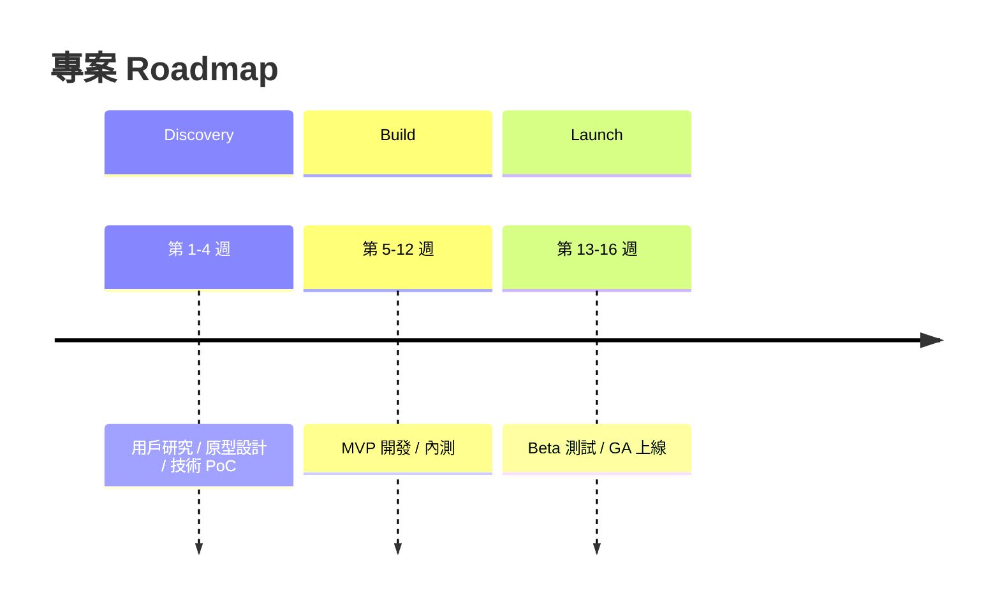

# BRD 生成規則

本檔案定義 `docs/BRD.md` 的生成邏輯（需求鏈 Layer 1）。由 `/gendoc gen-brd` 讀取並遵循。
BRD.md 的結構完全由 `templates/BRD.md` 決定，本檔案僅定義內容生成規則。

---

## Iron Rule: 累積上游讀取

每份文件生成時，必須讀取所有上游文件（累積，非僅直接父文件）。
若某上游文件不存在，靜默跳過；不得因上游缺失而降低覆蓋深度。
docs/req/* 中的所有素材（由 IDEA.md 定義）也必須全部關聯讀取。

---

## Upstream Sources（上游文件對照表）

| 上游文件 | 提供資訊 | 對應 BRD 章節 |
|---------|---------|-------------|
| `docs/IDEA.md §1` | Elevator Pitch | §1 Executive Summary（PR-FAQ 標題與定位）|
| `docs/IDEA.md §2` | Target Users | §4.1 Target Users、§4.2 Not Our Users |
| `docs/IDEA.md §4` | Problem Definition / As-Is Narrative | §2.1 As-Is Narrative |
| `docs/IDEA.md §5` | Constraints | §8.1 限制表 |
| `docs/IDEA.md §5.3` | Riskiest Assumption（Leap of Faith）| §8.2 假設驗證矩陣 |
| `docs/IDEA.md §6` | Q1-Q5 澄清訪談記錄 | §2 Problem Statement、§4 Stakeholders |
| `docs/IDEA.md §7` | Market Intelligence（競品 / 技術 / 風險）| §0 背景研究、§6 市場競品分析、§10 Risk |
| `docs/IDEA.md §8` | Initial Feature Hypotheses | §5.3 MoSCoW 功能清單 |
| `docs/IDEA.md §9` | IDEA Quality Score | 內部品質門檻確認（不直接輸出）|
| `docs/IDEA.md §10` | Kill Conditions | §10 Risk Assessment（轉化為 Risk 條目）|
| `docs/IDEA.md Appendix C` | docs/req/ 素材清單與應用章節標記 | 各章節原文引用 |
| `docs/req/*.md/txt/pdf` | 原始素材（依 Appendix C 應用欄位） | 對應章節優先採用素材原文 |

---

## Key Fields（關鍵欄位提取清單）

**必須從上游文件提取（不得留空或填 TBD）：**

| 欄位 | 上游來源 | 說明 |
|-----|---------|------|
| `DOC-ID` | 自動產生 | 格式：`BRD-{PROJECT_NAME大寫}-YYYYMMDD` |
| PR-FAQ 標題 | IDEA.md §1 Elevator Pitch | 格式：`[公司名] 推出 [產品名]，幫助 [Q1_USERS] 解決 [Q2_PAINPOINT]` |
| Target Users | IDEA.md §2 / Q1 | 使用者族群、規模、核心需求、痛點 |
| As-Is Narrative | IDEA.md §4 | 現狀描述（含 workaround）|
| 5 Whys 根因 | IDEA.md §4 + 推斷 | 系統性根因（第 5 層，非症狀）|
| TAM/SAM/SOM | IDEA.md §3 + 推斷 | 含信心水準的估算表 |
| SMART 目標 | IDEA.md §8 + 推斷 | 至少 2 個目標，有量化 KPI + 時間框架 |
| MoSCoW 功能清單 | IDEA.md §8 | Must / Should / Could / Won't 各類功能 |
| 競品對比表 | IDEA.md §7 | 至少 2 個競品，含優劣勢與差異化 |
| 風險矩陣 | IDEA.md §10 + 推斷 | 至少 5 個風險，含可能性/影響/緩解策略 |

---

## Section Rules（章節生成規則）

### Document Control
- `DOC-ID` 格式：`BRD-{PROJECT_NAME大寫}-YYYYMMDD`
- `狀態` 初始填 `DRAFT`
- `上游 IDEA.md 引用`：記錄所參考的 IDEA.md DOC-ID

### §0 背景研究
- 來自 IDEA.md §7 Market Intelligence 的研究摘要
- 包含：競品現狀、技術趨勢、市場動態、已知風險
- 必須標注研究資料來源（URL 或素材檔名）

### §1 Executive Summary（PR-FAQ）

**§1.1 假設新聞稿**（Amazon Working Backwards 格式）：
- **標題**：`[公司名] 推出 [產品名]，幫助 [Q1_USERS] 解決 [Q2_PAINPOINT]`
- **第一段（What & Who）**：清楚說明產品定位與目標使用者
- **第二段（Why Now）**：市場時機（來自 §0 研究，具體引用趨勢數據）
- **第三段（How It Works）**：三步驟使用說明（具體、可視覺化）
- **用戶引言**：模擬真實用戶語錄（引號格式，來自 Q2 痛點延伸）
- **Call to Action**：明確的下一步行動

**§1.2 FAQ**（預先回答最困難問題）：
- 至少 5 題，必須包含：
  - 「為什麼現在做？」
  - 「為什麼是我們做，而不是 [競品]？」
  - 「最大的風險是什麼？」
  - 「競品差異在哪裡？」
  - 「失敗的定義是什麼？」
- FAQ 答案必須具體，禁止「我們有更好的技術」等空洞回答

### §2 Problem Statement

**§2.1 As-Is Narrative**：
- 現狀工作流描述（含痛點行為、workaround、替代方案）
- 具體場景化描述（「一個 [用戶類型] 每天需要…」格式）

**§2.2 5 Whys**：
- 從表層症狀出發，挖掘到第 5 層系統性根因
- 禁止在第 2-3 層停止（如「因為流程不夠好」屬於症狀，非根因）
- 第 5 層根因必須是可介入的系統性問題

**§2.3 問題規模（TAM/SAM/SOM 估算表）**：

| 維度 | 估算值 | 估算依據 | 信心水準（低/中/高）|
|------|-------|---------|-------------------|
| TAM（全球可服務市場）| $ X | [依據] | 低/中/高 |
| SAM（可觸達市場）| $ X | [依據] | 低/中/高 |
| SOM（實際可獲取市場）| $ X | [依據] | 低/中/高 |

### §3 Business Objectives

**§3.1 SMART 目標表**：
- 至少 2 個目標
- 每個目標必須符合 SMART（Specific / Measurable / Achievable / Relevant / Time-bound）
- 格式：| 目標 | KPI 指標 | 基準值（Baseline）| 目標值 | 時間框架 | 負責人 |

**§3.2 與公司策略對應**：
- 說明每個目標如何支持公司整體戰略

**§3.3 三情境 ROI**：
- 悲觀 / 基準 / 樂觀三種情境
- 每種情境含：假設條件、投資額、預期收益、Payback Period

**§3.4 RTM（需求追溯矩陣）**：
- 業務目標 → 成功指標 → PRD REQ-ID（待 PRD 生成後補填）→ BDD Scenario（待 BDD 生成後補填）
- PRD 生成前，REQ-ID 欄填「待 PRD 生成」

**§3.5 Benefits Realization Plan**：
- 3 個月 / 6 個月 / 12 個月的效益測量節點
- 每個節點含：目標效益、測量方式、負責人、Baseline 值

### §4 Stakeholders & Users

**§4.1 Target Users**（來自 IDEA.md §2 / Q1）：
- 使用者族群描述（職業 / 行為 / 環境 / 核心需求 / 主要痛點）
- 規模估算

**§4.2 Not Our Users**（明確排除群體）：
- 至少 1 個明確排除的使用者群體
- 附排除原因（非商業歧視，而是產品焦點）

**§4.3 Stakeholder Map**：
- 列出所有利害關係人（內部 + 外部）
- 每人/每組：角色 / 影響力 / 關注點

**§4.4 RACI Matrix**：
- 必須涵蓋以下決策節點：需求定義 / 技術可行性評估 / 設計審查 / 預算核准 / 上線決策
- R（Responsible）/ A（Accountable）/ C（Consulted）/ I（Informed）各欄不得為空

### §5 Proposed Solution

**§5.1 解法概述**：一段式說明核心解決方案

**§5.2 核心價值主張**（Value Proposition Canvas）：
- Customer Jobs：Functional Jobs + Emotional Jobs（各至少 2 條）
- Pain Relievers：對應每個 Pain，說明如何緩解
- Gain Creators：說明創造哪些額外收益

**§5.3 MoSCoW 功能清單**：
- **Must Have（P0）**：MVP 不可缺少的功能（每項附「若缺少此功能，產品無法使用」的說明）
- **Should Have（P1）**：重要但非 MVP 必需
- **Could Have（P2）**：未來可考慮
- **Won't Have（Out of Scope）**：本版本明確不做，附原因

### §6 Market & Competitive Analysis

競品比較表（至少 2 個競品）：

| 維度 | 本產品 | 競品 A | 競品 B |
|------|-------|-------|-------|
| 核心功能 | | | |
| 定價 | | | |
| 主要優勢 | | | |
| 主要劣勢 | | | |
| 差異化 | | | |

- 必須標注競品資料來源（URL / 素材檔名）

### §7 Success Metrics

**§7.1 North Star 指標**：
- 一個最能代表產品核心價值的指標
- 說明為何選擇此指標

**§7.2 業務指標階層**（Outcome → Output → Input）：
- 至少 3 層指標，每層 2-4 個指標
- 每個指標有具體測量方式與頻率

### §8 Constraints & Assumptions

**§8.1 限制表**：

| 類型 | 限制描述 | 硬性/軟性 | 影響範圍 |
|------|---------|----------|---------|
| 預算 | | 硬性/軟性 | |
| 時間 | | 硬性/軟性 | |
| 法規 | | 硬性/軟性 | |
| 品牌 | | 軟性 | |

**§8.2 假設驗證矩陣**：
- 至少 3 條假設（來自 IDEA.md §5.3 Riskiest Assumption 擴充）
- 每條假設：假設陳述 / 驗證方式 / 若假設錯誤的影響 / 驗證截止日

**§8.3 技術約束**：

提取規則（依序讀取以下來源，後者優先）：
1. **IDEA.md §6 Q3**（技術限制或偏好）— 使用者原始輸入的語言/框架/基礎設施偏好
2. **IDEA.md §8.3**（Dependencies & External Risks）— 外部服務依賴可能暗示技術選型
3. **docs/req/**（若有技術規格文件）— 組織標準、現有授權清單

提取後填入以下表格（若無任何來源提及，填 N/A 並說明）：

| 約束項目 | 約束內容 | 類型 | 來源（IDEA §段落 / 原文摘錄） |
|---------|---------|------|--------------------------|
| 程式語言 | {{LANG_CONSTRAINT}} | 硬性/軟性 | IDEA §6 Q3：「{{原文片段}}」 |
| 框架 | {{FRAMEWORK_CONSTRAINT}} | 硬性/軟性 | |
| 基礎設施 | {{INFRA_CONSTRAINT}} | 硬性/軟性 | |
| 資料庫 | {{DB_CONSTRAINT}} | 硬性/軟性 | |
| 開源授權 | {{LICENSE_CONSTRAINT}} | 硬性 | |

> **注意：** 此表格是 EDD §3.2 ADR 技術決策的硬性/軟性邊界來源。
> 硬性約束在 EDD 中不得無故覆蓋；軟性約束在 EDD ADR 中可書面說明覆蓋理由。

### §9 Regulatory & Compliance

**§9.1 法規 / 標準表**：
- 列出所有適用法規（依產品類型與目標市場推斷）
- 每條法規：名稱 / 要求摘要 / 合規狀態 / 負責人

**§9.5 Data Governance**：

| 資料類型 | 資料擁有人 | 保留期限 | 存取政策 | 刪除程序 |
|---------|----------|---------|---------|---------|
| | | | | |

- 必須識別 PII 資料類型並說明處理方式

**§9.6 IP & Licensing**：
- 專利風景分析（是否有相關專利需注意）
- OSS License 合規（使用的開源元件授權）
- 資料授權（用戶資料使用授權）
- IP 歸屬（公司 vs. 外包合作方的 IP 歸屬）

### §10 Risk Assessment

至少 5 個風險，涵蓋市場 / 執行 / 技術 / 法規 / 競爭各面向：

| 風險 | 類型 | 可能性（1-5）| 影響度（1-5）| 緩解策略 | 負責人 |
|------|------|------------|------------|---------|--------|

- 來自 IDEA.md §10 Kill Conditions 轉化為具體風險條目

### §11 Business Model

涵蓋：
- 收入來源（Revenue Streams）：具體定價模式
- 定價策略：基礎定價邏輯與競品比較
- 主要成本結構（Cost Structure）
- 獲客管道（Customer Acquisition）：初期如何獲得第一批用戶

### §12 Roadmap

Mermaid timeline 圖，三個必要階段：

### §13 Dependencies

依賴表（技術依賴 / 外部服務 / 人員依賴）+

**§13.1 Vendor Risk Assessment**：
- Tier 1（核心依賴，無可替代）/ Tier 2（重要但有替代）/ Tier 3（非核心）
- 每個 Vendor：Tier 分級 / 替代方案 / 退出計畫 / 合約到期日

### §14 Open Questions

至少 3 個未解問題：

| # | 問題 | 影響層級（高/中/低）| 負責人 | 需在何時前解決 |
|---|------|-----------------|--------|-------------|

### §15 Decision Log

記錄 BRD 建立過程中的重要決策：

| 日期 | 決策 | 選項考量 | 最終決定 | 決策者 |
|------|------|---------|---------|--------|

### §16 Glossary

列出文件中所有領域術語定義（含縮寫）

### §17 References

- 背景研究報告：Web Research 結果連結
- 競品分析資料來源：§6 市場分析的引用來源
- 相關技術文件或標準：法規 / 技術標準的官方來源連結
- docs/req/ 素材：所有被引用的素材檔案路徑

### §18 BRD→PRD Handoff Checklist

6 項 Checklist（初始均為 🔲 待確認）：
- 🔲 所有 BRD 業務目標均有 SMART 量化指標
- 🔲 MoSCoW 功能清單已審核，P0 範圍合理
- 🔲 RTM 建立完成（業務目標 → 成功指標對應）
- 🔲 Data Governance 已評估（含 PII 資料類型）
- 🔲 Vendor Risk 已分 Tier 評估（含退出計畫）
- 🔲 OCM 變革影響評估已完成

### §19 Organizational Change Management（OCM）

**§19.1 變革影響評估**：

| 受影響部門 | 變革程度（高/中/低）| Change Champion | 主要顧慮 |
|----------|-----------------|----------------|---------|

**§19.2 訓練與溝通計畫**：
- 訓練對象 / 訓練內容 / 訓練方式 / 預計時間

**§19.3 抗拒緩解策略**：
- 預期的抗拒來源 / 緩解策略 / 成功標準

**§19.4 內部採用成功指標**：
- 3 個月 / 6 個月的內部採用率目標

### §20 Approval Sign-off

5 個角色的簽核表：

| 角色 | 姓名 | 簽核狀態 | 日期 | 備注 |
|------|------|---------|------|------|
| Executive Sponsor | | 🔲 待簽核 | | |
| Product Lead | | 🔲 待簽核 | | |
| Engineering Lead | | 🔲 待簽核 | | |
| Finance | | 🔲 待簽核 | | |
| Legal | | 🔲 待簽核 | | |

---

## Inference Rules（推斷規則）

1. **IDEA.md 不存在時**：依使用者口述或 docs/req/ 素材直接生成，各章節標注「無 IDEA.md，依直接輸入推斷」
2. **競品資料不足時**：依產品類型推斷主要競品，並標注「靜態推斷，需 PM 確認」
3. **TAM/SAM/SOM 無量化數據時**：提供定性規模描述，信心水準填「低」
4. **docs/req/ 素材存在時**：優先採用素材原文（而非 AI 推斷），並在對應章節標注引用來源
5. **合規要求不確定時**：依產品類型（金融 / 醫療 / 消費者等）推斷最可能適用的法規，並標注「需 Legal 確認」

---

## Self-Check Checklist（生成後自我審查）

生成完成後，逐項確認，有遺漏則自行補齊後再寫入檔案：

- [ ] DOC-ID 格式正確（BRD-XXX-YYYYMMDD）
- [ ] §1.1 PR-FAQ 假設新聞稿已生成（含用戶引言 + Call to Action）
- [ ] §1.2 FAQ 至少 5 題（包含最困難的問題）
- [ ] §2.2 5 Whys 已找到系統性根因（非症狀，真正到第 5 層）
- [ ] §2.3 TAM/SAM/SOM 表已填寫（含信心水準）
- [ ] §3.1 目標均為 SMART 格式（有量化 KPI + 時間框架）
- [ ] §3.3 三情境 ROI 已填寫（悲觀/基準/樂觀 + Payback Period）
- [ ] §3.4 RTM 已建立（每個業務目標有對應成功指標）
- [ ] §3.5 Benefits Realization Plan 已填寫（3M/6M/12M 節點含 Baseline）
- [ ] §4.2 Not Our Users 已明確定義（至少 1 個排除群體 + 原因）
- [ ] §4.4 RACI Matrix 已填寫（5 個決策節點均有 R/A/C/I）
- [ ] §5.2 Value Proposition Canvas 已填寫（Functional/Emotional Jobs + Pain Relievers + Gain Creators）
- [ ] §5.3 MoSCoW 已標記每個功能（Must/Should/Could/Won't）
- [ ] §6 競品比較表 ≥ 2 個競品（含資料來源）
- [ ] §9.5 Data Governance 已填寫（含 PII 資料類型與處理方式）
- [ ] §9.6 IP & Licensing 已評估（OSS License + IP 歸屬）
- [ ] §10 風險矩陣 ≥ 5 個風險（涵蓋市場/執行/技術/法規/競爭）
- [ ] §13.1 Vendor Risk 已分 Tier 評估（含退出計畫）
- [ ] §17 References：背景研究來源與競品資料來源已列出
- [ ] §18 BRD→PRD Handoff Checklist 已生成（6 項均有 🔲）
- [ ] §19 OCM 已填寫（含 Change Champion + 採用成功指標）
- [ ] §20 Approval Sign-off：5 個角色（Executive Sponsor / Product Lead / Engineering Lead / Finance / Legal）簽核表已建立
- [ ] 全文無 "TBD"、"待補"、"[待填]" 等空白佔位
