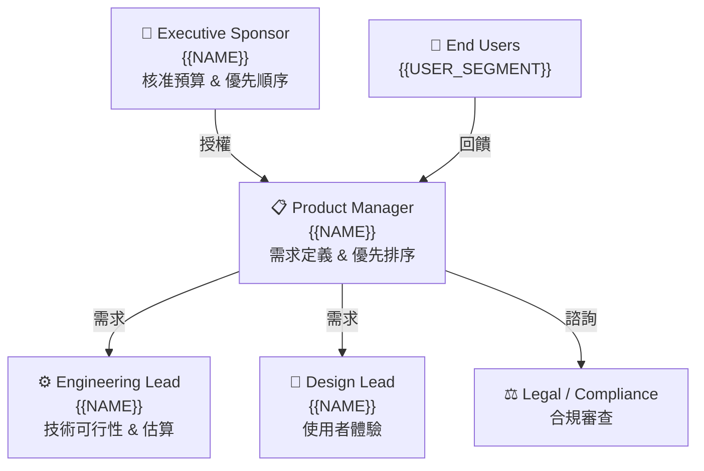
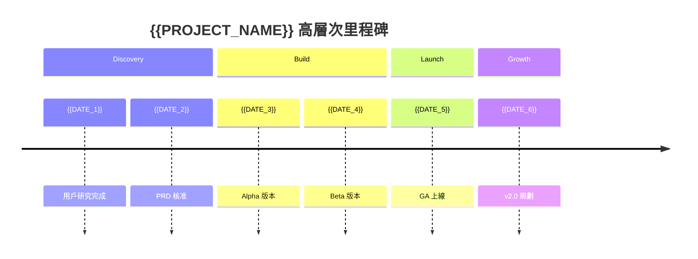

# BRD — Business Requirements Document
<!-- SDLC Requirements Engineering — Layer 1：Business Requirements -->
<!-- 對應學術標準：ISO/IEC/IEEE 29148；對應業界：Strategy Doc / Product Brief / Amazon PR-FAQ -->
<!-- 回答：為什麼做？為誰做？成功長什麼樣？值不值得投資？ -->

---

## Document Control

| 欄位 | 內容 |
|------|------|
| **DOC-ID** | BRD-{{PROJECT_CODE}}-{{YYYYMMDD}} |
| **專案名稱** | {{PROJECT_NAME}} |
| **文件版本** | v1.0 |
| **狀態** | DRAFT / IN_REVIEW / APPROVED |
| **作者** | {{AUTHOR}}（PM / Product Lead） |
| **日期** | {{DATE}} |
| **下游 PRD** | [PRD.md](PRD.md)（待建立） |
| **審閱者** | {{BUSINESS_STAKEHOLDER}}, {{ENGINEERING_LEAD}} |
| **核准者** | {{EXECUTIVE_SPONSOR}} |

---

## Change Log

| 版本 | 日期 | 作者 | 變更摘要 |
|------|------|------|---------|
| v1.0 | {{DATE}} | {{AUTHOR}} | 初稿 |

---

## 1. Executive Summary（PR-FAQ 風格）
<!-- 仿照 Amazon Working Backwards：先寫對外新聞稿，強迫釐清價值主張 -->

### 1.1 假設新聞稿（一頁備忘錄）

> **標題：** {{COMPANY_NAME}} 推出 {{PRODUCT_NAME}}，幫助 {{TARGET_USER}} 解決 {{CORE_PROBLEM}}
>
> **日期：** {{LAUNCH_DATE}}
>
> **第一段（What & Who）：**
> {{PRODUCT_NAME}} 是一款 {{PRODUCT_TYPE}}，專為 {{TARGET_USER}} 設計，
> 讓他們能夠 {{KEY_CAPABILITY}}，不再需要 {{CURRENT_WORKAROUND}}。
>
> **第二段（Why Now）：**
> {{MARKET_CONTEXT}}。根據 {{DATA_SOURCE}}，{{MARKET_SIZE_OR_TREND}}。
>
> **第三段（How It Works）：**
> 用戶只需要 {{THREE_STEP_DESCRIPTION}}。
>
> **用戶引言：**
> 「{{FAKE_CUSTOMER_QUOTE}}」— {{PERSONA_NAME}}，{{PERSONA_TITLE}}

### 1.2 FAQ（預先回答最困難的問題）

| 問題 | 回答 |
|------|------|
| 為什麼現在做這個？ | {{ANSWER}} |
| 為什麼是我們來做？ | {{ANSWER}} |
| 最大的風險是什麼？ | {{ANSWER}} |
| 如果失敗，原因最可能是？ | {{ANSWER}} |
| 競品為什麼沒做？ | {{ANSWER}} |

---

## 2. Problem Statement

### 2.1 現狀描述

> 用數據和具體故事描述現在的世界。避免假設解法，只描述現象。

{{CURRENT_STATE_DESCRIPTION}}

### 2.2 根本原因（5 Whys）

```
問題現象：{{SYMPTOM}}
  Why 1：{{CAUSE_1}}
    Why 2：{{CAUSE_2}}
      Why 3：{{CAUSE_3}}
        Why 4：{{CAUSE_4}}
          Why 5：{{ROOT_CAUSE}}  ← 這才是我們要解決的
```

### 2.3 問題規模（量化）

| 指標 | 數據 | 來源 |
|------|------|------|
| 受影響用戶數 | {{N}} | {{SOURCE}} |
| 每人每週損失時間 | {{N}} 小時 | {{SOURCE}} |
| 市場規模（TAM） | {{USD}} | {{SOURCE}} |
| 可服務市場（SAM） | {{USD}} | {{SOURCE}} |
| 可獲取市場（SOM） | {{USD}} | {{SOURCE}} |
<!-- SOM = 我們在 {{TIMEFRAME}} 內實際可爭取的市場份額，需基於：進入策略、銷售能量、競爭態勢等具體假設。建議拆解：目標地區 × 目標用戶滲透率 × ARPU -->

---

## 3. Business Objectives
<!-- SMART 原則：Specific / Measurable / Achievable / Relevant / Time-bound -->

### 3.1 商業目標

| # | 目標 | 量化指標 | 時間框架 | 優先度 |
|---|------|---------|---------|--------|
| O1 | {{OBJECTIVE_1}} | {{KPI}} 達到 {{TARGET}} | {{TIMEFRAME}} | Must |
| O2 | {{OBJECTIVE_2}} | {{KPI}} 達到 {{TARGET}} | {{TIMEFRAME}} | Should |
| O3 | {{OBJECTIVE_3}} | {{KPI}} 達到 {{TARGET}} | {{TIMEFRAME}} | Nice |

### 3.2 與公司策略的對應

| 公司策略目標 | 本專案如何貢獻 |
|------------|--------------|
| {{COMPANY_GOAL_1}} | {{CONTRIBUTION}} |
| {{COMPANY_GOAL_2}} | {{CONTRIBUTION}} |

### 3.3 投資報酬分析（ROI）— 三情境模型

> 三情境各自獨立估算，切勿僅做單一情境的比例縮放。每個情境須有明確的驅動假設。

#### 悲觀情境（Pessimistic）
<!-- 假設：市場滲透低於預期、競爭加劇、交付延誤等不利因素同時發生 -->

| 項目 | 估算 | 驅動假設 |
|------|------|---------|
| 開發成本 | {{COST_P}} | {{ASSUMPTION_P}} |
| 維護成本（年） | {{COST_P_ANNUAL}} | {{ASSUMPTION_P}} |
| 預期收益（年） | {{REVENUE_P}} | {{ASSUMPTION_P}}（e.g. 滲透率 {{N_P}}%） |
| Payback Period | {{MONTHS_P}} 個月 | |
| 3 年 NPV | {{NPV_P}} | 折現率 {{RATE}}% |

#### 基準情境（Base）
<!-- 假設：依照計畫執行，市場反應符合歷史基準 -->

| 項目 | 估算 | 驅動假設 |
|------|------|---------|
| 開發成本 | {{COST_B}} | {{ASSUMPTION_B}} |
| 維護成本（年） | {{COST_B_ANNUAL}} | {{ASSUMPTION_B}} |
| 預期收益（年） | {{REVENUE_B}} | {{ASSUMPTION_B}}（e.g. 滲透率 {{N_B}}%） |
| Payback Period | {{MONTHS_B}} 個月 | |
| 3 年 NPV | {{NPV_B}} | 折現率 {{RATE}}% |

#### 樂觀情境（Optimistic）
<!-- 假設：市場快速採納、競爭優勢顯現、交付提前等有利因素同時發生 -->

| 項目 | 估算 | 驅動假設 |
|------|------|---------|
| 開發成本 | {{COST_O}} | {{ASSUMPTION_O}} |
| 維護成本（年） | {{COST_O_ANNUAL}} | {{ASSUMPTION_O}} |
| 預期收益（年） | {{REVENUE_O}} | {{ASSUMPTION_O}}（e.g. 滲透率 {{N_O}}%） |
| Payback Period | {{MONTHS_O}} 個月 | |
| 3 年 NPV | {{NPV_O}} | 折現率 {{RATE}}% |

#### 情境摘要比較

| 情境 | 3 年 NPV | Payback Period | 關鍵驅動假設 |
|------|---------|----------------|------------|
| 悲觀 | {{NPV_P}} | {{MONTHS_P}} 個月 | {{KEY_DRIVER_P}} |
| 基準 | {{NPV_B}} | {{MONTHS_B}} 個月 | {{KEY_DRIVER_B}} |
| 樂觀 | {{NPV_O}} | {{MONTHS_O}} 個月 | {{KEY_DRIVER_O}} |

**投資決策門檻：** 即使在悲觀情境下，NPV 仍須 > 0 且 Payback Period < {{MAX_PAYBACK}} 個月，方視為值得投資。

### 3.4 Requirements Traceability Matrix（需求追溯矩陣，RTM）

> RTM 確保每一個業務目標都有對應的成功指標，每一個成功指標都有對應的功能需求。

| 業務目標 | 成功指標 | **Owning Subsystem** | 功能需求（PRD REQ-ID）| 測試覆蓋 | 狀態 |
|---------|---------|:-------------------:|---------------------|---------|------|
| O1：{{BUSINESS_GOAL_1}} | {{METRIC_1}}（§7） | `{{bc_name}}` | REQ-001, REQ-002 | BDD Scenario S-001 | 🔲 待填 |
| O2：{{BUSINESS_GOAL_2}} | {{METRIC_2}}（§7） | `{{bc_name}}` | REQ-003 | BDD Scenario S-002 | 🔲 待填 |

*RTM 在 BRD → PRD 過渡時由 PM 維護；PRD 確定後以 REQ-ID 填入並鎖定。*  
*「Owning Subsystem」欄：填入負責實現此業務目標的子系統（Bounded Context）名稱，確保業務目標可追溯到具體子系統。*

---

### 3.5 Benefits Realization Plan（效益實現計畫）

> 定義何時、如何、由誰確認業務效益已兌現。

| 效益 | 基準值（Pre-launch）| 目標值 | 測量時間點 | 測量方式 | 負責人 | 若未達標的行動 |
|------|:------------------:|:-----:|----------|---------|--------|--------------|
| {{BENEFIT_1}} | {{BASELINE}} | {{TARGET}} | Launch + 3M | Analytics Dashboard | PM | 啟動 Hotfix Sprint |
| {{BENEFIT_2}} | {{BASELINE}} | {{TARGET}} | Launch + 6M | NPS 調查 | PM | 用戶訪談 → Pivot |
| {{BENEFIT_3}} | {{BASELINE}} | {{TARGET}} | Launch + 12M | Finance Report | CFO | 商業模式評審 |

*效益評審節點：Launch + 3M / 6M / 12M，每次由 Executive Sponsor 主持。*

---

## 4. Stakeholders & Users

### 4.1 Stakeholder Map



### 4.2 Target Users（業務層級描述）
<!-- 此層不做詳細 Persona，Persona 在 PRD 展開 -->

| 用戶群 | 規模估算 | 核心需求 | 目前解法 | 痛點 |
|--------|---------|---------|---------|------|
| {{USER_SEGMENT_1}} | {{N}} 人 | {{NEED}} | {{WORKAROUND}} | {{PAIN}} |
| {{USER_SEGMENT_2}} | {{N}} 人 | {{NEED}} | {{WORKAROUND}} | {{PAIN}} |

### 4.3 Not Our Users（明確排除）

- ❌ {{EXCLUDED_USER_GROUP}}（原因：{{REASON}}）

### 4.4 RACI Matrix
<!-- R = Responsible（執行者）、A = Accountable（最終負責）、C = Consulted（被諮詢）、I = Informed（被通知）
     每列活動只能有一個 A；R 可以多人；C/I 依實際需求填寫 -->

| 主要活動 | Executive Sponsor | Product Manager | Engineering Lead | Design Lead | Legal / Compliance | Finance |
|---------|:-----------------:|:---------------:|:----------------:|:-----------:|:------------------:|:-------:|
| 需求定義與範圍確認 | A | R | C | C | C | I |
| 技術可行性評估 | I | C | R/A | C | I | I |
| 設計審查與 UX 驗收 | I | A | C | R | I | I |
| 預算核准 | A | C | C | I | I | C |
| 合規與法務初審 | I | C | I | I | R/A | I |
| 上線決策（Go/No-Go） | A | R | C | C | C | C |
| BRD→PRD Handoff | I | R/A | C | C | I | I |

> 以上為通用範本，請依實際組織架構調整角色欄位。若某角色在貴組織不存在，合併至最接近的職能。

---

## 5. Proposed Solution

### 5.1 解法概述

> 高層次描述方向，**不涉及 UI 設計和技術細節**（那是 PDD 和 EDD 的責任）。

{{HIGH_LEVEL_SOLUTION_DESCRIPTION}}

### 5.2 核心價值主張（Value Proposition Canvas）

**Customer Jobs（用戶要完成的任務）：**
- Functional：{{JOB_1}}
- Emotional：{{JOB_2}}
- Social：{{JOB_3}}

**Pain Relievers（我們如何減輕痛點）：**
- {{PAIN_RELIEVER_1}}
- {{PAIN_RELIEVER_2}}

**Gain Creators（我們如何創造收益）：**
- {{GAIN_CREATOR_1}}
- {{GAIN_CREATOR_2}}

### 5.3 解法邊界

**In Scope（本版本）：**
- ✅ {{CAPABILITY_1}}
- ✅ {{CAPABILITY_2}}

**Out of Scope（明確排除，需有理由）：**
- ❌ {{EXCLUDED_1}}（原因：{{REASON}}）
- ❌ {{EXCLUDED_2}}（原因：{{REASON}}）

**Future Scope（下個版本候選）：**
- 🔮 {{FUTURE_1}}

### 5.4 MoSCoW 優先度對應表
<!-- 將 §5.3 In-Scope 功能明確標記優先度，並對應到 §3.1 商業目標，確保開發優先序與業務價值對齊 -->
<!-- Must Have：缺少則產品無法上線 | Should Have：高價值但不阻擋上線 | Could Have：有餘力才做 | Won't Have（本版）：明確排除 -->

| 功能 / 能力 | MoSCoW 分類 | 對應 BRD 目標 | 業務理由 |
|------------|:----------:|-------------|---------|
| {{CAPABILITY_1}} | Must Have | O{{N}} | {{BUSINESS_RATIONALE}} |
| {{CAPABILITY_2}} | Must Have | O{{N}} | {{BUSINESS_RATIONALE}} |
| {{CAPABILITY_3}} | Should Have | O{{N}} | {{BUSINESS_RATIONALE}} |
| {{CAPABILITY_4}} | Could Have | O{{N}} | {{BUSINESS_RATIONALE}} |
| {{EXCLUDED_1}} | Won't Have（本版） | — | {{REASON}} |
| {{EXCLUDED_2}} | Won't Have（本版） | — | {{REASON}} |

> Must Have 功能加總不得超過估算開發容量的 60%，保留緩衝應對不確定性。

---

### 5.5 子系統分解（Bounded Context）

> 依 Spring Modulith 架構原則，從 Day 1 以 Bounded Context 為邊界設計業務邊界。  
> 此表是 EDD §3.4 Schema Ownership 和 ARCH §4 服務邊界的**業務層輸入**。

| 子系統名 | 業務領域（Domain） | 擁有的業務規則 | 不擁有的業務規則 | 業務不變量（Invariant） |
|---------|------------------|--------------|----------------|----------------------|
| `member` | 會員管理 | 帳號創建/驗證/停用、KYC、個人資料 | 餘額計算、遊戲入局 | 每個 member_id 對應唯一的認證身份 |
| `wallet` | 電子錢包 | 餘額、交易紀錄、凍結/解凍 | 儲值發起、遊戲扣款業務規則 | wallet.balance 永遠 ≥ 0 |
| `deposit` | 儲值 / 充值 | 儲值請求、支付確認、退款 | 餘額實際變更（呼叫 wallet BC）| 儲值確認後 wallet 必須變更餘額（最終一致） |
| `lobby` | 遊戲大廳 | 遊戲清單、上下架、分類、限額 | 遊戲實際邏輯、帳號狀態 | 大廳顯示的遊戲狀態與 game BC 一致（最終一致） |
| `game` | 遊戲系統 | 下注、開獎、RNG、遊戲紀錄 | 玩家餘額儲存（呼叫 wallet BC）| 每局遊戲結果不可修改；RNG 公平性可驗證 |
| `{{bc_name}}` | {{domain}} | {{owned_rules}} | {{not_owned}} | {{invariant}} |

> **填寫指引：**  
> - 「擁有的業務規則」= 此子系統是決策者和資料擁有者  
> - 「不擁有的業務規則」= 此子系統需要透過 API 或 Event 請求其他 BC 執行  
> - 「業務不變量」= 任何時刻都必須成立的業務條件（用於 EDD Domain Invariant 設計）

---

## 6. Market & Competitive Analysis

### 6.1 競品分析

| 競品 | 優勢 | 劣勢 | 我們的差異化 |
|------|------|------|------------|
| {{COMPETITOR_1}} | {{STRENGTH}} | {{WEAKNESS}} | {{DIFFERENTIATOR}} |
| {{COMPETITOR_2}} | {{STRENGTH}} | {{WEAKNESS}} | {{DIFFERENTIATOR}} |

### 6.2 市場定位

```
          高價值
            ↑
            │      ● 我們
            │
低功能 ─────┼───────────── 高功能
            │         ● 競品 A
            │    ● 競品 B
            ↓
          低價值
```

---

## 7. Success Metrics

### 7.1 北極星指標（North Star Metric）

> 一個最能代表我們為用戶創造核心價值的指標。

**North Star：** {{NORTH_STAR_METRIC}}

**定義：** {{HOW_TO_MEASURE}}

### 7.2 業務指標階層（Input → Output → Outcome）

```
Outcome（最終業務成果）
  └── {{OUTCOME_METRIC}}（e.g. 營收增長 20%）

Output（可交付成果）
  ├── {{OUTPUT_METRIC_1}}（e.g. 月活用戶 10 萬）
  └── {{OUTPUT_METRIC_2}}（e.g. 轉換率 5%）

Input（我們可控的行動）
  ├── {{INPUT_METRIC_1}}（e.g. 功能上線數）
  └── {{INPUT_METRIC_2}}（e.g. 用戶研究次數）
```

### 7.3 投資門檻（何時算值得繼續投資）

| 條件 | 量化目標 | 評估時間點 |
|------|---------|-----------|
| {{CONDITION_1}} | {{TARGET}} | Alpha 結束後 {{N}} 週 |
| {{CONDITION_2}} | {{TARGET}} | Beta 結束後 {{N}} 週 |

---

## 8. Constraints & Assumptions

### 8.1 業務限制

| 限制 | 類型 | 影響 |
|------|------|------|
| 預算上限：{{BUDGET}} | 硬性 | 影響功能範圍 |
| 上線期限：{{DEADLINE}} | 硬性 | 影響實作策略 |
| 合規要求：{{REGULATION}} | 硬性 | 影響資料處理方式 |
| 品牌規範：{{GUIDELINE}} | 軟性 | 影響 UI 設計 |

### 8.2 關鍵假設（需驗證）

| # | 假設 | 驗證方式 | 驗證時間點 | 若假設錯誤的影響 |
|---|------|---------|-----------|----------------|
| A1 | {{ASSUMPTION_1}} | 用戶訪談 / A-B Test | {{DATE}} | {{IMPACT}} |
| A2 | {{ASSUMPTION_2}} | 數據分析 | {{DATE}} | {{IMPACT}} |

### 8.3 技術約束（Technology Constraints）

<!-- 來源：IDEA.md §6 Q3 技術限制或偏好（使用者原始輸入）→ 此處正式化為 BRD 約束。
     EDD §3.2 ADR 決策時必須以本節為硬性/軟性邊界輸入；不得在 EDD 直接推翻硬性約束。 -->

| 約束 | 類型 | 來源 | 影響 |
|------|------|------|------|
| 程式語言：{{LANG_CONSTRAINT}}（e.g. Python / TypeScript / Go） | 硬性/軟性 | 團隊現有技能 / 組織規定 / 使用者偏好 | EDD lang_stack 決策上界 |
| 框架：{{FRAMEWORK_CONSTRAINT}}（e.g. FastAPI / Next.js / 無限制） | 硬性/軟性 | 團隊經驗 / 生態相容性 | EDD 架構選型 |
| 基礎設施：{{INFRA_CONSTRAINT}}（e.g. 必須用 AWS / 自建機房 / 無限制） | 硬性/軟性 | 採購合約 / 現有環境 | ARCH 雲端平台選型 |
| 資料庫：{{DB_CONSTRAINT}}（e.g. 必須用 PostgreSQL / 無限制） | 硬性/軟性 | 現有授權 / DBA 規定 | EDD DB 選型 |
| 開源授權：{{LICENSE_CONSTRAINT}}（e.g. 禁用 GPL / 僅允許 MIT+Apache） | 硬性 | 法務規定 | 所有第三方套件選型 |
| **子系統可拆解性（Spring Modulith HC-1～HC-5）**：各子系統（§5.5）從 Day 1 以 BC 邊界設計；HC-1 禁止跨 BC DB-level FK；HC-2 跨 BC 只透過 Public API 或 Domain Event；HC-3 跨 BC 通訊優先 Async Event；HC-4 無跨 BC Shared Mutable State；HC-5 BC 間依賴為 DAG | **硬性** | 架構可拆解性設計需求（Spring Modulith 2022+） | EDD §3.4、ARCH §4、SCHEMA §9.5、API §1.1 所有設計約束 |

> **填寫指引：**
> - 硬性（Hard）= EDD 不得違反，需書面豁免才能排除
> - 軟性（Soft）= 有充分理由可在 EDD ADR 中說明並覆蓋
> - 若無任何技術約束，明確填寫「N/A — 技術選型完全由 EDD 工程判斷決定」

---

## 9. Regulatory & Compliance Requirements
<!-- 合規要求獨立成章，避免埋在 §8 Constraints 中被低估重要性。此章節應由 Legal / Compliance 共同撰寫並簽核。 -->

### 9.1 適用法規清單

| 法規 / 標準名稱 | 適用範圍 | 關鍵義務摘要 | 合規截止日 | 負責人 |
|--------------|---------|------------|-----------|--------|
| {{REGULATION_1}}（e.g. GDPR） | {{SCOPE}}（e.g. 歐盟用戶資料處理） | {{KEY_OBLIGATION}}（e.g. 取得明示同意、資料最小化、72 小時洩漏通報） | {{DATE}} | {{OWNER}} |
| {{REGULATION_2}}（e.g. CCPA） | {{SCOPE}} | {{KEY_OBLIGATION}} | {{DATE}} | {{OWNER}} |
| {{REGULATION_3}}（e.g. SOC 2 Type II） | {{SCOPE}} | {{KEY_OBLIGATION}} | {{DATE}} | {{OWNER}} |
| {{REGULATION_4}}（e.g. 台灣個資法） | {{SCOPE}} | {{KEY_OBLIGATION}} | {{DATE}} | {{OWNER}} |

> 若無適用法規，請明確填寫「N/A — 依據：{{LEGAL_BASIS}}」，不得留白。

### 9.2 合規影響評估

| 合規要求 | 對產品設計的影響 | 對工程架構的影響 | 額外成本估算 |
|---------|--------------|--------------|------------|
| {{COMPLIANCE_REQ_1}} | {{DESIGN_IMPACT}} | {{ARCH_IMPACT}} | {{COST_EST}} |
| {{COMPLIANCE_REQ_2}} | {{DESIGN_IMPACT}} | {{ARCH_IMPACT}} | {{COST_EST}} |

### 9.3 合規時程里程碑

| 里程碑 | 預計完成日 | 負責人 | 狀態 |
|--------|-----------|--------|------|
| 法務初審完成 | {{DATE}} | Legal | PENDING |
| 隱私衝擊評估（DPIA）完成 | {{DATE}} | {{OWNER}} | PENDING |
| 合規架構設計審查 | {{DATE}} | Engineering + Legal | PENDING |
| 外部合規稽核（如需） | {{DATE}} | {{OWNER}} | PENDING |

### 9.5 Data Governance & Lifecycle Management（資料治理與生命週期管理）

| 資料類型 | 資料擁有人 | 保留期限 | 存取控制政策 | 刪除程序 | 稽核需求 |
|---------|----------|---------|------------|---------|---------|
| 用戶個人資料（PII）| Data Privacy Officer | {{RETENTION_PERIOD}} | 最小權限原則（僅業務必需角色）| 用戶請求 7 日內完成 | GDPR Article 30 |
| 系統日誌 | SRE Lead | 90 日（熱）/ 1 年（冷）| Engineering Lead 核准才可存取 | 自動歸檔後刪除 | SOX / ISO27001 |
| 業務交易紀錄 | Finance | 7 年（法規） | Finance + 稽核師 | 法定期限後銷毀 | 財政部規範 |
| {{CUSTOM_DATA_TYPE}} | {{OWNER}} | {{PERIOD}} | {{POLICY}} | {{PROCEDURE}} | {{AUDIT_REQ}} |

**資料主權聲明：**
- 用戶數據所有權：{{DATA_OWNERSHIP_STATEMENT}}
- 跨境傳輸適規聲明：{{CROSS_BORDER_COMPLIANCE}}（如 GDPR SCCs / APEC CBPR）

---

### 9.6 Intellectual Property & Licensing（智慧財產權與授權）

| 項目 | 內容 |
|------|------|
| **專利風景分析** | {{PATENT_LANDSCAPE}}（是否有競品專利需迴避？） |
| **OSS License 合規** | {{OSS_LICENSES_IN_USE}}（GPL / MIT / Apache — 商業使用限制？）|
| **第三方資料授權** | {{THIRD_PARTY_DATA_LICENSES}}（API 使用條款、資料再授權限制）|
| **客戶資料所有權** | 明確宣告：客戶資料屬客戶所有，本產品僅處理不持有 |
| **IP 歸屬** | 產品 IP 歸屬 {{IP_OWNER}}，貢獻者 CLA 需求：{{CLA_REQUIRED}} |

---

## 10. Risk Assessment

### 10.1 業務風險

| 風險 | 類型 | 可能性 | 影響 | 緩解策略 | 負責人 |
|------|------|--------|------|---------|--------|
| {{RISK_1}} | 市場 | HIGH | HIGH | {{MITIGATION}} | {{OWNER}} |
| {{RISK_2}} | 執行 | MEDIUM | HIGH | {{MITIGATION}} | {{OWNER}} |
| {{RISK_3}} | 技術 | LOW | MEDIUM | {{MITIGATION}} | {{OWNER}} |

### 10.2 Kill Criteria（何時應該停止）

> 如果以下任一條件發生，重新評估是否繼續：

- {{KILL_CONDITION_1}}（e.g. Beta 期間 DAU < 1000 持續 4 週）
- {{KILL_CONDITION_2}}（e.g. 技術可行性評估顯示成本超出預算 50%）

---

## 11. Business Model
<!-- 商業模式畫布精簡版（Lean Canvas 核心要素）。此章節回答「如何從這個解法中創造可持續的商業價值」。 -->
<!-- 若為內部工具或成本中心專案，請說明「價值量化方式」取代「收入來源」 -->

### 11.1 商業模式畫布

| 要素 | 內容 |
|------|------|
| **收入來源（Revenue Streams）** | {{REVENUE_STREAM_1}}（e.g. SaaS 訂閱月費 \${{PRICE}}/月）<br>{{REVENUE_STREAM_2}}（e.g. 交易手續費 {{N}}%） |
| **定價策略** | {{PRICING_MODEL}}（e.g. Freemium / 按用量 / 固定授權） |
| **成本結構（Cost Structure）** | 主要成本項：{{COST_ITEM_1}}（{{PCT}}%）、{{COST_ITEM_2}}（{{PCT}}%）<br>固定成本 vs 變動成本比：{{FIXED_PCT}}% vs {{VARIABLE_PCT}}% |
| **核心資源（Key Resources）** | {{RESOURCE_1}}（e.g. 技術平台 / 用戶數據 / 品牌）<br>{{RESOURCE_2}} |
| **關鍵活動（Key Activities）** | {{ACTIVITY_1}}（e.g. 產品研發 / 用戶獲取 / 合規維護）<br>{{ACTIVITY_2}} |
| **關鍵合作夥伴（Key Partners）** | {{PARTNER_1}}（角色：{{ROLE}}）<br>{{PARTNER_2}}（角色：{{ROLE}}） |
| **獲客管道（Channels）** | {{CHANNEL_1}}（e.g. 自然搜尋 / 企業銷售 / API 合作夥伴） |
| **單位經濟（Unit Economics）** | CAC：{{CAC}} \| LTV：{{LTV}} \| LTV/CAC：{{RATIO}}（健康值 > 3） |

### 11.2 商業模式假設與驗證計畫

| 假設 | 重要性 | 驗證方式 | 驗證時間點 |
|------|--------|---------|-----------|
| {{BIZ_ASSUMPTION_1}}（e.g. 用戶願意為此功能付費） | 關鍵 | {{METHOD}}（e.g. 收費 Pilot 測試） | {{DATE}} |
| {{BIZ_ASSUMPTION_2}}（e.g. 企業採購週期 < 3 個月） | 重要 | {{METHOD}} | {{DATE}} |

---

## 12. High-Level Roadmap



---

## 13. Dependencies

| 依賴項 | 類型 | 負責方 | 預計就緒日 | 若延誤的影響 |
|--------|------|--------|-----------|------------|
| {{DEPENDENCY_1}} | 內部團隊 | {{TEAM}} | {{DATE}} | {{IMPACT}} |
| {{DEPENDENCY_2}} | 外部服務 | {{VENDOR}} | {{DATE}} | {{IMPACT}} |
| {{DEPENDENCY_3}} | 合規審查 | Legal | {{DATE}} | {{IMPACT}} |

### 13.1 Vendor & Third-Party Dependency Risk Assessment

| 供應商 / 服務 | 關鍵性（Tier 1/2/3）| 替代方案 | SLA 假設 | 若失敗的影響 | 退出計畫 |
|-------------|:-----------------:|---------|---------|------------|---------|
| {{VENDOR_1}} | Tier 1（核心，無法替代）| {{ALTERNATIVE}} | 99.9% | 核心功能停擺 | {{EXIT_PLAN}} |
| {{VENDOR_2}} | Tier 2（重要但可替代）| {{ALTERNATIVE}} | 99.5% | 降級服務 | 30 天遷移 |
| {{VENDOR_3}} | Tier 3（非核心）| {{ALTERNATIVE}} | N/A | 功能缺失 | 立即切換 |

*Tier 定義：Tier 1 = 無此服務即無法運營；Tier 2 = 影響品質但可降級；Tier 3 = 僅影響次要功能。*

---

## 14. Open Questions

| # | 問題 | 影響層級 | 負責人 | 截止日 | 狀態 |
|---|------|---------|--------|--------|------|
| Q1 | {{BUSINESS_QUESTION_1}} | 策略 | {{OWNER}} | {{DATE}} | OPEN |
| Q2 | {{BUSINESS_QUESTION_2}} | 範圍 | {{OWNER}} | {{DATE}} | RESOLVED：{{ANSWER}} |

---

## 15. Decision Log
<!-- 記錄所有重要決策，確保決策脈絡可追溯。每次在 BRD 審查或重大討論後更新。 -->
<!-- 決策應在做出時即時記錄，而非事後補寫 -->

| # | 決策日期 | 議題 | 決策內容 | 決策依據 | 決策者 | 影響範圍 |
|---|---------|------|---------|---------|--------|---------|
| D1 | {{DATE}} | {{ISSUE_1}}（e.g. 是否支援行動端） | {{DECISION_1}}（e.g. MVP 僅做 Web，行動端列 Future Scope） | {{RATIONALE_1}}（e.g. 行動用戶占比 < 15%，資源有限，先驗證核心價值） | {{DECISION_MAKER_1}} | {{IMPACT_SCOPE_1}}（e.g. §5.3 範圍、§3.1 O2 目標） |
| D2 | {{DATE}} | {{ISSUE_2}} | {{DECISION_2}} | {{RATIONALE_2}} | {{DECISION_MAKER_2}} | {{IMPACT_SCOPE_2}} |
| D3 | {{DATE}} | {{ISSUE_3}} | {{DECISION_3}} | {{RATIONALE_3}} | {{DECISION_MAKER_3}} | {{IMPACT_SCOPE_3}} |

> 任何影響範圍、預算、時程或策略方向的決策均須記錄於此。口頭決策請在 24 小時內補錄。

---

## 16. Glossary

| 術語 | 業務定義 |
|------|---------|
| {{TERM_1}} | {{DEFINITION}} |
| {{TERM_2}} | {{DEFINITION}} |

---

## 17. References

- 市場研究報告：{{LINK}}
- 用戶訪談摘要：{{LINK}}
- 競品分析詳細版：{{LINK}}
- 財務模型試算表：{{LINK}}
- 公司 OKR：{{LINK}}

---

## 18. BRD→PRD Handoff Checklist
<!-- 此 Checklist 為 BRD 進入 PRD 階段的正式交接門檻。所有項目必須完成方可啟動 PRD 撰寫。
     由 PM 主導確認，並在 §19 Approval Sign-off 取得核准後執行。 -->

### 18.1 Handoff 前置條件確認

| # | 檢查項目 | 負責確認人 | 完成日期 | 狀態 |
|---|---------|----------|---------|------|
| H1 | BRD 已取得所有利害關係人核准（§20 Approval Sign-off 完整簽核） | PM | {{DATE}} | ☐ PENDING |
| H2 | 北極星指標（North Star Metric）已明確定義且量化（§7.1） | PM + Data | {{DATE}} | ☐ PENDING |
| H3 | 用戶研究已完成，核心 Persona 及痛點有一手數據支撐 | UX Research | {{DATE}} | ☐ PENDING |
| H4 | 技術可行性評估已完成，Engineering Lead 已確認無重大技術障礙 | Eng Lead | {{DATE}} | ☐ PENDING |
| H5 | 成功指標（§7.2）已完整量化，含基準值（Baseline）與目標值（Target） | PM + Data | {{DATE}} | ☐ PENDING |
| H6 | 法務 / 合規初審已完成，無阻擋性合規問題（§9） | Legal | {{DATE}} | ☐ PENDING |
| H7 | PRD Owner 已指定且確認接手（通常為 PM 本人或委任的 Product Lead） | PM | {{DATE}} | ☐ PENDING |
| H8 | PRD Kick-off 會議已排程，相關參與者已確認出席 | PM | {{DATE}} | ☐ PENDING |

### 18.2 Handoff 時移交的文件與產出

| 文件 / 產出 | 說明 | 存放位置 |
|-----------|------|---------|
| 本 BRD（已核准版） | 含所有章節、RACI、Decision Log | {{LINK}} |
| 用戶研究摘要報告 | 訪談 / 問卷 / 可用性測試結果 | {{LINK}} |
| 技術可行性評估備忘錄 | Engineering Lead 簽核的技術評估 | {{LINK}} |
| 市場與競品分析詳細版 | §6 的完整支撐資料 | {{LINK}} |
| 財務模型試算表 | §3.3 三情境 ROI 的底層試算 | {{LINK}} |
| 合規初審意見書 | Legal 出具的書面意見 | {{LINK}} |
| Stakeholder 訪談紀錄 | 所有重要利害關係人的需求與關切 | {{LINK}} |

### 18.3 PRD Owner 接受確認

| 欄位 | 內容 |
|------|------|
| **PRD Owner** | {{PRD_OWNER_NAME}}（{{TITLE}}） |
| **接受日期** | {{DATE}} |
| **確認聲明** | 本人已審閱上述 BRD 及所有移交文件，確認 PRD 撰寫所需資訊完整，同意正式啟動 PRD 撰寫工作。 |
| **預計 PRD 初稿完成日** | {{PRD_DRAFT_DATE}} |

---

## 19. Organizational Change Management（組織變革管理）

### 19.1 變革影響評估

| 受影響部門 / 團隊 | 變革程度 | 主要影響 | 變革冠軍（Change Champion）|
|----------------|:-------:|---------|--------------------------|
| {{TEAM_1}} | 高 / 中 / 低 | {{IMPACT_DESCRIPTION}} | {{CHAMPION_NAME}} |
| {{TEAM_2}} | 高 / 中 / 低 | {{IMPACT_DESCRIPTION}} | {{CHAMPION_NAME}} |

---

### 19.2 訓練與溝通計畫

| 目標群體 | 訓練內容 | 溝通形式 | 時程 | 負責人 |
|---------|---------|---------|------|--------|
| End Users | 新功能操作訓練 | Workshop + 操作手冊 | Launch - 2 週 | Product |
| Support Team | 常見問題 + 升級路徑 | FAQ + 影片教學 | Launch - 1 週 | CS Lead |
| 內部利害關係人 | 成果回顧 | 月報 + QBR | Launch + 每月 | PM |

---

### 19.3 抗拒緩解策略

| 可能的抗拒 | 原因 | 緩解策略 | 早期偵測訊號 |
|-----------|------|---------|------------|
| 用戶不願改變習慣 | Switching Cost 過高 | 提供遷移工具 + 並行期 | 訓練出席率 < 60% |
| 內部團隊優先級衝突 | 資源競爭 | Executive Sponsor 保護 Resources | 里程碑連續 delay > 2 週 |
| {{CUSTOM_RESISTANCE}} | {{REASON}} | {{MITIGATION}} | {{SIGNAL}} |

---

### 19.4 成功衡量（Internal Adoption）

| 指標 | 基準 | 目標（Launch + 3M）|
|------|------|:------------------:|
| 新系統採用率 | 0% | ≥ 80% 目標用戶 |
| 舊流程廢棄率 | 100% 使用舊流程 | ≤ 20% 仍使用舊流程 |
| 內部 NPS | N/A | ≥ 40 |

---

## 20. Approval Sign-off

| 角色 | 姓名 | 簽核日期 | 意見 |
|------|------|---------|------|
| Executive Sponsor | {{NAME}} | {{DATE}} | |
| Product Lead / PM | {{NAME}} | {{DATE}} | |
| Engineering Lead | {{NAME}} | {{DATE}} | |
| Finance | {{NAME}} | {{DATE}} | |
| Legal / Compliance | {{NAME}} | {{DATE}} | |
