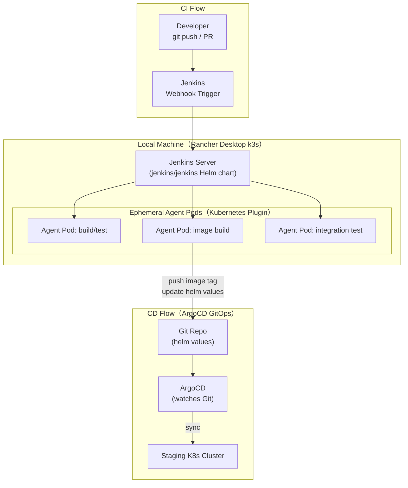
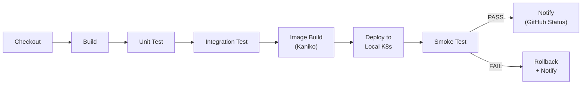
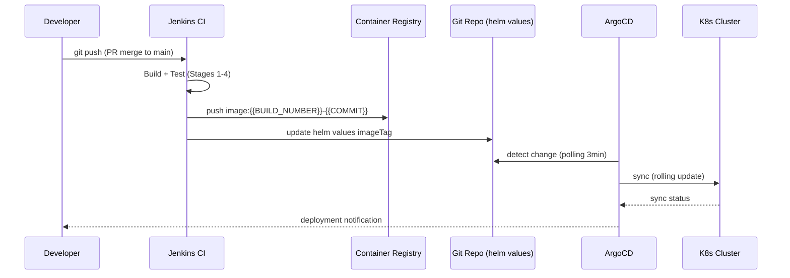
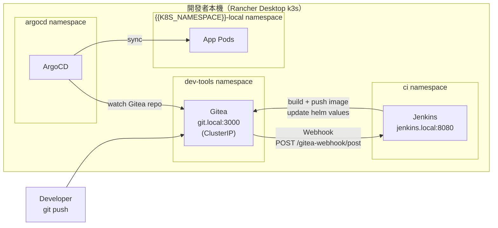

# CI/CD Pipeline Design Document — {{PROJECT_NAME}}

> **本文件描述** {{PROJECT_NAME}} 的持續整合（CI）與持續交付（CD）設計，包含工具選型、Pipeline 架構、Jenkinsfile 骨架、本地 Dry-Run 能力、以及 Shared Make Targets 模式。
>
> **CI Tool**: {{CI_TOOL}}（預設：Jenkins）  
> **CD Tool**: {{CD_TOOL}}（預設：ArgoCD）  
> **Design Principle**: CI 和 Local 使用相同 Make targets，消除「本地 OK、CI 炸掉」問題。

---

## Document Control

| 欄位 | 值 |
|------|---|
| **CI 工具** | {{CI_TOOL}} |
| **CD 工具** | {{CD_TOOL}} |
| **K8s Cluster（CI Agent）** | k3s（Rancher Desktop local） / {{PROD_K8S_CLUSTER}}（production） |
| **Container Registry** | {{CONTAINER_REGISTRY}} |
| **Source Repository** | {{GITHUB_ORG}}/{{REPO_NAME}} |
| **Branch Strategy** | {{BRANCH_STRATEGY}}（e.g. GitHub Flow / GitFlow） |
| **PR Gate Policy** | 所有 §5 PR Gate stage 通過後方可合併 |
| **Author** | {{AUTHOR}} |
| **Last Updated** | {{DATE}} |

---

## §1 Pipeline Architecture

### 1.1 Jenkins-on-k3s 架構圖



### 1.2 Agent Pod 設計

每次 Pipeline 執行時，Kubernetes Plugin 動態建立一個 **ephemeral agent pod**，任務完成後自動銷毀：

| 屬性 | 設定 |
|------|------|
| **Namespace** | `{{K8S_NAMESPACE}}-jenkins` |
| **Service Account** | `jenkins-agent` |
| **Image（build/test）** | `{{AGENT_BUILD_IMAGE}}`（e.g. `eclipse-temurin:21-jdk-jammy`） |
| **Image（image build）** | `{{AGENT_KANIKO_IMAGE}}`（e.g. `gcr.io/kaniko-project/executor:latest`） |
| **CPU Request / Limit** | `{{AGENT_CPU_REQUEST}}` / `{{AGENT_CPU_LIMIT}}` |
| **Memory Request / Limit** | `{{AGENT_MEM_REQUEST}}` / `{{AGENT_MEM_LIMIT}}` |
| **Image Pull Policy** | Always（CI 環境）/ Never（Local k3s） |

### 1.3 Pipeline Stage 總覽



---

## §2 Jenkinsfile 骨架

```groovy
// Jenkinsfile — {{PROJECT_NAME}}
// 生成時請填入所有 {{PLACEHOLDER}} 為具體值

pipeline {
    agent {
        kubernetes {
            cloud 'rancher-desktop'
            namespace '{{K8S_NAMESPACE}}-jenkins'
            yaml """
apiVersion: v1
kind: Pod
spec:
  serviceAccountName: jenkins-agent
  containers:
  - name: build
    image: {{AGENT_BUILD_IMAGE}}
    command: ['cat']
    tty: true
    resources:
      requests:
        cpu: "{{AGENT_CPU_REQUEST}}"
        memory: "{{AGENT_MEM_REQUEST}}"
      limits:
        cpu: "{{AGENT_CPU_LIMIT}}"
        memory: "{{AGENT_MEM_LIMIT}}"
  - name: kaniko
    image: gcr.io/kaniko-project/executor:debug
    command: ['cat']
    tty: true
    volumeMounts:
    - name: registry-secret
      mountPath: /kaniko/.docker
  volumes:
  - name: registry-secret
    secret:
      secretName: registry-credentials
"""
        }
    }

    environment {
        PROJECT_SLUG    = '{{PROJECT_SLUG}}'
        REGISTRY        = '{{CONTAINER_REGISTRY}}'
        IMAGE_TAG       = "${env.BUILD_NUMBER}-${env.GIT_COMMIT[0..6]}"
        K8S_NAMESPACE   = '{{K8S_NAMESPACE}}'
    }

    options {
        timeout(time: 30, unit: 'MINUTES')
        buildDiscarder(logRotator(numToKeepStr: '20'))
        skipDefaultCheckout()
    }

    stages {
        stage('Checkout') {
            steps {
                checkout scm
                script {
                    env.GIT_COMMIT = sh(script: 'git rev-parse HEAD', returnStdout: true).trim()
                    env.GIT_BRANCH = env.BRANCH_NAME ?: sh(script: 'git rev-parse --abbrev-ref HEAD', returnStdout: true).trim()
                }
            }
        }

        stage('Build') {
            steps {
                container('build') {
                    sh 'make ci-build'
                }
            }
        }

        stage('Unit Test') {
            steps {
                container('build') {
                    sh 'make ci-test-unit'
                }
            }
            post {
                always {
                    junit '**/test-results/**/*.xml'
                }
            }
        }

        stage('Integration Test') {
            steps {
                container('build') {
                    sh 'make ci-test-integration'
                }
            }
        }

        stage('Image Build') {
            when {
                anyOf {
                    branch 'main'
                    branch 'release/*'
                    changeRequest()
                }
            }
            steps {
                container('kaniko') {
                    sh """
                        /kaniko/executor \
                          --context=dir://\${WORKSPACE} \
                          --dockerfile=docker/api/Dockerfile \
                          --destination=\${REGISTRY}/\${PROJECT_SLUG}/api:\${IMAGE_TAG} \
                          --destination=\${REGISTRY}/\${PROJECT_SLUG}/api:latest \
                          --cache=true \
                          --cache-repo=\${REGISTRY}/\${PROJECT_SLUG}/cache
                    """
                }
            }
        }

        stage('Deploy to Local K8s') {
            when {
                branch 'main'
            }
            steps {
                container('build') {
                    sh "make ci-deploy IMAGE_TAG=\${IMAGE_TAG}"
                }
            }
        }

        stage('Smoke Test') {
            when {
                branch 'main'
            }
            steps {
                container('build') {
                    sh 'make ci-smoke'
                }
            }
        }
    }

    post {
        success {
            script {
                currentBuild.description = "✅ ${env.IMAGE_TAG}"
            }
        }
        failure {
            script {
                sh 'make ci-rollback || true'
            }
        }
        always {
            cleanWs()
        }
    }
}
```

---

## §3 Local Pipeline Dry-Run（jenkinsfile-runner）

### 3.1 為何需要 Local Dry-Run

開發者在提交 PR 前應能在本地模擬完整 Pipeline 執行，避免「本地 OK、CI 炸掉」的問題：

| 問題類型 | 發生率 | Local Dry-Run 可提前發現？ |
|---------|-------|-------------------------|
| Makefile target 語法錯誤 | 高 | ✅ 是 |
| Jenkinsfile groovy 語法錯誤 | 中 | ✅ 是 |
| Missing env vars / secrets | 高 | ✅ 是（以 mock 值執行） |
| 測試在 CI 環境失敗 | 中 | ✅ 是（使用相同 Make targets） |
| Agent pod image 不相容 | 低 | 部分（需 Docker 執行相同 image） |

### 3.2 jenkinsfile-runner 安裝

```bash
# 方式 A：Docker（推薦，無需安裝 Java）
docker pull jenkins/jenkinsfile-runner

# 方式 B：本機安裝（需 Java 11+）
# 下載最新 release
JFR_VERSION="1.0-beta-32"
curl -L "https://github.com/jenkinsci/jenkinsfile-runner/releases/download/${JFR_VERSION}/jenkinsfile-runner-${JFR_VERSION}.zip" \
  -o /tmp/jfr.zip
unzip /tmp/jfr.zip -d /usr/local/lib/jfr
ln -sf /usr/local/lib/jfr/bin/jenkinsfile-runner /usr/local/bin/jenkinsfile-runner
```

### 3.3 Local Dry-Run 執行

```bash
# 方式 A：Docker 執行（推薦）
docker run --rm \
  -v "$(pwd):/workspace" \
  -v "$(pwd)/ci/mock-secrets:/run/secrets" \
  -e BUILD_NUMBER=99 \
  -e GIT_BRANCH=main \
  -e PROJECT_SLUG={{PROJECT_SLUG}} \
  -e CONTAINER_REGISTRY=localhost:5000 \
  jenkins/jenkinsfile-runner \
  --file /workspace/Jenkinsfile \
  --job-name local-dry-run

# 方式 B：本機執行
jenkinsfile-runner \
  --file Jenkinsfile \
  --job-name local-dry-run \
  --jenkins-war /usr/local/lib/jfr/jenkins.war

# 透過 make target（推薦日常使用）
make ci-dry-run
```

### 3.4 Mock Secrets 設定

```bash
# ci/mock-secrets/ — 本地 dry-run 用的假值，不含真實密碼
mkdir -p ci/mock-secrets

# 填入 mock 值（非真實憑證）
cat > ci/mock-secrets/env << 'EOF'
DB_PASSWORD=ci-mock-password-not-real
JWT_SECRET=ci-mock-jwt-secret-not-real-64chars
REGISTRY_TOKEN=ci-mock-token
EOF

# 確認 mock-secrets 已加入 .gitignore（真實 secrets，非 mock 格式）
echo "ci/mock-secrets/*.real" >> .gitignore
```

---

## §4 Shared Make Targets（CI ↔ Local 共用介面）

> **設計原則**：CI Pipeline 和本地開發使用**相同的 Make targets**，消除「CI-as-snowflake」問題。任何在 CI 上執行的操作，開發者在本地也能以相同命令執行。

### 4.1 標準 Make Target 清單

| Make Target | 說明 | CI 環境 | Local 環境 |
|------------|------|---------|-----------|
| `make ci-build` | 編譯 / 打包 | ✅ Jenkins Stage: Build | ✅ 開發者本地 |
| `make ci-test-unit` | 單元測試 | ✅ Jenkins Stage: Unit Test | ✅ 開發者本地 |
| `make ci-test-integration` | 整合測試 | ✅ Jenkins Stage: Integration Test | ✅ 開發者本地（需 k8s up）|
| `make ci-deploy` | 部署至目標 K8s | ✅ Jenkins Stage: Deploy | ✅ 開發者本地 k3s |
| `make ci-smoke` | Smoke test | ✅ Jenkins Stage: Smoke Test | ✅ 開發者本地 |
| `make ci-rollback` | 回滾 | ✅ Jenkins post(failure) | ✅ 開發者本地緊急回滾 |
| `make ci-dry-run` | 本地模擬完整 Pipeline | ❌ 不在 CI 執行 | ✅ 開發者本地 |

### 4.2 Makefile 實作範例

```makefile
# CI/CD Make targets — {{PROJECT_NAME}}
# 所有 ci-* targets 應在 CI 和本地環境均可執行

CI_IMAGE_TAG ?= local-$(shell git rev-parse --short HEAD)
K8S_NAMESPACE ?= {{K8S_NAMESPACE}}-local

.PHONY: ci-build ci-test-unit ci-test-integration ci-deploy ci-smoke ci-rollback ci-dry-run

ci-build:
	{{BUILD_CMD}}
	@echo "✅ Build complete"

ci-test-unit:
	{{TEST_UNIT_CMD}}
	@echo "✅ Unit tests passed"

ci-test-integration:
	# 確認 k8s 環境已就緒
	kubectl wait --for=condition=Ready pods --all -n $(K8S_NAMESPACE) --timeout=120s
	{{TEST_INTEGRATION_CMD}}
	@echo "✅ Integration tests passed"

ci-deploy:
	kubectl set image deployment/{{API_DEPLOYMENT_NAME}} \
	  api=$(CONTAINER_REGISTRY)/$(PROJECT_SLUG)/api:$(CI_IMAGE_TAG) \
	  -n $(K8S_NAMESPACE)
	kubectl rollout status deployment/{{API_DEPLOYMENT_NAME}} -n $(K8S_NAMESPACE) --timeout=120s
	@echo "✅ Deployed $(CI_IMAGE_TAG) to $(K8S_NAMESPACE)"

ci-smoke:
	# Health check
	@for i in 1 2 3; do \
	  curl -sf {{API_HEALTH_URL}} && break; \
	  echo "Retry $$i..."; sleep 5; \
	done
	@echo "✅ Smoke test passed"

ci-rollback:
	kubectl rollout undo deployment/{{API_DEPLOYMENT_NAME}} -n $(K8S_NAMESPACE)
	kubectl rollout status deployment/{{API_DEPLOYMENT_NAME}} -n $(K8S_NAMESPACE) --timeout=60s
	@echo "⚠️  Rolled back to previous version"

ci-dry-run:
	docker run --rm \
	  -v "$(shell pwd):/workspace" \
	  -e BUILD_NUMBER=99 \
	  -e GIT_BRANCH=main \
	  -e PROJECT_SLUG=$(PROJECT_SLUG) \
	  jenkins/jenkinsfile-runner \
	  --file /workspace/Jenkinsfile \
	  --job-name local-dry-run
```

---

## §5 PR Gate

所有 Pull Request 必須通過以下 Pipeline stages 後方可合併至 `main` 或 `release/*` 分支。

### 5.1 PR Gate 清單

| Stage | 必須通過 | 允許跳過條件 |
|-------|---------|------------|
| Checkout | ✅ 必須 | 無 |
| Build（`make ci-build`） | ✅ 必須 | 無 |
| Unit Test（`make ci-test-unit`） | ✅ 必須 | 無 |
| Integration Test（`make ci-test-integration`） | ✅ 必須 | 無 |
| Image Build | ⚠️ main/release only | `[skip-image]` commit prefix |
| Security Scan（`make ci-security-scan`）| ✅ 必須（若已設定） | 無 |
| Smoke Test | ⚠️ main only | N/A（PR 至其他分支不執行）|

### 5.2 Branch Protection Rules（GitHub）

```yaml
# .github/branch-protection.yml（參考設定，實際需在 GitHub UI 設定）
main:
  required_status_checks:
    strict: true
    contexts:
      - "jenkins/build"
      - "jenkins/unit-test"
      - "jenkins/integration-test"
  required_reviews: 1
  dismiss_stale_reviews: true
  enforce_admins: true
```

### 5.3 Quick Pre-PR Checklist

開發者在 PR 前自行執行：

```bash
# 1. 確認本地 build 通過
make ci-build

# 2. 確認單元測試通過
make ci-test-unit

# 3. 確認整合測試通過（需本地 k8s up）
make k8s-apply && make ci-test-integration

# 4. 選配：模擬完整 Pipeline
make ci-dry-run
```

---

## §6 Jenkins on k3s — 安裝與設定

### 6.1 安裝 Jenkins（Helm Chart）

```bash
# 加入 Jenkins Helm repo
helm repo add jenkins https://charts.jenkins.io
helm repo update

# 建立 Jenkins namespace
kubectl create namespace {{K8S_NAMESPACE}}-jenkins

# 安裝 Jenkins（使用 Kubernetes Plugin 預設設定）
helm upgrade --install jenkins jenkins/jenkins \
  -n {{K8S_NAMESPACE}}-jenkins \
  -f ci/jenkins-values.yaml \
  --wait

# 取得初始 admin password
kubectl exec -n {{K8S_NAMESPACE}}-jenkins svc/jenkins \
  -- /bin/cat /run/secrets/additional/chart-admin-password
```

### 6.2 jenkins-values.yaml 範例

```yaml
# ci/jenkins-values.yaml
controller:
  serviceType: ClusterIP
  resources:
    requests:
      cpu: "500m"
      memory: "512Mi"
    limits:
      cpu: "2"
      memory: "2Gi"
  javaOpts: "-Xmx1500m"
  installPlugins:
    - kubernetes:latest
    - git:latest
    - workflow-aggregator:latest
    - github:latest
    - blueocean:latest
    - configuration-as-code:latest

agent:
  enabled: true
  namespace: {{K8S_NAMESPACE}}-jenkins
  resources:
    requests:
      cpu: "{{AGENT_CPU_REQUEST}}"
      memory: "{{AGENT_MEM_REQUEST}}"
    limits:
      cpu: "{{AGENT_CPU_LIMIT}}"
      memory: "{{AGENT_MEM_LIMIT}}"

persistence:
  enabled: true
  size: 8Gi
```

### 6.3 Jenkins Agent Service Account

```yaml
# k8s/jenkins/rbac.yaml
apiVersion: v1
kind: ServiceAccount
metadata:
  name: jenkins-agent
  namespace: {{K8S_NAMESPACE}}-jenkins
---
apiVersion: rbac.authorization.k8s.io/v1
kind: ClusterRoleBinding
metadata:
  name: jenkins-agent
roleRef:
  apiGroup: rbac.authorization.k8s.io
  kind: ClusterRole
  name: cluster-admin  # 本地開發環境；生產環境使用最小權限
subjects:
  - kind: ServiceAccount
    name: jenkins-agent
    namespace: {{K8S_NAMESPACE}}-jenkins
```

### 6.4 Registry Credentials Secret

```bash
# Docker Hub / private registry token → K8s Secret
kubectl create secret docker-registry registry-credentials \
  -n {{K8S_NAMESPACE}}-jenkins \
  --docker-server={{CONTAINER_REGISTRY}} \
  --docker-username={{REGISTRY_USERNAME}} \
  --docker-password="$(security find-generic-password -w -s '{{PROJECT_SLUG}}-registry' -a dev)"
  # macOS Keychain 讀取；Windows 見 §3.5 bootstrap-secrets.ps1
```

---

## §7 ArgoCD CD Integration（GitOps）

### 7.1 ArgoCD 安裝（本地 / Staging）

```bash
# 安裝 ArgoCD
kubectl create namespace argocd
kubectl apply -n argocd \
  -f https://raw.githubusercontent.com/argoproj/argo-cd/stable/manifests/install.yaml

# 等待 ArgoCD 就緒
kubectl wait --for=condition=Ready pods --all -n argocd --timeout=180s

# 取得初始 admin password
argocd admin initial-password -n argocd
```

### 7.2 ArgoCD Application 定義

```yaml
# k8s/argocd/app.yaml
apiVersion: argoproj.io/v1alpha1
kind: Application
metadata:
  name: {{PROJECT_SLUG}}
  namespace: argocd
spec:
  project: default
  source:
    # Production / Staging: repoURL: https://github.com/{{GITHUB_ORG}}/{{REPO_NAME}}
    # LOCAL mode (Rancher Desktop): repoURL: http://gitea.dev-tools.svc.cluster.local:3000/dev/{{PROJECT_SLUG}}.git
    repoURL: https://github.com/{{GITHUB_ORG}}/{{REPO_NAME}}
    targetRevision: main
    path: k8s/overlays/{{DEPLOY_ENV}}
  destination:
    server: https://kubernetes.default.svc
    namespace: {{K8S_NAMESPACE}}
  syncPolicy:
    automated:
      prune: true
      selfHeal: true
    syncOptions:
      - CreateNamespace=true
```

### 7.3 GitOps 部署流程



---

## §8 Local Developer Platform（Gitea）

> Gitea 作為本地 Git Server，讓 CI/CD Pipeline 在 Rancher Desktop 環境中完全自給自足——不依賴外部 GitHub/GitLab。開發者 push 到本地 Gitea → 觸發 Jenkins Webhook → Jenkins CI 執行 Pipeline → ArgoCD 從 Gitea 讀取 helm values → K8s Cluster 同步。

### 8.1 架構圖



### 8.2 Gitea 安裝（Helm）

```bash
# 加入 Gitea Helm repo
helm repo add gitea-charts https://dl.gitea.com/charts/
helm repo update

# 建立 dev-tools namespace
kubectl create namespace dev-tools

# 安裝 Gitea
helm upgrade --install gitea gitea-charts/gitea \
  -n dev-tools \
  -f k8s/dev-tools/gitea-values.yaml \
  --wait
```

### 8.3 gitea-values.yaml 範例

```yaml
# k8s/dev-tools/gitea-values.yaml
gitea:
  admin:
    username: "admin"
    password: "{{GITEA_ADMIN_PASSWORD}}"   # OS Keychain / ephemeral secret
    email: "admin@local.dev"
  config:
    server:
      DOMAIN: gitea.dev-tools.svc.cluster.local
      ROOT_URL: http://gitea.dev-tools.svc.cluster.local:3000/

service:
  type: ClusterIP
  port: 3000

persistence:
  enabled: true
  size: 256Mi

resources:
  requests:
    cpu: "100m"
    memory: "128Mi"
  limits:
    cpu: "500m"
    memory: "512Mi"
```

### 8.4 Jenkins Webhook 設定

Gitea → Jenkins Webhook URL（ClusterIP 直連，不需 Ingress）：

```
http://jenkins.ci.svc.cluster.local:8080/gitea-webhook/post
```

在 Gitea 倉庫 Settings → Webhooks → Add Webhook → Gitea，填入上述 URL，Secret 使用 Jenkins 的 webhook token。

### 8.5 ArgoCD 從 Gitea 讀取

```yaml
# k8s/argocd/app-local.yaml（本地環境專用）
spec:
  source:
    repoURL: http://gitea.dev-tools.svc.cluster.local:3000/dev/{{PROJECT_SLUG}}.git
    targetRevision: main
    path: k8s/overlays/local
  destination:
    namespace: {{K8S_NAMESPACE}}-local
```

> **Port 分離原則**：App domain（{{K8S_NAMESPACE}}-local）對外 port 為 80（統一透過 nginx Ingress）。Dev-tools domain（gitea/jenkins/argocd）使用各自獨立 port（3000/8080/8443），不與 App port 衝突。

---

## §9 Makefile dev-tools Targets

在 `Makefile` 中加入以下 dev-tools 管理 target，與 §4 Shared Make Targets 配套使用：

```makefile
# ── Dev-Tools 管理 ────────────────────────────────
dev-tools-install:  ## 安裝 Gitea + Jenkins + ArgoCD 到 dev-tools / ci / argocd namespace
	kubectl create namespace dev-tools --dry-run=client -o yaml | kubectl apply -f -
	kubectl create namespace ci --dry-run=client -o yaml | kubectl apply -f -
	helm upgrade --install gitea gitea-charts/gitea -n dev-tools -f k8s/dev-tools/gitea-values.yaml --wait
	helm upgrade --install jenkins jenkins/jenkins -n ci -f k8s/ci/jenkins-values.yaml --wait
	kubectl apply -n argocd -f k8s/argocd/app-local.yaml

dev-tools-status:   ## 檢查 dev-tools 所有元件狀態
	kubectl get pods -n dev-tools
	kubectl get pods -n ci
	kubectl get pods -n argocd

dev-tools-forward:  ## Port-forward dev-tools（背景執行）
	kubectl port-forward -n dev-tools svc/gitea 3000:3000 &
	kubectl port-forward -n ci svc/jenkins 8080:8080 &
	kubectl port-forward -n argocd svc/argocd-server 8443:443 &
	@echo "Gitea:   http://localhost:3000"
	@echo "Jenkins: http://localhost:8080"
	@echo "ArgoCD:  https://localhost:8443"

dev-tools-clean:    ## 卸載 dev-tools（保留資料 PVC）
	helm uninstall gitea -n dev-tools || true
	helm uninstall jenkins -n ci || true

ci-setup-credentials:  ## 設定 CI 所需的 K8s Secrets（見 §10 Secret 表格）
	@echo "請執行 LOCAL_DEPLOY.md §21.4 中的 bootstrap-secrets 腳本"
```

---

## §10 Security & Secret Management in CI

| Secret | 存放位置 | 使用方式 |
|--------|---------|---------|
| Registry credentials | K8s Secret `registry-credentials` | Kaniko `--docker-registry-secret` |
| DB credentials（test）| K8s Secret `app-secrets-test`（bootstrap script 生成）| env injection via Pod spec |
| GitHub Webhook token | Jenkins Credentials（Kubernetes secret backend）| `withCredentials` |
| Signing key / API key | 1Password Operator 或 Vault Agent（生產環境）| env injection |

> **禁止**：任何 credential 不得以明文方式出現在 Jenkinsfile、Makefile、或任何版本控制檔案中。

---

## §11 Observability

### 9.1 Pipeline Metrics（Prometheus）

```yaml
# Jenkins Prometheus plugin 自動暴露以下 metrics
jenkins_builds_duration_milliseconds_summary
jenkins_builds_failed_builds_total
jenkins_builds_success_build_total
jenkins_jobs_building_duration_milliseconds_summary
```

### 9.2 Build Notification

| 事件 | 通知方式 | 通知目標 |
|------|---------|---------|
| PR gate 失敗 | GitHub Status Check × Slack | `{{SLACK_CI_CHANNEL}}` |
| main branch build 失敗 | Slack + Email | `{{ONCALL_SLACK_CHANNEL}}` |
| Deployment 完成 | Slack | `{{DEPLOY_SLACK_CHANNEL}}` |

---

## Appendix：CI/CD 工具選型決策

| 工具 | 選用理由 | 替代方案 |
|------|---------|---------|
| **{{CI_TOOL}}**（Jenkins）| 企業最大裝機量；Kubernetes Plugin 支援 ephemeral agent pod；jenkinsfile-runner 官方 local dry-run 支援；遷移路徑友好 | Tekton（Kubernetes-native，但 YAML 複雜度高）、GitHub Actions（SaaS 依賴）|
| **{{CD_TOOL}}**（ArgoCD）| GitOps 模式；宣告式 + 自動 drift 修正；UI 直覺；Helm + Kustomize 支援 | Flux（輕量但 UI 較弱）、Spinnaker（重量級，適合大型組織）|
| **Kaniko** | 無需 Docker-in-Docker（不需 privileged container）；K8s native；快取友好 | Buildah、ko（Go 專用） |
