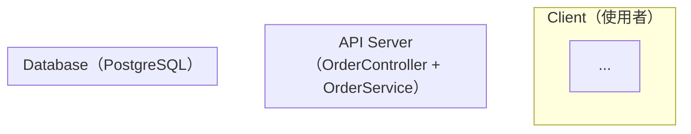

# EDD 生成規則

## Iron Rule: 累積上游讀取

每份文件生成時，必須讀取所有上游文件（累積，非僅直接父文件）。
若某上游文件不存在，靜默跳過；不得因上游缺失而降低覆蓋深度。
docs/req/* 中的所有素材（由 IDEA.md 定義）也必須全部關聯讀取。

---

## 四 Pass 生成架構（Multi-Pass Subagent）

EDD 因章節多（21 個主章）且上游文件量大，採四個順序 subagent 分段生成，
所有 pass 均輸出到同一份 `docs/EDD.md`。Review Loop 在四個 pass 全部完成後執行。

**執行指令（gendoc-flow EDD 生成階段）：**

```
Pass-0（主 Claude 直接執行）：常數提取（Constants Extraction）
  目的：從 PRD 提取所有業務關鍵數值，確保跨文件數值一致性
  讀取：docs/PRD.md, docs/BRD.md, docs/req/*
  輸出 1：docs/CONSTANTS.md（Markdown 格式，人類可讀）
  輸出 2：docs/constants.json（JSON 格式，機器可讀，供下游 CI/測試引用）
  格式要求：每個常數必須有以下欄位：
    - name: 常數名稱（UPPER_SNAKE_CASE）
    - value: 數值（含單位）
    - unit: 單位（如 "%"、"ms"、"req/s"）
    - source: 來源（PRD 章節，如 "PRD §4.2"）
    - note: 用途說明
  常數類型（必須掃描）：
    - 業務比率：RTP、倍率、手續費率、分潤比例
    - 閾值：輸贏閾值、風控限額、封號條件
    - SLO/SLI：可用性目標、P99 延遲、錯誤率
    - Rate Limit：API 頻率限制、並發上限
    - Timeout/Retry：連線超時、重試次數
    - 容量：用戶上限、儲存配額、批次大小
  若 docs/CONSTANTS.md 已存在（前次生成），讀取並更新差異項，不全量覆蓋。
  完成後 commit：git add docs/CONSTANTS.md docs/constants.json && git commit -m "docs(gendoc)[EDD-Pass0]: 提取業務常數"

Pass-A（主 Claude 直接執行）：
  目的：生成 §0–§8 核心架構
  讀取：docs/IDEA.md, docs/BRD.md, docs/PRD.md, docs/PDD.md, docs/VDD.md,
         docs/CONSTANTS.md（Pass-0 已生成）, docs/req/*
  輸出：docs/EDD.md（§0 至 §8，不含 §4.5 UML）
  注意：§3.3 技術棧總覽必須填入 _CLIENT_ENGINE 和 _ADMIN_FRAMEWORK 欄位（見下方規則）

Pass-B（派送 subagent）：
  目的：生成 §4.5 UML 9 大圖
  讀取：docs/EDD.md（Pass-A 已生成的 §0–§8，提取 API 路由清單 + DB 資料表清單 + PRD AC 清單）
         + docs/PRD.md §AC 清單
  輸出：**追加寫入** docs/EDD.md §4.5（9 個 Mermaid 圖）
  注意：Pass-A 生成的 §4.5 佔位符（若有）需被替換，其他章節不得修改

Pass-C（派送 subagent）：
  目的：生成 §9–§21 安全/可觀測性/效能/運維設計
  讀取：docs/EDD.md（Pass-A + Pass-B 已完成部分）
         + docs/PRD.md §安全需求 / 非功能需求
         + docs/CONSTANTS.md（用於 SLO/SLI 數值，必須引用 constants.json 中的具體數字）
  輸出：**追加寫入** docs/EDD.md §9 至 §21
  注意：不得修改 §0–§8 已生成的內容
```

**四 Pass 完成後**：對完整 docs/EDD.md 執行 Quality Gate 自我檢查（見下方），通過後交付 Review Loop。

---

## 上游讀取規則

- `docs/IDEA.md`（若存在）：了解產品核心概念、解決問題、目標市場——EDD 技術選型必須服務 IDEA 的業務目標
- `docs/BRD.md`：了解業務需求、成功指標——EDD 的 SLO/SLI 設計必須對應 BRD 的業務指標
- `docs/PRD.md`：了解所有 P0/P1 功能及 AC——EDD 的資料模型、API 設計需覆蓋所有功能
- `docs/PDD.md`（若存在）：了解畫面設計、欄位定義——**EDD 的 DB Schema 必須依 PDD 畫面欄位設計**，不得新增 PDD 未定義的欄位（除非有技術必要），也不得遺漏 PDD 中的資料欄位
- `docs/VDD.md`（若存在）：了解視覺設計系統——**Design Token 命名必須與 VDD §6 保持一致**；資產格式規格（圖片壓縮比、字體格式）影響 EDD §7 SCALE 的儲存容量計算；Art Direction 影響 §9 CI/CD 的資產 Pipeline 設計

### docs/req/ 素材關聯讀取

若 `docs/IDEA.md` 存在且 Appendix C 引用了 `docs/req/` 素材，對每個存在的檔案讀取全文，結合 Appendix C「應用於」欄位標有「EDD §」的段落，作為生成 EDD 對應章節（技術架構、資料模型、安全設計）的補充依據。優先採用素材原文描述，而非 AI 推斷。若無引用，靜默跳過。

---

## 上游衝突偵測規則

讀取完所有上游文件後，掃描以下常見矛盾點：
- IDEA/BRD 描述的業務規模 vs PRD 的功能範疇（是否需要額外的擴展設計）
- PRD 的安全要求 vs 技術選型（e.g., PRD 要求 GDPR，lang_stack 是否有對應的函式庫）
- PDD 的畫面欄位 vs PRD 的 AC（是否有欄位在 PRD 中有但 PDD 未定義，或反之）

若發現矛盾，標記 `[UPSTREAM_CONFLICT]` 並依衝突解決機制處理。

---

## 章節結構（全章節）

EDD 必須涵蓋以下所有章節（對應 templates/EDD.md 結構）：

> ⚠️ 章節編號以 EDD.md 骨架為準（單一真相來源）。生成規則只描述「填什麼」，不改變章節位置。

- §0 Document Control（DOC-ID / 上游文件連結）
- §1 概述（一段話說明技術方案）
- §2 System Context（C4 Level 1 + Level 2）
- §3 Architecture Design（技術選型 / ADR / 技術棧 / Bounded Context）
- §4 Module / Component Design
- **§4.5 UML 9 大圖（強制，完整覆蓋：每個 API endpoint/DB 資料表/PRD AC 均有對應圖）← 骨架真實位置**
- **§4.6 Domain Events（領域事件清單）← 骨架真實位置**
- §5 API Design
- §6 Data Model（ERD）
- §7 Key Sequence Flows
- §8 Error Handling & Resilience
- §9 Security Design（OWASP + STRIDE）
- §10 Observability Design（§10.1 Logging / §10.2 Metrics / §10.3 Tracing / §10.4 Alerting / §10.5 SLO/SLI / §10.6 Audit Log / §10.7 Synthetic Monitoring）
- §11 Performance Design（容量規劃 + 快取 + DB 優化）
- §12 Testing Strategy（測試分層 + Chaos Engineering）
- §13 Deployment & Operations（部署架構 + CI/CD + DR）
- §14 Risk Assessment
- §16 Implementation Plan
- §17 Open Questions
- §19 Approval Sign-off
- §20 Feature Flag Engineering
- §21 Cross-Cutting Concerns（可觀測性三支柱 + 結構化日誌 + OpenTelemetry）

---

## Key Fields

### §0 Document Control

- DOC-ID：`EDD-<PROJECT_SLUG 大寫>-<YYYYMMDD>`
- 上游 PDD：`[PDD.md](PDD.md)`（UX / Interaction Design）
- 上游 PRD：`[PRD.md](PRD.md)`

### §2 技術選型

決策輸入（按以下優先序讀取，再做 ADR）：
1. **BRD §8.3 技術約束（硬性）** — 不得違反；若需排除，必須在 ADR 中取得 BRD Owner 書面同意
2. **PRD §X 非功能需求** — 效能、可靠性、合規要求限縮選項
3. **VDD §6 Design Token 系統**（若存在）— CSS-in-JS / PostCSS / Tailwind 等影響前端框架選擇
4. **IDEA §7.2 技術生態建議** — 市場生態趨勢（軟性參考）

決策輸出（填入 EDD §3.2 ADR + §3.3 技術棧總覽）：

```
語言/框架（lang_stack）：<BRD §8.3 若有硬性約束則從該約束出發；否則依 PRD 需求推薦>
資料庫：<依需求推薦，預設 PostgreSQL>
快取：<依需求，預設 Redis>
Queue：<依需求，預設 NATS>
容器：Docker（multi-stage）+ k8s（Rancher Desktop）

_CLIENT_ENGINE（前台引擎，下游 CLIENT_IMPL 讀取）：
  偵測規則（按優先序）：
    "Cocos Creator" → PDD/VDD 明確說明 Cocos 或 PRD 有遊戲引擎需求
    "Unity WebGL"   → PDD/VDD 明確說明 Unity
    "React"         → PRD/BRD 描述 SaaS/Dashboard 且提及 React 生態
    "Vue"           → PRD/BRD 描述 SaaS/Dashboard 且提及 Vue 生態（但非 Admin 後台）
    "HTML5"         → 輕量 H5 遊戲 / 無框架前端
    "none"          → client_type=api-only 或無前台需求
  ⚠️ 注意：Vue Admin 後台填入 _ADMIN_FRAMEWORK，不在 _CLIENT_ENGINE 填入

_ADMIN_FRAMEWORK（Admin 後台技術棧，下游 ADMIN_IMPL 讀取）：
  偵測規則（按優先序）：
    若 has_admin_backend=false → "none"（不生成 ADMIN_IMPL）
    若 PRD/BRD 明確指定 Admin 框架 → 填入指定值
    預設值 → "Vue3+ElementPlus+Vite"（業界 Admin 主流組合）
  格式：框架名稱字串，如 "Vue3+ElementPlus+Vite"、"React+Ant Design+Vite"、"none"
```

> **lang_stack 定錨規則：** 此處決定的語言/框架組合將成為 test-plan、BDD、runbook、LOCAL_DEPLOY
> 的工具選型基準。下游 gen.md 均從 `EDD §3.3 技術棧總覽` 讀取，此處必須填入具體值，不得留 placeholder。
> `_CLIENT_ENGINE` 和 `_ADMIN_FRAMEWORK` 為新增必填欄位，gendoc-flow 在 EDD 完成後自動提取並鎖定至 state。

### §3 Clean Code 架構

**SOLID 原則對應表（必填）**

| 原則 | 本系統實作方式 |
|------|--------------|
| SRP  | 每個 Service 只負責一個業務領域 |
| OCP  | 透過 Interface 擴展，不修改現有 class |
| LSP  | 子型別必須可替換父型別 |
| ISP  | 細粒度 Interface，不強制實作不需要的方法 |
| DIP  | 高層模組依賴 Interface，不依賴具體實作 |

**分層設計（必填）**
```
Controller Layer    → HTTP/gRPC 處理，輸入驗證，不含業務邏輯
Service Layer       → 業務規則、事務邊界
Repository Layer    → DB 操作封裝，返回 Domain 物件
Infrastructure      → 外部服務（快取、Queue、第三方 API）
```

### §3.4 Bounded Context & Context Map

**任何系統均必須生成 Bounded Context Map（Spring Modulith HC-1/HC-5），不得以「單服務無需繪製」為由跳過。**

識別步驟：
1. 從 PRD 業務邊界提取所有 Bounded Context（如 member / wallet / deposit / lobby / game）
2. 為每個 BC 確認其擁有的 DB Schema 及 Tables（Schema Ownership Table）
3. 確認所有跨 BC 通訊方式（REST API 或 Domain Event）

Context Map 關係：

| 上游 BC | 下游 BC | 整合模式 | 說明 |
|--------|--------|---------|------|
| <認證服務> | <本系統> | Conformist | 遵從認證服務的用戶模型 |

Schema Ownership Table（**必填**，每個 BC 填入具體 Schema / Table 名稱）：

| Bounded Context | 擁有的 DB Schema / Tables | 對外 Public Interface |
|----------------|--------------------------|----------------------|
| <BC_NAME_1> | `<schema_1>`: `<table_a>`, `<table_b>` | REST API `/api/v1/<bc1>/` |
| <BC_NAME_2> | `<schema_2>`: `<table_c>` | Domain Event `<EventName>` |

> **HC-1 強制規則**：填寫後確認：(1) 無兩個 BC 聲明擁有同一張 Table；(2) 無 DB-level FK 引用其他 BC 的 Table。違反者必須在生成前修正。

### §3.6 HA / SPOF / SCALE / BCP Architecture Specification（必填）

> **Iron Law**：本節是所有下游文件（ARCH/runbook/LOCAL_DEPLOY/test-plan/API/SCHEMA）HA 設計的**權威來源**。必須在生成其他章節前完成本節。

**生成步驟**（依序完成）：

1. **§3.6.1 SPOF 分析表**：從 EDD §3 架構圖、§3.5 環境矩陣提取所有核心元件，逐一分析 SPOF 風險與消除方式，填入 Min Replicas（≥ 2）。
2. **§3.6.2 HA 設計原則**：依系統實際選型（lang_stack / Redis 模式 / DB 方案）填入具體實作要求：Stateless API / 冪等 Worker / Graceful Shutdown / Health Check / Circuit Breaker / Auto-Scaling。
3. **§3.6.3 SLO / RTO / RPO**：依 EDD §10.5（SLO/SLI）和 BRD 服務等級承諾填入具體數字（不得保留 placeholder）。
4. **§3.6.4 BCP 場景表**：依實際元件生成故障場景、自動/手動觸發條件、恢復步驟、RTO。
5. **§3.6.5 Graceful Shutdown 流程**：依 lang_stack 填入具體指令（Node.js SIGTERM handler / Java SpringBoot graceful-shutdown: true / Python signal.signal(SIGTERM) 等）。

**嚴格禁止**：
- 不得出現「HA 為 Future Scope」的說明
- 所有 Min Replicas 必須 ≥ 2（包含 Local 環境）
- SLO 數字不得為 TBD / 待確認

### §3.7 最小完整度架構圖（Minimum Viable HA Architecture）

**生成步驟**（依序完成）：

1. **確認元件清單**：從 §3.6.1 SPOF 分析表提取所有核心元件（API Server、Worker、DB、Redis、MQ、Ingress）。

2. **生成 Figure A — 生產環境 HA-HA Active-Active 部署圖**（Mermaid `graph TB`）：
   - 包含 Internet → Global LB → Region A / Region B 兩個平行 Region
   - 每個 Region 顯示：Regional LB、API Server（≥ 2 replicas）、Worker（≥ 2 replicas）、DB Primary + Standby、Redis Sentinel、MQ
   - 跨 Region 連線：Global LB → 兩個 Regional LB；DB Cross-Region Replication（虛線）
   - 附最小 Replica 表格（6 行：API / Worker / DB / Redis / MQ / Ingress）

3. **生成 Figure B — 本地開發環境最小 HA 架構圖**（Mermaid `graph TB`）：
   - 包含 Nginx/Traefik（Port 8080）→ api-1 / api-2（≥ 2 replicas）
   - Worker-1 / Worker-2（≥ 2 replicas）
   - Data Layer：PostgreSQL / Redis / MQ（本地允許單節點）
   - Observability：Prometheus + Grafana 或 local log aggregation
   - 附本地最小 Replica 表格，並說明「API Server / Worker 本地也必須 ≥ 2 副本」的原因
   - 附驗證指令（docker compose ps / kubectl get pods）

4. **品質驗證**：
   - Figure A 中 API Server、Worker 節點標注 `replica ≥ 2`
   - Figure B 中 API Server、Worker 最小 Replica 欄位為 **≥ 2**（加粗）
   - 兩張圖均可在 Mermaid 渲染器（如 mermaid.live）正確渲染

**嚴格禁止**：
- 不得在 Figure B 中將 API Server 設為單副本（`replicas: 1`）
- 不得省略 Ingress / LB 層（以為直接打 API Port 即可）
- Mermaid 語法不得有未閉合的 `subgraph`

### §4 Security 設計

**OWASP Top 10 對應（每項必填具體對策）**

| # | 風險 | 本系統對策 |
|---|------|----------|
| A01 | Broken Access Control | JWT + RBAC，每個 endpoint 明確授權 |
| A02 | Cryptographic Failures | bcrypt（密碼）、AES-256（PII）、TLS everywhere |
| A03 | Injection | parameterized queries，input validation（pydantic/zod）|
| A04 | Insecure Design | threat modeling，fail-fast startup |
| A05 | Security Misconfiguration | 環境變數驗證，禁 debug mode in prod |
| A06 | Vulnerable Components | dependabot / renovate 自動掃描 |
| A07 | Auth Failures | rate limiting（10 req/min/IP on auth）|
| A08 | Data Integrity | HMAC 簽署、冪等設計 |
| A09 | Logging Failures | 結構化 log，遮罩 PII，不記錄 secret |
| A10 | SSRF | URL allowlist，禁止 server-side fetch 任意 URL |

**Secret 管理**
- 所有 KEY 存於 OS Keystore（macOS Keychain / Windows Credential Manager）
- 啟動時 fail-fast 驗證
- Log 遮罩：前 4 + 後 2 字元

### §4.5 UML 9 大圖（強制，完整覆蓋，缺一不可）

> **Iron Law**：EDD §4.5 是 UML 圖集的唯一放置位置（對應 EDD.md 骨架 §4.5）。
> 不得留空、不得用文字替代、設計評審前必須完成。
> gendoc-gen-diagrams 從 §4.5 提取所有圖。
> **實作完整度原則**：每張圖必須讓開發者在沒有其他文件的情況下，能夠 1:1 實作出完整系統。
> 禁止模糊標注（如「...」省略法、無型別的方法、無條件的決策點）。

> **⚠️ 覆蓋完整性原則（Coverage-First，非數量優先）**：
> UML 圖的數量不是目標，完整覆蓋才是目標。不允許以「完成了 N 張圖」代替覆蓋完整性的驗證。
> - **API.md 中每個 endpoint group** → Sequence Diagram（Happy Path + Error Path 各一張）
> - **SCHEMA.md 中每個 table** → ERD 中有對應節點和 FK 關係線
> - **PRD 中每個核心 User Story** → 系統流程圖或 Swimlane Diagram 中有對應場景
> - **系統中每個獨立服務/模組** → Component Diagram 中有對應元件
>
> 必須逐一列出：「API endpoint group X → Sequence Diagram §4.5.4.N」「Table Y → ERD §4.5 ERD 節點」「User Story Z → Activity Diagram §4.5.7.N」，完成顯式 1:1 對應確認後，方可提交。

**⚠️ 注意**：§4.5 = UML 圖集，§4.6 = Domain Events。兩者不同，不得混淆。

---

#### §4.5.1 Use Case Diagram（使用案例圖）

**格式**：Mermaid `flowchart TD`

**強制完整度標準**：
- 每個 Actor 用矩形節點 `[ActorName\n角色說明]`，Actor 命名來自 PRD §2 使用者角色定義，不得使用「用戶」等籠統稱呼
- 每個 Use Case 用橢圓節點 `((UC-N: UseCaseName))`，UC 編號與 PRD AC 編號對應
- 系統邊界使用 `subgraph SystemName [SystemName — BRD §1 系統名稱]`
- 每條關聯線標注關係類型：`-- 直接使用 -->` / `-- <<extend>> -->` / `-- <<include>> -->`
- 必須涵蓋 PRD 全部 P0 + P1 功能對應的 Use Case；每個 Actor 至少 2 個 Use Case
- **禁止**：省略任何 Actor、用「etc.」代替具體 Use Case、無 UC 編號

**覆蓋要求**：PRD 中每個主要 Actor 和每個 P0/P1 Use Case 必須出現在圖中（1:1 對應）；若 Actor 或 Use Case 數量過多，可拆為多張，但每張都必須明確標注覆蓋範圍，不得有遺漏。

**UC → PRD AC Traceability Table（強制）**：

每張 Use Case Diagram 下方必須附對應表：
| UC ID | UC 名稱 | PRD 章節 | PRD AC 編號 | Precondition | Postcondition |
|-------|---------|---------|------------|-------------|--------------|
| UC1 | Login | §2.1 | AC-AUTH-001 | 用戶未登入 | JWT token 已發，session 已建立 |
| UC3 | Register | §2.2 | AC-REG-001 | Email 不存在系統中 | 用戶建立，驗證 Email 已發送 |

**禁止**：只有圖無對應表、Precondition/Postcondition 欄位空白

**<<include>> / <<extend>> 語意聲明（強制）**：

每條 <<include>> 或 <<extend>> 關係線下方必須附語意說明：
- `<<include>>`：被包含的 Use Case 是**強制子步驟**（必定執行，不可跳過）
- `<<extend>>`：擴展的 Use Case 是**可選條件步驟**（滿足特定條件才執行）

**RBAC Matrix（強制，若系統有多個 Actor 角色）**：

Use Case Diagram 旁必須附許可矩陣：
| UC | User | Admin | GuestUser | 備注 |
|----|------|-------|-----------|------|
| UC1 Login | ✅ | ✅ | ✅ | — |
| UC7 Manage Users | ❌ | ✅ | ❌ | 需 Admin role 驗證（API 層強制） |

---

#### §4.5.2 Class Diagram（類別圖）⭐

**格式**：Mermaid `classDiagram`，依架構層次分 3 張

**強制完整度標準（每個 class 必須全部達到）：**

**屬性（attribute）完整格式**（三者缺一不可）：
```
visibility attributeName : Type
```
- `visibility`：`+`（public）/ `-`（private）/ `#`（protected）/ `~`（package）
- 型別必須精確：`String`、`UUID`、`Integer`、`Decimal`、`Boolean`、`DateTime`、`OrderStatus`（Enum 類型直接引用 enum class 名稱）
- **禁止**：無 visibility 的裸屬性、無型別的屬性、`id: any`、`data: Object`等模糊型別

**方法（method）完整格式**（四者缺一不可）：
```
visibility methodName(param1: Type, param2: Type) ReturnType
```
- 每個參數必須有名稱和型別
- 回傳型別必須精確（void / String / Order / List~Order~ / Optional~User~ 等）
- **禁止**：無參數型別的方法、無回傳型別的方法、空方法列表、`create()` 無參數等省略法

**Stereotype（每個 class 必有）**：
`<<AggregateRoot>>`、`<<Entity>>`、`<<ValueObject>>`、`<<DomainEvent>>`、`<<Repository>>`（interface）、`<<UseCase>>`、`<<ApplicationService>>`、`<<DTO>>`、`<<Port>>`、`<<RepositoryImpl>>`、`<<Adapter>>`、`<<Controller>>`、`<<RequestDTO>>`、`<<ResponseDTO>>`、`<<enumeration>>`

**Enum 類型必須獨立定義**：
```mermaid
class OrderStatus {
    <<enumeration>>
    PENDING
    CONFIRMED
    PROCESSING
    SHIPPED
    DELIVERED
    CANCELLED
    REFUNDED
}
```
每個 Enum 值必須全部列出（禁止用「...」省略），來自 PRD AC 或 SCHEMA.md 欄位定義

**關聯線必須精確標注**（格式：`ClassA "cardinality" relationSymbol "cardinality" ClassB : roleLabel`）：
- 繼承：`ClassA <|-- ClassB`（ClassB extends ClassA）
- 介面實作：`InterfaceA <|.. ClassB`（ClassB implements InterfaceA）
- 組合：`ClassA *-- "1..*" ClassB : contains`（ClassA 生命週期包含 ClassB）
- 聚合：`ClassA o-- "0..*" ClassB : has`（ClassA 包含 ClassB，獨立生命週期）
- 關聯：`ClassA "1" --> "0..*" ClassB : roleLabel`（ClassA 使用/知道 ClassB）
- 依賴：`ClassA ..> ClassB : uses`（ClassA 方法中使用 ClassB）
- Cardinality 格式：`"1"`、`"0..1"`、`"1..*"`、`"0..*"`、`"N"`（兩端都要標）
- **禁止**：無 cardinality 的關聯線、無 role label 的模糊關聯

**分層張數（固定 3 張）**：
- **class-domain**：`<<AggregateRoot>>`、`<<Entity>>`、`<<ValueObject>>`、`<<DomainEvent>>`、`<<Repository>>`（interface 定義）
  - Domain Layer 最低規格：≥ 1 `<<AggregateRoot>>`、≥ 2 `<<Entity>>`、≥ 1 `<<Repository>>` interface
- **class-application**：`<<UseCase>>`（每個 PRD AC 對應一個）、`<<ApplicationService>>`、`<<DTO>>`、`<<Port>>`
- **class-infra-presentation**：`<<RepositoryImpl>>`、`<<Adapter>>`、`<<Controller>>`、`<<RequestDTO>>`、`<<ResponseDTO>>`

**命名對齊**：class 名稱必須與 ARCH.md §3 Domain 模型和 SCHEMA.md Table 名稱一致（不得有任何差異）

**Constructor / Factory Method 格式（強制，所有 Entity 和 ValueObject）**：

每個 `<<Entity>>` 和 `<<ValueObject>>` 必須明確標注建構方式：
```
class UserId {
    <<ValueObject>>
    -value: String
    +{static} of(raw: String): UserId   %% factory，含 UUID 格式驗證
    +getValue(): String
    +equals(other: UserId): Boolean
}
```
若使用 private constructor + factory：標注 `+{static} create(...): ClassName`
**禁止**：class 無任何構造方法、只有 property 無 factory/constructor

**Accessor Convention（強制，所有私有欄位）**：

- 若欄位為 `{readOnly}`（不可改），標注：`-email: Email {readOnly}` 且 expose public getter
- 若欄位可改，標注 setter 方法：`+setStatus(s: OrderStatus): void`
- 若欄位完全私有（無外部存取），在 Class Inventory 表格的「備注」欄說明

**Invariant Table（強制，每個含業務約束欄位的 class）**：

每個 `<<AggregateRoot>>` 下方必須附不變量表：
| 欄位 | 型別 | 約束條件 | 執行位置 |
|-----|------|---------|---------|
| balance | Decimal | >= 0 | constructor + setBalance() |
| email | Email | valid format, globally unique | ValueObject + DB unique constraint |
| status | OrderStatus | 僅允許 State Machine 定義的合法轉換 | State Machine guard |

**Class Inventory 表格**（每張 classDiagram 尾部必填）：

| Class | Stereotype | Layer | src 路徑 | test 路徑 |
|-------|-----------|-------|---------|---------|
| ClassName | <<stereotype>> | Domain/Application/Infra/Presentation | src/domain/... | tests/unit/... |

---

#### §4.5.3 Object Diagram（物件圖）

**格式**：Mermaid `classDiagram`（instance 模式）

**強制完整度標準**：
- 每個 instance 用 `<<instance>>` stereotype + 具名格式：`class ordA_ord001 { <<instance>> ...}`
- **所有屬性必須填入具體範例值**（非型別定義）：
  - UUID：`"a3f8c1d2-..."`（完整或縮寫格式 `"a3f8c1d2"`）
  - String：`"Alice Wang"`（真實範例，非 `"string"`）
  - Enum：`PROCESSING`（直接寫枚舉值）
  - Decimal：`1250.00`
  - DateTime：`"2024-03-15T14:30:00Z"`
- 關聯線標注 role label：`ordA_ord001 --> usrB_usr123 : placedBy`
- **觸發條件**：§4.5.2 每個 `<<AggregateRoot>>` 必須對應至少 1 張 Object Diagram
- 每張展示一個業務代表狀態（不同狀態的 Aggregate 至少各展示一張，如 Order PENDING 一張、Order PROCESSING 一張）
- **禁止**：屬性值為型別名稱（如 `id: UUID`）、空值（如 `name: ""`）、佔位值（如 `"example"`）

---

#### §4.5.4 Sequence Diagram（循序圖）

**格式**：Mermaid `sequenceDiagram`

**強制完整度標準（每張圖每個箭頭都必須達到）：**

**呼叫箭頭格式**（四者缺一不可）：
```
Caller->>Callee: methodName(param1: Type, param2: Type)
```
- 方法名稱：精確的函式名（`createOrder`、`findByUserId`、`publish`），**禁止**用 `create`、`call`、`request` 等模糊動詞
- 參數：名稱 + 型別（`userId: UUID, items: OrderItem[]`），**禁止**空括號 `()` 或無型別 `(data)`
- 第一個從 Client 發出的箭頭格式：`Client->>Controller: POST /orders {userId, items, paymentMethod}`

**回傳箭頭格式**（二者缺一不可）：
```
Callee-->>Caller: ReturnType | HTTP StatusCode ResponseBody
```
- 服務層回傳：`return Order` / `return Optional<User>` / `throw OrderNotFoundException`
- HTTP 回傳：`201 Created {orderId, status, createdAt}` / `409 Conflict {error, conflictField}`
- **禁止**：無回傳的「成功」箭頭、`return result` 等模糊回傳

**條件分支格式**（每個條件分支都必須有）：
```
alt 具體條件描述（如：庫存 >= 請求數量）
    Caller->>Callee: methodName(params)
    Callee-->>Caller: 201 Created {orderId}
else 具體 else 條件（如：庫存不足）
    Callee-->>Caller: 422 Unprocessable {error: "INSUFFICIENT_STOCK", available: Integer}
end
```
- **禁止**：只有 Happy Path 無 alt 分支、`alt success`/`alt error` 等無具體條件描述

**必含段落**：
- 每個 Mutation 操作（POST/PATCH/PUT/DELETE）：Happy Path + 至少 3 個 Error Path（業務規則違反 + 系統故障 + 認證/授權失敗）
- 非同步操作：`par [async: 說明非同步原因]` 包裹
- 重試邏輯：`loop [retry: 最多 N 次，間隔 Xms]` 包裹
- 資料庫操作：明確標注 `DB->>DB: BEGIN TRANSACTION` / `COMMIT` / `ROLLBACK`

**參與者宣告**（每張圖頂部）：
```
participant Client as Client（前端/行動端）
participant Controller as OrderController
participant Service as OrderService
participant Repo as OrderRepository（interface）
participant DB as PostgreSQL
participant Cache as Redis（若有）
participant Queue as NATS（若有）
```

**覆蓋要求**：API.md 中每個 endpoint group（或每個具有狀態變更的 P0 User Story）對應一組 Sequence Diagram（Happy Path 獨立一張 + Error Path 獨立一張，不得合併）。必須列出對應表：「POST /orders group → §4.5.4.1 Happy + §4.5.4.2 Error」，確認無遺漏後方可提交。

**上下游一致性**：本節服務內部視角必須與 API.md §1 Client 視角邏輯一致；有差異則標記 `> ⚠️ [UPSTREAM_CONFLICT]`

**Request/Response Payload JSON Schema（強制，每個外部呼叫）**：

每個從 Client/HTTP 發出的箭頭，必須在 Note 中附完整 JSON 欄位定義（型別 + 是否必填 + 格式/限制）：
```
Client->>Controller: POST /orders
Note over Client,Controller: RequestDTO 欄位：
  userId: UUID (required)
  items: Array<{productId: UUID, quantity: int ≥1, ≤1000}> (required, minItems: 1)
  paymentMethod: "CARD" | "BANK_TRANSFER" (required, enum)
  billingAddress: {street: string, city: string, zip: string(5-10)} (required)
```

每個回傳箭頭，必須在 Note 中附完整 ResponseDTO（含型別 + 格式）：
```
Controller-->>Client: 201 Created
Note over Controller,Client: ResponseDTO 欄位：
  orderId: UUID
  status: "PENDING" | "CONFIRMED" | ... (enum)
  total: Decimal (2 digits, ≥ 0)
  createdAt: ISO8601 (UTC)
```

**Error Response Schema（強制，每個 alt error 分支）**：

每個 alt error 分支的 Error 箭頭必須附 ErrorDTO：
```
alt 庫存不足
    Service-->>Controller: 422 Unprocessable Entity
    Note over Service,Controller: ErrorDTO：
      code: "INSUFFICIENT_STOCK"
      message: "只剩 {available} 件，要求 {requested} 件"
      availableQuantity: int
      requestedQuantity: int
end
```
**禁止**：只寫 `422` 無 body、只寫 `error: string` 無結構、error code 自行定義無枚舉清單

**Timeout/Retry 標注（強制，所有 I/O 操作）**：

每個對外部系統（DB、Cache、第三方 API、Message Queue）的呼叫，必須在 Note 標注 timeout + retry：
```
Service->>Redis: GET rate_limit:{userId}
Note right of Service: timeout: 500ms, retry: 1次, total: 1s
```

**Transaction Boundary（強制，所有包含多個寫入的操作）**：

若一個 Sequence 中有多個 DB 寫入，必須明確標注事務邊界：
```
Service->>DB: BEGIN TRANSACTION
DB-->>Service: OK
Service->>DB: INSERT INTO orders (...)
DB-->>Service: orderId
Service->>DB: UPDATE inventory (...)
alt 全部成功
    Service->>DB: COMMIT
else 任一失敗
    Service->>DB: ROLLBACK
end
```

**禁止**：多個寫入操作無 BEGIN/COMMIT/ROLLBACK 邊界

---

#### §4.5.5 Communication Diagram（通訊圖）

**格式**：Mermaid `flowchart LR`

**強制完整度標準**：
- 每個節點標注元件名稱 + 技術：`["OrderService\n(Node.js)"]`（必須用引號包住，否則 Mermaid v11 解析失敗）
- 每條邊標注訊息序號 + 完整訊息名稱 + 通訊協定：`"1: POST /orders\n(HTTP/REST)"` / `"3: OrderCreated{orderId}\n(NATS)"`
- 序號連續且完整反映完整的訊息交換流程（不得跳號或省略中間訊息）
- 非同步訊息用虛線邊 `-.->` + 標注 `[async]`；同步用實線 `-->`
- **觸發條件**：系統有 Message Queue / Event Bus → 必須生成（展示事件驅動的服務間訊息流）；純同步架構 → 展示主要 HTTP 呼叫協作並標注 `> 本系統為同步架構，所有通訊透過 HTTP/REST`
- **禁止**：無序號的邊、無協定的邊、省略某些訊息導致序號不連續

---

#### §4.5.6 State Machine Diagram（狀態機圖）

**格式**：Mermaid `stateDiagram-v2`

**強制完整度標準（每個轉換箭頭都必須達到）：**

**轉換格式**（三者缺一不可）：
```
StateA --> StateB : trigger [guard] / action
```
- `trigger`：精確的觸發事件名（`confirmOrder()`、`paymentCaptured`、`cancelRequested(reason)`），**禁止**用「點擊」「用戶操作」等模糊描述
- `[guard]`：觸發條件（`[balance >= amount]`、`[retries <= 3]`、`[stock > 0]`），**必須有**；若無條件可填 `[always]`
- `/ action`：狀態轉換的副作用（`/ emit OrderConfirmed`、`/ notifyUser(email)`、`/ decrementStock(quantity)`），**禁止**省略
- **禁止**：只有 trigger 無 guard 和 action 的簡化轉換
- **禁止** 在 transition label 使用 `<br/>`（`stateDiagram-v2` 不支援，Safari/Firefox 破圖）；換行說明移到 `note right of STATE` 區塊

**進入/退出動作**（有業務邏輯的狀態必填）：
```
state PROCESSING {
    entry: validateInventory(), lockStock()
    exit: releaseStockLock()
}
```

**必含元素**：
- 明確的初始狀態：`[*] --> InitialState : create(params) [valid] / assignId()`
- 明確的終止狀態：`TerminalState --> [*]`（所有業務終態都要連到 `[*]`）
- 所有合法的狀態轉換路徑（正向 + 逆向，如 PROCESSING → CANCELLED）
- 狀態旁附加說明：`state PENDING : 等待用戶確認，TTL 30 分鐘`

**最低張數**：§4.5.2 Class Diagram 中含 `status: StatusEnum` 或 `state: StateEnum` 欄位的每個 Entity 各一張（≥ 1 張）

**Invalid Transition Handling（強制）**：

對每個「不可能的轉換」必須明確聲明，不可留空默認：
```
%%  ✅ 明確禁止轉換：
%%  DELIVERED --> PENDING : attemptReopen [false] / logInvalidTransition()
%%  或在狀態機旁附表：
```
| From State | To State | Behavior | Log |
|-----------|---------|---------|-----|
| DELIVERED | PENDING | 靜默拒絕 | WARN |
| DELIVERED | PROCESSING | Exception | ERROR |

**Timeout Transition（強制，若業務有 TTL 或逾時邏輯）**：

```
PENDING --> CANCELLED : timeout [30min_no_payment] / notifyUser(cancellationEmail)
```
**禁止**：只在狀態旁用文字說明「TTL 30 分鐘」而不寫明轉換箭頭

**Idempotency Guarantee（強制，每個 trigger）**：

每個狀態機下方必須附 Idempotency 表格：
| Trigger | From State | Idempotent? | 重複觸發行為 |
|---------|-----------|------------|------------|
| confirmOrder() | PENDING | ✅ 是 | 已在 CONFIRMED，靜默忽略，不重發事件 |
| cancelOrder() | DELIVERED | ❌ 不適用 | 拒絕，回傳 422 |

**Entry/Exit Action Failure Semantics（強制，有 entry/exit 的狀態）**：

```
state PROCESSING {
    entry: lockStock(items)   -- 失敗時 ROLLBACK 回 CONFIRMED，發 StockLockFailed 事件
    exit: releaseStockLock()  -- 失敗時 LOG CRITICAL，觸發 runbook-inventory-lock
}
```
**禁止**：entry/exit 只寫 action 名稱無失敗語意

**Saga / 分散式補償規則（強制，若系統有跨服務事務）**：

若任何 Sequence Diagram 中出現跨越 2 個以上服務的寫入操作，必須在對應章節附補償流程表：

| 步驟 | 正向操作 | 服務 | 補償操作 | 補償觸發條件 |
|------|---------|------|---------|------------|
| 1 | lockStock(items) | InventorySvc | unlockStock(items) | 後續任一步驟失敗 |
| 2 | createOrder(data) | OrderSvc | cancelOrder(orderId) | 步驟 3 或 4 失敗 |
| 3 | chargePayment(amount) | PaymentSvc | refundPayment(chargeId) | 步驟 4 失敗 |
| 4 | sendConfirmation(email) | NotifSvc | — | （不補償，可重試） |

**補償執行語意**（必須聲明其一）：
- `Choreography`：每個服務監聽 Domain Event，自行決定補償（事件驅動，鬆耦合）
- `Orchestration`：Saga Orchestrator 負責呼叫每個補償操作（集中控制，順序保證）

**禁止**：只有正向 Sequence Diagram，無補償流程表；跨服務事務無原子性說明

---

#### §4.5.7 Activity Diagram（活動圖）

**格式**：Mermaid `flowchart TD`

**強制完整度標準**：

**泳道（Swimlane）強制使用**：

- 每個 Actor / 系統元件必須有獨立 subgraph 泳道
- 泳道名稱標注 Actor 角色 + 負責的 class（`API Server（OrderController + OrderService）`）

**決策點格式**（必須兩個分支都有標注）：
```
{具體條件描述？}
具體條件描述？ -->|是（具體結果）| NextNode
具體條件描述？ -->|否（具體結果）| AltNode
```
- **禁止**：只有一個分支的決策點、`Yes`/`No` 等無業務語意的標注、無條件描述的菱形節點

**Fork/Join 並行路徑**（若有並行業務流程必須標注）：
- Fork：`[[ 並行開始：說明哪些步驟並行執行 ]]`
- 每個並行路徑在獨立泳道中展開
- Join：`[[ 並行結束：等待所有並行步驟完成 ]]`

**節點命名**：精確的動詞 + 受詞（`validateInventory(items)`、`chargePaymentGateway(amount, method)`），**禁止**模糊如「處理訂單」、「進行操作」

**覆蓋要求**：PRD 中每個核心 User Story 必須對應至少一張 Activity Diagram（1:1 對應），並依流程類型分類：
- 用戶主線操作（User-initiated，必含 ≥ 2 個決策點，覆蓋 PRD AC 正常流程）：每個主線 User Story 各一張
- 系統內部處理流程（System-driven，必含 fork/join 並行路徑，≥ 7 個步驟）：每個系統自動化流程各一張
- 異常/補救流程（Exception/Compensation，如退款/回滾，必含補償動作的逆向路徑）：每個補償場景各一張
必須列出對應表：「User Story US-01 → Activity Diagram §4.5.7.1」，確認無遺漏後方可提交。

**Exact Condition Logic（強制，每個決策點）**：

決策條件必須精確到程式碼層級，不允許模糊判斷語意：
```
%%  ❌ 禁止：{庫存充足？}
%%  ✅ 正確：{inventory_count >= requestedQuantity}
%%  ✅ 正確：{inventory_count > 0 AND inventory_count >= requestedQuantity}
```
對每個決策點，標注精確的比較運算子（>= vs > vs == vs !=）和資料型別（int vs Decimal）。

**Compensation/Rollback Flow（強制，所有含補償邏輯的流程）**：

補償路徑必須明確標出逆向執行順序（不得只寫「回滾」）：
```
鎖定庫存 --> 扣款失敗
    |
    V
補償：退款 --> 解鎖庫存 --> 通知用戶 --> 記錄補償審計日誌
```
**禁止**：只寫「失敗 → 回滾」無具體補償步驟和順序

**Parallel Join Semantics（強制，所有 fork/join）**：

每個 Join 節點必須標注等待語意：
```
[[ 並行結束：ALL-REQUIRED 等待 Path-A AND Path-B 均完成
   若任一超過 30s → 整體逾時，觸發補償
   若任一失敗 → ABORT，補償已完成路徑 ]]
```
可選語意：`ALL-REQUIRED`（等全部）/ `RACE-FIRST`（最快的即可，取消其餘）/ `PARTIAL-OK`（允許部分失敗）

---

#### §4.5.8 Component Diagram（元件圖）

**格式**：Mermaid `flowchart LR`（或 `graph LR`）

**強制完整度標準**：

**元件節點格式**（三者缺一不可）：
```
OrderSvc["OrderService\nNode.js 20.x / Express 4.18\nPort: 3000"]
```
- 元件名稱（業務名稱）
- 技術 + 精確版本號（`Node.js 20.x`、`Python 3.12`、`PostgreSQL 16`）
- 通訊埠或協定（`Port: 3000`、`Port: 5432`、`gRPC: 50051`）

**介面標注**（每條連線必須有）：
```
OrderSvc -->|"POST /payments\nHTTPS:443"| PaymentSvc
OrderSvc -->|"TCP:5432\nPostgreSQL Wire Protocol"| DB
OrderSvc -.->|"NATS Subject: order.created\nasync"| EventBus
```
- 同步呼叫：`-->` + 標注 `HTTP方法 /路徑\n協定:埠號`
- 非同步訊息：`-.->` + 標注 `Queue/Topic名稱\nasync`
- **禁止**：無協定標注的連線、無版本號的元件、無埠號的服務

**系統邊界**：
```
subgraph Internal["Internal Network Zone"]
  OrderSvc
  UserSvc
  DB
end
subgraph External["External Services (Third-party)"]
  PaymentGW["Stripe\nPayment Gateway API v2"]
end
```

**必含元件**：EDD §3.3 技術棧總覽中所有元件（不得遺漏），每個元件至少有 1 條連線

**Inter-Service Communication Contract Table（強制）**：

Component Diagram 下方必須附服務間通訊合約表：
| From | To | Protocol | Version | Port | Timeout | Retry Policy | Auth Method |
|------|-----|---------|---------|------|---------|-------------|------------|
| OrderSvc | PaymentSvc | HTTP/REST | 1.1 | 443 | 5s | 3x exp backoff | mTLS + API Key |
| OrderSvc | NotifSvc | NATS | 2.8.2 | 4222 | async, ack-required | at-least-once | none (internal) |
**禁止**：只有圖無合約表、timeout 欄位空白、auth 欄位空白

**Resilience Pattern Table（強制，所有服務連線）**：

| Source → Dest | Timeout | Circuit Breaker | Fallback | Bulkhead | P99 SLA |
|--------------|---------|-----------------|----------|----------|---------|
| OrderSvc → PaymentSvc | 5s | fail-after: 5 errors / reset: 30s | queue to local DB | pool: 10 threads | < 1s |
**禁止**：無此表（即使是簡單系統也必須聲明「無 Circuit Breaker，單點依賴」）

**Public vs Internal Designation（強制）**：

在 Component Diagram 的 subgraph 標注清楚哪些服務對外可達（Public），哪些僅內部（Internal）：
```
subgraph DMZ ["DMZ / Ingress（Public-facing）"]
  Ingress["API Gateway\nmTLS: disabled（公網）"]
end
subgraph Internal ["Internal VPC（Private）"]
  OrderSvc["OrderService\nmTLS: REQUIRED\n內部 VPC only"]
end
```

**Messaging Contract Spec（強制，若系統使用 Message Queue / Event Bus）**：

若 Component Diagram 有 `NATS`, `RabbitMQ`, `Kafka`, `SQS` 等非同步通訊，必須附 Messaging Contract：

| Topic/Subject | Publisher | Subscriber | Payload Schema | Delivery Guarantee | Partition Key | Consumer Group |
|--------------|---------|-----------|--------------|------------------|--------------|---------------|
| `order.created` | OrderSvc | NotifSvc, AnalyticsSvc | `OrderCreatedEvent{orderId, userId, total, items[]}` | at-least-once | userId | notification-grp |
| `payment.captured` | PaymentSvc | OrderSvc | `PaymentCapturedEvent{orderId, chargeId, amount}` | exactly-once | orderId | order-grp |

**訊息保留策略**（必須聲明）：
- Retention：`{N}` 天 / 永久 / 消費完刪除
- Replay 策略：`from-beginning` / `from-offset:{N}` / `from-latest`
- Dead Letter Queue：是/否；重試次數上限：`{N}`

**Cache Contract（強制，若系統使用 Redis/Memcached）**：

Component Diagram 中每個 Cache 連線，必須附 Cache Contract Table：

| Cache Key Pattern | 資料來源 | TTL | 失效觸發 | 策略 | Stale-Read 容忍 |
|-----------------|---------|-----|---------|------|--------------|
| `user:{userId}` | UserSvc DB | 15min | `user.updated` 事件 / PUT /users/{id} | write-through | ≤ 15min（可接受） |
| `rate_limit:{ip}:{endpoint}` | 計算值 | 1min | 不失效（sliding window） | write-on-read | 0（不容忍） |
| `product_catalog` | ProductSvc DB | 1h | 管理後台更新時手動清除 | write-behind | ≤ 1h |

**禁止**：系統有 Cache 但無 Cache Contract Table；TTL 欄位空白；失效觸發欄位為「視情況」

---

#### §4.5.9 Deployment Diagram（部署圖）

**格式**：Mermaid `flowchart TD`

**強制完整度標準**：

**節點格式**（六者缺一不可）：
```
OrderSvc["OrderService\nImage: order-service:1.2.3\nCPU req/limit: 100m/500m\nMem req/limit: 256Mi/512Mi\nReplicas: 2-10 (HPA: CPU>70%)"]
```
- 服務名稱
- Docker Image + 精確版本 tag + Registry（`registry.example.com/order-service:1.2.3`）
- CPU **request**（保證量）/ **limit**（最大量）分開標注（禁止只寫一個數字）
- Memory **request** / **limit** 分開標注
- Replicas 配置（含 HPA min/max + 觸發指標，如 `HPA: CPU>70%`）
- Pull Policy：`Always`（CI/CD）或 `IfNotPresent`（本地開發）

**Deployment Diagram 下方必附配套表格**：

**HPA Configuration Table（強制，每個有 HPA 的服務）**：
| Service | minReplicas | maxReplicas | Scale-Up Metric | Target | Scale-Down Cooldown |
|---------|------------|------------|----------------|--------|-------------------|
| OrderSvc | 2 | 10 | CPU Utilization | 70% | 300s |

**Storage Specification Table（強制，每個有 PVC 的服務）**：
| Service | PVC Name | Size | StorageClass | IOPS | Backup Frequency | Retention |
|---------|---------|------|------------|------|-----------------|----------|
| PostgreSQL | db-data | 100Gi | gp3 | 3000 | hourly | 30 days |

**Network Policy Table（強制）**：
| Source Zone | Dest Zone | Allowed Ports | Protocol | Notes |
|------------|---------|--------------|---------|-------|
| DMZ | Internal | 3000 | TCP | API → OrderSvc |
| Internal | DataZone | 5432 | PostgreSQL | App → DB，mTLS |
| Internal | Internet | any | any | ❌ DENY（出站禁止） |

**網路區域（subgraph 必填）**：
```
subgraph Internet["Internet"]...end
subgraph DMZ["DMZ / Ingress Zone"]...end
subgraph Internal["Internal / App Zone"]...end
subgraph DataZone["Data Zone"]...end
```
- 每個 subgraph 只放屬於該網路區域的元件
- 元件不得跨區域放置

**連線格式**（每條連線必須標注）：
```
Ingress -->|"HTTPS:443\nTLS 1.3"| OrderSvc
OrderSvc -->|"TCP:5432\nPostgreSQL Wire Protocol"| PostgreSQL
OrderSvc -.->|"TCP:4222\nNATS Protocol\nasync"| NATS
```
- 協定名稱 + 埠號
- TLS/加密說明（外部連線必填）
- 同步/非同步標注

**儲存卷**（有 PersistentVolume 必標）：
```
PostgreSQL -->|"PVC: db-data\n100Gi / SSD"| Storage[("PersistentVolume\nStorageClass: local-path")]
```

**必含元素**：Ingress Controller、所有 Microservice（含版本）、所有 DB/Cache/Queue、網路區域邊界、所有外部依賴（Third-party API endpoints）

---

**UML 9 大圖生成前自我檢查**（若有任一未通過，補齊後再寫入檔案）：

- [ ] §4.5.1 Use Case：所有 PRD P0+P1 Actor 均有對應節點；所有 Use Case 有 UC 編號；關係類型已標注；附 UC→PRD AC Traceability Table（含 Precondition/Postcondition）；<<include>>/<<extend>> 語意已聲明；附 RBAC Matrix（若多角色）
- [ ] §4.5.2 Class：所有 class 有 stereotype；所有屬性有 `visibility name: Type`；所有方法有完整簽名；所有 Enum 獨立列出全部枚舉值；所有關聯線有 **兩端** cardinality + role label；分 3 張；每個 Entity/ValueObject 有 constructor/factory method；每個 AggregateRoot 附 Invariant Table
- [ ] §4.5.3 Object：每個 `<<AggregateRoot>>` 有 ≥ 1 張 Object Diagram；所有欄位填具體業務範例值（非型別名稱）
- [ ] §4.5.4 Sequence：每個 Mutation 有獨立 Happy Path + ≥ 3 Error Path；每個外部呼叫有 Note 附完整 JSON 欄位定義（型別+格式+限制）；每個 error 分支有 ErrorDTO（code + message + 結構化欄位）；所有 I/O 操作有 timeout/retry 標注；多寫入操作有 BEGIN/COMMIT/ROLLBACK
- [ ] §4.5.5 Communication：每條邊有序號 + 訊息名 + 協定；序號連續；非同步用虛線
- [ ] §4.5.6 State Machine：每個 transition 有 trigger [guard] / action 三段；有 entry/exit 動作（有業務邏輯者）；所有終態連到 `[*]`；每個有狀態 Entity 各一張；附 Invalid Transition Table；附 Idempotency Table；timeout transition 已標注；entry/exit 失敗語意已聲明
- [ ] §4.5.7 Activity：每個決策點有精確條件（>= vs > 明確）；有泳道（subgraph）；fork/join 標注並行語意（ALL-REQUIRED/RACE-FIRST/PARTIAL-OK）；補償路徑有逐步逆向流程
- [ ] §4.5.8 Component：每個節點有技術 + 版本 + 埠號；每條連線有協定 + 埠號；系統邊界用 subgraph；EDD §3.3 所有元件均已包含；附 Inter-Service Contract Table；附 Resilience Pattern Table；Public/Internal 已標注
- [ ] §4.5.9 Deployment：每個節點有 Image:tag + CPU/Mem request/limit（分開標注）+ HPA 觸發指標；有網路區域 subgraph；附 HPA Config Table；附 Storage Spec Table；附 Network Policy Table
- [ ] §4.5.2 Class Inventory 表格已在每張 classDiagram 尾部填入（含 src/test 路徑）
- [ ] lang_stack 已從 `.gendoc-state.json` 讀取（非 unknown）
- [ ] 每個 `<<DomainEvent>>` class 在 §4.6 Domain Events 表中有對應行（命名和 Payload 一致）
- [ ] 所有 class 名稱與 ARCH.md §3 Domain 模型和 SCHEMA.md Table 名稱完全一致

---

### §4.6 Domain Events

依 PRD §6 User Flows 和 Status Machine 推導所有 Domain Event：

| 事件名稱 | Owning BC | 觸發時機 | Payload 主要欄位 | 訂閱者 | 冪等保證 | `event_schema_version` | `topic_name` |
|---------|----------|---------|---------------|--------|---------|----------------------|-------------|
| `<Entity>Created` | `<bc_name>` | <Entity> 建立成功後 | `{id, created_at}` | <訂閱服務> | 是（event_id dedup）| `v1` | `<bc_name>.<entity_name>.created` |
| `<Entity>StatusChanged` | `<bc_name>` | 狀態轉換後 | `{id, old_status, new_status}` | <訂閱服務> | 是 | `v1` | `<bc_name>.<entity_name>.status_changed` |
| `<Entity>Deleted` | `<bc_name>` | 軟刪除後 | `{id, deleted_at, deleted_by}` | <訂閱服務> | 是 | `v1` | `<bc_name>.<entity_name>.deleted` |

> **對齊要求**：此表中每個事件名稱（`<Entity>Created` 等）必須在 §4.5.2 Class Diagram 中有對應的 `<<DomainEvent>>` class。  
> **版本規則**：`event_schema_version` 初始值為 `v1`；Schema 有破壞性變更（欄位移除、型別變更）時遞增至 `v2` 等；`topic_name` 格式 `{bc_name}.{entity_name}.{event_type}` 統一命名。若 Class Diagram 有 `<<DomainEvent>>` class，此表中必須有對應行。兩者不得出現只在其中一邊的孤立事件。

**§4.6.1 Domain Events 完整清單（必填）**：

生成步驟：
1. 列出 §4.5.2 Class Diagram 中所有 `<<DomainEvent>>` class
2. 對每個 Event Class，識別其 Owning BC（§3.4 Bounded Context Map 中該 class 所在模組）
3. 逐欄填入 6 欄表格：Owning BC | Event Class Name | Trigger | Payload 主要欄位 | Consumer BC(s) | topic_name | event_schema_version
4. **Consumer BC(s) 欄必須是 §3.4 中的實際 BC 名稱**（不得填「其他服務」「下游」等模糊描述）
5. **驗證規則**：
   - 每個 `<<DomainEvent>>` class → §4.6.1 必有對應行（雙向對照）
   - Consumer BC(s) 中列出的 BC 在 §3.4 Schema Ownership Table 中必須存在
   - 同一 `topic_name` 只能屬於一個 Owning BC（無重複 topic）
   - 如果 Event 只在 BC 內部使用（non-cross-BC），可標注為 `（BC-internal，不跨 BC 消費）` 並省略

### §5 BDD 設計

依 PRD 每個 AC 規劃 Gherkin Scenario：
```gherkin
Feature: <功能名稱>
  Scenario: <成功路徑>（來自 AC 正常流程）
  Scenario: <錯誤路徑>（來自 AC 錯誤流程）
  Scenario Outline: <多組輸入>（來自 AC 邊界條件）
```

列出預計 Feature files 清單（依 PRD 功能逐一列出）。

### §5.5 資料模型

**主要 Entity 清單**

| Entity 名稱 | 主要欄位 | 說明 |
|------------|---------|------|
| `<Entity1>` | id, <欄位>, created_at, deleted_at | <業務用途說明> |
| `<Entity2>` | id, <entity1_id>(FK), <欄位> | <業務用途說明> |

**Entity 關聯**

| 來源 Entity | 關聯類型 | 目標 Entity | 說明 |
|------------|---------|------------|------|
| `<Entity1>` | 1:N | `<Entity2>` | 一個 Entity1 可有多個 Entity2 |
| `<Entity2>` | M:N | `<Entity3>` | 透過關聯表實現 |

**初步 ER 圖（Mermaid erDiagram）**：展示所有 Entity 及 NOT NULL / CHECK 約束。

> 詳細欄位定義與 CREATE TABLE SQL 見 SCHEMA.md（由 gendoc-gen-schema 產出）。

**§5.5-A Admin RBAC 資料模型（has_admin_backend=true 時必填）**

若 `_ADMIN_FRAMEWORK != "none"`，在此章節加入 Admin RBAC Entity 設計：

| Entity | 主要欄位 | 說明 |
|--------|---------|------|
| `Role` | id, name, display_name, description, is_system | 角色定義（系統角色不可刪除） |
| `Permission` | id, resource, action, description | 細粒度權限（resource:action 格式） |
| `RolePermission` | role_id(FK), permission_id(FK) | 角色-權限多對多關聯 |
| `AdminUser` | id, username, email, password_hash, is_active | Admin 後台使用者 |
| `AdminUserRole` | admin_user_id(FK), role_id(FK), granted_at, granted_by | 使用者-角色多對多 |
| `AuditLog` | id, admin_user_id(FK), action, resource, resource_id, old_value(JSON), new_value(JSON), ip, created_at | 稽核日誌（不可刪除） |

角色清單（依 PRD Admin 需求填入，以下為範例）：
- `super_admin`：全系統管理員（系統角色）
- `operator`：一般運維人員
- `viewer`：唯讀查看

Permission 格式：`<resource>:<action>`，例如：
- `user:list`, `user:create`, `user:update`, `user:delete`
- `role:list`, `role:assign`
- `audit_log:view`, `audit_log:export`

Mermaid erDiagram（含 RBAC 資料表 FK 關聯）：供 SCHEMA.md §12 繼承使用。

### §6 TDD 設計

**測試金字塔**

| 層次 | 比例 | 工具 | 策略 |
|------|------|------|------|
| Unit | 60% | <依語言選型> | mock 外部 I/O，測業務邏輯 |
| Integration | 30% | testcontainers | 真實 DB/Redis，不 mock |
| E2E | 10% | Playwright / k6 | 關鍵使用者流程 |

Mock 邊界：只 mock 網路 I/O、外部 API；業務邏輯、DB 查詢邏輯不 mock。

### §7 SCALE 設計

**規格推算（依 BRD 目標使用者數 / 業務量，必填具體數字）**

| 指標 | 估算值 | 推算依據 |
|------|--------|---------|
| 峰值 QPS | N req/s | 日活 N 人 × 每人 N 次/日 ÷ 86400 × 3（峰值係數）|
| 並發連線 | N | QPS × 平均回應時間 |
| 資料量/日 | N rows | 業務事件頻率估算 |
| 儲存增長/年 | N GB | 每筆估算大小 × 年資料量 |

**Load Test 門檻（k6 thresholds）**
```javascript
thresholds: {
  http_req_duration: ['p(99)<500'],   // P99 < 500ms
  http_req_failed:   ['rate<0.001'],  // Error rate < 0.1%
  http_reqs:         ['rate>N'],      // 達到目標 QPS
}
```

**k8s 資源規格**
```yaml
resources:
  requests: { cpu: "100m", memory: "128Mi" }
  limits:   { cpu: "500m", memory: "512Mi" }
hpa:
  minReplicas: 2
  maxReplicas: 10
  metrics:
    - type: Resource
      resource: { name: cpu, target: { averageUtilization: 70 } }
```

### §8 可觀測性設計

| 類型 | 工具 | 監控內容 |
|------|------|---------|
| Logging | 結構化 JSON log | 請求、錯誤、業務事件（不含 secret）|
| Metrics | Prometheus | 延遲 P50/P95/P99、錯誤率、吞吐量 |
| Tracing | OpenTelemetry | 跨服務請求追蹤 |
| Alerting | Grafana Alerting | P1 錯誤率 > 1%、延遲 > 1s |

### §8.5 Graceful Degradation Strategy

- 降級矩陣（至少 3 個依賴服務）：降級觸發條件 / 降級行為 / 恢復條件
- Bulkhead Pattern：每個依賴服務的 Thread Pool / Connection Pool 隔離配置
- Circuit Breaker 配置：錯誤閾值 / Open 持續時間 / Half-Open 測試次數

### §9 CI/CD 設計

```
GitHub Actions Pipeline：
  push/PR → main：
    lint → test（unit + integration，含 coverage 報告）
    → build Docker image（multi-stage）
    → deploy to Rancher Desktop k8s（local）
    → k6 load test（通過 §7 門檻）
    → build HTML docs → deploy GitHub Pages
```

### §9.5 Threat Model（STRIDE 分析）

| 威脅類型 | 具體威脅（依系統推斷）| 緩解控制 | 殘餘風險 |
|---------|-------------------|---------|---------|
| Spoofing（身份偽造）| JWT token 偽造、Session 劫持 | RS256 簽章 + Token Rotation | LOW |
| Tampering（竄改）| 請求參數篡改 | HTTPS/TLS 1.3 + 請求驗證 | LOW |
| Repudiation（否認）| 用戶否認曾執行操作 | 完整稽核日誌 | LOW |
| Information Disclosure（資訊洩漏）| <依系統業務推斷> | 欄位白名單 + Log 遮罩 | MEDIUM |
| Denial of Service（阻斷服務）| DDoS、爬蟲過載 | Rate Limiting + WAF | MEDIUM |
| Elevation of Privilege（權限提升）| BOLA（水平越權）| 每次 API 驗證資源歸屬 | LOW |

**P1 高風險威脅詳細說明（依系統業務判斷 1-2 個）**：
- 威脅：<最高風險的威脅>
- 攻擊向量：<具體攻擊路徑>
- 緩解：<具體的技術控制>
- 測試：<如何驗證此控制有效>

### §10 Observability Design

> **UML 章節配置原則**：
> - 所有 9 大 UML 圖（Class / Sequence / State / ER / Component / Deployment / Activity / Use Case / C4）統一生成於 **§10 Engineering Diagrams**
> - §4.5（或 §Architecture Overview）只放 **C4 Context 圖的 inline Mermaid 縮圖**（作為快速預覽）
> - 不可在兩個章節都放完整圖表，避免維護不一致

> **對應 EDD.md §10**（Logging / Metrics / Tracing / Alerting / SLO / Audit / Synthetic Monitoring）。
> §10 是可觀測性設計，**不是 UML 圖集**（UML 在 §4.5）。

### §10.5 SLO / SLI / Error Budget

**SLI（量測指標）**
- Availability = 成功請求 / 總請求 × 100%
- Latency P99 = API 回應時間 99th percentile
- Error Rate = 5xx 錯誤 / 總請求 × 100%

**SLO（目標）**

| SLO | 目標 | 量測窗口 | 告警（消耗 50% Error Budget 時）|
|-----|------|---------|-------------------------------|
| Availability | ≥ 99.9% | 30 天滾動 | < 99.95% |
| Latency P99 | ≤ 500ms | 7 天 | > 400ms |
| Error Rate | ≤ 0.1% | 1 小時 | > 0.05% |

**Error Budget Policy**
- 0-50% 消耗：正常開發
- 50-75%：限制高風險變更
- 75-100%：僅 hotfix
- >100%：凍結所有非 SLO 相關部署

### §10.6 Audit Log Design

必須包含事件：認證事件、所有寫入操作（who/what/when/before/after）、PII 欄位 read、權限變更。

Audit Log 格式（JSON）：
```json
{
  "event_id": "uuid（不可重複）",
  "timestamp": "ISO8601（UTC）",
  "event_type": "<entity>.<action>",
  "actor": { "user_id": "uuid", "ip_address": "IP", "user_agent": "UA" },
  "resource": { "type": "<資源類型>", "id": "uuid", "before": {}, "after": {} },
  "outcome": "SUCCESS / FAILURE"
}
```

不可篡改性：Append-only 儲存（S3 Object Lock 或 WORM），保留 7 年。

### §10.7 Synthetic Monitoring & Health Check

**Health Check Endpoints**
- `GET /health`：Liveness → `{"status":"ok"}`
- `GET /health/ready`：Readiness（含 DB/快取連線）→ `{"status":"ok","checks":{"db":"ok"}}`

**Synthetic Monitoring**：依 PRD P0 User Flow 設計合成監控腳本，每 5 分鐘執行一次關鍵路徑驗證。

### §11.2 Capacity Planning Math

必填計算公式與表格：
- 峰值 QPS 計算公式
- Pod 數公式（Pod = QPS × avg_latency_s / req_per_pod）
- DB 連線池計算（pool_size = pods × connections_per_pod）
- 環境成本估算表（Dev / Staging / Prod）
- 擴展觸發條件（CPU/Memory 閾值）

### §12.2 測試重點場景

**業務場景**：從 PRD User Stories 和 EDD §5 API 端點提取，至少填入 5 個業務功能測試場景（TC-BIZ-001~005），並對應 AC 驗收條件編號。

**標準 HA 驗證場景（必須全部填入，共 4 個，不得省略或保留 placeholder）**：

依 EDD §3.6 BCP 設計和系統部署架構，必須包含以下 4 個 HA 場景（可從 EDD §3.6 的 RTO/RPO 目標推導對應的驗收期望值）：

1. **HA-01 API Pod Kill**：使用 `chaoskube --labels app={{API_APP_LABEL}}` 隨機 Kill 1 個 API Pod → 驗收：(1) K8s 在 EDD §3.7 定義的 Pod Recovery Time 內重建 Pod；(2) 其他 Pod 承接流量，P99 延遲不超過 SLO 的 2 倍；(3) 用戶無 HTTP 5xx 可見錯誤
2. **HA-02 DB Primary Failover**：執行 `pg_ctl stop -m fast` 或雲端 Failover API 停止 DB Primary → 驗收：(1) Standby 在 EDD §3.6 定義的 DB Failover RTO 內提升為新 Primary；(2) 應用層自動重連（connection pool reconnect）；(3) 寫入資料在 RPO 範圍內不丟失
3. **HA-03 Redis Sentinel 主節點斷線**：停止 Redis Master → 驗收：(1) Sentinel 選出新 Master；(2) 應用層在 EDD §2 Redis 設定的超時時間內完成切換；(3) Cache Miss 期間服務降級正常（非 500）
4. **HA-04 Region Failover**（若為 Multi-Region）：模擬 Region A 全斷 → 驗收：(1) Global LB 在 EDD §3.6 BCP RTO 內將流量切至 Region B；(2) Region B 可正常服務讀寫請求；若為 Single-Region，此項替換為「單節點 DB 重啟後服務自動恢復驗證」

**填寫規則**：
- 從 EDD §3.6 BCP 提取 RTO 數字填入 HA-01/02/03/04 的期望恢復時間
- 從 EDD §3.7 K8s 資源規格提取實際 deployment label 填入 HA-01 命令
- 若系統無 Redis，HA-03 替換為「Worker Pod Kill + Queue 積壓恢復驗證」

### §12.3 Chaos Engineering

前提：僅在 Staging 環境執行，Production 需 SRE Approval。最少 3 個實驗。

| 實驗名稱 | 目標 | 注入故障 | 假設（Hypothesis）|
|---------|------|---------|-----------------|
| DB 連線池耗盡 | 驗證 Circuit Breaker | 連線池設為 1 | 用戶看到 503，10s 後自動恢復 |
| 外部 API 延遲 500ms | 驗證 Timeout | 注入 500ms 延遲 | API 在 1s 內回 408 |
| Pod 隨機重啟 | 驗證 K8s 自愈 | Kill 1 of N pods | 30s 內服務恢復 |
| <依本系統特性> | <目標> | <故障注入方式> | <假設> |

### §13.2 Deployment Strategy

| 策略 | 切換方式 | Rollback 速度 | 適用場景 |
|------|---------|-------------|---------|
| Blue-Green | 瞬間 DNS/LB 切換 | < 30s | 重大版本，零停機 |
| Canary | 逐步增加流量 5%→25%→100% | 數分鐘 | 高風險功能，逐步驗證 |
| Rolling | 逐步替換 Pod | 數分鐘 | 一般版本 |

必須選定策略並說明閘門條件：
- Error Rate < <護欄閾值>%，持續 15 分鐘
- P99 < <目標>ms
- 通過 → 擴展下一階段；失敗 → 自動 Rollback

### §13.5 Disaster Recovery（DR）

| 指標 | 目標 | 量測方式 |
|------|------|---------|
| RTO（Recovery Time Objective）| ≤ 30 分鐘 | DR 演練計時 |
| RPO（Recovery Point Objective）| ≤ 5 分鐘 | 備份頻率驗證 |
| MTTR（Mean Time To Recovery）| ≤ 2 小時 | Incident 歷史分析 |

備份策略：主資料庫每小時增量 + 每日全量（保留 30 天）；Audit Log 即時串流至 S3 WORM（保留 7 年）；應用設定 Git + Vault（每次變更）。
DR 演練：每季在 Staging 執行，記錄 RTO/RPO 達成率。

### §13.6 Runbook Framework

每個 P1 告警必須有對應 Runbook，模板：
- 嚴重度 / 首次回應 SLA
- 診斷步驟（確認範圍 → 檢查 Log → 確認依賴）
- 常見原因與解法表（症狀/原因/解法）
- Escalation：15 分鐘未解通知 Engineering Manager

### §20 Feature Flag Engineering

**5 種 Flag 類型（均需評估）**

| Flag 類型 | 用途 | 命名範例 |
|----------|------|---------|
| Release | 控制新功能可見性 | `feature.new_dashboard` |
| Experiment | A/B 測試 | `exp.checkout_flow_v2` |
| Ops | 緊急關閉功能 | `ops.disable_email_notifications` |
| Permission | 權限控制 | `perm.beta_access` |
| Infrastructure | 基礎設施切換 | `infra.use_new_cache` |

命名規範：`<type>.<domain>.<feature_name>`，全小寫 + 底線。

工具選型（必須選定並說明理由）：Unleash（開源）/ LaunchDarkly（SaaS）/ Flipt（自建）

Canary Release 流程：0.1% → 1% → 10% → 50% → 100%，每階段需統計顯著性門檻（p < 0.05）。

Flag 技術債管理：
- 90 天 Zombie Flag 強制清理政策
- Flag 生命週期 Checklist（創建/啟用/全量/清除 4 階段）

緊急回滾：Flag OFF → 立即生效（不需重部署）。

### §21 Cross-Cutting Concerns

**可觀測性三支柱**
- 日誌：Loki / ELK
- 指標：Prometheus + Grafana
- 追蹤：Jaeger / OpenTelemetry

**結構化日誌（JSON Lines 格式）**
```json
{
  "timestamp": "ISO8601",
  "level": "INFO/WARN/ERROR",
  "service": "<service_name>",
  "version": "<semver>",
  "trace_id": "<trace_id>",
  "span_id": "<span_id>",
  "message": "<human readable>",
  "context": {}
}
```

PII 禁止記錄規則必須明確定義（email/phone/password 等欄位不得出現在日誌）。

**OpenTelemetry 分散式追蹤**
- span 命名慣例：`<service>.<operation>`（e.g., `user-service.create_user`）
- 業務屬性標注規範：`payment.amount`、`user.id` 等語意屬性
- W3C Trace Context 傳播

---

## Self-Check Checklist（生成前必須全部確認）

- [ ] 所有 PRD P0 功能在 EDD §3 有對應模組設計
- [ ] §7 SCALE 有具體數字（非「視情況」）
- [ ] §4.5 UML 9 大圖完整覆蓋（§4.5.1–§4.5.9 九種類型全部具備）：已列出顯式 1:1 對應表，確認無遺漏
- [ ] §4.5.4 Sequence：API.md 每個 endpoint group → 對應 Happy Path + Error Path 各一張（已列對應表）
- [ ] §4.5.2 Class 依層次分張（Domain/Application/Infrastructure 各一或 Client/Server 各一）
- [ ] §4.5.1 Use Case：PRD 每個主要 Actor 和每個 P0/P1 Use Case 均已出現（已逐一確認）
- [ ] §4.5.7 Activity：PRD 每個核心 User Story → 對應 Activity Diagram（已列對應表）
- [ ] §4.6 Domain Events 清單已完整列出（⚠️ UML 在 §4.5，Domain Events 在 §4.6，不同章節）
- [ ] §4 OWASP Top 10 每項都有具體對策
- [ ] §3.4 Bounded Context Map 已繪製（任何系統均必要，Spring Modulith HC-1 前提）
- [ ] §3.4 Schema Ownership Table 已填入具體 Schema / Table 名稱（非 placeholder），且無跨 BC 重複宣告擁有同一 Table
- [ ] §4.3 跨模組依賴 DAG 已填寫、宣告「無循環依賴」，且包含 Spring Modulith `ApplicationModules.verify()` Java test skeleton
- [ ] §4.6 所有 Domain Events 均已填入 `event_schema_version`（初始 `v1`）和 `topic_name`（格式 `{bc}.{entity}.{type}`）
- [ ] §4.6.1 Domain Events 完整清單已存在（6欄：Owning BC, Event Class, Trigger, Payload, Consumer BC(s), topic_name, event_schema_version），每個 Class Diagram `<<DomainEvent>>` 均有對應行
- [ ] §9.5 STRIDE Threat Model 所有 6 個威脅類型都有對策
- [ ] §10.5 SLO/SLI 已量化（非「視情況」）
- [ ] §10.6 Audit Log 設計已完成（含不可篡改性）
- [ ] §10.7 Health Check Endpoints 已設計
- [ ] §12.2 標準 HA 驗證場景：HA-01（API Pod Kill）/ HA-02（DB Failover）/ HA-03（Redis Sentinel）/ HA-04（Region Failover 或替代場景）均已填入具體期望值（非 placeholder）
- [ ] §12.3 ≥ 3 個 Chaos Engineering 實驗已設計
- [ ] §13.2 Deployment Strategy 已選定並說明閘門條件
- [ ] §13.5 RTO/RPO 目標已明確設定
- [ ] §13.6 P1 告警的 Runbook 框架已設計
- [ ] §8.5 Graceful Degradation Strategy 已填寫（降級矩陣至少 3 個依賴服務 + Bulkhead + Circuit Breaker 配置）
- [ ] §11.2 Capacity Planning Math 已填寫（含峰值 QPS 計算公式、Pod 數公式、DB 連線池計算、環境成本估算表）
- [ ] §13.6 CI/CD Pipeline Specification 已填寫（5 階段定義 + 每階段品質閘門 + 環境矩陣 + Canary 核准流程）
- [ ] §14 Risk Assessment：技術風險與 EDD 特定風險（效能瓶頸、技術債）是否已識別？
- [ ] §16 Implementation Plan：開發里程碑與 Sprint 計畫是否已定義？
- [ ] §17 Open Questions：技術待解問題是否已列出？
- [ ] §19 Approval Sign-off：Tech Lead + Architect + PM 的簽核表是否已建立？
- [ ] §20 Feature Flag Engineering：5 種 Flag 類型（Release/Experiment/Ops/Permission/Infrastructure）是否已評估，工具選型是否已決定？
- [ ] §20 Canary Release 流程：漸進式推出比例（0.1% → 1% → 10% → 50% → 100%）+ 統計顯著性門檻是否已定義？
- [ ] §20 Flag 技術債：90 天 Zombie Flag 強制清理政策 + Flag 生命週期 Checklist 是否已包含？
- [ ] §21 可觀測性三支柱：日誌（Loki/ELK）+ 指標（Prometheus）+ 追蹤（Jaeger）均已設計？
- [ ] §21 Structured Log：JSON Lines 日誌格式（含 trace_id/span_id/service/version）已規範；PII 禁止記錄規則已明確？
- [ ] §21 OpenTelemetry：分散式追蹤 span 命名慣例 + 業務屬性標注規範已定義？
- [ ] 所有 Mermaid 圖均使用 TD 方向

若有遺漏，自行補齊後再寫入檔案。

---

## Quality Gate（生成後自檢，交 Review Agent 前必須全部通過）

在將文件交給 Review Agent 之前，Gen Agent 必須驗證以下項目。**任何一項不合格，必須先修復再繼續**。

> **讀取 lang_stack 方式**：`python3 -c "import json; print(json.load(open('.gendoc-state.json')).get('lang_stack','unknown'))"`

| 檢查項 | 合格標準 | 不合格處理 |
|--------|---------|-----------|
| Pass-0 常數已輸出 | docs/CONSTANTS.md 和 docs/constants.json 均存在且非空 | 重新執行 Pass-0 |
| 所有 §章節齊全 | 對照 EDD.md 章節清單，無缺失章節 | 補寫缺失章節 |
| 無裸 placeholder | 每個 `{{...}}` 後有「: 說明」或具體範例值 | 補全說明或替換為具體值 |
| lang_stack 明確宣告 | §語言/框架（lang_stack）行有具體值（非「待定」「TBD」「unknown」） | 依 PRD 需求推薦後填入，並寫入 state |
| _CLIENT_ENGINE 已填 | §3.3 _CLIENT_ENGINE 有具體值（非 placeholder） | 依 PRD/BRD/PDD 偵測後填入 |
| _ADMIN_FRAMEWORK 已填 | §3.3 _ADMIN_FRAMEWORK 有具體值（has_admin_backend=true 時不得為空或 placeholder） | 依 has_admin_backend 設定填入或設為 "none" |
| 數值非 TBD/N/A | 所有效能預算、API 回應時間、記憶體限制填有實際數字，引用 constants.json | 從 PRD §Success Metrics 推算填入 |
| PRD 功能全覆蓋 | PRD §User Stories 每個功能需求在 EDD 都有對應的技術實現描述 | 補充缺失功能的技術實現 |
| UML 覆蓋完整性 | 每個 API endpoint group → Sequence Diagram 中有對應流程；每個 DB 資料表 → ERD 中有對應節點；每個 PRD 核心 User Story → 流程圖或 Sequence Diagram 中有對應場景；每個獨立服務/模組 → Component Diagram 中有對應元件；已列出顯式 1:1 對應確認表 | 補充缺失的對應圖，並列出完整對應表後重新驗證 |
| Admin RBAC 完整性 | has_admin_backend=true 時：§5.5-A 有 Role/Permission/AuditLog Entity 設計；角色清單與 PRD Admin 需求對應 | 補充 RBAC Entity 設計 |
| 模組命名規範 | 所有模組/類別/函式命名符合 state.lang_stack 的命名慣例 | 統一命名風格 |
| §3.6 HA/SPOF 覆蓋 | §3.6 SPOF 分析表含所有元件且 Min Replicas ≥ 2；SLO 有具體數字；BCP 含 ≥ 3 個故障場景 | 補充缺失元件或填入具體數字 |
| §3.7 架構圖存在 | §3.7.1 Figure A（生產 HA-HA）和 §3.7.2 Figure B（本地 HA）兩張 Mermaid 圖均存在且可渲染 | 依 §3.7 生成步驟補全 |
| §3.7 本地 ≥ 2 副本 | Figure B 本地最小 Replica 表格中 API Server 和 Worker 均為 ≥ 2（不得為 1）| 修正 Replica 數量 |
