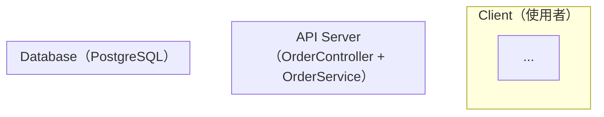

# EDD 生成規則

## Iron Rule: 累積上游讀取

每份文件生成時，必須讀取所有上游文件（累積，非僅直接父文件）。
若某上游文件不存在，靜默跳過；不得因上游缺失而降低覆蓋深度。
docs/req/* 中的所有素材（由 IDEA.md 定義）也必須全部關聯讀取。

---

## 上游讀取規則

- `docs/IDEA.md`（若存在）：了解產品核心概念、解決問題、目標市場——EDD 技術選型必須服務 IDEA 的業務目標
- `docs/BRD.md`：了解業務需求、成功指標——EDD 的 SLO/SLI 設計必須對應 BRD 的業務指標
- `docs/PRD.md`：了解所有 P0/P1 功能及 AC——EDD 的資料模型、API 設計需覆蓋所有功能
- `docs/PDD.md`（若存在）：了解畫面設計、欄位定義——**EDD 的 DB Schema 必須依 PDD 畫面欄位設計**，不得新增 PDD 未定義的欄位（除非有技術必要），也不得遺漏 PDD 中的資料欄位
- `docs/VDD.md`（若存在）：了解視覺設計系統——**Design Token 命名必須與 VDD §6 保持一致**；資產格式規格（圖片壓縮比、字體格式）影響 EDD §7 SCALE 的儲存容量計算；Art Direction 影響 §9 CI/CD 的資產 Pipeline 設計

### docs/req/ 素材關聯讀取

若 `docs/IDEA.md` 存在且 Appendix C 引用了 `docs/req/` 素材，對每個存在的檔案讀取全文，結合 Appendix C「應用於」欄位標有「EDD §」的段落，作為生成 EDD 對應章節（技術架構、資料模型、安全設計）的補充依據。優先採用素材原文描述，而非 AI 推斷。若無引用，靜默跳過。

---

## 上游衝突偵測規則

讀取完所有上游文件後，掃描以下常見矛盾點：
- IDEA/BRD 描述的業務規模 vs PRD 的功能範疇（是否需要額外的擴展設計）
- PRD 的安全要求 vs 技術選型（e.g., PRD 要求 GDPR，lang_stack 是否有對應的函式庫）
- PDD 的畫面欄位 vs PRD 的 AC（是否有欄位在 PRD 中有但 PDD 未定義，或反之）

若發現矛盾，標記 `[UPSTREAM_CONFLICT]` 並依衝突解決機制處理。

---

## 章節結構（全章節）

EDD 必須涵蓋以下所有章節（對應 templates/EDD.md 結構）：

> ⚠️ 章節編號以 EDD.md 骨架為準（單一真相來源）。生成規則只描述「填什麼」，不改變章節位置。

- §0 Document Control（DOC-ID / 上游文件連結）
- §1 概述（一段話說明技術方案）
- §2 System Context（C4 Level 1 + Level 2）
- §3 Architecture Design（技術選型 / ADR / 技術棧 / Bounded Context）
- §4 Module / Component Design
- **§4.5 UML 9 大圖（強制，9 種每種至少一張）← 骨架真實位置**
- **§4.6 Domain Events（領域事件清單）← 骨架真實位置**
- §5 API Design
- §6 Data Model（ERD）
- §7 Key Sequence Flows
- §8 Error Handling & Resilience
- §9 Security Design（OWASP + STRIDE）
- §10 Observability Design（§10.1 Logging / §10.2 Metrics / §10.3 Tracing / §10.4 Alerting / §10.5 SLO/SLI / §10.6 Audit Log / §10.7 Synthetic Monitoring）
- §11 Performance Design（容量規劃 + 快取 + DB 優化）
- §12 Testing Strategy（測試分層 + Chaos Engineering）
- §13 Deployment & Operations（部署架構 + CI/CD + DR）
- §14 Risk Assessment
- §16 Implementation Plan
- §17 Open Questions
- §19 Approval Sign-off
- §20 Feature Flag Engineering
- §21 Cross-Cutting Concerns（可觀測性三支柱 + 結構化日誌 + OpenTelemetry）

---

## Key Fields

### §0 Document Control

- DOC-ID：`EDD-<PROJECT_SLUG 大寫>-<YYYYMMDD>`
- 上游 PDD：`[PDD.md](PDD.md)`（UX / Interaction Design）
- 上游 PRD：`[PRD.md](PRD.md)`

### §2 技術選型

決策輸入（按以下優先序讀取，再做 ADR）：
1. **BRD §8.3 技術約束（硬性）** — 不得違反；若需排除，必須在 ADR 中取得 BRD Owner 書面同意
2. **PRD §X 非功能需求** — 效能、可靠性、合規要求限縮選項
3. **VDD §6 Design Token 系統**（若存在）— CSS-in-JS / PostCSS / Tailwind 等影響前端框架選擇
4. **IDEA §7.2 技術生態建議** — 市場生態趨勢（軟性參考）

決策輸出（填入 EDD §3.2 ADR + §3.3 技術棧總覽）：

```
語言/框架（lang_stack）：<BRD §8.3 若有硬性約束則從該約束出發；否則依 PRD 需求推薦>
資料庫：<依需求推薦，預設 PostgreSQL>
快取：<依需求，預設 Redis>
Queue：<依需求，預設 NATS>
容器：Docker（multi-stage）+ k8s（Rancher Desktop）
```

> **lang_stack 定錨規則：** 此處決定的語言/框架組合將成為 test-plan、BDD、runbook、LOCAL_DEPLOY
> 的工具選型基準。下游 gen.md 均從 `EDD §3.3 技術棧總覽` 讀取，此處必須填入具體值，不得留 placeholder。

### §3 Clean Code 架構

**SOLID 原則對應表（必填）**

| 原則 | 本系統實作方式 |
|------|--------------|
| SRP  | 每個 Service 只負責一個業務領域 |
| OCP  | 透過 Interface 擴展，不修改現有 class |
| LSP  | 子型別必須可替換父型別 |
| ISP  | 細粒度 Interface，不強制實作不需要的方法 |
| DIP  | 高層模組依賴 Interface，不依賴具體實作 |

**分層設計（必填）**
```
Controller Layer    → HTTP/gRPC 處理，輸入驗證，不含業務邏輯
Service Layer       → 業務規則、事務邊界
Repository Layer    → DB 操作封裝，返回 Domain 物件
Infrastructure      → 外部服務（快取、Queue、第三方 API）
```

### §3.4 Bounded Context & Context Map

依 PRD 業務邊界識別 Bounded Context，生成 Mermaid 圖及 Context Map 關係表。

Context Map 關係：

| 上游 BC | 下游 BC | 整合模式 | 說明 |
|--------|--------|---------|------|
| <認證服務> | <本系統> | Conformist | 遵從認證服務的用戶模型 |

### §4 Security 設計

**OWASP Top 10 對應（每項必填具體對策）**

| # | 風險 | 本系統對策 |
|---|------|----------|
| A01 | Broken Access Control | JWT + RBAC，每個 endpoint 明確授權 |
| A02 | Cryptographic Failures | bcrypt（密碼）、AES-256（PII）、TLS everywhere |
| A03 | Injection | parameterized queries，input validation（pydantic/zod）|
| A04 | Insecure Design | threat modeling，fail-fast startup |
| A05 | Security Misconfiguration | 環境變數驗證，禁 debug mode in prod |
| A06 | Vulnerable Components | dependabot / renovate 自動掃描 |
| A07 | Auth Failures | rate limiting（10 req/min/IP on auth）|
| A08 | Data Integrity | HMAC 簽署、冪等設計 |
| A09 | Logging Failures | 結構化 log，遮罩 PII，不記錄 secret |
| A10 | SSRF | URL allowlist，禁止 server-side fetch 任意 URL |

**Secret 管理**
- 所有 KEY 存於 OS Keystore（macOS Keychain / Windows Credential Manager）
- 啟動時 fail-fast 驗證
- Log 遮罩：前 4 + 後 2 字元

### §4.5 UML 9 大圖（強制，9 種每種至少一張，缺一不可）

> **Iron Law**：EDD §4.5 是 UML 圖集的唯一放置位置（對應 EDD.md 骨架 §4.5）。
> 不得留空、不得用文字替代、設計評審前必須完成。
> gendoc-gen-diagrams 從 §4.5 提取所有圖。
> **實作完整度原則**：每張圖必須讓開發者在沒有其他文件的情況下，能夠 1:1 實作出完整系統。
> 禁止模糊標注（如「...」省略法、無型別的方法、無條件的決策點）。

**⚠️ 注意**：§4.5 = UML 圖集，§4.6 = Domain Events。兩者不同，不得混淆。

---

#### §4.5.1 Use Case Diagram（使用案例圖）

**格式**：Mermaid `flowchart TD`

**強制完整度標準**：
- 每個 Actor 用矩形節點 `[ActorName\n角色說明]`，Actor 命名來自 PRD §2 使用者角色定義，不得使用「用戶」等籠統稱呼
- 每個 Use Case 用橢圓節點 `((UC-N: UseCaseName))`，UC 編號與 PRD AC 編號對應
- 系統邊界使用 `subgraph SystemName [SystemName — BRD §1 系統名稱]`
- 每條關聯線標注關係類型：`-- 直接使用 -->` / `-- <<extend>> -->` / `-- <<include>> -->`
- 必須涵蓋 PRD 全部 P0 + P1 功能對應的 Use Case；每個 Actor 至少 2 個 Use Case
- **禁止**：省略任何 Actor、用「etc.」代替具體 Use Case、無 UC 編號

**最低張數**：1 張（涵蓋所有 Actor 和 Use Case）

---

#### §4.5.2 Class Diagram（類別圖）⭐

**格式**：Mermaid `classDiagram`，依架構層次分 3 張

**強制完整度標準（每個 class 必須全部達到）：**

**屬性（attribute）完整格式**（三者缺一不可）：
```
visibility attributeName : Type
```
- `visibility`：`+`（public）/ `-`（private）/ `#`（protected）/ `~`（package）
- 型別必須精確：`String`、`UUID`、`Integer`、`Decimal`、`Boolean`、`DateTime`、`OrderStatus`（Enum 類型直接引用 enum class 名稱）
- **禁止**：無 visibility 的裸屬性、無型別的屬性、`id: any`、`data: Object`等模糊型別

**方法（method）完整格式**（四者缺一不可）：
```
visibility methodName(param1: Type, param2: Type) ReturnType
```
- 每個參數必須有名稱和型別
- 回傳型別必須精確（void / String / Order / List~Order~ / Optional~User~ 等）
- **禁止**：無參數型別的方法、無回傳型別的方法、空方法列表、`create()` 無參數等省略法

**Stereotype（每個 class 必有）**：
`<<AggregateRoot>>`、`<<Entity>>`、`<<ValueObject>>`、`<<DomainEvent>>`、`<<Repository>>`（interface）、`<<UseCase>>`、`<<ApplicationService>>`、`<<DTO>>`、`<<Port>>`、`<<RepositoryImpl>>`、`<<Adapter>>`、`<<Controller>>`、`<<RequestDTO>>`、`<<ResponseDTO>>`、`<<enumeration>>`

**Enum 類型必須獨立定義**：
```mermaid
class OrderStatus {
    <<enumeration>>
    PENDING
    CONFIRMED
    PROCESSING
    SHIPPED
    DELIVERED
    CANCELLED
    REFUNDED
}
```
每個 Enum 值必須全部列出（禁止用「...」省略），來自 PRD AC 或 SCHEMA.md 欄位定義

**關聯線必須精確標注**（格式：`ClassA "cardinality" relationSymbol "cardinality" ClassB : roleLabel`）：
- 繼承：`ClassA <|-- ClassB`（ClassB extends ClassA）
- 介面實作：`InterfaceA <|.. ClassB`（ClassB implements InterfaceA）
- 組合：`ClassA *-- "1..*" ClassB : contains`（ClassA 生命週期包含 ClassB）
- 聚合：`ClassA o-- "0..*" ClassB : has`（ClassA 包含 ClassB，獨立生命週期）
- 關聯：`ClassA "1" --> "0..*" ClassB : roleLabel`（ClassA 使用/知道 ClassB）
- 依賴：`ClassA ..> ClassB : uses`（ClassA 方法中使用 ClassB）
- Cardinality 格式：`"1"`、`"0..1"`、`"1..*"`、`"0..*"`、`"N"`（兩端都要標）
- **禁止**：無 cardinality 的關聯線、無 role label 的模糊關聯

**分層張數（固定 3 張）**：
- **class-domain**：`<<AggregateRoot>>`、`<<Entity>>`、`<<ValueObject>>`、`<<DomainEvent>>`、`<<Repository>>`（interface 定義）
  - Domain Layer 最低規格：≥ 1 `<<AggregateRoot>>`、≥ 2 `<<Entity>>`、≥ 1 `<<Repository>>` interface
- **class-application**：`<<UseCase>>`（每個 PRD AC 對應一個）、`<<ApplicationService>>`、`<<DTO>>`、`<<Port>>`
- **class-infra-presentation**：`<<RepositoryImpl>>`、`<<Adapter>>`、`<<Controller>>`、`<<RequestDTO>>`、`<<ResponseDTO>>`

**命名對齊**：class 名稱必須與 ARCH.md §3 Domain 模型和 SCHEMA.md Table 名稱一致（不得有任何差異）

**Class Inventory 表格**（每張 classDiagram 尾部必填）：

| Class | Stereotype | Layer | src 路徑 | test 路徑 |
|-------|-----------|-------|---------|---------|
| ClassName | <<stereotype>> | Domain/Application/Infra/Presentation | src/domain/... | tests/unit/... |

---

#### §4.5.3 Object Diagram（物件圖）

**格式**：Mermaid `classDiagram`（instance 模式）

**強制完整度標準**：
- 每個 instance 用 `<<instance>>` stereotype + 具名格式：`class ordA_ord001 { <<instance>> ...}`
- **所有屬性必須填入具體範例值**（非型別定義）：
  - UUID：`"a3f8c1d2-..."`（完整或縮寫格式 `"a3f8c1d2"`）
  - String：`"Alice Wang"`（真實範例，非 `"string"`）
  - Enum：`PROCESSING`（直接寫枚舉值）
  - Decimal：`1250.00`
  - DateTime：`"2024-03-15T14:30:00Z"`
- 關聯線標注 role label：`ordA_ord001 --> usrB_usr123 : placedBy`
- **觸發條件**：§4.5.2 每個 `<<AggregateRoot>>` 必須對應至少 1 張 Object Diagram
- 每張展示一個業務代表狀態（不同狀態的 Aggregate 至少各展示一張，如 Order PENDING 一張、Order PROCESSING 一張）
- **禁止**：屬性值為型別名稱（如 `id: UUID`）、空值（如 `name: ""`）、佔位值（如 `"example"`）

---

#### §4.5.4 Sequence Diagram（循序圖）

**格式**：Mermaid `sequenceDiagram`

**強制完整度標準（每張圖每個箭頭都必須達到）：**

**呼叫箭頭格式**（四者缺一不可）：
```
Caller->>Callee: methodName(param1: Type, param2: Type)
```
- 方法名稱：精確的函式名（`createOrder`、`findByUserId`、`publish`），**禁止**用 `create`、`call`、`request` 等模糊動詞
- 參數：名稱 + 型別（`userId: UUID, items: OrderItem[]`），**禁止**空括號 `()` 或無型別 `(data)`
- 第一個從 Client 發出的箭頭格式：`Client->>Controller: POST /orders {userId, items, paymentMethod}`

**回傳箭頭格式**（二者缺一不可）：
```
Callee-->>Caller: ReturnType | HTTP StatusCode ResponseBody
```
- 服務層回傳：`return Order` / `return Optional<User>` / `throw OrderNotFoundException`
- HTTP 回傳：`201 Created {orderId, status, createdAt}` / `409 Conflict {error, conflictField}`
- **禁止**：無回傳的「成功」箭頭、`return result` 等模糊回傳

**條件分支格式**（每個條件分支都必須有）：
```
alt 具體條件描述（如：庫存 >= 請求數量）
    Caller->>Callee: methodName(params)
    Callee-->>Caller: 201 Created {orderId}
else 具體 else 條件（如：庫存不足）
    Callee-->>Caller: 422 Unprocessable {error: "INSUFFICIENT_STOCK", available: Integer}
end
```
- **禁止**：只有 Happy Path 無 alt 分支、`alt success`/`alt error` 等無具體條件描述

**必含段落**：
- 每個 Mutation 操作（POST/PATCH/PUT/DELETE）：Happy Path + 至少 3 個 Error Path（業務規則違反 + 系統故障 + 認證/授權失敗）
- 非同步操作：`par [async: 說明非同步原因]` 包裹
- 重試邏輯：`loop [retry: 最多 N 次，間隔 Xms]` 包裹
- 資料庫操作：明確標注 `DB->>DB: BEGIN TRANSACTION` / `COMMIT` / `ROLLBACK`

**參與者宣告**（每張圖頂部）：
```
participant Client as Client（前端/行動端）
participant Controller as OrderController
participant Service as OrderService
participant Repo as OrderRepository（interface）
participant DB as PostgreSQL
participant Cache as Redis（若有）
participant Queue as NATS（若有）
```

**最低張數**：≥ PRD §7 P0 User Story 中涉及狀態變更的流程數（且 ≥ 3 張），Happy Path 和 Error Path 各自獨立一張（不得合併）

**上下游一致性**：本節服務內部視角必須與 API.md §1 Client 視角邏輯一致；有差異則標記 `> ⚠️ [UPSTREAM_CONFLICT]`

---

#### §4.5.5 Communication Diagram（通訊圖）

**格式**：Mermaid `flowchart LR`

**強制完整度標準**：
- 每個節點標注元件名稱 + 技術：`OrderService\n(Node.js)`
- 每條邊標注訊息序號 + 完整訊息名稱 + 通訊協定：`"1: POST /orders\n(HTTP/REST)"` / `"3: OrderCreated{orderId}\n(NATS)"`
- 序號連續且完整反映完整的訊息交換流程（不得跳號或省略中間訊息）
- 非同步訊息用虛線邊 `-.->` + 標注 `[async]`；同步用實線 `-->`
- **觸發條件**：系統有 Message Queue / Event Bus → 必須生成（展示事件驅動的服務間訊息流）；純同步架構 → 展示主要 HTTP 呼叫協作並標注 `> 本系統為同步架構，所有通訊透過 HTTP/REST`
- **禁止**：無序號的邊、無協定的邊、省略某些訊息導致序號不連續

---

#### §4.5.6 State Machine Diagram（狀態機圖）

**格式**：Mermaid `stateDiagram-v2`

**強制完整度標準（每個轉換箭頭都必須達到）：**

**轉換格式**（三者缺一不可）：
```
StateA --> StateB : trigger [guard] / action
```
- `trigger`：精確的觸發事件名（`confirmOrder()`、`paymentCaptured`、`cancelRequested(reason)`），**禁止**用「點擊」「用戶操作」等模糊描述
- `[guard]`：觸發條件（`[balance >= amount]`、`[retries <= 3]`、`[stock > 0]`），**必須有**；若無條件可填 `[always]`
- `/ action`：狀態轉換的副作用（`/ emit OrderConfirmed`、`/ notifyUser(email)`、`/ decrementStock(quantity)`），**禁止**省略
- **禁止**：只有 trigger 無 guard 和 action 的簡化轉換

**進入/退出動作**（有業務邏輯的狀態必填）：
```
state PROCESSING {
    entry: validateInventory(), lockStock()
    exit: releaseStockLock()
}
```

**必含元素**：
- 明確的初始狀態：`[*] --> InitialState : create(params) [valid] / assignId()`
- 明確的終止狀態：`TerminalState --> [*]`（所有業務終態都要連到 `[*]`）
- 所有合法的狀態轉換路徑（正向 + 逆向，如 PROCESSING → CANCELLED）
- 狀態旁附加說明：`state PENDING : 等待用戶確認，TTL 30 分鐘`

**最低張數**：§4.5.2 Class Diagram 中含 `status: StatusEnum` 或 `state: StateEnum` 欄位的每個 Entity 各一張（≥ 1 張）

---

#### §4.5.7 Activity Diagram（活動圖）

**格式**：Mermaid `flowchart TD`

**強制完整度標準**：

**泳道（Swimlane）強制使用**：

- 每個 Actor / 系統元件必須有獨立 subgraph 泳道
- 泳道名稱標注 Actor 角色 + 負責的 class（`API Server（OrderController + OrderService）`）

**決策點格式**（必須兩個分支都有標注）：
```
{具體條件描述？}
具體條件描述？ -->|是（具體結果）| NextNode
具體條件描述？ -->|否（具體結果）| AltNode
```
- **禁止**：只有一個分支的決策點、`Yes`/`No` 等無業務語意的標注、無條件描述的菱形節點

**Fork/Join 並行路徑**（若有並行業務流程必須標注）：
- Fork：`[[ 並行開始：說明哪些步驟並行執行 ]]`
- 每個並行路徑在獨立泳道中展開
- Join：`[[ 並行結束：等待所有並行步驟完成 ]]`

**節點命名**：精確的動詞 + 受詞（`validateInventory(items)`、`chargePaymentGateway(amount, method)`），**禁止**模糊如「處理訂單」、「進行操作」

**最少 3 張**：
- 第 1 張：用戶主線操作（User-initiated，必含 ≥ 2 個決策點，覆蓋 PRD AC 正常流程）
- 第 2 張：系統內部處理流程（System-driven，必含 fork/join 並行路徑，≥ 7 個步驟）
- 第 3 張：異常/補救流程（Exception/Compensation，如退款/回滾，必含補償動作的逆向路徑）

---

#### §4.5.8 Component Diagram（元件圖）

**格式**：Mermaid `flowchart LR`（或 `graph LR`）

**強制完整度標準**：

**元件節點格式**（三者缺一不可）：
```
OrderSvc["OrderService\nNode.js 20.x / Express 4.18\nPort: 3000"]
```
- 元件名稱（業務名稱）
- 技術 + 精確版本號（`Node.js 20.x`、`Python 3.12`、`PostgreSQL 16`）
- 通訊埠或協定（`Port: 3000`、`Port: 5432`、`gRPC: 50051`）

**介面標注**（每條連線必須有）：
```
OrderSvc -->|"POST /payments\nHTTPS:443"| PaymentSvc
OrderSvc -->|"TCP:5432\nPostgreSQL Wire Protocol"| DB
OrderSvc -.->|"NATS Subject: order.created\nasync"| EventBus
```
- 同步呼叫：`-->` + 標注 `HTTP方法 /路徑\n協定:埠號`
- 非同步訊息：`-.->` + 標注 `Queue/Topic名稱\nasync`
- **禁止**：無協定標注的連線、無版本號的元件、無埠號的服務

**系統邊界**：
```
subgraph Internal["Internal Network Zone"]
  OrderSvc
  UserSvc
  DB
end
subgraph External["External Services (Third-party)"]
  PaymentGW["Stripe\nPayment Gateway API v2"]
end
```

**必含元件**：EDD §3.3 技術棧總覽中所有元件（不得遺漏），每個元件至少有 1 條連線

---

#### §4.5.9 Deployment Diagram（部署圖）

**格式**：Mermaid `flowchart TD`

**強制完整度標準**：

**節點格式**（四者缺一不可）：
```
OrderSvc["OrderService\nImage: order-service:1.2.3\nCPU: 0.5 / Mem: 512Mi\nReplicas: 2-10 (HPA)"]
```
- 服務名稱
- Docker Image + 精確版本 tag
- CPU limit / Memory limit（來自 EDD §7 k8s 資源規格）
- Replicas 配置（含 HPA 最小/最大值）

**網路區域（subgraph 必填）**：
```
subgraph Internet["Internet"]...end
subgraph DMZ["DMZ / Ingress Zone"]...end
subgraph Internal["Internal / App Zone"]...end
subgraph DataZone["Data Zone"]...end
```
- 每個 subgraph 只放屬於該網路區域的元件
- 元件不得跨區域放置

**連線格式**（每條連線必須標注）：
```
Ingress -->|"HTTPS:443\nTLS 1.3"| OrderSvc
OrderSvc -->|"TCP:5432\nPostgreSQL Wire Protocol"| PostgreSQL
OrderSvc -.->|"TCP:4222\nNATS Protocol\nasync"| NATS
```
- 協定名稱 + 埠號
- TLS/加密說明（外部連線必填）
- 同步/非同步標注

**儲存卷**（有 PersistentVolume 必標）：
```
PostgreSQL -->|"PVC: db-data\n100Gi / SSD"| Storage[("PersistentVolume\nStorageClass: local-path")]
```

**必含元素**：Ingress Controller、所有 Microservice（含版本）、所有 DB/Cache/Queue、網路區域邊界、所有外部依賴（Third-party API endpoints）

---

**UML 9 大圖生成前自我檢查**（若有任一未通過，補齊後再寫入檔案）：

- [ ] §4.5.1 Use Case：所有 PRD P0+P1 Actor 均有對應節點；所有 Use Case 有 UC 編號；關係類型已標注
- [ ] §4.5.2 Class：所有 class 有 stereotype；所有屬性有 `visibility name: Type`；所有方法有完整簽名；所有 Enum 獨立列出全部枚舉值；所有關聯線有 cardinality + role label；分 3 張（Domain/Application/Infra+Presentation）
- [ ] §4.5.3 Object：每個 `<<AggregateRoot>>` 有 ≥ 1 張 Object Diagram；所有欄位填具體業務範例值（非型別名稱）
- [ ] §4.5.4 Sequence：每個 Mutation 有獨立 Happy Path 圖 + ≥ 3 個 Error Path；每個箭頭有精確方法名 + 參數型別；回傳箭頭有型別或 HTTP 狀態碼 + 回應體結構；alt 分支有具體條件
- [ ] §4.5.5 Communication：每條邊有序號 + 訊息名 + 協定；序號連續；非同步用虛線
- [ ] §4.5.6 State Machine：每個 transition 有 trigger [guard] / action 三段；有 entry/exit 動作（有業務邏輯者）；所有終態連到 `[*]`；每個有狀態 Entity 各一張
- [ ] §4.5.7 Activity：每個決策點兩個分支都有具體標注；有泳道（subgraph）；fork/join 標注並行路徑；≥ 3 張
- [ ] §4.5.8 Component：每個節點有技術 + 版本 + 埠號；每條連線有協定 + 埠號；系統邊界用 subgraph；EDD §3.3 所有元件均已包含
- [ ] §4.5.9 Deployment：每個節點有 Image:tag + CPU/Mem limit + Replicas；有網路區域 subgraph；所有連線有協定 + 埠號；PVC 已標注
- [ ] §4.5.2 Class Inventory 表格已在每張 classDiagram 尾部填入（含 src/test 路徑）
- [ ] lang_stack 已從 `.gendoc-state.json` 讀取（非 unknown）
- [ ] 每個 `<<DomainEvent>>` class 在 §4.6 Domain Events 表中有對應行（命名和 Payload 一致）
- [ ] 所有 class 名稱與 ARCH.md §3 Domain 模型和 SCHEMA.md Table 名稱完全一致

---

### §4.6 Domain Events

依 PRD §6 User Flows 和 Status Machine 推導所有 Domain Event：

| 事件名稱 | 觸發時機 | Payload 主要欄位 | 訂閱者 | 冪等保證 |
|---------|---------|---------------|--------|---------|
| `<Entity>Created` | <Entity> 建立成功後 | `{id, created_at}` | <訂閱服務> | 是（event_id dedup）|
| `<Entity>StatusChanged` | 狀態轉換後 | `{id, old_status, new_status}` | <訂閱服務> | 是 |
| `<Entity>Deleted` | 軟刪除後 | `{id, deleted_at, deleted_by}` | <訂閱服務> | 是 |

> **對齊要求**：此表中每個事件名稱（`<Entity>Created` 等）必須在 §4.5.2 Class Diagram 中有對應的 `<<DomainEvent>>` class。若 Class Diagram 有 `<<DomainEvent>>` class，此表中必須有對應行。兩者不得出現只在其中一邊的孤立事件。

### §5 BDD 設計

依 PRD 每個 AC 規劃 Gherkin Scenario：
```gherkin
Feature: <功能名稱>
  Scenario: <成功路徑>（來自 AC 正常流程）
  Scenario: <錯誤路徑>（來自 AC 錯誤流程）
  Scenario Outline: <多組輸入>（來自 AC 邊界條件）
```

列出預計 Feature files 清單（依 PRD 功能逐一列出）。

### §5.5 資料模型

**主要 Entity 清單**

| Entity 名稱 | 主要欄位 | 說明 |
|------------|---------|------|
| `<Entity1>` | id, <欄位>, created_at, deleted_at | <業務用途說明> |
| `<Entity2>` | id, <entity1_id>(FK), <欄位> | <業務用途說明> |

**Entity 關聯**

| 來源 Entity | 關聯類型 | 目標 Entity | 說明 |
|------------|---------|------------|------|
| `<Entity1>` | 1:N | `<Entity2>` | 一個 Entity1 可有多個 Entity2 |
| `<Entity2>` | M:N | `<Entity3>` | 透過關聯表實現 |

**初步 ER 圖（Mermaid erDiagram）**：展示所有 Entity 及 NOT NULL / CHECK 約束。

> 詳細欄位定義與 CREATE TABLE SQL 見 SCHEMA.md（由 gendoc-gen-schema 產出）。

### §6 TDD 設計

**測試金字塔**

| 層次 | 比例 | 工具 | 策略 |
|------|------|------|------|
| Unit | 60% | <依語言選型> | mock 外部 I/O，測業務邏輯 |
| Integration | 30% | testcontainers | 真實 DB/Redis，不 mock |
| E2E | 10% | Playwright / k6 | 關鍵使用者流程 |

Mock 邊界：只 mock 網路 I/O、外部 API；業務邏輯、DB 查詢邏輯不 mock。

### §7 SCALE 設計

**規格推算（依 BRD 目標使用者數 / 業務量，必填具體數字）**

| 指標 | 估算值 | 推算依據 |
|------|--------|---------|
| 峰值 QPS | N req/s | 日活 N 人 × 每人 N 次/日 ÷ 86400 × 3（峰值係數）|
| 並發連線 | N | QPS × 平均回應時間 |
| 資料量/日 | N rows | 業務事件頻率估算 |
| 儲存增長/年 | N GB | 每筆估算大小 × 年資料量 |

**Load Test 門檻（k6 thresholds）**
```javascript
thresholds: {
  http_req_duration: ['p(99)<500'],   // P99 < 500ms
  http_req_failed:   ['rate<0.001'],  // Error rate < 0.1%
  http_reqs:         ['rate>N'],      // 達到目標 QPS
}
```

**k8s 資源規格**
```yaml
resources:
  requests: { cpu: "100m", memory: "128Mi" }
  limits:   { cpu: "500m", memory: "512Mi" }
hpa:
  minReplicas: 2
  maxReplicas: 10
  metrics:
    - type: Resource
      resource: { name: cpu, target: { averageUtilization: 70 } }
```

### §8 可觀測性設計

| 類型 | 工具 | 監控內容 |
|------|------|---------|
| Logging | 結構化 JSON log | 請求、錯誤、業務事件（不含 secret）|
| Metrics | Prometheus | 延遲 P50/P95/P99、錯誤率、吞吐量 |
| Tracing | OpenTelemetry | 跨服務請求追蹤 |
| Alerting | Grafana Alerting | P1 錯誤率 > 1%、延遲 > 1s |

### §8.5 Graceful Degradation Strategy

- 降級矩陣（至少 3 個依賴服務）：降級觸發條件 / 降級行為 / 恢復條件
- Bulkhead Pattern：每個依賴服務的 Thread Pool / Connection Pool 隔離配置
- Circuit Breaker 配置：錯誤閾值 / Open 持續時間 / Half-Open 測試次數

### §9 CI/CD 設計

```
GitHub Actions Pipeline：
  push/PR → main：
    lint → test（unit + integration，含 coverage 報告）
    → build Docker image（multi-stage）
    → deploy to Rancher Desktop k8s（local）
    → k6 load test（通過 §7 門檻）
    → build HTML docs → deploy GitHub Pages
```

### §9.5 Threat Model（STRIDE 分析）

| 威脅類型 | 具體威脅（依系統推斷）| 緩解控制 | 殘餘風險 |
|---------|-------------------|---------|---------|
| Spoofing（身份偽造）| JWT token 偽造、Session 劫持 | RS256 簽章 + Token Rotation | LOW |
| Tampering（竄改）| 請求參數篡改 | HTTPS/TLS 1.3 + 請求驗證 | LOW |
| Repudiation（否認）| 用戶否認曾執行操作 | 完整稽核日誌 | LOW |
| Information Disclosure（資訊洩漏）| <依系統業務推斷> | 欄位白名單 + Log 遮罩 | MEDIUM |
| Denial of Service（阻斷服務）| DDoS、爬蟲過載 | Rate Limiting + WAF | MEDIUM |
| Elevation of Privilege（權限提升）| BOLA（水平越權）| 每次 API 驗證資源歸屬 | LOW |

**P1 高風險威脅詳細說明（依系統業務判斷 1-2 個）**：
- 威脅：<最高風險的威脅>
- 攻擊向量：<具體攻擊路徑>
- 緩解：<具體的技術控制>
- 測試：<如何驗證此控制有效>

### §10 Observability Design

> **對應 EDD.md §10**（Logging / Metrics / Tracing / Alerting / SLO / Audit / Synthetic Monitoring）。
> §10 是可觀測性設計，**不是 UML 圖集**（UML 在 §4.5）。

### §10.5 SLO / SLI / Error Budget

**SLI（量測指標）**
- Availability = 成功請求 / 總請求 × 100%
- Latency P99 = API 回應時間 99th percentile
- Error Rate = 5xx 錯誤 / 總請求 × 100%

**SLO（目標）**

| SLO | 目標 | 量測窗口 | 告警（消耗 50% Error Budget 時）|
|-----|------|---------|-------------------------------|
| Availability | ≥ 99.9% | 30 天滾動 | < 99.95% |
| Latency P99 | ≤ 500ms | 7 天 | > 400ms |
| Error Rate | ≤ 0.1% | 1 小時 | > 0.05% |

**Error Budget Policy**
- 0-50% 消耗：正常開發
- 50-75%：限制高風險變更
- 75-100%：僅 hotfix
- >100%：凍結所有非 SLO 相關部署

### §10.6 Audit Log Design

必須包含事件：認證事件、所有寫入操作（who/what/when/before/after）、PII 欄位 read、權限變更。

Audit Log 格式（JSON）：
```json
{
  "event_id": "uuid（不可重複）",
  "timestamp": "ISO8601（UTC）",
  "event_type": "<entity>.<action>",
  "actor": { "user_id": "uuid", "ip_address": "IP", "user_agent": "UA" },
  "resource": { "type": "<資源類型>", "id": "uuid", "before": {}, "after": {} },
  "outcome": "SUCCESS / FAILURE"
}
```

不可篡改性：Append-only 儲存（S3 Object Lock 或 WORM），保留 7 年。

### §10.7 Synthetic Monitoring & Health Check

**Health Check Endpoints**
- `GET /health`：Liveness → `{"status":"ok"}`
- `GET /health/ready`：Readiness（含 DB/快取連線）→ `{"status":"ok","checks":{"db":"ok"}}`

**Synthetic Monitoring**：依 PRD P0 User Flow 設計合成監控腳本，每 5 分鐘執行一次關鍵路徑驗證。

### §11.2 Capacity Planning Math

必填計算公式與表格：
- 峰值 QPS 計算公式
- Pod 數公式（Pod = QPS × avg_latency_s / req_per_pod）
- DB 連線池計算（pool_size = pods × connections_per_pod）
- 環境成本估算表（Dev / Staging / Prod）
- 擴展觸發條件（CPU/Memory 閾值）

### §12.3 Chaos Engineering

前提：僅在 Staging 環境執行，Production 需 SRE Approval。最少 3 個實驗。

| 實驗名稱 | 目標 | 注入故障 | 假設（Hypothesis）|
|---------|------|---------|-----------------|
| DB 連線池耗盡 | 驗證 Circuit Breaker | 連線池設為 1 | 用戶看到 503，10s 後自動恢復 |
| 外部 API 延遲 500ms | 驗證 Timeout | 注入 500ms 延遲 | API 在 1s 內回 408 |
| Pod 隨機重啟 | 驗證 K8s 自愈 | Kill 1 of N pods | 30s 內服務恢復 |
| <依本系統特性> | <目標> | <故障注入方式> | <假設> |

### §13.2 Deployment Strategy

| 策略 | 切換方式 | Rollback 速度 | 適用場景 |
|------|---------|-------------|---------|
| Blue-Green | 瞬間 DNS/LB 切換 | < 30s | 重大版本，零停機 |
| Canary | 逐步增加流量 5%→25%→100% | 數分鐘 | 高風險功能，逐步驗證 |
| Rolling | 逐步替換 Pod | 數分鐘 | 一般版本 |

必須選定策略並說明閘門條件：
- Error Rate < <護欄閾值>%，持續 15 分鐘
- P99 < <目標>ms
- 通過 → 擴展下一階段；失敗 → 自動 Rollback

### §13.5 Disaster Recovery（DR）

| 指標 | 目標 | 量測方式 |
|------|------|---------|
| RTO（Recovery Time Objective）| ≤ 30 分鐘 | DR 演練計時 |
| RPO（Recovery Point Objective）| ≤ 5 分鐘 | 備份頻率驗證 |
| MTTR（Mean Time To Recovery）| ≤ 2 小時 | Incident 歷史分析 |

備份策略：主資料庫每小時增量 + 每日全量（保留 30 天）；Audit Log 即時串流至 S3 WORM（保留 7 年）；應用設定 Git + Vault（每次變更）。
DR 演練：每季在 Staging 執行，記錄 RTO/RPO 達成率。

### §13.6 Runbook Framework

每個 P1 告警必須有對應 Runbook，模板：
- 嚴重度 / 首次回應 SLA
- 診斷步驟（確認範圍 → 檢查 Log → 確認依賴）
- 常見原因與解法表（症狀/原因/解法）
- Escalation：15 分鐘未解通知 Engineering Manager

### §20 Feature Flag Engineering

**5 種 Flag 類型（均需評估）**

| Flag 類型 | 用途 | 命名範例 |
|----------|------|---------|
| Release | 控制新功能可見性 | `feature.new_dashboard` |
| Experiment | A/B 測試 | `exp.checkout_flow_v2` |
| Ops | 緊急關閉功能 | `ops.disable_email_notifications` |
| Permission | 權限控制 | `perm.beta_access` |
| Infrastructure | 基礎設施切換 | `infra.use_new_cache` |

命名規範：`<type>.<domain>.<feature_name>`，全小寫 + 底線。

工具選型（必須選定並說明理由）：Unleash（開源）/ LaunchDarkly（SaaS）/ Flipt（自建）

Canary Release 流程：0.1% → 1% → 10% → 50% → 100%，每階段需統計顯著性門檻（p < 0.05）。

Flag 技術債管理：
- 90 天 Zombie Flag 強制清理政策
- Flag 生命週期 Checklist（創建/啟用/全量/清除 4 階段）

緊急回滾：Flag OFF → 立即生效（不需重部署）。

### §21 Cross-Cutting Concerns

**可觀測性三支柱**
- 日誌：Loki / ELK
- 指標：Prometheus + Grafana
- 追蹤：Jaeger / OpenTelemetry

**結構化日誌（JSON Lines 格式）**
```json
{
  "timestamp": "ISO8601",
  "level": "INFO/WARN/ERROR",
  "service": "<service_name>",
  "version": "<semver>",
  "trace_id": "<trace_id>",
  "span_id": "<span_id>",
  "message": "<human readable>",
  "context": {}
}
```

PII 禁止記錄規則必須明確定義（email/phone/password 等欄位不得出現在日誌）。

**OpenTelemetry 分散式追蹤**
- span 命名慣例：`<service>.<operation>`（e.g., `user-service.create_user`）
- 業務屬性標注規範：`payment.amount`、`user.id` 等語意屬性
- W3C Trace Context 傳播

---

## Self-Check Checklist（生成前必須全部確認）

- [ ] 所有 PRD P0 功能在 EDD §3 有對應模組設計
- [ ] §7 SCALE 有具體數字（非「視情況」）
- [ ] §4.5 UML 9 大圖全部完成（§4.5.1 Use Case / §4.5.2 Class / §4.5.3 Object / §4.5.4 Sequence / §4.5.5 Communication / §4.5.6 State Machine / §4.5.7 Activity / §4.5.8 Component / §4.5.9 Deployment 每種至少一張）
- [ ] §4.5.4 Sequence 含 Happy Path + Error Path，至少 3 張各自獨立
- [ ] §4.5.2 Class 依層次分張（Domain/Application/Infrastructure 各一或 Client/Server 各一）
- [ ] §4.5.1 Use Case 含每個主要角色
- [ ] §4.5.7 Activity 至少 3 張（用戶主線 + 系統處理 + 異常/補救）
- [ ] §4.6 Domain Events 清單已完整列出（⚠️ UML 在 §4.5，Domain Events 在 §4.6，不同章節）
- [ ] §4 OWASP Top 10 每項都有具體對策
- [ ] §3.4 Bounded Context Map（若有多服務）已繪製
- [ ] §9.5 STRIDE Threat Model 所有 6 個威脅類型都有對策
- [ ] §10.5 SLO/SLI 已量化（非「視情況」）
- [ ] §10.6 Audit Log 設計已完成（含不可篡改性）
- [ ] §10.7 Health Check Endpoints 已設計
- [ ] §12.3 ≥ 3 個 Chaos Engineering 實驗已設計
- [ ] §13.2 Deployment Strategy 已選定並說明閘門條件
- [ ] §13.5 RTO/RPO 目標已明確設定
- [ ] §13.6 P1 告警的 Runbook 框架已設計
- [ ] §8.5 Graceful Degradation Strategy 已填寫（降級矩陣至少 3 個依賴服務 + Bulkhead + Circuit Breaker 配置）
- [ ] §11.2 Capacity Planning Math 已填寫（含峰值 QPS 計算公式、Pod 數公式、DB 連線池計算、環境成本估算表）
- [ ] §13.6 CI/CD Pipeline Specification 已填寫（5 階段定義 + 每階段品質閘門 + 環境矩陣 + Canary 核准流程）
- [ ] §14 Risk Assessment：技術風險與 EDD 特定風險（效能瓶頸、技術債）是否已識別？
- [ ] §16 Implementation Plan：開發里程碑與 Sprint 計畫是否已定義？
- [ ] §17 Open Questions：技術待解問題是否已列出？
- [ ] §19 Approval Sign-off：Tech Lead + Architect + PM 的簽核表是否已建立？
- [ ] §20 Feature Flag Engineering：5 種 Flag 類型（Release/Experiment/Ops/Permission/Infrastructure）是否已評估，工具選型是否已決定？
- [ ] §20 Canary Release 流程：漸進式推出比例（0.1% → 1% → 10% → 50% → 100%）+ 統計顯著性門檻是否已定義？
- [ ] §20 Flag 技術債：90 天 Zombie Flag 強制清理政策 + Flag 生命週期 Checklist 是否已包含？
- [ ] §21 可觀測性三支柱：日誌（Loki/ELK）+ 指標（Prometheus）+ 追蹤（Jaeger）均已設計？
- [ ] §21 Structured Log：JSON Lines 日誌格式（含 trace_id/span_id/service/version）已規範；PII 禁止記錄規則已明確？
- [ ] §21 OpenTelemetry：分散式追蹤 span 命名慣例 + 業務屬性標注規範已定義？
- [ ] 所有 Mermaid 圖均使用 TD 方向

若有遺漏，自行補齊後再寫入檔案。
