# EDD — Engineering Design Document (Tech Spec)
<!-- 對應學術標準：IEEE 1016 (SDD)；對應業界：Google Design Doc / Amazon Tech Spec -->
<!-- 本文件回答「怎麼實作」，上游 PRD 回答「做什麼」 -->

---

## Document Control

| 欄位 | 內容 |
|------|------|
| **DOC-ID** | EDD-{{PROJECT_CODE}}-{{YYYYMMDD}} |
| **專案名稱** | {{PROJECT_NAME}} |
| **Project Slug** | {{PROJECT_SLUG}}（小寫英數字+連字號，e.g. `payments-gateway`）|
| **GitHub Org** | {{GITHUB_ORG}}（e.g. `my-company`）|
| **GitHub Repo** | {{GITHUB_REPO}}（e.g. `payments-gateway`）|
| **文件版本** | v1.0 |
| **狀態** | DRAFT / IN_REVIEW / APPROVED |
| **作者（Tech Lead）** | {{AUTHOR}} |
| **日期** | {{DATE}} |
| **上游 PDD** | [PDD.md](PDD.md)（產品設計文件）|
| **上游 PRD** | [PRD.md](PRD.md) |
| **審閱者** | {{REVIEWER_1}}, {{REVIEWER_2}} |
| **核准者** | {{APPROVER}} |

---

## Change Log

| 版本 | 日期 | 作者 | 變更摘要 |
|------|------|------|---------|
| v1.0 | {{DATE}} | {{AUTHOR}} | 初稿 |

---

## 1. Overview & Design Goals

### 1.1 技術摘要

> 一段話說明：本文件的技術方案核心決策是什麼、為什麼這樣設計、trade-off 是什麼。

{{TECHNICAL_SUMMARY}}

### 1.2 設計原則

<!-- 列出本次設計遵守的核心原則，後續決策都以此為依據 -->

1. **{{PRINCIPLE_1}}**：{{EXPLANATION}}（e.g. Stateless — 所有服務不儲存 session，方便水平擴展）
2. **{{PRINCIPLE_2}}**：{{EXPLANATION}}（e.g. Fail Fast — 輸入驗證在最外層，不讓髒資料進核心）
3. **{{PRINCIPLE_3}}**：{{EXPLANATION}}（e.g. Idempotent — 所有寫入操作支援重試不產生副作用）

### 1.3 PRD 需求追溯
<!-- 確保所有 PRD AC 在本文件有對應的技術設計 -->

| PRD AC# | 技術實現章節 | 備註 |
|---------|------------|------|
| AC-1 | §5.1 API — POST /{{ENDPOINT}} | |
| AC-2 | §7.1 錯誤處理 — 422 驗證失敗 | |
| AC-3 | §9.1 Retry 機制 | |

---

## 2. System Context
<!-- C4 Model Level 1：系統邊界，顯示本系統與外部的關係 -->

### 2.1 系統上下文圖（C4 Level 1）

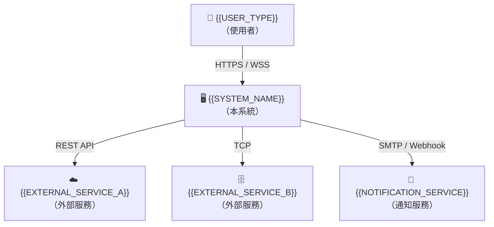

### 2.2 Container 圖（C4 Level 2）
<!-- 拆解系統內部的主要 Container（服務、資料庫、佇列） -->

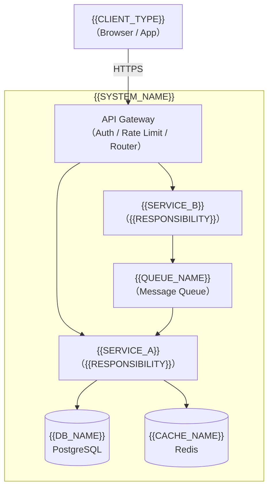

---

## 3. Architecture Design

### 3.1 架構模式

**選用模式：** {{ARCHITECTURE_PATTERN}}（e.g. Layered / Hexagonal / Event-Driven / CQRS）

**分層說明：**

```
Presentation Layer   — Controller / Handler（接收請求，驗證格式）
     ↓
Application Layer    — Use Case / Service（業務流程協調，不含業務規則）
     ↓
Domain Layer         — Entity / Domain Service（核心業務規則）
     ↓
Infrastructure Layer — Repository / Adapter（資料庫、外部 API 實作）
```

### 3.2 技術選型決策（ADR）
<!-- Architecture Decision Record：每個重要技術選型都要有理由和 trade-off -->

#### ADR-001：{{DECISION_TITLE}}

| 欄位 | 內容 |
|------|------|
| **狀態** | ACCEPTED / DEPRECATED / SUPERSEDED |
| **背景** | {{CONTEXT}} |
| **選項比較** | Option A：{{OPTION_A}}（優：... 劣：...）<br>Option B：{{OPTION_B}}（優：... 劣：...）|
| **決策** | 選用 {{CHOSEN_OPTION}} |
| **理由** | {{RATIONALE}} |
| **後果** | {{CONSEQUENCES}} |

#### ADR-002：{{DECISION_TITLE}}

（同上結構）

### 3.3 技術棧總覽
<!-- 
  本節是 RUNBOOK.md §1.1 Tech Stack Summary 的**權威來源**。
  每次技術版本升級或框架更換，必須同步更新此節與 RUNBOOK §1.1。
  新增欄位時，同步在 RUNBOOK §1.1 中新增對應列。
-->

| 層次 | 技術 | 版本 | 選型理由 |
|------|------|------|---------|
| 後端語言 | {{BACKEND_LANG}} | {{BACKEND_LANG_VERSION}} | {{REASON}}（e.g. TypeScript / Python / Go / Java / Kotlin）|
| 後端 Runtime 平台 | {{RUNTIME_PLATFORM}} | {{RUNTIME_VERSION}} | {{REASON}}（e.g. Node.js 20 LTS / JVM 21 / Python 3.12 / Go 1.22）|
| Web / API Framework | {{FRAMEWORK}} | {{FRAMEWORK_VERSION}} | {{REASON}}（e.g. Express / FastAPI / Gin / Spring Boot）|
| ORM / 資料存取層 | {{ORM}} | {{ORM_VERSION}} | {{REASON}}（e.g. Prisma / TypeORM / SQLAlchemy / GORM / Spring Data JPA）|
| 資料庫 | {{DB}} | {{DB_VERSION}} | {{REASON}}（e.g. PostgreSQL 16 / MySQL 8 / MongoDB 7）|
| 快取 | {{CACHE}} | {{CACHE_VERSION}} | {{REASON}}（e.g. Redis 7 / Memcached）|
| 訊息佇列 | {{MQ}} | {{MQ_VERSION}} | {{REASON}}（e.g. RabbitMQ 3.13 / Apache Kafka 3.7 / AWS SQS）|
| 認證 / 授權函式庫 | {{AUTH_LIB}} | {{AUTH_LIB_VERSION}} | {{REASON}}（e.g. Passport.js / Spring Security / python-jose）|
| Container Runtime | Docker | {{DOCKER_VERSION}} | 標準化部署單元 |
| 容器編排 | Kubernetes | {{K8S_VERSION}} | {{REASON}}（詳見 §3.5 部署環境規格）|
| CI/CD 平台 | {{CICD}} | - | {{REASON}}（e.g. GitHub Actions / GitLab CI / Jenkins）|
| 單元測試框架 | {{UNIT_TEST_FRAMEWORK}} | {{UNIT_TEST_VERSION}} | {{REASON}}（e.g. Jest / pytest / Go test / JUnit 5）|
| 整合 / E2E 測試框架 | {{INT_E2E_FRAMEWORK}} | {{INT_E2E_VERSION}} | {{REASON}}（e.g. Supertest / Playwright / Testcontainers）|
| 前端語言（若有）| {{FRONTEND_LANG}} | {{FRONTEND_LANG_VERSION}} | {{REASON}}（純後端 API 服務填 N/A）|
| 前端框架（若有）| {{FRONTEND_FRAMEWORK}} | {{FRONTEND_FW_VERSION}} | {{REASON}}（純後端 API 服務填 N/A）|

### 3.4 Bounded Context & Context Map（DDD）

**本系統的 Bounded Context：**

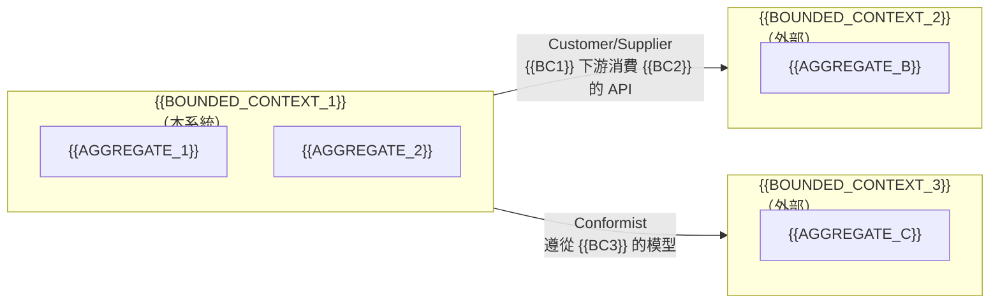

**Context Map 關係說明：**

| 上游 BC | 下游 BC | 整合模式 | 說明 |
|--------|--------|---------|------|
| {{BC_UPSTREAM}} | {{BC_DOWNSTREAM}} | Customer/Supplier | {{EXPLANATION}} |
| {{BC_1}} | {{BC_2}} | Anti-corruption Layer | {{EXPLANATION}} |

---

### 3.5 部署環境規格（Deployment Environment Matrix）
<!--
  本節是 RUNBOOK.md §1.2 Deployment Environment 的**權威來源**。
  Production 帳號、密碼、Token 不得寫入此文件；使用 Secret Manager 路徑替代。
  任何環境設定變更（cluster 升級、namespace 重命名、資源規格調整）必須同步更新此節。
-->

#### 雲端平台基礎

| 欄位 | 內容 |
|------|------|
| **雲端服務商** | {{CLOUD_PROVIDER}}（e.g. AWS / GCP / Azure / 自建機房）|
| **主要 Region** | {{PRIMARY_REGION}}（e.g. ap-northeast-1 / us-east-1）|
| **DR / Failover Region** | {{DR_REGION}}（若不適用請說明原因）|
| **K8s 託管服務** | {{K8S_SERVICE}}（e.g. Amazon EKS / GKE / AKS / 自建 kubeadm）|
| **K8s 版本** | {{K8S_VERSION}}（e.g. 1.30）|
| **Container Registry URL** | `{{REGISTRY_URL}}`（e.g. 123456789.dkr.ecr.ap-northeast-1.amazonaws.com/{{PROJECT_SLUG}}）|
| **Docker Base Image** | `{{BASE_IMAGE}}:{{BASE_IMAGE_TAG}}`（e.g. node:20-alpine / python:3.12-slim / eclipse-temurin:21-jre-alpine）|
| **Image Tag 策略** | {{IMAGE_TAG_STRATEGY}}（e.g. git-sha8 / semver / branch-sha）|
| **Secret 管理工具** | {{SECRET_MANAGER}}（e.g. AWS Secrets Manager / HashiCorp Vault / K8s Sealed Secrets）|
| **Secret 路徑前綴** | `{{SECRET_PATH_PREFIX}}`（e.g. `arn:aws:secretsmanager:ap-northeast-1:123456789:secret:{{PROJECT_SLUG}}/`）|

#### 環境矩陣
<!-- Local = 開發者本機 Rancher Desktop K8s；Development = 團隊共用遠端 dev cluster -->

| 欄位 | Local（本機）| Development | Staging | Production |
|------|------------|------------|---------|------------|
| **K8s Cluster 名稱** | `rancher-desktop` | `{{DEV_CLUSTER}}` | `{{STAGING_CLUSTER}}` | `{{PROD_CLUSTER}}` |
| **K8s Namespace** | `{{PROJECT_SLUG}}-local` | `{{DEV_NAMESPACE}}` | `{{STAGING_NAMESPACE}}` | `{{PROD_NAMESPACE}}` |
| **kubectl Context 名稱** | `rancher-desktop` | `{{DEV_K8S_CONTEXT}}` | `{{STAGING_K8S_CONTEXT}}` | `{{PROD_K8S_CONTEXT}}` |
| **API 副本數（Replicas）** | 1 | {{DEV_API_REPLICAS}} | {{STAGING_API_REPLICAS}} | {{PROD_API_REPLICAS}}（HPA min–max）|
| **Worker 副本數** | 1 | {{DEV_WORKER_REPLICAS}} | {{STAGING_WORKER_REPLICAS}} | {{PROD_WORKER_REPLICAS}}（HPA min–max）|
| **API CPU Request / Limit** | 100m / 500m | {{DEV_API_CPU_REQ}} / {{DEV_API_CPU_LIM}} | {{STG_API_CPU_REQ}} / {{STG_API_CPU_LIM}} | {{PROD_API_CPU_REQ}} / {{PROD_API_CPU_LIM}} |
| **API Memory Request / Limit** | 128Mi / 512Mi | {{DEV_API_MEM_REQ}} / {{DEV_API_MEM_LIM}} | {{STG_API_MEM_REQ}} / {{STG_API_MEM_LIM}} | {{PROD_API_MEM_REQ}} / {{PROD_API_MEM_LIM}} |
| **DB Host（Pattern）** | `postgres.{{PROJECT_SLUG}}-local.svc.cluster.local` | `{{DEV_DB_HOST}}` | `{{STAGING_DB_HOST}}` | `{{PROD_DB_HOST}}`（RDS endpoint）|
| **DB 類型 / 規格** | K8s StatefulSet（本機）| {{DEV_DB_TYPE}} | {{STG_DB_TYPE}} | {{PROD_DB_TYPE}}（e.g. RDS Multi-AZ）|
| **Redis Host（Pattern）** | `redis.{{PROJECT_SLUG}}-local.svc.cluster.local` | `{{DEV_REDIS_HOST}}` | `{{STAGING_REDIS_HOST}}` | `{{PROD_REDIS_HOST}}`（ElastiCache）|
| **Config / Secret 路徑** | `k8s/overlays/local/secrets.env`（本機，不提交）| `{{DEV_SECRET_PATH}}` | `{{STAGING_SECRET_PATH}}` | `{{PROD_SECRET_PATH}}` |
| **部署方式** | `kubectl apply -k k8s/overlays/local/` | {{DEV_DEPLOY_METHOD}} | {{STAGING_DEPLOY_METHOD}} | {{PROD_DEPLOY_METHOD}}（e.g. Canary via GitOps）|
| **Image 來源** | `nerdctl build`（本機，`imagePullPolicy: Never`）| {{DEV_IMAGE_SOURCE}} | {{STG_IMAGE_SOURCE}} | {{PROD_IMAGE_SOURCE}} |
| **存取控制** | 開發者本機，無需 VPN | 開發人員直接存取 | Dev + QA，需 VPN | SRE + 核准的 on-call，需 MFA + 稽核日誌 |

#### 服務 Port 對照表
<!--
  本節是 LOCAL_DEPLOY.md §5 / §12 和 RUNBOOK §2.3 的權威來源。
  新增服務時必須同步更新此表。
  Local 欄：port-forward 映射至開發者 localhost 的 port。
  K8s Internal 欄：Pod 實際監聽 port（ClusterIP Service targetPort）。
-->

| 服務 | K8s Internal Port | Local port-forward Port | 說明 |
|------|------------------|------------------------|------|
| api-server | `{{API_PORT}}` | `{{API_PORT}}` | REST API；`/health`、`/docs` |
| web-app（client）| `{{WEB_PORT}}` | `{{WEB_PORT}}` | 前端應用（React / Vue / Next.js 等）|
| PostgreSQL | `5432` | `{{DB_PORT}}` | 主資料庫 |
| Redis | `6379` | `{{REDIS_PORT}}` | Cache / Queue broker |
| MinIO（S3 API）| `9000` | `{{MINIO_PORT}}` | 本地 S3-compatible object storage |
| MinIO Console | `9001` | `{{MINIO_CONSOLE_PORT}}` | MinIO web UI（local 專用）|
| Mailpit（SMTP）| `1025` | `1025` | SMTP trap（local 專用）|
| Mailpit（Web UI）| `8025` | `{{MAIL_PORT}}` | Email 預覽 UI（local 專用）|
| pgadmin | `80` | `{{PGADMIN_PORT}}` | DB 瀏覽器（local 專用）|

> **注意：** 生產環境的具體帳號、密碼、API Token **不得**寫入此文件。
> 請使用 Secret Manager 路徑（如 `{{SECRET_PATH_PREFIX}}db-password`）並在實際部署時由 CD pipeline 或 init container 注入。

---

## 4. Module / Component Design
<!-- C4 Level 3：元件內部設計 -->

### 4.1 {{MODULE_NAME}}

**職責：** {{SINGLE_RESPONSIBILITY}}

**介面定義（公開方法）：**

```typescript
// 或 Python / Go 等，依專案語言
interface {{ModuleName}} {
  {{methodA}}(input: {{InputType}}): Promise<{{OutputType}}>;
  {{methodB}}(id: string): Promise<{{OutputType}} | null>;
}
```

**依賴（Dependency）：**

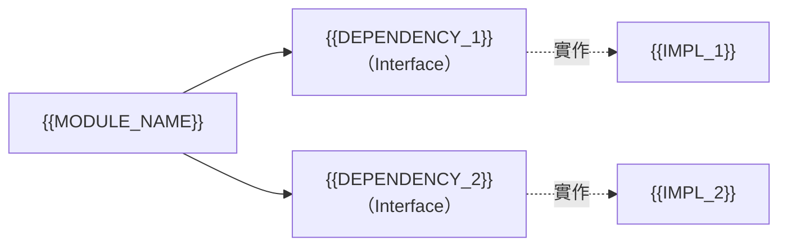

**不變量（Invariants）：**
<!-- 此模組任何時刻都必須成立的條件 -->
- {{INVARIANT_1}}（e.g. balance 永遠 ≥ 0）
- {{INVARIANT_2}}

---

### 4.2 {{MODULE_NAME_2}}

（同上結構）

---

### 4.5 UML 9 大圖（強制）/ UML 9 Diagrams (Mandatory)

> 本節是 EDD 的核心視覺語言。每份 EDD **必須**涵蓋以下九種 UML 圖，每種至少一張，缺一不可。圖示在設計評審（Design Review）前必須完成，不得留空或用 placeholder 替代。
>
> **多圖原則**：Sequence Diagram 需為每個主要業務流程（Happy Path、Error Path、管理流程等）各自獨立繪製；Class Diagram 需依架構層次分張（如 Domain/Application/Infrastructure 各一，或 Client/Server 各自獨立）；Use Case Diagram 需含每個主要 Actor 角色。判斷標準：**若單一圖無法讓工程師直接對比實作，則必須拆成多張。**

---

#### §4.5.1 Use Case Diagram 使用案例圖

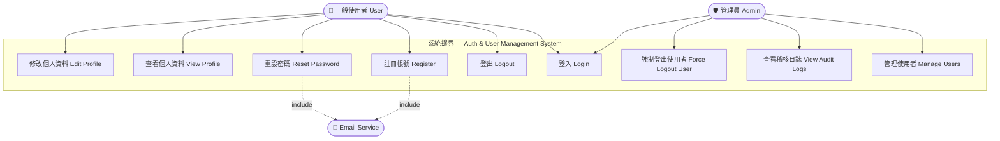

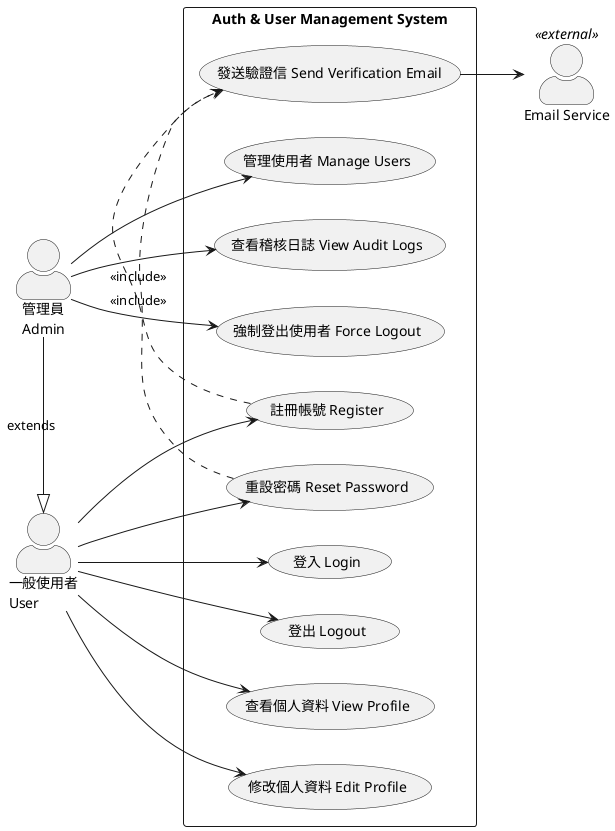

**技術說明 (Technical)：**
Use Case Diagram 定義系統的**功能邊界**（System Boundary）與**參與者**（Actors）之間的互動關係。圖中可見：一般使用者（User）可執行認證相關的基本操作（登入、登出、註冊、重設密碼）和自身資料操作；管理員（Admin）繼承使用者角色（`Admin -|> User`）並額外擁有使用者管理、稽核日誌查看等特權操作。`UC3 .> UC10 : <<include>>` 表示「註冊」強制包含「發送驗證信」子流程。Email Service 是外部 Actor，位於系統邊界之外。此圖直接對應 PRD 的 User Story 清單，設計評審時用於確認功能範疇無誤。

**白話說明 (Plain Language)：**
把這張圖想像成一份**功能菜單**。方框是廚房（系統），菜單上每一道菜是系統能做的事（Use Case）。左邊的人是點菜的客人（Actor）——一般客人只能點基本菜色，VIP 客人（管理員）可以額外點特殊料理。有些菜一定要搭配另一道才能出餐（例如點「註冊」就一定會附「發送驗證信」），這叫 include。箭頭就是「誰點了哪道菜」。讀這張圖完全不需要懂程式，只要確認：這系統能做的事，有沒有跟老闆（產品負責人）講的一樣？

---

#### §4.5.2 Class Diagram 類別圖 ⭐（最重要）

> 類別圖是 EDD 中最關鍵的圖。它是程式碼結構的唯一真相來源（Single Source of Truth），**每個 class 都必須對應一個 `src/` 實作檔案與一個 `tests/unit/` 測試檔案**。

```mermaid
classDiagram
    %% ══════════════════════════════════════════
    %% Domain Layer（核心業務規則，最穩定）
    %% ══════════════════════════════════════════

    class User {
        <<Entity>>
        +id: UserId
        +email: Email
        -passwordHash: string
        +createdAt: Date
        +status: UserStatus
        +profile: UserProfile
        +activate() void
        +deactivate() void
        +updateEmail(email: Email) void
    }

    class UserId {
        <<ValueObject>>
        -value: string
        +of(raw: string) UserId
        +toString() string
        +equals(other: UserId) boolean
    }

    class Email {
        <<ValueObject>>
        -value: string
        +of(raw: string) Email
        +toString() string
        +domain() string
    }

    class UserProfile {
        <<ValueObject>>
        +displayName: string
        +avatarUrl: string
        +timezone: string
        +withDisplayName(name: string) UserProfile
    }

    class IUserRepository {
        <<interface>>
        <<Repository>>
        +findById(id: UserId) Promise~User~
        +findByEmail(email: Email) Promise~User~
        +save(user: User) Promise~void~
        +delete(id: UserId) Promise~void~
    }

    class UserCreatedEvent {
        <<DomainEvent>>
        +userId: UserId
        +email: Email
        +occurredAt: Date
    }

    %% ══════════════════════════════════════════
    %% Application Layer（業務流程協調）
    %% ══════════════════════════════════════════

    class AuthService {
        <<UseCase>>
        -userRepo: IUserRepository
        -tokenService: ITokenService
        -eventBus: IEventBus
        +login(email: string, password: string) Promise~AuthResult~
        +logout(token: string) Promise~void~
        +refreshToken(refresh: string) Promise~AuthResult~
    }

    class RegisterUserUseCase {
        <<UseCase>>
        <<FactoryMethod>>
        -userRepo: IUserRepository
        -passwordHasher: IPasswordHasher
        -eventBus: IEventBus
        +execute(cmd: RegisterCommand) Promise~UserId~
    }

    class ITokenService {
        <<interface>>
        +generateAccessToken(user: User) string
        +generateRefreshToken(user: User) string
        +verifyAccessToken(token: string) TokenClaims
    }

    class IEventBus {
        <<interface>>
        <<Observer>>
        +publish(event: DomainEvent) Promise~void~
        +subscribe(eventType: string, handler: EventHandler) void
    }

    %% ══════════════════════════════════════════
    %% Infrastructure Layer（技術實作細節）
    %% ══════════════════════════════════════════

    class UserRepository {
        <<Repository>>
        -db: DatabaseConnection
        +findById(id: UserId) Promise~User~
        +findByEmail(email: Email) Promise~User~
        +save(user: User) Promise~void~
        +delete(id: UserId) Promise~void~
    }

    class JwtTokenService {
        -secretKey: string
        -algorithm: string
        +generateAccessToken(user: User) string
        +generateRefreshToken(user: User) string
        +verifyAccessToken(token: string) TokenClaims
    }

    %% ══════════════════════════════════════════
    %% Presentation Layer（接收請求、驗證格式）
    %% ══════════════════════════════════════════

    class AuthController {
        <<Controller>>
        -authService: AuthService
        +postLogin(req: LoginRequest) Promise~LoginResponse~
        +postLogout(req: Request) Promise~void~
        +postRefresh(req: RefreshRequest) Promise~AuthResult~
    }

    class LoginRequest {
        <<DTO>>
        +email: string
        +password: string
    }

    class LoginResponse {
        <<DTO>>
        +accessToken: string
        +refreshToken: string
        +expiresIn: number
    }

    %% ══════════════════════════════════════════
    %% Relationships（六種關係全部出現）
    %% ══════════════════════════════════════════

    %% Composition（組合）：User 包含 UserProfile，User 消亡 UserProfile 也消亡
    User *-- UserProfile : profile

    %% Aggregation（聚合）：User 持有 UserId/Email，但 ValueObject 可獨立存在
    User o-- UserId : id
    User o-- Email : email

    %% Realization（實現）：UserRepository 實現 IUserRepository 介面
    IUserRepository <|.. UserRepository : implements

    %% Realization（實現）：JwtTokenService 實現 ITokenService 介面
    ITokenService <|.. JwtTokenService : implements

    %% Inheritance（繼承）：（示範：若有 AdminUser 繼承 User）
    %% User <|-- AdminUser

    %% Association（關聯）：AuthService 使用 IUserRepository（弱關聯）
    AuthService --> IUserRepository : uses
    AuthService --> ITokenService : uses
    AuthService --> IEventBus : uses

    %% Association：RegisterUserUseCase 使用 IUserRepository
    RegisterUserUseCase --> IUserRepository : uses
    RegisterUserUseCase --> IEventBus : publishes

    %% Association：AuthController 依賴 AuthService
    AuthController --> AuthService : delegates to

    %% Dependency（依賴）：Controller 依賴 DTO（短暫使用）
    AuthController ..> LoginRequest : accepts
    AuthController ..> LoginResponse : returns

    %% Domain Event 產生關係
    RegisterUserUseCase ..> UserCreatedEvent : creates
```

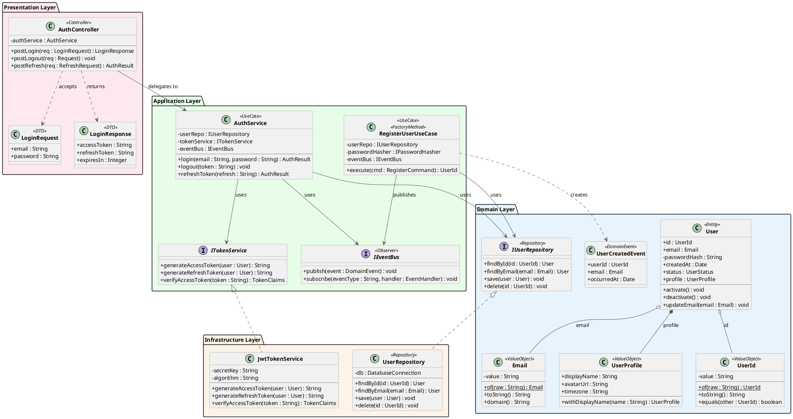

**技術說明 (Technical)：**
Class Diagram 是架構設計的核心產出物，本圖展示 **Clean Architecture** 四層結構（Presentation → Application → Domain → Infrastructure）。關鍵設計決策：
- **Value Object 不可變**：`UserId`、`Email`、`UserProfile` 均無 setter，修改只能透過工廠方法回傳新物件，確保不可變性（Immutability）。
- **依賴倒置（DIP）**：`AuthService` 依賴 `IUserRepository` 介面而非具體實作；`UserRepository`（Infrastructure）向內實現介面，實現依賴反轉，讓 Domain/Application 層不依賴技術細節。
- **FactoryMethod Pattern**：`RegisterUserUseCase` 標注 `<<FactoryMethod>>`，負責組裝 `User` 物件，集中建立邏輯。
- **Observer Pattern**：`IEventBus` 標注 `<<Observer>>`，Domain Event（`UserCreatedEvent`）發佈後由訂閱者非同步處理（Email 通知、稽核日誌等），解耦副作用。
- 六種 UML 關係全部出現：Composition（`*--`）、Aggregation（`o--`）、Realization（`<|..`）、Association（`-->`）、Dependency（`..>`）；Inheritance（`<|--`）在 Admin 擴展場景使用。

**白話說明 (Plain Language)：**
這張圖就像一張**公司組織圖**，但畫的是程式碼的結構。每個方格（class）是一個程式單元，就像公司裡的一個部門。部門之間的箭頭代表彼此的關係：
- **實線箭頭**：「我每天都在用你的服務」（強關聯）。
- **虛線箭頭**：「我只是偶爾借用你一下」（弱依賴）。
- **空心菱形**：「你是我的一部分，但你也可以獨立存在」（聚合）。
- **實心菱形**：「你完全屬於我，我不在了你也不在」（組合）。
- **空心三角形 + 虛線**：「我保證會做你說的事」（介面實現）。

最重要的設計原則是：「**核心業務規則（Domain Layer）不依賴外部技術**」。就像公司的核心策略不應該因為換了一套 ERP 軟體就整個改變。Database（Infrastructure Layer）向內服務 Domain，而不是 Domain 向外依賴 Database。

---

#### §4.5.3 Object Diagram 物件圖

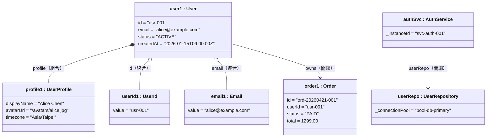

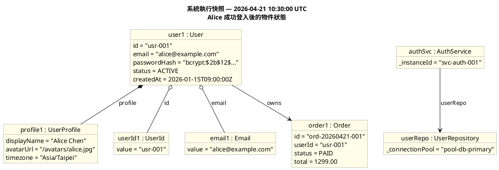

**技術說明 (Technical)：**
Object Diagram 是 Class Diagram 在**某個具體時間點**的快照（Snapshot）。圖中的每個方格代表記憶體中實際存在的物件實例（Instance），而非類型定義。本圖呈現「Alice 成功登入後」的系統狀態：`user1 : User` 是 `User` class 的一個具體實例，欄位已填入真實資料。此圖主要用途：(1) 驗證 Class Diagram 的資料建模是否符合真實場景；(2) 作為測試案例（Test Fixture）的視覺說明；(3) 協助新工程師理解物件的實際結構。

**白話說明 (Plain Language)：**
如果說類別圖（Class Diagram）是**設計圖**，那物件圖就是**施工後某一瞬間的照片**。類別圖上寫「User 有 email 欄位」，物件圖上就真的寫出「alice@example.com」這個值。這就像建築設計圖說「客廳有一張沙發」，但照片裡能看到是什麼顏色的沙發、放在哪個位置。當大家對資料長什麼樣子有疑問時，拿這張圖出來討論，比講抽象的「User 物件」清楚得多。

---

#### §4.5.4 Sequence Diagram 循序圖

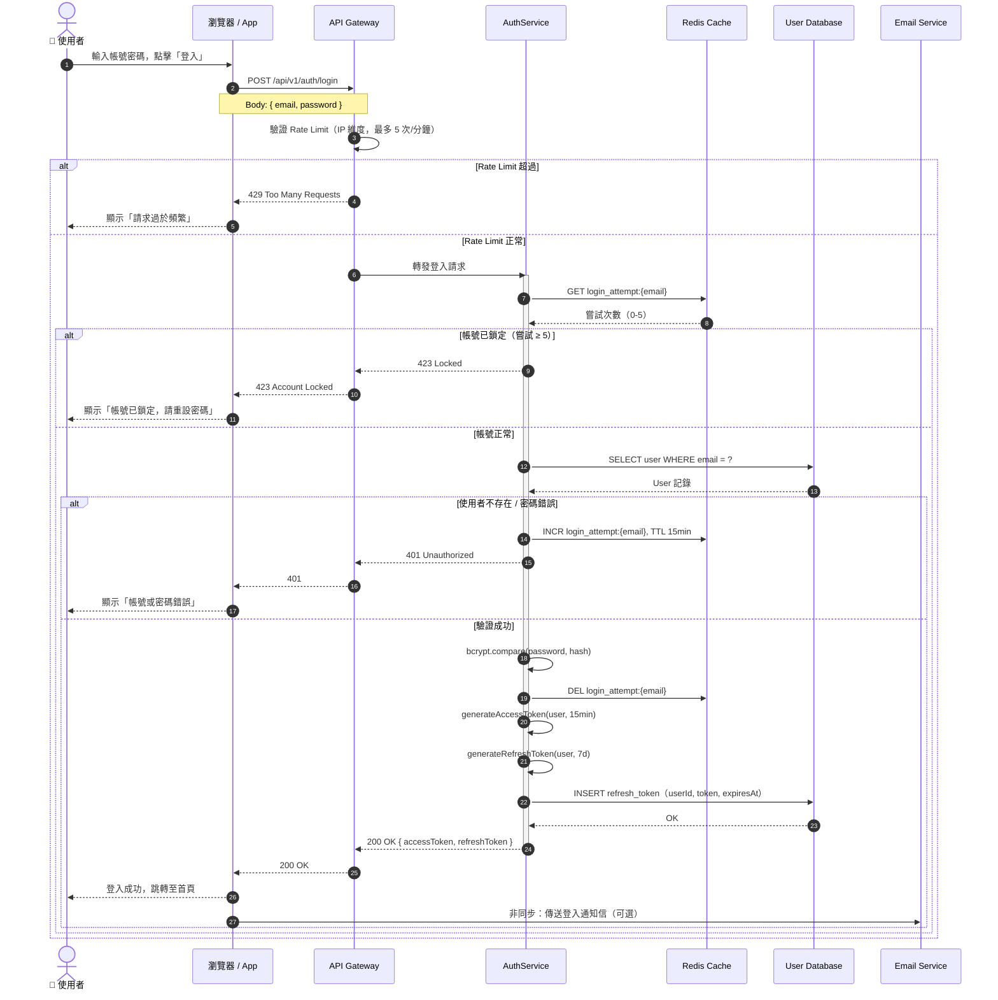

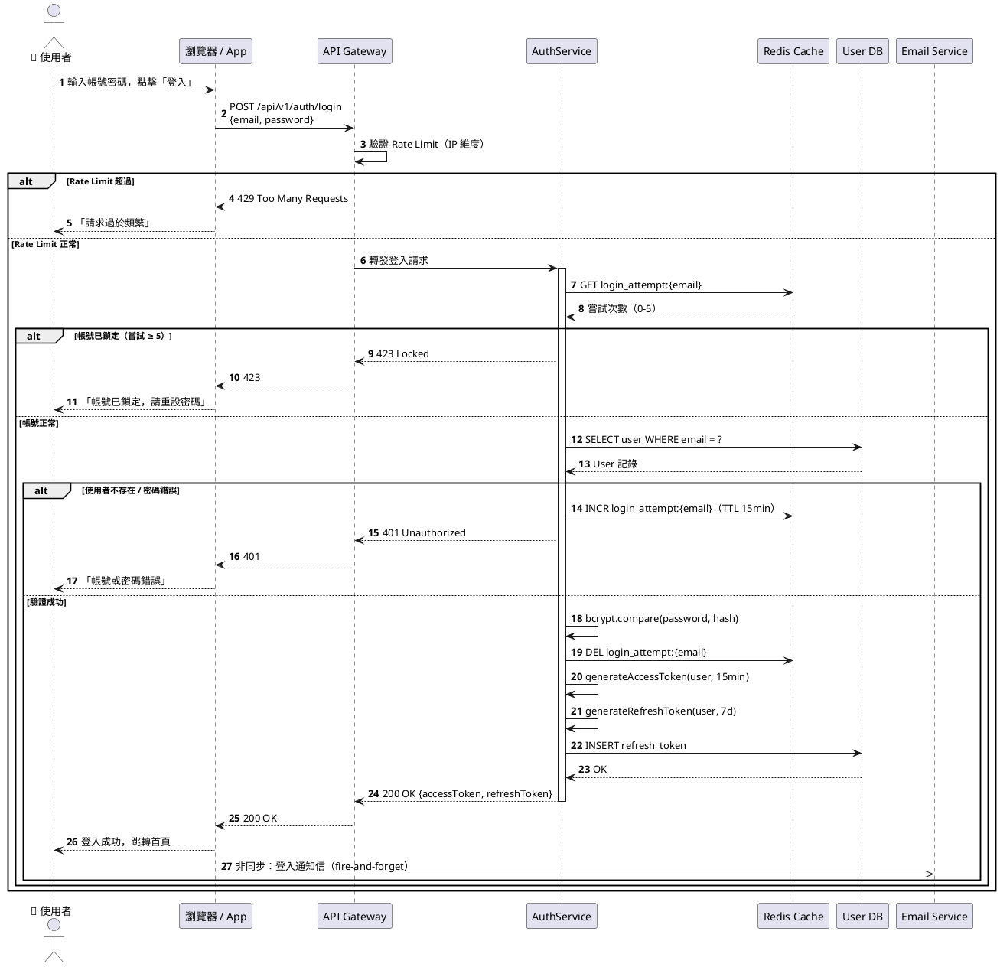

**技術說明 (Technical)：**
Sequence Diagram 展示**時間維度**上的物件互動，每條垂直線是一個參與者（Participant），橫向箭頭是訊息（Message），由上至下表示時間先後。本圖呈現登入流程的完整路徑，包含：Rate Limiting（Gateway 層）、帳號鎖定防暴力破解（Cache 層計數）、bcrypt 密碼驗證（Application 層）、Refresh Token 持久化（DB 層），以及非同步登入通知（`->>` 表示非同步，fire-and-forget）。`alt` / `else` 區塊對應程式碼中的條件分支。`activate` / `deactivate` 標示物件生命週期（Activation Bar）。

**白話說明 (Plain Language)：**
這張圖就像**電話通話紀錄**。從上到下是時間軸，每條垂直線是一個角色（使用者、閘道器、資料庫等），橫向箭頭是一通電話——誰打給誰、說了什麼。分支框（alt/else）是「如果情況 A 就這樣，情況 B 就那樣」的劇情分歧。看完這張圖，非工程師也能大概理解：我點了登入之後，後台到底打了幾通電話、誰回應了什麼。這對於溝通「為什麼登入會失敗」、「資料流向哪裡」特別有幫助。

---

#### §4.5.5 Communication Diagram 通訊圖

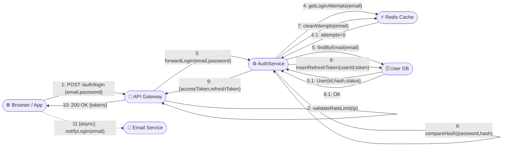

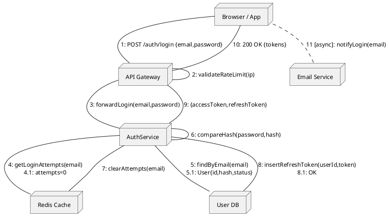

**技術說明 (Technical)：**
Communication Diagram（舊稱 Collaboration Diagram）與 Sequence Diagram 記錄的是同一個互動場景，但改以**空間拓樸**方式呈現。訊息編號（1, 2, 3...）保留時序資訊，圖的重點轉為「誰和誰之間有直接通訊路徑」。本圖可清楚看出：`Auth` 同時連接 `Cache`、`DB`、`GW` 三個元件，是通訊的核心樞紐；`Browser` 與 `Email` 之間是非同步（`async`）虛線，表示無需等待回應。此圖適合分析**元件之間的耦合度**——線越多代表耦合越緊，是重構前的分析利器。

**白話說明 (Plain Language)：**
循序圖是「時間軸視角」，通訊圖是「**地圖視角**」。想像你在追蹤快遞包裹的流向：循序圖告訴你幾點幾分包裹到哪裡，通訊圖告訴你各個站點之間的路線圖。通訊圖讓你一眼看出「AuthService 這個站點跟多少個地方直接有往來」——如果線太多，就代表這個元件太忙、承擔了太多責任，是需要拆分的信號。

---

#### §4.5.6 State Machine Diagram 狀態機圖

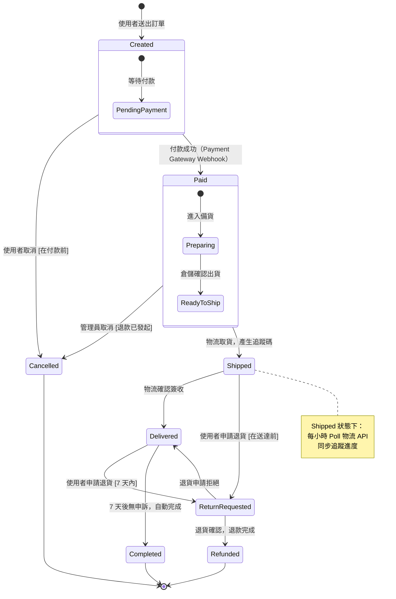

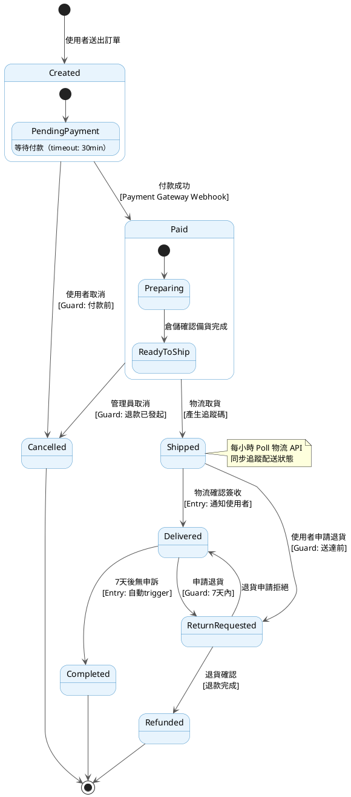

**技術說明 (Technical)：**
State Machine Diagram 定義實體（Entity）在其生命週期中可能存在的**合法狀態**（States）與**狀態轉移**（Transitions）。每條箭頭有三個元素：觸發事件（Event）、Guard 條件（方括號，如 `[7天內]`）、執行動作（Entry/Exit Action）。本圖的訂單狀態機揭示重要設計決策：(1) `Cancelled` 是終止狀態，不可從 `Shipped` 轉換（業務規則：已出貨不能直接取消，需走退貨流程）；(2) `Created` 和 `Paid` 含有複合狀態（Composite State），呈現細部子狀態；(3) `Completed` 是由系統自動觸發（非人工操作）的終止狀態。此圖直接驅動 Domain Model 的 `status` 欄位可能值與狀態轉移方法實作。

**白話說明 (Plain Language)：**
這就像**紅綠燈系統**。紅綠燈不能直接從紅燈跳到綠燈（要先經過黃燈），也不能從綠燈倒回紅燈（有固定順序）。訂單也一樣：已付款的訂單不能直接變成「取消」，必須先走「申請退貨」再退款。這張圖的作用是**防止不合理的狀態變化**。工程師看這張圖，就知道程式碼裡要寫哪些「禁止動作」的驗證。客服人員看這張圖，就知道在哪個階段客戶可以做什麼事。

---

#### §4.5.7 Activity Diagram 活動圖

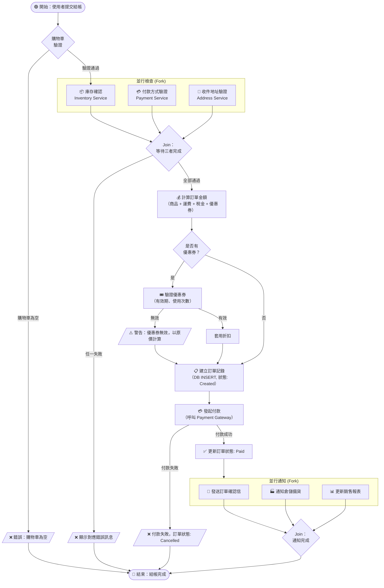

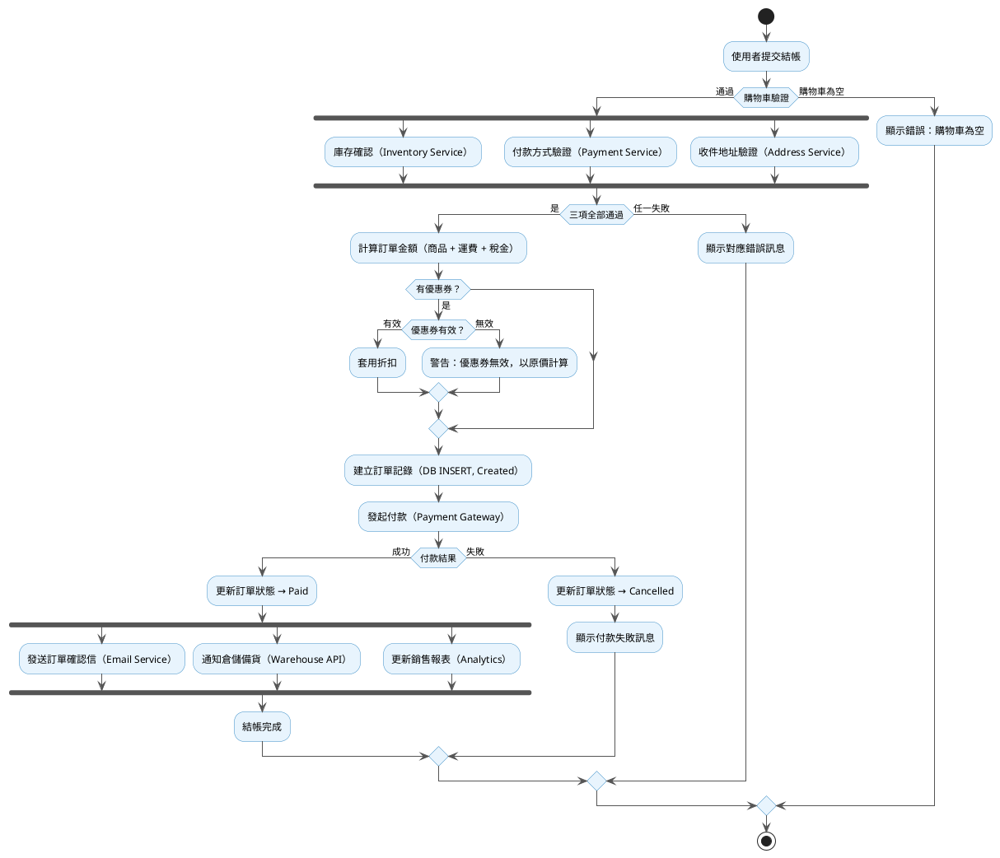

**技術說明 (Technical)：**
Activity Diagram 描述**業務流程**（Business Process）從開始到結束的控制流。本圖使用 Fork/Join（並行分支與合流）展示：(1) 庫存、付款、地址三項驗證可以**並行執行**（減少總等待時間）；(2) 訂單建立後的通知動作同樣並行發出（Email、Warehouse、Analytics），彼此互不阻塞。決策節點（菱形）對應程式碼中的 `if/else`，Fork/Join 對應 `Promise.all()` 或並行工作流。此圖是撰寫 E2E 測試案例的主要依據，每條路徑（Happy Path / Error Path）都應有對應的測試場景。

**白話說明 (Plain Language)：**
這就像一份**工作流程指南**，告訴你從頭到尾每個步驟要做什麼決定。菱形是「岔路口」，到了這裡要選擇往哪條路走。有些步驟可以同時進行（就像便利商店可以同時加熱食物、結帳、列印發票，不用一件一件排隊），這叫「並行」。圖中每一條路徑都對應一種可能發生的情況，工程師要確保每條路最終都有妥善處理——不能因為某條路走不通就讓整個程式當掉。

---

#### §4.5.8 Component Diagram 元件圖

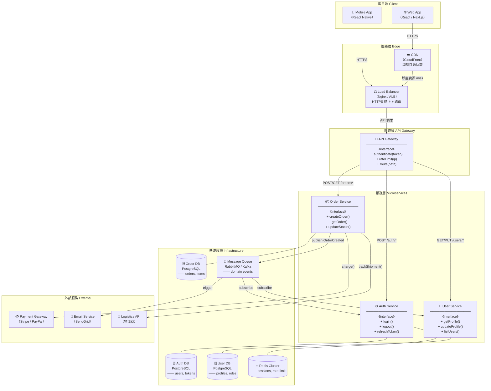

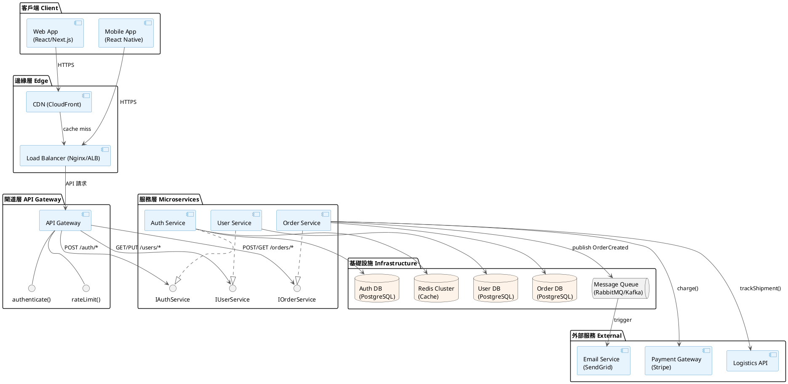

**技術說明 (Technical)：**
Component Diagram 展示系統的**物理拆分結構**（Physical Decomposition），呈現各個部署單元（Service / Container）之間的依賴關係與通訊介面。本圖揭示架構決策：(1) **API Gateway** 作為統一入口，集中處理認證、限流、路由；(2) **每個微服務擁有獨立 DB**（Database Per Service Pattern），避免資料庫層耦合；(3) 跨服務非同步通訊透過 **Message Queue**，解耦 OrderService 與 EmailService；(4) 每個 Service 透過介面（interface）對外暴露能力，API Gateway 依賴介面而非實作，遵守依賴倒置原則。

**白話說明 (Plain Language)：**
這就像家電的**接線示意圖**。每個方格是一台設備（元件），連線是電線或網路線，箭頭是訊號流向。這張圖告訴你：使用者的請求從瀏覽器出發，先到 CDN（快取靜態資源）、再到負載均衡器（分流）、再到 API 閘道（門衛）、最後才進到各個服務。每個服務旁邊都有自己的資料庫（不共用，避免爭搶）。服務之間的非同步通知走「訊息佇列」這條電話線，這樣一個服務掛掉不會影響其他服務。

---

#### §4.5.9 Deployment Diagram 部署圖

```mermaid
graph TD
    subgraph UserDevices["使用者端 User Devices"]
        Browser["🌐 Browser\n（Chrome / Safari）"]
        Mobile["📱 Mobile\n（iOS / Android）"]
    end

    subgraph CDNEdge["CDN 邊緣節點 Edge PoP"]
        CDN["☁️ CloudFront / Fastly\n靜態資源 + API Cache\nGlobal PoP"]
    end

    subgraph AWSCloud["雲端平台 AWS ap-northeast-1"]
        subgraph PublicSubnet["公網子網路 Public Subnet"]
            ALB["⚖️ Application Load Balancer\nHTTPS :443 → HTTP :8080\nSSL/TLS Termination"]
        end

        subgraph K8sCluster["Kubernetes Cluster (EKS)"]
            subgraph AuthNS["Namespace: auth"]
                AuthPod1["🟢 auth-service\nPod #1\n（node: worker-01）"]
                AuthPod2["🟢 auth-service\nPod #2\n（node: worker-02）"]
            end
            subgraph UserNS["Namespace: user"]
                UserPod1["🟢 user-service\nPod #1\n（node: worker-01）"]
                UserPod2["🟢 user-service\nPod #2\n（node: worker-03）"]
            end
            subgraph OrderNS["Namespace: order"]
                OrderPod1["🟢 order-service\nPod #1\n（node: worker-02）"]
                OrderPod2["🟢 order-service\nPod #2\n（node: worker-03）"]
            end
        end

        subgraph DataTier["資料層 Data Tier（Private Subnet）"]
            RDSPrimary[("🗄️ RDS PostgreSQL\nPrimary\n（Multi-AZ）\n:5432")]
            RDSReplica[("🗄️ RDS PostgreSQL\nRead Replica\n:5432")]
            ElastiCache[("⚡ ElastiCache Redis\nCluster Mode\n:6379")]
            MSK["📨 Amazon MSK\n（Kafka）\n:9092"]
        end

        subgraph Monitoring["可觀測性 Observability"]
            Prometheus["📊 Prometheus"]
            Grafana["📈 Grafana Dashboard"]
            Jaeger["🔍 Jaeger Tracing"]
        end
    end

    subgraph ExternalSvc["外部服務 External Services"]
        Stripe["💳 Stripe API\napi.stripe.com"]
        SendGrid["📧 SendGrid\napi.sendgrid.com"]
    end

    Browser -->|"HTTPS"| CDN
    Mobile -->|"HTTPS"| CDN
    CDN -->|"Cache miss → HTTPS"| ALB
    ALB -->|"HTTP /auth/*"| AuthPod1
    ALB -->|"HTTP /auth/*"| AuthPod2
    ALB -->|"HTTP /users/*"| UserPod1
    ALB -->|"HTTP /users/*"| UserPod2
    ALB -->|"HTTP /orders/*"| OrderPod1
    ALB -->|"HTTP /orders/*"| OrderPod2

    AuthPod1 --> RDSPrimary
    AuthPod2 --> RDSPrimary
    UserPod1 --> RDSPrimary
    UserPod2 --> RDSReplica
    OrderPod1 --> RDSPrimary
    OrderPod2 --> RDSReplica

    AuthPod1 --> ElastiCache
    AuthPod2 --> ElastiCache
    OrderPod1 --> MSK
    OrderPod2 --> MSK

    AuthPod1 --> Prometheus
    UserPod1 --> Prometheus
    OrderPod1 --> Prometheus
    Prometheus --> Grafana
    AuthPod1 --> Jaeger

    OrderPod1 -->|"HTTPS"| Stripe
    MSK -->|"trigger"| SendGrid
```

```plantuml
@startuml deployment-diagram
skinparam NodeBorderColor #3A8DC7
skinparam NodeBackgroundColor #E8F4FD
skinparam DatabaseBackgroundColor #FDF3E8
skinparam ArrowColor #555555

node "使用者端" {
  node "Browser" as Browser
  node "Mobile App" as Mobile
}

node "CDN (CloudFront / Fastly)" as CDN {
  artifact "Static Assets + API Cache" as CDNArtifact
}

node "AWS ap-northeast-1" {
  node "Public Subnet" {
    node "Application Load Balancer" as ALB {
      port "HTTPS :443" as ALBPort
    }
  }

  node "EKS Kubernetes Cluster" {
    node "Namespace: auth" {
      node "worker-01" {
        component "auth-service Pod #1" as AuthPod1
      }
      node "worker-02" {
        component "auth-service Pod #2" as AuthPod2
      }
    }
    node "Namespace: user" {
      component "user-service Pod #1" as UserPod1
      component "user-service Pod #2" as UserPod2
    }
    node "Namespace: order" {
      component "order-service Pod #1" as OrderPod1
      component "order-service Pod #2" as OrderPod2
    }
  }

  node "Private Subnet (Data Tier)" {
    database "RDS PostgreSQL Primary\n(Multi-AZ)" as RDSPrimary
    database "RDS PostgreSQL\nRead Replica" as RDSReplica
    database "ElastiCache Redis\nCluster" as Redis
    queue "Amazon MSK (Kafka)" as MSK
  }

  node "Observability Stack" {
    component "Prometheus" as Prom
    component "Grafana" as Grafana
    component "Jaeger" as Jaeger
  }
}

node "External Services" {
  component "Stripe API" as Stripe
  component "SendGrid" as SendGrid
}

Browser --> CDN : HTTPS
Mobile --> CDN : HTTPS
CDN --> ALB : cache miss → HTTPS

ALBPort --> AuthPod1 : HTTP /auth/*
ALBPort --> AuthPod2 : HTTP /auth/*
ALBPort --> UserPod1 : HTTP /users/*
ALBPort --> OrderPod1 : HTTP /orders/*

AuthPod1 --> RDSPrimary
AuthPod2 --> RDSPrimary
UserPod1 --> RDSPrimary
UserPod2 --> RDSReplica
OrderPod1 --> RDSPrimary
OrderPod2 --> RDSReplica
AuthPod1 --> Redis
OrderPod1 --> MSK
MSK --> SendGrid
OrderPod1 --> Stripe : HTTPS

AuthPod1 --> Prom
UserPod1 --> Prom
OrderPod1 --> Prom
Prom --> Grafana
AuthPod1 --> Jaeger
@enduml
```

**技術說明 (Technical)：**
Deployment Diagram 描述**軟體部署在哪些硬體 / 雲端節點上**，是 DevOps 和 SRE 最常用的參考圖。本圖揭示：(1) **多可用區（Multi-AZ）**：RDS Primary 啟用 Multi-AZ，Read Replica 放置於不同 AZ，確保高可用；(2) **Kubernetes 排程策略**：不同 Pod 分散到不同 Worker Node（`node: worker-01/02/03`），避免單點故障；(3) **私有子網路隔離**：Data Tier（RDS、Redis、MSK）置於 Private Subnet，不直接暴露公網；(4) **CDN 加速**：靜態資源和可快取 API 回應由 CDN 邊緣節點服務，降低 Origin 負載。

**白話說明 (Plain Language)：**
這就像**辦公室平面圖**，但畫的是程式住在哪些機器上。每個大框是一個地點（AWS 機房、K8s 叢集、外部廠商），小格子是具體的設備或程式。箭頭是資料怎麼從一個地方流到另一個地方。這張圖讓 IT 維運人員知道：如果某台機器壞了（例如 worker-02 當機），哪些服務會受影響、備援在哪裡。它也幫助估算費用——機器越多、傳輸越多，成本就越高。

---

#### §4.5.10 UML 完整性門檻（Quality Gate）

> 在 EDD 進入 **IN_REVIEW** 狀態前，Tech Lead 必須逐項確認以下清單。有任何未勾選項目，EDD 不得進入 APPROVED 狀態。

**圖完整性檢查：**
- [ ] §4.5.1 Use Case Diagram 已完成（每個主要 Actor 角色至少一張，角色權限差異大時分張）
- [ ] §4.5.2 Class Diagram 已完成（**至少依層次分張**：Domain / Application / Infrastructure 各一，或 Client / Server 各自獨立；六種關係全部出現，每個 class 有 stereotype 標注）
- [ ] §4.5.3 Object Diagram 已完成，展示真實場景的物件快照
- [ ] §4.5.4 Sequence Diagram 已完成（**每個主要業務流程各自獨立一張**：Happy Path + 每個 Error Path + 管理/非同步流程各一；不得將多流程塞進同一張）
- [ ] §4.5.5 Communication Diagram 已完成，訊息編號對應 Sequence Diagram
- [ ] §4.5.6 State Machine Diagram 已完成，Guard 條件明確，終止狀態標注
- [ ] §4.5.7 Activity Diagram 已完成，並行分支（Fork/Join）正確配對
- [ ] §4.5.8 Component Diagram 已完成，所有服務介面（interface）明確定義
- [ ] §4.5.9 Deployment Diagram 已完成，節點對應真實雲端資源
- [ ] 所有圖的數量足以讓工程師**直接對比實作**（單圖資訊過密即拆張）

**代碼與測試追溯性檢查：**
- [ ] 類別圖中每個 class 都有對應 `src/` 實作檔案（見 §4.5.11 追溯表）
- [ ] 類別圖中每個 concrete class 都有對應 `tests/unit/` 測試檔案（interface 除外）
- [ ] 每個 Design Pattern 都有 stereotype 標注（`<<FactoryMethod>>`、`<<Observer>>` 等）和文字說明
- [ ] 每張圖都有技術說明（Technical）與白話說明（Plain Language）
- [ ] PlantUML `.puml` 原始檔已生成至 `docs/diagrams/` 目錄
- [ ] 所有圖在 `docs/diagrams/` 目錄有對應的渲染輸出（PNG / SVG）

**文件一致性檢查：**
- [ ] Class Diagram 中的 class 名稱與 §4.1/§4.2 模組名稱一致
- [ ] Sequence Diagram 中的 API 路徑與 §5 API Design 一致
- [ ] Deployment Diagram 中的服務名稱與 §2.2 Container 圖一致
- [ ] State Machine 狀態與 §6 Data Model 的 `status` enum 欄位一致

---

#### §4.5.11 Class → Implementation → Test 追溯表

> 這張表是**類別圖和程式碼之間的橋梁**。類別圖有幾個 class，`src/` 就要有幾個檔案，`tests/unit/` 也要有幾個對應的測試檔案，缺一不可。此表由 Tech Lead 在代碼審查（Code Review）時逐行核對。

| Class 名稱 | 所屬層次 | Design Pattern | src/ 實作路徑 | Unit Test 路徑 | 公開方法數 | 測試案例數 |
|-----------|--------|---------------|-------------|--------------|-----------|-----------|
| `User` | Domain | - | `src/domain/entities/User.ts` | `tests/unit/domain/User.test.ts` | 3 | 9 |
| `UserId` | Domain | Value Object | `src/domain/value-objects/UserId.ts` | `tests/unit/domain/UserId.test.ts` | 3 | 6 |
| `Email` | Domain | Value Object | `src/domain/value-objects/Email.ts` | `tests/unit/domain/Email.test.ts` | 3 | 8 |
| `UserProfile` | Domain | Value Object | `src/domain/value-objects/UserProfile.ts` | `tests/unit/domain/UserProfile.test.ts` | 2 | 4 |
| `IUserRepository` | Domain | Repository | `src/domain/repositories/IUserRepository.ts` | - (interface，無測試) | 4 | - |
| `UserCreatedEvent` | Domain | Domain Event | `src/domain/events/UserCreatedEvent.ts` | `tests/unit/domain/UserCreatedEvent.test.ts` | 0 | 2 |
| `AuthService` | Application | - | `src/application/services/AuthService.ts` | `tests/unit/application/AuthService.test.ts` | 3 | 12 |
| `RegisterUserUseCase` | Application | Factory Method | `src/application/use-cases/RegisterUserUseCase.ts` | `tests/unit/application/RegisterUserUseCase.test.ts` | 1 | 8 |
| `ITokenService` | Application | - | `src/application/interfaces/ITokenService.ts` | - (interface，無測試) | 3 | - |
| `IEventBus` | Application | Observer | `src/application/interfaces/IEventBus.ts` | - (interface，無測試) | 2 | - |
| `UserRepository` | Infrastructure | Repository | `src/infrastructure/repositories/UserRepository.ts` | `tests/unit/infrastructure/UserRepository.test.ts` | 4 | 10 |
| `JwtTokenService` | Infrastructure | - | `src/infrastructure/services/JwtTokenService.ts` | `tests/unit/infrastructure/JwtTokenService.test.ts` | 3 | 9 |
| `AuthController` | Presentation | - | `src/presentation/controllers/AuthController.ts` | `tests/unit/presentation/AuthController.test.ts` | 3 | 9 |
| `LoginRequest` | Presentation | DTO | `src/presentation/dto/LoginRequest.ts` | `tests/unit/presentation/LoginRequest.test.ts` | 0 | 3 |
| `LoginResponse` | Presentation | DTO | `src/presentation/dto/LoginResponse.ts` | - (純資料結構) | 0 | - |

**追溯表使用說明：**
- **測試案例數** = 該 class 的 unit test 檔中 `it(...)` / `test(...)` 的總數，最低標準：每個公開方法至少 3 個 test case（Happy Path + 2 個 Edge Case）。
- **interface** 類別不需要 unit test，但需要 Integration Test 透過 Mock 驗證。
- 此表應在每次 Code Review 時更新，確保表格內容與實際 `src/` 目錄一致。
- 若某 class 的 `src/` 檔案存在但追溯表中無記錄，視為**追溯性缺口**（Traceability Gap），需補填。

---

### 4.6 Domain Events（領域事件）

| 事件名稱 | 觸發時機 | Payload | 訂閱者 | 冪等保證 |
|---------|---------|---------|--------|---------|
| `{{EntityName}}Created` | {{ENTITY}} 建立成功後 | `{id, created_at, {{fields}}}` | {{SUBSCRIBERS}} | 是（event_id dedup）|
| `{{EntityName}}StatusChanged` | 狀態從 {{OLD}} 轉換至 {{NEW}} | `{id, old_status, new_status, reason}` | {{SUBSCRIBERS}} | 是 |
| `{{EntityName}}Deleted` | {{ENTITY}} 軟刪除後 | `{id, deleted_at, deleted_by}` | {{SUBSCRIBERS}} | 是 |

## 5. API Design
<!-- 詳細 API spec 見 API.md；本節描述設計決策和關鍵端點 -->

### 5.1 API 設計原則

- RESTful / GraphQL / gRPC：**{{CHOICE}}**（理由：{{REASON}}）
- 版本策略：URL 版本（`/api/v1/`）
- 認證：Bearer Token（JWT）
- 錯誤格式：RFC 7807 Problem Details

```json
{
  "type": "https://{{DOMAIN}}/errors/{{ERROR_CODE}}",
  "title": "{{HUMAN_READABLE_TITLE}}",
  "status": 422,
  "detail": "{{DETAILED_EXPLANATION}}",
  "instance": "/api/v1/{{RESOURCE}}/{{ID}}"
}
```

### 5.2 關鍵端點設計

#### POST /api/v1/{{RESOURCE}}

**用途：** {{PURPOSE}}（對應 PRD AC-{{N}}）

**Request：**
```json
{
  "{{field_1}}": "string（required, max: {{N}}）",
  "{{field_2}}": 0,
  "{{field_3}}": "{{ENUM_VALUES}}"
}
```

**Response 200：**
```json
{
  "id": "uuid",
  "{{field_1}}": "string",
  "created_at": "ISO8601",
  "status": "{{INITIAL_STATUS}}"
}
```

**Error Responses：**
| Status | Code | 情境 |
|--------|------|------|
| 400 | INVALID_REQUEST | 格式錯誤 |
| 401 | UNAUTHORIZED | Token 無效 / 過期 |
| 403 | FORBIDDEN | 無此資源權限 |
| 409 | CONFLICT | {{CONFLICT_SCENARIO}} |
| 422 | VALIDATION_FAILED | 業務規則驗證失敗 |
| 429 | RATE_LIMITED | 超過速率限制 |
| 503 | SERVICE_UNAVAILABLE | 依賴服務不可用 |

---

### 5.3 標準 Request / Response Headers

**Request Headers（客戶端必傳）：**

| Header | 必填 | 格式 | 說明 |
|--------|------|------|------|
| `Authorization` | 是 | `Bearer {{JWT}}` | 身份驗證 |
| `Idempotency-Key` | 寫入操作必傳 | UUID v4 | 確保重複請求不產生副作用，Server 保留 {{N}}s |
| `X-Request-ID` | 是 | UUID v4 | 請求追蹤 ID，會反映在 Response `X-Request-ID` 中 |
| `X-Correlation-ID` | 否 | UUID v4 | 跨系統追蹤（由 API Gateway 轉傳）|
| `Content-Type` | 是（寫入）| `application/json` | 請求體格式 |
| `Accept-Language` | 否 | BCP 47（e.g. zh-TW）| 回應語言設定 |

**Response Headers（Server 必回）：**

| Header | 值 | 說明 |
|--------|---|------|
| `X-Request-ID` | `{{UUID}}` | 回傳客戶端傳來的 Request ID |
| `X-RateLimit-Limit` | `{{N}}` | 時間窗口內允許的最大請求數 |
| `X-RateLimit-Remaining` | `{{N}}` | 剩餘可用請求數 |
| `X-RateLimit-Reset` | `{{UNIX_TIMESTAMP}}` | 速率限制重置時間 |
| `Retry-After` | `{{SECONDS}}` | 429 時，多少秒後可重試 |

### 5.4 Error Code Registry（錯誤碼清冊）

**格式：** `{{DOMAIN}}_{{ENTITY}}_{{REASON}}`（全大寫，底線分隔）

| Error Code | HTTP Status | 說明 | 用戶可見訊息 | 解決方式 |
|-----------|------------|------|------------|---------|
| `{{DOMAIN}}_NOT_FOUND` | 404 | 資源不存在 | 「找不到指定的資源」 | 確認 ID 正確 |
| `{{DOMAIN}}_ALREADY_EXISTS` | 409 | 資源已存在 | 「{{RESOURCE}} 已存在」 | 使用不同識別符 |
| `{{DOMAIN}}_INVALID_STATE` | 422 | 狀態不允許此操作 | 「目前狀態無法執行此操作」 | 確認資源狀態 |
| `AUTH_TOKEN_EXPIRED` | 401 | JWT 已過期 | 「請重新登入」 | Refresh Token |
| `AUTH_INSUFFICIENT_PERMISSION` | 403 | 權限不足 | 「您沒有執行此操作的權限」 | 聯絡管理員 |
| `RATE_LIMIT_EXCEEDED` | 429 | 超過速率限制 | 「請求過於頻繁，請稍後再試」 | Retry-After 後重試 |
| `VALIDATION_FIELD_REQUIRED` | 422 | 必填欄位缺失 | 「{{FIELD}} 為必填欄位」 | 補齊欄位 |
| `EXTERNAL_SERVICE_UNAVAILABLE` | 503 | 外部服務不可用 | 「系統暫時無法服務，請稍後」 | 稍後重試 |

---

## 6. Data Model
<!-- 詳細 Schema 見 SCHEMA.md；本節描述資料設計決策 -->

### 6.1 核心實體關係圖（ERD）

```mermaid
erDiagram
    {{ENTITY_A}} {
        uuid id PK
        string {{field_1}}
        string {{field_2}}
        timestamp created_at
        timestamp updated_at
    }

    {{ENTITY_B}} {
        uuid id PK
        uuid {{entity_a_id}} FK
        string {{field_1}}
        enum status
    }

    {{ENTITY_A}} ||--o{ {{ENTITY_B}} : "has many"
```

### 6.2 索引策略

| 表名 | 索引欄位 | 類型 | 理由 |
|------|---------|------|------|
| {{TABLE_A}} | `{{field}}` | B-tree | 主要查詢條件 |
| {{TABLE_A}} | `({{field_1}}, {{field_2}})` | Composite | 組合查詢 |
| {{TABLE_B}} | `{{field}}` | Partial（status='active'） | 只索引活躍資料 |

### 6.3 資料生命週期

| 資料類型 | 保留期限 | 歸檔策略 | 刪除策略 |
|---------|---------|---------|---------|
| {{DATA_TYPE_1}} | {{RETENTION}} | 冷儲存 | 實體刪除 |
| {{DATA_TYPE_2}} | 永久 | - | 軟刪除 |
| 稽核 Log | 7 年 | S3 Glacier | 不刪除 |

---

## 7. Key Sequence Flows

### 7.1 {{MAIN_FLOW_NAME}}（主流程）

```mermaid
sequenceDiagram
    actor User
    participant GW as API Gateway
    participant Svc as {{SERVICE_NAME}}
    participant DB as Database
    participant Cache as Redis
    participant Ext as {{EXTERNAL_SERVICE}}

    User->>GW: POST /api/v1/{{ENDPOINT}}
    GW->>GW: 驗證 JWT Token
    GW->>Svc: 轉發請求
    Svc->>Cache: 查詢快取（Cache-Aside）
    alt 快取命中
        Cache-->>Svc: 快取資料
    else 快取未命中
        Svc->>DB: SELECT ...
        DB-->>Svc: 資料
        Svc->>Cache: SET（TTL: {{TTL}}s）
    end
    Svc->>Svc: 業務邏輯處理
    Svc->>DB: INSERT / UPDATE
    Svc->>Ext: 非同步通知
    Svc-->>GW: 201 Created
    GW-->>User: 201 Created
```

### 7.2 {{ERROR_FLOW_NAME}}（錯誤流程 — 外部服務失敗）

```mermaid
sequenceDiagram
    participant Svc as {{SERVICE_NAME}}
    participant Ext as {{EXTERNAL_SERVICE}}
    participant MQ as Message Queue

    Svc->>Ext: 呼叫外部 API
    Ext-->>Svc: 503 Service Unavailable

    loop Retry（最多 3 次，指數退避）
        Svc->>Ext: 重試
        Ext-->>Svc: 503
    end

    Svc->>MQ: 放入 Dead Letter Queue
    Svc-->>Svc: 降級回應（cached / default）
    Note over Svc: 告警觸發：PagerDuty
```

---

## 8. Error Handling & Resilience

### 8.1 錯誤分類與處理策略

| 錯誤類型 | 例子 | 策略 | 用戶感知 |
|---------|------|------|---------|
| 輸入驗證 | 格式錯誤、超出範圍 | 立即拒絕 422 | 明確錯誤說明 |
| 業務規則 | 餘額不足、狀態不允許 | 拒絕 409/422 | 業務說明 |
| 外部依賴失敗 | 第三方 API timeout | Retry + Circuit Breaker | 「請稍後再試」 |
| 基礎設施失敗 | DB 連線失敗 | Failover + Alert | 503 維護頁 |
| 未預期錯誤 | NPE、OOM | 捕捉 + 記錄 + 500 | 「系統錯誤」+ 追蹤碼 |

### 8.2 Retry 策略

```
初始等待：{{INITIAL_WAIT}}ms
退避係數：2（指數退避）
最大重試次數：3
最大等待：{{MAX_WAIT}}ms
Jitter：±{{JITTER}}ms（避免 thundering herd）
```

### 8.3 Circuit Breaker

| 服務 | 失敗閾值 | 開路時間 | 半開探測 |
|------|---------|---------|---------|
| {{SERVICE_A}} | 50% in 10s | 30s | 1 req/5s |
| {{SERVICE_B}} | 5 consecutive | 60s | 1 req/10s |

### 8.4 Idempotency
<!-- 寫入操作支援重試不產生副作用 -->

**機制：** Client 提供 `Idempotency-Key` Header（UUID），Server 記錄 key + 結果，重複請求直接回傳快取結果。

**儲存：** Redis，TTL：{{IDEMPOTENCY_TTL}}s

### 8.5 Graceful Degradation Strategy（優雅降級策略）

> 當依賴服務不可用時，系統不應完全停擺，而應以降級模式繼續提供核心服務。

#### 依賴服務降級矩陣

| 依賴服務 | 故障場景 | 降級行為 | 用戶感知 | 恢復方式 |
|---------|---------|---------|---------|---------|
| Database（Primary）| 主庫不可用 | 切換至 Read Replica（只讀）→ 寫入排入 Queue | 警告「目前為唯讀模式」| 主庫恢復後自動排水 |
| Cache（Redis）| Cache 全滅 | 降級直接讀 DB，限速 {{RATE_LIMIT}} QPS | 回應較慢 | Cache 重建後自動恢復 |
| Auth Service | Token 驗證服務不可用 | 啟用 JWT 本地驗證（短效金鑰，15 min）| 無感知 | Auth 恢復後停用本地模式 |
| Search Service | 搜尋引擎不可用 | 降級至 DB LIKE 查詢（限制回傳 20 筆）| 搜尋結果減少 | Search 恢復後自動切回 |
| External API（第三方）| 第三方 API 超時 | 返回快取資料（最長 {{STALE_TTL}} 分鐘）+ 後台重試 | 顯示「資料可能不是最新」| 第三方恢復後清除 stale cache |
| {{CUSTOM_DEPENDENCY}} | {{FAILURE_SCENARIO}} | {{DEGRADATION_BEHAVIOR}} | {{USER_IMPACT}} | {{RECOVERY}} |

#### Bulkhead Pattern（艙壁隔離）

```
[用戶請求 Pool] ──┬── [核心功能執行緒池：40 threads]   ← 永不受其他服務影響
                 ├── [搜尋功能執行緒池：10 threads]
                 ├── [報表功能執行緒池：5 threads]
                 └── [背景任務執行緒池：5 threads]
```

*各池滿載時拒絕新請求並返回 503（含 Retry-After header），不影響其他池。*

#### Circuit Breaker 配置

| 服務 | 閾值（連續失敗）| 半開狀態探測 | 全開 Fallback |
|------|:-------------:|:-----------:|-------------|
| Auth Service | 5 次 / 10s | 每 30s 1 次探測 | 本地 JWT 驗證 |
| Search Service | 3 次 / 5s | 每 60s 1 次探測 | DB LIKE 查詢 |
| External API | 3 次 / 30s | 每 120s 1 次探測 | 快取資料 |

---

## 9. Security Design

### 9.1 認證與授權

**認證流程：**
```mermaid
sequenceDiagram
    Client->>AuthService: POST /auth/token（credentials）
    AuthService->>DB: 驗證 credentials
    AuthService-->>Client: JWT（access: 15min, refresh: 7d）
    Client->>API: Bearer {{JWT_TOKEN}}
    API->>API: 驗證簽章 + expiry
    API->>API: 解析 claims → 執行 RBAC
```

**RBAC 設計：**

| 角色 | 權限 |
|------|------|
| {{ROLE_ADMIN}} | 全部 CRUD |
| {{ROLE_USER}} | 讀自己的資源 / 寫自己的資源 |
| {{ROLE_READONLY}} | 只讀 |

### 9.2 輸入驗證原則

- 在 Controller 層做**格式驗證**（長度、格式、型別）
- 在 Domain 層做**業務規則驗證**
- SQL：**只使用 Parameterized Query**，禁止字串拼接
- 檔案上傳：驗證 MIME type（不信任 extension）+ 大小限制
- 輸出：所有 HTML 輸出自動 escape（XSS 防護）

### 9.3 Secrets 管理

- 所有 secret 存放於 **{{SECRET_MANAGER}}**（Vault / AWS Secrets Manager / K8s Secret）
- 禁止 hardcode 任何 secret 於程式碼或 config 檔
- 輪換策略：{{ROTATION_POLICY}}

### 9.4 敏感資料處理

| 資料 | 儲存方式 | 傳輸方式 | Log 處理 |
|------|---------|---------|---------|
| 密碼 | bcrypt hash | 不傳明文 | 不記錄 |
| {{PII_FIELD}} | AES-256 加密 | TLS 1.3 | 遮罩（***） |
| 信用卡 | 不儲存（PCI-DSS） | Tokenize | 不記錄 |

### 9.5 Threat Model（STRIDE 分析）

**分析範圍：** {{SYSTEM_BOUNDARY}}

| 威脅類型 | 全名 | 範例威脅 | 緩解控制 | 殘餘風險 |
|---------|------|---------|---------|---------|
| **S** — Spoofing | 身份偽造 | JWT token 偽造、Session 劫持 | 強簽章演算法（RS256）+ Token Rotation | LOW |
| **T** — Tampering | 竄改 | 請求參數篡改、中間人攻擊 | HTTPS/TLS 1.3 + 請求簽章 | LOW |
| **R** — Repudiation | 否認 | 用戶否認曾執行操作 | 完整稽核日誌 + 不可修改 log | LOW |
| **I** — Information Disclosure | 資訊洩漏 | API 回傳過多欄位、Log 含 PII | 欄位白名單、Log 遮罩 | MEDIUM |
| **D** — Denial of Service | 阻斷服務 | DDoS、爬蟲過載 | Rate Limiting + WAF + Circuit Breaker | MEDIUM |
| **E** — Elevation of Privilege | 權限提升 | 平行越權（BOLA）、水平越權 | 每次操作驗證資源歸屬 + RBAC | LOW |

**高風險威脅詳細分析：**

#### T-{{N}}：{{THREAT_NAME}}

| 欄位 | 內容 |
|------|------|
| **威脅描述** | {{DETAILED_DESCRIPTION}} |
| **攻擊向量** | {{ATTACK_VECTOR}} |
| **影響** | {{IMPACT}} |
| **緩解措施** | {{MITIGATION}} |
| **測試方式** | {{TEST_METHOD}} |

---

## 10. Observability Design

### 10.1 Logging

**規範：**
- 格式：結構化 JSON
- 等級：ERROR / WARN / INFO / DEBUG（生產預設 INFO）
- 必含欄位：`timestamp`, `level`, `service`, `trace_id`, `user_id`（遮罩後）, `message`

**必須記錄的事件：**
- 所有認證事件（成功 / 失敗）
- 所有寫入操作（who / what / when）
- 外部依賴呼叫（latency / status）
- 業務關鍵事件：{{BUSINESS_EVENT_1}}, {{BUSINESS_EVENT_2}}

### 10.2 Metrics

| 指標 | 類型 | 標籤 | 告警閾值 |
|------|------|------|---------|
| `{{service}}_request_duration_seconds` | Histogram | endpoint, method, status | P99 > 1s |
| `{{service}}_error_total` | Counter | error_type | Rate > 1% |
| `{{service}}_active_connections` | Gauge | - | > {{N}} |
| `{{db}}_query_duration_seconds` | Histogram | query_type | P99 > 500ms |

### 10.3 Distributed Tracing

- 工具：{{TRACING_TOOL}}（Jaeger / Zipkin / Datadog APM）
- 所有跨服務呼叫傳遞 `trace_id`（W3C TraceContext 標準）
- Sampling：生產環境 {{SAMPLING_RATE}}%

### 10.4 Alerting

| 告警 | 觸發條件 | 嚴重度 | 通知方式 | Runbook |
|------|---------|--------|---------|---------|
| 高錯誤率 | Error rate > 5% for 5min | P1 | PagerDuty | [連結] |
| 高延遲 | P99 > 2s for 10min | P2 | Slack | [連結] |
| 服務下線 | Health check fail 3x | P1 | PagerDuty | [連結] |

### 10.5 SLO / SLI / Error Budget

**SLI（Service Level Indicators — 量測什麼）：**

| SLI 名稱 | 量測方式 | 計算公式 |
|---------|---------|---------|
| Availability | 成功請求 / 總請求 | `success_requests / total_requests × 100%` |
| Latency | P99 回應時間 | `histogram_quantile(0.99, ...)` |
| Error Rate | 5xx 錯誤 / 總請求 | `5xx_errors / total_requests × 100%` |

**SLO（Service Level Objectives — 達到什麼）：**

| SLO | 目標 | 量測窗口 | 告警閾值 |
|-----|------|---------|---------|
| Availability | ≥ 99.9% | 30 天滾動窗口 | < 99.95%（燒 50% Error Budget 時）|
| Latency P99 | ≤ 500ms | 7 天 | > 400ms |
| Error Rate | ≤ 0.1% | 1 小時 | > 0.05% |

**Error Budget 計算：**

```
月允許停機時間（99.9%）= 30 × 24 × 60 × (1 - 0.999) = 43.2 分鐘

Error Budget 消耗率 = 實際錯誤 / Error Budget
若消耗率 > 1 → 停止新功能部署，全力修復穩定性
```

**Error Budget Policy：**
- 消耗 0–50%：正常開發節奏
- 消耗 50–75%：每週 SLO Review，限制高風險變更
- 消耗 75–100%：僅允許 hotfix；SRE 介入
- 超過 100%：凍結所有非 SLO 相關部署

### 10.6 Audit Log Design（稽核日誌）

**目的：** 滿足合規要求（GDPR Article 30 / SOC 2 / 內部稽核）

**Audit Log 規格：**

```json
{
  "event_id": "uuid",
  "timestamp": "ISO8601（UTC）",
  "event_type": "{{ENTITY}}.{{ACTION}}",
  "actor": {
    "user_id": "uuid",
    "user_email": "***@example.com（遮罩）",
    "ip_address": "{{IP}}",
    "user_agent": "{{UA}}"
  },
  "resource": {
    "type": "{{RESOURCE_TYPE}}",
    "id": "{{RESOURCE_ID}}",
    "before": "{{BEFORE_STATE}}",
    "after": "{{AFTER_STATE}}"
  },
  "outcome": "SUCCESS / FAILURE",
  "reason": "{{REASON_IF_FAILURE}}"
}
```

**必須稽核的事件：**

| 事件 | 事件類型 | 保留年限 |
|------|---------|---------|
| 用戶登入 / 登出 | `auth.login` / `auth.logout` | 2 年 |
| 用戶建立 / 刪除 | `user.created` / `user.deleted` | 7 年 |
| 敏感資料存取 | `{{PII_RESOURCE}}.read` | 5 年 |
| 權限變更 | `role.assigned` / `role.revoked` | 7 年 |
| 設定變更 | `config.updated` | 7 年 |

**不可篡改性保證：** Audit Log 寫入後不可修改或刪除；使用 Append-only 儲存（WORM 或 S3 Object Lock）

### 10.7 Synthetic Monitoring & Health Check

**Health Check Endpoints：**

| Endpoint | 用途 | 檢查項目 | 回應格式 |
|---------|------|---------|---------|
| `GET /health` | Liveness（存活探針）| 服務程序存活 | `{"status":"ok"}` |
| `GET /health/ready` | Readiness（就緒探針）| DB 連線、依賴服務、暖機完成 | `{"status":"ok","checks":{"db":"ok","cache":"ok"}}` |
| `GET /health/deep` | Deep Check（完整檢查）| 含外部依賴 | 僅內部網路可存取 |

**Synthetic Monitoring（模擬交易）：**

| 場景 | 執行頻率 | SLO | 告警閾值 |
|------|---------|-----|---------|
| {{CRITICAL_FLOW_1}} | 每 5 分鐘 | 成功率 ≥ 99.9% | 連續 2 次失敗 |
| {{CRITICAL_FLOW_2}} | 每 15 分鐘 | 完成時間 ≤ {{N}}s | P95 > {{N}}s |

---

## 11. Performance Design

### 11.1 容量規劃

| 指標 | 當前值 | 設計上限 | 達到上限的應對 |
|------|--------|---------|-------------|
| QPS | {{CURRENT}} | {{TARGET}} | 水平擴展 |
| 並發連線 | {{CURRENT}} | {{TARGET}} | Connection Pool |
| 資料量 | {{CURRENT}} | {{TARGET}} | 分表 / 歸檔 |

### 11.2 Capacity Planning（詳細容量規劃）

#### 負載預測模型

| 指標 | 目前（Baseline）| 6 個月 | 12 個月 | 峰值倍數 |
|------|:--------------:|:------:|:-------:|:-------:|
| DAU（日活用戶）| {{CURRENT_DAU}} | {{6M_DAU}} | {{12M_DAU}} | 3x |
| 每用戶每日請求數 | {{REQ_PER_USER}} | {{REQ_PER_USER}} | {{REQ_PER_USER}} | — |
| **峰值 QPS** | {{PEAK_QPS}} | {{6M_QPS}} | {{12M_QPS}} | — |
| 平均請求大小 | {{AVG_REQ_SIZE}} KB | — | — | — |
| 平均回應大小 | {{AVG_RESP_SIZE}} KB | — | — | — |

#### 資源規模計算公式

```
# API Server 節點數計算
每節點處理能力（QPS）= {{QPPS_PER_POD}}
目標 QPS（峰值 × 1.5 緩衝）= {{PEAK_QPS}} × 1.5 = {{TARGET_QPS}}
最少節點數 = ceil(TARGET_QPS / QPPS_PER_POD) = {{MIN_PODS}}
加上 20% 冗餘 = {{FINAL_PODS}} 個節點

# 資料庫連線池計算
每 API 節點連線數 = {{CONN_PER_POD}}
總連線數 = {{FINAL_PODS}} × {{CONN_PER_POD}} = {{TOTAL_CONNECTIONS}}
DB max_connections 設定 = {{TOTAL_CONNECTIONS}} × 1.2 = {{DB_MAX_CONN}}
→ 若超過 {{CONN_LIMIT}}，引入 PgBouncer / ProxySQL

# 儲存容量計算
每用戶資料量 = {{DATA_PER_USER}} KB
12 個月用戶數 = {{12M_DAU}} × 30（月活比例）
儲存需求 = {{STORAGE_CALC}} GB
→ 加上 3x 副本 + 2x 增長緩衝 = {{FINAL_STORAGE}} GB
```

#### 成本估算（每環境）

| 資源 | Staging（月）| Production（月）| 備註 |
|------|:-----------:|:---------------:|------|
| Compute（{{CLOUD_PROVIDER}}）| {{STAGING_COMPUTE}} USD | {{PROD_COMPUTE}} USD | {{POD_SPEC}} |
| Database | {{STAGING_DB}} USD | {{PROD_DB}} USD | {{DB_SPEC}} |
| Cache（Redis）| {{STAGING_CACHE}} USD | {{PROD_CACHE}} USD | {{CACHE_SPEC}} |
| Storage（S3/GCS）| {{STAGING_STORAGE}} USD | {{PROD_STORAGE}} USD | {{STORAGE_SPEC}} |
| Network / CDN | {{STAGING_NET}} USD | {{PROD_NET}} USD | — |
| **月總計** | **{{STAGING_TOTAL}} USD** | **{{PROD_TOTAL}} USD** | — |

*成本基於 {{CLOUD_PROVIDER}} {{REGION}} 定價，包含 1 年預留實例折扣。*

#### 擴展觸發條件（Scaling Triggers）

| 資源 | 擴展觸發閾值 | 縮減觸發閾值 | 最大值 | 行動 |
|------|:-----------:|:-----------:|:------:|------|
| API Pod | CPU > 70% 持續 3 min | CPU < 30% 持續 10 min | {{MAX_PODS}} | HPA 自動 |
| DB Read | 連線使用率 > 80% | — | — | 手動增加 Read Replica |
| Cache | Memory > 75% | — | — | 擴大 Instance 或 Shard |
| Storage | 使用率 > 80% | — | — | 擴容 + 歸檔策略評估 |

### 11.2 快取策略

| 快取對象 | 策略 | TTL | 失效方式 | 儲存 |
|---------|------|-----|---------|------|
| {{CACHEABLE_1}} | Cache-Aside | {{TTL}}s | 寫入時失效 | Redis |
| {{CACHEABLE_2}} | Write-Through | - | 同步更新 | Redis |
| {{STATIC_CONTENT}} | CDN | 24h | 版本號 | CloudFront |

### 11.3 資料庫優化

- 讀寫分離：{{YES/NO}}（Primary 寫，Replica 讀）
- 連線池：min={{MIN}}, max={{MAX}}, timeout={{TIMEOUT}}ms
- 慢查詢閾值：> {{N}}ms 記錄 + 告警
- 批次操作：超過 {{N}} 筆使用 bulk insert

---

## 12. Testing Strategy

### 12.1 測試分層

| 層次 | 工具 | 覆蓋目標 | 執行時機 |
|------|------|---------|---------|
| Unit Test | {{UNIT_FRAMEWORK}} | 業務邏輯 > 80% | Every commit |
| Integration Test | {{INT_FRAMEWORK}} + Testcontainers | 所有 DB/外部呼叫 | Every commit |
| E2E Test | {{E2E_FRAMEWORK}} | P0 User Flow | Pre-deploy |
| Performance Test | k6 / Locust | API 延遲 + 壓測 | Pre-release |
| Security Scan | SAST + DAST | 已知漏洞 | Every commit |

### 12.2 測試重點場景

- [ ] {{TEST_SCENARIO_1}}（對應 AC-{{N}}）
- [ ] {{TEST_SCENARIO_2}}（邊界值：{{BOUNDARY}}）
- [ ] {{TEST_SCENARIO_3}}（並發場景：N 個請求同時到達）
- [ ] {{TEST_SCENARIO_4}}（外部服務失敗 → Circuit Breaker 觸發）
- [ ] {{TEST_SCENARIO_5}}（資料量：{{LARGE_DATASET}} 筆）

### 12.3 Chaos Engineering（混沌工程）

**前提條件：** 僅在 Staging 環境執行，Production 需 SRE Approval

| 實驗名稱 | 目標 | 注入故障 | 假設（Hypothesis）| 執行工具 |
|---------|------|---------|-----------------|---------|
| DB 連線池耗盡 | 驗證 Circuit Breaker | 連線池設為 1 | 用戶看到 503，10s 後自動恢復 | toxiproxy |
| 外部 API 延遲 500ms | 驗證 Timeout 設定 | 注入 500ms 延遲 | API 在 1s 內回 408 | toxiproxy |
| Pod 隨機重啟 | 驗證 K8s 自愈能力 | Kill 1 of 3 pods | 30s 內恢復服務，用戶無感 | chaoskube |
| 磁碟滿載 90% | 驗證 Log 輪換 | 填充磁碟至 90% | Log 輪換觸發，服務繼續正常 | stress-ng |
| 網路分區 | 驗證服務隔離 | 切斷服務間通訊 | 每個服務降級服務，不完全失敗 | tc netem |

**實驗執行流程：**
1. 定義 Hypothesis（假設）
2. 量測基準指標（Baseline）
3. 注入故障（Fault Injection）
4. 觀察行為（Observation）
5. 停止實驗，系統恢復
6. 分析結果，若假設成立→文件化；若不成立→建立修復 Ticket

---

## 13. Deployment & Operations

### 13.1 部署架構

```mermaid
graph TB
    subgraph Production
        LB["Load Balancer<br/>（HTTPS Termination）"]
        subgraph K8s["Kubernetes Cluster"]
            Pod1["{{SERVICE_NAME}} Pod x{{N}}"]
            Pod2["{{SERVICE_NAME}} Pod x{{N}}"]
        end
        DB[("Primary DB")]
        DBR[("Replica DB")]
        Redis[("Redis Cluster")]
    end

    Internet --> LB
    LB --> Pod1
    LB --> Pod2
    Pod1 --> DB
    Pod1 --> DBR
    Pod1 --> Redis
    DB --> DBR
```

### 13.2 Deployment Strategy（部署策略）

**選用策略：** {{BLUE_GREEN / CANARY / ROLLING}}（理由：{{REASON}}）

#### 策略選項比較：

| 策略 | 切換方式 | Rollback 速度 | 資源成本 | 適用場景 |
|------|---------|-------------|---------|---------|
| Blue-Green | 瞬間流量切換（DNS / LB）| < 30 秒 | 2x 資源 | 重大版本，零停機需求 |
| Canary | 逐步增加流量比例 | 數分鐘 | +10-20% | 高風險功能，需逐步驗證 |
| Rolling | 逐步替換 Pod | 數分鐘 | 1x 資源 | 一般版本，允許短暫舊版混存 |

**本次採用：{{CHOSEN_STRATEGY}}**

```mermaid
graph LR
    subgraph "Canary Release 流程"
        A[Deploy v2 Canary 5%] --> B{觀察 Error Rate}
        B -->|正常| C[擴展至 25%]
        C --> D{觀察 SLO}
        D -->|達標| E[擴展至 100%]
        D -->|異常| F[Rollback to v1]
        B -->|異常| F
    end
```

### 13.3 Migration 策略
<!-- 資料庫 Migration 不可造成 downtime -->

**原則：** Expand-Contract（向後相容 → 雙寫過渡 → 清理舊結構）

| 步驟 | 操作 | Rollback 方式 |
|------|------|-------------|
| 1. Expand | 新增 column（可為 NULL） | DROP COLUMN |
| 2. Migrate | 回填存量資料（批次） | - |
| 3. Switch | 程式碼使用新 column | 程式碼 rollback |
| 4. Contract | 移除舊 column | 不可逆，需備份 |

### 13.4 Rollback Plan

**觸發條件：** Error rate > {{THRESHOLD}}% 持續 {{DURATION}}min

**Rollback 流程：**
1. 切換 Feature Flag（立即關閉新功能，< 30s）
2. 若有 DB Migration：執行 Rollback SQL（已測試）
3. 部署上一版本 image（< 5min）
4. 通知 On-call + Stakeholders

### 13.5 Disaster Recovery（DR）設計

**DR 目標：**

| 指標 | 目標 | 說明 |
|------|------|------|
| RTO（Recovery Time Objective）| ≤ {{N}} 分鐘 | 從災難發生到服務恢復的最長允許時間 |
| RPO（Recovery Point Objective）| ≤ {{N}} 分鐘 | 可接受的最大資料遺失時間窗口 |
| MTTR（Mean Time To Recovery）| ≤ {{N}} 小時 | 平均恢復時間目標 |

**備份策略：**

| 資料類型 | 備份頻率 | 保留期限 | 備份方式 | 備份驗證頻率 |
|---------|---------|---------|---------|------------|
| 主資料庫 | 每小時增量 + 每日全量 | 30 天 | pg_dump / RDS Snapshot | 每月一次恢復演練 |
| 稽核 Log | 即時串流 | 7 年 | S3 WORM | 每季 |
| 應用設定 | 每次變更 | 90 天 | Git + Vault | 每次部署 |

**DR 演練計畫：**
- 每季執行一次 DR 演練（Staging 環境模擬）
- 演練腳本：{{RUNBOOK_LINK}}
- 驗收標準：在 RTO 內完成恢復，資料損失不超過 RPO

### 13.6 CI/CD Pipeline Specification（CI/CD 流水線規格）

#### Pipeline 階段定義

```
[Code Push] → [CI: Build & Test] → [CD: Staging Deploy] → [Canary Gate] → [Production Deploy]
```

| 階段 | 觸發條件 | 執行步驟 | 品質閘門（Quality Gate）| 失敗行為 |
|------|---------|---------|:-----------------------:|---------|
| **CI: Build** | PR 開啟 / commit push | 1. Lint check<br>2. Unit test<br>3. Integration test<br>4. Build artifact | Coverage ≥ {{COVERAGE}}%<br>Build ≤ {{BUILD_TIME}} min | Block merge |
| **CI: Security** | PR 開啟 | 1. SAST（{{SAST_TOOL}}）<br>2. Dependency CVE scan<br>3. Secret detection | 無 HIGH/CRITICAL CVE<br>無 hardcoded secret | Block merge |
| **CD: Staging** | Merge to main | 1. Build Docker image<br>2. Push to Registry<br>3. Deploy to Staging<br>4. E2E smoke test | E2E pass rate ≥ 95%<br>Staging healthy 5 min | Rollback + alert |
| **Canary Gate** | 手動核准（或自動）| 1. 5% traffic to new version<br>2. Monitor 15 min | Error rate ≤ {{ERROR_THRESHOLD}}%<br>P95 latency ≤ {{LATENCY}}ms | 自動回滾 + PagerDuty |
| **CD: Production** | Canary pass | 1. 20% → 50% → 100% rollout<br>2. Feature flag enable<br>3. Smoke test | Production health check pass | 自動回滾 |

#### 環境矩陣

| 環境 | 用途 | 部署方式 | 資料 | 外部服務 |
|------|------|---------|------|---------|
| Local | 開發 | docker-compose | Mock / Seed | Mock |
| Staging | QA / UAT | CD 自動 | 匿名化生產資料子集 | Sandbox / Test |
| Canary | 生產前驗證 | CD 自動（5% 流量）| 真實生產資料 | 真實（只讀）|
| Production | 最終用戶 | CD（Canary 通過後）| 真實生產資料 | 真實 |

#### 核准流程（Approval Gates）

| 部署目標 | 核准人 | 核准方式 | 緊急部署（Hotfix）|
|---------|--------|---------|:----------------:|
| Staging | 自動 | — | — |
| Canary | Engineering Lead | GitHub Environment Protection | Tech Lead 單人核准 |
| Production | Engineering Lead + PM | 雙人核准 | On-call Engineer 單人核准 |

### 13.7 Runbook Framework

**每個告警必須有對應的 Runbook，格式如下：**

---

#### Runbook：{{ALERT_NAME}}

| 欄位 | 內容 |
|------|------|
| **告警來源** | {{MONITORING_TOOL}} → {{ALERT_NAME}} |
| **嚴重度** | P{{N}}（{{CRITICAL/HIGH/MEDIUM/LOW}}）|
| **首次回應時間（SLA）** | {{N}} 分鐘 |
| **On-call 聯絡人** | {{TEAM}} via PagerDuty |

**診斷步驟：**
1. 確認告警範圍：`kubectl get pods -n {{NAMESPACE}}` / 查看 Dashboard {{LINK}}
2. 檢查錯誤日誌：`kubectl logs -n {{NAMESPACE}} {{POD}} --since=5m | grep ERROR`
3. 確認資料庫連線：`psql -h {{DB_HOST}} -U {{USER}} -c "SELECT 1"`
4. 確認外部依賴：`curl -s {{EXTERNAL_HEALTH_ENDPOINT}}`

**常見原因與解法：**

| 症狀 | 可能原因 | 解法 |
|------|---------|------|
| {{SYMPTOM_1}} | {{CAUSE}} | {{FIX}} |
| {{SYMPTOM_2}} | {{CAUSE}} | {{FIX}} |

**Escalation：**
- 15 分鐘內未解：通知 {{ESCALATION_CONTACT}}
- 30 分鐘內未解：啟動 DR 流程

---

## 14. Risk Assessment

| 風險 | 可能性 | 影響 | 緩解方案 | 負責人 |
|------|--------|------|---------|--------|
| {{RISK_1}}（e.g. 外部服務 SLA 不達標） | HIGH | MEDIUM | Circuit Breaker + SLA 合約 | {{OWNER}} |
| {{RISK_2}}（e.g. 資料遷移失敗） | MEDIUM | HIGH | 分批執行 + 備份 + Dry Run | {{OWNER}} |
| {{RISK_3}}（e.g. 效能不達標） | LOW | HIGH | 壓測驗證 + 快取方案 | {{OWNER}} |

---

## 15. Technical Debt & Known Compromises

| # | 妥協內容 | 理由 | 計畫改善時間 | Ticket |
|---|---------|------|------------|--------|
| 1 | {{COMPROMISE_1}} | 時程壓力 | Q{{N}} {{YEAR}} | {{TICKET}} |
| 2 | {{COMPROMISE_2}} | 依賴限制 | TBD | {{TICKET}} |

---

## 16. Implementation Plan

### 16.1 里程碑

```mermaid
gantt
    title {{PROJECT_NAME}} 實作計畫
    dateFormat YYYY-MM-DD
    section 基礎建設
    DB Schema + Migration     :a1, {{START_DATE}}, {{DURATION}}d
    API 骨架 + Auth            :a2, after a1, {{DURATION}}d
    section 核心功能
    {{FEATURE_1}}              :b1, after a2, {{DURATION}}d
    {{FEATURE_2}}              :b2, after b1, {{DURATION}}d
    section 整合與測試
    Integration Test           :c1, after b2, {{DURATION}}d
    Performance Test           :c2, after c1, {{DURATION}}d
    section 上線
    Beta Rollout               :d1, after c2, {{DURATION}}d
    GA                         :d2, after d1, {{DURATION}}d
```

### 16.2 實作順序（依賴關係）

| 階段 | 工作項目 | 依賴 | 估算（人天）|
|------|---------|------|----------|
| A | DB Schema + Migration | - | {{N}} |
| B | Domain Model + Repository | A | {{N}} |
| C | Use Case / Service Layer | B | {{N}} |
| D | API Controller + 驗證 | C | {{N}} |
| E | 整合測試 | D | {{N}} |
| F | 效能調優 + 壓測 | E | {{N}} |

---

## 17. Open Questions

| # | 問題 | 影響 | 負責人 | 截止日 | 狀態 |
|---|------|------|--------|--------|------|
| Q1 | {{TECH_QUESTION_1}} | 架構決策 | {{OWNER}} | {{DATE}} | OPEN |
| Q2 | {{TECH_QUESTION_2}} | 效能 | {{OWNER}} | {{DATE}} | RESOLVED：{{ANSWER}} |

---

## 18. References

- PRD：[PRD.md](PRD.md)
- API Spec：[API.md](API.md)
- DB Schema：[SCHEMA.md](SCHEMA.md)
- Architecture：[ARCH.md](ARCH.md)
- 相關 RFC / ADR：{{LINKS}}
- 競品技術分析：{{LINK}}

---

## 19. Approval Sign-off

| 角色 | 姓名 | 簽核日期 | 意見 |
|------|------|---------|------|
| Tech Lead | {{NAME}} | {{DATE}} | |
| Engineering Manager | {{NAME}} | {{DATE}} | |
| Security Review | {{NAME}} | {{DATE}} | |
| SRE / Ops | {{NAME}} | {{DATE}} | |
| PM（確認技術方案滿足需求）| {{NAME}} | {{DATE}} | |

---

## 20. Feature Flag Engineering

### 20.1 功能開關策略

> **目的**：解耦部署（Deploy）與發佈（Release），實現漸進式推出（Progressive Delivery）、A/B 測試、金絲雀發佈和緊急回滾能力。

| Flag 類型 | 用途 | 範例 | 生命週期 |
|-----------|------|------|---------|
| Release Flags | 隱藏未完成功能 | `feature_new_checkout` | 短期（功能上線後移除） |
| Experiment Flags | A/B 測試 | `ab_checkout_cta_v2` | 中期（實驗結束後移除） |
| Ops Flags | 緊急開關（Circuit Breaker） | `disable_recommendation_engine` | 長期（持續維護） |
| Permission Flags | 使用者群組功能 | `beta_program_access` | 中長期 |
| Infrastructure Flags | 技術遷移開關 | `use_new_payment_gateway` | 中期（遷移完成後移除） |

### 20.2 Flag 命名規範

```
{type}_{domain}_{feature}[_{variant}]
```

| 範例 Flag 名稱 | 類型 | 說明 |
|-------------|------|------|
| `feature_auth_social_login` | Release | 社交登入功能開關 |
| `ab_checkout_button_color_v2` | Experiment | 結帳按鈕顏色 A/B 測試 |
| `ops_search_fallback_mode` | Ops | 搜尋服務降級開關 |
| `perm_enterprise_analytics` | Permission | 企業版分析功能 |

**命名禁止事項：**
- ❌ 使用個人名字（`johns_new_feature`）
- ❌ 使用日期（`feature_20260101`）
- ❌ 過於籠統（`new_feature`、`test_flag`）

### 20.3 Flag 管理工具選型

| 工具 | 定位 | 特點 | 適用場景 |
|------|------|------|---------|
| **LaunchDarkly** | 商業 SaaS | 完整 SDK、即時推送、分析 | 大型企業 |
| **Unleash** | 開源自建 | 完整功能、可自建 | 中小型團隊 |
| **Flipt** | 開源自建 | 輕量、gRPC/REST API | 微服務架構 |
| **環境變數** | 最簡單 | 無需依賴、僅支援啟動時切換 | 早期原型 |
| **資料庫 Flag 表** | 自建 | 可即時更新、可審計 | 中小型團隊簡易方案 |

**本專案選型：`{{FEATURE_FLAG_TOOL}}`**（決策依據：{{REASON}}）

### 20.4 Flag 評估邏輯設計

```typescript
// feature-flags/evaluator.ts

interface FlagContext {
  userId?: string;
  userEmail?: string;
  userGroups?: string[];
  environment: 'production' | 'staging' | 'development';
  requestId: string;
  ipAddress?: string;
  customAttributes?: Record<string, unknown>;
}

interface FlagRule {
  type: 'percentage' | 'user_list' | 'group' | 'always_on' | 'always_off';
  value: unknown;
  percentage?: number;  // 0-100
  userIds?: string[];
  groups?: string[];
}

async function evaluateFlag(flagKey: string, context: FlagContext): Promise<boolean> {
  const flag = await flagStore.get(flagKey);
  
  if (!flag || !flag.enabled) return flag?.defaultValue ?? false;
  
  for (const rule of flag.rules) {
    if (matchesRule(rule, context)) {
      return rule.serveVariant === 'on';
    }
  }
  
  return flag.defaultValue;
}
```

### 20.5 金絲雀發佈（Canary Release）流程

```mermaid
gantt
    title 功能發佈流程（Canary → Progressive → Full Release）
    dateFormat  YYYY-MM-DD
    section Canary
    內部測試 (0.1%)     :a1, 2026-01-01, 3d
    早期用戶 (1%)       :a2, after a1, 4d
    section Progressive
    Beta 群組 (10%)     :b1, after a2, 7d
    前 25% 用戶         :b2, after b1, 7d
    前 50% 用戶         :b3, after b2, 3d
    section Full Release
    全量發佈 (100%)     :c1, after b3, 1d
    清理 Flag           :c2, after c1, 3d
```

**每個階段的監控指標（進入下一階段的條件）：**
- 錯誤率 < 0.1%（當前）
- P95 延遲 ≤ 1.2× 基準值
- 業務指標（轉換率、留存率）無顯著下降（統計顯著性 p < 0.05）

### 20.6 Flag 技術債管理

```markdown
## Flag 生命週期檢查清單

Release Flags（功能完全上線後 2 週內完成）：
- [ ] Flag 已全量開啟且穩定運行 ≥ 2 週
- [ ] A/B 實驗已達統計顯著性並已決策
- [ ] 移除 Flag 的代碼變更已 PR 審查
- [ ] 所有條件分支（flag OFF 路徑）已移除
- [ ] 相關測試已更新（移除 flag 相關 mock）
- [ ] Flag 管理工具中已歸檔/刪除

未清理的 Flag 在每個 Sprint 末由 Tech Lead 審查。
超過 90 天未使用的 Flag 標記為「Zombie Flag」並在下個 Sprint 強制清理。
```

### 20.7 緊急回滾程序（Ops Flags Circuit Breaker）

```bash
# 緊急關閉功能（< 30 秒）
# 選項 A：使用 CLI（推薦）
feature-flags set ops_payment_v2 --value=off --reason="P0 incident #1234"

# 選項 B：使用 API
curl -X PATCH https://flags.internal/api/v1/flags/ops_payment_v2 \
  -H "Authorization: Bearer $ADMIN_TOKEN" \
  -d '{"enabled": false, "reason": "P0 incident #1234", "operator": "oncall@company.com"}'

# 選項 C：環境變數覆蓋（最後手段，需重啟）
export FEATURE_FLAG_OVERRIDE_ops_payment_v2=false
```

**回滾後必做：**
1. 在 Incident Tracker 記錄 Flag 名稱、關閉時間、影響範圍
2. 24 小時內完成 RCA（根本原因分析）
3. 問題修復後透過 Canary 重新推出

---

## 21. Cross-Cutting Concerns

### 21.1 可觀測性三支柱實作

```mermaid
graph TB
    subgraph "三支柱可觀測性"
        Logs[📋 Logs<br/>結構化日誌<br/>ELK / Loki]
        Metrics[📊 Metrics<br/>時序資料<br/>Prometheus]
        Traces[🔍 Traces<br/>分散式追蹤<br/>Jaeger / Tempo]
    end
    
    App[應用程式] --> Logs
    App --> Metrics
    App --> Traces
    
    Logs --> Dashboard[Grafana Dashboard]
    Metrics --> Dashboard
    Traces --> Dashboard
    Dashboard --> Alert[AlertManager]
```

**結構化日誌規範（JSON Lines）：**

```json
{
  "timestamp": "2026-04-21T10:00:00.123Z",
  "level": "ERROR",
  "service": "{{SERVICE_NAME}}",
  "version": "{{GIT_SHA_SHORT}}",
  "trace_id": "abc123",
  "span_id": "def456",
  "user_id": "uuid",
  "request_id": "req-uuid",
  "message": "Payment processing failed",
  "error": {
    "type": "PaymentGatewayError",
    "message": "Gateway timeout",
    "stack": "..."
  },
  "duration_ms": 5023,
  "http": {
    "method": "POST",
    "path": "/api/v1/payments",
    "status": 503
  }
}
```

**禁止事項：**
- ❌ 在日誌中記錄 PII（email、password、信用卡號）
- ❌ 未結構化的日誌（純字串 `console.log`）
- ❌ 在生產環境輸出 DEBUG 等級日誌

### 21.2 分散式追蹤（Distributed Tracing）

```python
# 使用 OpenTelemetry 標準（語言無關）
from opentelemetry import trace
from opentelemetry.instrumentation.fastapi import FastAPIInstrumentor

tracer = trace.get_tracer(__name__)

@router.post("/payments")
async def create_payment(request: PaymentRequest):
    with tracer.start_as_current_span("create_payment") as span:
        span.set_attribute("payment.amount", request.amount)
        span.set_attribute("payment.currency", request.currency)
        span.set_attribute("user.id", str(current_user.id))
        
        # 子 span 追蹤外部呼叫
        with tracer.start_as_current_span("validate_payment_method"):
            await validate_payment_method(request.payment_method_id)
        
        with tracer.start_as_current_span("call_payment_gateway"):
            result = await payment_gateway.charge(request)
        
        span.set_attribute("payment.id", str(result.id))
        return result
```

---
