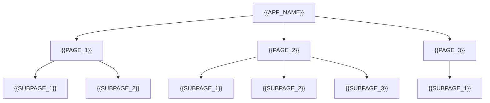
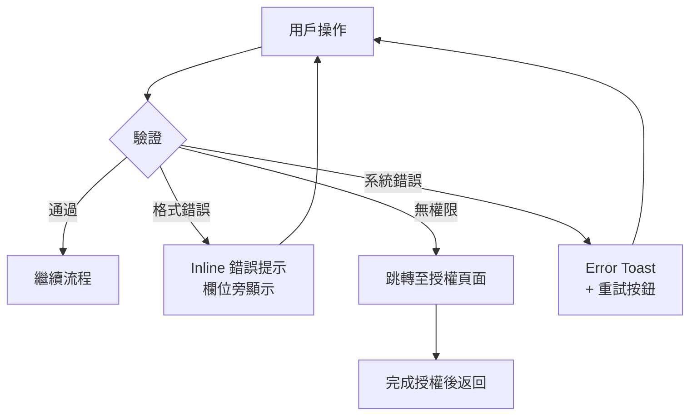
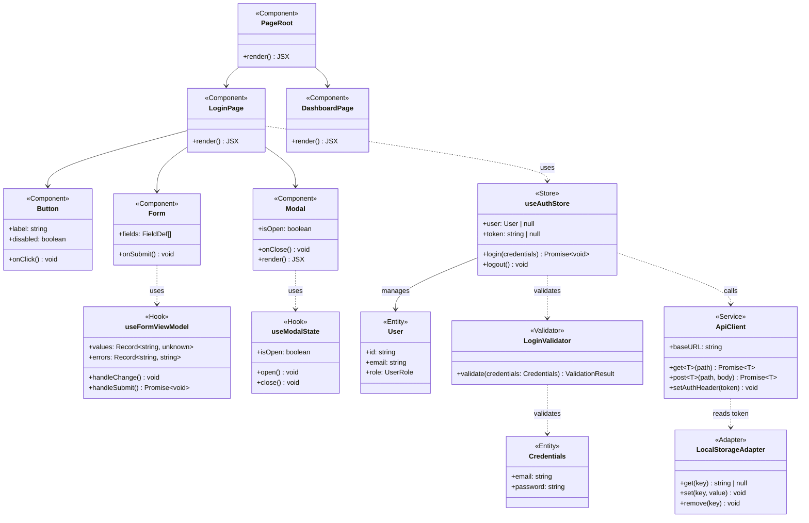
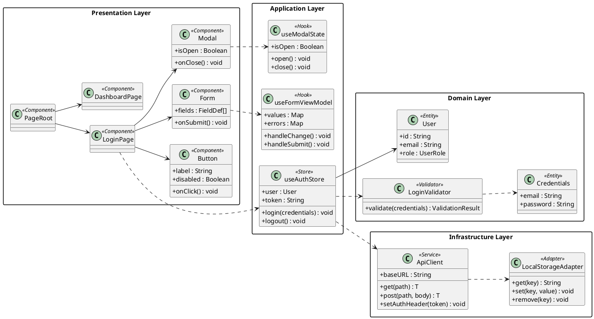
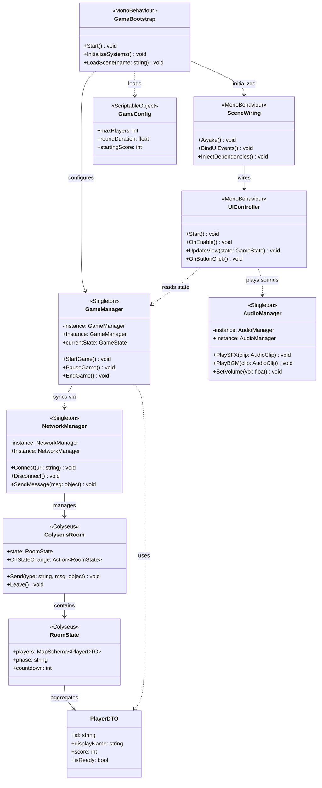
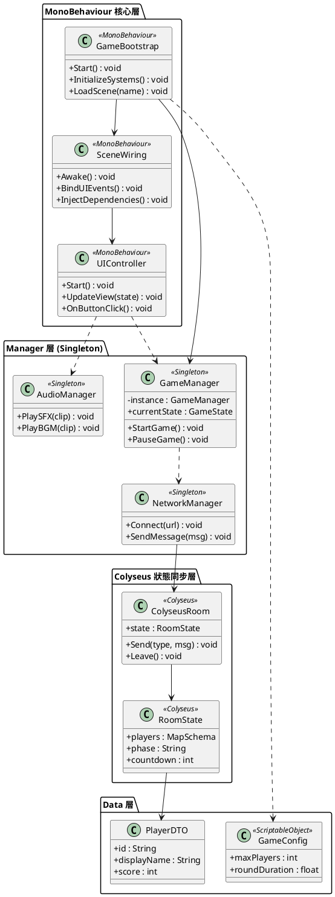
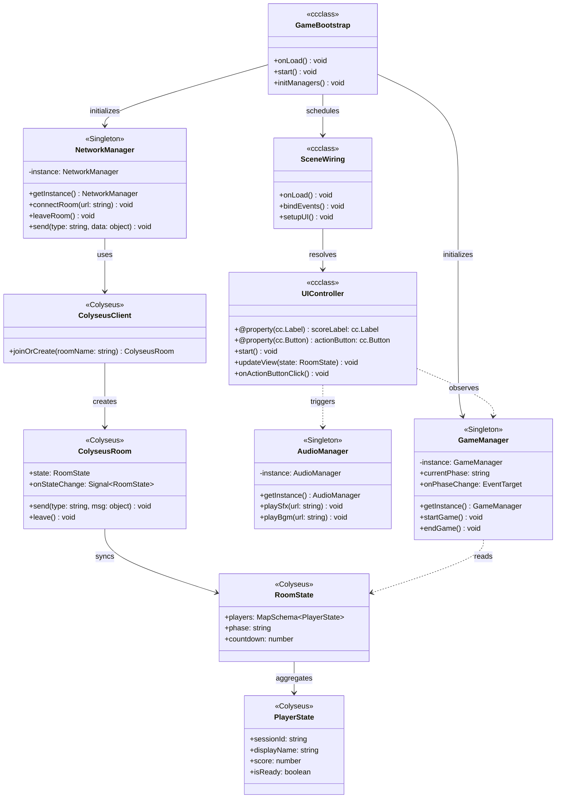
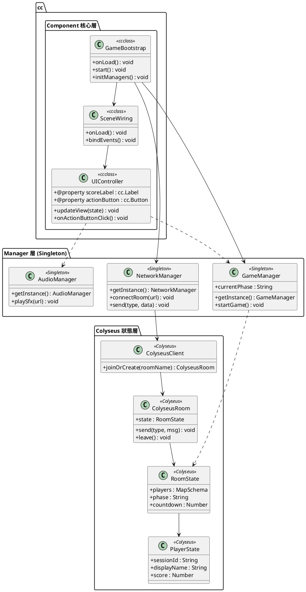

# PDD — Product Design Document (UX / Interaction Design)
<!-- SDLC Requirements Engineering — Layer 3：UX / Interaction Design -->
<!-- 對應學術標準：IEEE 1016 §HCI；Nielsen Norman Group UX Spec；Google Material Design Spec -->
<!-- 上游：PRD（System Requirements）→ 本文件 → 下游：EDD（Tech Spec） -->
<!-- 回答：使用者如何與系統互動？介面長什麼樣？體驗流程是什麼？ -->

---

<!-- ⚠️ Platform Scope — 本文件適用範圍 -->
<!-- 勾選適用平台，未勾選的平台規格不在本文件範圍內 -->

## Platform Scope Declaration（平台範圍宣告）

- [ ] Web（Browser）
- [ ] iOS Native
- [ ] Android Native
- [ ] Desktop App（Electron / macOS / Windows）
- [ ] Game UI（{{ENGINE}}）
- [ ] Embedded / Kiosk

---

## Document Control

| 欄位 | 內容 |
|------|------|
| **專案名稱** | {{PROJECT_NAME}} |
| **文件版本** | v1.0 |
| **狀態** | DRAFT / IN_REVIEW / APPROVED |
| **作者（UX / Product Designer）** | {{AUTHOR}} |
| **日期** | {{DATE}} |
| **上游 PRD** | [PRD.md](PRD.md) |
| **下游 EDD** | [EDD.md](EDD.md)（Tech Spec） |
| **設計稿（Figma）** | {{FIGMA_LINK}} |
| **審閱者** | {{PM}}, {{ENGINEERING_LEAD}}, {{QA_LEAD}} |
| **核准者** | {{DESIGN_LEAD}} |

---

## Change Log

| 版本 | 日期 | 作者 | 變更摘要 |
|------|------|------|---------|
| v1.0 | {{DATE}} | {{AUTHOR}} | 初稿 |

---

## 1. Design Brief

### 1.1 設計目標

> 本次設計要解決什麼體驗問題？設計完成後用戶會有什麼不同感受？

{{DESIGN_OBJECTIVE}}

### 1.2 PRD 需求對應

| PRD User Story | 設計回應 | 設計章節 |
|---------------|---------|---------|
| US-1：{{USER_STORY}} | {{DESIGN_DECISION}} | §4.1 |
| US-2：{{USER_STORY}} | {{DESIGN_DECISION}} | §4.2 |

### 1.3 設計原則（Design Principles）
<!-- 本次設計遵守的核心原則，所有設計決策依此評判 -->

1. **{{PRINCIPLE_1}}**（e.g. 漸進式揭露 — 初始只顯示最重要資訊）
2. **{{PRINCIPLE_2}}**（e.g. 容錯優先 — 所有破壞性操作需二次確認）
3. **{{PRINCIPLE_3}}**（e.g. 行動優先 — 主要 CTA 永遠最顯眼）

---

## 2. User Research Summary
<!-- 設計決策的依據；詳細研究報告另存，此處只列關鍵 insight -->

### 2.0 User Personas
<!-- 每個 Persona 代表一類真實用戶群體，設計決策應以 Persona 需求為依據 -->

#### Persona 1：{{PERSONA_NAME_1}}

| 欄位 | 內容 |
|------|------|
| **姓名** | {{PERSONA_NAME_1}} |
| **年齡** | {{AGE}} 歲 |
| **職業** | {{OCCUPATION}} |
| **技術熟悉度** | 初學者 / 中級 / 進階（1–5 分：{{TECH_LEVEL}}/5） |
| **使用情境** | {{USAGE_CONTEXT}} |
| **核心目標** | {{PRIMARY_GOAL}} |
| **主要痛點** | {{MAIN_PAIN_POINT}} |
| **成功時的感受** | {{SUCCESS_FEELING}} |
| **引言** | 「{{PERSONA_QUOTE}}」 |

#### Persona 2：{{PERSONA_NAME_2}}

| 欄位 | 內容 |
|------|------|
| **姓名** | {{PERSONA_NAME_2}} |
| **年齡** | {{AGE}} 歲 |
| **職業** | {{OCCUPATION}} |
| **技術熟悉度** | 初學者 / 中級 / 進階（1–5 分：{{TECH_LEVEL}}/5） |
| **使用情境** | {{USAGE_CONTEXT}} |
| **核心目標** | {{PRIMARY_GOAL}} |
| **主要痛點** | {{MAIN_PAIN_POINT}} |
| **成功時的感受** | {{SUCCESS_FEELING}} |
| **引言** | 「{{PERSONA_QUOTE}}」 |

### 2.1 研究方法

| 方法 | 樣本數 | 日期 | 關鍵發現 |
|------|--------|------|---------|
| 使用者訪談 | {{N}} 人 | {{DATE}} | {{KEY_FINDING}} |
| Usability Test（現有版本）| {{N}} 人 | {{DATE}} | {{KEY_FINDING}} |
| 競品體驗分析 | {{N}} 個競品 | {{DATE}} | {{KEY_FINDING}} |
| 數據分析（Heatmap / Session）| - | {{DATE}} | {{KEY_FINDING}} |

### 2.2 用戶心智模型
<!-- 用戶如何理解這個功能的概念 -->

> 用戶期待這個功能的運作方式是：{{MENTAL_MODEL_DESCRIPTION}}
>
> 現有設計造成的誤解：{{CURRENT_MISCONCEPTION}}
>
> 本次設計如何對齊用戶心智模型：{{ALIGNMENT_STRATEGY}}

### 2.3 關鍵 Insight（設計決策的依據）

| # | Insight | 來源 | 設計影響 |
|---|---------|------|---------|
| I-1 | {{INSIGHT_1}} | 訪談 | 觸發 §4.1 的設計決策 |
| I-2 | {{INSIGHT_2}} | Usability Test | 觸發 §5.2 的設計決策 |

### 2.4 User Journey Map：{{JOURNEY_NAME}}
<!-- 描述目標 Persona 在完成核心任務過程中的完整體驗旅程，含行為、想法、情緒與機會點 -->

| 階段 | {{STAGE_1}} | {{STAGE_2}} | {{STAGE_3}} | {{STAGE_4}} | {{STAGE_5}} |
|------|------------|------------|------------|------------|------------|
| **用戶行動** | {{ACTION}} | {{ACTION}} | {{ACTION}} | {{ACTION}} | {{ACTION}} |
| **想法** | {{THOUGHT}} | {{THOUGHT}} | {{THOUGHT}} | {{THOUGHT}} | {{THOUGHT}} |
| **情緒** | 😐 中性 | 😟 擔憂 | 😊 滿意 | 😊 滿意 | 😁 開心 |
| **痛點** | {{PAIN}} | {{PAIN}} | - | - | - |
| **機會點** | {{OPP}} | {{OPP}} | {{OPP}} | - | - |
| **接觸點** | {{TOUCHPOINT}} | {{TOUCHPOINT}} | {{TOUCHPOINT}} | {{TOUCHPOINT}} | {{TOUCHPOINT}} |

> **Persona：** {{PERSONA_NAME}} ｜ **目標：** {{JOURNEY_GOAL}} ｜ **情境：** {{JOURNEY_CONTEXT}}

### 2.5 Jobs to Be Done (JTBD)
<!-- 聚焦「用戶想完成什麼任務」，而非用戶本身的特徵屬性 -->

**核心 Job Statement：**
> 當 [{{SITUATION}}] 時，我希望能 [{{MOTIVATION_GOAL}}]，
> 讓我能夠 [{{EXPECTED_OUTCOME}}]。

| Job Type | Job Statement | 現有解法 | 不滿意程度（1–5）|
|----------|--------------|---------|----------------|
| Functional（功能型）| {{JOB}} | {{CURRENT_SOLUTION}} | {{SCORE}} |
| Emotional（情感型）| {{JOB}} | {{CURRENT_SOLUTION}} | {{SCORE}} |
| Social（社交型）| {{JOB}} | {{CURRENT_SOLUTION}} | {{SCORE}} |

> **評分說明：** 1 = 完全滿意，5 = 非常不滿意（代表高設計機會）

### 2.6 Service Blueprint（服務藍圖）
<!-- 展示前台 UI、後台流程與支援系統如何協作交付完整服務體驗 -->

| 行動類型 | {{STAGE_1}} | {{STAGE_2}} | {{STAGE_3}} |
|---------|------------|------------|------------|
| **用戶行動** | {{ACTION}} | {{ACTION}} | {{ACTION}} |
| — 可視線（Line of Interaction）| | | |
| **前台服務人員 / UI** | {{FRONTEND_ACTION}} | {{FRONTEND_ACTION}} | {{FRONTEND_ACTION}} |
| — 可見線（Line of Visibility）| | | |
| **後台流程** | {{BACKEND_PROCESS}} | {{BACKEND_PROCESS}} | {{BACKEND_PROCESS}} |
| — 內部互動線（Line of Internal Interaction）| | | |
| **支援流程 / 系統** | {{SUPPORT_SYSTEM}} | {{SUPPORT_SYSTEM}} | {{SUPPORT_SYSTEM}} |
| **實體證據** | {{PHYSICAL_EVIDENCE}} | {{PHYSICAL_EVIDENCE}} | {{PHYSICAL_EVIDENCE}} |

---

## 3. Information Architecture (IA)

### 3.1 頁面 / 畫面結構（Sitemap）



### 3.2 導覽結構

| 層級 | 導覽方式 | 入口位置 |
|------|---------|---------|
| 主導覽 | {{NAV_TYPE}}（Tab Bar / Sidebar / Top Nav） | {{POSITION}} |
| 次導覽 | {{SUB_NAV_TYPE}} | {{POSITION}} |
| 情境導覽 | {{CONTEXTUAL_NAV_TYPE}} | 頁面內 |

### 3.3 內容優先順序（F-Pattern / Z-Pattern）

> 每個關鍵頁面的視覺重心分配：

| 頁面 | 最重要（First Fixation） | 次要 | 輔助 |
|------|------------------------|------|------|
| {{PAGE_1}} | {{PRIMARY_CONTENT}} | {{SECONDARY}} | {{TERTIARY}} |
| {{PAGE_2}} | {{PRIMARY_CONTENT}} | {{SECONDARY}} | {{TERTIARY}} |

---

## 4. User Flows
<!-- 描述用戶如何完成核心任務，以任務為中心而非頁面為中心 -->

### 4.1 主流程：{{TASK_NAME}}（Happy Path）

```mermaid
flowchart TD
    Start([用戶進入 {{ENTRY_POINT}}]) --> S1[{{SCREEN_1}}]
    S1 --> D1{{{DECISION_POINT}}}
    D1 -->|{{CHOICE_A}}| S2[{{SCREEN_2}}]
    D1 -->|{{CHOICE_B}}| S3[{{SCREEN_3}}]
    S2 --> S4[{{SCREEN_4}}]
    S3 --> S4
    S4 --> End([任務完成：{{SUCCESS_STATE}}])
```

**任務完成時間目標：** < {{N}} 秒 / < {{N}} 步驟

### 4.2 替代流程：{{ALTERNATIVE_FLOW_NAME}}

```mermaid
flowchart TD
    Start([用戶來自 {{ENTRY_POINT}}]) --> S1[{{SCREEN_1}}]
    S1 --> D1{是否 {{CONDITION}}？}
    D1 -->|是| S2[{{SCREEN_2}}]
    D1 -->|否| S3[引導完成前置步驟]
    S3 --> S2
    S2 --> End([完成])
```

### 4.3 錯誤流程：{{ERROR_SCENARIO}}



---

## 5. Screen Specifications
<!-- 每個關鍵畫面的詳細規格，設計稿連結見 §Document Control -->

### 5.1 {{SCREEN_NAME}}

**用途：** {{PURPOSE}}（對應 PRD User Story：US-{{N}}）

**進入方式：** {{ENTRY_POINT}}

**Layout 結構：**
```
┌─────────────────────────────────┐
│  Header：{{HEADER_CONTENT}}      │
├─────────────────────────────────┤
│  主內容區                         │
│  ├── {{CONTENT_BLOCK_1}}         │
│  ├── {{CONTENT_BLOCK_2}}         │
│  └── {{CONTENT_BLOCK_3}}         │
├─────────────────────────────────┤
│  底部 CTA：{{CTA_LABEL}}          │
└─────────────────────────────────┘
```

**元件清單：**

| 元件 | 類型 | 狀態 | 說明 |
|------|------|------|------|
| {{COMPONENT_1}} | Button / Primary | Default / Hover / Disabled | {{BEHAVIOR}} |
| {{COMPONENT_2}} | Input / Text | Empty / Focused / Error / Filled | {{VALIDATION_RULE}} |
| {{COMPONENT_3}} | Card | Default / Selected / Loading | {{CONTENT_SPEC}} |

**互動規格：**

| 觸發 | 動作 | 動畫 / 效果 | 持續時間 |
|------|------|-----------|---------|
| 點擊 {{CTA}} | 導覽至 {{SCREEN}} | Slide Left / Fade | 200ms |
| 長按 {{ITEM}} | 顯示 Context Menu | Scale Up 0.95→1.05 | 150ms |
| 下拉刷新 | 重新載入資料 | Spinner | 直到完成 |
| 左滑 {{ITEM}} | 顯示刪除操作 | Reveal | 200ms |

**Figma 連結：** {{FIGMA_FRAME_LINK}}

---

### 5.2 {{SCREEN_NAME_2}}

（同上結構）

---

## 6. Interaction Design Specifications

### 6.1 動畫與過場（Motion Design）
<!-- 動畫不是裝飾，是溝通 — 用來表達層級關係和狀態變化 -->

| 動畫類型 | 使用時機 | 規格 | 緩動函數 |
|---------|---------|------|---------|
| 頁面進入 | 新頁面載入 | Slide In from Right, 16px | ease-out（300ms） |
| 頁面返回 | 返回上一頁 | Slide Out to Right | ease-in（250ms） |
| Modal 開啟 | 彈出對話框 | Scale 0.9→1.0 + Fade | spring（stiffness: 300）|
| Toast 提示 | 操作回饋 | Slide Up from Bottom | ease-out（200ms），停留 3s 後 Fade Out |
| 載入中 | 資料獲取中 | Skeleton Screen（不用 Spinner） | - |
| 刪除 | 移除列表項目 | Collapse Height + Fade | ease-in（200ms） |

**原則：**
- 功能性動畫 ≤ 300ms
- 裝飾性動畫 ≤ 500ms
- 尊重 `prefers-reduced-motion` 設定

### 6.1.1 Motion Design Specification（動態設計規格）

#### Easing Function Specification（緩動函數規格）

| 動畫用途 | Easing Function | Duration | prefers-reduced-motion 替代 |
|---------|:---------------:|:--------:|---------------------------|
| 頁面進場 / 大元件出現 | `cubic-bezier(0.16, 1, 0.3, 1)` (Expo Out) | 400ms | `opacity 0→1, 200ms linear` |
| 小元件出現（Tooltip / Badge）| `cubic-bezier(0.34, 1.56, 0.64, 1)` (Spring) | 250ms | `opacity 0→1, 150ms linear` |
| 元件消失 / 退場 | `cubic-bezier(0.55, 0, 1, 0.45)` (Expo In) | 200ms | `opacity 1→0, 150ms linear` |
| 互動反饋（按鈕按壓）| `cubic-bezier(0.4, 0, 0.6, 1)` (Standard) | 100ms | 無動畫（直接切換）|
| 頁面切換 / Route 轉場 | `cubic-bezier(0.4, 0, 0.2, 1)` (Material Standard) | 300ms | `opacity 0→1, 150ms linear` |
| 資料載入 Skeleton Shimmer | `linear` (loop) | 1.5s | 靜態 Skeleton（無動態）|
| 展開 / 收合（Accordion）| `cubic-bezier(0.4, 0, 0.2, 1)` | 200ms | 直接顯示/隱藏 |

#### prefers-reduced-motion 實作規範

```css
/* 全域設定 */
@media (prefers-reduced-motion: reduce) {
  *,
  *::before,
  *::after {
    animation-duration: 0.01ms !important;
    animation-iteration-count: 1 !important;
    transition-duration: 0.01ms !important;
    scroll-behavior: auto !important;
  }
}
```

**規則：**
- 所有 `animation` 和 `transition` 必須有 `prefers-reduced-motion` 版本
- Parallax 效果、Auto-play Video、閃爍動畫在 reduced-motion 時必須完全禁用
- Loading Skeleton 的 Shimmer 在 reduced-motion 時改為靜態顯示

#### 動畫清單（Feature × Animation Matrix）

| 元件 | 進場動畫 | 退場動畫 | 互動動畫 | Reduced Motion |
|------|---------|---------|---------|---------------|
| Modal | Fade + Scale-up（95%→100%）| Fade + Scale-down | — | Fade only |
| Dropdown | Fade + Slide-down 8px | Fade + Slide-up | — | Fade only |
| Toast / Notification | Slide-in from right | Slide-out to right | — | Fade only |
| Button | — | — | Scale 98% on press | 無 |
| Page Route | Fade 出 + Fade 入 | — | — | Fade only |

### 6.2 回饋機制（Feedback）

| 操作 | 即時回饋（0～100ms） | 短期回饋（100ms～1s） | 長期回饋（> 1s） |
|------|-------------------|--------------------|--------------| 
| 按鈕點擊 | Ripple / Press State | - | - |
| 表單提交 | 按鈕變 Loading 態 | Success Toast / Error Inline | - |
| 長時間操作 | Progress Bar + 進度文字 | 分段完成提示 | Email 通知 |
| 刪除 | 立即移除（Optimistic UI） | Undo Toast（5s）| - |

### 6.3 空狀態設計（Empty States）

| 情境 | 說明文字 | 圖示 | CTA |
|------|---------|------|-----|
| 首次使用（無資料）| {{EMPTY_MSG}} | {{ILLUSTRATION}} | 「{{CTA_LABEL}}」→ {{ACTION}} |
| 搜尋無結果 | 「找不到「{{QUERY}}」的結果」 | 搜尋圖示 | 清除篩選 |
| 網路離線 | 「目前無法連線，顯示上次的資料」 | 離線圖示 | 重新連線 |
| 錯誤狀態 | 「發生錯誤，請稍後再試」 | 錯誤圖示 | 「重試」|

### 6.4 Loading States

| 情境 | 策略 | 規格 |
|------|------|------|
| 頁面初次載入 | Skeleton Screen | 複製真實內容的骨架，避免 layout shift |
| 分頁加載 | Infinite Scroll + Bottom Spinner | 距底部 200px 時預載 |
| 按鈕動作 | Button Loading State | 文字改為「處理中...」+ Spinner，禁止再次點擊 |
| 圖片加載 | Progressive / Blur-up | 先顯示低解析度縮圖 |

### 6.5 Micro-interaction Catalog（微互動目錄）
<!-- 微互動定義：單一觸發器驅動的細粒度回饋機制，由觸發器、規則、回饋與迴圈四個元素組成 -->

| 觸發器（Trigger）| 規則（Rules）| 回饋（Feedback）| 迴圈 / 模式（Loop）|
|----------------|------------|----------------|-------------------|
| {{TRIGGER_1}} | {{RULE}} | {{FEEDBACK}} | {{LOOP}} |
| 按鈕按壓 | Haptic feedback + 視覺縮放 | Scale 0.95 + 震動 | 放開後恢復 |
| 表單送出成功 | 顯示勾選動畫 | Checkmark draw-on | 3s 後消失 |
| 計數器增減 | 範圍限制（min/max）| 數字翻動動畫 | 達到上下限時 disable |
| 切換開關（Toggle）| 即時生效 | Thumb 滑動 + 顏色變化 | 常態保持（不重置）|
| 按讚 / 收藏 | 去重觸發 | 圖示填充 + 彈跳 | 再按取消，恢復空心 |
| 密碼強度 | 即時字元評估 | 進度條顏色漸變 | 隨輸入即時更新 |

### 6.6 Gesture & Touch Design（手勢設計規格）
<!-- 僅適用於有觸控介面的平台（iOS Native / Android Native / Tablet Web） -->

| 手勢類型 | 觸發條件 | 動作回應 | 視覺回饋 | 衝突處理 |
|---------|---------|---------|---------|---------|
| 單點（Tap）| 輕觸元件 | 主要互動（選取、確認）| Press State（縮放 0.95）| 優先於長按 |
| 長按（Long Press）| 持續 500ms | 顯示 Context Menu / 多選模式 | 元件輕微放大 + Haptic | 防止誤觸：需穩定按壓 |
| 左滑（Swipe Left）| 水平滑動 > 30px | 顯示操作列（Delete / Archive）| Reveal 動畫 | 與父層捲動方向相同時優先捲動 |
| 右滑（Swipe Right）| 水平滑動 > 30px | 返回上一頁 / 標記已讀 | 進度指示 | 僅在支援的畫面啟用 |
| 下拉（Pull to Refresh）| 從頂部向下拉 > 60px | 重新載入資料 | 彈性拉伸 + Spinner | 到達閾值前可取消 |
| 捏合縮放（Pinch）| 雙指靠近 / 遠離 | 縮放內容 | 即時縮放 | 禁用時不響應（顯示禁用提示）|
| 雙點（Double Tap）| 連續點擊兩次 < 300ms | {{DOUBLE_TAP_ACTION}}（e.g. 放大 / 快速收藏）| Scale 彈跳 | 避免與 Tap 事件衝突（延遲判斷）|

**手勢最小觸控目標：** 44×44pt（iOS）/ 48×48dp（Android）

### 6.7 Haptic Feedback Design（震動回饋規格）
<!-- 僅適用平台：iOS Native、Android Native；Web 不支援震動 API 時降級處理 -->

| 場景 | 震動類型 | iOS（UIKit）| Android（HapticFeedback）| 強度 | 備注 |
|------|---------|-----------|--------------------------|------|------|
| 選取元素（選項、Tab）| Selection | `.selection` | `KEYBOARD_TAP` | 輕 | 頻繁操作，使用最輕類型 |
| 按鈕確認成功 | Impact | `.light` | `CONFIRM` | 中 | 正向操作回饋 |
| 操作警示 / 錯誤 | Notification | `.warning` | `REJECT` | 重 | 錯誤、警告場景 |
| 拖曳開始 | Impact | `.medium` | `GESTURE_START` | 中 | 協助感知拖曳啟動 |
| 拖曳放置成功 | Notification | `.success` | `CONFIRM` | 中 | 放置成功確認 |
| 長按觸發 | Impact | `.heavy` | `LONG_PRESS` | 重 | 強調重要操作進入點 |
| 計數器達到上下限 | Notification | `.error` | `REJECT` | 輕–中 | 避免超出邊界的感知提示 |

**降級策略：** 不支援震動的裝置或平台（Web、某些 Android 機型）以視覺或音效回饋替代，不得依賴震動作為唯一的操作回饋。

---

## 7. Responsive & Adaptive Design

### 7.1 Breakpoints

| 名稱 | 寬度 | 目標裝置 | Layout |
|------|------|---------|--------|
| Mobile S | 320px | iPhone SE | 單欄，底部 Tab Bar |
| Mobile M | 375px | iPhone 14 | 單欄，底部 Tab Bar |
| Mobile L | 428px | iPhone 14 Plus | 單欄，底部 Tab Bar |
| Tablet | 768px | iPad | 雙欄，Side Panel |
| Desktop S | 1024px | Laptop | 多欄，Side Navigation |
| Desktop L | 1440px | Desktop | 多欄，寬容器 |
| Desktop XL | 1920px+ | 大螢幕 | 最大寬度限制 + 居中 |

### 7.2 關鍵元件的響應行為

| 元件 | Mobile | Tablet | Desktop |
|------|--------|--------|---------|
| 導覽 | 底部 Tab Bar | Side Drawer | Fixed Side Nav |
| 資料表格 | 卡片式列表 | 可捲動表格 | 完整表格 |
| Modal | 全螢幕 Bottom Sheet | 置中對話框 | 置中對話框 |
| 表單 | 單欄 | 雙欄 | 雙欄 + Side Summary |

---

## 8. Accessibility (A11y) Specifications
<!-- WCAG 2.1 Level AA 最低標準；AA+ 為目標 -->

### 8.1 視覺可及性

| 項目 | 規格 | 驗證工具 |
|------|------|---------|
| 色彩對比（正文）| ≥ 4.5:1 | Contrast Checker |
| 色彩對比（大字 18px+）| ≥ 3:1 | Contrast Checker |
| 不能只靠顏色傳遞資訊 | 加圖示 / 文字標籤 | 設計審查 |
| 最小點擊 / 觸控目標 | 44×44px | 設計審查 |
| 字體最小尺寸 | 12px（建議 14px+）| 設計審查 |

### 8.2 鍵盤與螢幕閱讀器

| 項目 | 規格 |
|------|------|
| Tab 順序 | 符合視覺閱讀順序（左→右，上→下）|
| Focus Indicator | 明顯的 2px 外框，對比 ≥ 3:1 |
| 互動元件 ARIA | 按鈕用 `<button>`，連結用 `<a>`，不用 `<div onClick>` |
| 圖片 | 裝飾性圖片 `alt=""`，內容圖片有意義的 `alt` |
| 表單 | 每個 `<input>` 有對應 `<label>`；錯誤訊息用 `aria-describedby` |
| Modal | 開啟時 focus 移入 Modal；關閉時 focus 回到觸發元素 |
| 動畫 | 尊重 `prefers-reduced-motion` |

### 8.3 可及性測試計畫

| 測試類型 | 工具 | 時機 |
|---------|------|------|
| 自動掃描 | axe-core / Lighthouse | 每次 PR |
| 鍵盤導覽測試 | 手動 | Sprint Review |
| 螢幕閱讀器測試 | VoiceOver / NVDA | Release 前 |
| 色盲模擬 | Sim Daltonism | 設計審查 |

### 8.4 WCAG 2.1 AA Compliance Matrix（無障礙設計合規矩陣）

> **本產品無障礙設計目標：WCAG 2.1 Level AA 全面合規。**
> 所有功能上線前必須通過此矩陣中的「強制（M）」項目。

| WCAG 準則 | 評等 | 要求內容 | 實作方式 | 測試方法 | 優先 |
|----------|:---:|---------|---------|---------|:---:|
| 1.1.1 非文字內容 | AA | 所有圖片/圖示有 alt 或 aria-label | `` / `aria-label` | axe-core | M |
| 1.3.1 資訊與關係 | AA | 語意化 HTML，heading 層次正確 | `<h1>→<h2>→<h3>` 不跳層 | Screen Reader | M |
| 1.4.3 對比度（文字）| AA | 正文 ≥ 4.5:1，大字 ≥ 3:1 | 設計時用 Colour Contrast Analyser 驗證 | axe-core / Figma Plugin | M |
| 1.4.11 對比度（UI 元件）| AA | 按鈕邊框、輸入框邊框 ≥ 3:1 | 設計 Token 中明確指定 Border Color | 手動測試 | M |
| 2.1.1 鍵盤操作 | AA | 所有功能可以純鍵盤操作 | Tab 導覽順序、Enter/Space 觸發 | 手動測試（無滑鼠）| M |
| 2.4.3 焦點順序 | AA | Tab 順序符合視覺閱讀流程 | DOM 順序與視覺一致，避免 tabindex > 0 | 手動測試 | M |
| 2.4.7 焦點可見 | AA | 焦點指示符清晰可見 | Focus ring ≥ 2px solid，對比度 ≥ 3:1 | 手動測試 | M |
| 3.3.1 錯誤識別 | AA | 錯誤訊息明確說明問題所在 | `aria-describedby` 關聯錯誤訊息 | Screen Reader | M |
| 3.3.2 標籤或說明 | AA | 表單欄位有明確標籤 | `<label for="id">` 或 `aria-label` | axe-core | M |
| 4.1.2 名稱、角色、值 | AA | 自訂元件有 ARIA role/state | `role="button"` / `aria-expanded` 等 | axe-core + Screen Reader | M |
| 1.4.4 調整文字大小 | AA | 放大至 200% 不遺失功能 | CSS 使用 `rem`/`em`，無 overflow | 瀏覽器 200% 縮放測試 | R |
| 2.5.5 觸控目標大小 | AA | 可點擊目標 ≥ 44×44px | CSS min-width/min-height | Figma 測量 | R |

*M = 強制（上線前必須通過）；R = 建議（最佳實踐）*

**無障礙測試工具清單：**
- 自動化：axe-core（整合至 CI）、Lighthouse Accessibility Score（目標 ≥ 95）
- 輔助技術：NVDA（Windows）/ VoiceOver（macOS）/ TalkBack（Android）
- 顏色：Colour Contrast Analyser、Figma Contrast Plugin
- 人工測試：鍵盤操作（無滑鼠全程測試）、縮放至 200%

---

## 9. Design System Reference

### 9.1 使用的 Design System

**Design System：** {{DESIGN_SYSTEM_NAME}}（e.g. Material Design 3 / Apple HIG / 自建）
**版本：** {{VERSION}}
**文件：** {{LINK}}

### 9.2 本次新增 / 修改的元件

| 元件名稱 | 類型 | 狀態 | 說明 | Figma |
|---------|------|------|------|-------|
| {{COMPONENT_1}} | New | 新建 | {{DESCRIPTION}} | {{LINK}} |
| {{COMPONENT_2}} | Modified | 修改現有 | {{CHANGE}} | {{LINK}} |

### 9.3 Design Tokens（設計變數）

**Design Token 三層架構：**
<!-- 遵循 W3C Design Tokens 社群規範與 Figma Variables 三層設計，確保語意清晰、易於主題切換 -->

**Layer 1 — Primitive Tokens（原始值）**
> 定義系統中所有原子值，不帶語意含義，僅描述「是什麼」

| Token | 值 |
|-------|---|
| `color-blue-500` | `#3B82F6` |
| `color-blue-600` | `#2563EB` |
| `color-red-500` | `#EF4444` |
| `color-gray-100` | `#F3F4F6` |
| `color-gray-900` | `#111827` |
| `font-size-12` | `12px` |
| `font-size-14` | `14px` |
| `font-size-16` | `16px` |
| `font-size-24` | `24px` |
| `spacing-4` | `4px` |
| `spacing-8` | `8px` |
| `spacing-16` | `16px` |
| `radius-4` | `4px` |
| `radius-8` | `8px` |

**Layer 2 — Semantic Tokens（語意層，引用 Primitive）**
> 定義「用在哪裡」，讓 Token 帶有設計意圖，支援主題切換（Light / Dark）

| Token | 引用 | 使用含義 |
|-------|------|---------|
| `color-action-primary` | `color-blue-500` | 主要互動元素（按鈕、連結、CTA）|
| `color-action-primary-hover` | `color-blue-600` | 主要互動元素懸停態 |
| `color-feedback-error` | `color-red-500` | 錯誤狀態、驗證失敗 |
| `color-surface-default` | `color-gray-100` | 頁面背景 |
| `color-text-primary` | `color-gray-900` | 主要內文 |
| `spacing-component-gap` | `spacing-8` | 元件內部間距 |
| `spacing-section-gap` | `spacing-16` | 區塊之間間距 |
| `radius-component` | `radius-8` | 元件通用圓角 |

**Layer 3 — Component Tokens（元件層，引用 Semantic）**
> 定義「哪個元件的哪個部位」，最終 token 名稱與元件強綁定

| Token | 引用 | 元件 |
|-------|------|------|
| `button-primary-bg` | `color-action-primary` | Primary Button 背景色 |
| `button-primary-bg-hover` | `color-action-primary-hover` | Primary Button 懸停背景 |
| `input-border-error` | `color-feedback-error` | Input 欄位錯誤框線 |
| `card-bg` | `color-surface-default` | 卡片背景色 |
| `card-radius` | `radius-component` | 卡片圓角 |

**現有 Token 清單（沿用）：**

| Token | 值 | 使用場景 |
|-------|---|---------|
| `color-primary` | `#{{HEX}}` | 主要 CTA、連結、強調 |
| `color-error` | `#{{HEX}}` | 錯誤狀態、警示 |
| `spacing-base` | `8px` | 基礎間距單位 |
| `radius-md` | `8px` | 卡片、按鈕圓角 |
| `shadow-card` | `0 2px 8px rgba(0,0,0,0.12)` | 卡片陰影 |
| `duration-fast` | `150ms` | Hover 狀態切換 |
| `duration-normal` | `300ms` | 頁面過場 |

### 9.4 Dark Mode Token Mapping（深色模式 Token 對照表）

> 所有語意化 Token 必須定義 Light / Dark 兩組值。禁止在元件層直接 hardcode 顏色值。

| Semantic Token | Light Mode 值 | Dark Mode 值 | WCAG 對比度（文字背景）| 說明 |
|---------------|:------------:|:------------:|:-------------------:|------|
| `color-text-primary` | `#111827` | `#F9FAFB` | 16.9:1 ✅ AAA | 主要文字 |
| `color-text-secondary` | `#6B7280` | `#9CA3AF` | 4.6:1 ✅ AA | 輔助說明文字 |
| `color-text-disabled` | `#D1D5DB` | `#4B5563` | — | 禁用狀態（非內容）|
| `color-bg-default` | `#FFFFFF` | `#111827` | — | 頁面背景 |
| `color-bg-surface` | `#F9FAFB` | `#1F2937` | — | 卡片/面板背景 |
| `color-bg-elevated` | `#FFFFFF` | `#374151` | — | 浮層/Dropdown 背景 |
| `color-action-primary` | `#3B82F6` | `#60A5FA` | 4.5:1 ✅ AA（on dark bg）| 主要 CTA 按鈕 |
| `color-action-primary-hover` | `#2563EB` | `#93C5FD` | — | Hover 狀態 |
| `color-border-default` | `#E5E7EB` | `#374151` | — | 預設邊框 |
| `color-border-focus` | `#3B82F6` | `#60A5FA` | 3:1 ✅（on bg）| 焦點環 |
| `color-status-error` | `#EF4444` | `#FCA5A5` | 4.5:1 ✅ AA | 錯誤狀態 |
| `color-status-success` | `#10B981` | `#6EE7B7` | 4.5:1 ✅ AA | 成功狀態 |
| `color-status-warning` | `#F59E0B` | `#FCD34D` | 4.5:1 ✅ AA | 警告狀態 |

**深色模式切換機制：**
- 偵測：`@media (prefers-color-scheme: dark)` + 用戶手動切換
- 實作：CSS Custom Properties 搭配 `data-theme="dark"` attribute
- 預設：跟隨系統設定；若用戶手動設定，儲存至 `localStorage`

**禁止事項：**
- ❌ 禁止在元件 CSS 中直接使用 `#hex` 顏色值
- ❌ 禁止只有一組 Token 值（未定義 Dark Mode）

---

## 9.5 Client 類別圖（Class Diagram）

> 本節定義 **Client 端（前端 / 遊戲引擎）** 的程式結構。
> 依照 Clean Architecture 原則，每一層只依賴它下方的層，絕對不跨層溝通。
> 開發者看這張圖可以知道「哪個 class 屬於哪一層」，QA 看這張圖可以知道「每個 class 應該測哪個檔案」。

---

### 9.5.1 Web / HTML5 前端 Class Diagram

#### Mermaid classDiagram（可貼入任何 Mermaid renderer）



#### PlantUML 等效版本



**技術說明：**
Web 前端採用 Clean Architecture 分層。最外層 Presentation（Component）只負責 render UI；Application 層的 Hook/Store 管理狀態與業務流程；Domain 層定義純粹的業務規則（Entity、Validator），不依賴任何框架；Infrastructure 層封裝所有外部依賴（HTTP、LocalStorage）。依賴方向永遠由外向內（Presentation → Application → Domain ← Infrastructure），Domain 不依賴任何外層。

**白話說明：**
「Web 前端也像一棟辦公大樓，接待大廳（Component）對外服務，但背後有部門協調（Hook/Store），有規章制度（Domain），有後勤支援（API Client）。每個部門只跟鄰近部門打交道，不直接跨層溝通。」

---

### 9.5.2 Unity Client Class Diagram

#### Mermaid classDiagram



#### PlantUML 等效版本



**技術說明：**
Unity 的 C# 程式架構以 MonoBehaviour 的生命週期（Awake → Start → Update）為骨幹。`GameBootstrap` 是最先執行的進入點，負責依序啟動各 Singleton Manager。`SceneWiring` 在每個 Scene 內扮演 Composition Root，把 MonoBehaviour 組件與 Manager 連結起來，讓 `UIController` 不需要直接搜尋（`FindObjectOfType`），降低耦合。Colyseus 的 `RoomState` 透過 `NetworkManager` 進行狀態同步，UIController 觀察 GameManager 的狀態變化並更新畫面。

**白話說明：**
「Unity 的程式結構就像劇組分工：導演（GameBootstrap）決定怎麼開場，舞台監督（SceneWiring）負責把演員（UI元件）接上麥克風（事件），演員（UIController）則照著導演給的劇本（State）演出。」

---

### 9.5.3 Cocos Creator Client Class Diagram

#### Mermaid classDiagram



#### PlantUML 等效版本



**技術說明：**
Cocos Creator 使用 TypeScript 搭配 `@ccclass` decorator 宣告元件，以 `@property` 在 Inspector 中暴露節點引用，取代 Unity 的 `[SerializeField]`。生命週期為 `onLoad → start → update`，`onLoad` 時機早於 `start`，適合初始化 Manager。Singleton 以靜態方法 `getInstance()` 實現，由 `GameBootstrap` 在場景啟動時統一初始化，避免各元件自行建立實例導致狀態不一致。Colyseus SDK 提供 TypeScript-native 的 `MapSchema` 與 `ArraySchema`，`onStateChange` 回呼在主執行緒觸發，可直接更新 Cocos Label / Sprite。

**白話說明：**
「Cocos Creator 的結構和 Unity 類似，但改用 TypeScript 裝飾器（@ccclass / @property）讓 Inspector 直接看到屬性。GameBootstrap 就像總指揮，SceneWiring 像現場導播，UIController 像執行螢幕上動作的主播。Colyseus 的狀態同步就像電視台的衛星訊號，RoomState 一更新，所有 UIController 就立刻收到並刷新畫面。」

---

### 9.5.4 Client Class → Test Traceability（類別測試追蹤表）

> 每一個 Client 端 class 都必須有 1 個對應測試檔案。本表是開發與 QA 的共同契約，
> 確保沒有任何 class 「看似有程式碼但沒有測試」。

| Class Name | Platform | Stereotype | src/ 檔案路徑 | Test 檔案路徑 | 主要 Methods | 預期 Test Cases 數 |
|-----------|---------|-----------|------------|------------|------------|-----------------|
| LoginPage | Web | `<<Component>>` | `src/pages/LoginPage.tsx` | `tests/unit/pages/LoginPage.test.tsx` | render, onSubmit | 6 |
| useAuthStore | Web | `<<Store>>` | `src/stores/useAuthStore.ts` | `tests/unit/stores/useAuthStore.test.ts` | login, logout | 8 |
| useFormViewModel | Web | `<<Hook>>` | `src/hooks/useFormViewModel.ts` | `tests/unit/hooks/useFormViewModel.test.ts` | handleChange, handleSubmit | 6 |
| LoginValidator | Web | `<<Validator>>` | `src/domain/LoginValidator.ts` | `tests/unit/domain/LoginValidator.test.ts` | validate | 5 |
| ApiClient | Web | `<<Service>>` | `src/infrastructure/ApiClient.ts` | `tests/unit/infrastructure/ApiClient.test.ts` | get, post, setAuthHeader | 8 |
| LocalStorageAdapter | Web | `<<Adapter>>` | `src/infrastructure/LocalStorageAdapter.ts` | `tests/unit/infrastructure/LocalStorageAdapter.test.ts` | get, set, remove | 6 |
| UIController | Unity | `<<MonoBehaviour>>` | `Assets/Scripts/UI/UIController.cs` | `tests/unity/unit/UIControllerTests.cs` | UpdateView, OnButtonClick | 12 |
| GameManager | Unity | `<<Singleton>>` | `Assets/Scripts/Managers/GameManager.cs` | `tests/unity/unit/GameManagerTests.cs` | StartGame, PauseGame, EndGame | 10 |
| NetworkManager | Unity | `<<Singleton>>` | `Assets/Scripts/Managers/NetworkManager.cs` | `tests/unity/unit/NetworkManagerTests.cs` | Connect, Disconnect, SendMessage | 8 |
| UIController | Cocos | `<<ccclass>>` | `assets/scripts/ui/UIController.ts` | `tests/cocos/unit/UIController.test.ts` | updateView, onActionButtonClick | 10 |
| GameManager | Cocos | `<<Singleton>>` | `assets/scripts/managers/GameManager.ts` | `tests/cocos/unit/GameManager.test.ts` | startGame, endGame | 8 |
| NetworkManager | Cocos | `<<Singleton>>` | `assets/scripts/managers/NetworkManager.ts` | `tests/cocos/unit/NetworkManager.test.ts` | connectRoom, send, leaveRoom | 8 |

**品質檢查清單：**

- [ ] 每個 client class 都有對應測試檔案（1 class ↔ 1 test file）
- [ ] 所有 Clean Architecture 層都有代表性 class（Presentation / Application / Domain / Infrastructure）
- [ ] Design Pattern 有 stereotype 標注（`<<Singleton>>`, `<<Observer>>`, `<<Factory>>` 等）
- [ ] MonoBehaviour / ccclass 的生命週期方法（Awake / Start / onLoad）已在圖中列出
- [ ] Colyseus 狀態 class 已標注 `<<Colyseus>>` stereotype 並顯示 onStateChange 關係
- [ ] 所有 Manager 的 Singleton 關係已用 `-instance` 私有屬性 + `+Instance` / `+getInstance()` 公開存取器表達

---

## 10. Copy & Content Design

### 10.1 語氣與文風（Tone of Voice）

| 情境 | 語氣 | 範例 |
|------|------|------|
| 一般說明 | 簡潔、直接 | 「儲存成功」而非「您的資料已成功儲存至系統」 |
| 錯誤訊息 | 有幫助、不責怪用戶 | 「密碼至少需要 8 個字元」而非「密碼格式錯誤」 |
| 空狀態 | 鼓勵行動 | 「還沒有任何項目，現在就新增第一個！」 |
| 破壞性操作確認 | 清楚說明後果 | 「刪除後無法復原，確定要刪除嗎？」 |

### 10.2 關鍵文案清單

| 位置 | 文案 | 字數限制 | 備注 |
|------|------|---------|------|
| {{PAGE_TITLE}} | {{COPY}} | ≤ {{N}} 字 | |
| {{CTA_BUTTON}} | {{COPY}} | ≤ {{N}} 字 | 動詞開頭 |
| {{ERROR_MSG}} | {{COPY}} | ≤ {{N}} 字 | 說明原因 + 解決方法 |
| {{EMPTY_STATE}} | {{COPY}} | ≤ {{N}} 字 | 包含 CTA |

### 10.3 國際化（i18n）考量

- 預留文字延伸空間：英文 → 德文可能增長 30%，中文可能縮短 50%
- 日期 / 時間格式：依地區設定
- 貨幣格式：依地區設定
- 文字方向：LTR / RTL（若需支援阿拉伯語 / 希伯來語）

---

## 11. Prototype & Validation Plan

### 11.1 原型連結

| 類型 | 工具 | 連結 | 對應流程 |
|------|------|------|---------|
| Low-fidelity Wireframe | {{TOOL}} | {{LINK}} | §4.1 主流程 |
| High-fidelity Prototype | Figma | {{LINK}} | §4.1, 4.2 |
| Interactive Prototype | Figma / Framer | {{LINK}} | §4.1 完整互動 |

### 11.2 設計驗證計畫

| 方法 | 時機 | 樣本 | 成功標準 |
|------|------|------|---------|
| Concept Test（Low-fi） | 設計初期 | 5 人 | 核心概念被正確理解 |
| Usability Test（Hi-fi） | 設計完成後 | 5 人 | Task Completion Rate ≥ 80% |
| A/B Test（CTA 文案） | 上線後 | 統計顯著 | CTR 提升 ≥ 10% |

---

## 12. Open Questions

| # | 問題 | 影響 | 負責人 | 截止日 | 狀態 |
|---|------|------|--------|--------|------|
| Q1 | {{DESIGN_QUESTION_1}} | 核心流程 | {{OWNER}} | {{DATE}} | OPEN |
| Q2 | {{DESIGN_QUESTION_2}} | 元件設計 | {{OWNER}} | {{DATE}} | RESOLVED：{{ANSWER}} |

---

## 13. Engineering Handoff Specification

### 13.1 開發前確認清單（Figma Handoff Checklist）

- [ ] 所有畫面均有完整的 4 種狀態（Default / Hover / Focus / Disabled）
- [ ] 所有錯誤狀態畫面已設計
- [ ] 空狀態（Empty State）已設計
- [ ] Loading / Skeleton 狀態已設計
- [ ] 所有 Design Token 已命名並與 Dev 對齊
- [ ] 手機版 / 桌機版 Breakpoint 均已設計
- [ ] 動畫規格（timing / easing）已標注
- [ ] 圖示（Icons）已 Export 為 SVG / 已加入 Icon Library
- [ ] 文案已最終定稿（無 Lorem Ipsum）
- [ ] 無障礙注釋（Accessibility Annotation）已完成

### 13.2 元件交付規格

| 元件 | Figma Frame | 狀態數量 | 對應開發組件 | 備注 |
|------|------------|---------|------------|------|
| {{COMPONENT_1}} | {{LINK}} | {{N}} 態 | {{DEV_COMPONENT}} | |
| {{COMPONENT_2}} | {{LINK}} | {{N}} 態 | {{DEV_COMPONENT}} | |

### 13.3 設計→工程溝通協議

- 設計稿進入 READY FOR DEV 狀態前，必須通過設計主管 review
- 工程師發現設計缺漏時，開 Figma Comment 標注，@{{DESIGNER_NAME}} 在 {{N}} 個工作日內回應
- 設計變更在進入 Sprint 後需 PM + Tech Lead 雙重確認

### 13.4 Usability Testing Protocol

**測試目標：** {{TEST_OBJECTIVE}}

| 階段 | 方法 | 時機 | 參與者 | 成功標準 | 工具 |
|------|------|------|--------|---------|------|
| Concept Test | 5-second Test + 訪談 | Wireframe 完成後 | 5 人（目標 Persona）| 核心概念理解率 ≥ 80% | Maze / Lookback |
| Prototype Test | Task-based Usability Test | High-fi 完成後 | 5 人 | Task Completion Rate ≥ 80%；SUS Score ≥ 68 | UserTesting.com |
| Beta Test | Unmoderated Remote Test | 上線前 Beta | 20 人 | CSAT ≥ 4.0/5.0；錯誤率 < 5% | FullStory |

**測試腳本框架：**
```
1. 開場白：「這不是在測試你，我們在測試設計」
2. 熱身問題：{{WARMUP_QUESTION}}
3. 任務 1：{{TASK_DESCRIPTION}}（不提示，觀察自然行為）
4. 任務 2：{{TASK_DESCRIPTION}}
5. 事後問題：「最困惑的地方是哪裡？」
6. SUS 量表（10 題標準量表）
```

> **SUS 評分標準：** ≥ 85 優秀；68–84 良好（業界平均）；< 68 需改善

### 13.5 A/B Test Design Template

| 欄位 | 內容 |
|------|------|
| **假設** | 若 [{{CHANGE}}]，則 [{{METRIC}}] 將 [方向] [{{MAGNITUDE}}]，因為 [{{REASON}}] |
| **控制組（A）** | {{CONTROL_DESCRIPTION}} |
| **實驗組（B）** | {{VARIANT_DESCRIPTION}} |
| **主要指標** | {{PRIMARY_METRIC}}（統計顯著 p < 0.05）|
| **護欄指標** | {{GUARDRAIL_METRIC}}（不得下降超過 X%）|
| **最小樣本量** | {{SAMPLE_SIZE}}（統計功效 80%，顯著水準 5%）|
| **測試時長** | 最少 {{N}} 週（涵蓋完整週期效應）|
| **分流方式** | User-level（避免 network effect）|
| **預期上線** | {{DATE}} |

---

## 14. References

- PRD：[PRD.md](PRD.md)
- BRD：[BRD.md](BRD.md)
- Figma Design File：{{LINK}}
- Design System：{{LINK}}
- 用戶研究報告：{{LINK}}
- 競品體驗分析：{{LINK}}
- WCAG 2.1 Guidelines：https://www.w3.org/TR/WCAG21/

---

## 15. Admin Portal 產品設計（condition: has_admin_backend=true）

> **條件章節**：僅在 `has_admin_backend = true` 時填寫。若無 Admin 後台需求，本章節標記「不適用」即可。

### 15.1 Admin Portal 定位與使用情境

| 面向 | 說明 |
|------|------|
| **目標使用者** | 內部運營人員、系統管理員、稽核員（非終端消費者） |
| **核心職責** | 用戶管理、RBAC 角色管理、業務資料後台操作、稽核日誌查閱 |
| **存取方式** | 獨立網域或路徑隔離（如 `/admin/`），需 MFA 登入 |
| **技術棧** | Vue3 + Element Plus + Vite（預設）；詳見 EDD §3.3 `_ADMIN_FRAMEWORK` |
| **設計方向** | Professional / Neutral — 以資訊密度與效率為優先，非品牌展示頁 |

**Admin User Story 清單（P0）：**

| ID | 角色 | Story | Acceptance Criteria |
|----|------|-------|---------------------|
| A-US-01 | super_admin | 我要能新增/停用帳號，確保人員異動即時生效 | 操作後 AuditLog 記錄，變更即時反映登入狀態 |
| A-US-02 | super_admin | 我要能設定角色與權限，確保最小權限原則 | Permission 以 `module.action` 細粒度控制，變更後 15 分鐘內 Token 失效並重導登入 |
| A-US-03 | operator | 我要能查看和操作業務資料，提高處理效率 | 依 PRD §19.3 業務模組展開，每項操作受 RBAC 守衛 |
| A-US-04 | auditor | 我要能查詢和匯出稽核日誌，以備合規審查 | 可依時間範圍、操作員、動作類型篩選；匯出 CSV 不逾 10 秒 |

---

### 15.2 Admin Information Architecture（導覽結構）

```
Admin Portal
├── 登入頁（含 MFA TOTP）
├── 控制台（Dashboard）          ← 統計卡 + 最近操作 + 快速入口
├── 用戶管理（User Management）   ← CRUD + 角色指派 + 鎖定/解鎖
├── 角色管理（Role Management）   ← 角色 CRUD + Permission Matrix 勾選
├── 稽核日誌（Audit Log）         ← 篩選 + 匯出 CSV
└── 業務管理（Business Modules）  ← 依 PRD §19.3 展開（動態選單）
```

選單可見性由 RBAC 動態控制（super_admin 見全部，auditor 僅見稽核日誌 + 只讀業務頁）。

---

### 15.3 Admin 核心頁面 Wireframe 描述

#### A. 登入頁

- 全頁深色漸層背景，置中卡片（max-width: 420px）
- 欄位：帳號 / 密碼（含 toggle 顯示）/ TOTP 6 位數字
- 連續錯誤 5 次 → 帳號鎖定提示
- 成功 → 導向 Dashboard

#### B. Dashboard

- 頂部 Nav（固定，含 Logo + 用戶名 + 登出）
- 左側 Sidebar（固定 240px，含 RBAC 動態選單 + active 樣式）
- 統計卡片區：用戶總數 / 活躍用戶 / 今日操作 / 本月稽核（2×2 Grid）
- 快速操作：新增用戶 / 查看角色 / 匯出稽核日誌
- 最近操作記錄表格（最新 5 筆 AuditLog）

#### C. 用戶管理

- 搜尋列（關鍵字 + 角色篩選 + 狀態篩選）
- 資料表格：ID / 用戶名 / 姓名 / Email / 角色 Tag / 狀態 Badge / 最後登入 / 操作
- 操作：編輯（Modal）/ 鎖定 | 解鎖 / 刪除（二次確認）
- 新增用戶 Modal：帳號 / 姓名 / Email / 角色 / 初始密碼

#### D. 角色管理

- 角色卡片清單（含用戶數量）
- 點擊「編輯權限」→ 展開 Permission Matrix（module × action Chips，可 toggle）
- 儲存後 Toast 通知

#### E. 稽核日誌

- 篩選：日期範圍 / 操作員 / 操作類型 Select
- 表格：ID / 操作員 / 動作 / 目標 / IP / 時間 / 結果 Badge
- 「匯出 CSV」按鈕（前端 Blob Download）
- 不可刪除 / 不可修改（無操作欄）

---

### 15.4 Admin UX 設計決策

| 決策 | 說明 | 理由 |
|------|------|------|
| 深色 Sidebar + 淺色 Content | Admin Portal 採 Sidebar 深色（#111827）+ Content 淺色 | 與前台區隔，減少誤操作風險 |
| Element Plus 預設樣式 | 不大幅客製化 El 元件外觀 | Admin 以效率為主，客製化增加維護成本 |
| Table 不支援批量刪除 | 敏感操作逐筆確認 | 防止誤操作，符合稽核要求 |
| 稽核日誌唯讀 | 任何人不得修改或刪除稽核日誌 | 合規要求（ISO 27001 / GDPR 可追溯性） |
| RBAC 即時生效 | 權限變更後最多 15 分鐘生效（Token TTL）| 安全性 vs 可用性平衡 |
| MFA 強制 | 所有 Admin 帳號必須啟用 TOTP | 後台存取敏感資料，需雙因素驗證 |

---

## 16. Approval Sign-off

| 角色 | 姓名 | 簽核日期 | 意見 |
|------|------|---------|------|
| UX / Product Designer | {{NAME}} | {{DATE}} | |
| Product Manager | {{NAME}} | {{DATE}} | |
| Engineering Lead | {{NAME}} | {{DATE}} | |
| QA Lead | {{NAME}} | {{DATE}} | |
| Accessibility Review | {{NAME}} | {{DATE}} | |
