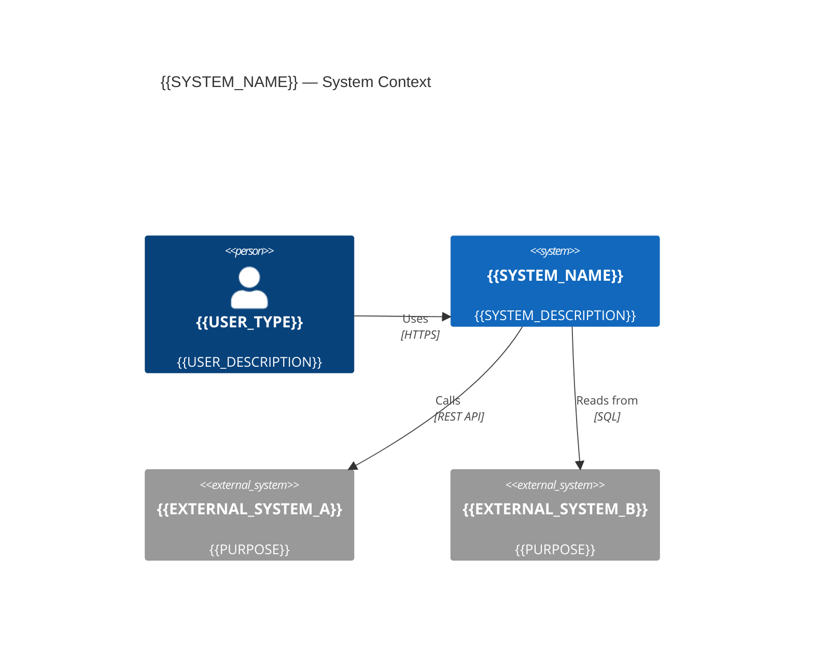
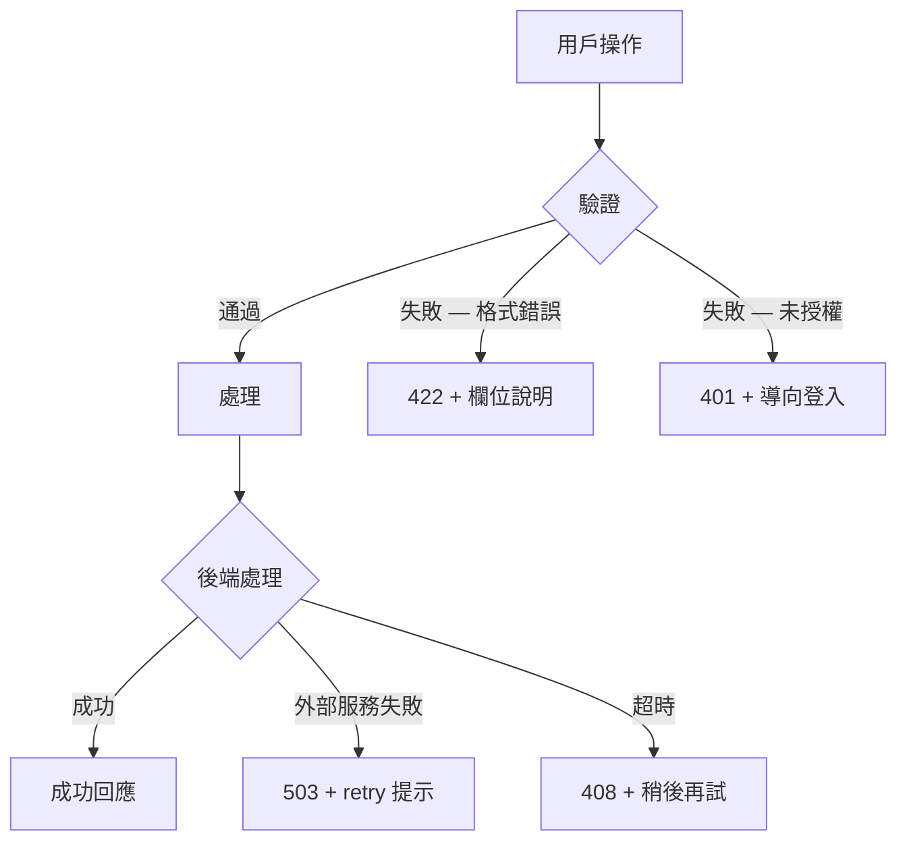

# PRD — Product Requirements Document
<!-- 對應學術標準：IEEE 830 (SRS)，對應業界：Google PRD / Amazon PRFAQ -->

---

## Document Control

| 欄位 | 內容 |
|------|------|
| **DOC-ID** | PRD-{{PROJECT_CODE}}-{{YYYYMMDD}} |
| **產品名稱** | {{PROJECT_NAME}} |
| **文件版本** | v1.0 |
| **狀態** | DRAFT / IN_REVIEW / APPROVED |
| **作者（PM）** | {{AUTHOR}} |
| **日期** | {{DATE}} |
| **上游 BRD** | [BRD.md](BRD.md) §{{BRD_SECTION}} |
| **審閱者** | {{REVIEWER_1}}, {{REVIEWER_2}} |
| **核准者** | {{APPROVER}} |

---

## Change Log

| 版本 | 日期 | 作者 | 變更摘要 |
|------|------|------|---------|
| v1.0 | {{DATE}} | {{AUTHOR}} | 初稿 |

---

## 1. Executive Summary

> **一段話**：本產品解決什麼問題、為誰解決、預期產生什麼價值。
> 寫完後任何非技術背景的人讀完應能理解「這個功能是什麼、為什麼重要」。

{{EXECUTIVE_SUMMARY}}

---

## 2. Problem Statement
<!-- IEEE 830 §3.1 Product Perspective -->

### 2.1 現狀痛點

> 描述用戶現在如何處理這個問題（workaround），以及造成的成本 / 損失。

{{CURRENT_STATE_AND_PAIN}}

### 2.2 根本原因分析

> 為什麼現狀存在這個問題？（技術限制 / 流程缺失 / 市場空白）

{{ROOT_CAUSE}}

### 2.3 機會假設

> 如果我們解決這個問題，我們假設會發生什麼？（可驗證的假設）

- 假設 1：若 [行動]，則 [用戶行為] 將 [方向] [指標] by [幅度]
- 假設 2：

### 2.4 System Context Diagram
<!-- IEEE 830 §3.1 Product Perspective；C4 Model Level 1：呈現系統邊界與外部關係 -->
<!-- 說明：此圖定義「本系統做什麼」與「哪些外部系統 / 人員與它互動」，是範圍管理的視覺化錨點 -->



> **圖例說明：**
> - `Person`：直接與系統互動的使用者或外部角色
> - `System`：本次交付的系統邊界（In Scope）
> - `System_Ext`：現有外部系統，本次不修改
> - `Rel`：關係標註格式為（來源, 目標, 動詞標籤, 協定）

---

## 3. Stakeholders & Users
<!-- IEEE 830 §3.2 Product Functions；業界：RACI Matrix -->

### 3.1 Stakeholder Map

| 角色 | 關係 | 主要關切 | 溝通頻率 |
|------|------|---------|---------|
| {{SPONSOR}} | 出資 / 核准 | ROI、上市時間 | 月 |
| {{PM}} | 負責人 | 範圍、優先順序 | 每日 |
| {{ENGINEERING_LEAD}} | 技術實作 | 可行性、技術債 | 每日 |
| {{DESIGNER}} | 體驗設計 | 可用性、一致性 | 每週 |
| {{QA}} | 品質保證 | 覆蓋率、穩定性 | 每週 |
| {{DATA_ANALYST}} | 指標追蹤 | 埋點、報表 | 月 |
| {{END_USER}} | 使用者 | 易用性、效率 | - |

### 3.2 User Personas
<!-- 每個 Persona 代表一類真實用戶群，需有數據支撐 -->

#### Persona A：{{PERSONA_NAME}}

| 欄位 | 內容 |
|------|------|
| **背景** | {{AGE}}, {{JOB_TITLE}}, {{CONTEXT}} |
| **目標** | 想要達成什麼 |
| **痛點** | 現在卡在哪裡 |
| **技術熟悉度** | 低 / 中 / 高 |
| **使用頻率** | 每日 / 每週 / 偶發 |
| **成功樣貌** | 這個功能對他來說「成功」是什麼感覺 |

#### Persona B：{{PERSONA_NAME}}

（同上結構）

---

## 4. Scope

### 4.1 In Scope（本版本交付）

- [ ] {{FEATURE_1}}
- [ ] {{FEATURE_2}}
- [ ] {{FEATURE_3}}

### 4.2 Out of Scope（明確排除）
<!-- 明確寫出排除項，避免 scope creep -->

- ❌ {{EXCLUDED_1}}（原因：{{REASON}}）
- ❌ {{EXCLUDED_2}}（原因：{{REASON}}）

### 4.3 Future Scope（下個版本候選）

- 🔮 {{FUTURE_1}}
- 🔮 {{FUTURE_2}}

---

## 5. User Stories & Acceptance Criteria
<!-- IEEE 830 §3.2；INVEST 原則：Independent / Negotiable / Valuable / Estimable / Small / Testable -->

### 5.1 {{FEATURE_NAME_1}}

**User Story：**
> 作為 **[Persona A]**，
> 我希望能 **[具體行動]**，
> 以便 **[達成的業務價值]**。

**REQ-ID：** US-{{FEATURE_CODE}}-001（對應 BRD §{{BRD_GOAL_REF}}）
**優先度：** P0（Must Have）/ P1（Should Have）/ P2（Nice to Have）
**關聯 BRD 目標：** §{{BRD_GOAL_REF}}
**活動圖（Activity Diagram）：** [activity-{{FLOW_NAME}}.md](../docs/diagrams/activity-{{FLOW_NAME}}.md)

**Acceptance Criteria（可測試、無歧義）：**

| REQ-ID / AC# | Given（前提） | When（行動） | Then（結果） | 測試類型 |
|--------------|-------------|------------|------------|---------|
| US-{{FEATURE_CODE}}-001 / AC-1 | 用戶已登入 | 點擊「{{BUTTON}}」 | 系統在 2s 內回傳 {{RESPONSE}} | E2E |
| US-{{FEATURE_CODE}}-001 / AC-2 | 輸入欄位為空 | 提交表單 | 顯示錯誤訊息「{{ERROR_MSG}}」 | Unit |
| US-{{FEATURE_CODE}}-001 / AC-3 | 網路中斷 | 送出請求 | 顯示 retry 提示，不遺失資料 | Integration |

**邊界條件 / Edge Cases：**
- 最大值：{{MAX_VALUE}} → 預期行為：{{BEHAVIOR}}
- 最小值：{{MIN_VALUE}} → 預期行為：{{BEHAVIOR}}
- 並發：多用戶同時操作 → 預期行為：{{BEHAVIOR}}
- 超時：API > {{TIMEOUT}}ms → 預期行為：{{BEHAVIOR}}

---

### 5.2 {{FEATURE_NAME_2}}

**User Story：**
> 作為 **[Persona B]**，
> 我希望能 **[具體行動]**，
> 以便 **[達成的業務價值]**。

**REQ-ID：** US-{{FEATURE_CODE}}-002（對應 BRD §{{BRD_GOAL_REF}}）
**優先度：** P0（Must Have）/ P1（Should Have）/ P2（Nice to Have）
**關聯 BRD 目標：** §{{BRD_GOAL_REF}}
**活動圖（Activity Diagram）：** [activity-{{FLOW_NAME}}.md](../docs/diagrams/activity-{{FLOW_NAME}}.md)

**Acceptance Criteria（可測試、無歧義）：**

| REQ-ID / AC# | Given（前提） | When（行動） | Then（結果） | 測試類型 |
|--------------|-------------|------------|------------|---------|
| US-{{FEATURE_CODE}}-002 / AC-1 | {{GIVEN}} | {{WHEN}} | {{THEN}} | E2E |
| US-{{FEATURE_CODE}}-002 / AC-2 | {{GIVEN}} | {{WHEN}} | {{THEN}} | Unit |

**邊界條件 / Edge Cases：**
- 最大值：{{MAX_VALUE}} → 預期行為：{{BEHAVIOR}}
- 最小值：{{MIN_VALUE}} → 預期行為：{{BEHAVIOR}}
- 並發：多用戶同時操作 → 預期行為：{{BEHAVIOR}}
- 超時：API > {{TIMEOUT}}ms → 預期行為：{{BEHAVIOR}}

---

## 6. User Flows
<!-- 用 Mermaid flowchart 描述主要使用流程 -->

### 6.1 主流程（Happy Path）

```mermaid
flowchart TD
    A([用戶進入]) --> B[{{STEP_1}}]
    B --> C{{{DECISION_POINT}}}
    C -->|成功| D[{{STEP_2}}]
    C -->|失敗| E[{{ERROR_HANDLING}}]
    D --> F([完成])
    E --> G[顯示錯誤訊息]
    G --> B
```

### 6.2 錯誤流程



### 6.3 狀態機（State Machine）
<!-- 若有物件狀態轉換，用此圖描述 -->

```mermaid
stateDiagram-v2
    [*] --> {{STATE_DRAFT}}: 建立
    {{STATE_DRAFT}} --> {{STATE_REVIEW}}: 提交
    {{STATE_REVIEW}} --> {{STATE_APPROVED}}: 核准
    {{STATE_REVIEW}} --> {{STATE_DRAFT}}: 退回修改
    {{STATE_APPROVED}} --> {{STATE_ARCHIVED}}: 封存
    {{STATE_APPROVED}} --> [*]: 刪除
```

---

## 7. Non-Functional Requirements (NFR)
<!-- IEEE 830 §3.4～§3.8；對應 EDD 的 SLO/SLA 設計 -->

### 7.1 效能（Performance）

| 指標 | 目標值 | 量測方式 | 降級策略 |
|------|--------|---------|---------|
| API 回應時間 P50 | < 200ms | APM（Datadog/NewRelic） | Cache |
| API 回應時間 P99 | < 1000ms | APM | Circuit Breaker |
| 頁面 LCP | < 2.5s | Lighthouse / RUM | SSR / CDN |
| 批次作業吞吐量 | > {{N}} records/sec | 壓測 | 分批處理 |

### 7.2 可用性（Availability）

| 環境 | SLA | RTO | RPO |
|------|-----|-----|-----|
| Production | 99.9% (< 8.7h/year) | 30 min | 5 min |
| Staging | 99.0% | 4h | 1h |

### 7.3 可擴展性（Scalability）

- 短期：支援 {{CURRENT_LOAD}} QPS
- 長期：支援 {{TARGET_LOAD}} QPS（{{N}}x 增長），不需重構核心架構
- 資料量：{{DATA_VOLUME}} 筆，查詢效能不退化

### 7.4 安全性（Security）

- 認證：{{AUTH_METHOD}}（JWT / OAuth2 / Session）
- 授權：{{AUTHZ_MODEL}}（RBAC / ABAC）
- 資料加密：傳輸中 TLS 1.3+，靜態 AES-256
- PII 處理：{{PII_FIELDS}} 需遮罩 / 最小化收集
- 合規要求：{{GDPR / HIPAA / PCI-DSS / 其他}}

### 7.5 可用性（Usability）

- 無障礙標準：WCAG 2.1 Level AA
- 支援語言：{{LANGUAGES}}
- 支援裝置：{{DEVICES}}（Desktop / Mobile / Tablet）
- 支援瀏覽器：Chrome 90+, Firefox 88+, Safari 14+

### 7.6 可維護性（Maintainability）

- 測試覆蓋率：≥ 80%（unit + integration）
- 程式碼複雜度：Cyclomatic Complexity ≤ 10
- 文件完整性：所有公開 API 有 OpenAPI spec

### 7.7 可觀測性（Observability）
<!-- IEEE 830 §3.4；對應 EDD 中的 SLO/SLA 監控設計 -->

#### 7.7.1 Logging 規格

| 欄位 | 要求 |
|------|------|
| 格式 | 結構化 JSON（含 timestamp、level、service、trace_id、span_id、message） |
| 等級 | ERROR / WARN / INFO / DEBUG（Production 預設 INFO） |
| 必含欄位 | `request_id`、`user_id`（遮罩 PII）、`duration_ms`、`http_status` |
| 禁止記錄 | 明文密碼、完整信用卡號、未遮罩的 PII 欄位 |
| 保留期 | Production：90 天；Staging：14 天 |
| 收集工具 | {{LOG_AGGREGATOR}}（如 Datadog / ELK / CloudWatch） |

#### 7.7.2 Metrics 必須項目

| 指標名稱 | 類型 | 說明 | 告警觸發條件 |
|---------|------|------|------------|
| `{{service}}_request_total` | Counter | 所有 API 請求總數（含 status_code label） | - |
| `{{service}}_request_duration_seconds` | Histogram | 請求延遲分佈（P50 / P95 / P99） | P99 > {{THRESHOLD}}ms |
| `{{service}}_error_rate` | Gauge | 5xx / 4xx 錯誤比率 | > {{THRESHOLD}}% |
| `{{service}}_active_connections` | Gauge | 當前活躍連線數 | > {{MAX_CONN}} |
| `{{service}}_cache_hit_rate` | Gauge | 快取命中率 | < {{MIN_HIT_RATE}}% |
| `{{service}}_queue_depth` | Gauge | 非同步佇列積壓深度 | > {{THRESHOLD}} |

#### 7.7.3 Distributed Tracing 需求

- 所有跨服務呼叫必須傳遞 `trace_id` / `span_id`（W3C TraceContext 格式）
- 採樣率：Production 10%（錯誤請求 100% 採樣）；Staging 100%
- 工具：{{TRACING_TOOL}}（如 Jaeger / Zipkin / AWS X-Ray）
- Trace 保留期：7 天

#### 7.7.4 Alert 閾值定義

| 告警名稱 | 觸發條件 | 嚴重度 | 通知管道 | 處置 SLA |
|---------|---------|--------|---------|---------|
| HighErrorRate | error_rate > {{N}}% 持續 5 分鐘 | P1 | PagerDuty + Slack | 回應 15 分鐘 |
| HighLatency | P99 > {{N}}ms 持續 3 分鐘 | P2 | Slack | 回應 30 分鐘 |
| ServiceDown | health check 連續失敗 3 次 | P0 | PagerDuty（電話） | 回應 5 分鐘 |
| DiskSpaceWarning | 磁碟使用率 > 80% | P3 | Slack | 回應 4 小時 |
| QueueDepthHigh | queue_depth > {{N}} 持續 10 分鐘 | P2 | Slack | 回應 30 分鐘 |

#### 7.7.5 Dashboard 要求

| Dashboard 名稱 | 受眾 | 必含面板 |
|--------------|------|---------|
| Service Health | On-Call 工程師 | Request Rate、Error Rate、P99 Latency、Active Instances |
| Business KPI | PM / 業務 | DAU、Conversion Rate、Feature Adoption、Revenue Impact |
| Infrastructure | SRE | CPU / Memory / Disk / Network、Pod Restart Count |
| Security | 安全團隊 | 401/403 趨勢、異常 IP、Rate Limit 觸發次數 |

### 7.8 Analytics Event Instrumentation Map（分析事件儀器化）

> 每個功能上線前，必須確認以下事件已實作並通過驗收。Analytics 儀器化不得晚於功能上線。

| 功能 | Event Name | 觸發動作 | 必要 Payload 欄位 | 關聯 KPI | 實作狀態 |
|------|-----------|---------|-----------------|---------|:-------:|
| {{FEATURE_1}} | `{{event_name_verb_noun}}` | {{USER_ACTION}} | `{user_id, session_id, {{FIELD_1}}, {{FIELD_2}}}` | {{KPI}} | 🔲 |
| {{FEATURE_2}} | `{{event_name}}` | {{USER_ACTION}} | `{{{REQUIRED_FIELDS}}}` | {{KPI}} | 🔲 |
| 搜尋功能 | `search_query_submitted` | 用戶按下搜尋 / Enter | `{query, filters_applied, result_count}` | 搜尋參與率 | 🔲 |
| 結果點擊 | `result_item_clicked` | 點擊結果項目 | `{result_rank, item_id, query, session_id}` | CTR / 相關性 | 🔲 |
| 表單提交 | `form_submitted` | 表單成功提交 | `{form_id, field_count, time_to_complete_seconds}` | 完成率 | 🔲 |
| 錯誤發生 | `error_encountered` | 系統/驗證錯誤 | `{error_code, error_message, user_action, page}` | 錯誤率 | 🔲 |

**Event 命名規範：** `{object}_{action}_{result}` 全小寫底線，例：`checkout_payment_completed`

**Analytics 工具鏈：** {{ANALYTICS_PLATFORM}}（如 Mixpanel / Amplitude / GA4 / Segment）

**驗收條件：** 功能進入 Staging 前，需在 Analytics Dashboard 確認 Event 成功觸發 ≥ 5 次測試。

---

## 8. Constraints & Dependencies
<!-- IEEE 830 §3.9 Constraints -->

### 8.1 技術限制

- 必須使用既有 {{TECH_STACK}}（原因：{{REASON}}）
- 不得引入 {{PROHIBITED_TECH}}（原因：{{REASON}}）
- 資料庫不可新增超過 {{N}} 個 table（原因：{{REASON}}）

### 8.2 業務限制

- 預算：{{BUDGET}}
- 上線截止日：{{DEADLINE}}（原因：{{REASON}}）
- 必須通過 {{COMPLIANCE_CHECK}} 審核

### 8.3 外部依賴

| 依賴項 | 類型 | 負責方 | 風險等級 | 備援方案 |
|--------|------|--------|---------|---------|
| {{SERVICE_A}} API | 外部服務 | {{VENDOR}} | HIGH | Cache + 降級 |
| {{INTERNAL_SERVICE}} | 內部服務 | {{TEAM}} | MEDIUM | 非同步佇列 |
| {{DESIGN_SYSTEM}} | 設計系統 | {{TEAM}} | LOW | - |

### 8.4 關鍵假設（Assumptions）
<!-- 嚴格區分：Constraint 是「已知且不可改變的限制」；Assumption 是「我們相信為真但尚未經過驗證的事項」 -->
<!-- 每一條假設若被推翻，應立即觸發 PRD 重新評估流程 -->

| # | 假設內容 | 若假設錯誤的風險等級 | 驗證方式 | 驗證截止日 | 負責人 |
|---|---------|-------------------|---------|-----------|--------|
| A-1 | {{ASSUMPTION_1}}（例：用戶已具備基本{{SKILL}}能力，無需引導流程） | HIGH / MEDIUM / LOW | 用戶訪談 / 資料分析 / PoC 驗證 | {{DATE}} | {{OWNER}} |
| A-2 | {{ASSUMPTION_2}}（例：{{EXTERNAL_SYSTEM}} API 在 GA 前將保持向後相容） | HIGH | {{VALIDATION_METHOD}} | {{DATE}} | {{OWNER}} |
| A-3 | {{ASSUMPTION_3}}（例：本功能上線後，現有流量不超過基礎設施 {{N}}x 容量） | MEDIUM | 容量規劃評估 | {{DATE}} | {{OWNER}} |

> **風險等級定義：**
> - **HIGH**：若假設錯誤，將導致交付延遲 > 2 週或需重大架構調整
> - **MEDIUM**：若假設錯誤，需調整實作細節但不影響核心架構
> - **LOW**：若假設錯誤，僅需微幅調整 UI 或文案

### 8.5 向後相容性宣告（Backward Compatibility）
<!-- 每次版本交付必須明確聲明，避免下游消費者被 Breaking Change 意外影響 -->

| 欄位 | 內容 |
|------|------|
| **本版本是否有 Breaking Change** | 是 / 否 |
| **受影響的 API 版本** | {{API_VERSION}}（例：v1.x 用戶受影響，v2.x 不受影響） |
| **Breaking Change 清單** | 1. {{CHANGE_1}}；2. {{CHANGE_2}} |
| **Deprecation Timeline** | {{OLD_ENDPOINT}} 將於 {{DATE}} 正式下線（給予 {{N}} 個月緩衝期） |
| **Migration Guide 責任歸屬** | {{TEAM}} 負責產出，{{DATE}} 前完成並通知所有消費方 |
| **向下相容保障期** | v{{OLD_VERSION}} 維持支援至 {{DATE}} |

---

## 9. Success Metrics & Launch Criteria
<!-- 可量化，有 baseline，有目標值，有時間軸 -->

### 9.1 成功指標（KPIs）

| 指標 | Baseline（現在） | 目標（上線後 30 天） | 量測工具 |
|------|----------------|---------------------|---------|
| {{METRIC_1}} | {{BASELINE}} | {{TARGET}} | {{TOOL}} |
| {{METRIC_2}} | {{BASELINE}} | {{TARGET}} | {{TOOL}} |
| {{CONVERSION_RATE}} | {{BASELINE}}% | {{TARGET}}% | {{TOOL}} |
| 用戶滿意度（CSAT） | {{BASELINE}} | ≥ {{TARGET}} | 問卷 |

### 9.2 護欄指標（Guardrail Metrics）
<!-- 不能變差的指標，變差就 rollback -->

| 指標 | 當前值 | 可接受下限 | 若跌破的處置 |
|------|--------|-----------|------------|
| {{ERROR_RATE}} | {{CURRENT}}% | < {{THRESHOLD}}% | 立即 Rollback |
| {{LATENCY_P99}} | {{CURRENT}}ms | < {{THRESHOLD}}ms | 降級模式 |

### 9.3 上線 Go / No-Go 清單

**Go 條件（全部必須通過）：**
- [ ] 所有 P0 AC 通過 QA 驗收
- [ ] 測試覆蓋率 ≥ 80%
- [ ] P99 延遲 < {{THRESHOLD}}ms（壓測驗證）
- [ ] 安全掃描無 CRITICAL / HIGH 漏洞
- [ ] Runbook 已完成
- [ ] Rollback 方案已驗證
- [ ] 監控 Dashboard 已就緒
- [ ] 埋點數據已驗證（QA 環境）

**No-Go 條件（任一存在就不上線）：**
- [ ] 資料遷移未完成
- [ ] 外部依賴 {{SERVICE}} 尚未可用
- [ ] 法務 / 合規審查未通過

---

## 9.4 Experiment & A/B Test Plan（實驗與 A/B 測試計畫）

#### 實驗優先序矩陣

| 實驗名稱 | 假說 | 主要指標 | 次要指標 | 流量分配 | 最短測試週期 | 衝突限制 |
|---------|------|---------|---------|:-------:|:-----------:|---------|
| {{EXPERIMENT_1}} | 若 {{CHANGE}}，則 {{METRIC}} 將提升 {{X}}% | {{PRIMARY_METRIC}} | {{SECONDARY}} | 50/50 | 2 週（需 N ≥ {{MIN_SAMPLE}}）| 不可與 {{CONFLICT}} 同時測試 |
| {{EXPERIMENT_2}} | {{HYPOTHESIS}} | {{METRIC}} | {{SECONDARY}} | 80/20（小流量）| 1 週 | — |

#### A/B 測試標準流程

```
1. 假說定義（本表格）
2. 統計顯著性計算：α=0.05, 檢定力 1-β=0.80，最小偵測效應量 MDE={{X}}%
3. 樣本量計算：N = f(conversion_rate, MDE, α, β)
4. 實驗設計審查（避免 novelty effect、SRM 問題）
5. 上線 + 監控（每日查看 guardrail metrics）
6. 決策：達標 → Ship ｜ 不顯著 → 延長或關閉 ｜ 負向 → 立即關閉
7. 結果記錄進 Decision Log
```

#### Guardrail Metrics（實驗護欄指標）

以下指標任一惡化 > 5%，立即暫停實驗：
- {{GUARDRAIL_1}}（如系統錯誤率）
- {{GUARDRAIL_2}}（如頁面載入時間 P95）
- {{GUARDRAIL_3}}（如用戶留存率 Day 1）

---

## 9.5 Definition of Done（完成定義）

#### Product DoD（產品完成標準）

功能由 PM 確認以下全部達成後，方可標記為「Product Complete」：

| 項目 | 驗收標準 |
|------|---------|
| ✅ User Story 覆蓋 | 所有 Acceptance Criteria 均有對應 BDD scenario 並通過 |
| ✅ Analytics Events | 所有 Event 已在 Analytics Dashboard 確認觸發 |
| ✅ Edge Cases | 所有已知 edge case 和 error state 已測試並有對應 UX 設計 |
| ✅ Accessibility | WCAG 2.1 AA 核心項目通過（對比度、鍵盤導航、aria-label）|
| ✅ i18n Ready | 所有文案已提取為 i18n key，無 hardcode 字串 |
| ✅ Metrics Baseline | Launch 前已記錄基準值（baseline），供效益評估比較 |

#### Engineering DoD（工程完成標準）

功能由 Engineering Lead 確認以下全部達成後，方可部署 Production：

| 項目 | 驗收標準 |
|------|---------|
| ✅ 單元測試 | Coverage ≥ {{COVERAGE_THRESHOLD}}%（核心業務邏輯 100%）|
| ✅ 整合測試 | 所有 API endpoint 有 integration test |
| ✅ E2E 測試 | 關鍵 Happy Path 有 E2E 自動化測試通過 |
| ✅ Code Review | PR 已通過 2 名 reviewer 核准，無 CRITICAL 問題 |
| ✅ Security Scan | SAST 無 HIGH/CRITICAL 漏洞，dependencies 無 CVE > 7.0 |
| ✅ Performance Gate | P95 latency ≤ {{LATENCY_THRESHOLD}}ms，Error Rate ≤ {{ERROR_RATE}}% |
| ✅ Feature Flag | 功能已在 Feature Flag 保護下上線（方可 Canary Deploy）|
| ✅ Runbook | 新功能的 Runbook（操作手冊）已加入 docs/runbooks/ |

---

## 10. Rollout Plan

| 階段 | 對象 | 流量比例 | 觀察期 | 成功條件 |
|------|------|---------|--------|---------|
| Alpha | 內部員工 | 100% 內部 | 3 天 | 無 CRITICAL bug |
| Beta | {{USER_SEGMENT}} | 5% | 1 週 | Error rate < {{N}}% |
| GA | 全用戶 | 100% | 2 週 | KPI 達標 |

### 10.2 Feature Flag 規格
<!-- Feature Flag 是 Rollout 階段管控流量與快速回滾的核心機制 -->
<!-- Kill Switch 必須在上線前驗證可在 5 分鐘內生效 -->

| Flag 名稱 | 預設值 | 目標群組 | 啟用條件 | Kill Switch | 管理工具 | 預計移除日 |
|-----------|--------|---------|---------|------------|---------|-----------|
| `{{FLAG_NAME}}` | OFF | {{USER_SEGMENT}}（如：Beta 用戶 / 特定 org_id） | {{CONDITION}}（如：user.plan == "premium"） | 是（立即關閉，5 分鐘內生效） | {{TOOL}}（如：LaunchDarkly / Unleash） | {{DATE}} |
| `{{FLAG_NAME_2}}` | OFF | {{USER_SEGMENT}} | {{CONDITION}} | 是（立即關閉，5 分鐘內生效） | {{TOOL}} | {{DATE}} |

> **Flag 管理原則：**
> 1. 每個 Flag 必須指定移除截止日（避免 Flag 技術債堆積）
> 2. Flag 啟用 / 關閉的操作紀錄必須寫入 Audit Log
> 3. Flag 變更需通知相關 On-Call 工程師
> 4. GA 完成後 30 天內必須清除相關 Flag 程式碼

---

## 11. Data Requirements
<!-- IEEE 830 §3.3 Product Data；確保資料變更與需求同步，避免後期 Schema Migration 意外 -->

### 11.1 新增資料欄位 / 資料表

列出本版本需要新增或修改的資料表與欄位：

| 資料表名稱 | 操作類型 | 說明 |
|-----------|---------|------|
| `{{TABLE_NAME}}` | CREATE / ALTER / DROP | {{PURPOSE}} |
| `{{TABLE_NAME_2}}` | ALTER（新增欄位） | {{PURPOSE}} |

### 11.2 Data Dictionary

| 欄位名稱 | 型別 | 長度 / 精度 | 必填 | 預設值 | 說明 | 範例值 | PII |
|---------|------|------------|------|--------|------|--------|-----|
| `{{FIELD_NAME}}` | VARCHAR | 255 | 是 | - | {{DESCRIPTION}} | "example@email.com" | 是（需遮罩） |
| `{{FIELD_NAME_2}}` | INTEGER | - | 否 | 0 | {{DESCRIPTION}} | 42 | 否 |
| `{{FIELD_NAME_3}}` | TIMESTAMP | - | 是 | CURRENT_TIMESTAMP | 建立時間 | "2026-01-01T00:00:00Z" | 否 |
| `{{FIELD_NAME_4}}` | BOOLEAN | - | 是 | FALSE | {{DESCRIPTION}} | true | 否 |
| `{{FIELD_NAME_5}}` | DECIMAL | 10,2 | 否 | NULL | {{DESCRIPTION}} | 99.99 | 否 |

### 11.3 資料來源

| 資料欄位 / 資料表 | 來源系統 | 同步方式 | 同步頻率 | 負責方 |
|-----------------|---------|---------|---------|--------|
| `{{FIELD}}` | {{SOURCE_SYSTEM}} | API Pull / Event Stream / ETL | 即時 / 每小時 / 每日 | {{TEAM}} |
| `{{FIELD_2}}` | {{SOURCE_SYSTEM_2}} | {{METHOD}} | {{FREQUENCY}} | {{TEAM}} |

### 11.4 資料品質要求

| 要求項目 | 規格 |
|---------|------|
| 完整性 | 必填欄位空值率 < {{N}}% |
| 準確性 | 資料與來源系統一致性 ≥ {{N}}% |
| 時效性 | 資料延遲不超過 {{N}} 分鐘 |
| 唯一性 | `{{KEY_FIELD}}` 不允許重複 |
| 格式驗證 | `{{FIELD}}` 必須符合 {{FORMAT_SPEC}}（如 ISO 8601 日期格式） |

### 11.5 PII 欄位清單

| 欄位名稱 | PII 類型 | 處理方式 | 法規依據 |
|---------|---------|---------|---------|
| `{{PII_FIELD}}` | 姓名 / Email / 手機 / 身分證字號 | 加密儲存 + 顯示遮罩 | GDPR / PDPA / 其他 |
| `{{PII_FIELD_2}}` | {{PII_TYPE}} | {{HANDLING}} | {{REGULATION}} |

> **注意：** PII 欄位異動必須知會法務 / 隱私長（DPO），並更新隱私政策說明。

---

## 12. Open Questions

| # | 問題 | 負責人 | 截止日 | 狀態 |
|---|------|--------|--------|------|
| Q1 | {{QUESTION_1}} | {{OWNER}} | {{DATE}} | OPEN |
| Q2 | {{QUESTION_2}} | {{OWNER}} | {{DATE}} | RESOLVED：{{ANSWER}} |

---

## 13. Glossary

| 術語 | 定義 |
|------|------|
| {{TERM_1}} | {{DEFINITION}} |
| {{TERM_2}} | {{DEFINITION}} |

---

## 14. References

- BRD：[BRD.md](BRD.md)
- 競品分析：{{LINK}}
- 用戶研究報告：{{LINK}}
- 設計規格：{{LINK}}
- Analytics Dashboard：{{LINK}}

---

## 15. Requirement Traceability Matrix (RTM)
<!-- IEEE 830 §5.2 Traceability；RTM 確保每一個業務需求都能追溯到設計決策、技術實現和測試案例 -->
<!-- 形成完整需求追蹤鏈：BRD 業務目標 → User Story → AC → 設計章節 → 技術方案 → 測試案例 -->
<!-- RTM 應在每次需求變更後同步更新，並在 Sprint Review 前完成核對 -->

| REQ-ID | BRD 目標 | User Story 章節 | AC# | 設計章節（PDD） | 技術方案（EDD） | 測試案例 ID | 狀態 |
|--------|---------|----------------|-----|----------------|----------------|-----------|------|
| US-{{FEATURE_CODE}}-001 | O{{N}}（BRD §{{REF}}） | §5.1 | AC-1, AC-2, AC-3 | PDD §{{SECTION}} | EDD §{{SECTION}} | TC-001, TC-002 | DRAFT / APPROVED / VERIFIED |
| US-{{FEATURE_CODE}}-002 | O{{N}}（BRD §{{REF}}） | §5.2 | AC-1, AC-2 | PDD §{{SECTION}} | EDD §{{SECTION}} | TC-003 | DRAFT / APPROVED / VERIFIED |

> **欄位說明：**
> - **REQ-ID**：唯一需求識別碼，格式 `US-{FEATURE_CODE}-{N}`
> - **BRD 目標**：對應 BRD 中的業務目標編號，確保需求有業務依據
> - **User Story 章節**：本文件 §5 中的對應章節
> - **AC#**：驗收條件編號（可多個，以逗號分隔）
> - **設計章節（PDD）**：對應產品設計文件的章節
> - **技術方案（EDD）**：對應工程設計文件的章節
> - **測試案例 ID**：對應 QA 測試計畫中的 Test Case 編號
> - **狀態**：DRAFT（草稿）/ IN_REVIEW（審閱中）/ APPROVED（核准）/ VERIFIED（測試通過）

---

## 16. Approval Sign-off

| 角色 | 姓名 | 簽核日期 | 意見 |
|------|------|---------|------|
| PM | {{NAME}} | {{DATE}} | |
| Engineering Lead | {{NAME}} | {{DATE}} | |
| Design Lead | {{NAME}} | {{DATE}} | |
| QA Lead | {{NAME}} | {{DATE}} | |
| Legal / Compliance | {{NAME}} | {{DATE}} | |

---

## 17. Privacy by Design & Data Protection

### 12.1 Privacy by Design 七大原則合規檢查

> **依據**：Ann Cavoukian 的 Privacy by Design 七大原則 + GDPR Art.25 Data Protection by Design

| # | 原則 | 本產品實作方式 | 合規狀態 |
|---|------|------------|---------|
| 1 | Proactive not Reactive | 威脅建模（STRIDE）在設計階段完成 | ☐ 待確認 |
| 2 | Privacy as Default | 資料蒐集預設最小化；行銷追蹤預設關閉 | ☐ 待確認 |
| 3 | Privacy Embedded into Design | PII 欄位在資料模型層加密；存取需明確授權 | ☐ 待確認 |
| 4 | Full Functionality | 隱私保護不以降低功能為代價（零和思維不適用） | ☐ 待確認 |
| 5 | End-to-End Security | 傳輸加密（TLS 1.3）+ 靜態加密（AES-256）+ 金鑰輪換 | ☐ 待確認 |
| 6 | Visibility and Transparency | 隱私政策公開；資料使用目的明確告知 | ☐ 待確認 |
| 7 | Respect for User Privacy | 提供資料下載（Art.20 可攜性）+ 刪除請求（Art.17）界面 | ☐ 待確認 |

### 12.2 個人資料盤點（PII Inventory）

| 欄位名稱 | 資料表 | PII 類別 | 蒐集目的 | 法律依據（GDPR） | 保留期限 | 加密方式 |
|---------|--------|---------|---------|---------------|---------|---------|
| `email` | `users` | 聯絡資料 | 帳號識別、通知 | 合約必要（Art.6.1b） | 帳號存活期 + 30 天 | AES-256-GCM |
| `password_hash` | `users` | 認證資料 | 身份驗證 | 合約必要（Art.6.1b） | 同上 | bcrypt cost≥12 |
| `phone` | `user_profiles` | 聯絡資料 | 雙因素驗證 | 同意（Art.6.1a） | 帳號存活期 | AES-256-GCM |
| `ip_address` | `sessions` | 網路識別碼 | 安全分析、防詐騙 | 合法利益（Art.6.1f） | 90 天 | 不加密（匿名化日誌） |
| `{{新增欄位}}` | `{{資料表}}` | `{{類別}}` | `{{目的}}` | `{{Art.}}` | `{{期限}}` | `{{方式}}` |

### 12.3 使用者隱私權實作矩陣

| GDPR 權利 | 條文 | 功能需求 | 實作期限 | 負責人 |
|-----------|------|---------|---------|--------|
| 存取權（Right of Access） | Art.15 | `/api/v1/me/data-export` 端點，返回完整個人資料 ZIP | {{MILESTONE}} | {{OWNER}} |
| 更正權（Right to Rectification） | Art.16 | 使用者可在設定頁修改個人資料 | {{MILESTONE}} | {{OWNER}} |
| 刪除權（Right to Erasure） | Art.17 | `/api/v1/me/delete` — 30 天緩衝期後永久刪除 | {{MILESTONE}} | {{OWNER}} |
| 限制處理權 | Art.18 | 帳號暫停功能（不刪除但停止處理） | {{MILESTONE}} | {{OWNER}} |
| 可攜性權（Data Portability） | Art.20 | JSON/CSV 格式資料匯出 | {{MILESTONE}} | {{OWNER}} |
| 反對權（Right to Object） | Art.21 | 行銷通知退訂 + 個人化功能關閉選項 | {{MILESTONE}} | {{OWNER}} |
| 撤回同意 | Art.7(3) | 一鍵撤回所有非必要同意 | {{MILESTONE}} | {{OWNER}} |

### 12.4 同意管理（Consent Management）

**同意收集規範：**
- 同意必須為**自願、具體、知情且明確**（GDPR Art.4(11)）
- 不得使用預先勾選（Pre-ticked boxes）
- 必須記錄同意時間戳、IP、版本的隱私政策

**同意記錄 Schema：**
```sql
CREATE TABLE user_consents (
    id              UUID         PRIMARY KEY DEFAULT gen_random_uuid(),
    user_id         UUID         NOT NULL REFERENCES users(id),
    consent_type    VARCHAR(100) NOT NULL,  -- 'marketing_email', 'analytics', 'third_party'
    granted         BOOLEAN      NOT NULL,
    granted_at      TIMESTAMPTZ,
    revoked_at      TIMESTAMPTZ,
    policy_version  VARCHAR(20)  NOT NULL,  -- 哪個版本的隱私政策
    ip_address      INET,
    user_agent      TEXT,
    created_at      TIMESTAMPTZ  NOT NULL DEFAULT NOW()
);
```

### 12.5 DPIA（資料保護影響評估）觸發條件

依 GDPR Art.35，以下情況**必須**執行 DPIA：

| 情況 | 說明 | 本產品是否適用 |
|------|------|------------|
| 大規模 PII 處理 | 處理超過 10 萬名使用者的個人資料 | ☐ 評估中 |
| 敏感資料處理 | 健康、種族、生物識別等特殊類別 | ☐ 評估中 |
| 系統性評估/分析 | 使用 AI/ML 對個人進行評分或畫像 | ☐ 評估中 |
| 新技術大規模應用 | 首次使用新型識別技術 | ☐ 評估中 |
| 跨境傳輸 EU 個人資料 | 傳輸至 EU 以外地區 | ☐ 評估中 |

---

## 18. Accessibility Requirements（無障礙需求）

### 13.1 WCAG 2.1 合規目標

| 等級 | 目標 | 時程 |
|------|------|------|
| WCAG 2.1 Level A | 發佈即達標 | MVP |
| WCAG 2.1 Level AA | 發佈後 3 個月 | Phase 2 |
| WCAG 2.1 Level AAA（核心功能） | 12 個月內 | Phase 3 |

### 13.2 無障礙需求清單

| # | 需求 | WCAG 基準 | 優先級 |
|---|------|---------|-------|
| A11y-01 | 所有圖片提供替代文字（alt text） | 1.1.1 | P0 |
| A11y-02 | 色彩對比度 ≥ 4.5:1（正文）/ 3:1（大文字） | 1.4.3 | P0 |
| A11y-03 | 鍵盤完整可操作（無需滑鼠） | 2.1.1 | P0 |
| A11y-04 | 所有表單欄位有明確 Label | 1.3.1 | P0 |
| A11y-05 | 螢幕閱讀器相容（NVDA/VoiceOver 測試） | 4.1.3 | P1 |
| A11y-06 | 頁面可縮放至 200% 不失效 | 1.4.4 | P1 |
| A11y-07 | 焦點狀態視覺可見 | 2.4.7 | P1 |
| A11y-08 | 錯誤訊息清楚識別並描述如何修正 | 3.3.1 / 3.3.3 | P1 |
| A11y-09 | 避免使用閃爍元素（> 3Hz） | 2.3.1 | P0 |
| A11y-10 | 支援減少動態效果（prefers-reduced-motion） | 2.3.3 | P1 |

---

## 19. Admin Backend Requirements（管理後台需求）
<!-- 條件章節：has_admin_backend=true 時填寫；否則標注「本專案無 Admin 後台需求」並略過 -->

> **觸發條件**：專案啟用 Admin 後台（Session Config 中 `has_admin_backend=true`）時，此章節為必填。

### 19.1 Admin Portal 定位

| 項目 | 說明 |
|------|------|
| **目標用戶** | 內部運營人員（非終端 C 端用戶） |
| **主要目的** | 用戶管理、系統配置、業務數據監控、稽核合規 |
| **存取方式** | 獨立子路徑（`/admin/`）或獨立域名（`admin.{{DOMAIN}}.com`）|
| **認證方式** | 獨立 JWT 體系（Admin Token，有效期更短）+ MFA（建議） |

### 19.2 Admin 用戶角色定義

| 角色 code | 中文名稱 | 職責範圍 | 敏感操作 |
|----------|---------|---------|---------|
| `super_admin` | 超級管理員 | 全部功能 + 角色管理 | ✅ 刪除用戶 / 角色授權 |
| `operator` | 運營人員 | 業務數據查看 + 用戶查詢 | ❌ |
| `auditor` | 稽核人員 | 稽核日誌查看（只讀） | ❌ |
| `{{CUSTOM_ROLE}}` | {{ROLE_NAME}} | {{SCOPE}} | {{SENSITIVE}} |

> ⚠️ 角色定義需與 EDD §5.5 RBAC 模型保持一致。

### 19.3 Admin 功能模組需求

| 模組 | 功能清單 | 所需角色 | 優先級 |
|------|---------|---------|--------|
| 用戶管理 | 列表 / 搜尋 / 詳情 / 停用 / 重設密碼 | super_admin, operator | P0 |
| 角色管理 | 角色 CRUD / 權限分配 | super_admin | P0 |
| 稽核日誌 | 列表 / 詳情 / 導出 CSV | super_admin, auditor | P0 |
| 業務監控 | {{BUSINESS_MODULE_1}} 數據看板 | operator | P1 |
| 系統配置 | {{CONFIG_ITEMS}} | super_admin | P1 |
| {{CUSTOM_MODULE}} | {{FEATURES}} | {{ROLES}} | {{PRIORITY}} |

### 19.4 Admin 核心 User Stories

```
作為 super_admin，我可以 管理所有用戶帳號（查看/停用/刪除），以便維護平台用戶安全。
  驗收條件：
  - Given: 已登入 super_admin 帳號
  - When: 搜尋指定用戶並點擊停用
  - Then: 該用戶立即無法登入，狀態顯示為「已停用」

作為 super_admin，我可以 分配角色給 Admin 用戶，以便精細控制管理權限。
  驗收條件：
  - Given: 已建立 operator 帳號
  - When: 在角色管理頁面為其分配 operator 角色
  - Then: 該用戶登入後只看到 operator 授權的功能模組

作為 auditor，我可以 查看和導出稽核日誌，以便滿足合規審計需求。
  驗收條件：
  - Given: 已登入 auditor 帳號
  - When: 篩選日期範圍和操作類型後導出
  - Then: 成功下載包含所有欄位的 CSV 文件
```

### 19.5 Admin 稽核要求

> 依合規需求（{{COMPLIANCE_STANDARD：GDPR/ISO27001/SOC2}}），以下操作必須記錄 AuditLog：

| 操作類型 | 觸發條件 | 必須記錄欄位 |
|---------|---------|------------|
| 用戶帳號變更 | 創建/停用/刪除/角色變更 | admin_id, target_user_id, action, before, after, ip, timestamp |
| 角色權限變更 | 角色 CRUD / 權限分配修改 | admin_id, role_id, changes, timestamp |
| 系統配置變更 | 任何配置項修改 | admin_id, config_key, before, after, timestamp |
| 敏感資料存取 | 查看用戶 PII 資料 | admin_id, target_user_id, fields_accessed, timestamp |
| 批量操作 | 批量停用/導出 | admin_id, affected_count, criteria, timestamp |

### 19.6 Admin 非功能性需求

| 需求類型 | 規格 |
|---------|------|
| 認證安全 | Admin Token 有效期 ≤ 15 分鐘（Refresh Token 8 小時）|
| MFA | Super Admin 強制 TOTP MFA |
| Session 管理 | 30 分鐘無操作自動登出 |
| 登入嘗試限制 | 連續失敗 5 次後鎖定 30 分鐘 |
| 密碼策略 | 最少 12 字元、含大小寫 + 數字 + 特殊符號 |
| IP 白名單 | 可選（生產環境建議啟用） |
| 回應時間 | 列表頁 < 1s（100 筆以內），Dashboard < 2s |

---
