# UML-CLASS-GUIDE.md — UML 類別圖完整指南 / UML Class Diagram Complete Guide

## 為什麼需要 UML 類別圖 / Why Class Diagrams Matter

**技術說明 (Technical):**
Class diagrams are the blueprint of a software system. They show all classes, their attributes, methods, and relationships — enabling test planning, code generation, and architecture validation before a single line is written. Without a class diagram, teams frequently discover misaligned assumptions about ownership, lifecycle, and dependencies only after significant code has been written.

**白話說明 (Plain Language):**
就像蓋房子前要有藍圖，類別圖就是軟體的藍圖。不畫圖就寫程式，就像沒有藍圖就蓋房子——可能蓋到一半才發現樓梯裝錯位置。畫好類別圖，所有人在開始前就能對齊「這個系統長什麼樣子、誰負責什麼、誰需要依賴誰」。

---

## 1. 9 大 UML 圖總覽 / Overview of 9 UML Diagram Types

| 編號 | 圖名 (中文) | Diagram Name (English) | 主要用途 | 必要性 | Mermaid 支援 |
|------|------------|------------------------|---------|--------|-------------|
| 1.1 | 使用案例圖 | Use Case Diagram | 系統範疇、Actor 互動 | ★★★★☆ | ✅ (flowchart) |
| 1.2 | 類別圖 ⭐ | Class Diagram | 核心領域建模、實作前藍圖 | ★★★★★ | ✅ (classDiagram) |
| 1.3 | 物件圖 | Object Diagram | 執行時期特定快照 | ★★★☆☆ | ✅ (classDiagram) |
| 1.4 | 循序圖 | Sequence Diagram | API 呼叫流程、時序記錄 | ★★★★★ | ✅ (sequenceDiagram) |
| 1.5 | 通訊圖 | Communication Diagram | 物件協作關係 | ★★★☆☆ | ✅ (flowchart) |
| 1.6 | 狀態機圖 | State Machine Diagram | 訂單、支付、使用者生命週期 | ★★★★☆ | ✅ (stateDiagram-v2) |
| 1.7 | 活動圖 | Activity Diagram | 業務流程、演算法描述 | ★★★★☆ | ✅ (flowchart) |
| 1.8 | 元件圖 | Component Diagram | 微服務邊界、模組依賴 | ★★★★☆ | ✅ (flowchart) |
| 1.9 | 部署圖 | Deployment Diagram | 基礎設施、k8s、雲端架構 | ★★★☆☆ | ✅ (flowchart) |

---

### 1.1 Use Case Diagram 使用案例圖

**何時使用 (When to use):** 在專案啟動階段，用於捕捉系統範疇與各 Actor 的互動，對齊業務需求。

**Mermaid 範例:**

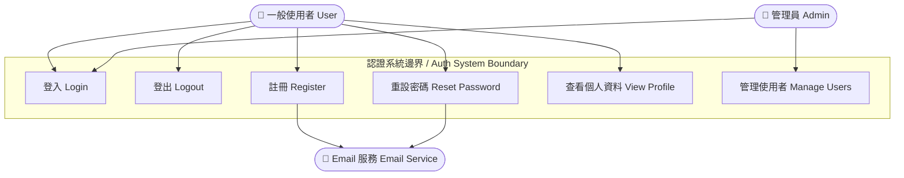

**PlantUML 範例:**

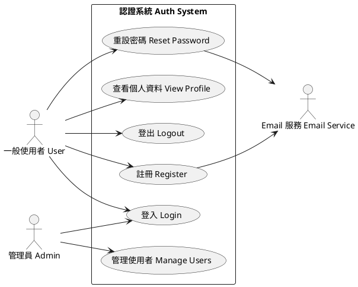

**技術說明:** 使用案例圖展示系統對外提供的功能（What），而非實作細節（How）。每個 Actor 代表一個角色，每個 Use Case 代表一個系統功能。

**白話說明:** 就像餐廳的功能表——列出「客人能點什麼」「服務生能做什麼」「廚師負責什麼」，讓所有人在開始前就對齊系統能做的事。不需要懂廚房怎麼運作，只需要知道「我能要求什麼」。

---

### 1.2 Class Diagram 類別圖 ⭐

**何時使用 (When to use):** 核心領域建模時，實作任何程式碼之前。這是最重要的 UML 圖，必須包含完整的 6 種關聯關係。

**Mermaid 範例（含全部 6 種關聯類型）:**

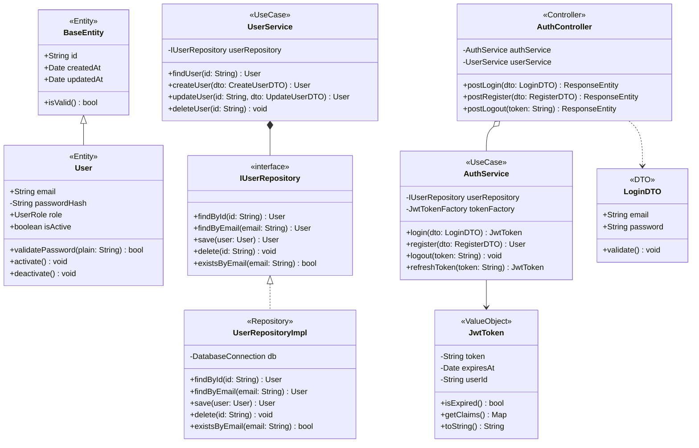

**PlantUML 範例:**

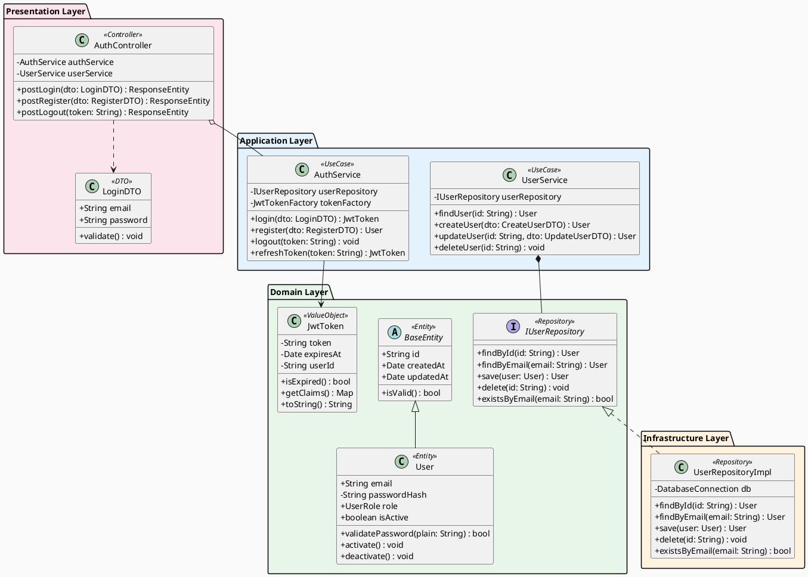

**技術說明:** 類別圖是最重要的 UML 圖，展示完整的物件模型。本範例遵循 Clean Architecture：Domain 層（User、BaseEntity、JwtToken、IUserRepository）不依賴任何外層；Application 層（UserService、AuthService）只依賴 Domain 的介面；Infrastructure 層（UserRepositoryImpl）實作 Domain 介面；Presentation 層（AuthController、LoginDTO）依賴 Application。依賴方向永遠由外往內，無循環依賴。

**白話說明:** 就像公司組織圖加上部門間的合作關係——不只看誰在哪個部門，還看誰依賴誰、誰指揮誰、誰只是借用誰的資源。箭頭的形狀告訴你「這個關係有多緊密」：實心菱形代表「沒我你就活不了」（組合），空心菱形代表「沒我你還能獨立」（聚合），虛線代表「只是臨時借用一下」（依賴）。

---

### 1.3 Object Diagram 物件圖

**何時使用 (When to use):** 需要展示某一個特定時間點的系統執行狀態，例如除錯時說明特定情境、或展示測試 fixture 的具體值。

**Mermaid 範例:**

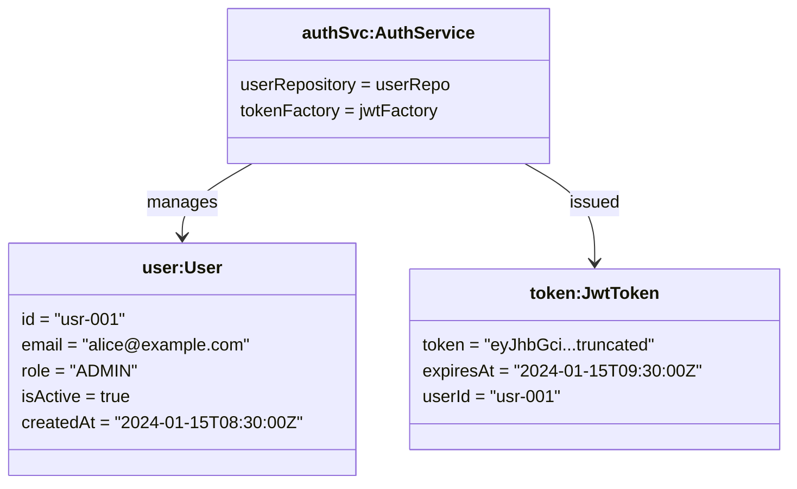

**PlantUML 範例:**

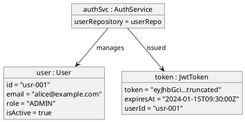

**技術說明:** 物件圖是類別圖的一個具體實例快照。所有屬性都有實際值（非型別），用於說明特定執行情境、測試案例前置條件，或除錯時的系統狀態。

**白話說明:** 就像拍一張照片——類別圖是藍圖（永遠的規則），物件圖是某一刻的實際狀態截圖。藍圖說「每個人都有名字和年齡」，照片說「現在 Alice 的 email 是 alice@example.com、Token 在 09:30 過期」。

---

### 1.4 Sequence Diagram 循序圖

**何時使用 (When to use):** 記錄 API 呼叫流程、使用者登入流程、訂單處理、任何需要展示時間順序與訊息傳遞的場景。

**Mermaid 範例:**

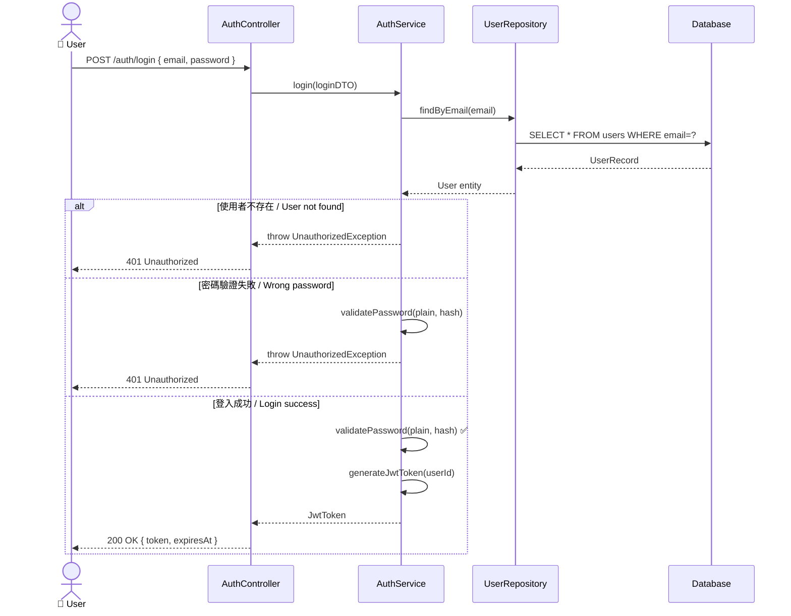

**PlantUML 範例:**

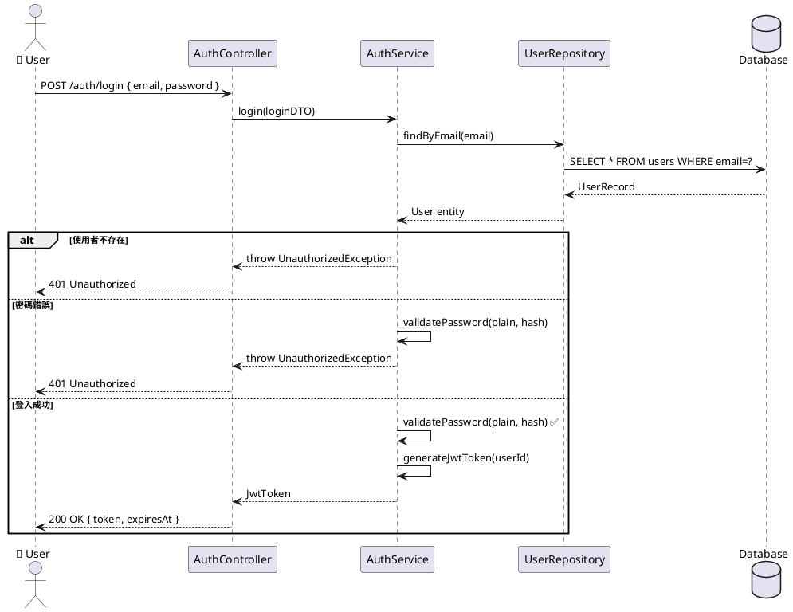

**技術說明:** 循序圖展示物件間的訊息傳遞順序，橫軸是物件（參與者），縱軸是時間。`alt`/`opt`/`loop` 框用於表達條件分支、可選行為、迴圈操作。

**白話說明:** 就像電話會議的通話記錄——誰先說話、說了什麼、對方怎麼回應，全部按時間順序記下來。從上到下看就是整個過程的時間流，很容易找出「第幾步會出錯」。

---

### 1.5 Communication Diagram 通訊圖 (Collaboration Diagram)

**何時使用 (When to use):** 強調物件之間的結構關係（而非時間順序），適合說明哪些物件彼此認識、如何協作。

**Mermaid 範例:**

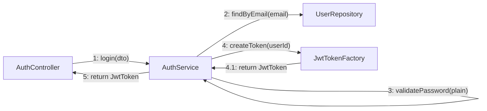

**PlantUML 範例:**

```plantuml
@startuml Communication-Login
object AuthController as AC
object AuthService as AS
object UserRepository as UR
object JwtTokenFactory as JF

AC --> AS : 1: login(dto)
AS --> UR : 2: findByEmail(email)
AS --> AS : 3: validatePassword(plain)
AS --> JF : 4: createToken(userId)
JF --> AS : 4.1: return JwtToken
AS --> AC : 5: return JwtToken
@enduml
```

**技術說明:** 通訊圖（舊稱合作圖）與循序圖語意相同，但聚焦在物件之間的連結關係，訊息上標注數字代表呼叫順序。適合用於展示「哪些物件有直接連結」的全貌。

**白話說明:** 就像辦公室白板上的討論圖——畫出哪些同事互相聯絡，旁邊標上「第1步說什麼、第2步說什麼」。比起電話通話記錄（循序圖），白板圖更容易看出誰跟誰有直接關係。

---

### 1.6 State Machine Diagram 狀態機圖

**何時使用 (When to use):** 訂單狀態、使用者帳號生命週期、支付流程、任何有明確狀態轉移規則的實體。

**Mermaid 範例:**

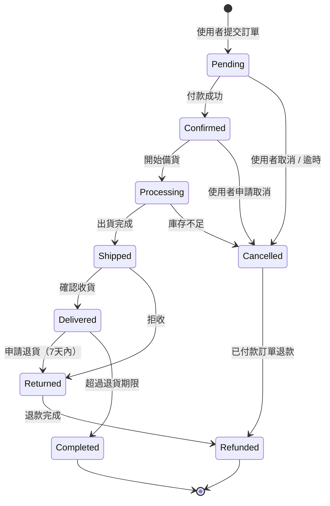

**PlantUML 範例:**

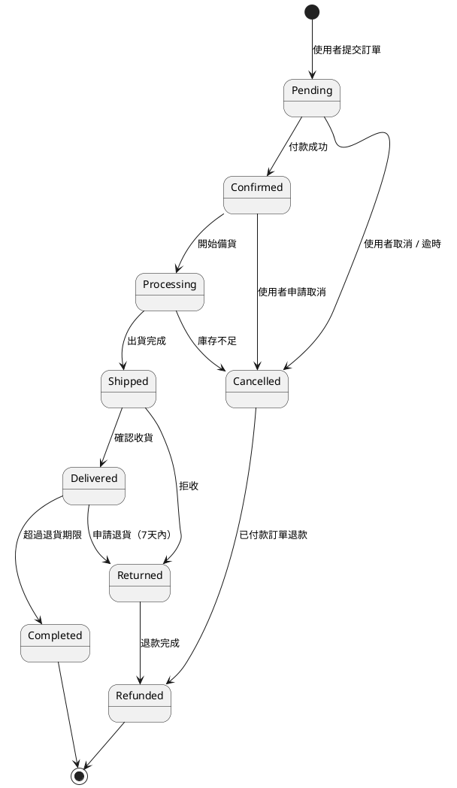

**技術說明:** 狀態機圖模型化一個實體的完整生命週期，每個節點是一個合法狀態，每條邊是一個觸發器（事件或條件）。實作時可對應到 State Pattern 或狀態欄位的有限狀態機（FSM）。

**白話說明:** 就像電梯的運作邏輯——電梯有「靜止」「上行」「下行」「開門」等狀態，每個按鈕動作決定它切換到哪個狀態。畫出狀態圖，就能確保沒有「不該存在的狀態」（例如：已取消的訂單不能再出貨）。

---

### 1.7 Activity Diagram 活動圖

**何時使用 (When to use):** 業務流程說明、演算法流程描述、需要展示平行處理或條件分支的工作流程。

**Mermaid 範例:**

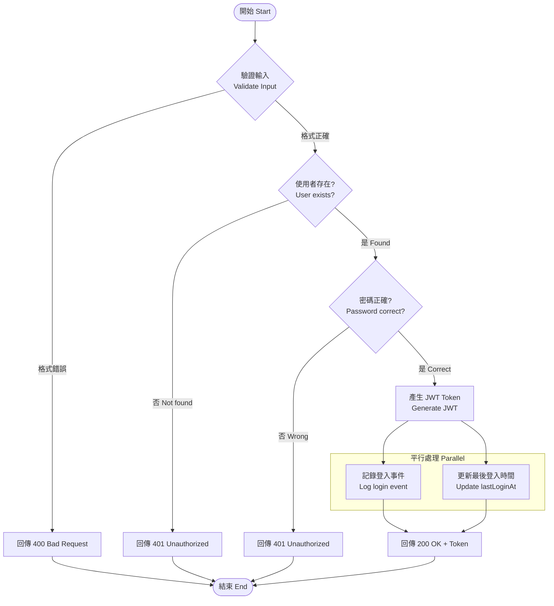

**PlantUML 範例:**

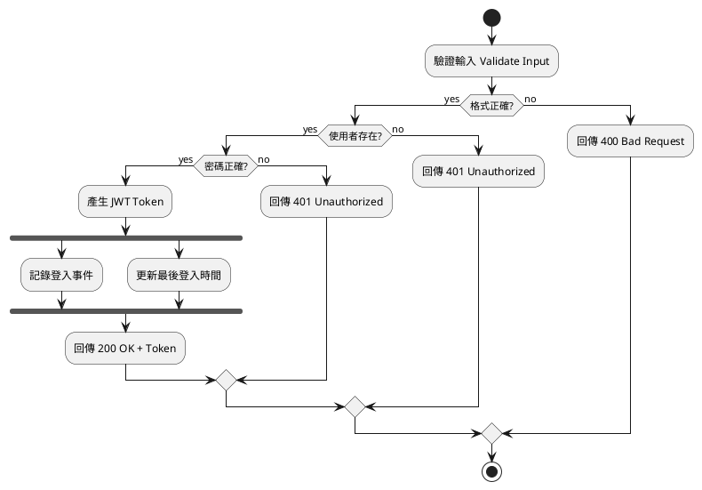

**技術說明:** 活動圖展示程序性流程，包含順序、條件、平行路徑。菱形節點是決策點，`fork/join` 代表平行執行。適合描述業務邏輯流程或複雜演算法。

**白話說明:** 就像食譜——「先燒水→加材料→等10分鐘→（夠熟？）→是→上桌，否→再等5分鐘」。活動圖把整個過程的每一步、每個「如果...就...否則...」都畫出來，任何人拿到都能照著做。

---

### 1.8 Component Diagram 元件圖

**何時使用 (When to use):** 微服務邊界定義、模組依賴說明、部署單元規劃、系統架構高層次展示。

**Mermaid 範例:**

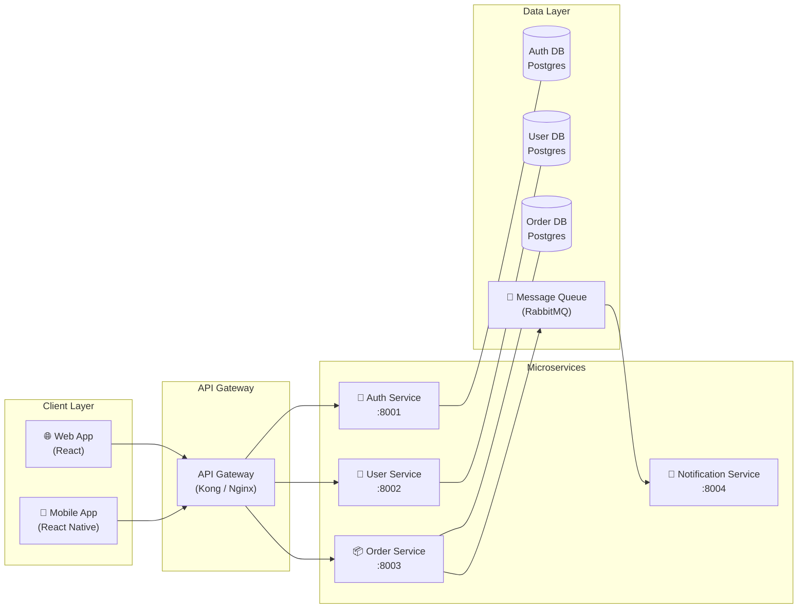

**PlantUML 範例:**

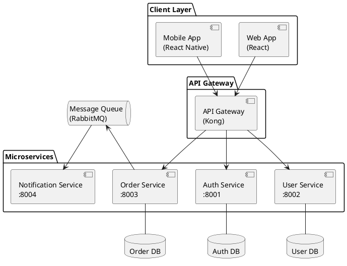

**技術說明:** 元件圖展示系統的高層次結構，每個元件是一個可獨立部署、替換或測試的單位。圖中清楚標出每個元件的介面（提供/需要），以及元件間的依賴方向。

**白話說明:** 就像樂高積木的組裝圖——每一塊積木（元件）長什麼形狀、跟哪些積木接在一起、哪些是可以單獨換掉的。看元件圖就能知道「如果我要換掉認證服務，需要動到哪些地方」。

---

### 1.9 Deployment Diagram 部署圖

**何時使用 (When to use):** 基礎設施規劃、k8s 架構說明、雲端設計、DevOps pipeline 文件。

**Mermaid 範例:**

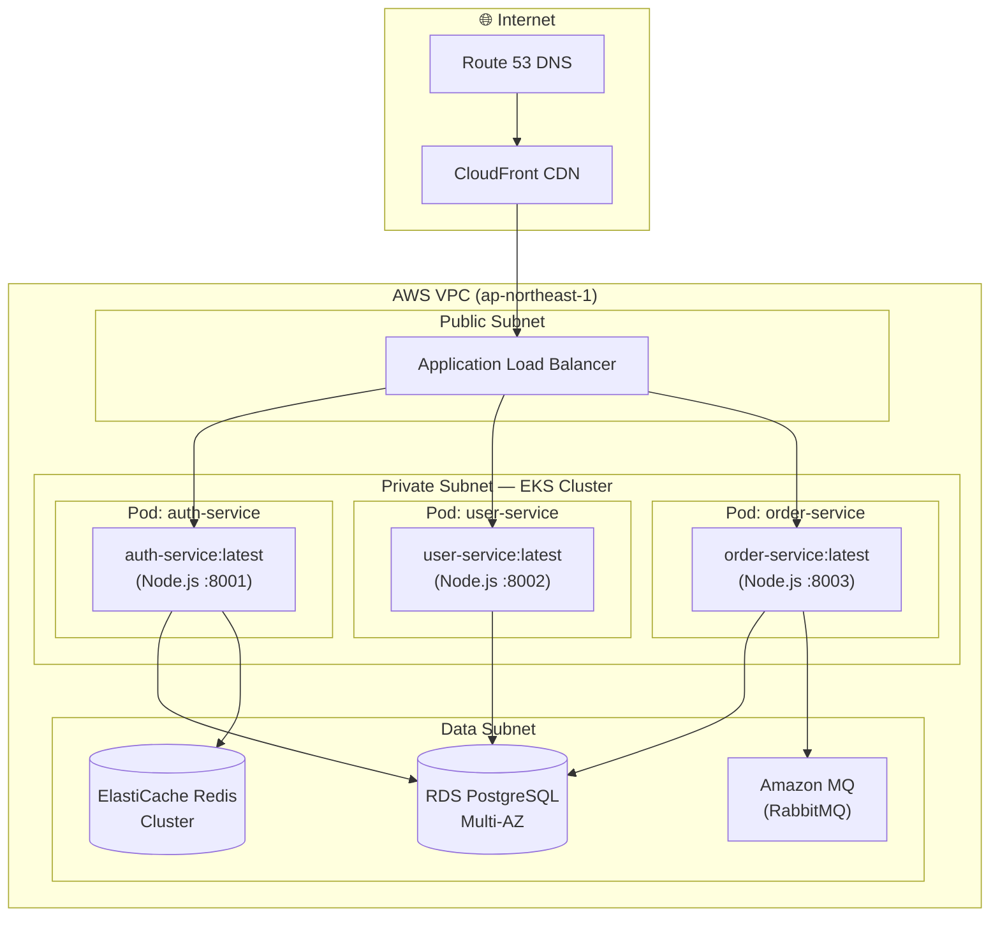

**PlantUML 範例:**

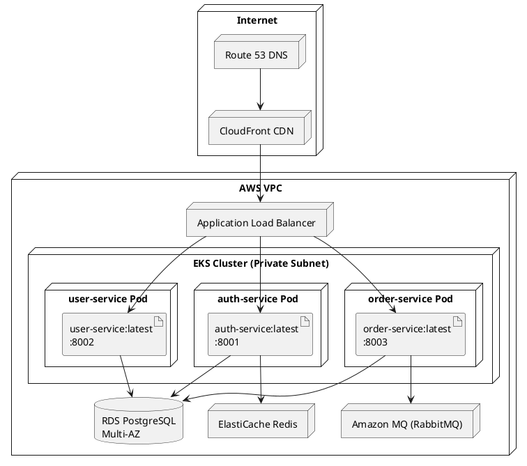

**技術說明:** 部署圖將軟體元件對應到實體/虛擬執行環境（節點）。節點代表運算資源（伺服器、容器、雲端服務），Artifact 代表部署在節點上的軟體。用於基礎設施規劃與 DevOps 文件。

**白話說明:** 就像城市地圖——哪個建築（服務）在哪塊土地（伺服器/雲端節點）上，彼此之間的道路（網路連線）怎麼連。部署圖讓 DevOps 工程師和開發者都能對齊「這個系統實際跑在哪裡」。

---

## 2. Class Diagram 深度指南 / Class Diagram Deep Dive

### 2.1 六種關聯關係 / 6 Relationship Types

| 關係類型 | Mermaid 符號 | PlantUML 符號 | 意義 | 記憶法 | 範例 |
|---------|------------|--------------|-----|------|-----|
| 繼承 Inheritance | `<\|--` | `<\|--` | is-a，子類繼承父類所有特性 | 父子關係——孩子繼承父母的基因 | `User <\|-- AdminUser` |
| 實現 Realization | `<\|..` | `..\|>` | implements，類別實作介面 | 合約履行——簽了合約就要履行 | `IUserRepository <\|.. UserRepositoryImpl` |
| 組合 Composition | `*--` | `*--` | 強擁有，生命週期相同（整體消失部分也消失） | 身體與器官——人死了心臟也消失 | `Order *-- OrderItem` |
| 聚合 Aggregation | `o--` | `o--` | 弱擁有，生命週期獨立（整體消失部分可獨立存在） | 公司與員工——公司倒了員工還在 | `Team o-- Developer` |
| 關聯 Association | `-->` | `-->` | 使用，有長期引用關係 | 朋友關係——知道對方的聯絡方式 | `AuthService --> JwtToken` |
| 依賴 Dependency | `..>` | `..>` | 臨時使用，通常是方法參數 | 搭計程車——用完就走，沒有長期關係 | `AuthController ..> LoginDTO` |

### 2.2 Clean Architecture 層次規則 / Layer Rules

```
┌─────────────────────────────────────────────────┐
│  Presentation Layer  (最外層)                    │
│  Controllers, DTOs, ViewModels                   │
│  → 依賴 Application Layer                        │
├─────────────────────────────────────────────────┤
│  Infrastructure Layer                            │
│  Repository Impl, External APIs, DB Adapters     │
│  → 實作 Domain Layer 的 interface               │
├─────────────────────────────────────────────────┤
│  Application Layer                               │
│  Use Cases, Application Services                 │
│  → 只依賴 Domain Layer                          │
├─────────────────────────────────────────────────┤
│  Domain Layer  (最內層)                         │
│  Entities, Value Objects, Domain Events          │
│  → 不依賴任何其他層                             │
└─────────────────────────────────────────────────┘
```

**依賴規則 (Dependency Rule):** 依賴只能由外往內（Presentation → Application → Domain ← Infrastructure）。Infrastructure 透過實作 Domain 的 interface 來反轉依賴方向（Dependency Inversion Principle）。

**白話說明:** 就像洋蔥——只能由外往內砍，不能由內往外長。最核心的業務規則（Domain）不知道外面有什麼資料庫或框架，這樣換資料庫時只需要改 Infrastructure 層，業務邏輯完全不受影響。

### 2.3 Design Pattern 標注慣例 / Stereotype Annotations

| Pattern | Stereotype | 使用場景 |
|---------|-----------|---------|
| Repository Pattern | `<<Repository>>`, `<<interface>>` | 資料存取層抽象化，隔離業務邏輯與資料庫 |
| Factory Pattern | `<<Factory>>` | 複雜物件的建立邏輯，避免 constructor 過於複雜 |
| Observer Pattern | `<<Observer>>`, `<<Subject>>` | 事件驅動、訂閱/發布，解耦事件產生與處理 |
| Strategy Pattern | `<<Strategy>>` | 可替換的演算法，例如不同的通知方式（Email/SMS） |
| Singleton Pattern | `<<Singleton>>` | 全域唯一實例（謹慎使用，會增加測試難度） |
| Decorator Pattern | `<<Decorator>>` | 動態增加責任，不修改原始類別 |
| Command Pattern | `<<Command>>` | 可撤銷操作、命令佇列、CQRS 的命令側 |
| Value Object | `<<ValueObject>>` | 不可變物件，以值比較（例如 Money、Email、JwtToken） |
| Entity | `<<Entity>>` | 有唯一識別符的物件，以 ID 比較 |
| DTO | `<<DTO>>` | 資料傳輸物件，無業務邏輯，只做資料承載 |
| UseCase | `<<UseCase>>` | 應用層的一個業務操作單位 |
| Controller | `<<Controller>>` | 呈現層的進入點，處理 HTTP 請求 |

---

## 3. 1:1:N 測試可追蹤性規則 / 1:1:N Test Traceability Rules

**規則 (Rules):**
- **1 個 Class → 1 個測試檔案**: 例如 `AuthService` → `auth.service.test.ts`
- **1 個 Method → N 個測試案例**: 每個 public method 最少 3 個：Success / Error / Boundary

**完整對應範例:**

| Class | Method | TC-ID | 測試類型 | 測試描述 |
|-------|--------|-------|---------|---------|
| AuthService | login() | TC-UNIT-AUTH-001-S | Unit-Success | 正確帳密登入，回傳有效 JWT Token |
| AuthService | login() | TC-UNIT-AUTH-001-E | Unit-Error | 錯誤密碼，拋出 UnauthorizedException |
| AuthService | login() | TC-UNIT-AUTH-001-B | Unit-Boundary | 密碼長度恰好 8 字元（最小值邊界） |
| AuthService | register() | TC-UNIT-AUTH-002-S | Unit-Success | 新帳號成功建立，回傳 User entity |
| AuthService | register() | TC-UNIT-AUTH-002-E | Unit-Error | 重複 email，拋出 ConflictException |
| AuthService | register() | TC-UNIT-AUTH-002-B | Unit-Boundary | email 最大長度 255 字元不超出 |
| AuthService | refreshToken() | TC-UNIT-AUTH-003-S | Unit-Success | 有效 token 換發新 token |
| AuthService | refreshToken() | TC-UNIT-AUTH-003-E | Unit-Error | 過期 token，拋出 UnauthorizedException |
| AuthService | refreshToken() | TC-UNIT-AUTH-003-B | Unit-Boundary | token 到期前 1 秒換發 |
| UserService | findUser() | TC-UNIT-USER-001-S | Unit-Success | 正確 ID 查詢，回傳 User entity |
| UserService | findUser() | TC-UNIT-USER-001-E | Unit-Error | 不存在 ID，拋出 NotFoundException |
| UserService | findUser() | TC-UNIT-USER-001-B | Unit-Boundary | UUID v4 格式驗證 |

**TC-ID 命名規則 / TC-ID Naming Convention:**

```
TC-{TYPE}-{MODULE}-{SEQ}-{CASE}
```

| 部分 | 說明 | 範例值 |
|------|-----|-------|
| TYPE | 測試類型 | UNIT / INT / E2E |
| MODULE | 功能模組縮寫 | AUTH, USER, ORDER, NOTIF |
| SEQ | 3 位數序號 | 001, 002, 003... |
| CASE | 測試情境 | S=Success, E=Error, B=Boundary |

**範例解讀:** `TC-UNIT-AUTH-001-S` = Auth 模組，第 1 個 method，成功案例的單元測試

---

## 4. PlantUML 工作流 / PlantUML Workflow

### 4.1 輸出路徑 / Output Path

所有 `.puml` 檔案統一存放於：

```
docs/diagrams/puml/
├── usecase.puml
├── class.puml
├── object.puml
├── sequence-login.puml
├── sequence-order.puml
├── communication.puml
├── statemachine-order.puml
├── activity-login.puml
├── component.puml
└── deployment.puml
```

### 4.2 預覽方式 / Preview Methods

| 方式 | 說明 | 網址/指令 |
|------|-----|---------|
| Online Editor | 直接貼上 PlantUML 語法 | https://www.plantuml.com/plantuml/uml/ |
| VSCode Extension | 即時預覽，支援匯出 PNG/SVG | 安裝 `PlantUML` by jebbs |
| HTML 嵌入 (SVG) | 用 Proxy URL 嵌入圖片 | `https://www.plantuml.com/plantuml/svg/~1{ENCODED}` |
| CLI 產生 | 本地產生 PNG/SVG 檔案 | `java -jar plantuml.jar docs/diagrams/puml/*.puml` |

### 4.3 PlantUML Class Diagram 完整範例

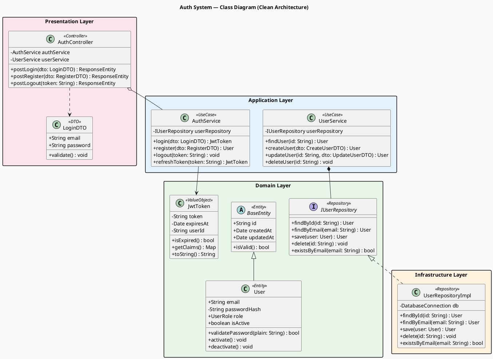

---

## 5. 品質驗收清單 / Quality Gate Checklist

在每個 Class Diagram 提交前，確認以下所有項目：

**類別圖完整性 (Diagram Completeness):**
- [ ] Class diagram 包含至少 6 個 class（含 1 個 interface）
- [ ] 全部 6 種關聯類型（Inheritance / Realization / Composition / Aggregation / Association / Dependency）至少各出現 1 次
- [ ] 每個 class 有 stereotype 標注（`<<Entity>>`, `<<UseCase>>`, `<<Repository>>` 等）
- [ ] 每個 class 標注可見性（`+` public, `-` private, `#` protected）
- [ ] 每個方法標注回傳型別

**架構正確性 (Architecture Correctness):**
- [ ] Clean Architecture 層次清晰，共 4 層（Domain / Application / Infrastructure / Presentation）
- [ ] 依賴方向正確：由外往內，無循環依賴
- [ ] Infrastructure 透過 interface 實作（Dependency Inversion）
- [ ] Domain 層不依賴任何外層

**設計模式 (Design Patterns):**
- [ ] 使用的 Design Pattern 用 stereotype 標注（`<<Repository>>`, `<<Factory>>` 等）
- [ ] Value Object 與 Entity 有明確區分
- [ ] DTO 類別只在 Presentation 層出現

**測試可追蹤性 (Test Traceability):**
- [ ] 每個 class 有對應的測試檔案（`.test.ts` / `.test.py` / `_test.go` 等）
- [ ] 每個 public method 至少有 3 個 TC-ID（S=Success / E=Error / B=Boundary）
- [ ] TC-ID 遵循命名規則 `TC-{TYPE}-{MODULE}-{SEQ}-{CASE}`

**文件品質 (Documentation Quality):**
- [ ] PlantUML `.puml` 檔案已生成在 `docs/diagrams/puml/`
- [ ] 每張圖有「技術說明」（給工程師看）
- [ ] 每張圖有「白話說明」（給非技術人員看，無術語）
- [ ] Mermaid 語法可在 GitHub / GitLab 正常渲染

---

*本文件版本: v1.0 | 最後更新: 2026-04-21*
*適用框架: NestJS / Spring Boot / Django / Laravel / 任何遵循 Clean Architecture 的專案*
