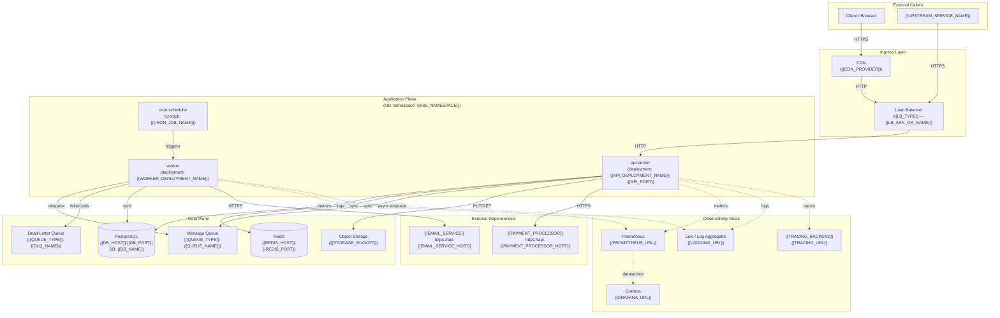
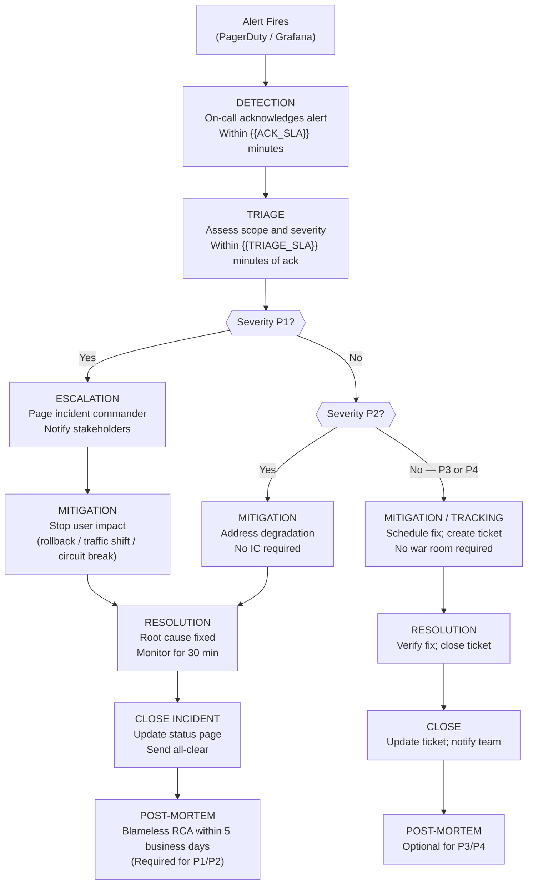
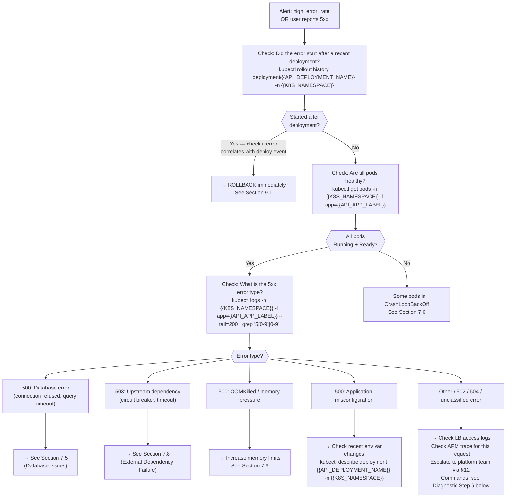
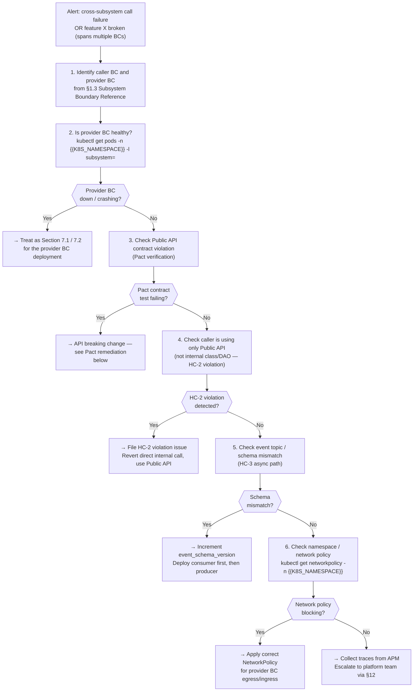

<!--
  DOC-ID:  RUNBOOK-{{PROJECT_SLUG}}-{{CREATION_DATE_YYYYMMDD}}
  Version: v1.0
  Status:  DRAFT | ACTIVE | DEPRECATED
  Owner:   {{RUNBOOK_OWNER}}          ← primary on-call escalation point; must be a named individual, not a team alias
  Date:    {{DATE}}
  Last Tested: {{LAST_TESTED_DATE}}   ← date the entire runbook was last walked through end-to-end in production or a production-like environment
  Tested By:   {{TESTER_NAME}}
  Review Cycle: Quarterly             ← update this section header whenever the cycle changes
  Upstream docs:
    - EDD:            docs/EDD.md    (Engineering Design Document — architecture decisions and data models)
    - ARCH:           docs/ARCH.md   (Architecture overview and ADRs)
    - LOCAL_DEPLOY:   docs/LOCAL_DEPLOY.md  (local development setup)
  Change log:
    v1.0  {{DATE}}  {{AUTHOR}}  Initial generated draft
-->

# {{PROJECT_NAME}} — Operations Runbook

<!-- FILL-IN INSTRUCTIONS — System Title
  Replace {{PROJECT_NAME}} with the canonical service name exactly as it appears in your monitoring dashboards
  and PagerDuty/alerting configuration. Consistency matters — on-call engineers search logs and dashboards
  by service name; mismatches waste time.

  Example: "Payments Gateway — Operations Runbook"
  Common mistake: Using a nickname ("Payments" vs "payments-gateway") that differs from the actual service name
  in Prometheus labels or Kubernetes deployment names. Document the exact string used in kubectl and Grafana.
-->

> **This runbook is the definitive operational reference for {{PROJECT_NAME}}.**
> Any on-call engineer, SRE, or automated agent arriving at 03:00 with zero prior context
> must be able to diagnose and resolve every covered failure scenario without asking anyone.
> If you find a gap, file a documentation bug immediately — that gap is a production risk.

---

## Document Control

| Field | Value |
|-------|-------|
| **DOC-ID** | RUNBOOK-{{PROJECT_SLUG}}-{{CREATION_DATE_YYYYMMDD}} |
<!-- FILL-IN: {{CREATION_DATE_YYYYMMDD}} is the date this runbook was first created (e.g., 20240115). It is set once and must NOT change on subsequent revisions — use the Change Log for version history. -->
| **Project** | {{PROJECT_NAME}} |
| **Version** | v1.0 |
| **Status** | DRAFT / ACTIVE / DEPRECATED |
| **Owner** | {{RUNBOOK_OWNER}} |
| **On-Call Rotation** | {{ONCALL_ROTATION_LINK}} |
| **Last Updated** | {{DATE}} |
| **Last Tested** | {{LAST_TESTED_DATE}} |
| **Tested By** | {{TESTER_NAME}} |
| **Next Review Due** | {{NEXT_REVIEW_DATE}} |

---

## Table of Contents

1. [System Overview](#1-system-overview)
2. [Architecture](#2-architecture)
3. [SLI / SLO / SLA Definitions](#3-sli--slo--sla-definitions)
4. [Deployment Procedures](#4-deployment-procedures)
5. [Monitoring and Alerting](#5-monitoring-and-alerting)
6. [Incident Response](#6-incident-response)
7. [Troubleshooting](#7-troubleshooting)
8. [Routine Maintenance](#8-routine-maintenance)
9. [Rollback Procedures](#9-rollback-procedures)
10. [Backup and Restore](#10-backup-and-restore)
11. [Security Procedures](#11-security-procedures)
12. [Contacts and Escalation](#12-contacts-and-escalation)
13. [Change Log](#13-change-log)
14. [On-Call Handoff](#14-on-call-handoff)
15. [Runbook Validation Procedure](#15-runbook-validation-procedure)

---

## 1. System Overview

<!-- FILL-IN INSTRUCTIONS — System Overview
  This section answers the question every on-call engineer asks first: "What does this thing DO?"
  Write 3–6 sentences covering:
    1. What the system does (business function, not technical implementation)
    2. Who depends on it (upstream callers and downstream consumers)
    3. What breaks if this system goes down
    4. Any non-obvious operational facts (e.g., "processes 2M events/day", "must complete nightly batch before 06:00 UTC")

  Example:
    "The Payments Gateway is the single point of entry for all payment instrument charges, refunds, and
    authorization holds across the {{COMPANY_NAME}} platform. It is called synchronously by the Checkout service
    and the Subscription billing daemon. If the gateway is unavailable, no new transactions can be processed
    and Checkout displays an error to users. The gateway handles approximately 4,000 transactions per minute
    at peak (Friday 20:00–22:00 UTC) and must not degrade below 500 ms p99 latency under any circumstances."

  Common mistakes:
    - Describing the technology stack instead of the business function ("It's a Node.js microservice that...").
    - Omitting the blast radius ("What breaks if this goes down?").
    - Failing to mention time-critical batch jobs that constrain maintenance windows.
-->

{{PROJECT_NAME}} is {{SYSTEM_BUSINESS_FUNCTION}}.

**Primary callers / upstream systems:**

| System | Dependency Type | Impact if Gateway Unavailable |
|--------|-----------------|-------------------------------|
| {{UPSTREAM_SYSTEM_1}} | {{SYNC_ASYNC}} | {{IMPACT_DESCRIPTION}} |
| {{UPSTREAM_SYSTEM_2}} | {{SYNC_ASYNC}} | {{IMPACT_DESCRIPTION}} |

**Primary consumers / downstream systems:**

| System | Dependency Type | Impact if Gateway Unavailable |
|--------|-----------------|-------------------------------|
| {{DOWNSTREAM_SYSTEM_1}} | {{SYNC_ASYNC}} | {{IMPACT_DESCRIPTION}} |

**Operational constraints:**

- Peak traffic window: {{PEAK_WINDOW}} (e.g., `Mon–Fri 09:00–18:00 UTC`)
- Maintenance-free window: {{MAINTENANCE_FREE_WINDOW}} (e.g., `Fri 18:00 UTC — Mon 06:00 UTC is unrestricted; nightly batch runs 02:00–04:00 UTC — no restarts during this window`)
- Data classification: {{DATA_CLASSIFICATION}} (e.g., `PCI DSS Cardholder Data — requires security approval for any schema or config change`)
- Geographic footprint: {{REGIONS}} (e.g., `us-east-1 primary, eu-west-1 failover`)

### 1.1 Tech Stack Summary

<!-- Source: EDD §3.3 技術棧總覽 — this table is a read-only extract; update EDD §3.3 first, then sync here.
  Purpose: gives an on-call engineer immediate answers to "what language / framework / DB is this?" without
  opening EDD. Must reflect the currently deployed version, not the version in development.

  Common mistakes:
    - Leaving version fields blank. Version mismatch is the first thing SRE checks after a crash.
    - Omitting Runtime Platform — "Python" tells you nothing; "Python 3.12 on Lambda" tells you everything.
    - Listing the planned future version instead of the currently deployed one.
-->

| Layer | Technology | Deployed Version | Notes |
|-------|-----------|-----------------|-------|
| **Backend Language** | {{BACKEND_LANG}} | {{BACKEND_LANG_VERSION}} | Source: EDD §3.3 |
| **Runtime Platform** | {{RUNTIME_PLATFORM}} | {{RUNTIME_VERSION}} | e.g. Node.js 20 LTS / JVM 21 / Python 3.12 / Go 1.22 |
| **Web / API Framework** | {{FRAMEWORK}} | {{FRAMEWORK_VERSION}} | |
| **ORM / Data Access** | {{ORM}} | {{ORM_VERSION}} | |
| **Database** | {{DB}} | {{DB_VERSION}} | |
| **Cache** | {{CACHE}} | {{CACHE_VERSION}} | |
| **Message Queue** | {{MQ}} | {{MQ_VERSION}} | |
| **Auth Library** | {{AUTH_LIB}} | {{AUTH_LIB_VERSION}} | |
| **Container Runtime** | Docker | {{DOCKER_VERSION}} | Base image: `{{BASE_IMAGE}}:{{BASE_IMAGE_TAG}}` |
| **Container Orchestration** | Kubernetes | {{K8S_VERSION}} | {{K8S_SERVICE}} |
| **CI/CD Platform** | {{CICD}} | — | |
| **Frontend Language** | {{FRONTEND_LANG}} | {{FRONTEND_LANG_VERSION}} | N/A if backend-only API service |
| **Frontend Framework** | {{FRONTEND_FRAMEWORK}} | {{FRONTEND_FW_VERSION}} | N/A if backend-only API service |

> For technology selection rationale, see **EDD §3.3**. For version upgrade history, see the [Change Log](#13-change-log).

### 1.2 Deployment Environment

<!-- Source: EDD §3.5 部署環境規格 — update EDD §3.5 first, then sync here.
  Purpose: gives an on-call engineer the minimum context to know WHICH environment they are operating in
  and HOW to reach it, without reading EDD.

  Common mistakes:
    - Writing only "production cluster" without the actual kubectl context name — every kubectl command then
      requires a lookup. Document the exact string used with `kubectl config use-context`.
    - Omitting namespace — without it every kubectl command that omits -n silently hits the wrong namespace.
    - Hardcoding credentials. Use Secret Manager paths only; never paste passwords or tokens here.
-->

| Field | Value |
|-------|-------|
| **Cloud Provider** | {{CLOUD_PROVIDER}} |
| **Primary Region** | {{PRIMARY_REGION}} |
| **DR / Failover Region** | {{DR_REGION}} |
| **K8s Managed Service** | {{K8S_SERVICE}} |
| **Production K8s Cluster** | `{{PROD_CLUSTER}}` |
| **Production K8s Namespace** | `{{PROD_NAMESPACE}}` |
| **Switch to Prod Context** | `kubectl config use-context {{PROD_K8S_CONTEXT}}` |
| **Container Registry** | `{{REGISTRY_URL}}` |
| **Docker Base Image** | `{{BASE_IMAGE}}:{{BASE_IMAGE_TAG}}` |
| **Image Tag Strategy** | {{IMAGE_TAG_STRATEGY}} (e.g. `git-sha8`, `semver`) |
| **Secret Manager** | {{SECRET_MANAGER}} |
| **Secret Path Prefix** | `{{SECRET_PATH_PREFIX}}` |

**Environment Quick Reference:**

| Environment | K8s Namespace | kubectl Context | API Replicas | DB Type | Access |
|-------------|---------------|-----------------|--------------|---------|--------|
| Development | `{{DEV_NAMESPACE}}` | `{{DEV_K8S_CONTEXT}}` | {{DEV_API_REPLICAS}} | {{DEV_DB_TYPE}} | All developers |
| Staging | `{{STAGING_NAMESPACE}}` | `{{STAGING_K8S_CONTEXT}}` | {{STAGING_API_REPLICAS}} | {{STG_DB_TYPE}} | Dev + QA, VPN required |
| Production | `{{PROD_NAMESPACE}}` | `{{PROD_K8S_CONTEXT}}` | {{PROD_API_REPLICAS}} | {{PROD_DB_TYPE}} | SRE + approved on-call, MFA + audit trail |

> For complete resource limits (CPU / memory), replica HPA ranges, DB host patterns, and Redis endpoints per environment, see **EDD §3.5**.

---

### 1.3 子系統邊界參考（Subsystem Boundary Reference）

> 對應 EDD §3.4 Schema Ownership 和 ARCH §4 服務邊界。On-call 工程師快速識別每個 K8s Deployment 歸屬哪個 BC、擁有哪些 DB Schema、對外提供哪些 API Prefix 和 Event Topics。

| Bounded Context | K8s Deployment | Owning DB Schema | Public API Prefix | Event Topics |
|----------------|---------------|-----------------|------------------|-------------|
| `member` | `{{PROD_NAMESPACE}}/member-api` | `member`: `users`, `sessions` | `/api/v1/members/` | `member.users.*` |
| `wallet` | `{{PROD_NAMESPACE}}/wallet-api` | `wallet`: `wallets`, `transactions` | `/api/v1/wallets/` | `wallet.transactions.*` |
| `deposit` | `{{PROD_NAMESPACE}}/deposit-api` | `deposit`: `deposit_requests` | `/api/v1/deposits/` | `deposit.requests.*` |
| `lobby` | `{{PROD_NAMESPACE}}/lobby-api` | `lobby`: `games`, `categories` | `/api/v1/lobby/` | `lobby.games.*` |
| `game` | `{{PROD_NAMESPACE}}/game-api` | `game`: `game_rounds`, `bets` | `/api/v1/games/` | `game.rounds.*` |
| `{{bc_name}}` | `{{namespace}}/{{deployment}}` | `{{schema}}`: `{{tables}}` | `/api/v1/{{prefix}}/` | `{{bc}}.{{entity}}.*` |

> 跨子系統 API 呼叫路徑（Troubleshooting 參考）：
> - 不同 BC 的 API 有獨立的 `/api/v1/{bc}/` prefix
> - 任何跨 BC 呼叫失敗，先確認對方 BC 的 Deployment 是否健康（見 §7.X 跨子系統 API 呼叫失敗）

---

## 2. Architecture

<!-- FILL-IN INSTRUCTIONS — Architecture
  Provide two representations:
    1. A Mermaid diagram showing the runtime topology (services, databases, queues, external dependencies).
    2. A component table listing every named service with its Kubernetes namespace/deployment name,
       the port it listens on, and the URL pattern used to health-check it.

  The diagram must use real service names as they appear in kubectl and your service mesh, not logical names.
  Annotate synchronous vs asynchronous paths.

  Example diagram node label: "api-server\n(k8s: payments/api-server)"

  Common mistakes:
    - Using a logical diagram that does not reflect the actual Kubernetes resource names.
    - Omitting external dependencies (payment processors, CDNs, third-party APIs) — these are the most common
      source of on-call incidents.
    - Showing only the happy path without the retry/DLQ paths that matter during incidents.
-->

### 2.1 Runtime Topology



### 2.2 Component Inventory

<!-- FILL-IN INSTRUCTIONS — Component Inventory
  List every deployable unit. "Health Check URL" must be a URL that returns HTTP 200 when the component
  is healthy — this is what PagerDuty, load balancers, and your on-call engineer use to confirm recovery.
  Include the kubectl command to get pod status because this is the first thing an SRE runs.

  Example row:
    | api-server | payments | payments/api-server | 8080 | https://payments.internal/health | kubectl get pods -n payments -l app=api-server |
-->

| Component | K8s Namespace | K8s Deployment | Port | Health Check URL | Status Command |
|-----------|---------------|----------------|------|-----------------|----------------|
| api-server | `{{K8S_NAMESPACE}}` | `{{API_DEPLOYMENT_NAME}}` | `{{API_PORT}}` | `{{API_HEALTH_URL}}` | `kubectl get pods -n {{K8S_NAMESPACE}} -l app={{API_APP_LABEL}}` |
| worker | `{{K8S_NAMESPACE}}` | `{{WORKER_DEPLOYMENT_NAME}}` | N/A | `{{WORKER_HEALTH_URL}}` | `kubectl get pods -n {{K8S_NAMESPACE}} -l app={{WORKER_APP_LABEL}}` |
| cron-scheduler | `{{K8S_NAMESPACE}}` | `{{CRON_JOB_NAME}}` | N/A | N/A | `kubectl get cronjob {{CRON_JOB_NAME}} -n {{K8S_NAMESPACE}}` |
| PostgreSQL | `{{DB_NAMESPACE}}` | `{{DB_DEPLOYMENT_NAME}}` | `{{DB_PORT}}` | `pg_isready -h {{DB_HOST}} -p {{DB_PORT}} -U {{DB_USER}}` | `kubectl get pods -n {{DB_NAMESPACE}} -l app={{DB_APP_LABEL}}` |
| Redis | `{{REDIS_NAMESPACE}}` | `{{REDIS_DEPLOYMENT_NAME}}` | `{{REDIS_PORT}}` | `redis-cli -h {{REDIS_HOST}} ping` | `kubectl get pods -n {{REDIS_NAMESPACE}} -l app={{REDIS_APP_LABEL}}` |

### 2.3 Network and Port Reference

| Service | Protocol | Port | Accessible From | Notes |
|---------|----------|------|-----------------|-------|
| api-server (public) | HTTPS | 443 | Internet via LB | TLS terminated at LB |
| api-server (internal) | HTTP | `{{API_PORT}}` | `{{K8S_NAMESPACE}}` namespace | Direct pod-to-pod |
| PostgreSQL | TCP | `{{DB_PORT}}` | App namespace only | Not exposed externally |
| Redis | TCP | `{{REDIS_PORT}}` | App namespace only | Not exposed externally |
| Prometheus | HTTP | 9090 | Ops VPN only | `{{PROMETHEUS_URL}}` |
| Grafana | HTTPS | 443 | Ops VPN only | `{{GRAFANA_URL}}` |

---

## 3. SLI / SLO / SLA Definitions

<!-- FILL-IN INSTRUCTIONS — SLI/SLO/SLA
  SLI (Service Level Indicator): the specific metric you measure. Must be a concrete measurement.
  SLO (Service Level Objective): the target value for an SLI over a rolling window. This is your internal target.
  SLA (Service Level Agreement): the contractual commitment to customers. Always less strict than the SLO.
  Error Budget: (1 - SLO) × window. Below 20% remaining = freeze non-emergency changes.

  Example SLI: "Proportion of HTTP requests to /api/v1/* returning 2xx or 3xx, measured over 5-minute windows"
  Example SLO: "99.9% of requests succeed over any rolling 30-day window"
  Example SLA: "99.5% monthly uptime per the Customer Agreement"

  Common mistakes:
    - Defining SLOs without a measurement window ("99.9% uptime" means nothing without specifying the period).
    - Failing to define what "availability" means for your system (is a 500 error a failure? a 504?).
    - Not including latency SLOs (availability without latency is meaningless for user-facing APIs).
    - Omitting the error budget and what triggers a change freeze.
-->

### 3.1 Service Level Indicators

| SLI Name | What Is Measured | Measurement Method | Measurement Window |
|----------|-----------------|--------------------|--------------------|
| **Availability** | Proportion of HTTP requests returning 2xx or 3xx, excluding health check probes | Prometheus: `sum(rate(http_requests_total{status=~"2..\|3..",path!~"/health\|/healthz\|/readyz"}[5m])) / sum(rate(http_requests_total{path!~"/health\|/healthz\|/readyz"}[5m]))` | 5-minute rolling |
| **Latency p50** | Median response time for all API requests, excluding health check probes | Prometheus: `histogram_quantile(0.50, rate(http_request_duration_seconds_bucket{path!~"/health\|/healthz\|/readyz"}[5m]))` | 5-minute rolling |
| **Latency p99** | 99th percentile response time for all API requests, excluding health check probes | Prometheus: `histogram_quantile(0.99, rate(http_request_duration_seconds_bucket{path!~"/health\|/healthz\|/readyz"}[5m]))` | 5-minute rolling |
| **Error Rate** | Proportion of requests returning 5xx, excluding health check probes | Prometheus: `sum(rate(http_requests_total{status=~"5..",path!~"/health\|/healthz\|/readyz"}[5m])) / sum(rate(http_requests_total{path!~"/health\|/healthz\|/readyz"}[5m]))` | 5-minute rolling |
| **Queue Depth** | Number of unprocessed messages in the job queue | Prometheus: `{{QUEUE_DEPTH_METRIC}}` | 1-minute rolling |
| **{{CUSTOM_SLI_NAME}}** | {{CUSTOM_SLI_DESCRIPTION}} | `{{CUSTOM_SLI_QUERY}}` | {{CUSTOM_SLI_WINDOW}} |

### 3.2 Service Level Objectives

| SLI | SLO Target | Rolling Window | Error Budget (30 days) | Grafana Dashboard |
|-----|-----------|----------------|------------------------|-------------------|
| Availability | ≥ {{AVAILABILITY_SLO}}% (e.g., `99.9%`) | 30 days | {{ERROR_BUDGET_MINUTES}} min downtime (e.g., `43.8 min`) | [Link]({{GRAFANA_SLO_DASHBOARD}}) |
| Latency p99 | ≥ {{P99_SLO_RATIO}}% of requests complete within {{P99_TARGET_MS}} ms (e.g., `99%` within `500ms`) | 30 days | {{P99_ERROR_BUDGET_MINUTES}} min of slow requests (e.g., `43.8 min`) | [Link]({{GRAFANA_LATENCY_DASHBOARD}}) |
| Error Rate | ≤ {{ERROR_RATE_SLO}}% (e.g., `0.1%`) | 30 days | {{ERROR_RATE_BUDGET_MINUTES}} min of elevated errors (e.g., `43.8 min`) | [Link]({{GRAFANA_ERROR_DASHBOARD}}) |
| Queue Depth | ≤ {{QUEUE_DEPTH_MAX}} messages (e.g., `1000`) | 5 min | Operational threshold — not error-budget tracked | [Link]({{GRAFANA_QUEUE_DASHBOARD}}) |

<!-- NOTE: Latency p50 is tracked for operational awareness but is not error-budget tracked. Queue Depth is an
     operational threshold alert, not an SLO. Budget-tracked SLOs are Availability, Latency p99 ratio, and Error Rate. -->

**Current error budget consumption (PromQL):**

```promql
# Availability error budget consumed (fraction of 30-day budget used so far)
1 - (
  sum_over_time(
    (sum(rate(http_requests_total{status=~"2..|3..",path!~"/health|/healthz|/readyz"}[5m]))
     / sum(rate(http_requests_total{path!~"/health|/healthz|/readyz"}[5m])))[30d:5m]
  ) / count_over_time(
    (sum(rate(http_requests_total{path!~"/health|/healthz|/readyz"}[5m])))[30d:5m]
  )
) / (1 - {{AVAILABILITY_SLO_DECIMAL}})

# Latency p99 error budget consumed (proportion of requests violating the threshold)
1 - (
  sum_over_time(
    (sum(rate(http_request_duration_seconds_bucket{le="{{P99_TARGET_SECONDS}}",path!~"/health|/healthz|/readyz"}[5m]))
     / sum(rate(http_request_duration_seconds_count{path!~"/health|/healthz|/readyz"}[5m])))[30d:5m]
  ) / count_over_time(vector(1)[30d:5m])
) / (1 - {{P99_SLO_RATIO_DECIMAL}})
```

**Multi-window burn rate alert rules:**

```yaml
# Critical burn rate: consuming error budget 14.4× faster than sustainable
# Fires when: error budget will be exhausted in ~2 days at current rate
- alert: {{PROJECT_SLUG}}_slo_burn_rate_critical
  expr: |
    (
      sum(rate(http_requests_total{status=~"5..",path!~"/health|/healthz|/readyz"}[5m]))
      / sum(rate(http_requests_total{path!~"/health|/healthz|/readyz"}[5m]))
    ) > (14.4 * {{ERROR_RATE_SLO_DECIMAL}})
    AND
    (
      sum(rate(http_requests_total{status=~"5..",path!~"/health|/healthz|/readyz"}[1h]))
      / sum(rate(http_requests_total{path!~"/health|/healthz|/readyz"}[1h]))
    ) > (14.4 * {{ERROR_RATE_SLO_DECIMAL}})
  for: 2m
  labels:
    severity: critical
  annotations:
    summary: "SLO critical burn rate — error budget exhaustion in ~2 days"
    dashboard: "{{GRAFANA_SLO_DASHBOARD}}"

# Warning burn rate: consuming error budget 6× faster than sustainable
# Fires when: error budget will be exhausted in ~5 days at current rate
- alert: {{PROJECT_SLUG}}_slo_burn_rate_warning
  expr: |
    (
      sum(rate(http_requests_total{status=~"5..",path!~"/health|/healthz|/readyz"}[30m]))
      / sum(rate(http_requests_total{path!~"/health|/healthz|/readyz"}[30m]))
    ) > (6 * {{ERROR_RATE_SLO_DECIMAL}})
    AND
    (
      sum(rate(http_requests_total{status=~"5..",path!~"/health|/healthz|/readyz"}[6h]))
      / sum(rate(http_requests_total{path!~"/health|/healthz|/readyz"}[6h]))
    ) > (6 * {{ERROR_RATE_SLO_DECIMAL}})
  for: 15m
  labels:
    severity: warning
  annotations:
    summary: "SLO warning burn rate — error budget exhaustion in ~5 days"
    dashboard: "{{GRAFANA_SLO_DASHBOARD}}"
```

**Error budget policy:**

- Error budget remaining ≥ 20%: normal operations, new feature deployments allowed.
- Error budget remaining < 20%: change freeze on non-emergency deployments; SRE review required for any production change.
- Error budget remaining < 5%: incident declared, executive escalation, all engineering focus on reliability.

#### Subsystem-level SLO Label Design (Spring Modulith HC-1)

Each instrumented service must emit a `subsystem` label on all HTTP and event metrics so that SLOs can be sliced per Bounded Context. This enables independent error-budget tracking when individual subsystems are extracted to separate deployments.

**Required Prometheus label on every HTTP metric:**

```yaml
# Kubernetes Deployment template — add to each Spring Boot container
env:
  - name: MANAGEMENT_METRICS_TAGS_SUBSYSTEM
    value: "{{bc_name}}"   # e.g. member | wallet | deposit | lobby | game
```

**Per-subsystem availability SLI (example):**

```promql
# Availability for the "member" subsystem only
sum(rate(http_requests_total{status=~"2..|3..",path!~"/health.*",subsystem="member"}[5m]))
/ sum(rate(http_requests_total{path!~"/health.*",subsystem="member"}[5m]))
```

**Subsystem SLO reference table (fill in concrete targets):**

| Subsystem | `subsystem=` label | Availability SLO | p99 Latency SLO | Grafana Panel |
|-----------|-------------------|------------------|-----------------|---------------|
| Member | `member` | {{MEMBER_AVAIL_SLO}}% | ≤ {{MEMBER_P99_MS}} ms | [Link]({{GRAFANA_MEMBER_PANEL}}) |
| Wallet | `wallet` | {{WALLET_AVAIL_SLO}}% | ≤ {{WALLET_P99_MS}} ms | [Link]({{GRAFANA_WALLET_PANEL}}) |
| Deposit | `deposit` | {{DEPOSIT_AVAIL_SLO}}% | ≤ {{DEPOSIT_P99_MS}} ms | [Link]({{GRAFANA_DEPOSIT_PANEL}}) |
| Lobby | `lobby` | {{LOBBY_AVAIL_SLO}}% | ≤ {{LOBBY_P99_MS}} ms | [Link]({{GRAFANA_LOBBY_PANEL}}) |
| Game | `game` | {{GAME_AVAIL_SLO}}% | ≤ {{GAME_P99_MS}} ms | [Link]({{GRAFANA_GAME_PANEL}}) |

> **Cross-subsystem call latency alert**: When a caller subsystem's p99 degrades but internal metrics are healthy, the root cause is often a downstream BC. Use `upstream_subsystem` label on outbound HTTP client metrics to pinpoint the provider BC.

### 3.3 Customer SLA

| Commitment | Target | Measurement Period | Breach Consequence |
|------------|--------|--------------------|--------------------|
| Uptime | {{SLA_UPTIME}}% (e.g., `99.5%`) | Monthly calendar | {{SLA_BREACH_CONSEQUENCE}} (e.g., service credits as defined in the Customer Agreement — see `{{CONTRACT_URL}}`) |
| Support Response (P1) | < {{P1_RESPONSE_TIME}} (e.g., `1 hour`) | Per incident | {{SLA_BREACH_CONSEQUENCE}} |
| Support Response (P2) | < {{P2_RESPONSE_TIME}} (e.g., `4 hours`) | Per incident | {{SLA_BREACH_CONSEQUENCE}} |

---

## 4. Deployment Procedures

<!-- FILL-IN INSTRUCTIONS — Deployment Procedures
  Every step must have an "Expected Result" and an "If This Fails" action.
  The person performing the deployment may be the most junior on-call engineer; write accordingly.
  Include the exact git tag format, image tag format, and the kubectl commands verbatim.
  Annotate which steps require VPN access, which require elevated IAM/RBAC permissions,
  and which steps are irreversible.

  Common mistakes:
    - "Deploy via CI" without specifying the exact pipeline URL or trigger command.
    - Omitting the verification step after deployment (the deployment is not done until traffic is confirmed healthy).
    - Not calling out the maintenance window restriction from Section 1.
-->

### 4.1 Pre-Deployment Checklist

Before initiating any production deployment, confirm all of the following:

- [ ] The deployment is not inside the maintenance-free window defined in Section 1.
- [ ] Error budget remaining ≥ 20% (check `{{GRAFANA_SLO_DASHBOARD}}`).
- [ ] No active P1 or P2 incidents (check `{{INCIDENT_TRACKER_URL}}`).
- [ ] The release branch has passed all CI checks: `gh run list --branch {{RELEASE_BRANCH}} --limit 5`.
- [ ] The Docker image to be deployed has been validated in staging: `{{STAGING_URL}}/health`.
- [ ] A rollback plan is confirmed (see Section 9).
- [ ] At least one additional engineer is aware of the deployment and reachable.
- [ ] Deployment is announced in `{{DEPLOY_ANNOUNCE_CHANNEL}}` with the format: `[DEPLOY] {{PROJECT_NAME}} vX.Y.Z — starting now. Rollback: @{{ROLLBACK_CONTACT}}`.

### 4.2 Standard Deployment (Rolling Update)

This procedure triggers zero-downtime deployment via Kubernetes rolling update. Use this for all non-emergency releases.

**Step 0: Verify Kubernetes context**

```bash
kubectl config current-context
# Expected output: {{PRODUCTION_KUBE_CONTEXT}}
# If the output does not match exactly, STOP. Do not proceed until you are on the correct context.
# Switch with: kubectl config use-context {{PRODUCTION_KUBE_CONTEXT}}
```

**Step 1: Tag the release**

```bash
git checkout main
git pull origin main
git tag v{{NEXT_VERSION}}    # Example: v2.3.1
git push origin v{{NEXT_VERSION}}
```

Expected result: GitHub Actions pipeline `deploy.yml` triggers within 30 seconds. Verify at `{{CI_PIPELINE_URL}}`.

If this fails: Check `gh run list --workflow=deploy.yml --limit 5` for errors. Do not proceed until CI is green.

---

**Step 2: Monitor the pipeline**

```bash
# Watch pipeline status in real time
gh run watch --repo {{GH_OWNER}}/{{GH_REPO}}
```

Expected result: All stages (build, test, push, deploy) show a green checkmark. Total duration: approximately {{PIPELINE_DURATION}} minutes.

If this fails: Note the failing stage, open the pipeline URL, read the error logs. See Section 7 (Troubleshooting) for common CI failures.

---

**Step 3: Verify rolling update progress**

```bash
kubectl rollout status deployment/{{API_DEPLOYMENT_NAME}} -n {{K8S_NAMESPACE}}
# Expected output: "deployment.apps/{{API_DEPLOYMENT_NAME}} successfully rolled out"

kubectl rollout status deployment/{{WORKER_DEPLOYMENT_NAME}} -n {{K8S_NAMESPACE}}
# Expected output: "deployment.apps/{{WORKER_DEPLOYMENT_NAME}} successfully rolled out"
```

Expected result: Both commands exit with status 0 within {{ROLLOUT_TIMEOUT}} minutes.

If this fails: Run `kubectl describe deployment {{API_DEPLOYMENT_NAME}} -n {{K8S_NAMESPACE}}` and look for `Warning` events. Common causes: image pull error, OOMKilled, failing readiness probe. See Section 7.1.

---

**Step 4: Verify application health**

```bash
# Health endpoint (returns HTTP 200 and JSON body)
curl -sf {{API_HEALTH_URL}} | jq .
# Expected: {"status":"ok","version":"{{NEXT_VERSION}}","db":"connected","cache":"connected"}

# Check pod readiness
kubectl get pods -n {{K8S_NAMESPACE}} -l app={{API_APP_LABEL}}
# Expected: all pods show STATUS=Running and READY=1/1 (or N/N for your container count)
```

Expected result: Health endpoint returns HTTP 200. All pods show `Running` and `Ready`.

If this fails: A pod is failing its readiness probe. Run `kubectl logs <pod-name> -n {{K8S_NAMESPACE}} --previous` to read crash logs. Initiate rollback (Section 9) if the service is user-facing and degraded.

---

**Step 5: Smoke test**

<!-- FILL-IN: Specify the smoke test script details below:
  - Repo path: the exact path relative to repo root (e.g., scripts/smoke-test.sh)
  - What it tests: list the critical user flows it covers (e.g., login, checkout, data read)
  - Expected completion time: how long the suite takes (e.g., ~2 minutes)
  - Exit codes: 0 = pass, 1 = non-critical failure, 2 = critical failure requiring rollback
  Example: ./scripts/smoke-test.sh tests: user login (POST /api/v1/auth), order creation (POST /api/v1/orders),
           order status read (GET /api/v1/orders/:id). Runs in ~90 seconds. Exit 0 = all pass, exit 1 = partial,
           exit 2 = critical path failure (rollback required).
-->

```bash
# Run the automated smoke test suite against production
./scripts/smoke-test.sh --env production
# Repo path: {{SMOKE_TEST_SCRIPT_PATH}}
# Tests:     {{SMOKE_TEST_COVERAGE_DESCRIPTION}}
# Duration:  approximately {{SMOKE_TEST_DURATION}}
# Exit 0:    all assertions passed
# Exit 1:    non-critical assertion failed (open incident, continue monitoring)
# Exit 2:    critical user flow failed (initiate rollback immediately)
```

Expected result: All smoke test assertions pass. Script exits with code 0.

If this fails: Identify which test failed. If it is a critical user flow (login, checkout, data read), initiate rollback immediately. If it is a non-critical auxiliary feature, open an incident and continue monitoring.

---

**Step 6: Post-deployment confirmation**

```bash
# Confirm the new version is serving traffic
curl -sf {{API_HEALTH_URL}} | jq '.version'
# Expected: "{{NEXT_VERSION}}"

# Check error rate for 5 minutes post-deploy
# Open: {{GRAFANA_ERROR_DASHBOARD}} — look for any spike above baseline
```

Expected result: Version string matches the deployed tag. Error rate remains within SLO bounds (see Section 3).

Announce in `{{DEPLOY_ANNOUNCE_CHANNEL}}`: `[DEPLOY] {{PROJECT_NAME}} v{{NEXT_VERSION}} — deployed and verified. ✓`

### 4.3 Emergency Hotfix Deployment

Use this procedure only when a critical production defect requires a fix outside the normal release cycle.

**Requirements before proceeding:**

- P1 incident is open (see Section 6).
- The incident commander has authorized the hotfix deployment.
- The fix is in a branch named `hotfix/{{TICKET_ID}}-short-description`.

```bash
# Step 0: Verify Kubernetes context
kubectl config current-context
# Expected output: {{PRODUCTION_KUBE_CONTEXT}}
# If the output does not match exactly, STOP and switch context first.

# Step 1: Merge hotfix to main and tag
git checkout main && git pull origin main
git merge --no-ff hotfix/{{TICKET_ID}}-short-description
git tag v{{HOTFIX_VERSION}}   # Increment patch version: v2.3.1 → v2.3.2
git push origin main v{{HOTFIX_VERSION}}

# Step 2: Monitor CI/CD pipeline
gh run watch --repo {{GH_OWNER}}/{{GH_REPO}}
# Expected result: all stages (build, test, push, deploy) green. Duration: ~{{PIPELINE_DURATION}} minutes.
# If this fails: read the failing stage logs; do not proceed until CI is green.

# Step 3: Verify rolling update progress
kubectl rollout status deployment/{{API_DEPLOYMENT_NAME}} -n {{K8S_NAMESPACE}}
# Expected output: "deployment.apps/{{API_DEPLOYMENT_NAME}} successfully rolled out"
kubectl rollout status deployment/{{WORKER_DEPLOYMENT_NAME}} -n {{K8S_NAMESPACE}}
# Expected output: "deployment.apps/{{WORKER_DEPLOYMENT_NAME}} successfully rolled out"
# If this fails: run kubectl describe deployment {{API_DEPLOYMENT_NAME}} -n {{K8S_NAMESPACE}}
#   and look for Warning events. Common causes: image pull error, OOMKilled, failing readiness probe.

# Step 4: Verify application health
curl -sf {{API_HEALTH_URL}} | jq .
# Expected: {"status":"ok","version":"{{HOTFIX_VERSION}}","db":"connected","cache":"connected"}
kubectl get pods -n {{K8S_NAMESPACE}} -l app={{API_APP_LABEL}}
# Expected: all pods STATUS=Running, READY=1/1
# If this fails: run kubectl logs <pod-name> -n {{K8S_NAMESPACE}} --previous to read crash logs.
#   Initiate rollback (Section 9) if the service is user-facing and degraded.

# Step 5: Run smoke tests
./scripts/smoke-test.sh --env production
# Expected: exit code 0 (all assertions pass)
# If exit code 2 (critical flow failed): initiate rollback immediately.
# If exit code 1 (non-critical): open incident and continue monitoring.
```

---

### 4.4 子系統提取程序（Subsystem Extraction Procedure）

> 將某個 BC 從合部署（Modular Monolith）切換至獨立部署（Microservice）的標準操作步驟。  
> 執行前提：該 BC 的 Pact Contract Tests 已全部通過，Schema 隔離已確認（無跨 BC FK）。

**前置確認清單：**
- [ ] EDD §3.4 該 BC 的 Schema Ownership Table 已填寫且確認無跨 BC DB-level FK
- [ ] §3.2 SM-TEST-01（Schema 隔離）和 SM-TEST-02（Pact Contract）已通過
- [ ] 已通知所有呼叫該 BC 的其他 BC 工程師（Service Discovery 將變更）

**提取步驟：**

```bash
# Step 1: 建立新 Namespace（避免污染現有服務）
kubectl create namespace {{bc_name}}

# Step 2: 為新 Namespace 部署獨立 DB Schema（若尚未 Schema-per-BC）
# 確認 DB 遷移只包含本 BC 的 Tables（見 SCHEMA.md §9.5 Owning Tables 清單）
kubectl apply -f k8s/{{bc_name}}/db-migration-job.yaml -n {{bc_name}}

# Step 3: 部署子系統 Deployment 到新 Namespace
kubectl apply -f k8s/{{bc_name}}/deployment.yaml -n {{bc_name}}
kubectl rollout status deployment/{{bc_name}}-api -n {{bc_name}}
# Expected: deployment "{{bc_name}}-api" successfully rolled out

# Step 4: 更新 Ingress 規則（新增 /api/v1/{{bc_name}}/ 路由到新 Namespace）
kubectl apply -f k8s/ingress/{{bc_name}}-ingress.yaml

# Step 5: 執行 Pact Provider 驗證（確認新部署的 Provider 合約相容）
pact-verifier --provider {{bc_name}} --provider-base-url http://{{bc_name}}-api.{{bc_name}}.svc.cluster.local

# Step 6: 逐步切換流量（先切 10% 觀察 Error Rate，再切 100%）
# 更新 Service Discovery / Ingress 權重
kubectl patch ingress main-ingress --patch '...'

# Step 7: 從原部署移除該 BC 的服務（待流量切換穩定 ≥ 30min 後）
kubectl delete deployment {{bc_name}}-api -n {{main_namespace}}
# Expected：原部署 Error Rate 不變（已無流量流向此 Deployment）
```

---

## 5. Monitoring and Alerting

<!-- FILL-IN INSTRUCTIONS — Monitoring and Alerting
  List every alert that can page an on-call engineer. For each alert:
    - The exact alert name as it appears in PagerDuty/Alertmanager (copy-paste it).
    - What the alert means in plain language.
    - The Prometheus/Grafana query it is based on (copy from your alerting rules).
    - The triage link — usually the Grafana dashboard that shows context for this alert.
    - The initial response action — the first thing to do in the first 5 minutes.

  Do NOT leave "See Runbook" as the response. The runbook IS the runbook. Point to a specific section.

  Common mistakes:
    - Listing only the most common alerts and omitting rare-but-critical ones.
    - Using alert names that differ from the PagerDuty incident title (engineers cannot find them).
    - Describing what to do without linking to the specific troubleshooting subsection.
-->

### 5.1 Dashboards

| Dashboard | URL | When to Open |
|-----------|-----|--------------|
| Service Health Overview | `{{GRAFANA_OVERVIEW_DASHBOARD}}` | First screen to open for any incident |
| SLO / Error Budget | `{{GRAFANA_SLO_DASHBOARD}}` | Check error budget burn rate |
| Latency and Throughput | `{{GRAFANA_LATENCY_DASHBOARD}}` | Latency or throughput anomalies |
| Database Performance | `{{GRAFANA_DB_DASHBOARD}}` | Slow query, connection pool exhaustion |
| Queue / Worker | `{{GRAFANA_QUEUE_DASHBOARD}}` | Queue depth, worker throughput |
| Infrastructure | `{{GRAFANA_INFRA_DASHBOARD}}` | CPU, memory, disk, node pressure |
| {{CUSTOM_DASHBOARD_NAME}} | `{{CUSTOM_DASHBOARD_URL}}` | {{CUSTOM_DASHBOARD_USE_CASE}} |

### 5.2 Alert Reference

| Alert Name (exact) | Severity | Plain-Language Meaning | Triage Dashboard | Initial Response | Runbook Section |
|--------------------|----------|------------------------|-----------------|------------------|-----------------|
| `{{PROJECT_SLUG}}_high_error_rate` | P1 | >1% of requests returning 5xx for >5 min | [Error Dashboard]({{GRAFANA_ERROR_DASHBOARD}}) | Check api-server logs; identify 5xx error type | [§7.1](#71-api-server-returning-5xx-errors) |
| `{{PROJECT_SLUG}}_availability_breach` | P1 | Availability SLO breached | [SLO Dashboard]({{GRAFANA_SLO_DASHBOARD}}) | Confirm scope; check pod health; page on-call lead | [§7.2](#72-service-is-completely-unavailable) |
| `{{PROJECT_SLUG}}_p99_latency_high` | P2 | p99 latency >{{P99_TARGET_MS}}ms for >10 min | [Latency Dashboard]({{GRAFANA_LATENCY_DASHBOARD}}) | Check DB slow query log and cache hit rate | [§7.3](#73-high-latency) |
| `{{PROJECT_SLUG}}_queue_depth_high` | P2 | Job queue depth >{{QUEUE_DEPTH_MAX}} for >5 min | [Queue Dashboard]({{GRAFANA_QUEUE_DASHBOARD}}) | Check worker pod count; scale up if needed | [§7.4](#74-job-queue-backlog) |
| `{{PROJECT_SLUG}}_db_connection_pool_exhausted` | P1 | DB connection pool at 100% for >1 min | [DB Dashboard]({{GRAFANA_DB_DASHBOARD}}) | Check for connection leaks; restart api-server pods | [§7.5](#75-database-issues) |
| `{{PROJECT_SLUG}}_pod_crashloopbackoff` | P1 | One or more pods in CrashLoopBackOff | [Infra Dashboard]({{GRAFANA_INFRA_DASHBOARD}}) | Read crash logs; identify OOM, config error, or startup failure | [§7.6](#76-pod-crashloopbackoff) |
| `{{PROJECT_SLUG}}_disk_pressure` | P2 | Node disk usage >85% | [Infra Dashboard]({{GRAFANA_INFRA_DASHBOARD}}) | Identify largest consumers; clean logs or expand volume | [§7.7](#77-disk-pressure) |
| `{{PROJECT_SLUG}}_cert_expiry_warning` | P3 | TLS certificate expiring in <30 days | N/A | Renew certificate; see §11.2 | [§11.2](#112-tls-certificate-renewal) |
| `{{PROJECT_SLUG}}_oom_killed` | P2 | One or more containers OOMKilled — memory limit too low or memory leak. PromQL: `kube_pod_container_status_last_terminated_reason{reason="OOMKilled"} > 0` | [Infra Dashboard]({{GRAFANA_INFRA_DASHBOARD}}) | Identify pod; temporarily increase memory limit; investigate for leak | [§7.6](#76-pod-crashloopbackoff) |
| `{{PROJECT_SLUG}}_backup_not_completed` | P2 | Scheduled backup did not complete within expected window — data loss risk on next failure | [Infra Dashboard]({{GRAFANA_INFRA_DASHBOARD}}) | Check backup job logs; verify S3 bucket for last successful backup; re-run manually | [§7.9](#79-backup-failure) |
| `{{PROJECT_SLUG}}_dlq_depth_high` | P2 | Dead-letter queue depth > {{DLQ_DEPTH_MAX}} — jobs are failing repeatedly and not being processed | [Queue Dashboard]({{GRAFANA_QUEUE_DASHBOARD}}) | Inspect DLQ messages for root cause; fix application error; replay or discard | [§7.4](#74-job-queue-backlog) |
| `{{PROJECT_SLUG}}_slo_burn_rate_critical` | P1 | Error budget burning at >14.4× rate — SLO breach imminent | [SLO Dashboard]({{GRAFANA_SLO_DASHBOARD}}) | Treat as availability incident; check §3.2 burn rate dashboard; consider change freeze | [§3.2](#32-service-level-objectives) |
| `{{PROJECT_SLUG}}_slo_burn_rate_warning` | P2 | Error budget burning at >6× rate — budget drain accelerating | [SLO Dashboard]({{GRAFANA_SLO_DASHBOARD}}) | Review recent changes and error rate trend; assess whether change freeze is needed | [§3.2](#32-service-level-objectives) |
| `{{PROJECT_SLUG}}_cronjob_not_completed` | P2 | CronJob {{CRON_JOB_NAME}} has not completed successfully within {{CRON_DEADLINE_MINUTES}} minutes of its scheduled time | [Queue Dashboard]({{GRAFANA_QUEUE_DASHBOARD}}) | Check cronjob last schedule time; inspect failed job pods | [§7.10](#710-cron-job--batch-failure) |
| `{{CUSTOM_ALERT_NAME}}` | {{SEVERITY}} | {{CUSTOM_ALERT_DESCRIPTION}} | [Dashboard]({{CUSTOM_ALERT_DASHBOARD}}) | {{CUSTOM_INITIAL_RESPONSE}} | [§{{CUSTOM_SECTION}}](#{{CUSTOM_SECTION_ANCHOR}}) |

### 5.3 Log Access

```bash
# Stream logs from all api-server pods (last 100 lines then follow)
kubectl logs -n {{K8S_NAMESPACE}} -l app={{API_APP_LABEL}} --tail=100 -f

# Stream logs from all worker pods
kubectl logs -n {{K8S_NAMESPACE}} -l app={{WORKER_APP_LABEL}} --tail=100 -f

# Query structured logs in {{LOGGING_PLATFORM}} (Loki/Splunk/CloudWatch)
# Filter by service name and time range:
#   {service="{{PROJECT_SLUG}}", level="error"} | json | __error__="" | line_format "{{.timestamp}} {{.message}}"
# Dashboard: {{LOGGING_URL}}

# Get logs from a specific pod starting at a given time (kubectl does not support --until-time)
kubectl logs <pod-name> -n {{K8S_NAMESPACE}} --since-time="2024-01-15T03:00:00Z" | grep "^2024-01-15T03:1[0-5]"
# For time-bounded queries spanning a specific window, use your logging platform:
# {{LOGGING_URL}} — filter by pod name, namespace, and time range using the UI or query API.
```

---

## 6. Incident Response

<!-- FILL-IN INSTRUCTIONS — Incident Response
  This section must cover the complete incident lifecycle. Each phase must specify:
    - Who is responsible (role, not name — roles rotate).
    - What actions they take.
    - What artifacts they produce (incident doc, status page update, etc.).
    - The decision criteria for moving to the next phase.

  The most common failure in incident response is not in the technical steps — it is in communication.
  Include the exact status page update templates and Slack message formats so that under stress,
  engineers do not have to compose messages from scratch.

  Common mistakes:
    - Treating "mitigation" and "resolution" as the same thing. Mitigation stops the bleeding (rollback,
      traffic shift); resolution fixes the root cause. These can be hours apart.
    - Not assigning a dedicated incident commander separate from the technical lead.
    - Omitting the customer communication step for customer-facing incidents.
-->

### 6.1 Incident Lifecycle



### 6.2 Severity Classification

| Severity | Criteria | Response Target | Examples |
|----------|----------|-----------------|---------|
| **P1 — Critical** | User-facing service completely unavailable OR data loss in progress OR security breach | Ack: {{P1_ACK_SLA}} min; Mitigate: {{P1_MITIGATE_SLA}} min | Total outage, payment failures, DB corruption |
| **P2 — High** | Degraded service (elevated errors or latency) affecting >10% of users | Ack: {{P2_ACK_SLA}} min; Mitigate: {{P2_MITIGATE_SLA}} min | p99 latency >2×SLO, partial feature failure |
| **P3 — Medium** | Minor degradation, non-critical feature broken, no user-visible impact yet | Ack: {{P3_ACK_SLA}} min; Mitigate: {{P3_MITIGATE_SLA}} hours | Queue backlog growing slowly, cert expiry warning |
| **P4 — Low** | Monitoring or operational hygiene issue | Next business day | Alert noise, log verbosity, non-urgent capacity |

### 6.3 Phase 1: Detection

**Trigger:** PagerDuty alert fires or alert reported in `{{INCIDENT_CHANNEL}}`.

**On-call engineer actions (first 5 minutes):**

1. Acknowledge the PagerDuty alert within {{ACK_SLA}} minutes to stop escalation.

2. Open the Grafana overview dashboard: `{{GRAFANA_OVERVIEW_DASHBOARD}}`.

3. Assess basic scope:

```bash
# Are pods running?
kubectl get pods -n {{K8S_NAMESPACE}}

# What is the current error rate?
# Open: {{GRAFANA_ERROR_DASHBOARD}}

# Are there recent deployments? (check last 3)
kubectl rollout history deployment/{{API_DEPLOYMENT_NAME}} -n {{K8S_NAMESPACE}}
```

4. Post an initial message in `{{INCIDENT_CHANNEL}}` within 5 minutes of acknowledgement:

```
[INCIDENT DETECTED] {{PROJECT_NAME}} — <brief description of symptom>
Severity: P? (assessing)
Impact: <number of users affected or "unknown — investigating">
On-call: @<your-name>
Dashboard: {{GRAFANA_OVERVIEW_DASHBOARD}}
Status page: {{STATUS_PAGE_URL}}
```

### 6.4 Phase 2: Triage

**Purpose:** Determine severity, scope, and whether to escalate.

**Actions (within {{TRIAGE_SLA}} minutes of acknowledgement):**

1. Determine the scope of user impact:

```bash
# Error rate by endpoint
# Prometheus query: sum by (path)(rate(http_requests_total{status=~"5.."}[5m]))
# Open: {{GRAFANA_ERROR_DASHBOARD}}

# Estimated affected traffic (proxy: RPS × error rate, as exact user count depends on session instrumentation)
# Prometheus query:
#   sum(rate(http_requests_total{status=~"5.."}[5m]))
#   / sum(rate(http_requests_total[5m]))
# Multiply the fraction by current RPS to estimate requests/second being affected.
# If your application instruments active sessions, use: {{SESSION_METRIC_QUERY}}
# (replace with your actual session gauge metric, e.g., active_user_sessions_total)
```

2. Check for recent changes that could be the cause:

```bash
# Recent Kubernetes events
kubectl get events -n {{K8S_NAMESPACE}} --sort-by='.lastTimestamp' | tail -20

# Recent deployments
kubectl rollout history deployment/{{API_DEPLOYMENT_NAME}} -n {{K8S_NAMESPACE}}

# Recent config changes
# Check: {{CONFIG_CHANGE_LOG_URL}}
```

3. Update the status page if user-visible impact is confirmed:

```
Status: Investigating
Message: "We are aware of an issue affecting {{PROJECT_NAME}} and are actively investigating.
          Impact: {{IMPACT_DESCRIPTION}}. Next update in 15 minutes."
```
Status page URL: `{{STATUS_PAGE_URL}}`

4. Classify severity using the table in Section 6.2. If P1, proceed to Phase 3 (Escalation) immediately.

### 6.5 Phase 3: Escalation

**Trigger:** Incident classified as P1 OR on-call engineer cannot make progress within 15 minutes.

**Escalation path:**

```
On-Call Engineer
    → If no ack within {{ACK_SLA}} min: PagerDuty auto-escalates to On-Call Lead
On-Call Lead
    → If P1 and >15 min to mitigate: Page Incident Commander via {{IC_PAGERDUTY_ESCALATION_URL}}
        → If IC does not ack within 10 minutes: escalate to Engineering Manager via {{ENG_MANAGER_PHONE}}
Incident Commander
    → If customer-data breach or financial impact: Page VP Engineering + Legal (Security Incidents only)
```

**Paging the Incident Commander:**

```bash
# Trigger IC escalation in PagerDuty (P1 only):
# Open: {{IC_PAGERDUTY_ESCALATION_URL}}
# Or via PagerDuty CLI:
pd incident create --service-id {{PD_SERVICE_ID}} --title "P1: {{PROJECT_NAME}} — {{INCIDENT_SUMMARY}}" \
  --urgency high --escalation-policy-id {{IC_ESCALATION_POLICY_ID}}
```

If the Incident Commander does not acknowledge within **10 minutes**, escalate immediately to the Engineering Manager at `{{ENG_MANAGER_PHONE}}`.

**Incident channel protocol:**

1. Detection posts initial notice to `{{INCIDENT_CHANNEL}}`.
2. IC creates a dedicated channel named `#incident-YYYYMMDD-<slug>` (e.g., `#incident-20240115-payments-5xx`).
3. IC posts an announcement in `{{INCIDENT_CHANNEL}}` with a link to the dedicated channel: `[INCIDENT] Investigation moved to #incident-YYYYMMDD-<slug>`.
4. All investigation, commands, and decisions move to the dedicated channel.
5. All-clear announcement is posted to **both** the dedicated channel and `{{INCIDENT_CHANNEL}}`.

**Incident commander responsibilities:**

- Opens a dedicated incident Slack channel: `#incident-YYYYMMDD-{{SLUG}}`.
- Assigns roles: technical lead, comms lead, scribe.
- Updates status page every 15 minutes until resolved.
- Makes go/no-go decisions (rollback, traffic shift, emergency maintenance window).
- Drafts and sends customer communication if SLA breach is likely.

**Customer communication template (P1 only):**

```
Subject: Service Disruption — {{PROJECT_NAME}} — {{DATE}} {{TIME}} UTC

We are currently experiencing an issue with {{PROJECT_NAME}} that is affecting {{IMPACT_DESCRIPTION}}.

Impact: {{USER_FACING_SYMPTOM}}
Start time: {{START_TIME}} UTC
Current status: Investigating / Mitigating / Monitoring

Our engineering team is actively working to resolve this issue.
We will send an update by {{NEXT_UPDATE_TIME}} UTC.

We apologize for the disruption.
— {{COMPANY_NAME}} Engineering
```

### 6.6 Phase 4: Mitigation

**Purpose:** Stop user impact as quickly as possible, even if the root cause is not yet known.

Common mitigation actions (ordered by speed and safety):

| Action | When to Use | Command | Expected Result |
|--------|-------------|---------|-----------------|
| Rollback to previous version | New deployment caused the issue | See Section 9.1 | Pods running previous stable image within {{ROLLBACK_TIME}} min |
| Restart degraded pods | Pods in error state, not CrashLoopBackOff | `kubectl rollout restart deployment/{{API_DEPLOYMENT_NAME}} -n {{K8S_NAMESPACE}}` | Pods cycle; new pods start healthy |
| Scale up worker replicas | Queue backlog, processing lag | `kubectl scale deployment/{{WORKER_DEPLOYMENT_NAME}} --replicas={{WORKER_SCALE_UP_COUNT}} -n {{K8S_NAMESPACE}}` | Queue depth begins decreasing |
| Enable circuit breaker | Upstream dependency is failing | `kubectl set env deployment/{{API_DEPLOYMENT_NAME}} {{CIRCUIT_BREAKER_ENV_VAR}}=true -n {{K8S_NAMESPACE}}` | API returns 503 with retry-after instead of cascading 500s |
| Traffic shift to secondary region | Primary region is completely unavailable | See Section 9.3 | Traffic routed to `{{SECONDARY_REGION}}` |
| Database failover | Primary DB is down | See Section 10.3 | Secondary promoted; apps reconnecting |

After mitigation, update status page:

```
Status: Monitoring
Message: "We have applied a mitigation for the issue affecting {{PROJECT_NAME}}.
          Service is {{STATUS}} and we are monitoring to confirm full recovery.
          We will provide a final update once the issue is fully resolved."
```

### 6.7 Phase 5: Resolution

**Criteria for declaring an incident resolved:**

- [ ] Error rate has returned to within SLO bounds for at least 15 consecutive minutes.
- [ ] p99 latency has returned to within SLO bounds for at least 15 consecutive minutes.
- [ ] No new anomalies observed in Grafana overview dashboard.
- [ ] At least one engineer has manually verified the affected user journey end-to-end.
- [ ] Queue depth (if applicable) has returned to baseline.

**Resolution actions:**

```bash
# Confirm error rate has been below threshold for 15+ consecutive minutes (range query)
# Prometheus range query — paste into Grafana Explore and set time range to "last 30 minutes":
#   max_over_time(
#     (sum(rate(http_requests_total{status=~"5..",path!~"/health|/healthz|/readyz"}[5m]))
#      / sum(rate(http_requests_total{path!~"/health|/healthz|/readyz"}[5m])))[15m:1m]
#   )
# Expected: result < {{ERROR_RATE_THRESHOLD}} — if any 1-minute bucket exceeds the threshold,
# the 15-minute window criterion has NOT been met. Continue monitoring.
# Open: {{GRAFANA_ERROR_DASHBOARD}} — visually confirm the last 15 minutes show no spike.

# Confirm all pods healthy
kubectl get pods -n {{K8S_NAMESPACE}}
# Expected: all pods STATUS=Running, READY=1/1

# Run smoke test
./scripts/smoke-test.sh --env production
```

Update status page:

```
Status: Resolved
Message: "The issue affecting {{PROJECT_NAME}} has been resolved as of {{RESOLUTION_TIME}} UTC.
          All services are operating normally. We will post a full incident report within 5 business days."
```

Send all-clear to `{{INCIDENT_CHANNEL}}`:

```
[RESOLVED] {{PROJECT_NAME}} — <brief description of what happened and what fixed it>
Duration: {{START_TIME}} UTC — {{END_TIME}} UTC ({{DURATION}})
Root cause (preliminary): <one sentence>
Post-mortem: To be completed by {{POSTMORTEM_DEADLINE}}
Post-mortem owner: @<name>
```

### 6.8 Phase 6: Post-Mortem

**Deadline:** Within 5 business days of resolution for P1/P2 incidents.

**Post-mortem structure (use the template at `{{POSTMORTEM_TEMPLATE_URL}}`):**

1. **Incident summary** — timeline, severity, duration, user impact in numbers.
2. **Root cause** — the specific, technical root cause. "Human error" is never a root cause.
3. **Contributing factors** — what conditions allowed the root cause to have impact.
4. **Timeline** — minute-by-minute from first symptom to resolution.
5. **Detection** — how was the incident detected? Was it via alert or user report? Why?
6. **Response effectiveness** — what went well, what was slow, what was confusing.
7. **Action items** — concrete, assigned, time-bound. No "we should consider..." items.

**Post-mortem lifecycle:**

1. Draft completed within 2 business days of resolution.
2. Draft shared with incident participants for review and timeline corrections.
3. Final document published to `{{INCIDENT_HISTORY_URL}}` within 5 business days.
4. Action items created as tracked tickets in `{{ISSUE_TRACKER_URL}}` — no action item exists without a ticket.
5. 30-day check-in scheduled at time of publishing to review action item completion status.

**Action item format:**

| Action | Owner | Priority | Due Date | Status | Ticket |
|--------|-------|----------|----------|--------|--------|
| Add alert for `{{MISSING_ALERT_NAME}}` | @{{ENGINEER}} | P1 | {{DUE_DATE}} | Open | {{TICKET_URL}} |
| Increase DB connection pool limit from N to M | @{{ENGINEER}} | P2 | {{DUE_DATE}} | Open | {{TICKET_URL}} |

---

## 7. Troubleshooting

<!-- FILL-IN INSTRUCTIONS — Troubleshooting
  Structure each scenario as a decision tree, not a flat list.
  The engineer arrives here from an alert. They know the symptom, not the cause.
  The decision tree walks them from symptom to the specific remediation.

  Every diagnostic command must be runnable as-is — no placeholders that require
  knowledge the engineer may not have. Use the Kubernetes namespace, deployment names,
  and metric queries from Sections 2 and 5 verbatim.

  For each leaf node (remediation action):
    - Provide the exact command.
    - State the expected result.
    - State what to do if the expected result is not observed.

  Common mistakes:
    - Decision trees that branch but all paths end in "contact the database team" — not useful at 03:00.
    - Missing the "expected result" for each diagnostic command — the engineer cannot tell if the command worked.
    - Skipping the rollback option as a fast path when the issue is clearly deployment-related.
-->

### 7.1 API Server Returning 5xx Errors



**Diagnostic commands:**

```bash
# 1. Check recent deployment history (note: a deployment at any time may be the cause — check
#    whether the error spike correlates with the deployment event, regardless of how long ago it was)
kubectl rollout history deployment/{{API_DEPLOYMENT_NAME}} -n {{K8S_NAMESPACE}}

# 2. Check pod health
kubectl get pods -n {{K8S_NAMESPACE}} -l app={{API_APP_LABEL}}
# Expected: STATUS=Running, READY=1/1 for all pods

# 3. Read error logs (last 200 lines)
kubectl logs -n {{K8S_NAMESPACE}} -l app={{API_APP_LABEL}} --tail=200 | grep -E 'error|ERROR|5[0-9]{2}'
# Expected: error messages with stack traces identifying the root cause

# 4. Check error rate by endpoint (in Prometheus)
# Query: sum by(path)(rate(http_requests_total{status=~"5.."}[5m]))
# Open: {{GRAFANA_ERROR_DASHBOARD}}

# 5. Check if error is isolated to one pod
for pod in $(kubectl get pods -n {{K8S_NAMESPACE}} -l app={{API_APP_LABEL}} -o name); do
  echo "=== $pod ==="; kubectl logs $pod -n {{K8S_NAMESPACE}} --tail=20 | grep -c ERROR
done

# 6. For 502/504 or unclassified errors — check LB access logs and APM trace
# LB access logs (AWS ALB):
# Cross-platform timestamps (GNU date -d is not available on macOS):
START_MS=$(python3 -c "import time; print(int((time.time() - 900) * 1000))")
END_MS=$(python3 -c "import time; print(int(time.time() * 1000))")
aws logs filter-log-events \
  --log-group-name "{{ALB_ACCESS_LOG_GROUP}}" \
  --filter-pattern '"502" OR "504"' \
  --start-time "${START_MS}" \
  --end-time "${END_MS}" \
  --limit 50
# APM trace: open {{TRACING_URL}} and search for traces with status 5xx in the last 15 minutes
# If 502/504 persists with healthy pods: check ALB target group health and security groups
aws elbv2 describe-target-health --target-group-arn {{TARGET_GROUP_ARN}}
# If cause is still unclear: escalate to platform team — see Section 12 for escalation contacts
```

### 7.2 Service Is Completely Unavailable

**Symptoms:** Health check returns non-200, all requests timing out, PagerDuty `availability_breach` alert.

```bash
# Step 0: Verify Kubernetes context
kubectl config current-context
# Expected output: {{PRODUCTION_KUBE_CONTEXT}}
# If not correct: kubectl config use-context {{PRODUCTION_KUBE_CONTEXT}}

# Step 1: Confirm the scope — is the LB healthy?
curl -v {{API_HEALTH_URL}}
# Expected: HTTP 200 {"status":"ok"}
# If timeout or connection refused: issue is in the network/LB layer or all pods are down

# Step 2: Check pod count
kubectl get pods -n {{K8S_NAMESPACE}} -l app={{API_APP_LABEL}}
# Expected: N pods Running and Ready (N = {{MIN_POD_COUNT}}，最小值 2，消除 SPOF)
# If 0 pods: the deployment has been accidentally scaled to 0 — proceed to Step 3
# If pods exist but not Ready: see Section 7.6

# Step 3: If scaled to 0, restore minimum replica count
kubectl scale deployment/{{API_DEPLOYMENT_NAME}} --replicas={{MIN_POD_COUNT}} -n {{K8S_NAMESPACE}}  # MIN_POD_COUNT ≥ 2
# Expected: pods appear within 60 seconds

# Step 4: If pods exist and are Ready but LB is returning 502/503
# Check LB target health
# For AWS ALB:
aws elbv2 describe-target-health --target-group-arn {{TARGET_GROUP_ARN}}
# Expected: all targets show "healthy"
# If "unhealthy": the LB health check is failing — check the health check path and port in the LB config

# Step 5: If issue is in a specific availability zone
kubectl get nodes
# Expected: all nodes STATUS=Ready
# If a node is NotReady: drain it and reschedule pods
NOT_READY_NODE=$(kubectl get nodes --no-headers | awk '$2=="NotReady"{print $1}' | head -1)
echo "Draining node: ${NOT_READY_NODE}"
kubectl drain "${NOT_READY_NODE}" --ignore-daemonsets --delete-emptydir-data --timeout=300s
# If drain times out (PodDisruptionBudget or stuck pods): check with
#   kubectl get pdb -n {{K8S_NAMESPACE}}
# and consider --force only after confirming no stateful workloads will lose data (DATA LOSS WARNING)
```

### 7.3 High Latency

**Symptoms:** `{{PROJECT_SLUG}}_p99_latency_high` alert, users reporting slowness.

```bash
# Step 0: Check current RPS against baseline — latency spikes are often traffic-driven
# Prometheus: sum(rate(http_requests_total{path!~"/health|/healthz|/readyz"}[5m]))
# Open: {{GRAFANA_LATENCY_DASHBOARD}} — compare current RPS to the {{NORMAL_RPS_BASELINE}} baseline
# If current RPS > {{HPA_SCALE_RPS_THRESHOLD}} (HPA scale threshold):
kubectl get hpa -n {{K8S_NAMESPACE}}
# Check: is TARGETS near or at MAXPODS? If so, scale up immediately:
kubectl scale deployment/{{API_DEPLOYMENT_NAME}} --replicas={{TRAFFIC_SPIKE_REPLICA_COUNT}} -n {{K8S_NAMESPACE}}
# Expected: additional pods start within 60 seconds; p99 latency begins decreasing within 3–5 minutes

# Step 1: Identify which layer is slow (app vs DB vs upstream)
# App latency histogram (Prometheus):
# histogram_quantile(0.99, rate(http_request_duration_seconds_bucket[5m]))
# Open: {{GRAFANA_LATENCY_DASHBOARD}}

# Step 2: Check DB query latency
# Open: {{GRAFANA_DB_DASHBOARD}} — look for slow query count spike

# Step 3: Check active slow queries in PostgreSQL
kubectl exec -n {{DB_NAMESPACE}} $(kubectl get pods -n {{DB_NAMESPACE}} -l app={{DB_APP_LABEL}} -o name | head -1) \
  -- psql -U {{DB_USER}} -d {{DB_NAME}} -c "
SELECT pid, now() - pg_stat_activity.query_start AS duration, query, state
FROM pg_stat_activity
WHERE (now() - pg_stat_activity.query_start) > interval '5 seconds'
  AND state != 'idle'
ORDER BY duration DESC;"
# Expected: 0 rows (no long-running queries)
# If rows found: identify the slow query; consider EXPLAIN ANALYZE; kill if blocking others

# Step 4: Kill a blocking query
kubectl exec -n {{DB_NAMESPACE}} $(kubectl get pods -n {{DB_NAMESPACE}} -l app={{DB_APP_LABEL}} -o name | head -1) \
  -- psql -U {{DB_USER}} -d {{DB_NAME}} -c "SELECT pg_cancel_backend(<pid>);"
# Expected: t (true — query cancelled)

# Step 5: Check Redis latency
kubectl exec -n {{REDIS_NAMESPACE}} $(kubectl get pods -n {{REDIS_NAMESPACE}} -l app={{REDIS_APP_LABEL}} -o name | head -1) \
  -- redis-cli --latency-history -i 5
# Expected: avg latency < 1ms; spike > 10ms indicates Redis pressure

# Step 6: Check cache hit rate
# Prometheus: redis_keyspace_hits_total / (redis_keyspace_hits_total + redis_keyspace_misses_total)
# Expected: > {{CACHE_HIT_RATE_TARGET}}% (e.g., 80%)
# If low: cache may have been flushed or TTLs are too short

# Step 7: Check if a specific endpoint is the outlier
# Prometheus: histogram_quantile(0.99, sum by(path)(rate(http_request_duration_seconds_bucket[5m])))
# Open: {{GRAFANA_LATENCY_DASHBOARD}} — group by path
```

### 7.4 Job Queue Backlog

**Symptoms:** `{{PROJECT_SLUG}}_queue_depth_high` alert, delayed processing, stale data in UI.

```bash
# Step 1: Check current queue depth
kubectl exec -n {{REDIS_NAMESPACE}} $(kubectl get pods -n {{REDIS_NAMESPACE}} -l app={{REDIS_APP_LABEL}} -o name | head -1) \
  -- redis-cli llen {{QUEUE_NAME}}
# Expected: < {{QUEUE_DEPTH_MAX}} (e.g., 100)
# If growing: workers are not keeping up

# Step 2: Check worker pod count and health
kubectl get pods -n {{K8S_NAMESPACE}} -l app={{WORKER_APP_LABEL}}
# Expected: {{MIN_WORKER_COUNT}} pods Running and Ready（最小值 2，消除 SPOF）

# Step 3: Scale up workers (temporary)
kubectl scale deployment/{{WORKER_DEPLOYMENT_NAME}} --replicas={{WORKER_SCALE_UP_COUNT}} -n {{K8S_NAMESPACE}}
# Expected: new worker pods start within 60 seconds; queue depth begins decreasing within 5 minutes

# Step 4: Check for poisoned jobs (jobs that fail repeatedly and block the queue)
kubectl logs -n {{K8S_NAMESPACE}} -l app={{WORKER_APP_LABEL}} --tail=200 | grep -E 'failed|retry|dead'
# If you see the same job ID failing repeatedly:
#   Move it to the dead-letter queue and allow processing to continue
#   Command: {{DLQ_MOVE_COMMAND}}

# Step 5: Monitor queue depth decrease
watch -n 10 'kubectl exec -n {{REDIS_NAMESPACE}} $(kubectl get pods -n {{REDIS_NAMESPACE}} -l app={{REDIS_APP_LABEL}} -o name | head -1) -- redis-cli llen {{QUEUE_NAME}}'
# Expected: decreasing count; reaches baseline within {{QUEUE_DRAIN_ETA}} minutes
# NOTE: single quotes are required so watch re-evaluates the pod name on each iteration.
# Double quotes would expand $() once at shell parse time and use a stale pod name after a Redis restart.

# Step 6: After queue is drained, scale workers back to normal
kubectl scale deployment/{{WORKER_DEPLOYMENT_NAME}} --replicas={{MIN_WORKER_COUNT}} -n {{K8S_NAMESPACE}}  # MIN_WORKER_COUNT ≥ 2
```

### 7.5 Database Issues

#### 7.5.1 Connection Pool Exhausted

```bash
# Step 1: Check current connection count
kubectl exec -n {{DB_NAMESPACE}} $(kubectl get pods -n {{DB_NAMESPACE}} -l app={{DB_APP_LABEL}} -o name | head -1) \
  -- psql -U {{DB_USER}} -d {{DB_NAME}} -c "
SELECT count(*), state FROM pg_stat_activity GROUP BY state;"
# Expected: total connections < {{DB_MAX_CONNECTIONS}} (e.g., 95 of 100)
# If at limit: identify which application is holding too many connections

# Step 2: Identify connection holders
kubectl exec -n {{DB_NAMESPACE}} $(kubectl get pods -n {{DB_NAMESPACE}} -l app={{DB_APP_LABEL}} -o name | head -1) \
  -- psql -U {{DB_USER}} -d {{DB_NAME}} -c "
SELECT application_name, state, count(*)
FROM pg_stat_activity
GROUP BY application_name, state
ORDER BY count DESC;"

# Step 3: If a single application is holding too many idle connections — restart its pods
kubectl rollout restart deployment/{{API_DEPLOYMENT_NAME}} -n {{K8S_NAMESPACE}}
# Expected: connections from that pod drop to 0 immediately; pod restarts and reconnects within pool limit

# Step 4: If connection leak is confirmed and cannot be restarted safely — terminate idle connections
kubectl exec -n {{DB_NAMESPACE}} $(kubectl get pods -n {{DB_NAMESPACE}} -l app={{DB_APP_LABEL}} -o name | head -1) \
  -- psql -U {{DB_USER}} -d {{DB_NAME}} -c "
SELECT pg_terminate_backend(pid)
FROM pg_stat_activity
WHERE state = 'idle'
  AND application_name = '{{APPLICATION_NAME}}'
  AND query_start < now() - interval '10 minutes';"
```

#### 7.5.2 Primary Database Unreachable

```bash
# Step 1: Can the pod reach the DB host?
kubectl exec -n {{K8S_NAMESPACE}} \
  $(kubectl get pods -n {{K8S_NAMESPACE}} -l app={{API_APP_LABEL}} -o name | head -1) \
  -- nc -zv {{DB_HOST}} {{DB_PORT}}
# Expected: "succeeded" or "open"
# If "refused" or "timeout": network policy or DB pod is down — check DB pod

# Step 2: Check DB pod health
kubectl get pods -n {{DB_NAMESPACE}} -l app={{DB_APP_LABEL}}
# Expected: all pods STATUS=Running

# Step 3: If DB pod is down — check events for cause
kubectl describe pod -n {{DB_NAMESPACE}} -l app={{DB_APP_LABEL}}
# Look for: OOMKilled (increase memory limits), Evicted (disk pressure), NodeNotReady (node failure)

# Step 4: If a managed DB (RDS/Cloud SQL) — check the managed console
# AWS RDS: aws rds describe-db-instances --db-instance-identifier {{RDS_INSTANCE_ID}}
# Expected: DBInstanceStatus=available

# Step 5: If DB is truly unreachable and failover is available — initiate failover
# See Section 10.3 (Database Failover)

# Step 6: After DB recovers — restart application pods to force fresh connection pool initialization
# (application connection pools may hold stale connections and will not recover without a restart)
kubectl rollout restart deployment/{{API_DEPLOYMENT_NAME}} -n {{K8S_NAMESPACE}}
kubectl rollout restart deployment/{{WORKER_DEPLOYMENT_NAME}} -n {{K8S_NAMESPACE}}
kubectl rollout status deployment/{{API_DEPLOYMENT_NAME}} -n {{K8S_NAMESPACE}}
# Expected: "successfully rolled out"; verify health: curl -sf {{API_HEALTH_URL}} | jq '.db'
# Expected value: "connected"
```

### 7.6 Pod CrashLoopBackOff

```bash
# Step 1: Identify which pods are crashing
kubectl get pods -n {{K8S_NAMESPACE}}
# Look for: STATUS=CrashLoopBackOff or STATUS=Error
CRASH_POD=$(kubectl get pods -n {{K8S_NAMESPACE}} --no-headers | awk '$3=="CrashLoopBackOff" || $3=="Error" {print $1}' | head -1)
echo "Crashing pod: ${CRASH_POD}"

# Step 2: Read crash logs from the most recent container termination
kubectl logs "${CRASH_POD}" -n {{K8S_NAMESPACE}} --previous
# Expected: logs ending with the error that caused the crash

# Step 3: Check the termination reason
kubectl describe pod "${CRASH_POD}" -n {{K8S_NAMESPACE}}
# Look for: "Reason: OOMKilled" → memory limit too low
#           "Reason: Error" → application startup failure
#           "Exit Code: 1" → check logs for startup error
#           "Exit Code: 137" → OOMKilled

# Step 4a: If OOMKilled — temporarily increase memory limit
kubectl set resources deployment/{{API_DEPLOYMENT_NAME}} \
  -n {{K8S_NAMESPACE}} \
  --limits=memory={{INCREASED_MEMORY_LIMIT}}
# Expected: pods restart with new memory limit and stay Running

# Step 4b: If application startup error — check environment variables
RUNNING_POD=$(kubectl get pods -n {{K8S_NAMESPACE}} -l app={{API_APP_LABEL}} --field-selector=status.phase=Running -o name | head -1)
kubectl exec -n {{K8S_NAMESPACE}} "${RUNNING_POD}" -- env | sort
# Verify all required env vars are present (compare to .env.example)

# Step 4c: If image pull error — check image tag and registry credentials
kubectl describe pod "${CRASH_POD}" -n {{K8S_NAMESPACE}} | grep -A5 "Events:"
# Look for: "Failed to pull image" — verify tag exists in registry
# docker manifest inspect {{DOCKER_IMAGE}}:{{FAILED_TAG}}

# Step 5: If crash is in all pods and root cause is a bad deployment — rollback
# See Section 9.1
```

### 7.7 Disk Pressure

```bash
# Step 1: Identify the node with disk pressure
kubectl get nodes
# Look for: DiskPressure=True in conditions
DISK_NODE=$(kubectl get nodes -o jsonpath='{range .items[*]}{.metadata.name}{" "}{range .status.conditions[*]}{.type}{"="}{.status}{" "}{end}{"\n"}{end}' | grep -i "diskpressure=true" | awk '{print $1}' | head -1)
# If no result from above, check conditions directly:
# kubectl get nodes -o json | jq -r '.items[] | select(.status.conditions[] | select(.type=="DiskPressure" and .status=="True")) | .metadata.name'
echo "Node with disk pressure: ${DISK_NODE}"

# Step 2: Check disk usage on the affected node
kubectl debug "node/${DISK_NODE}" -it --image=busybox -- df -h
# Expected: no filesystem at >85%

# Step 3: Identify largest consumers
kubectl debug "node/${DISK_NODE}" -it --image=busybox -- du -sh /var/log/pods/* 2>/dev/null | sort -rh | head -20
# Expected: identify which pod's logs are consuming the most space

# Step 4: Clean old pod logs (safe — Kubernetes recreates them)
# On the node (via node debug session):
find /var/log/pods -name "*.log" -mtime +3 -exec rm {} \;

# Step 5: Clean unused Docker images on the node
kubectl debug "node/${DISK_NODE}" -it --image=docker -- docker image prune -f

# Step 6: If log volume is growing faster than expected — check for log spam
kubectl logs -n {{K8S_NAMESPACE}} -l app={{API_APP_LABEL}} --tail=500 | awk '{print $4}' | sort | uniq -c | sort -rn | head -20
# If a single log line is being emitted thousands of times: it is a logging loop — identify and fix the source

# Step 7: If persistent volume (PVC) is full — expand it
# For AWS EBS:
aws ec2 modify-volume --volume-id <ebs-volume-id> --size <new-size-gb>
# Then resize the filesystem inside the pod (varies by OS and filesystem type)
```

### 7.8 External Dependency Failure

```bash
# Step 1: Confirm the external service is down (not a local config issue)
kubectl exec -n {{K8S_NAMESPACE}} \
  $(kubectl get pods -n {{K8S_NAMESPACE}} -l app={{API_APP_LABEL}} -o name | head -1) \
  -- curl -sf https://api.{{EXTERNAL_SERVICE_HOST}}/health
# Expected: HTTP 200
# If non-200 or timeout: external service is degraded

# Step 2: Check the external service's status page
# {{EXTERNAL_SERVICE_STATUS_PAGE}}

# Step 3: Enable circuit breaker (if implemented) to stop cascading failures
kubectl set env deployment/{{API_DEPLOYMENT_NAME}} \
  {{CIRCUIT_BREAKER_ENV_VAR}}=true \
  -n {{K8S_NAMESPACE}}
# Expected: {{PROJECT_NAME}} returns 503 with Retry-After header for affected endpoints
#           instead of waiting for the external timeout

# Step 4: Notify affected teams
# Post in {{INCIDENT_CHANNEL}}:
# "[DEPENDENCY DEGRADED] {{EXTERNAL_SERVICE_NAME}} is experiencing issues.
#  Affected features: {{AFFECTED_FEATURES}}.
#  We are monitoring the vendor status page: {{EXTERNAL_SERVICE_STATUS_PAGE}}"

# Step 5: When external service recovers — disable circuit breaker
kubectl set env deployment/{{API_DEPLOYMENT_NAME}} \
  {{CIRCUIT_BREAKER_ENV_VAR}}- \
  -n {{K8S_NAMESPACE}}
# The - suffix removes the env var (restores default behavior)
```

### 7.9 Backup Failure

<!-- FILL-IN: Update the verify command in Step 5 based on your backup format:
     - Custom format (-Fc) or directory/tar format → use `pg_restore --list`
     - Plain-text SQL (.sql or .sql.gz) → use `zcat | head` or `gunzip -t`
     See the conditional note in Step 5 below. -->

**Symptoms:** `{{PROJECT_SLUG}}_backup_not_completed` alert fires; no new backup object in S3 within the expected window.

```bash
# Step 1: Check when the last successful backup completed
aws s3 ls s3://{{BACKUP_BUCKET}}/postgres/full/ --recursive | sort | tail -5
# Expected: an entry from within the last {{BACKUP_EXPECTED_INTERVAL_HOURS}} hours
# If no recent entry: backup job failed or did not run

# Step 2: Check backup job logs (CronJob or external backup agent)
kubectl get cronjob -n {{K8S_NAMESPACE}}
kubectl get jobs -n {{K8S_NAMESPACE}} | grep backup
# Find the most recent backup job:
BACKUP_JOB=$(kubectl get jobs -n {{K8S_NAMESPACE}} --sort-by=.metadata.creationTimestamp --no-headers | grep backup | tail -1 | awk '{print $1}')
echo "Last backup job: ${BACKUP_JOB}"
kubectl logs job/${BACKUP_JOB} -n {{K8S_NAMESPACE}}
# Expected: "Backup completed successfully" or equivalent success message
# If error: read the error message and proceed accordingly

# Step 3: Check S3 bucket permissions and storage space
aws s3api head-bucket --bucket {{BACKUP_BUCKET}}
# Expected: HTTP 200 (no error)
aws s3 ls s3://{{BACKUP_BUCKET}}/ --summarize | grep "Total Size"
# Verify bucket is not approaching storage limits

# Step 4: Manually trigger a backup if the scheduled run failed
# Capture the name once to avoid a race condition if a minute ticks over between commands:
BACKUP_JOB_NAME="manual-backup-$(date +%Y%m%d%H%M)"
kubectl create job --from=cronjob/{{BACKUP_CRONJOB_NAME}} "${BACKUP_JOB_NAME}" -n {{K8S_NAMESPACE}}
kubectl logs -n {{K8S_NAMESPACE}} -f job/"${BACKUP_JOB_NAME}"
# Expected: job completes with exit code 0; new file appears in S3

# Step 5: Verify the backup is valid (spot-check)
LATEST_BACKUP=$(aws s3 ls s3://{{BACKUP_BUCKET}}/postgres/full/ | sort | tail -1 | awk '{print $4}')
aws s3 cp s3://{{BACKUP_BUCKET}}/postgres/full/${LATEST_BACKUP} /tmp/backup-test.sql.gz
pg_restore --list /tmp/backup-test.sql.gz | head -20
# Expected: list of database objects — confirms the backup file is valid
# NOTE: pg_restore --list only works with custom (-Fc), directory (-Fd), or tar (-Ft) format dumps.
# If using plain-text format (.sql or .sql.gz), use instead:
zcat /tmp/backup-test.sql.gz | head -20
# Expected: SQL statements beginning with PostgreSQL dump header comments
# (e.g., "-- PostgreSQL database dump" on line 1)
# For uncompressed plain text: head -20 /tmp/backup-test.sql
# For compressed plain text integrity check only: gunzip -t /tmp/backup-test.sql.gz && echo "OK"
```

### 7.10 Cron Job / Batch Failure

**Symptoms:** Scheduled job has not run at the expected time, or job ran but failed; stale data or missing reports.

```bash
# Step 0: Verify Kubernetes context
kubectl config current-context
# Expected output: {{PRODUCTION_KUBE_CONTEXT}}

# Step 1: Check the cronjob state and last schedule
kubectl get cronjob {{CRON_JOB_NAME}} -n {{K8S_NAMESPACE}}
# Check LAST SCHEDULE and ACTIVE columns
# If LAST SCHEDULE is far in the past: the job is not being triggered

kubectl describe cronjob {{CRON_JOB_NAME}} -n {{K8S_NAMESPACE}}
# Look for: Events section showing failures; check spec.suspend (true = job is suspended)
# Check schedule expression is correct: spec.schedule

# Step 2: Check failed job pods
kubectl get jobs -n {{K8S_NAMESPACE}} | grep {{CRON_JOB_NAME}}
FAILED_JOB=$(kubectl get jobs -n {{K8S_NAMESPACE}} --no-headers | grep {{CRON_JOB_NAME}} | awk '$2 ~ /^0\//{print $1}' | tail -1)
# (column 2 = COMPLETIONS field in "actual/desired" format — "0/N" means zero completions achieved)
echo "Failed job: ${FAILED_JOB}"
kubectl logs job/${FAILED_JOB} -n {{K8S_NAMESPACE}}
# Expected: error message identifying root cause (database connection, business logic error, timeout)

# Step 3: Manually trigger the job to recover missed execution
# Capture the name once to avoid a race condition if a minute ticks over between commands:
JOB_NAME="manual-$(date +%Y%m%d%H%M)"
kubectl create job "${JOB_NAME}" --from=cronjob/{{CRON_JOB_NAME}} -n {{K8S_NAMESPACE}}
kubectl logs -n {{K8S_NAMESPACE}} -f job/"${JOB_NAME}"
# Expected: job completes with exit code 0 within {{CRON_JOB_EXPECTED_DURATION}}

# Step 4: Missed-window recovery
# If the job processes time-bounded data (e.g., "process orders from last hour"):
# Determine the missed window and either:
#   a) Pass the start/end time explicitly if the job supports it:
#      kubectl create job --from=cronjob/{{CRON_JOB_NAME}} recovery-$(date +%s) -n {{K8S_NAMESPACE}} \
#         -- {{CRON_JOB_COMMAND}} --start-time="{{MISSED_WINDOW_START}}" --end-time="{{MISSED_WINDOW_END}}"
#   b) Or re-run with environment variables:
#      kubectl set env job/recovery-$(date +%s) PROCESSING_START="{{MISSED_WINDOW_START}}" PROCESSING_END="{{MISSED_WINDOW_END}}"
# Verify data completeness after recovery: {{CRON_JOB_VERIFICATION_QUERY}}

# Step 5: Check CronJob concurrency policy if jobs are accumulating
kubectl get cronjob {{CRON_JOB_NAME}} -n {{K8S_NAMESPACE}} -o jsonpath='{.spec.concurrencyPolicy}'
# If "Allow" and many active jobs exist: jobs are piling up — check if previous run is stuck
kubectl get jobs -n {{K8S_NAMESPACE}} | grep {{CRON_JOB_NAME}}
```

### 7.11 Cross-Subsystem API Call Failure (Spring Modulith HC-2)

**Symptoms:** A feature spanning multiple Bounded Contexts fails; errors surface in the *calling* subsystem but the root cause is in a *provider* subsystem. Typical alerts: `upstream_5xx_rate > threshold` or Pact contract test failures in CI.



**Diagnostic commands:**

```bash
# 1. Identify which BCs are involved
# See §1.3 for bc_name → Namespace / API Prefix mapping
# Caller logs
kubectl logs -n {{K8S_NAMESPACE}} -l subsystem=<caller_bc> --tail=200 | grep -E 'error|5[0-9]{2}|circuit'

# 2. Provider BC pod health
kubectl get pods -n {{K8S_NAMESPACE}} -l subsystem=<provider_bc>
# Expected: all Running and Ready

# 3. End-to-end trace (APM)
# Open Jaeger/Zipkin UI and search for trace_id from caller error log
# Identify which span failed and which BC it belongs to

# 4. Pact contract verification (run locally or trigger CI)
# Consumer side: replay recorded interactions
./mvnw test -Dtest=*PactConsumerTest -pl <caller_module>
# Provider side: verify all registered consumers
./mvnw test -Dtest=*PactProviderTest -pl <provider_module>
# Expected: all interactions verified — exit code 0

# 5. HC-2 audit — check for illegal internal class references
# No production code in caller_bc should import packages from provider_bc's internal package
grep -r "import com.{{PROJECT_SLUG}}.<provider_bc>.internal" src/<caller_bc>/src/main
# Expected: no matches — any match is a HC-2 violation

# 6. Event schema compatibility
# Check consumer schema registry (Avro / JSON Schema)
curl -s {{SCHEMA_REGISTRY_URL}}/subjects/<topic_name>-value/versions/latest | jq .
# Compare with producer schema version in event headers:
kubectl logs -n {{K8S_NAMESPACE}} -l subsystem=<producer_bc> --tail=100 | grep event_schema_version

# 7. Network policy test
kubectl exec -n {{K8S_NAMESPACE}} deploy/<caller_bc>-api -- \
  curl -s -o /dev/null -w "%{http_code}" http://<provider_bc>-svc:{{PROVIDER_PORT}}/actuator/health
# Expected: 200 — if connection refused, NetworkPolicy is blocking
```

**Pact contract breaking-change remediation:**

If a Pact verification failure is caused by a provider adding a new required field or changing response shape:

```bash
# Step 1: Provider MUST NOT break existing consumers — add the field as optional first
# Step 2: Notify all consumers to update their Pact expectations
# Step 3: Deploy consumers with updated Pact tests
# Step 4: Re-run provider Pact verification — all consumers must pass
# Step 5: Deploy provider only after all consumer verifications are green
# Step 6: Mark old field/behaviour as deprecated for next major version
```

**Rollback for event schema mismatch:**

```bash
# Option A: Roll back producer to previous image (if consumer cannot be updated quickly)
kubectl rollout undo deployment/<producer_bc>-api -n {{K8S_NAMESPACE}}
kubectl rollout status deployment/<producer_bc>-api -n {{K8S_NAMESPACE}}

# Option B: Deploy event schema bridge (consumer reads both old + new schema)
# See §4.4 for subsystem extraction procedure as reference for namespace-scoped rollout
```

---

## 8. Routine Maintenance

<!-- FILL-IN INSTRUCTIONS — Routine Maintenance
  List all scheduled maintenance tasks with their frequency and the step-by-step procedure.
  Include the maintenance window from Section 1 and the pre/post verification steps.
  These tasks should be executable without senior engineering involvement — write for a junior SRE.

  Common mistakes:
    - Describing maintenance tasks without a verification step (how do you know it worked?).
    - Not specifying whether the maintenance requires downtime (it almost always should not).
    - Omitting the "rollback if something goes wrong" path for each task.
-->

### 8.1 Maintenance Schedule

| Task | Frequency | Estimated Duration | Requires Downtime | Owner |
|------|-----------|--------------------|-------------------|-------|
| Database VACUUM ANALYZE | Weekly (Sunday 03:00 UTC) | 15–60 min | No | Automated (cron) |
| Database index rebuild | Monthly (first Sunday 04:00 UTC) | 30–120 min | No | SRE on-call |
| TLS certificate renewal | 30 days before expiry (auto-alert) | 30 min | No | SRE on-call |
| Kubernetes node patching | Monthly | 2 hours per node (rolling) | No | Platform team |
| Dependency security scan | Weekly (automated CI) | N/A | No | Automated |
| Secrets rotation | Quarterly | 60 min | No (rolling restart) | Security team — see [§11.1](#111-secret-rotation) |
| {{CUSTOM_MAINTENANCE_TASK}} | {{FREQUENCY}} | {{DURATION}} | {{DOWNTIME_REQUIRED}} | {{OWNER}} |

### 8.2 Database Maintenance

```bash
# Run VACUUM ANALYZE on all tables (non-blocking, runs in background)
kubectl exec -n {{DB_NAMESPACE}} \
  $(kubectl get pods -n {{DB_NAMESPACE}} -l app={{DB_APP_LABEL}} -o name | head -1) \
  -- psql -U {{DB_USER}} -d {{DB_NAME}} -c "VACUUM ANALYZE;"
# Expected: completes without error; no output (VACUUM is silent on success)
# Duration: approximately {{VACUUM_DURATION}} minutes for {{DB_SIZE_GB}} GB database

# Check for table bloat after VACUUM
kubectl exec -n {{DB_NAMESPACE}} \
  $(kubectl get pods -n {{DB_NAMESPACE}} -l app={{DB_APP_LABEL}} -o name | head -1) \
  -- psql -U {{DB_USER}} -d {{DB_NAME}} -c "
SELECT schemaname, tablename,
  pg_size_pretty(pg_total_relation_size(schemaname||'.'||tablename)) AS total_size
FROM pg_tables
WHERE schemaname = 'public'
ORDER BY pg_total_relation_size(schemaname||'.'||tablename) DESC
LIMIT 10;"

# Rebuild indexes CONCURRENTLY (does not lock table)
kubectl exec -n {{DB_NAMESPACE}} \
  $(kubectl get pods -n {{DB_NAMESPACE}} -l app={{DB_APP_LABEL}} -o name | head -1) \
  -- psql -U {{DB_USER}} -d {{DB_NAME}} -c "REINDEX INDEX CONCURRENTLY {{INDEX_NAME}};"
# Expected: completes without error; query uses the rebuilt index immediately
```

### 8.3 Log Rotation and Cleanup

```bash
# Check log volume consumed by each pod
kubectl get pods -n {{K8S_NAMESPACE}} -o name | while read pod; do
  echo "$pod:"; kubectl exec $pod -n {{K8S_NAMESPACE}} -- du -sh /var/log/ 2>/dev/null || echo "N/A"
done

# For application-level log files (if written to disk, not stdout):
kubectl exec -n {{K8S_NAMESPACE}} \
  $(kubectl get pods -n {{K8S_NAMESPACE}} -l app={{API_APP_LABEL}} -o name | head -1) \
  -- find /app/logs -name "*.log" -mtime +{{LOG_RETENTION_DAYS}} -exec rm {} \;
# Expected: old log files deleted; disk usage decreases

# Verify log retention policy in {{LOGGING_PLATFORM}}
# Dashboard: {{LOGGING_URL}} → Settings → Retention
# Expected: retention set to {{LOG_RETENTION_DAYS}} days
```

### 8.4 Capacity Review

Perform monthly. Compare current resource utilization against limits and the next 90-day traffic forecast.

```bash
# CPU and memory usage summary (last 7 days)
# Open: {{GRAFANA_INFRA_DASHBOARD}} → set time range to "last 7 days"
# Look for: average CPU > 60% or average memory > 70% → plan scale-up

# Current resource requests and limits
kubectl describe deployment {{API_DEPLOYMENT_NAME}} -n {{K8S_NAMESPACE}} | grep -A6 "Limits:"

# Node resource allocation summary
kubectl describe nodes | grep -E "Allocated|requests|limits"

# HPA current status (if configured)
kubectl get hpa -n {{K8S_NAMESPACE}}
# Expected: TARGETS close to but below the HPA threshold; if maxReplicas is frequently hit, increase maxReplicas
```

**Capacity review output template** (complete and file in `{{CAPACITY_REVIEW_TRACKER_URL}}` after each review):

| Component | Metric | Current (7-day avg) | Limit | % of Limit | Trend (vs last month) | Action Required |
|-----------|--------|--------------------:|------:|-----------:|----------------------|-----------------|
| api-server | CPU | | | | | |
| api-server | Memory | | | | | |
| worker | CPU | | | | | |
| worker | Memory | | | | | |
| PostgreSQL | Connections | | | | | |
| PostgreSQL | Disk (GB) | | | | | |
| Redis | Memory (MB) | | | | | |
| Queue | Peak depth | | | | | |

**Decision thresholds:**

- Average CPU or memory ≥ 70% of limit: create scale-up ticket within 7 days.
- Average CPU or memory ≥ 85% of limit: create P2 ticket; scale up this sprint.
- HPA maxReplicas hit > 3 times in the review window: increase maxReplicas or provision more nodes.
- PostgreSQL disk growing > 10% per month: plan volume expansion within 30 days.

**Escalation:** Capacity findings requiring infrastructure spend > `{{CAPACITY_SPEND_THRESHOLD}}` require Engineering Manager approval before implementation.

---

## 9. Rollback Procedures

<!-- FILL-IN INSTRUCTIONS — Rollback Procedures
  A rollback procedure must be executable in under 5 minutes from the moment the decision is made.
  Every command here should be copy-paste ready with zero editing required during an incident.
  The most common scenario is rolling back a bad Kubernetes deployment.
  Also cover database migration rollback, which is the most dangerous and requires the most care.

  Common mistakes:
    - Not pre-staging the rollback commands — engineers should not be typing during incidents.
    - Treating database rollbacks as equivalent to application rollbacks — they are not;
      migrations may have already modified data that cannot be trivially undone.
    - Forgetting to update the status page and announce the rollback.
-->

### 9.1 Application Rollback (Standard)

Use this when a new deployment causes a regression. This is the fastest and safest rollback path.

```bash
# Step 0: Verify Kubernetes context
kubectl config current-context
# Expected output: {{PRODUCTION_KUBE_CONTEXT}}
# If not correct: kubectl config use-context {{PRODUCTION_KUBE_CONTEXT}}

# Step 1: Confirm the issue started after a recent deployment
kubectl rollout history deployment/{{API_DEPLOYMENT_NAME}} -n {{K8S_NAMESPACE}}
# Note the REVISION number of the previous stable version

# Step 2: Roll back to the previous revision
kubectl rollout undo deployment/{{API_DEPLOYMENT_NAME}} -n {{K8S_NAMESPACE}}
# To roll back to a specific revision: kubectl rollout undo deployment/{{API_DEPLOYMENT_NAME}} -n {{K8S_NAMESPACE}} --to-revision=<N>

# Step 3: Roll back the worker deployment (if applicable)
kubectl rollout undo deployment/{{WORKER_DEPLOYMENT_NAME}} -n {{K8S_NAMESPACE}}

# Step 4: Monitor rollout progress
kubectl rollout status deployment/{{API_DEPLOYMENT_NAME}} -n {{K8S_NAMESPACE}}
# Expected: "successfully rolled out" within {{ROLLOUT_TIMEOUT}} minutes

# Step 5: Verify the correct image version is now running
kubectl get deployment {{API_DEPLOYMENT_NAME}} -n {{K8S_NAMESPACE}} -o jsonpath='{.spec.template.spec.containers[0].image}'
# Expected: previous stable image tag (e.g., {{DOCKER_IMAGE}}:v{{PREVIOUS_VERSION}})

# Step 6: Verify health
curl -sf {{API_HEALTH_URL}} | jq '.version'
# Expected: previous stable version string

# Step 7: Run smoke tests
./scripts/smoke-test.sh --env production
# Expected: all tests pass

# Step 8: Update status page ({{STATUS_PAGE_URL}}):
#   Status: Monitoring
#   Message: "We have applied a mitigation for the issue affecting {{PROJECT_NAME}}
#             by rolling back to the previous version. Service is recovering and we
#             are monitoring to confirm full recovery. Next update within 15 minutes."

# Step 9: Announce in {{INCIDENT_CHANNEL}}:
# "[ROLLBACK COMPLETE] {{PROJECT_NAME}} rolled back to v{{PREVIOUS_VERSION}}. Monitoring."
```

> **ConfigMaps and Secrets:** `kubectl rollout undo` only rolls back the Deployment image. If the problematic
> change also included ConfigMap or Secret updates, roll those back manually:
> ```bash
> # View ConfigMap history (if stored in Git):
> git log --oneline -- k8s/configmap-{{K8S_NAMESPACE}}.yaml
> # Revert and apply previous ConfigMap:
> kubectl apply -f <previous-configmap.yaml> -n {{K8S_NAMESPACE}}
> # Then trigger a rolling restart to pick up the reverted config:
> kubectl rollout restart deployment/{{API_DEPLOYMENT_NAME}} -n {{K8S_NAMESPACE}}
> ```

### 9.2 Application Rollback (Specific Image Tag)

Use this when you need to roll back more than one revision or to a specific known-good release.

```bash
# Step 1: Identify the target image tag
# List recent GitHub releases:
gh release list --repo {{GH_OWNER}}/{{GH_REPO}} --limit 10

# Step 2: Set the deployment to the target image tag
kubectl set image deployment/{{API_DEPLOYMENT_NAME}} \
  {{API_CONTAINER_NAME}}={{DOCKER_IMAGE}}:{{TARGET_TAG}} \
  -n {{K8S_NAMESPACE}}

kubectl set image deployment/{{WORKER_DEPLOYMENT_NAME}} \
  {{WORKER_CONTAINER_NAME}}={{DOCKER_IMAGE}}:{{TARGET_TAG}} \
  -n {{K8S_NAMESPACE}}

# Step 3: Monitor and verify (same as Steps 4–8 in Section 9.1)
kubectl rollout status deployment/{{API_DEPLOYMENT_NAME}} -n {{K8S_NAMESPACE}}
```

### 9.3 Traffic Failover to Secondary Region

Use this only when the primary region is completely unavailable and the secondary region is healthy.

> **WARNING:** This is a significant operational event. Confirm with the incident commander before executing.
> Data written to the primary region after the last replication checkpoint will not be visible in the secondary.

```bash
# Step 0: Verify Kubernetes context for secondary region
kubectl config current-context
# Expected output: {{SECONDARY_KUBE_CONTEXT}}
# If not correct: kubectl config use-context {{SECONDARY_KUBE_CONTEXT}}

# Step 1: Confirm secondary region is healthy
curl -sf {{SECONDARY_REGION_HEALTH_URL}} | jq .
# Expected: {"status":"ok"}

# Step 2: Check replication lag before failover
# Cross-platform timestamp (Linux/macOS/Python fallback):
#   Linux (GNU date):  date -u -d '5 minutes ago' +%Y-%m-%dT%H:%M:%SZ
#   macOS (BSD date):  date -u -v-5M +%Y-%m-%dT%H:%M:%SZ
#   Python3 fallback:  python3 -c "from datetime import datetime, timedelta, timezone; print((datetime.now(timezone.utc)-timedelta(minutes=5)).strftime('%Y-%m-%dT%H:%M:%SZ'))"
START_TIME=$(python3 -c "from datetime import datetime, timedelta, timezone; print((datetime.now(timezone.utc)-timedelta(minutes=5)).strftime('%Y-%m-%dT%H:%M:%SZ'))")
END_TIME=$(python3 -c "from datetime import datetime, timezone; print(datetime.now(timezone.utc).strftime('%Y-%m-%dT%H:%M:%SZ'))")

# AWS RDS Read Replica replication lag:
aws cloudwatch get-metric-statistics \
  --namespace AWS/RDS --metric-name ReplicaLag \
  --dimensions Name=DBInstanceIdentifier,Value={{REPLICA_INSTANCE_ID}} \
  --period 60 --statistics Average \
  --start-time "${START_TIME}" \
  --end-time "${END_TIME}"
# Note the replication lag value — data up to this many seconds ago may be unavailable after failover

# Step 3: Update DNS to point to secondary region
# Route 53 health-check-based failover (automated):
# The command below uses a here-doc so it is self-contained — no pre-staged file required.
aws route53 change-resource-record-sets \
  --hosted-zone-id {{HOSTED_ZONE_ID}} \
  --change-batch "$(cat <<EOF
{
  "Comment": "Failover to secondary region — incident $(date -u +%Y%m%dT%H%M%SZ)",
  "Changes": [{
    "Action": "UPSERT",
    "ResourceRecordSet": {
      "Name": "{{API_DOMAIN}}",
      "Type": "A",
      "AliasTarget": {
        "HostedZoneId": "{{SECONDARY_ALB_HOSTED_ZONE_ID}}",
        "DNSName": "{{SECONDARY_ALB_DNS_NAME}}",
        "EvaluateTargetHealth": true
      }
    }
  }]
}
EOF
)"
# Expected: {"ChangeInfo": {"Status": "PENDING"}} — propagates within 60 seconds

# Manual DNS update (if Route 53 automation is unavailable):
#   Reduce TTL to 60 seconds at least 24 hours before a planned failover
#   Update the A/CNAME record to {{SECONDARY_ALB_DNS_NAME}} via the AWS Console

# Step 4: Announce the failover scope
# "[FAILOVER] {{PROJECT_NAME}} traffic shifted to {{SECONDARY_REGION}}.
#  Replication lag at time of failover: {{LAG_SECONDS}} seconds.
#  Data written to primary after {{FAILOVER_TIMESTAMP}} may not be available."

# Step 5: Confirm traffic is flowing to secondary region
curl -sf {{API_HEALTH_URL}} | jq .
# Expected: {"status":"ok","region":"{{SECONDARY_REGION}}"}
```

### 9.4 Failback to Primary Region

Use this procedure to return traffic to the primary region after the region has recovered and is verified healthy.

> **WARNING:** Execute only after explicit incident commander sign-off. Premature failback during an unstable primary region causes a second outage.

```bash
# Step 1: Confirm primary region is healthy and fully operational
curl -sf {{PRIMARY_REGION_HEALTH_URL}} | jq .
# Expected: {"status":"ok","region":"{{PRIMARY_REGION}}"}

kubectl config use-context {{PRODUCTION_KUBE_CONTEXT}}
kubectl get pods -n {{K8S_NAMESPACE}}
# Expected: all pods STATUS=Running, READY=1/1

# Step 2: Verify replication is re-established and lag is acceptable
# After a failover, the secondary was promoted to primary. Replication to the original primary
# must be re-established before failback. Check replication status:
aws rds describe-db-instances --db-instance-identifier {{RDS_INSTANCE_ID}} \
  --query 'DBInstances[0].[DBInstanceStatus,ReplicaMode]'
# Expected: ["available", "open-read-only"] — original primary is now a readable replica

# Check current replication lag from new primary → original primary:
aws cloudwatch get-metric-statistics \
  --namespace AWS/RDS --metric-name ReplicaLag \
  --dimensions Name=DBInstanceIdentifier,Value={{RDS_INSTANCE_ID}} \
  --period 60 --statistics Average \
  --start-time "$(python3 -c "from datetime import datetime, timedelta, timezone; print((datetime.now(timezone.utc)-timedelta(minutes=5)).strftime('%Y-%m-%dT%H:%M:%SZ'))")" \
  --end-time "$(python3 -c "from datetime import datetime, timezone; print(datetime.now(timezone.utc).strftime('%Y-%m-%dT%H:%M:%SZ'))")"
# Do NOT proceed with failback if replication lag > {{MAX_FAILBACK_LAG_SECONDS}} seconds

# Step 3: Validate data consistency between primary and secondary
kubectl exec -n {{K8S_NAMESPACE}} \
  $(kubectl get pods -n {{K8S_NAMESPACE}} -l app={{API_APP_LABEL}} -o name | head -1) \
  -- {{DATA_CONSISTENCY_CHECK_CMD}}
# Expected: {{DATA_CONSISTENCY_EXPECTED_OUTPUT}}

# Step 4: Gradually shift traffic back to primary region
# Set DNS TTL to 60 seconds at least 30 minutes before shifting if not already low.
# Shift traffic using Route 53 weighted routing (gradual) or full cutover:
aws route53 change-resource-record-sets \
  --hosted-zone-id {{HOSTED_ZONE_ID}} \
  --change-batch "$(cat <<EOF
{
  "Comment": "Failback to primary region — incident $(date -u +%Y%m%dT%H%M%SZ)",
  "Changes": [{
    "Action": "UPSERT",
    "ResourceRecordSet": {
      "Name": "{{API_DOMAIN}}",
      "Type": "A",
      "AliasTarget": {
        "HostedZoneId": "{{PRIMARY_ALB_HOSTED_ZONE_ID}}",
        "DNSName": "{{PRIMARY_ALB_DNS_NAME}}",
        "EvaluateTargetHealth": true
      }
    }
  }]
}
EOF
)"
# Expected: {"ChangeInfo": {"Status": "PENDING"}} — propagates within 60 seconds

# Step 5: Monitor error rate and latency for 15 minutes after cutover
# Open: {{GRAFANA_OVERVIEW_DASHBOARD}}
# Expected: error rate < {{ERROR_RATE_THRESHOLD}}; p99 < {{P99_TARGET_MS}}ms

# Step 6: Re-establish replication from primary to secondary (disaster recovery readiness)
# For RDS Multi-AZ: automatically re-established after failback
# Verify: aws rds describe-db-instances --db-instance-identifier {{RDS_INSTANCE_ID}} \
#           --query 'DBInstances[0].MultiAZ'
# Expected: true
```

### 9.5 Database Migration Rollback

> **WARNING:** Migration rollbacks are dangerous. Only proceed if the migration has not yet modified data
> in a way that is incompatible with the previous application version.
> Contact the database lead before executing this procedure.

**Safety criteria — a migration rollback is safe ONLY IF at least one of the following is true:**

1. No application code has written to the new columns or tables since the migration ran (purely additive migration that has not been used yet), OR
2. The migration is purely additive (new columns/tables with no NOT NULL constraints and no data backfill) — rolling back drops empty columns, no data loss.

**If neither criterion is met: do NOT roll back the migration. Restore from backup instead (Section 10.2).**

```bash
# Step 0: Count rows in any new table or column to confirm no writes have occurred
kubectl exec -n {{DB_NAMESPACE}} \
  $(kubectl get pods -n {{DB_NAMESPACE}} -l app={{DB_APP_LABEL}} -o name | head -1) \
  -- psql -U {{DB_USER}} -d {{DB_NAME}} -c "SELECT COUNT(*) FROM {{NEW_TABLE_OR_AFFECTED_TABLE}} WHERE {{NEW_COLUMN}} IS NOT NULL;"
# If COUNT > 0: application has written to new schema. Rollback WILL cause DATA LOSS.
# Proceed only after explicit incident commander approval with full understanding of data loss scope.

# Step 1: Check what the last applied migration is
kubectl exec -n {{K8S_NAMESPACE}} \
  $(kubectl get pods -n {{K8S_NAMESPACE}} -l app={{API_APP_LABEL}} -o name | head -1) \
  -- {{MIGRATION_STATUS_CMD}}
# Example: npx prisma migrate status OR bundle exec rails db:migrate:status

# Step 2: Roll back the last migration (if a down migration is defined)
# ⚠ DATA LOSS WARNING: if the migration dropped columns or modified data, this step is irreversible.
kubectl exec -n {{K8S_NAMESPACE}} \
  $(kubectl get pods -n {{K8S_NAMESPACE}} -l app={{API_APP_LABEL}} -o name | head -1) \
  -- {{MIGRATION_ROLLBACK_CMD}}
# Example: npx prisma migrate resolve --rolled-back {{MIGRATION_ID}}
# Example: bundle exec rails db:rollback STEP=1

# Step 3: Verify the schema matches the expected previous state
kubectl exec -n {{DB_NAMESPACE}} \
  $(kubectl get pods -n {{DB_NAMESPACE}} -l app={{DB_APP_LABEL}} -o name | head -1) \
  -- psql -U {{DB_USER}} -d {{DB_NAME}} -c "\d {{AFFECTED_TABLE}}"
# Expected: table structure matches the state before the rolled-back migration

# Step 4: If down migration is not available — restore from backup
# See Section 10.2 (Point-in-Time Restore)
# ⚠ DATA LOSS WARNING: This will lose all data written since the backup was taken.
```

---

## 10. Backup and Restore

<!-- FILL-IN INSTRUCTIONS — Backup and Restore
  Backups are only useful if restore procedures are tested. Include:
    - Where backups are stored (exact bucket/path/account).
    - How to verify a backup is valid before restoring.
    - RTO (Recovery Time Objective): how long can the service be down?
    - RPO (Recovery Point Objective): how much data can be lost?
    - The exact restore command — not a general description, the actual command.
    - Post-restore verification steps.

  Common mistakes:
    - Documenting the backup schedule without documenting how to restore.
    - Not including the RPO/RTO — without these, engineers cannot make decisions during incidents.
    - Listing the restore command without the verification step.
-->

### 10.1 Backup Schedule and Location

| Data Store | Backup Method | Frequency | Retention | Storage Location | Verify Command |
|------------|--------------|-----------|-----------|-----------------|----------------|
| PostgreSQL (full) | `pg_dump` / managed snapshot | Daily at 02:00 UTC | 30 days | `{{BACKUP_BUCKET}}/postgres/full/` | `aws s3 ls s3://{{BACKUP_BUCKET}}/postgres/full/ \| tail -5` |
| PostgreSQL (WAL) | Continuous WAL archiving | Continuous (5-min intervals) | 7 days | `{{BACKUP_BUCKET}}/postgres/wal/` | `aws s3 ls s3://{{BACKUP_BUCKET}}/postgres/wal/ \| tail -5` |
| Redis | RDB snapshot | Every 6 hours | 7 days | `{{BACKUP_BUCKET}}/redis/` | `aws s3 ls s3://{{BACKUP_BUCKET}}/redis/ \| tail -5` |
| Object Storage | Cross-region replication | Real-time | 90 days | `{{BACKUP_BUCKET_SECONDARY}}/` | `aws s3 ls s3://{{BACKUP_BUCKET_SECONDARY}}/ \| head -5` |
| Application config | Git (encrypted secrets in Vault) | On change | Indefinite | `{{CONFIG_REPO_URL}}` | `git log --oneline -5 {{CONFIG_REPO_URL}}` |

**RTO:** {{RTO}} (e.g., `4 hours` — the maximum acceptable time to restore service after a failure)
**RPO:** {{RPO}} (e.g., `1 hour` — the maximum acceptable data loss window)

### 10.2 PostgreSQL Point-in-Time Restore

> This procedure restores the database to a specific point in time using WAL replay.
> Execute only with explicit incident commander approval. Service will be unavailable during restore.

```bash
# Step 1: Identify the target restore time (UTC)
# This is typically the last known good state before the incident
TARGET_TIME="{{RESTORE_TARGET_TIMESTAMP}}"  # Example: "2024-01-15 02:45:00 UTC"

# Step 2: List available backups and confirm coverage
aws s3 ls s3://{{BACKUP_BUCKET}}/postgres/full/ --recursive | sort | tail -10
# Confirm there is a full backup before the target restore time

# Step 3: Scale down all application pods to prevent writes during restore
kubectl scale deployment/{{API_DEPLOYMENT_NAME}} --replicas=0 -n {{K8S_NAMESPACE}}
kubectl scale deployment/{{WORKER_DEPLOYMENT_NAME}} --replicas=0 -n {{K8S_NAMESPACE}}
# Expected: all pods terminate within 60 seconds

# Step 4: For managed RDS — initiate point-in-time restore
aws rds restore-db-instance-to-point-in-time \
  --source-db-instance-identifier {{RDS_INSTANCE_ID}} \
  --target-db-instance-identifier {{RDS_INSTANCE_ID}}-restore \
  --restore-time "${TARGET_TIME}" \
  --db-instance-class {{DB_INSTANCE_CLASS}}
# Expected: new DB instance created (takes 15–60 minutes)
# Monitor: aws rds describe-db-instances --db-instance-identifier {{RDS_INSTANCE_ID}}-restore

# Step 5: Update the application to point to the restored instance
# ⚠ WARNING: Never inline passwords on the command line — they appear in shell history and process lists.
# Use a Kubernetes Secret update instead:

# First, update the existing Secret with the new endpoint (password stays the same):
kubectl patch secret {{K8S_DB_SECRET_NAME}} -n {{K8S_NAMESPACE}} \
  --type=merge \
  -p '{"stringData":{"host":"{{RDS_RESTORE_ENDPOINT}}","port":"{{DB_PORT}}","dbname":"{{DB_NAME}}"}}'
# Expected: secret "{{K8S_DB_SECRET_NAME}}" patched

# Then trigger a rolling restart to pick up the new Secret values:
kubectl rollout restart deployment/{{API_DEPLOYMENT_NAME}} -n {{K8S_NAMESPACE}}
# Expected: pods restart and connect to the restored instance
# Do NOT use kubectl set env with inline credentials under any circumstances.

# Step 6: Scale application back up
kubectl scale deployment/{{API_DEPLOYMENT_NAME}} --replicas={{MIN_POD_COUNT}} -n {{K8S_NAMESPACE}}
kubectl scale deployment/{{WORKER_DEPLOYMENT_NAME}} --replicas={{MIN_WORKER_COUNT}} -n {{K8S_NAMESPACE}}

# Step 7: Verify data integrity
kubectl exec -n {{K8S_NAMESPACE}} \
  $(kubectl get pods -n {{K8S_NAMESPACE}} -l app={{API_APP_LABEL}} -o name | head -1) \
  -- {{DATA_INTEGRITY_CHECK_CMD}}
# Expected: {{DATA_INTEGRITY_EXPECTED_OUTPUT}}

# Step 8: Run smoke tests
./scripts/smoke-test.sh --env production

# Step 9: Schedule deletion of the restore instance after recovery is confirmed
# ⚠ WARNING: Before scheduling deletion, confirm there are no active connections to
#            {{RDS_INSTANCE_ID}}-restore. Running applications pointing to the restore instance
#            will lose connectivity when it is deleted.
#
# Confirm zero active connections:
aws rds describe-db-instances --db-instance-identifier {{RDS_INSTANCE_ID}}-restore \
  --query 'DBInstances[0].Endpoint.Address' --output text
# Then check app pods are using the correct (original) endpoint, not the restore endpoint:
kubectl exec -n {{K8S_NAMESPACE}} \
  $(kubectl get pods -n {{K8S_NAMESPACE}} -l app={{API_APP_LABEL}} -o name | head -1) \
  -- env | grep DB_HOST
# Expected: {{DB_HOST}} (original), NOT {{RDS_RESTORE_ENDPOINT}}
#
# Once confirmed, schedule deletion (do not delete immediately — wait 24 hours as a safety buffer):
# Create a ticket: "Delete RDS restore instance {{RDS_INSTANCE_ID}}-restore — due {{RESTORE_CLEANUP_DATE}}"
# When ready to delete:
# aws rds delete-db-instance --db-instance-identifier {{RDS_INSTANCE_ID}}-restore \
#   --skip-final-snapshot   # Only add this flag if confirmed no data on restore instance is needed
```

### 10.3 Database Failover (Primary to Replica)

```bash
# Step 1: Confirm the primary is truly unavailable (not a transient network issue)
aws rds describe-db-instances --db-instance-identifier {{RDS_INSTANCE_ID}} \
  --query 'DBInstances[0].DBInstanceStatus'
# If "available": primary is fine — do not failover. Investigate the network layer.
# If "failing", "failed", "unavailable": proceed to Step 2.

# Step 2: Initiate automatic failover (for Multi-AZ RDS)
aws rds reboot-db-instance \
  --db-instance-identifier {{RDS_INSTANCE_ID}} \
  --force-failover
# Expected: failover completes within 60–120 seconds; replica is promoted to primary

# Step 3: Confirm the new primary endpoint
aws rds describe-db-instances --db-instance-identifier {{RDS_INSTANCE_ID}} \
  --query 'DBInstances[0].Endpoint.Address'
# Expected: same cluster endpoint (Route 53 CNAME updates automatically for Multi-AZ)

# Step 4: Restart application pods to re-establish connections
kubectl rollout restart deployment/{{API_DEPLOYMENT_NAME}} -n {{K8S_NAMESPACE}}
kubectl rollout restart deployment/{{WORKER_DEPLOYMENT_NAME}} -n {{K8S_NAMESPACE}}

# Step 5: Verify application is healthy
curl -sf {{API_HEALTH_URL}} | jq .
# Expected: {"status":"ok","db":"connected"}
```

---

## 11. Security Procedures

<!-- FILL-IN INSTRUCTIONS — Security Procedures
  Security procedures must be crisp and executable. The engineer may be under pressure from
  a security event and cannot afford ambiguity.

  Include:
    - Exact commands for secret rotation (not "update the secret" — the actual kubectl/vault command).
    - The TLS renewal procedure specific to your cert provider (Let's Encrypt, ACM, internal CA).
    - The network isolation procedure (block traffic from a compromised source).
    - The audit log access procedure (where to find who did what, when).

  Common mistakes:
    - Assuming the engineer knows the secret management system.
    - Not specifying the rollout strategy after secret rotation (rolling restart, not all-at-once).
    - Omitting the post-rotation verification step.
-->

### 11.1 Secret Rotation

> Execute during low-traffic periods. All steps require access to `{{SECRET_MANAGER}}` (e.g., AWS Secrets Manager / HashiCorp Vault).
> A rolling restart is required after rotation to avoid split-brain between old and new secrets.

```bash
# Step 1: Generate a new secret value
NEW_SECRET=$(openssl rand -hex 32)
echo "New secret (save this before proceeding): $NEW_SECRET"

# Step 2: Update the secret in {{SECRET_MANAGER}}
# AWS Secrets Manager:
aws secretsmanager update-secret \
  --secret-id {{SECRET_ARN}} \
  --secret-string "{\"{{SECRET_KEY}}\": \"${NEW_SECRET}\"}"
# Expected: response includes "ARN" field — no error

# Step 3: Sync secret to Kubernetes (if using External Secrets Operator)
kubectl annotate externalsecret {{EXTERNAL_SECRET_NAME}} \
  -n {{K8S_NAMESPACE}} \
  force-sync=$(date +%s) --overwrite
# Expected: Kubernetes Secret updated within 30 seconds
# Verify: kubectl get secret {{K8S_SECRET_NAME}} -n {{K8S_NAMESPACE}} -o yaml | grep -A2 '{{SECRET_KEY}}'

# Step 4: Rolling restart (one deployment at a time to avoid downtime)
kubectl rollout restart deployment/{{API_DEPLOYMENT_NAME}} -n {{K8S_NAMESPACE}}
kubectl rollout status deployment/{{API_DEPLOYMENT_NAME}} -n {{K8S_NAMESPACE}}
# Wait for completion before restarting workers:
kubectl rollout restart deployment/{{WORKER_DEPLOYMENT_NAME}} -n {{K8S_NAMESPACE}}
kubectl rollout status deployment/{{WORKER_DEPLOYMENT_NAME}} -n {{K8S_NAMESPACE}}

# Step 5: Verify the application is healthy with the new secret
curl -sf {{API_HEALTH_URL}} | jq .
# Expected: {"status":"ok"} — no authentication errors

# Step 6: Schedule revocation of the old secret (do NOT skip this step)
# After 24 hours (to allow any in-flight requests to complete), revoke the old secret version.
# Create a ticket NOW before leaving this procedure to ensure revocation is not forgotten:
#   Ticket title: "Revoke old {{SECRET_KEY}} version — due {{ROTATION_REVOKE_DATE}}"
#   Ticket URL: {{ISSUE_TRACKER_URL}}/new
# AWS Secrets Manager — mark previous version as deprecated after the grace period:
# aws secretsmanager update-secret-version-stage \
#   --secret-id {{SECRET_ARN}} \
#   --version-stage AWSPREVIOUS \
#   --remove-from-version-id <old-version-id>
# Record the rotation in {{SECRET_AUDIT_LOG_URL}}
```

#### 11.1.1 Database Credential Rotation

Database credential rotation requires a specific order to avoid downtime: the database user must be updated FIRST, then the Secret store, then application pods restart.

```bash
# Step 1: Create a new PostgreSQL password (do not reuse the old one)
NEW_DB_PASSWORD=$(openssl rand -base64 32 | tr -dc 'A-Za-z0-9' | head -c 32)
echo "New DB password generated (do not log or display beyond this shell session)"

# Step 2: Update the PostgreSQL user password FIRST (before updating the Secret store)
# This ensures the DB accepts the new password before the app tries to use it.
kubectl exec -n {{DB_NAMESPACE}} \
  $(kubectl get pods -n {{DB_NAMESPACE}} -l app={{DB_APP_LABEL}} -o name | head -1) \
  -- psql -U {{DB_ADMIN_USER}} -d {{DB_NAME}} -c \
  "ALTER USER {{DB_USER}} WITH PASSWORD '${NEW_DB_PASSWORD}';"
# Expected: "ALTER ROLE" — no error

# Step 3: Update the secret in {{SECRET_MANAGER}} with the new password
aws secretsmanager update-secret \
  --secret-id {{DB_SECRET_ARN}} \
  --secret-string "{\"username\":\"{{DB_USER}}\",\"password\":\"${NEW_DB_PASSWORD}\"}"
# Expected: response includes "ARN" — no error
unset NEW_DB_PASSWORD  # Clear from shell environment immediately

# Step 4: Sync to Kubernetes and rolling restart (same as §11.1 Steps 3–4)
kubectl annotate externalsecret {{EXTERNAL_SECRET_NAME}} \
  -n {{K8S_NAMESPACE}} force-sync=$(date +%s) --overwrite
kubectl rollout restart deployment/{{API_DEPLOYMENT_NAME}} -n {{K8S_NAMESPACE}}
kubectl rollout status deployment/{{API_DEPLOYMENT_NAME}} -n {{K8S_NAMESPACE}}
kubectl rollout restart deployment/{{WORKER_DEPLOYMENT_NAME}} -n {{K8S_NAMESPACE}}
kubectl rollout status deployment/{{WORKER_DEPLOYMENT_NAME}} -n {{K8S_NAMESPACE}}

# Step 5: Verify
curl -sf {{API_HEALTH_URL}} | jq .
# Expected: {"status":"ok","db":"connected"}
```

### 11.2 TLS Certificate Renewal

<!-- FILL-IN: Choose the applicable renewal path(s) for your deployment. Keep only the sections relevant
     to your certificate provider(s) and remove or comment out the others. -->

#### 11.2.1 cert-manager (Let's Encrypt or internal ClusterIssuer)

```bash
# Step 1: Check current certificate expiry
kubectl get certificate -n {{K8S_NAMESPACE}}
# Expected: READY=True; AGE should not be approaching the expiry date

# For Let's Encrypt via cert-manager (fully automated):
# cert-manager renews 30 days before expiry. If auto-renewal has failed:
kubectl describe certificate {{CERT_NAME}} -n {{K8S_NAMESPACE}}
# Look for: Events section showing renewal attempt failures

# Step 2: Force a manual cert-manager renewal
# Option A (preferred): use cmctl CLI plugin
cmctl renew {{CERT_NAME}} -n {{K8S_NAMESPACE}}
# Expected: "Manually triggered issuance of Certificate {{CERT_NAME}}"
# If cmctl is not installed: brew install cmctl (macOS) or see https://cert-manager.io/docs/reference/cmctl/

# Option B (fallback — triggers re-issuance by deleting the TLS Secret):
kubectl delete secret {{TLS_SECRET_NAME}} -n {{K8S_NAMESPACE}}
# cert-manager detects the missing Secret and issues a new CertificateRequest within 30 seconds
# Expected: kubectl describe certificate {{CERT_NAME}} -n {{K8S_NAMESPACE}} shows a new CertificateRequest

# Step 3: Verify the new certificate
kubectl get secret {{TLS_SECRET_NAME}} -n {{K8S_NAMESPACE}} -o jsonpath='{.data.tls\.crt}' \
  | base64 -d | openssl x509 -noout -dates
# Expected: notAfter is >30 days from today

# Step 4: Confirm HTTPS is working
curl -sv https://{{API_DOMAIN}}/health 2>&1 | grep -E 'expire|subject|issuer'
# Expected: certificate valid for >30 days, issued by {{EXPECTED_CA}}
```

#### 11.2.2 AWS ACM — Managed Certificate (auto-renewal)

AWS ACM managed certificates attached to ALB/CloudFront are renewed automatically. If renewal fails:

```bash
# Step 1: Check certificate status in ACM
aws acm describe-certificate --certificate-arn {{ACM_CERTIFICATE_ARN}} \
  --query 'Certificate.[Status,NotAfter,RenewalSummary]'
# Expected: Status=ISSUED; NotAfter > 30 days from today
# If Status=PENDING_VALIDATION: DNS or email validation is incomplete — see Step 2

# Step 2: For DNS-validated ACM certificates — ensure CNAME record is present
aws acm describe-certificate --certificate-arn {{ACM_CERTIFICATE_ARN}} \
  --query 'Certificate.DomainValidationOptions[*].[DomainName,ValidationStatus,ResourceRecord]'
# Add the CNAME record to Route 53 if missing:
aws route53 change-resource-record-sets --hosted-zone-id {{HOSTED_ZONE_ID}} \
  --change-batch '{"Changes":[{"Action":"UPSERT","ResourceRecordSet":{"Name":"{{ACM_CNAME_NAME}}","Type":"CNAME","TTL":300,"ResourceRecords":[{"Value":"{{ACM_CNAME_VALUE}}"}]}}]}'

# Step 3: Verify the certificate is attached to the load balancer
aws elbv2 describe-listener-certificates --listener-arn {{ALB_LISTENER_ARN}}
# Expected: CertificateArn matches {{ACM_CERTIFICATE_ARN}}
```

#### 11.2.3 AWS ACM — Imported Certificate (manual renewal)

For imported certificates (non-AWS issued), you must manually re-import on renewal:

```bash
# Step 1: Obtain the renewed certificate from {{INTERNAL_CA_OR_VENDOR}} as PEM files:
#   certificate.pem, private_key.pem, certificate_chain.pem

# Step 2: Re-import into ACM (replaces the existing certificate, no downtime)
aws acm import-certificate \
  --certificate-arn {{ACM_CERTIFICATE_ARN}} \
  --certificate fileb://certificate.pem \
  --private-key fileb://private_key.pem \
  --certificate-chain fileb://certificate_chain.pem
# Expected: CertificateArn in response — certificate updated immediately

# Step 3: Verify new expiry
aws acm describe-certificate --certificate-arn {{ACM_CERTIFICATE_ARN}} \
  --query 'Certificate.NotAfter'
# Expected: date > 365 days from today (or per your CA issuance period)
```

#### 11.2.4 Internal CA

```bash
# Fill in procedure for {{INTERNAL_CA_NAME}} certificate issuance.
# Key steps typically include:
#   1. Generate CSR: openssl req -new -newkey rsa:2048 -keyout server.key -out server.csr -config {{CA_CSR_CONFIG}}
#   2. Submit CSR to {{INTERNAL_CA_URL}} and obtain signed certificate
#   3. Import certificate into the appropriate store (ACM, Kubernetes Secret, or cert-manager)
#   4. Verify and confirm per §11.2.1 or §11.2.2 above
```

### 11.3 Compromised Credentials Response

> Immediately page the security team at `{{SECURITY_ONCALL_CONTACT}}` in addition to following these steps.

> **SLA: Revoke the compromised credential within 15 minutes of confirmed compromise, regardless of whether forensic investigation is complete.** Do not wait for root cause analysis before revoking.

> **Service availability decision:** Before proceeding, determine — must the service be taken offline to prevent ongoing exploitation?
> - If the credential allows ongoing unauthorized data access or modification: take the service down (scale to 0) before forensics. User impact is preferable to continued exploitation.
> - If the credential is revoked and you can confirm no active exploitation path remains: keep the service running.
> Page the incident commander to make this decision if unclear.

```bash
# Step 1: Identify the scope of compromise (which credential, since when)
# Check access logs in {{AUDIT_LOG_URL}} for the compromised credential
# AWS: aws cloudtrail lookup-events --lookup-attributes AttributeKey=AccessKeyId,AttributeValue={{COMPROMISED_KEY_ID}}

# Step 2: Immediately revoke the compromised credential (within 15 minutes of confirmed compromise)
# AWS IAM key:
aws iam delete-access-key --access-key-id {{COMPROMISED_KEY_ID}} --user-name {{IAM_USER}}
# Kubernetes service account token:
kubectl delete secret {{SA_TOKEN_SECRET}} -n {{K8S_NAMESPACE}}
# API key in application:
# Execute the revoke-key API call or database UPDATE per your key management schema

# Step 3: Invalidate all active sessions and tokens immediately
# This prevents any sessions established using the compromised credential from continuing.
{{SESSION_INVALIDATION_COMMAND}}
# Example implementations:
#   Redis session store: redis-cli -n {{SESSION_DB}} FLUSHDB  (invalidates ALL sessions — confirm scope)
#   JWT blocklist: add compromised jti values to the blocklist in {{JWT_BLOCKLIST_URL}}
#   OAuth tokens: revoke all tokens for the affected client_id via {{OAUTH_REVOKE_URL}}
#   Database sessions: kubectl exec -n {{DB_NAMESPACE}} ... psql -c "DELETE FROM sessions WHERE created_at < now() AND user_id IN (SELECT id FROM users WHERE api_key='{{COMPROMISED_KEY_ID}}')"
# After invalidation: verify no active sessions remain using {{SESSION_AUDIT_QUERY}}

# Step 4: Rotate all secrets that may have been exposed (see Section 11.1)

# Step 5: Review access logs for unauthorized actions
# Time window: from the credential creation date to now

# Step 6: Document in the security incident report
# Template: {{SECURITY_INCIDENT_TEMPLATE_URL}}
```

### 11.4 Network Isolation (Block Malicious Traffic)

```bash
# Block a specific IP at the load balancer level (AWS WAF — ALB/REGIONAL scope)
# This runbook uses REGIONAL scope because the architecture uses an ALB.
# If your deployment uses CloudFront, change --scope to CLOUDFRONT and --region to us-east-1.
aws wafv2 create-ip-set \
  --name "blocked-ips-incident-{{DATE}}" \
  --scope REGIONAL \
  --region {{AWS_REGION}} \
  --ip-address-version IPV4 \
  --addresses "{{MALICIOUS_IP}}/32"

# Capture the IP set ARN from the response for the next step:
IP_SET_ARN=$(aws wafv2 list-ip-sets --scope REGIONAL --region {{AWS_REGION}} \
  --query "IPSets[?Name=='blocked-ips-incident-{{DATE}}'].ARN" --output text)

# Add the IP set to the WebACL (create a new rule or update existing):
# If you already have a WebACL ({{WAF_WEB_ACL_ARN}}):
WAF_WEB_ACL_LOCK_TOKEN=$(aws wafv2 get-web-acl \
  --name {{WAF_WEB_ACL_NAME}} --scope REGIONAL --region {{AWS_REGION}} \
  --id {{WAF_WEB_ACL_ID}} --query 'LockToken' --output text)

# Insert the IP set as a BLOCK rule into the WebACL.
# IMPORTANT: --rules must include ALL existing rules plus this new one — omitting existing rules deletes them.
# Retrieve and merge existing rules first, then append the new blocking rule below.
# FILL-IN: {{WAF_WEB_ACL_METRIC_NAME}} must match the WebACL-level metric name shown in the AWS Console
#   → WAF → WebACLs → your WebACL → Metrics tab (e.g. "MyProductionWebACL").
aws wafv2 update-web-acl \
  --name {{WAF_WEB_ACL_NAME}} \
  --scope REGIONAL \
  --region {{AWS_REGION}} \
  --id {{WAF_WEB_ACL_ID}} \
  --lock-token "${WAF_WEB_ACL_LOCK_TOKEN}" \
  --default-action Allow={} \
  --visibility-config SampledRequestsEnabled=true,CloudWatchMetricsEnabled=true,MetricName={{WAF_WEB_ACL_METRIC_NAME}} \
  --rules "[
    {
      \"Name\": \"BlockMaliciousIP-incident-{{DATE}}\",
      \"Priority\": 0,
      \"Statement\": {
        \"IPSetReferenceStatement\": {
          \"ARN\": \"${IP_SET_ARN}\"
        }
      },
      \"Action\": {\"Block\": {}},
      \"VisibilityConfig\": {
        \"SampledRequestsEnabled\": true,
        \"CloudWatchMetricsEnabled\": true,
        \"MetricName\": \"BlockMaliciousIP\"
      }
    }
  ]"
# Expected: response includes UpdatedToken — the rule is now active in the WebACL
# NOTE: The Rules array above contains only the new rule. You MUST also include any existing
# rules from the WebACL or they will be deleted. Retrieve them with:
#   aws wafv2 get-web-acl --name {{WAF_WEB_ACL_NAME}} --scope REGIONAL --region {{AWS_REGION}} \
#     --id {{WAF_WEB_ACL_ID}} --query 'WebACL.Rules'
# Then merge the existing rules array with the new blocking rule before running update-web-acl.

# Then associate the WebACL with the ALB (if not already associated):
aws wafv2 associate-web-acl \
  --web-acl-arn {{WAF_WEB_ACL_ARN}} \
  --resource-arn {{ALB_ARN}} \
  --region {{AWS_REGION}}
# Expected: no error (association is idempotent)

# Block via Kubernetes NetworkPolicy (isolate a specific pod)
# Apply network-policy-isolate.yaml (template in ops/network-policies/):
kubectl apply -f - <<EOF
apiVersion: networking.k8s.io/v1
kind: NetworkPolicy
metadata:
  name: isolate-{{POD_NAME}}-incident-{{DATE}}
  namespace: {{K8S_NAMESPACE}}
spec:
  podSelector:
    matchLabels:
      app: {{COMPROMISED_POD_LABEL}}
  policyTypes:
  - Ingress
  - Egress
EOF

# Verify the NetworkPolicy is applied
kubectl get networkpolicy -n {{K8S_NAMESPACE}}
```

### 11.5 Audit Log Access

```bash
# Kubernetes audit logs (API server operations)
# Location: {{K8S_AUDIT_LOG_PATH}} or forwarded to {{LOGGING_URL}}
# Query in {{LOGGING_PLATFORM}} (example Loki query):
# {job="kubernetes-audit"} | json | user_username="{{TARGET_USER}}" | line_format "{{.requestURI}} {{.verb}} {{.responseStatus.code}}"

# Application audit log (business events — logins, data access, mutations)
# Location: {{APP_AUDIT_LOG_URL}}
# Filter by user, time range, and action type in the {{AUDIT_LOG_PLATFORM}} dashboard

# AWS CloudTrail (IAM and infrastructure changes)
aws cloudtrail lookup-events \
  --start-time {{START_TIME}} \
  --end-time {{END_TIME}} \
  --lookup-attributes AttributeKey=Username,AttributeValue={{TARGET_USER}} \
  --max-results 50
```

---

## 12. Contacts and Escalation

<!-- FILL-IN INSTRUCTIONS — Contacts and Escalation
  Use role names, not personal names, for the primary contact list.
  Personal names belong in the secondary "Current Rotation" table which is updated separately.
  The escalation path must be unambiguous: if you cannot reach Person A, contact Person B.
  Do not use email as the primary contact method — it is too slow for incidents.

  Common mistakes:
    - Using only one contact method (if PagerDuty is down, you need an out-of-band method).
    - Listing contacts without specifying response time expectations.
    - Not including the external vendor support contacts for critical dependencies.
-->

### 12.1 Escalation Path

| Priority | Role | Contact Method | Response Expectation |
|----------|------|---------------|----------------------|
| First | On-Call Engineer | PagerDuty: `{{PAGERDUTY_SERVICE_URL}}` | Ack within {{ACK_SLA}} minutes, 24/7 |
| Second | On-Call Lead / Tech Lead | PagerDuty escalation (auto after {{ACK_SLA}} min) | Ack within {{ESCALATION_ACK_SLA}} minutes (distinct from the P2 incident SLA — this is the escalation response time) |
| Third | Engineering Manager | PagerDuty escalation or Slack: `@{{ENG_MANAGER_HANDLE}}` | Available during business hours; phone for P1 outside hours |
| Fourth | VP Engineering | Phone: `{{VP_ENG_PHONE}}` | P1 only, any time |
| Security | Security Team | PagerDuty: `{{SECURITY_PAGERDUTY_URL}}` + Slack: `{{SECURITY_CHANNEL}}` | Ack within 30 minutes, 24/7 |
| Database | Database Lead | Slack: `@{{DB_LEAD_HANDLE}}` or Phone: `{{DB_LEAD_PHONE}}` | Business hours; PagerDuty for P1 |

### 12.2 Current On-Call Rotation

<!-- Update this table every rotation cycle. Do NOT use this table as the canonical schedule — the canonical schedule is in PagerDuty at {{PAGERDUTY_SCHEDULE_URL}}. This is a quick reference only.
     SECURITY NOTE: Do NOT add phone numbers to this table. Phone numbers belong in PagerDuty or the internal
     HR directory, not in a git-tracked document. Use PagerDuty or {{HR_DIRECTORY_URL}} to find phone contacts. -->

| Week | Primary | Secondary |
|------|---------|-----------|
| {{WEEK_1_DATE}} | {{ONCALL_PRIMARY_1}} | {{ONCALL_SECONDARY_1}} |
| {{WEEK_2_DATE}} | {{ONCALL_PRIMARY_2}} | {{ONCALL_SECONDARY_2}} |
| {{WEEK_3_DATE}} | {{ONCALL_PRIMARY_3}} | {{ONCALL_SECONDARY_3}} |
| {{WEEK_4_DATE}} | {{ONCALL_PRIMARY_4}} | {{ONCALL_SECONDARY_4}} |

Full schedule and phone contacts: `{{PAGERDUTY_SCHEDULE_URL}}` or internal HR directory at `{{HR_DIRECTORY_URL}}`.

### 12.3 External Vendor Contacts

| Vendor / Service | Support URL | Phone / Chat | Account ID | SLA |
|-----------------|-------------|-------------|------------|-----|
| {{CLOUD_PROVIDER}} (AWS/GCP/Azure) | `{{CLOUD_SUPPORT_URL}}` | `{{CLOUD_SUPPORT_PHONE}}` | `{{CLOUD_ACCOUNT_ID}}` | {{CLOUD_SLA}} |
| {{PAYMENT_PROCESSOR}} | `{{PAYMENT_SUPPORT_URL}}` | `{{PAYMENT_SUPPORT_PHONE}}` | `{{PAYMENT_MERCHANT_ID}}` | {{PAYMENT_SLA}} |
| {{EMAIL_SERVICE}} | `{{EMAIL_SUPPORT_URL}}` | `{{EMAIL_SUPPORT_CHAT}}` | `{{EMAIL_ACCOUNT_ID}}` | {{EMAIL_SLA}} |
| PagerDuty | `https://support.pagerduty.com` | `+1-844-800-3889` | `{{PD_ACCOUNT_ID}}` | 99.99% |
| {{CUSTOM_VENDOR}} | `{{CUSTOM_VENDOR_SUPPORT_URL}}` | `{{CUSTOM_VENDOR_PHONE}}` | `{{CUSTOM_ACCOUNT_ID}}` | {{CUSTOM_SLA}} |

### 12.4 Key Slack Channels

| Channel | Purpose |
|---------|---------|
| `{{INCIDENT_CHANNEL}}` | Active incident coordination |
| `{{DEPLOY_ANNOUNCE_CHANNEL}}` | Deployment announcements |
| `{{ONCALL_CHANNEL}}` | On-call handoff and general ops discussion |
| `{{SECURITY_CHANNEL}}` | Security incidents (access restricted) |
| `{{SRE_CHANNEL}}` | SRE team internal discussion |

---

## 13. Change Log

<!-- FILL-IN INSTRUCTIONS — Change Log
  Record every meaningful update to this runbook. "Meaningful" means:
    - A new section was added or an existing section was significantly revised.
    - A command or URL was updated.
    - The runbook was tested and the test date was updated.
    - An alert name, threshold, or SLO value was changed.

  Do NOT record typo fixes or minor formatting changes — they create noise.
  Use the same version scheme as the software this runbook covers (semver preferred).
  The version in this table must match the "Version" field in Document Control.

  Example row:
    v1.1  2024-03-15  Alice Chen  Added Section 7.8 (External Dependency Failure); updated
                                  PagerDuty alert names to match new naming convention.
-->

| Version | Date | Author | Summary of Changes |
|---------|------|--------|--------------------|
| v1.0 | {{DATE}} | {{AUTHOR}} | Initial generated draft from gendoc runbook template. |
| v{{NEXT_VERSION}} | {{FUTURE_DATE}} | {{FUTURE_AUTHOR}} | {{CHANGE_DESCRIPTION}} |

---

## 14. On-Call Handoff

Every on-call rotation handoff must complete this checklist before the outgoing engineer signs off.

### 14.1 Handoff Checklist

- [ ] All open incidents are fully documented in `{{INCIDENT_TRACKER_URL}}` with current status.
- [ ] Any ongoing degradation or monitoring situation is described with context (what is being watched, why, and since when).
- [ ] Pending action items from recent post-mortems are reviewed — none are stuck without an owner.
- [ ] Error budget remaining is checked and noted (open `{{GRAFANA_SLO_DASHBOARD}}`).
- [ ] No silenced or snoozed alerts remain without a documented reason and expiry time.
- [ ] Any known fragile state (recent deployments, config changes, elevated queue depth, etc.) is called out explicitly.
- [ ] Upcoming deployments or maintenance windows in the next rotation period are identified.
- [ ] The incoming on-call engineer has confirmed receipt of the handoff.

### 14.2 Handoff Slack Message Template

Post in `{{ONCALL_CHANNEL}}`:

```
[ON-CALL HANDOFF] {{PROJECT_NAME}}
Outgoing: @<your-name> ({{HANDOFF_DATE}} {{HANDOFF_TIME}} UTC)
Incoming: @<next-engineer>

CURRENT STATUS: ✓ Normal / ⚠ Degraded / ✗ Incident Active
Error budget remaining (30d): ___%

OPEN INCIDENTS / MONITORING:
- <none> OR <brief description with link>

PENDING POST-MORTEM ACTION ITEMS:
- <ticket URL and due date> OR <none>

FRAGILE STATE / WATCH ITEMS:
- <e.g., "Deployed v2.4.1 at 14:00 UTC — watching error rate for 2 more hours">
- <none if clean>

UPCOMING THIS ROTATION:
- <e.g., "Kubernetes node patching Tuesday 02:00 UTC — Platform team leads">
- <none>

Handoff complete. @<next-engineer> please confirm receipt.
```

---

## 15. Runbook Validation Procedure

This runbook must be validated quarterly. Validation ensures every procedure works as documented before it is needed at 03:00.

### 15.1 Quarterly Validation Scenarios

| Scenario | Section | Test Method | Pass Criteria |
|----------|---------|-------------|---------------|
| Deployment — standard rolling update | §4.2 | Deploy a no-op version bump to production or staging-production-parity env | All steps execute without modification; smoke tests pass |
| Rollback — standard | §9.1 | Roll back the no-op deployment | Rollback completes within {{ROLLBACK_TIME}} min; health confirmed |
| Incident response drill — P1 | §6 | Tabletop exercise with IC, tech lead, comms lead | All roles filled; status page updated; all-clear sent within exercise |
| High latency troubleshooting | §7.3 | Inject artificial latency in staging; run diagnostics | Root cause identified using only §7.3 commands |
| DB connection pool exhausted | §7.5.1 | Simulate in staging | Steps identify and resolve within 10 minutes |
| Secret rotation | §11.1 | Rotate a non-critical secret in production | Zero downtime; health check passes after rolling restart |
| Backup restore (spot-check) | §10.2 Steps 1–2 | Verify backup exists and is accessible | Latest backup confirmed within RPO window; backup file is valid |
| Oncall handoff | §14 | Complete handoff checklist at rotation boundary | Incoming engineer confirms all items received |

### 15.2 Validation Process

1. Schedule the validation session at the start of each quarter. Assign an owner (on-call SRE).
2. Execute each test scenario in the table above. Note any step that required improvisation or correction.
3. Update the runbook immediately for any step that was incorrect or ambiguous.
4. Update `Last Tested` in the Document Control section to today's date.
5. Sign off below.

### 15.3 Validation Sign-Off

| Quarter | Date | Tester | Issues Found | Issues Resolved |
|---------|------|--------|-------------|-----------------|
| {{QUARTER_1}} | {{VALIDATION_DATE_1}} | {{TESTER_1}} | {{ISSUES_1}} | {{RESOLVED_1}} |
| {{QUARTER_2}} | {{VALIDATION_DATE_2}} | {{TESTER_2}} | {{ISSUES_2}} | {{RESOLVED_2}} |

A runbook with `Last Tested` older than 90 days must be treated as unverified. Any on-call engineer arriving at a procedure in an unverified runbook should apply extra caution and validate each step before executing.

---

*This runbook is a living document. If you followed a procedure and it did not work, or if you encountered a scenario not covered here, update this document immediately after the incident is resolved. A gap you discovered at 03:00 is a gap the next on-call engineer will hit too.*

*Last tested end-to-end: **{{LAST_TESTED_DATE}}** by **{{TESTER_NAME}}**. If this date is more than 90 days ago, this runbook should be treated as unverified.*
