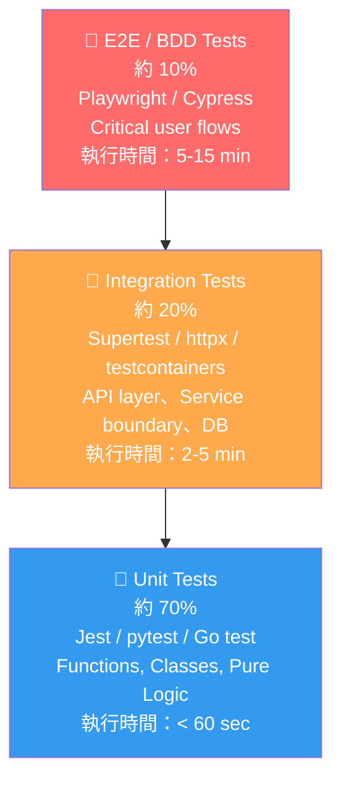
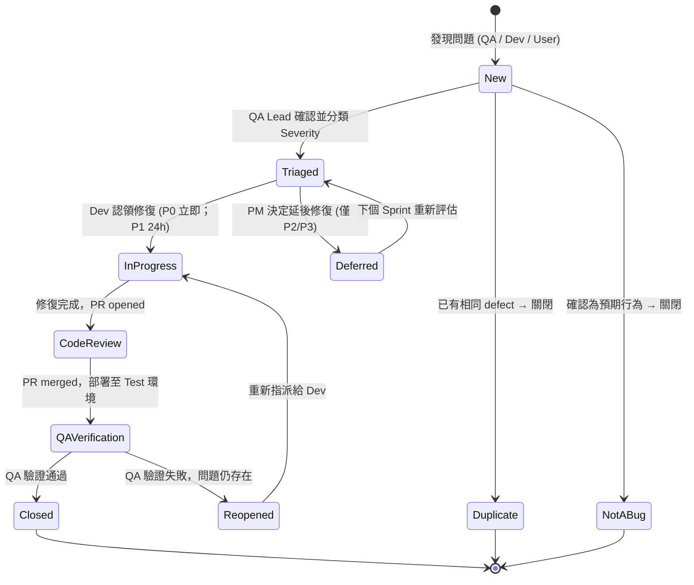
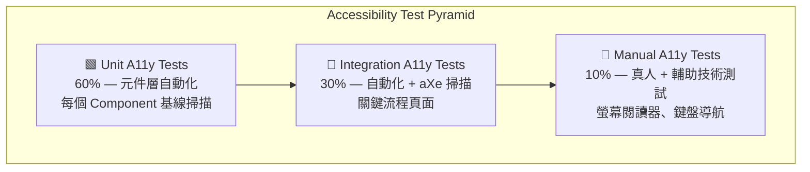
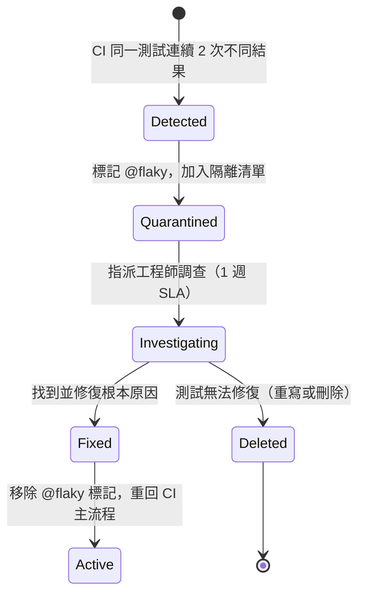

# Test Plan — 測試計畫
<!-- SDLC Quality Engineering — Layer 7：Test Strategy & Plan -->
<!-- 對應學術標準：IEEE 829 Test Plan；業界：Google Test Certified / ISTQB Test Plan -->
<!-- 回答：如何驗證產品符合 BRD/PRD/EDD 定義的需求？測試範圍、工具、責任、時程為何？ -->

---

## Document Control

| 欄位 | 內容 |
|------|------|
| **DOC-ID** | TP-{{PROJECT_CODE}}-{{YYYYMMDD}} |
| **專案名稱** | {{PROJECT_NAME}} |
| **文件版本** | v1.0 |
| **狀態** | DRAFT / IN_REVIEW / APPROVED |
| **作者（QA Lead）** | {{AUTHOR}} |
| **日期** | {{DATE}} |
| **上游 ARCH** | [ARCH.md](ARCH.md) |
| **上游 API** | [API.md](API.md) |
| **上游 SCHEMA** | [SCHEMA.md](SCHEMA.md) |
| **上游 PRD** | [PRD.md](PRD.md) |
| **下游 BDD** | [BDD.md](BDD.md)（features/*.feature） |
| **審閱者** | {{QA_LEAD}}, {{ENGINEERING_LEAD}}, {{PRODUCT_MANAGER}} |
| **核准者** | {{EXECUTIVE_SPONSOR}} |

---

## Change Log

| 版本 | 日期 | 作者 | 變更摘要 |
|------|------|------|---------|
| v1.0 | {{DATE}} | {{AUTHOR}} | 初稿 |

---

## §1 Executive Summary（測試目標與原則）

> 本章節建立整體測試策略的方向，所有後續章節的決策均以此為依據。
> 填寫時應對應 PRD §1（Executive Summary）與 BRD §2（Problem Statement）。

### §1.1 測試目標

<!-- 使用 SMART 格式：Specific / Measurable / Achievable / Relevant / Time-bound -->

1. **功能驗證**：於 {{RELEASE_DATE}} 前，確認所有 PRD Must-have 與 Should-have AC（共 {{AC_COUNT}} 條）通過自動化測試，通過率達 100%。
2. **覆蓋率保障**：所有服務的 Unit Test 行覆蓋率（Line Coverage）≥ 80%，Branch Coverage ≥ 70%，於每次 PR merge 前由 CI gate 強制驗收。
3. **效能基準**：核心 API 端點在正常負載（{{NORMAL_RPS}} RPS）下，P99 延遲 ≤ {{P99_LATENCY_MS}}ms，Error Rate ≤ 0.1%，於 {{PERF_TEST_DATE}} 前完成基準測試。
4. **安全合規**：SAST、DAST 掃描無 High/Critical 等級漏洞，OWASP Top 10 A01-A10 全數覆蓋，於進入 Staging 環境前完成。
5. **使用者驗收**：{{UAT_STAKEHOLDERS}} 於 {{UAT_SIGN_OFF_DATE}} 前完成 UAT sign-off，無 P0/P1 open defect。

### §1.2 測試原則

| 原則 | 說明 | 實踐方式 |
|------|------|---------|
| **Risk-Based Testing** | 優先測試高風險、高業務價值的功能 | 參照 §9 Risk Matrix 調整測試優先序 |
| **Shift-Left** | 將測試活動盡量前移到開發早期 | Pre-commit hook 執行 Unit Tests；PR 觸發 Integration Tests |
| **Fail-Fast** | 最快速找出最嚴重的問題 | CI pipeline 先跑 Unit → Integration → E2E，任一層失敗即中止 |
| **Test Isolation** | 每個測試獨立執行，不依賴外部狀態 | 每個測試自帶 setup/teardown，使用 testcontainers 或 in-memory DB |
| **Automation First** | 可自動化的測試必須自動化 | 目標：自動化率 ≥ 90%（E2E smoke 100%，regression 80%） |
| **Living Documentation** | 測試即文件，BDD scenarios 直接反映業務需求 | Gherkin feature files 與 PRD AC 雙向追蹤（§15 RTM） |

### §1.3 Test Pyramid

<!-- 此圖定義測試組合比例，下方數字為佔整體測試 case 數量的百分比 -->



> **比例說明**：
> - **Unit (70%)**：覆蓋所有業務邏輯函式、資料轉換、驗證規則。執行快速（秒級），開發者在本機即可頻繁執行。
> - **Integration (20%)**：覆蓋 API contract、資料庫操作、Service 間邊界。需要外部依賴（DB、cache），以 testcontainers 或 test DB 隔離。
> - **E2E (10%)**：覆蓋關鍵使用者流程（Happy path + critical error paths）。執行較慢，僅在 CI merge 前或每日排程觸發。

### §1.4 品質目標（Quality Gates）

| 指標 | 目標值 | 測量工具 | 頻率 |
|------|--------|---------|------|
| Unit Test Line Coverage | ≥ 80% | Istanbul / Coverage.py / go cover | 每次 PR |
| Unit Test Branch Coverage | ≥ 70% | Istanbul / Coverage.py / go cover | 每次 PR |
| Integration Test Pass Rate | 100% (PR merge 前) | JUnit XML / pytest-html | 每次 PR |
| E2E Smoke Pass Rate | 100% | Playwright HTML Report | 每次 PR merge |
| E2E Regression Pass Rate | ≥ 95% | Playwright HTML Report | 每日排程 |
| Defect Escape Rate (to Prod) | ≤ 2 defects / sprint | Jira / Linear | 每 Sprint |
| P99 API Latency (Normal Load) | ≤ {{P99_LATENCY_MS}}ms | k6 / Locust | 每週 |
| Error Rate (Normal Load) | ≤ 0.1% | k6 / Locust | 每週 |
| Security High/Critical Issues | 0 | Semgrep / ZAP | 每次 PR |
| Flaky Test Rate | ≤ 2% | CI Dashboard | 每週 |
| **Pact Contract Test Pass Rate** | **100%（PR merge 前，必要）** | Pact Broker / PactFlow | 每次 PR |
| **跨 Schema SQL 違規** | **0（CROSS_BC_SQL_COUNT = 0）** | DB Proxy / SQL Analyzer | 每次 PR |

---

## §2 Test Scope

### §2.1 In-Scope（測試範圍內）

<!-- 明確對應 PRD MoSCoW 優先序，確保所有 Must/Should 功能都有覆蓋 -->

**Must-have 功能（對應 PRD §5 Functional Requirements）：**

| 功能模組 | PRD REQ-ID | 測試類型 | 備註 |
|---------|-----------|---------|------|
| {{FEATURE_MODULE_1}} | REQ-{{ID}} | Unit + Integration + E2E | 核心功能，全測試類型覆蓋 |
| {{FEATURE_MODULE_2}} | REQ-{{ID}} | Unit + Integration | 後端邏輯 |
| {{FEATURE_MODULE_3}} | REQ-{{ID}} | Unit + E2E | 前端互動 |
| 使用者認證（Login / Logout） | REQ-AUTH-001 | Unit + Integration + E2E + Security | 安全敏感，加入 Security scan |
| 資料 CRUD 操作 | REQ-DATA-001 | Unit + Integration | 包含 validation 邊界測試 |
| API Rate Limiting | REQ-INFRA-001 | Integration + Performance | 驗證限流邏輯與回應格式 |

**Should-have 功能：**

| 功能模組 | PRD REQ-ID | 測試類型 | 備註 |
|---------|-----------|---------|------|
| {{SHOULD_FEATURE_1}} | REQ-{{ID}} | Unit + Integration | 次優先，若時間允許加 E2E |
| {{SHOULD_FEATURE_2}} | REQ-{{ID}} | Unit | 最小測試覆蓋 |

**非功能性測試（NFR）：**

- Module 可拆解性驗證（**必填 NFR**）：Spring Modulith HC-1～HC-5 的 SM-TEST-01～SM-TEST-04 均需通過（見 §3.2 Module Decomposability Tests）
- 效能測試：{{CORE_API_ENDPOINTS}} 所有 public API endpoints
- 安全測試：所有 authenticated endpoints、用戶資料處理流程
- UAT：所有 Must-have 功能的 Critical User Flows
- **HA / Failover 測試**：驗證高可用配置正確性（Pod Kill、DB Failover、Redis Sentinel 切換）— 依 EDD §12.2 HA-01~HA-04 標準場景執行，確保 HA 程式邏輯（分散式鎖、Session 外置、連線重試）在 ≥ 2 replica 環境下可正常運作

### §2.2 Out-of-Scope（排除項目）

> 明確排除可避免測試資源浪費，並管理 stakeholder 預期。

| 排除項目 | 原因 | 替代方案 |
|---------|------|---------|
| {{THIRD_PARTY_SERVICE}} 內部邏輯 | 第三方服務責任，非本系統控制範圍 | 使用 Mock/Stub 驗證 contract |
| Legacy {{LEGACY_MODULE}} 模組 | 本次 scope 不涉及修改，風險評估低 | 獨立 regression suite（已存在） |
| 超出 {{SCALE_LIMIT}} 的壓力測試 | 超出預期部署規模，成本效益不足 | 列入 Phase 2 規劃 |
| 行動端 App（iOS / Android） | 本次版本為 Web only | 行動端測試在 App 版本另行規劃 |
| IE 11 瀏覽器相容性 | 瀏覽器市占 < 1%，不支援決策已獲 PM 核准 | 記錄在 PRD §6 Constraints |

### §2.3 Future Scope（後續版本規劃）

| 功能 | 目標版本 | 測試需求說明 |
|------|---------|------------|
| {{FUTURE_FEATURE_1}} | v{{NEXT_VERSION}} | 需新增 E2E scenarios，預估 {{X}} 個 test cases |
| 行動端 App | {{MOBILE_RELEASE_DATE}} | 需 Appium / Detox E2E 測試套件 |
| 多語系（i18n）| v{{I18N_VERSION}} | 需 locale-specific 測試資料與 screenshot regression |
| {{FUTURE_FEATURE_2}} | v{{NEXT_MAJOR_VERSION}} | 新版本功能測試規劃 |

### §2.4 測試假設與限制

**假設（Assumptions）：**

1. 測試環境（Test / Staging）具有獨立的資料庫，不與 Production 共用。
2. 所有 API endpoints 在測試開始前已完成開發並部署至 Test 環境。
3. QA 工程師擁有 Test 環境的完整存取權限（含 DB read access、log access）。
4. {{THIRD_PARTY_API}} 提供 Sandbox 環境供整合測試使用。
5. CI/CD pipeline 已建置完成（參考 [LOCAL_DEPLOY.md](LOCAL_DEPLOY.md)）。

**限制（Constraints）：**

1. **時程限制**：UAT sign-off 截止日為 {{UAT_DEADLINE}}，倒推後效能測試需於 {{PERF_TEST_DEADLINE}} 前完成。
2. **人力限制**：QA 工程師 {{QA_HEADCOUNT}} 人，需優先確保 Must-have 功能全覆蓋。
3. **環境限制**：效能測試環境規格為 {{PERF_ENV_SPEC}}，與 Production {{PROD_ENV_SPEC}} 有差異，結果需按比例修正解讀。
4. **資料限制**：含 PII 的真實生產資料不可用於測試環境，需使用匿名化資料（參見 §5.2）。

---

## §3 Test Types & Strategy

> 本章節為核心章節，定義每種測試類型的執行策略、工具選型與品質標準。

---

### §3.1 Unit Tests

**目標**：驗證單一函式、類別、模組的邏輯正確性，不依賴外部資源。

#### 框架選型

| 語言 | 框架 | Coverage 工具 | 設定檔 |
|------|------|-------------|-------|
| TypeScript / JavaScript | Jest | Istanbul (built-in) | `jest.config.ts` |
| Python | pytest + pytest-cov | Coverage.py | `pyproject.toml` |
| Go | go test | go cover | `Makefile` target |
| Java / Kotlin | JUnit 5 + Mockito | JaCoCo | `build.gradle` |

#### 覆蓋率目標

```
Line Coverage   ≥ 80%  (CI hard gate — fail if below)
Branch Coverage ≥ 70%  (CI warning)
Function Coverage ≥ 85% (CI warning)
```

#### Mocking 策略

| 依賴類型 | Mocking 方式 | 原則 |
|---------|------------|------|
| 外部 HTTP API | `jest.mock` / `unittest.mock` / `gomock` | Mock at HTTP boundary，不 mock 業務邏輯 |
| 資料庫 Repository | Mock interface / Fake implementation | 使用 Repository Pattern，mock interface 而非 ORM |
| 時間（Date.now / time.Now） | 注入 clock dependency | 避免 non-deterministic tests |
| 亂數 / UUID | Inject seed or mock | 確保 reproducibility |
| 環境變數 | Test fixtures / `os.environ` override | 測試前 set，teardown 後 restore |

#### 命名慣例

```
# JavaScript / TypeScript
describe('UserService', () => {
  describe('createUser', () => {
    it('should return created user when valid input provided', ...)
    it('should throw ValidationError when email format is invalid', ...)
    it('should throw ConflictError when email already exists', ...)
  })
})

# Python
class TestUserService:
    def test_create_user_returns_user_when_valid_input(self):
    def test_create_user_raises_validation_error_when_invalid_email(self):
    def test_create_user_raises_conflict_error_when_email_exists(self):

# Go
func TestUserService_CreateUser_ReturnsUserWhenValidInput(t *testing.T)
func TestUserService_CreateUser_ErrorWhenInvalidEmail(t *testing.T)
```

#### 執行時機

| 觸發事件 | 執行範圍 | 允許時間 |
|---------|---------|---------|
| `git commit`（pre-commit hook） | Changed files 相關 unit tests | < 30 sec |
| PR opened / push to PR branch | 全量 unit tests | < 2 min |
| Merge to main | 全量 unit tests + coverage report | < 3 min |

---

### §3.2 Integration Tests

**目標**：驗證模組之間、API layer、資料庫操作的整合行為，確認 contract 符合 API.md 規格。

#### 測試範圍

| 層次 | 測試內容 | 工具 |
|------|---------|------|
| API Layer | HTTP request/response、status codes、response schema | Supertest (Node) / httpx (Python) / net/http/httptest (Go) |
| Database Layer | CRUD 操作、transaction、constraint、index 效能 | testcontainers（實際 DB）/ SQLite in-memory（輕量） |
| Service Boundary | Service A 呼叫 Service B 的 contract | Mock server (msw / WireMock) / Contract Testing (Pact) |
| Message Queue | 訊息發佈/訂閱、retry、dead letter queue | testcontainers (Kafka/RabbitMQ) |
| Cache Layer | Cache hit/miss、TTL、invalidation | testcontainers (Redis) / in-memory fake |
| **HA 行為** | Pod 重啟後服務恢復、DB Failover 後連線重連、分散式鎖競爭 | chaoskube（K8s 環境）/ toxiproxy（網路注入）|

#### HA Integration Test 標準場景

> 以下場景依 EDD §12.2 HA-01~HA-04 執行，驗證 ≥ 2 replica 環境下的 HA 程式邏輯正確性：

| 場景 ID | 測試名稱 | 注入方式 | 預期行為 |
|---------|---------|---------|---------|
| HA-INT-01 | 分散式鎖競爭（≥ 2 API replica）| 同時發送 2 個相同冪等操作請求 | 只有 1 個成功寫入，另 1 個收到 409 或排隊等待 |
| HA-INT-02 | Session 外置驗證 | Kill API Pod 後用原 Session Token 重新請求 | 新 Pod 能正確驗證原 Session，無需重新登入 |
| HA-INT-03 | DB 連線重連 | toxiproxy 斷開 DB 連線 5s 後恢復 | 應用層在連線恢復後自動重連，請求不丟失 |
| HA-INT-04 | Circuit Breaker 觸發 | toxiproxy 注入 500ms 延遲到外部依賴 | CB 在閾值後開啟，回傳降級響應（非 5xx 崩潰）|

#### Admin RBAC Boundary Test（當 `has_admin_backend=true` 時必填）

> 若系統有管理後台，Admin RBAC 測試屬於 P0 Security 等級，必須覆蓋所有角色 × 操作的授權邊界。

**角色 × 操作授權矩陣（依實際角色填入）：**

| 角色 | 讀取 | 寫入 | 刪除 | 批次操作 | 匯出資料 | 使用者管理 |
|------|------|------|------|---------|---------|---------|
| super_admin | ✅ 200 | ✅ 200 | ✅ 200 | ✅ 200 | ✅ 200 | ✅ 200 |
| operator | ✅ 200 | ✅ 200 | ❌ 403 | ✅ 200 | ❌ 403 | ❌ 403 |
| viewer | ✅ 200 | ❌ 403 | ❌ 403 | ❌ 403 | ❌ 403 | ❌ 403 |
| {{CUSTOM_ROLE}} | {{PERM}} | {{PERM}} | {{PERM}} | {{PERM}} | {{PERM}} | {{PERM}} |

**必須涵蓋的測試項目：**
- [ ] 水平越權：Admin A 不能存取或修改 Admin B 的私有資源（同角色跨帳號隔離）
- [ ] 縱向越權：operator 呼叫 super_admin 專屬 API 得到 403（非 200 或 500）
- [ ] Token 竄改：修改 JWT role 欄位不得影響後端授權結果（後端必須重新驗證 role）
- [ ] 批次操作邊界：批次刪除 N 筆後，Audit Log 必須記錄完整操作（操作者、時間、影響筆數）
- [ ] Session 逾時後操作：過期 Token 呼叫任何 admin API 得到 401

#### Module Decomposability Tests（Spring Modulith，必填）

> 驗證各子系統（Bounded Context）的邊界隔離性，確保系統具備微服務可拆解能力。

| 場景 ID | 測試名稱 | 測試方法 | 合格標準 |
|---------|---------|---------|---------|
| SM-TEST-01 | Schema 隔離測試 | 使用 db-query-analyzer 或 DB Proxy 攔截 SQL，驗證子系統 A 的程式碼不執行子系統 B 的 Schema 的 SQL | 零跨 BC SQL 記錄（CROSS_BC_SQL_COUNT = 0） |
| SM-TEST-02 | Consumer-Driven Contract Tests（Pact）| **必要**（非可選）；每個跨子系統 API pair 均有 Pact contract test；Provider 必須在 CI 中執行 Pact 驗證 | 所有 Pact contracts 驗證 100% 通過 |
| SM-TEST-03 | Async Event Contract Tests | 每個 Domain Event 的 Producer schema 與 Consumer schema 版本兼容性測試（使用 Avro/JSON Schema 校驗） | 所有 event_schema_version 配對相容（無解析錯誤） |
| SM-TEST-04 | 單一子系統冷啟動測試 | 僅啟動一個子系統（其他子系統以 WireMock stub 取代），驗證其全部端點可正常運作 | 冷啟動後所有 API endpoint 返回 2XX（無因其他 BC 不存在而 5XX） |

**Pact 設定範例（Consumer 端）：**

```javascript
// Consumer: lobby BC 呼叫 member BC 的 /api/v1/members/{id}
const { PactV3 } = require("@pact-foundation/pact");
const provider = new PactV3({ consumer: "lobby", provider: "member" });

provider.addInteraction({
  uponReceiving: "a request for member profile",
  withRequest: { method: "GET", path: "/api/v1/members/1" },
  willRespondWith: {
    status: 200,
    body: { id: "1", username: like("user1"), status: like("active") },
  },
});
// Provider 端（member BC）在 CI 中執行 pact verify
```

#### Test Database 策略

```
Strategy: 每個 integration test suite 使用獨立 database schema
Setup:    beforeAll → 建立 schema，執行 migration，載入 seed data
Teardown: afterAll  → 刪除 schema 或 rollback transaction

# 使用 testcontainers（推薦）
const container = await new PostgreSqlContainer("postgres:16")
  .withDatabase("test_db")
  .withUsername("test_user")
  .withPassword("test_pass")
  .start();

# 或使用 transaction rollback（輕量方案）
beforeEach: BEGIN TRANSACTION
afterEach:  ROLLBACK  ← 確保每個 test 後資料還原
```

#### 資料清理原則

1. **不使用 truncate** 清理所有資料（會破壞其他並行 test suite）。
2. **使用 transaction rollback** 或 **schema isolation**（每個 test suite 一個 schema）。
3. **Seed data 版本化**：fixture 檔案納入 version control，修改需 PR review。
4. **禁止 test 之間共享可變狀態**：每個 test case 自帶 factory function 建立所需資料。

---

### §3.3 E2E / BDD Tests

**目標**：從使用者視角驗證 Critical User Flows，確保跨層整合無誤。

#### Gherkin Feature Files

```gherkin
# features/{{MODULE}}/{{feature_name}}.feature
Feature: {{FEATURE_TITLE}}
  As a {{PERSONA}}
  I want to {{ACTION}}
  So that {{BENEFIT}}

  Background:
    Given the application is running in "{{TEST_ENV}}" environment
    And a user with email "{{TEST_USER_EMAIL}}" exists

  Scenario: {{HAPPY_PATH_TITLE}}
    Given I am on the "{{START_PAGE}}" page
    When I {{USER_ACTION}}
    Then I should see "{{EXPECTED_RESULT}}"
    And the "{{DATA_ENTITY}}" should be updated in the database

  Scenario: {{ERROR_PATH_TITLE}}
    Given I am on the "{{START_PAGE}}" page
    When I {{INVALID_ACTION}}
    Then I should see error message "{{ERROR_MESSAGE}}"
    And the "{{DATA_ENTITY}}" should remain unchanged
```

#### Critical User Flows 清單

| Flow Name | 優先序 | Smoke Test? | 預期執行時間 | PRD AC 對應 |
|-----------|--------|------------|------------|------------|
| 使用者註冊 → 信箱驗證 → 首次登入 | P0 | Yes | < 15 sec | AC-AUTH-001 |
| 登入 → 核心功能操作 → 登出 | P0 | Yes | < 20 sec | AC-CORE-001 |
| {{KEY_FLOW_3}} | P0 | Yes | < {{X}} sec | AC-{{ID}} |
| {{KEY_FLOW_4}} | P1 | No | < {{X}} sec | AC-{{ID}} |
| 忘記密碼 → 重設 → 登入 | P1 | No | < 30 sec | AC-AUTH-002 |
| 錯誤輸入 → 驗證錯誤顯示 | P2 | No | < 10 sec | AC-UX-001 |
| 第三方 OAuth 登入（Google） | P2 | No | < 20 sec | AC-AUTH-003 |
| **HA-001 Pod Kill 後服務恢復** | P0 | Yes | < 60 sec | EDD §12.2 HA-01 |
| **HA-002 DB Failover 後操作正常** | P0 | Yes | < {{DB_FAILOVER_RTO}}m | EDD §12.2 HA-02 |
| **HA-003 Redis 切換後 Session 有效** | P1 | No | < 30 sec | EDD §12.2 HA-03 |

> **HA E2E 執行要求**：
> - HA-001/HA-002 必須列入 Smoke Test（Yes），每次 pre-release 必須通過
> - HA E2E 需在 Staging 環境（≥ 2 API replica、DB Primary+Standby 配置）執行，不可在 localhost 單進程環境執行
> - HA-001 執行方式：`kubectl delete pod -l app=api --grace-period=0`，然後驗證流量路由至剩餘 Pod，並在 RTO 內重建完成
> - HA-002 執行方式：觸發 DB Failover（雲端 console 或 `pg_ctl stop -m fast`），驗證應用層自動重連並在 RPO 範圍內無資料丟失

#### Browser Matrix

| 瀏覽器 | 版本 | 執行 Smoke? | 執行 Full Regression? |
|-------|------|-----------|---------------------|
| Chrome (Chromium) | Latest | Yes | Yes |
| Firefox | Latest | Yes | Yes |
| Safari (WebKit) | Latest | Yes | Yes |
| Edge | Latest | No | Weekly |
| Chrome Mobile (Android) | Latest | No | Weekly |

---

### §3.4 Performance Tests

**目標**：驗證系統在預期與極端負載下的行為，找出效能瓶頸，確認 SLO 達標。

#### 四種效能測試場景

**Scenario 1 — Smoke Test（健康檢查）**

```
目的：確認效能測試腳本本身可正常執行，基本功能無誤
負載：1 VU（Virtual User），持續 1 分鐘
通過條件：Error Rate = 0%，Response Time < 2x normal P99
工具：k6 / Locust
執行時機：效能測試前的前置驗證
```

**Scenario 2 — Load Test（正常負載）**

```
目的：驗證系統在預期日常負載下的效能表現，確認 SLO 達標
負載：模擬 {{NORMAL_CONCURRENT_USERS}} 並發用戶，持續 30 分鐘
Ramp-up：前 5 分鐘線性增加至目標 VU
Steady state：維持 20 分鐘
Ramp-down：後 5 分鐘線性降至 0
通過條件：P99 < {{P99_LATENCY_MS}}ms，Error Rate < 0.1%，Throughput > {{MIN_RPS}} RPS
```

**Scenario 3 — Stress Test（壓力測試）**

```
目的：找出系統的承載上限（breaking point），了解超載時的降級行為
負載：從正常負載開始，每 5 分鐘增加 25%，直到系統出現錯誤或 P99 > 2x SLO
最大負載：預期正常負載的 150-200%
關注指標：系統在何種負載下開始降級？降級方式是否優雅（graceful）？
恢復測試：壓力移除後，系統是否能在 2 分鐘內恢復至正常狀態？
```

**Scenario 4 — Soak Test（持久測試）**

```
目的：發現記憶體洩漏、Connection Pool 耗盡、磁碟空間耗盡等長時間運行問題
負載：正常負載的 70-80%，持續 1-4 小時（依系統類型調整）
監控重點：
  - Memory RSS trend（應保持穩定，不持續增長）
  - DB Connection Pool utilization（應 < 80%）
  - Error Rate trend（應保持穩定，不因時間增加而上升）
  - Heap GC frequency（Java / Node.js 環境）
通過條件：執行期間 Error Rate 無上升趨勢，Memory 無持續洩漏
```

#### SLO Targets 表格

| Endpoint | P50 (ms) | P95 (ms) | P99 (ms) | Error Rate Budget | Throughput (RPS) |
|---------|---------|---------|---------|-----------------|-----------------|
| `GET /api/{{RESOURCE}}` | ≤ {{P50}} | ≤ {{P95}} | ≤ {{P99}} | ≤ 0.1% | ≥ {{RPS}} |
| `POST /api/{{RESOURCE}}` | ≤ {{P50}} | ≤ {{P95}} | ≤ {{P99}} | ≤ 0.1% | ≥ {{RPS}} |
| `GET /api/health` | ≤ 10 | ≤ 20 | ≤ 50 | ≤ 0% | ≥ 500 |
| 整體系統平均 | ≤ {{P50_AVG}} | ≤ {{P95_AVG}} | ≤ {{P99_AVG}} | ≤ 0.1% | ≥ {{TOTAL_RPS}} |

> **工具選型**：JavaScript 生態優先 **k6**；Python 生態優先 **Locust**；兩者皆支援 threshold 設定與 CI 整合。

---

### §3.5 UAT（User Acceptance Tests）

**目標**：由業務 stakeholder 親自驗證產品行為符合 BRD/PRD 定義的業務需求，給出上線核准。

#### 驗收標準來源

UAT 驗收標準直接對應 **PRD §9 Success Metrics** 與各功能 AC（Acceptance Criteria），包含：

1. 所有 Must-have AC 通過（100%）
2. Should-have AC 通過率 ≥ 80%
3. 無 P0、P1 open defects
4. Performance SLO 達標（P99 ≤ {{P99_LATENCY_MS}}ms）
5. UI/UX 驗收：{{UX_STAKEHOLDER}} 確認流程符合 PDD 設計規格

#### Stakeholder 清單

| 角色 | 姓名 | 職責 | 參與場景 |
|------|------|------|---------|
| Product Manager | {{PM_NAME}} | 功能驗收 | 所有 Must-have flows |
| Business Owner | {{BO_NAME}} | 業務邏輯驗收 | {{BUSINESS_CRITICAL_FLOWS}} |
| UX Designer | {{UX_NAME}} | 互動設計驗收 | 所有前端 user flows |
| Operations | {{OPS_NAME}} | 監控 / 運維流程驗收 | 運維 SOP 操作 |
| Security Officer | {{SEC_NAME}} | 安全合規驗收 | 安全相關功能 |

#### UAT 執行環境

- **環境**：Staging（與 Production 規格相同的 production-like 環境）
- **資料**：匿名化的 production-representative 資料，或 UAT 專用 seed data
- **存取方式**：Staging URL `https://staging.{{DOMAIN}}`，使用 UAT 測試帳號

#### Sign-off 條件

```
UAT PASS 條件（全部滿足才可 sign-off）：
  ✅ 所有 Must-have AC 通過 (PRD §5)
  ✅ 無 P0、P1 open defects
  ✅ Performance SLO 達標（Load Test 通過）
  ✅ Security scan 無 High/Critical issues
  ✅ 所有 UAT stakeholders 完成簽核
```

---

### §3.6 HA / Failover / Chaos Tests

**目標**：驗證系統在元件故障、節點重啟、網路中斷時，能自動恢復並維持 SLO（可用性 ≥ 99.9%）。  
**HA 測試原則**：HA 是架構設計前提，不是「Future Scope」。所有服務在 MVP 上線前必須通過 §3.6 所定義的最小 HA 場景。

#### §3.6.1 Integration Test — HA Failover

| 測試場景 | 工具 | 通過條件 |
|---------|------|---------|
| **API Pod 強制終止**（`kubectl delete pod api-0`）| Kubernetes + curl | ≤ 5s 內新 pod ready，期間 健康檢查端點（/health）持續回應 200 |
| **Worker Pod 強制終止** | Kubernetes + test queue producer | Job 自動重新入隊並由其他 Worker 完成，冪等性：同一 Job 只執行一次 |
| **Primary DB 故障切換**（`pg_ctl stop -m immediate`）| pgbench + failover trigger | ≤ 30s 完成切換，寫入恢復，資料無遺失（WAL 同步複本）|
| **Redis 單節點故障**（Sentinel 模式停掉 master）| redis-cli + health probe | Sentinel 選出新 Master，業務操作降級（Cache Miss）但不報錯 |
| **API Gateway 限流觸發** | vegeta / k6 | 超過 Rate Limit 時回傳 429 + `Retry-After`，不報 500 |

#### §3.6.2 E2E Test — HA Chaos Scenario

```gherkin
Feature: HA Failover — 端點對端點驗證

  @ha @failover @chaos
  Scenario: Pod 重啟期間使用者請求不中斷
    Given 系統已部署 2 個 API Server Pod（≥ 2 replicas）
    And 有持續每秒 10 req 的穩定流量
    When 其中 1 個 API Pod 被強制終止
    Then 流量自動切換至剩餘 Pod
    And 期間 5XX 錯誤率 ≤ 0.1%（允許 ≤ 1 個請求失敗）
    And 新 Pod 在 30 秒內通過 Readiness Probe 並重新接收流量

  @ha @failover @chaos
  Scenario: DB Primary 切換後資料一致性
    Given 系統正在進行寫入操作（每秒 5 筆訂單）
    When Primary DB 節點發生故障（模擬：停止 PostgreSQL 進程）
    Then Standby DB 在 30 秒內自動提升為 Primary
    And 所有已確認（Commit）的寫入資料不遺失
    And API 在 60 秒內恢復正常寫入

  @ha @graceful-shutdown
  Scenario: Pod Rolling Update 期間 in-flight 請求完成
    Given API Pod 正在處理需要 5 秒的請求
    When Kubernetes 發送 SIGTERM 信號至該 Pod
    Then Pod 停止接受新請求（Readiness Probe 失敗）
    And 現有 in-flight 請求正常完成（最多等待 30s）
    And Pod 退出後不殘留未完成的請求
```

#### §3.6.3 本地 HA 驗證（Local Dev，遵循 EDD §3.7 圖 B）

```bash
# 1. 確認 Local 有 ≥ 2 API replicas
kubectl get pods -l app=api-server | grep Running | wc -l
# 期望 ≥ 2

# 2. 終止其中一個 Pod，觀察服務不中斷
kubectl delete pod $(kubectl get pods -l app=api-server -o jsonpath='{.items[0].metadata.name}')
curl http://localhost:8080/health  # 應在 5s 內繼續回應 200

# 3. 驗證 Worker 冪等性
# 送出同一 Job 兩次，確認只執行一次
```

---

### §3.7 Security Tests

**目標**：系統性識別並修復安全漏洞，確認符合 OWASP Top 10 安全標準。

#### SAST（Static Application Security Testing）

| 工具 | 語言 | 觸發時機 | Fail 條件 |
|------|------|---------|---------|
| Semgrep | 多語言通用 | PR opened | High / Critical rule matches |
| Bandit | Python | PR opened | High severity issues |
| gosec | Go | PR opened | High severity issues |
| ESLint Security Plugin | JS/TS | PR opened | Security-related lint errors |

#### DAST（Dynamic Application Security Testing）

| 工具 | 掃描目標 | 觸發時機 | 排除項目 |
|------|---------|---------|---------|
| OWASP ZAP (Baseline Scan) | Staging API endpoints | 每週排程 | `/health`, `/metrics`（非業務端點） |
| OWASP ZAP (Full Scan) | Staging full application | UAT 前 | 第三方 CDN 資源 |

#### Dependency Vulnerability Scanning

| 工具 | 掃描對象 | 觸發時機 | Fail 條件 |
|------|---------|---------|---------|
| Trivy | Container image | PR merged to main | Critical CVE |
| Snyk / OWASP Dependency-Check | npm / pip / go.sum | PR opened | High / Critical CVE（有 fix 版本） |
| GitHub Dependabot | 所有依賴 | 每日排程 | 自動開 PR，不 block |

#### OWASP Top 10 Coverage 表格

| OWASP 類別 | 適用性 | 測試方法 | 工具 | Pass Condition |
|-----------|--------|---------|------|---------------|
| A01 Broken Access Control | Y | Unauthorized endpoint access tests | Postman / pytest | 所有 unauthorized request 返回 401/403 |
| A02 Cryptographic Failures | Y | TLS config check, secrets in code scan | testssl.sh / Semgrep | TLS 1.2+, 無硬編碼 secrets |
| A03 Injection (SQL/NoSQL/LDAP) | Y | Parameterized query audit, ZAP active scan | Semgrep / ZAP | 無 raw string concatenation in queries |
| A04 Insecure Design | Y | Threat model review (STRIDE) | 人工審查 | Threat model 完成且所有 High risk 已 mitigate |
| A05 Security Misconfiguration | Y | Exposed debug endpoints, default credentials | ZAP / Manual | 無 debug endpoints in prod, 無 default passwords |
| A06 Vulnerable Components | Y | Dependency scan | Trivy / Snyk | 無 Critical CVE，High CVE 有 remediation plan |
| A07 Auth Failures | Y | Brute force simulation, session management | ZAP / Custom scripts | Account lockout 正常，session 過期機制正確 |
| A08 Software & Data Integrity | Y | CI/CD pipeline integrity, SRI | GitHub Actions settings audit | Pinned action versions, SRI for CDN resources |
| A09 Logging & Monitoring Failures | Y | Log completeness check | Manual audit | 所有 auth events 有 log，無 PII in logs |
| A10 SSRF | Y（如有外部 URL 輸入） | SSRF payload tests | ZAP / Custom | 無法觸發 internal metadata / internal network access |

---

## §4 Test Environment Specification

> 每個環境用途不同，資料策略嚴格隔離，避免測試汙染 Production。

| Environment | 用途 | URL Pattern | Database | 資料策略 | 部署方式 |
|------------|------|------------|---------|---------|---------|
| **Dev** | 開發者本機測試、Unit / Integration CI | `localhost:{{PORT}}` | 本機 Docker Compose / SQLite in-memory | 開發者自管，每次重啟清空 | `docker compose up` |
| **Test** | Integration Tests、E2E CI pipeline | `https://test.{{DOMAIN}}` | 獨立 Test DB（每次 CI 重建） | CI 執行前 migration + seed，執行後保留（供 debug） | GitHub Actions / {{CI_PLATFORM}} |
| **Staging** | UAT、Performance Tests、DAST | `https://staging.{{DOMAIN}}` | 獨立 Staging DB（匿名化 production snapshot） | 月更 production 匿名化快照，手動 reset by QA Lead | 與 Production 相同的 IaC（Terraform / k8s） |
| **Production-like（Perf）** | Stress Test、Soak Test（隔離環境） | `https://perf.{{DOMAIN}}` | 與 Production 相同規格 DB，效能測試專用資料 | 效能測試前 provision，測試後 destroy | 與 Production 相同 IaC，按需建立 |

**環境存取控制：**

- Dev：開發者本人
- Test：Dev team + QA team（GitHub Actions service account）
- Staging：Dev + QA + PM + UAT stakeholders（VPN required）
- Perf：QA Lead + SRE（限效能測試時段）

---

## §5 Test Data Management

### §5.1 資料生成策略

| 策略 | 使用場景 | 工具 | 說明 |
|------|---------|------|------|
| **Faker** | 動態生成單筆測試資料 | Faker.js / Faker (Python) | 用於 Unit / Integration tests，每次執行生成 |
| **Factory** | 批量建立具有業務邏輯的測試物件 | factory_boy / Rosie.js | 支援 trait / association，適合複雜資料關係 |
| **Fixture** | 靜態基準資料（seed data） | SQL fixtures / JSON fixtures | 用於 E2E tests 的預設資料集，納入 version control |
| **Production Anonymized** | UAT、Staging 環境 | 自建匿名化 pipeline | 僅用於 Staging，嚴禁用於 Test / Dev |

**Factory 範例（TypeScript）：**

```typescript
// tests/factories/user.factory.ts
export const UserFactory = {
  build: (overrides?: Partial<User>): User => ({
    id: faker.string.uuid(),
    email: faker.internet.email(),
    name: faker.person.fullName(),
    role: 'user',
    createdAt: new Date(),
    ...overrides,
  }),
  buildAdmin: (): User => UserFactory.build({ role: 'admin' }),
  buildWithExpiredSession: (): User => UserFactory.build({
    sessionExpiresAt: new Date(Date.now() - 3600_000),
  }),
};
```

### §5.2 PII Masking 規則

<!-- 對應 PRD §11 PII 矩陣，確保測試資料合規 -->

| PII 類型 | Masking 方式 | 範例（原始 → 匿名化） | 環境適用 |
|---------|------------|-------------------|---------|
| 姓名 | 隨機替換（同語系） | 王小明 → 陳大華 | Staging |
| Email | 固定 domain 替換 | john@real.com → test_xxx@test.invalid | Staging / Test |
| 電話號碼 | 隨機生成（同格式） | 0912-345-678 → 0987-654-321 | Staging |
| 身分證號 | 生成合法格式的假號 | A123456789 → Z999888777 | Staging |
| 信用卡號 | 全部遮罩 + 末4碼保留 | 4111-1111-1111-1111 → ****-****-****-1111 | Staging |
| IP 地址 | 保留前兩段，後兩段隨機 | 203.0.113.45 → 203.0.xxx.xxx | Staging |

**PII 禁令**：
- Test / Dev 環境**嚴禁**使用真實 PII 資料
- 匿名化 pipeline 由 SRE 負責維護，QA Lead 每季審核一次
- 違規資料使用需立即通報 Security Officer

### §5.3 Test Isolation 原則

```
每個 Test Case 的黃金法則：

1. SETUP（Arrange）：
   - 使用 Factory / Fixture 建立本 test 所需的最小資料集
   - 不假設前一個 test 留下的狀態

2. EXECUTE（Act）：
   - 執行被測行為
   - 一個 test case 只測一件事

3. VERIFY（Assert）：
   - 驗證結果
   - 僅 assert 本 test 關心的狀態

4. TEARDOWN（Cleanup）：
   - 刪除本 test 建立的資料
   - 或使用 transaction rollback 自動還原
   - 不留下任何副作用給後續 tests
```

### §5.4 Shared Test Data 規範

| 類型 | 說明 | 管理方式 | 注意事項 |
|------|------|---------|---------|
| **Seed Data（靜態）** | 系統必要的基礎資料（roles, permissions, config） | SQL migration 腳本，版本化 | 只讀不寫，不在 tests 中修改 |
| **Dynamic Test Data** | 每個 test case 動態建立的資料 | Factory function | 必須在 teardown 清理 |
| **Shared Fixtures（E2E）** | 多個 E2E scenarios 共用的起始資料 | Playwright fixtures / `beforeAll` | 唯讀共享，不允許 test 修改 |

---

## §6 Entry / Exit Criteria

> 明確定義每個測試階段的進出條件，確保測試活動有序推進。

| Stage | Entry Criteria（進入條件） | Exit Criteria（離開條件） | Blocking Defects |
|-------|--------------------------|------------------------|-----------------|
| **Unit Testing** | 功能開發完成，PR opened，CI 觸發 | Line Coverage ≥ 80%，所有 Unit Tests pass | 任何 Unit Test failure |
| **Integration Testing** | Unit Tests 通過，功能分支 merge to main，Test 環境部署成功 | 所有 Integration Tests pass，API contract 符合 API.md | P0 / P1 defects，API schema mismatch |
| **E2E Testing** | Integration Tests 通過，E2E 環境穩定，測試資料備妥 | 所有 Smoke Tests pass，Regression pass rate ≥ 95% | P0 defects，Critical User Flow failure |
| **Performance Testing** | E2E Tests 通過，Staging 環境部署，負載測試腳本 review 完畢 | 所有 SLO 目標達標（P99 / Error Rate / Throughput） | P99 超過 SLO 50% 以上，Error Rate > 1% |
| **Security Testing** | Staging 環境可存取，SAST 初步掃描已完成 | OWASP Top 10 全數通過，無 High/Critical open issues | Any Critical security vulnerability |
| **UAT** | 上述所有 stage 通過，Staging 環境穩定，UAT stakeholders 已排程 | 所有 sign-off stakeholders 完成簽核，無 P0/P1 open defects | P0 defects，Must-have AC 未通過 |

---

## §7 Defect Management

### §7.1 Severity 分類

| Severity | 定義 | SLA（修復時間） | 範例 |
|---------|------|--------------|------|
| **P0 Critical** | 系統完全無法使用、資料遺失、安全漏洞、Production down | 4 小時內 | 無法登入、資料庫連線失敗、SQL injection 漏洞 |
| **P1 High** | 核心功能異常、影響大多數用戶、無合理 workaround | 24 小時內 | 關鍵 API 錯誤回應、付款流程失敗、資料計算錯誤 |
| **P2 Medium** | 功能部分異常、有 workaround、影響部分用戶 | 3 個工作天內 | 非核心功能 UI 異常、效能略低於 SLO、次要 API 錯誤 |
| **P3 Low** | 小問題、UI cosmetic、建議改善 | 下一個 Sprint | 文字錯字、UI 對齊輕微偏差、非必要功能缺失 |

**Defect Escape Rate 目標**：Production P0/P1 defect ≤ **2 per sprint**

### §7.2 Defect Workflow



### §7.3 Defect Escape Rate 監控

| 指標 | 目標 | 測量方式 | 行動觸發 |
|------|------|---------|---------|
| Production P0 defects / sprint | = 0 | Jira / Linear sprint report | 立即 post-mortem |
| Production P1 defects / sprint | ≤ 1 | Jira / Linear sprint report | QA Lead 分析根本原因，改善測試覆蓋 |
| Production P0+P1 defects / sprint | ≤ 2 | Jira / Linear sprint report | Sprint retro 討論 |
| Defect resolution within SLA | ≥ 95% | Jira time tracking | 若低於 90%，升級給 Engineering Lead |

---

## §8 Test Automation & CI/CD Integration

### §8.1 CI Pipeline 觸發時機

| 事件 | 執行測試類型 | 允許時間 | Fail 行為 |
|------|-----------|---------|---------|
| `git commit`（pre-commit hook） | Unit Tests（changed files） | < 30 sec | Block commit |
| PR opened / push to PR branch | Unit Tests + Integration Tests | < 10 min | Block PR merge |
| PR merged to main | Unit + Integration + E2E Smoke | < 15 min | Alert on Slack / Teams |
| Daily schedule (02:00 UTC) | Full E2E Regression | < 30 min | Alert + create Jira ticket |
| Weekly schedule (Mon 04:00 UTC) | Performance Tests (Load Test) | < 60 min | Alert + create Jira ticket |
| Manual trigger | Full test suite (包含 Stress / Soak) | Varies | QA Lead 通知 |

### §8.2 Parallel Test Execution 策略

```
Unit Tests:       分 {{N_SHARDS}} 個 shard 並行執行（按 test file 分配）
Integration Tests: 按 service / module 並行（需獨立 DB schema per shard）
E2E Tests:        按 browser × test file 並行（Playwright 原生支援）
Performance Tests: 不並行（獨立環境，避免干擾）

CI 工具設定範例（GitHub Actions）：
  strategy:
    matrix:
      shard: [1, 2, 3, 4]
  steps:
    - run: npx jest --shard=${{ matrix.shard }}/${{ strategy.job-total }}
```

### §8.3 Test Report Format

| 報告類型 | 格式 | 用途 | 存放位置 |
|---------|------|------|---------|
| Unit / Integration | JUnit XML | CI pipeline parsing，PR status check | CI artifacts（保留 30 天） |
| Unit / Integration | HTML Coverage Report | 開發者 review 覆蓋率詳細資訊 | CI artifacts + PR comment |
| E2E | Playwright HTML Report | 查看截圖、影片、trace | CI artifacts（保留 14 天） |
| Performance | k6 HTML Report / Grafana Dashboard | SLO 達標確認，trend 分析 | Grafana（永久保留） |
| Security | SARIF (Static) / ZAP HTML (Dynamic) | Security findings review | GitHub Security tab / CI artifacts |

### §8.4 Quality Gate（PR Merge 條件）

```
PR merge 到 main 的強制條件（任一未達，自動 block）：

  ✅ Unit Test Coverage ≥ 80% (line)
  ✅ All Unit Tests PASS
  ✅ All Integration Tests PASS
  ✅ SAST scan：無 High / Critical issues
  ✅ No P0 open defects
  ✅ PR reviewed by ≥ 1 reviewer（Engineering Lead 或 designated reviewer）
```

### §8.5 Flaky Test Policy

```
定義：在相同程式碼下，有時 pass / 有時 fail 的測試

偵測：CI 自動標記連續 3 次不穩定的測試（pass rate < 80%）

處理流程：
  1. 偵測到 flaky → 自動加入 quarantine list（@flaky tag）
  2. 24 小時內 → 指派給原作者或 QA 調查根本原因
  3. 根本原因類型：
     a. Race condition → 修復非同步等待邏輯
     b. External dependency → Mock 或 retry with exponential backoff
     c. Test data pollution → 加強 isolation
     d. Timing issue → 使用 deterministic wait（waitForSelector vs sleep）
  4. 修復後 → 移除 quarantine，觀察 5 次 CI run 確認穩定
  5. 超過 5 天未修復的 flaky test → QA Lead upgrade to P2 defect
```

---

## §9 Risk-Based Testing Matrix

> 依據業務重要性與技術風險評估測試優先序，確保資源集中於高風險區域。

| Feature / Module | Risk Level | Risk 原因 | Test Priority | Coverage Target |
|----------------|-----------|---------|--------------|----------------|
| 使用者認證（Auth） | **H** | 安全性敏感，影響所有功能入口 | P0 | Unit ≥ 90%, E2E 100% happy path |
| 資料寫入 / 刪除操作 | **H** | 不可逆操作，資料遺失風險 | P0 | Unit ≥ 90%, Integration 100% |
| {{CORE_BUSINESS_FEATURE_1}} | **H** | 核心業務邏輯，錯誤影響 Revenue | P0 | Unit ≥ 85%, Integration ≥ 90% |
| 付款 / 訂閱流程 | **H** | 金融敏感，PCI-DSS 合規要求 | P0 | Unit ≥ 90%, E2E 100%, Security scan |
| API Rate Limiting | **M** | 濫用保護，但 bypass 風險可接受 | P1 | Integration ≥ 80% |
| {{SECONDARY_FEATURE_1}} | **M** | 功能重要但有 fallback 機制 | P1 | Unit ≥ 80% |
| Email 通知功能 | **M** | 用戶體驗影響，但非阻塞性 | P1 | Unit ≥ 80%, Integration（mock SMTP） |
| Admin 後台（RBAC / 稽核日誌）| **H** | 許可權控制失效 → 資料洩漏 / 越權操作；has_admin_backend=true 時 | P0 | Unit ≥ 90%, Integration 100% RBAC boundary, E2E @admin @rbac @audit |
| Report 匯出（CSV/PDF） | **L** | 輔助功能，非核心流程 | P2 | Unit ≥ 70% |
| 使用者偏好設定 | **L** | 非業務關鍵，影響個別用戶 | P3 | Unit ≥ 60% |

**Risk Level 定義**：H = 業務衝擊高 × 發生機率高；M = 其中一個指標高；L = 兩者皆低

---

## §10 Performance Testing Specification

### §10.1 Load Targets（系統容量目標）

| 指標 | 數值 | 來源依據 |
|------|------|---------|
| Normal Concurrent Users | {{NORMAL_USERS}} | PRD §10 Non-Functional Requirements |
| Peak Concurrent Users（3x spike） | {{PEAK_USERS}} | 業務活動峰值估算（例：促銷活動） |
| Normal RPS | {{NORMAL_RPS}} | 基於 concurrent users × avg. requests/session/min |
| Peak RPS（sustained 5 min） | {{PEAK_RPS}} | Normal × 3 |
| Max Tolerable RPS before degradation | TBD（由 Stress Test 確定） | Stress Test 結果 |
| Data volume per day | {{DAILY_DATA_MB}} MB | 基於 Normal RPS × avg. payload size |

### §10.2 SLO Targets（詳細端點目標）

| Endpoint | Method | P50 (ms) | P95 (ms) | P99 (ms) | Error Rate Budget | Min Throughput |
|---------|--------|---------|---------|---------|-----------------|---------------|
| `/api/{{RESOURCE_1}}` | GET | ≤ {{P50}} | ≤ {{P95}} | ≤ {{P99}} | ≤ 0.1% | ≥ {{RPS}} |
| `/api/{{RESOURCE_1}}` | POST | ≤ {{P50}} | ≤ {{P95}} | ≤ {{P99}} | ≤ 0.1% | ≥ {{RPS}} |
| `/api/auth/login` | POST | ≤ 200 | ≤ 500 | ≤ 1000 | ≤ 0.5% | ≥ 50 |
| `/api/health` | GET | ≤ 5 | ≤ 10 | ≤ 20 | ≤ 0% | ≥ 1000 |
| Static assets | GET | ≤ 50 | ≤ 100 | ≤ 200 | ≤ 0% | N/A |

### §10.3 k6 腳本結構說明

```javascript
// tests/performance/load-test.js
import http from 'k6/http';
import { check, sleep } from 'k6';
import { Rate, Trend } from 'k6/metrics';

// Custom metrics
const errorRate = new Rate('error_rate');
const apiDuration = new Trend('api_duration');

// Test configuration（scenarios）
export const options = {
  scenarios: {
    // Load Test scenario
    load_test: {
      executor: 'ramping-vus',
      startVUs: 0,
      stages: [
        { duration: '5m', target: {{NORMAL_USERS}} },   // Ramp-up
        { duration: '20m', target: {{NORMAL_USERS}} },  // Steady state
        { duration: '5m', target: 0 },                  // Ramp-down
      ],
    },
  },
  // Thresholds（SLO enforcement）
  thresholds: {
    http_req_duration: [
      'p(50)<{{P50}}',
      'p(95)<{{P95}}',
      'p(99)<{{P99}}',
    ],
    http_req_failed: ['rate<0.001'],  // 0.1% error rate
    error_rate: ['rate<0.001'],
  },
};

export default function () {
  // Test scenario: {{SCENARIO_DESCRIPTION}}
  const response = http.get(`${__ENV.BASE_URL}/api/{{RESOURCE}}`);

  check(response, {
    'status is 200': (r) => r.status === 200,
    'response time < {{P99}}ms': (r) => r.timings.duration < {{P99}},
  });

  errorRate.add(response.status !== 200);
  apiDuration.add(response.timings.duration);

  sleep({{THINK_TIME_SECONDS}});
}
```

### §10.4 Performance Baseline 建立方式

```
Baseline 建立流程（首次執行）：

1. 在 Test / Staging 環境執行 Load Test（正常負載，30 min）
2. 記錄以下基準值（存入 tests/performance/baseline.json）：
   - P50, P95, P99 per endpoint
   - Throughput (RPS)
   - Error Rate
   - Memory usage（application server）
   - CPU usage（application server）
   - DB connection pool utilization
   - Slow query count（queries > 100ms）

3. 後續每次 Performance Test 與 baseline 比較
4. 若任何指標退化 > 20%（vs baseline），觸發 Performance Alert
5. 若有意地改善效能，更新 baseline 並 commit 到 version control

Baseline 更新頻率：每個 Sprint，若有 infrastructure 或 architecture 重大變更時立即更新
```

---

## §11 Security Testing Scope

### §11.1 SAST 工具與觸發時機

| 工具 | 語言 / 平台 | 規則集 | 觸發時機 | 報告格式 | Fail 條件 |
|------|-----------|--------|---------|---------|---------|
| Semgrep | 多語言（JS, TS, Python, Go, Java） | `p/security-audit` + `p/owasp-top-ten` | PR opened | SARIF → GitHub Security tab | High / Critical |
| Bandit | Python | 全量規則 | PR opened | JSON + CI log | High severity (confidence HIGH) |
| gosec | Go | G101-G601 全量 | PR opened | JSON + CI log | High severity |
| ESLint (`eslint-plugin-security`) | JavaScript / TypeScript | security/* rules | PR opened | CI log | security/* errors |
| Checkov | Terraform / K8s YAML | CIS benchmarks | PR opened（IaC 變更時） | SARIF | Critical misconfigurations |

### §11.2 DAST 掃描範圍與排除項

**掃描範圍**：
- 所有 `/api/` 前綴的 RESTful API endpoints
- 所有需要認證的 endpoints（使用 ZAP authenticated scan）
- 前端 Web application（透過 Playwright spider）

**排除項（告知 ZAP 的 exclude list）**：
```
/api/health          ← 非業務端點
/api/metrics         ← Prometheus metrics，非業務端點
/api/internal/*      ← 內部管理 API（另行掃描）
/static/*            ← 靜態資源
/favicon.ico
```

**ZAP 認證設定**：使用 Script-based authentication，以 `{{ZAP_TEST_USER_EMAIL}}` / `{{ZAP_TEST_USER_PASSWORD}}` 取得 JWT token，設定於 ZAP context。

### §11.3 Dependency Vulnerability Scanning

```
掃描流程：

PR opened:
  → Snyk / OWASP Dependency-Check 掃描 package.json / requirements.txt / go.sum
  → 發現 High/Critical CVE with fix version → Fail PR
  → 發現 High/Critical CVE without fix version → Warning（PR 仍可 merge，但需 QA Lead confirm）

Merge to main:
  → Trivy 掃描 Docker image
  → 發現 Critical CVE → Alert + create Jira ticket（P1）
  → 發現 High CVE → Warning + create Jira ticket（P2）

Daily schedule:
  → GitHub Dependabot 掃描所有依賴
  → 自動開 PR 更新有安全修復的依賴
  → QA Lead 每週 review Dependabot PRs
```

### §11.4 OWASP Top 10 Coverage 表格

| # | 類別名稱 | 本系統適用性 | 測試方法 | 工具 | Pass Condition | 負責人 |
|---|---------|-----------|---------|------|---------------|-------|
| A01 | Broken Access Control | Y | Role-based access tests, IDOR tests | Postman / pytest security tests | 所有 unauthorized access 返回 401/403，無 IDOR 漏洞 | QA Engineer |
| A02 | Cryptographic Failures | Y | TLS version check, secret scan, encryption audit | testssl.sh, Semgrep, manual review | TLS ≥ 1.2, 無硬編碼 secrets, PII 欄位加密 | QA + Dev |
| A03 | Injection | Y（SQL, NoSQL） | Parameterized query audit, ZAP active scan, SQLi payloads | Semgrep, ZAP, custom pytest | 所有 DB queries 使用 ORM / parameterized，ZAP scan 無 injection alerts | QA Engineer |
| A04 | Insecure Design | Y | Threat model（STRIDE methodology）| Manual review workshop | Threat model 完成，所有 High threats 有 mitigations | Tech Lead + QA Lead |
| A05 | Security Misconfiguration | Y | Config audit, exposed admin endpoints, security headers check | ZAP, manual, securityheaders.com | 無 default credentials, security headers 全數設定 | Dev + QA |
| A06 | Vulnerable & Outdated Components | Y | Dependency scan | Trivy, Snyk, Dependabot | 無 Critical CVE, High CVE ≤ 2（有 remediation plan）| QA + Dev |
| A07 | Identification & Authentication Failures | Y | Brute force simulation, session fixation, JWT audit | ZAP, custom scripts | Account lockout 生效, JWT exp 設定正確, session invalidation 有效 | QA Engineer |
| A08 | Software & Data Integrity Failures | Y | CI/CD config audit, SRI check | GitHub Actions settings, manual review | 所有 GitHub Actions pinned to commit SHA, CDN resources 有 SRI | Dev + QA |
| A09 | Security Logging & Monitoring Failures | Y | Log completeness audit, SIEM coverage | Manual audit, log query | 所有 auth events logged, 無 PII in logs, alerting 設定完成 | QA + Ops |
| A10 | Server-Side Request Forgery（SSRF） | Y（若有 URL 輸入） | SSRF payload tests（localhost, metadata endpoints）| ZAP, custom scripts | 無法存取 internal metadata, internal network scan blocked | QA Engineer |

---

## §12 UAT Plan

### §12.1 UAT 驗收標準

<!-- 對應 PRD §9.5 Definition of Done 與 §5 Acceptance Criteria -->

**Functional Acceptance**：

| AC-ID | 驗收條件 | 測試情境 | 優先序 |
|-------|---------|---------|--------|
| AC-{{MODULE}}-001 | {{ACCEPTANCE_CRITERIA_1}} | {{UAT_SCENARIO_1}} | Must |
| AC-{{MODULE}}-002 | {{ACCEPTANCE_CRITERIA_2}} | {{UAT_SCENARIO_2}} | Must |
| AC-{{MODULE}}-003 | {{ACCEPTANCE_CRITERIA_3}} | {{UAT_SCENARIO_3}} | Should |

**Non-Functional Acceptance**：

- Performance：P99 ≤ {{P99_LATENCY_MS}}ms（已由 Load Test 驗證）
- Security：OWASP Top 10 掃描通過，無 High/Critical open issues
- Accessibility（若適用）：WCAG 2.1 Level AA

### §12.2 UAT Stakeholders 表格

| 角色 | 姓名 | Email | 責任 | 簽核期限 |
|------|------|-------|------|---------|
| Product Manager | {{PM_NAME}} | {{PM_EMAIL}} | 所有功能驗收，最終 Go/No-Go | {{UAT_DEADLINE}} |
| Business Owner | {{BO_NAME}} | {{BO_EMAIL}} | 業務邏輯與 KPI 驗收 | {{UAT_DEADLINE}} - 1 day |
| UX Designer | {{UX_NAME}} | {{UX_EMAIL}} | 互動設計合規性驗收 | {{UAT_DEADLINE}} - 2 days |
| QA Lead | {{QA_LEAD_NAME}} | {{QA_LEAD_EMAIL}} | 測試完整性確認，Defect status 確認 | {{UAT_DEADLINE}} - 1 day |
| Security Officer | {{SEC_OFFICER_NAME}} | {{SEC_OFFICER_EMAIL}} | 安全合規確認 | {{UAT_DEADLINE}} - 3 days |

### §12.3 UAT Sign-off 條件

```
全部條件滿足，方可 Sign-off 進入 Production Deploy：

  ✅ 所有 Must-have AC 通過（PRD §5 標示為 Must 的全部 AC）
  ✅ Should-have AC 通過率 ≥ 80%（未通過項目已建立 P2/P3 defect 並排入後續 Sprint）
  ✅ 無 P0 open defects
  ✅ 無 P1 open defects（或已獲 PM 書面核准以 workaround 上線）
  ✅ Performance Load Test PASS（所有 SLO endpoints 達標）
  ✅ Security：OWASP Top 10 全部通過，SAST/DAST 無 High/Critical issues
  ✅ 所有 UAT stakeholders 完成 §12.2 表格中的簽核
  ✅ Release Notes 完成（由 PM 確認）
  ✅ Rollback Plan 完成並通過 SRE review（參見 LOCAL_DEPLOY.md）
```

### §12.4 UAT 執行計畫

| 項目 | 詳細 |
|------|------|
| **執行環境** | Staging：`https://staging.{{DOMAIN}}` |
| **執行時程** | {{UAT_START_DATE}} 至 {{UAT_END_DATE}}（共 {{UAT_DURATION_DAYS}} 個工作天） |
| **測試帳號** | 由 QA Lead 於 UAT 前 3 天建立並發送給各 stakeholder |
| **Bug 回報方式** | 使用 Jira/Linear {{UAT_PROJECT_KEY}} project，Label: `uat-bug` |
| **Daily Stand-up** | UAT 期間每日 {{UAT_STANDUP_TIME}}，QA Lead + PM 主持，30 分鐘 |
| **QA 支援** | {{QA_LEAD_NAME}} 為主要支援窗口，{{QA_ENGINEER_NAME}} 為備援 |
| **Sign-off 截止** | {{UAT_SIGN_OFF_DEADLINE}} 17:00 {{TIMEZONE}} |

---

## §13 Test Schedule & Milestones

> 時程由 SDLC 規劃倒推，以 Release Date {{RELEASE_DATE}} 為基準。

| Phase | 開始 | 結束 | 依賴 | 責任人 | 里程碑 |
|-------|------|------|------|-------|--------|
| Test Plan 撰寫與 Review | {{DATE_TP_START}} | {{DATE_TP_END}} | PRD / ARCH / API / SCHEMA 完成 | QA Lead | TP Approved |
| Unit Test 開發（隨開發同步） | {{DATE_DEV_START}} | {{DATE_DEV_END}} | 各功能開發啟動 | Dev + QA | Coverage ≥ 80% |
| Integration Test 套件建立 | {{DATE_INT_START}} | {{DATE_INT_END}} | API endpoints 完成 | QA Engineer | Integration CI 通過 |
| E2E Test 套件建立 | {{DATE_E2E_START}} | {{DATE_E2E_END}} | 前端功能完成，Test 環境穩定 | QA Engineer | E2E Smoke Pass |
| Security Scan（SAST）持續 | 同 Sprint 1 開始 | Release | — | Dev + QA | 無 High/Critical issues |
| Performance Test 執行 | {{DATE_PERF_START}} | {{DATE_PERF_END}} | Staging 部署完成，Load Test 腳本 review 完畢 | QA Lead + SRE | SLO PASS |
| DAST（Staging）| {{DATE_DAST_START}} | {{DATE_DAST_END}} | Staging 環境穩定 | QA Lead | OWASP scan PASS |
| UAT 執行 | {{DATE_UAT_START}} | {{DATE_UAT_END}} | E2E PASS, Perf PASS, Security PASS | QA Lead + PM | Sign-off |
| Go/No-Go 決策 | {{DATE_GONG_MEETING}} | {{DATE_GONG_MEETING}} | UAT Sign-off | PM + Engineering Lead | Production Deploy 核准 |

---

## §14 RACI Matrix（測試責任分工）

> R = Responsible（執行）, A = Accountable（最終責任）, C = Consulted（被諮詢）, I = Informed（知情）

| Activity | QA Engineer | QA Lead | Dev Engineer | Tech Lead | Product Manager | Stakeholder |
|---------|------------|---------|------------|---------|----------------|------------|
| Unit Testing 撰寫與維護 | R | C | **R** | I | I | — |
| Integration Testing 撰寫 | **R** | A | C | C | I | — |
| E2E Test 套件設計 | **R** | A | C | C | C | — |
| E2E Test 腳本撰寫 | **R** | C | C | I | I | — |
| Performance Testing 執行 | **R** | A | C | C | I | — |
| Security Testing（SAST） | C | C | **R** | A | I | — |
| Security Testing（DAST） | **R** | A | C | C | I | — |
| UAT 規劃 | C | **R** | I | C | A | — |
| UAT 執行 | I | C | I | I | A | **R** |
| Defect Triage（P0/P1） | C | **R** | R | A | I | I |
| Defect Triage（P2/P3） | **R** | A | R | C | I | I |
| Test Report 撰寫（§16） | C | **R** | I | C | I | I |
| Go/No-Go 建議 | C | **R** | C | C | A | I |
| Final Sign-off | I | C | I | C | **A** | **R** |

---

## §15 Requirements Traceability Matrix（RTM）

> RTM 確保每條需求、每個 Class/Method、每個 API Endpoint、每個使用者流程都有對應的測試案例，實現**完整雙向追蹤**。
>
> **核心標準：1:1:N**
> - **1 Class → 1 Test File**：一個 class 對應一個測試檔案，測試意圖清晰、不混雜
> - **1 Method → N Test Cases**：每個方法對應多個測試案例，涵蓋正常路徑、錯誤路徑、邊界值
> - **Test Case 命名格式**：`[TC-XXX]` 描述，例如 `[TC-001] 成功登入（正確帳密）`

**RTM 維護規範**：
- 每新增一條 PRD AC 或一個新 Class，QA Lead 於 3 個工作天內補充對應 RTM 列
- Status 由 CI 自動更新（JUnit XML / pytest XML 解析後 hook 回寫 RTM CSV）
- Sprint 結束前，RTM 中 TODO 的 TC 數量應為 0（除非已明確延後的功能）
- 每個 method 至少要有：**1 個成功案例 + 1 個驗證錯誤 + 1 個邊界值 + 視業務邏輯增加更多**

---

### §15.1 RTM 格式說明

> **白話說明**：這一節告訴你「怎麼填 RTM 表」。規則很簡單——每個 class 只有一個測試檔案（對應清楚），每個方法要有多個測試案例（正常 + 失敗 + 邊界）。這樣任何人翻開 RTM 就知道「這段程式有沒有被測到、在哪個檔案裡」。

#### 1:1:N 規則說明

| 規則 | 說明 | 範例 |
|------|------|------|
| **1 Class → 1 Test File** | 每一個 class 或 module 對應唯一一個測試檔案 | `AuthService.ts` → `AuthService.test.ts` |
| **1 Method → N Test Cases** | 每個 method 至少有 3 個測試案例（成功 / 錯誤 / 邊界） | `login()` → TC-001, TC-002, TC-003, TC-004, TC-005 |
| **TC-ID 命名格式** | `[TC-XXX]` 加上描述，XXX 為三位數流水號 | `[TC-001] 成功登入（正確帳密）` |

#### TC-ID 前綴慣例

| 前綴 | 說明 |
|------|------|
| `TC-` | 通用 Unit Test Case |
| `IT-` | Integration Test Case（API / DB 層） |
| `E2E-` | End-to-End Test Case（畫面 / 使用者流程） |

---

### §15.2 Unit Test RTM（Class → Method → Test Case 追蹤）

> **白話說明**：這張表追蹤「每個 class 的每個 method，有哪些測試案例」。每行代表一個測試案例，多個案例對應同一個 method 是正常的——這就是 1:1:N。
>
> 每個 method 至少要有：**1個成功案例 + 1個驗證錯誤 + 1個邊界值 + 視業務邏輯增加更多**。

| Requirement | User Story | Class | Method | TC-ID | Test Case 描述 | Test File | Status |
|------------|-----------|-------|--------|-------|--------------|-----------|--------|
| RQ-001 | US-001 | AuthService | login() | TC-001 | 成功登入（正確帳密） | `tests/unit/auth/AuthService.test.ts` | TODO |
| RQ-001 | US-001 | AuthService | login() | TC-002 | 失敗：密碼錯誤 | `tests/unit/auth/AuthService.test.ts` | TODO |
| RQ-001 | US-001 | AuthService | login() | TC-003 | 失敗：帳號不存在 | `tests/unit/auth/AuthService.test.ts` | TODO |
| RQ-001 | US-001 | AuthService | login() | TC-004 | 失敗：帳號已停用 | `tests/unit/auth/AuthService.test.ts` | TODO |
| RQ-001 | US-001 | AuthService | login() | TC-005 | 邊界：密碼長度上限（72 字元） | `tests/unit/auth/AuthService.test.ts` | TODO |
| RQ-001 | US-001 | AuthService | logout() | TC-006 | 成功登出並清除 token | `tests/unit/auth/AuthService.test.ts` | TODO |
| RQ-001 | US-001 | AuthService | logout() | TC-007 | 已登出狀態再次呼叫不報錯 | `tests/unit/auth/AuthService.test.ts` | TODO |
| RQ-002 | US-002 | LoginValidator | validate() | TC-008 | 合法 email + 合法密碼，通過驗證 | `tests/unit/domain/LoginValidator.test.ts` | TODO |
| RQ-002 | US-002 | LoginValidator | validate() | TC-009 | 失敗：email 格式錯誤 | `tests/unit/domain/LoginValidator.test.ts` | TODO |
| RQ-002 | US-002 | LoginValidator | validate() | TC-010 | 失敗：密碼少於 8 字元 | `tests/unit/domain/LoginValidator.test.ts` | TODO |
| RQ-002 | US-002 | LoginValidator | validate() | TC-011 | 邊界：密碼剛好 8 字元（通過）| `tests/unit/domain/LoginValidator.test.ts` | TODO |
| RQ-002 | US-002 | LoginValidator | validate() | TC-012 | 邊界：email 255 字元上限 | `tests/unit/domain/LoginValidator.test.ts` | TODO |
| RQ-003 | US-003 | ApiClient | post() | TC-013 | 成功送出 POST 並回傳 200 response | `tests/unit/infra/ApiClient.test.ts` | TODO |
| RQ-003 | US-003 | ApiClient | post() | TC-014 | 失敗：401 Unauthorized，丟出 AuthError | `tests/unit/infra/ApiClient.test.ts` | TODO |
| RQ-003 | US-003 | ApiClient | post() | TC-015 | 失敗：網路逾時（timeout），丟出 NetworkError | `tests/unit/infra/ApiClient.test.ts` | TODO |
| RQ-003 | US-003 | ApiClient | setAuthHeader() | TC-016 | Bearer token 正確附加至 header | `tests/unit/infra/ApiClient.test.ts` | TODO |

> **填寫說明**：
> - 同一個 method 的多個 TC 請填相同的 Requirement / User Story / Class / Method，只有 TC-ID 與描述不同
> - Test File 欄位永遠指向同一個測試檔案（1 class → 1 test file）
> - Status 值：`TODO`（尚未實作）/ `PASS`（通過）/ `FAIL`（失敗）/ `SKIP`（暫時跳過）

---

### §15.3 Integration Test RTM（API Endpoint 追蹤）

> **白話說明**：這張表追蹤「每個 API endpoint 的每個情境是否有整合測試」。和 Unit Test 不同，整合測試要打真實的 HTTP 請求（或 in-process server），驗證完整的請求→處理→回應鏈。
>
> 每個 API endpoint 至少要有：**成功路徑 + 400驗證錯誤 + 401/403授權錯誤 + 邊界值（如 rate limiting）**。

| API-ID | Endpoint | HTTP Method | IT-ID | Test 描述 | 預期 Status Code | 預期回應特徵 | Test File | Status |
|--------|---------|------------|-------|---------|----------------|------------|-----------|--------|
| API-001 | /auth/login | POST | IT-001 | 成功登入，回傳 JWT token | 200 | `{ token: string, expiresAt: string }` | `tests/integration/auth.api.test.ts` | TODO |
| API-001 | /auth/login | POST | IT-002 | 缺少必要欄位（email 為空）| 400 | `{ error: "email is required" }` | `tests/integration/auth.api.test.ts` | TODO |
| API-001 | /auth/login | POST | IT-003 | 帳密錯誤 | 401 | `{ error: "invalid credentials" }` | `tests/integration/auth.api.test.ts` | TODO |
| API-001 | /auth/login | POST | IT-004 | 速率限制觸發（超過 5 次/分鐘）| 429 | `{ error: "too many requests", retryAfter: number }` | `tests/integration/auth.api.test.ts` | TODO |
| API-001 | /auth/login | POST | IT-005 | Content-Type 非 application/json | 415 | `{ error: "unsupported media type" }` | `tests/integration/auth.api.test.ts` | TODO |
| API-002 | /auth/logout | POST | IT-006 | 成功登出（有效 token）| 204 | 空 body | `tests/integration/auth.api.test.ts` | TODO |
| API-002 | /auth/logout | POST | IT-007 | 無 Authorization header | 401 | `{ error: "unauthorized" }` | `tests/integration/auth.api.test.ts` | TODO |
| API-003 | /users/me | GET | IT-008 | 成功取得當前用戶資料 | 200 | `{ id, email, role }` | `tests/integration/user.api.test.ts` | TODO |
| API-003 | /users/me | GET | IT-009 | token 過期 | 401 | `{ error: "token expired" }` | `tests/integration/user.api.test.ts` | TODO |
| API-003 | /users/me | GET | IT-010 | token 格式錯誤 | 401 | `{ error: "invalid token" }` | `tests/integration/user.api.test.ts` | TODO |

> **填寫說明**：
> - 同一個 endpoint 的多個 IT 請填相同的 API-ID / Endpoint / HTTP Method
> - Test File 同樣遵守「1 controller/router → 1 integration test file」原則
> - 預期 Status Code 與回應特徵欄位是合約（Contract），若 API 行為改變應同步更新此表

---

### §15.4 E2E Test RTM（畫面 / 使用者流程追蹤）

> **白話說明**：這張表追蹤「每個畫面的每個使用者動作是否有 E2E 測試」。E2E 測試模擬真實使用者在瀏覽器（或遊戲客戶端）裡的操作，必須有**真實的互動斷言**（例如點擊按鈕、驗證文字出現），不接受純截圖比對作為唯一斷言。
>
> 每個畫面的每個使用者動作都必須有 E2E 測試；不接受純截圖，必須有真實互動斷言。

| Screen / 畫面 | User Flow | E2E-ID | Test File | 測試步驟 | 關鍵斷言 | Status |
|-------------|----------|--------|-----------|--------|---------|--------|
| LoginScreen | 正常登入流程 | E2E-001 | `tests/e2e/auth/login.spec.ts` | 1. 填入有效 email → 2. 填入有效密碼 → 3. 點擊 Submit → 4. 等待跳轉 | `expect(page).toHaveURL('/dashboard')` 且 `expect(page.locator('h1')).toContainText('歡迎')` | TODO |
| LoginScreen | 顯示錯誤訊息（帳密錯誤）| E2E-002 | `tests/e2e/auth/login.spec.ts` | 1. 填入錯誤 email → 2. 填入任意密碼 → 3. 點擊 Submit | `expect(page.locator('[data-testid=error-msg]')).toBeVisible()` 且文字包含「帳號或密碼錯誤」 | TODO |
| LoginScreen | 表單驗證（email 格式錯誤）| E2E-003 | `tests/e2e/auth/login.spec.ts` | 1. 填入非 email 格式字串 → 2. 點擊 Submit | `expect(page.locator('[data-testid=email-error]')).toBeVisible()` 且頁面 URL 未改變 | TODO |
| LoginScreen | 密碼顯示 / 隱藏切換 | E2E-004 | `tests/e2e/auth/login.spec.ts` | 1. 填入密碼 → 2. 點擊眼睛圖示 | `expect(page.locator('input[name=password]')).toHaveAttribute('type', 'text')` | TODO |
| DashboardScreen | 成功進入 Dashboard | E2E-005 | `tests/e2e/dashboard/dashboard.spec.ts` | 1. 已登入狀態下直接導覽至 `/dashboard` | `expect(page.locator('[data-testid=user-greeting]')).toBeVisible()` | TODO |
| DashboardScreen | 未登入重導至 Login | E2E-006 | `tests/e2e/dashboard/dashboard.spec.ts` | 1. 清除 session → 2. 導覽至 `/dashboard` | `expect(page).toHaveURL('/login')` | TODO |
| DashboardScreen | 登出流程 | E2E-007 | `tests/e2e/dashboard/dashboard.spec.ts` | 1. 點擊 User Menu → 2. 點擊「登出」| `expect(page).toHaveURL('/login')` 且 localStorage token 已清除 | TODO |

> **填寫說明**：
> - Steps 欄位以編號步驟描述真實操作，QA 可直接照著執行手動測試
> - 關鍵斷言欄位必須填入程式碼等級的 assertion（Playwright locator + matcher）
> - 不接受「驗證畫面截圖與 baseline 相符」作為唯一斷言（視覺回歸是補充，非主要 gate）

---

### §15.5 Coverage Summary（覆蓋率總表）

> **白話說明**：這張表讓 PM / QA Lead / Engineering Lead 一眼看到目前測試進度。數字由 CI 自動更新，人工維護 「Total Required」欄位。

| Test Type | Total Required | Implemented | Pass | Fail | Coverage % | 達標基準 |
|-----------|--------------|-------------|------|------|------------|---------|
| Unit（classes × methods）| {{CLASS_METHOD_COUNT}} | 0 | 0 | 0 | 0% | ≥ 80% line coverage |
| Integration（endpoints）| {{ENDPOINT_COUNT}} | 0 | 0 | 0 | 0% | 100% pass on PR merge |
| E2E（user flows）| {{FLOW_COUNT}} | 0 | 0 | 0 | 0% | 100% smoke, ≥ 95% regression |

> **欄位說明**：
> - `Total Required`：由 RTM §15.2 / §15.3 / §15.4 的總列數決定，填入 `{{CLASS_METHOD_COUNT}}` 等佔位符後請在專案初期固定此數字
> - `Implemented`：已有實際測試程式碼的 TC 數（非 TODO）
> - `Pass`：CI 最近一次執行中通過的 TC 數
> - `Coverage %`：Unit 填 line coverage 百分比；Integration / E2E 填 pass rate

---

### §15.6 CSV Export 格式（供工具 import）

> **白話說明**：這份 CSV 格式讓你把 RTM 匯入 Jira / TestRail / Google Sheets，或讓 CI 腳本解析後自動更新 Status 欄位。每一行是一個測試案例，type 欄位決定它屬於哪一層測試。

```csv
type,requirement,user_story,class_or_endpoint,method_or_http,tc_id,description,test_file,status
unit,RQ-001,US-001,AuthService,login(),TC-001,成功登入（正確帳密）,tests/unit/auth/AuthService.test.ts,TODO
unit,RQ-001,US-001,AuthService,login(),TC-002,失敗：密碼錯誤,tests/unit/auth/AuthService.test.ts,TODO
unit,RQ-001,US-001,AuthService,login(),TC-003,失敗：帳號不存在,tests/unit/auth/AuthService.test.ts,TODO
unit,RQ-001,US-001,AuthService,login(),TC-004,失敗：帳號已停用,tests/unit/auth/AuthService.test.ts,TODO
unit,RQ-001,US-001,AuthService,login(),TC-005,邊界：密碼長度上限,tests/unit/auth/AuthService.test.ts,TODO
unit,RQ-002,US-002,LoginValidator,validate(),TC-008,合法 email + 合法密碼通過驗證,tests/unit/domain/LoginValidator.test.ts,TODO
unit,RQ-002,US-002,LoginValidator,validate(),TC-009,失敗：email 格式錯誤,tests/unit/domain/LoginValidator.test.ts,TODO
integration,API-001,US-001,POST /auth/login,,IT-001,成功登入，回傳 JWT token,tests/integration/auth.api.test.ts,TODO
integration,API-001,US-001,POST /auth/login,,IT-002,缺少必要欄位（email 為空）,tests/integration/auth.api.test.ts,TODO
integration,API-001,US-001,POST /auth/login,,IT-003,帳密錯誤,tests/integration/auth.api.test.ts,TODO
integration,API-001,US-001,POST /auth/login,,IT-004,速率限制觸發,tests/integration/auth.api.test.ts,TODO
e2e,SC-001,US-001,LoginScreen,submitLogin,E2E-001,正常登入流程,tests/e2e/auth/login.spec.ts,TODO
e2e,SC-001,US-001,LoginScreen,submitLogin,E2E-002,顯示錯誤訊息（帳密錯誤）,tests/e2e/auth/login.spec.ts,TODO
e2e,SC-001,US-001,LoginScreen,submitLogin,E2E-003,表單驗證（email 格式錯誤）,tests/e2e/auth/login.spec.ts,TODO
e2e,SC-002,US-002,DashboardScreen,logout,E2E-007,登出流程,tests/e2e/dashboard/dashboard.spec.ts,TODO
```

**CSV 匯入指南：**
- **Jira**：使用 Zephyr Scale / Xray 插件，mapping `tc_id` → Test Key，`status` → Test Status
- **TestRail**：CSV import 到 Test Suite，`tc_id` 對應 Case Reference
- **Google Sheets**：直接貼上，用 `FILTER` 函式依 `type` 或 `status` 篩選
- **CI 自動更新**：JUnit XML 解析後，依 test name 匹配 `tc_id`，自動將 `status` 從 `TODO` 更新為 `PASS` 或 `FAIL`

---

## §16 Test Summary Report Template

<!-- 本章節於 STEP 15 Test Review 完成後由 QA Lead 填寫，此為模板 -->

> **填寫時機**：所有測試執行完畢，UAT sign-off 前或後，作為 Go/No-Go 決策依據。

### §16.1 測試執行摘要

| Test Type | Total Cases | Passed | Failed | Skipped | Blocked | Pass Rate | Coverage |
|----------|------------|--------|--------|---------|---------|----------|---------|
| Unit Tests | — | — | — | — | — | —% | —% line |
| Integration Tests | — | — | — | — | — | —% | N/A |
| E2E Tests | — | — | — | — | — | —% | N/A |
| Performance Tests | — | — | — | N/A | N/A | —% | N/A |
| Security（SAST） | — findings | — resolved | — open | N/A | N/A | —% | N/A |
| UAT | — | — | — | — | — | —% | N/A |

### §16.2 Defect Summary

| Severity | Total Found | Fixed | Wontfix | Deferred | Open |
|---------|------------|-------|---------|---------|------|
| P0 Critical | — | — | — | — | **0（必須）** |
| P1 High | — | — | — | — | **0（必須）** |
| P2 Medium | — | — | — | — | — |
| P3 Low | — | — | — | — | — |
| **Total** | — | — | — | — | — |

### §16.3 Risk Remaining

> 填寫測試完成後仍存在的已知風險，供 Go/No-Go 決策參考。

| 風險描述 | Severity | 影響範圍 | Mitigation / Workaround | 接受風險的理由 |
|---------|---------|---------|------------------------|-------------|
| {{REMAINING_RISK_1}} | P{{N}} | {{IMPACT}} | {{MITIGATION}} | {{ACCEPTANCE_RATIONALE}} |

### §16.4 Go/No-Go 建議

<!-- QA Lead 根據上述數據，給出明確建議 -->

```
建議：[ ] SHIP  [ ] CONDITIONAL SHIP  [ ] HOLD

理由：
{{GO_NO_GO_RATIONALE}}

若為 CONDITIONAL SHIP，條件為：
{{CONDITIONS}}

若為 HOLD，阻塞原因：
{{BLOCKING_REASONS}}

QA Lead 簽核：{{QA_LEAD_NAME}}
建議日期：{{RECOMMENDATION_DATE}}
```

---

## §17 Open Questions

> 記錄尚未釐清的問題，確保在測試執行前解決。

| # | 問題 | 提問者 | 截止日 | 狀態 |
|---|------|--------|--------|------|
| 1 | {{TEST_ENVIRONMENT_QUESTION}} | {{ASKER}} | {{DEADLINE}} | OPEN |
| 2 | {{DATA_MASKING_POLICY_QUESTION}} | {{ASKER}} | {{DEADLINE}} | OPEN |
| 3 | {{THIRD_PARTY_SANDBOX_QUESTION}} | {{ASKER}} | {{DEADLINE}} | OPEN |
| 4 | {{PERFORMANCE_SLO_BASELINE_QUESTION}} | {{ASKER}} | {{DEADLINE}} | OPEN |

---

## §18 Approval Sign-off

> 所有角色完成簽核後，本 Test Plan 正式生效，測試活動可依此執行。

| 角色 | 姓名 | 簽核日期 | 備註 |
|------|------|---------|------|
| **QA Lead** | {{QA_LEAD_NAME}} | {{DATE}} | 測試策略與執行責任人 |
| **Engineering Lead / Tech Lead** | {{ENGINEERING_LEAD_NAME}} | {{DATE}} | 技術可行性確認 |
| **Product Manager** | {{PM_NAME}} | {{DATE}} | 業務需求與驗收標準確認 |
| **Executive Sponsor** | {{EXECUTIVE_SPONSOR_NAME}} | {{DATE}} | 預算、時程、資源核准 |

---

*此文件為 SDLC 文件鏈第 7 層，由 `/gendoc test-plan` 自動生成。*
*上游：docs/ARCH.md、docs/API.md、docs/SCHEMA.md*
*下游：features/*.feature（BDD）、tests/（TDD）、tests/performance/（效能測試腳本）*

---

## §19 Mobile Testing Strategy

> **適用條件**：若本產品包含 iOS/Android App 或 Mobile Web，執行本章節；否則標記「N/A」。

### 19.1 Mobile 測試範圍

| 測試類型 | 目標 | 工具 | 環境 |
|---------|------|------|------|
| 功能測試（Mobile UI） | 核心用戶流程在移動端可用 | Appium / Detox（RN）/ XCTest | 真機 + 模擬器 |
| 視覺回歸（Mobile VRT） | UI 在不同螢幕尺寸正確渲染 | Applitools / Percy Mobile | 多機型快照 |
| 效能測試（App 啟動） | 冷啟動時間 < 2 秒 | Android Profiler / Instruments | 中端機型 |
| 網路條件測試 | 弱網/斷網下行為正確 | Network Link Conditioner / Charles | 3G/LTE 模擬 |
| 電量消耗測試 | 後台不持續佔用 CPU/電池 | Battery Historian / Instruments | 真機 |
| 推播通知測試 | FCM/APNs 通知正確送達 | Firebase Test Lab | 真機 |

### 19.2 目標裝置矩陣（Device Matrix）

**iOS 覆蓋目標：**

| 裝置類型 | 代表機型 | iOS 版本 | 優先級 |
|---------|---------|---------|-------|
| 旗艦（最新） | iPhone 16 Pro | iOS 18.x | P0 |
| 主流 | iPhone 14 | iOS 17.x | P0 |
| 小螢幕 | iPhone SE (3rd) | iOS 16.x | P1 |
| iPad | iPad Air (M2) | iPadOS 18.x | P2 |

**Android 覆蓋目標：**

| 裝置類型 | 代表機型 | Android 版本 | 優先級 |
|---------|---------|------------|-------|
| 旗艦（三星） | Galaxy S24 | Android 14 | P0 |
| 旗艦（Google） | Pixel 9 | Android 15 | P0 |
| 中端機 | Redmi Note 13 | Android 13 | P1 |
| 低端機（新興市場） | Samsung A15 | Android 13 | P2 |
| 折疊屏 | Galaxy Z Fold 6 | Android 14 | P3 |

### 19.3 Mobile Web 響應式測試斷點

| 斷點 | 範圍 | 典型裝置 | 測試重點 |
|------|------|---------|---------|
| XS | 320-374px | iPhone SE | 最小寬度，文字不截斷 |
| SM | 375-428px | iPhone 14 | 主要 iPhone 尺寸 |
| MD | 768-1024px | iPad (Portrait) | 平板布局切換 |
| LG | 1024px+ | iPad (Landscape) / Desktop | 桌面視圖 |

**Mobile Web Playwright 測試設定：**

```typescript
// playwright.config.ts — Mobile 裝置配置
import { devices, PlaywrightTestConfig } from '@playwright/test';

const config: PlaywrightTestConfig = {
  projects: [
    { name: 'Mobile Chrome', use: { ...devices['Pixel 7'] } },
    { name: 'Mobile Safari', use: { ...devices['iPhone 14'] } },
    { name: 'Mobile Safari SE', use: { ...devices['iPhone SE'] } },
    { name: 'iPad', use: { ...devices['iPad Pro'] } },
  ],
};
```

### 19.4 弱網環境測試

```typescript
// 使用 Playwright 模擬 3G 網路
test('checkout works on slow 3G @mobile @network', async ({ page, context }) => {
  // 模擬 3G 網路（下行 1.6 Mbps，上行 750 Kbps，延遲 300ms）
  await context.route('**', async route => route.continue());
  await page.emulateMedia({ reducedMotion: 'reduce' });
  
  // 設定 CDP 網路節流
  const client = await page.context().newCDPSession(page);
  await client.send('Network.emulateNetworkConditions', {
    offline: false,
    downloadThroughput: (1.6 * 1024 * 1024) / 8,  // 1.6 Mbps
    uploadThroughput: (750 * 1024) / 8,              // 750 Kbps
    latency: 300,
  });
  
  await page.goto('/checkout');
  
  // 應在弱網下 10 秒內完成加載
  await expect(page.locator('.checkout-form')).toBeVisible({ timeout: 10000 });
  
  // 完成結帳流程
  await page.fill('[name=card_number]', '4242424242424242');
  await page.click('[type=submit]');
  await expect(page.locator('.success-message')).toBeVisible({ timeout: 30000 });
});
```

### 19.5 App 效能基準（Performance Budget）

| 指標 | 目標值 | 測量工具 | 測量條件 |
|------|-------|---------|---------|
| 冷啟動時間（Cold Start） | ≤ 2.0s | Instruments / Firebase Performance | 中端機，無快取 |
| 熱啟動時間（Warm Start） | ≤ 0.5s | Instruments / Firebase Performance | 前台返回 |
| 主畫面首次渲染（FMP） | ≤ 1.5s | Flipper / Chrome DevTools | Wi-Fi 環境 |
| 滾動流暢度 | 60fps（無卡頓） | Perfetto / Instruments | 長列表滾動 |
| 記憶體使用 | ≤ 200MB（一般使用） | Android Profiler / Instruments | 30 分鐘使用後 |
| 包體積（App Size） | iOS ≤ 50MB / Android ≤ 30MB | App Store Connect / Play Console | 安裝包大小 |

### 19.6 Mobile 特有問題清單

**必測場景（Pre-Release Gate）：**

- [ ] 中斷處理：來電中斷 → 返回 App（狀態正確恢復）
- [ ] 後台切換：App 進入背景 5 分鐘 → 回到前台（Session 仍有效）
- [ ] 旋轉螢幕：縱向 ↔ 橫向切換（布局不破版）
- [ ] 深色模式：iOS/Android 深色模式（所有文字/按鈕可見）
- [ ] 鍵盤遮擋：軟鍵盤彈出不遮蓋輸入欄位
- [ ] 離線模式：無網路時顯示適當錯誤訊息（非 App 崩潰）
- [ ] 推播點擊：從通知欄點擊推播 → 跳轉至正確頁面
- [ ] 低電量模式：iOS Low Power Mode / Android Battery Saver（非關鍵動畫降級）
- [ ] 字體大小：系統字體調至最大（無文字截斷/重疊）
- [ ] 動態島/劉海：iPhone 14 Pro+ 動態島區域無 UI 遮擋

---

## §20 Accessibility Testing Strategy（無障礙測試）

### 20.1 無障礙測試金字塔



### 20.2 自動化無障礙測試（axe-core）

```typescript
// tests/a11y/accessibility.spec.ts
import { test, expect } from '@playwright/test';
import AxeBuilder from '@axe-core/playwright';

const CRITICAL_PAGES = [
  { name: 'Homepage', url: '/' },
  { name: 'Login', url: '/login' },
  { name: 'Registration', url: '/register' },
  { name: 'Dashboard', url: '/dashboard' },
  { name: 'Checkout', url: '/checkout' },
];

for (const { name, url } of CRITICAL_PAGES) {
  test(`${name} has no critical accessibility violations @a11y`, async ({ page }) => {
    await page.goto(url);
    await page.waitForLoadState('networkidle');

    const accessibilityScanResults = await new AxeBuilder({ page })
      .withTags(['wcag2a', 'wcag2aa', 'wcag21a', 'wcag21aa'])  // WCAG 2.1 AA
      .exclude('.third-party-widget')  // 排除無法控制的第三方元件
      .analyze();

    // 分類違規
    const criticalViolations = accessibilityScanResults.violations.filter(
      v => v.impact === 'critical' || v.impact === 'serious'
    );

    // 生成易讀的錯誤報告
    if (criticalViolations.length > 0) {
      const report = criticalViolations.map(v => ({
        rule: v.id,
        impact: v.impact,
        description: v.description,
        nodes: v.nodes.map(n => n.html).slice(0, 3),
        help: v.helpUrl,
      }));
      console.log(JSON.stringify(report, null, 2));
    }

    expect(criticalViolations).toEqual([]);
  });
}

// 互動元件無障礙測試
test('keyboard navigation through checkout form @a11y', async ({ page }) => {
  await page.goto('/checkout');

  // 驗證所有表單欄位可用 Tab 鍵導航
  await page.keyboard.press('Tab');
  const firstFocused = await page.evaluate(() => document.activeElement?.tagName);
  expect(['INPUT', 'BUTTON', 'A', 'SELECT']).toContain(firstFocused);

  // 驗證 Modal 焦點陷阱（Focus Trap）
  await page.click('[data-testid=open-help-modal]');
  await page.keyboard.press('Tab');
  await page.keyboard.press('Tab');
  await page.keyboard.press('Tab');
  // 焦點應停留在 Modal 內
  const focusedElement = await page.evaluate(() => 
    document.activeElement?.closest('[role=dialog]') !== null
  );
  expect(focusedElement).toBe(true);
});
```

### 20.3 WCAG 2.1 AA 自動化掃描覆蓋範圍

| WCAG 準則 | 規則 ID（axe） | 可自動化 | 說明 |
|---------|--------------|---------|------|
| 1.1.1 非文字內容 | `image-alt`, `input-image-alt` | ✅ | 圖片 alt text |
| 1.3.1 資訊與關聯 | `label`, `table-duplicate-name` | ✅ | 表單 Label |
| 1.4.3 對比度（最低） | `color-contrast` | ✅ | 文字對比度 4.5:1 |
| 2.1.1 鍵盤 | `keyboard-navigable` | ⚠️ 部分 | 需搭配手動測試 |
| 2.4.1 跳過重複區塊 | `skip-link` | ✅ | Skip Navigation link |
| 2.4.3 焦點順序 | 無自動化 | ❌ | 需手動測試 |
| 3.3.1 錯誤識別 | `aria-required-attr` | ✅ | 表單錯誤 |
| 4.1.1 解析 | `duplicate-id` | ✅ | HTML 有效性 |
| 4.1.2 名稱、角色、值 | `button-name`, `aria-*` | ✅ | ARIA 屬性 |

**自動化覆蓋率：~40-50%（其餘需手動測試）**

### 20.4 輔助技術（AT）手動測試矩陣

| 輔助技術 | 測試平台 | 瀏覽器 | 必測情境 | 優先級 |
|---------|---------|--------|---------|-------|
| NVDA 最新版 | Windows 11 | Chrome | 登入、核心功能、表單 | P0 |
| VoiceOver 最新版 | macOS | Safari | 登入、核心功能 | P0 |
| VoiceOver 最新版 | iOS | Safari Mobile | 移動端核心流程 | P1 |
| TalkBack 最新版 | Android | Chrome | 移動端核心流程 | P1 |
| JAWS 最新版 | Windows | Chrome/IE Edge | 企業客戶需求 | P2 |

**螢幕閱讀器測試腳本：**

```markdown
## 測試情境：使用 NVDA + Chrome 完成使用者登入

前置條件：
- NVDA 已啟動（Insert+Space 開啟應用模式）
- 瀏覽器開啟 /login 頁面

步驟：
1. [Tab] 移動焦點至 Email 輸入欄位
   預期：NVDA 朗讀「Email 地址，必填，編輯欄位」
2. 輸入有效的 Email 地址
3. [Tab] 移動至密碼欄位
   預期：NVDA 朗讀「密碼，必填，編輯欄位」
4. 輸入密碼
5. [Tab] 移動至「登入」按鈕，[Enter] 確認
   預期：NVDA 朗讀「登入，按鈕」
6. 登入成功後
   預期：NVDA 朗讀「歡迎回來，[使用者名稱]」或等效的成功訊息
   
失敗案例：
- 輸入錯誤密碼 → 預期：NVDA 朗讀具體錯誤訊息（非僅「錯誤」）
```

### 20.5 無障礙 CI/CD Gates

```yaml
# .github/workflows/accessibility.yml
name: Accessibility Checks
on: [pull_request]

jobs:
  axe-scan:
    runs-on: ubuntu-latest
    steps:
      - uses: actions/checkout@v4
      - name: Run axe Accessibility Scan
        run: pnpm playwright test tests/a11y/ --reporter=json > a11y-results.json
      
      - name: Check for Critical Violations
        run: |
          CRITICAL=$(cat a11y-results.json | jq '[.suites[].specs[].tests[].results[] | select(.status=="failed")] | length')
          if [ "$CRITICAL" -gt "0" ]; then
            echo "❌ $CRITICAL accessibility violations found. PR blocked."
            exit 1
          fi
          echo "✅ No critical accessibility violations."
```

### 20.6 無障礙修復優先級矩陣

| 嚴重程度 | WCAG 等級 | 影響用戶 | 修復時限 | 範例 |
|---------|---------|---------|---------|------|
| 🔴 Critical | A | 完全阻擋輔助技術用戶 | 1 個工作日 | 圖片無 alt text、表單無 label |
| 🟡 Serious | AA | 嚴重妨礙使用 | 1 週 | 對比度不足、焦點順序混亂 |
| 🟢 Moderate | AA | 增加使用困難 | 2 週 | Skip Link 缺失、錯誤訊息不清 |
| ⚪ Minor | AAA | 輕微不便 | 下個迭代 | 增強說明文字 |

---

## §21 Test Debt Management（測試技術債管理）

### 21.1 測試技術債識別

**技術債類型與指標：**

| 技術債類型 | 識別方式 | 影響 |
|---------|---------|------|
| 不穩定測試（Flaky Tests） | 同一 commit 測試時而通過/失敗 | 降低 CI 信任度、阻礙 merge |
| 測試覆蓋盲點 | Mutation Score < 60% 的模組 | 隱藏 Bug 未被偵測 |
| 過時的 Mock | Mock 數據與實際 API 不一致 | 假通過、生產環境 Bug |
| 慢速測試 | 單元測試 suite > 3 分鐘 | 開發體驗差、反饋循環長 |
| 脆弱選擇器（Brittle Selectors） | 使用 CSS class 而非 data-testid | UI 重構後測試大量失敗 |

### 21.2 Flaky Test 管理流程



**隔離機制（避免 Flaky Test 阻擋 CI）：**

```typescript
// 標記為 flaky，在主 CI 中跳過，但在獨立的 flaky-suite 中仍執行
test.skip(process.env.CI === 'true', 'Flaky test - see issue #1234');
test('should process concurrent payments @flaky', async () => {
  // ...
});
```

### 21.3 測試健康度儀表板

**每週 Sprint 回顧必看指標：**

| 指標 | 目標 | 測量方式 |
|------|------|---------|
| 測試總覆蓋率 | ≥ 80% | `coverage-summary.json` |
| Mutation Score（核心模組） | ≥ 70% | Stryker Dashboard |
| Flaky Test 數量 | ≤ 5 個 | 隔離清單長度 |
| 平均 CI 時間（單元測試） | ≤ 5 分鐘 | CI 歷史記錄 |
| 測試失敗率（近 14 天） | ≤ 2% | CI 歷史統計 |
| 未修復的無障礙違規 | 0 個（Critical/Serious） | axe 掃描報告 |

---
