# Engineering Design Document (EDD)
## ERP API Token Manager

---

## Document Control

| 欄位 | 內容 |
|------|------|
| **DOC-ID** | EDD-ERPAPIKEY-001 |
| **專案名稱** | erp-api-token-manager |
| **Project Slug** | `erp-api-token-manager` |
| **GitHub Org** | （內部）|
| **GitHub Repo** | `erp-api-token-manager` |
| **文件版本** | v2.0 |
| **狀態** | APPROVED |
| **作者（Tech Lead）** | Engineering Team |
| **日期** | 2026-04-26 |
| **重整日期** | 2026-05-09（v2.0 — 對齊 EDD template 結構）|
| **上游 PDD** | [PDD.md](PDD.md)（產品設計文件）|
| **上游 PRD** | [PRD.md](PRD.md)（產品需求）|
| **上游 BRD** | [BRD.md](BRD.md)（商業需求）|
| **審閱者** | Senior Backend Architect, Security Engineer |
| **核准者** | CTO / Engineering Director |
| **Stack** | C# / ASP.NET Core 8 / EF Core 8 / PostgreSQL 16 |

**Definitions and Abbreviations**

| Term | Definition |
|------|-----------|
| API Token | A secret credential string used by automated clients (e.g., N8N) to authenticate against the ERP API |
| Bearer Token | HTTP authentication scheme (`Authorization: Bearer <token>`) as defined in RFC 6750 |
| Token Hash | SHA-256 digest of the raw token value stored in the database |
| Token Prefix | First 8 characters after `tk_` prefix, displayed in the UI for token identification (`tk_a1b2c3d4`) |
| CSPRNG | Cryptographically Secure Pseudo-Random Number Generator |
| ERP | Enterprise Resource Planning — the target host system |
| N8N | Open-source workflow automation platform, primary consumer of API tokens |
| Clean Architecture | Layered software architecture separating Domain, Application, Infrastructure, Presentation |
| Modular Monolith | Single deployable unit with well-separated internal modules |
| EF Core | Entity Framework Core 8 — the ORM used for database access |
| POC | Proof of Concept — demo API endpoints showing token-authenticated access |
| SLO | Service Level Objective |
| HPA | Horizontal Pod Autoscaler (Kubernetes) |

---

## Change Log

| 版本 | 日期 | 作者 | 變更摘要 |
|------|------|------|---------|
| v1.0.0 | 2026-04-26 | Engineering Team | Initial release — full EDD for MVP |
| v2.0 | 2026-05-09 | Engineering Team | 對齊 EDD template 結構（§1-§21 編號制），補入 §7 Key Sequence Flows 索引、§14 Risk Assessment、§15 Technical Debt、§16 Implementation Plan、§19 Approval Sign-off、§21 Cross-Cutting Concerns |

---

## 1. Overview & Design Goals

### 1.1 技術摘要

本系統 `erp-api-token-manager` 為嵌入既有 ERP（ASP.NET Core 8）的 Modular Monolith，提供 ERP 管理員與業務使用者透過 Razor Pages 自助管理 API Token，並透過 Bearer Token Middleware 為自動化客戶端（主要為 N8N）提供 HTTP 認證能力。核心決策：採用 Clean Architecture 四層分離（Presentation → Application → Domain → Infrastructure），SHA-256 token hashing（明文僅顯示一次），PostgreSQL 16 作為主資料庫，xUnit + Testcontainers 提供整合測試，Kubernetes（Rancher Desktop 本地 / k8s 生產）部署。

**Trade-offs：**
- 選 Modular Monolith 而非 Microservices：MVP 規模不需分散式部署複雜度；Clean Architecture 確保未來可拆分。
- 選 SHA-256 而非 bcrypt/argon2：API Token 為高熵 32-byte CSPRNG 隨機，不需慢雜湊抗暴破。
- 選 PostgreSQL 16：開源、k8s 部署完整支援、`gen_random_uuid()` 原生支援，EF Core Provider 成熟。

### 1.2 設計原則

1. **Clean Architecture**：嚴格遵守 Presentation → Application → Domain → Infrastructure 四層，依賴方向只能由外向內；Domain 層不得引用任何 Infrastructure 具體類別。
2. **SOLID**：每個 Service 單一職責；透過 `IPaymentGateway`-style 介面擴展而非修改；高層模組依賴介面（`IApiTokenRepository`），不依賴具體實作（`ApiTokenRepository`）。
3. **Stateless**：所有 ASP.NET Core service 無 in-memory session；HPA 水平擴展不受限。
4. **Idempotent**：所有 mutation operation（Create / Revoke）支援重試不產生副作用；`Revoke` 對已撤銷 token 拋 InvalidOperationException 而非靜默成功。
5. **Defense in Depth**：Bearer Token Auth + Rate Limiting + CSP Headers + SQL Parameterization + Audit Log 五層防禦。

### 1.3 PRD 需求追溯

> **SoT 對齊原則**：本表 User Story ID 與 AC 編號嚴格對應 PRD §5；EDD 章節為實作對應位置。
> 任何 PRD AC 變更，必須同步本表與下游 §6/§7/§9/§11 實作章節。

| AC | User Story | 描述 | EDD 章節 | 設計狀態 |
|----|-----------|------|---------|---------|
| US-AUTH-001 / AC-1 | Token 建立（P95 < 500ms） | `POST /api/v1/me/tokens` 在 P95 < 500ms 內回傳 HTTP 201 + 一次性明文 Token（前綴 `tk_` + 32 bytes 隨機字串） | §4.9.1 CreateApiTokenUseCase + §5.2 | Design |
| US-AUTH-001 / AC-2 | 描述為必填 | 描述欄位空值返回 HTTP 422 + 錯誤訊息「Token 描述為必填」 | §4.9.1 CreateApiTokenUseCase（input validation） | Design |
| US-AUTH-001 / AC-3 | 描述長度限制（≤ 100） | 描述長度 > 100 字元返回 HTTP 422（CONSTANTS `TOKEN_DESCRIPTION_MAX_LENGTH=100`） | §4.9.1 + §6.2.1 schema | Design |
| US-AUTH-001 / AC-4 | Token 一次性顯示 | 關閉建立成功對話框後，列表頁僅顯示前綴；明文無法再取得 | §6.1 Token Security + §5.3 | Design |
| US-AUTH-001 / AC-5 | DB 僅儲存 hash | DB `token_hash` 為 SHA-256；無 plaintext 欄位；`created_by_user_id` 等於登入者 | §6.2.1 Schema + §9.1 Token Security | Design |
| US-AUTH-001 / AC-6 | Cache-Control 防快取 | Response Header 含 `Cache-Control: no-store, no-cache, must-revalidate`、`Pragma: no-cache` | §9.4 Web Security Controls | Design |
| US-AUTH-002 / AC-1 | 空狀態提示 | 使用者 0 個 Token 時顯示「您尚未建立任何 Token」+ 建立按鈕 | §4.10.1 Razor Pages Index | Design |
| US-AUTH-002 / AC-2 | Token 列表顯示（≤ 50 筆，P95 < 1s） | 顯示前綴/描述/建立時間/最後使用/狀態 Badge | §4.9.3 ListApiTokensUseCase + §4.10.1 | Design |
| US-AUTH-002 / AC-3 | 列表排序與過濾 | 預設依建立時間倒序；已撤銷排在後；可切換「僅顯示有效」 | §4.9.3 + §4.10.1 | Design |
| US-AUTH-002 / AC-4 | 使用者隔離 | 使用者 A 無法查看使用者 B 的 Token；HTTP 403 | §9.10 RBAC Matrix + §4.9.3 | Design |
| US-AUTH-002 / AC-5 | 不洩漏 hash 與明文 | 列表 API Response 不含 `token_hash`、不含明文 | §5.2 Response Contract | Design |
| US-AUTH-003 / AC-1 | 撤銷確認對話框 | 點擊「撤銷」後彈出確認對話框（含描述 + 警示） | §4.10.1 Razor Pages | Design |
| US-AUTH-003 / AC-2 | 撤銷 API（P95 < 500ms） | `DELETE /api/v1/me/tokens/{id}` → `revoked_at=NOW()`、`status='revoked'` | §4.9.2 RevokeApiTokenUseCase + §5.2 | Design |
| US-AUTH-003 / AC-3 | 撤銷後 0 秒生效 | N8N 立即收到 HTTP 401 + `{"error":"token_revoked"}` | §9.3 Token Validation + §7.2 Sequence | Design |
| US-AUTH-003 / AC-4 | 重複撤銷防護 | 已撤銷 Token 再次撤銷返回 HTTP 409 + 不重複寫 audit log | §6.1.1 ApiToken.Revoke()（InvalidOperationException） | Design |
| US-AUTH-003 / AC-5 | 撤銷審計日誌 | 寫入 `action='revoke'`, `actor_user_id`, `target_token_id`, `target_token_prefix`, `timestamp`, `ip_address` | §6.2.2 audit_logs schema + §4.9.2 | Design |
| US-AUTH-003 / AC-6 | 跨使用者授權 | 使用者 A 無 IT Admin 角色嘗試撤銷使用者 B 的 Token → HTTP 403 | §9.5 Authorization Policy + §9.10 | Design |
| US-AUTH-004 / AC-1 | Bearer Token 驗證（P99 < 100ms） | 中介層驗證有效 Token P99 < 100ms | §9.12 Authentication Middleware + §11.3 Performance | Design |
| US-AUTH-004 / AC-2 | 已撤銷 Token 401 | 返回 HTTP 401 + `{"error":"token_revoked"}` | §9.12.1 HandleAuthenticateAsync（status check） | Design |
| US-AUTH-004 / AC-3 | 不存在 Token 401（不洩漏差異） | 返回 HTTP 401 + `{"error":"token_invalid"}`（避免列舉攻擊） | §9.12.1 HandleAuthenticateAsync（Fail result） | Design |
| US-AUTH-004 / AC-4 | 缺少 Header 401 | 返回 HTTP 401 + `{"error":"token_missing"}` | §9.12.1 HandleAuthenticateAsync（NoResult） | Design |
| US-AUTH-004 / AC-5 | 格式錯誤 401 | 非 `Bearer ` 開頭返回 HTTP 401 + `{"error":"token_format_invalid"}` | §9.12.1 HandleAuthenticateAsync | Design |
| US-AUTH-004 / AC-6 | last_used_at throttle | 同一 Token 1 秒內重複請求至多寫一次 last_used_at（async） | §9.12.1 UpdateLastUsedAsync（fire-and-forget） | Design |
| US-AUTH-004 / AC-7 | 100% 有效通過率 | 連續 100 次有效 Token 100% 通過 | §11.3 Performance Budget | Design |
| US-AUTH-004 / AC-8 | 100% 無效拒絕率 | 連續 100 次無效 Token 100% 401 | §11.2 + §12.4 E2E Test | Design |
| US-AUTH-004 / AC-9 | 防暴力破解 Rate Limit | 同一 IP 1 分鐘 > 60 次 401 → HTTP 429 | §9.8 Rate Limiting | Design |
| US-AUTH-005 / AC-1 | Token 描述更新 | `PATCH /api/v1/me/tokens/{tokenId}` body `{description}` 返回 HTTP 200；`token_hash` / `prefix` 未動 | §5.2 Request/Response + §4.9.6 UpdateDescriptionUseCase | Design |
| US-AUTH-005 / AC-2 | 描述驗證 | 空或長度 > 100 → HTTP 422 | §4.9.6 UpdateDescriptionUseCase | Design |
| US-AUTH-005 / AC-3 | 跨使用者 PATCH 防護 | 使用者 A PATCH 使用者 B 的 Token → HTTP 403（不洩漏存在性） | §9.5 Authorization Policy | Design |
| US-AUTH-005 / AC-4 | Revoked Token PATCH 防護 | Token 已 revoked → HTTP 409 + `{"error":"token_revoked"}` | §6.1.1 State Machine | Design |
| US-AUTH-005 / AC-5 | describe_update 審計 | 寫入 `action='describe_update'` + `before_state` + `after_state` + `actor_user_id` + `ip_address` | §6.2.2 audit_logs schema | Design |
| US-AUTH-005 / AC-6 | Idempotency-Key | 同一 key 24h 重發 → HTTP 200 + DB 不重複寫 audit log | §4.9.6 UpdateDescriptionUseCase（idempotency） | Design |
| US-N8N-001 / AC-1 | 30 分鐘端對端體驗 | 全新 N8N 操作員 30 分鐘內完成 Token 建立 + N8N 設定 + 成功呼叫示範 API | §21.4 N8N Integration | Design |
| US-N8N-001 / AC-2 | N8N 工作流範本 | 提供 JSON 範本，替換 Token 即可立即執行；Authentication 欄位選 Bearer Token | §21.4 N8N Integration Guide | Design |
| US-N8N-001 / AC-3 | 撤銷後 N8N 失敗訊息 | N8N 收到 401 + 錯誤訊息「Token 已撤銷或無效」 | §9.12 Authentication Middleware + §21.4 | Design |
| US-N8N-001 / AC-4 | Quick Start 截圖（≥ 5 張） | ERP 管理頁、建立成功對話框、N8N HTTP Request、Authentication 下拉、成功 Response | §21.4 Integration Guide | Doc |
| US-DEMO-001 / AC-1 | POC Sales API | `GET /api/v1/demo/sales?from=&to=` HTTP 200 + JSON（最多 1000 筆） | §5.1 POC Endpoints + §4.10.3 | Design |
| US-DEMO-001 / AC-2 | from > to 驗證 | HTTP 422 + `{"error":"invalid_date_range"}` | §4.10.3 PocController.Sales | Design |
| US-DEMO-001 / AC-3 | 期間 > 90 天驗證 | HTTP 422 + `{"error":"date_range_too_large"}` | §4.10.3 PocController.Sales | Design |
| US-DEMO-001 / AC-4 | Sales 無 Header 401 | 共用 §9.12 中介層 → HTTP 401 | §9.12 Authentication Middleware | Design |
| US-DEMO-001 / AC-5 | Sales 效能 | 100 次 P99 < 1000ms @ 50 RPS | §11.3 Performance Budget | Design |
| US-DEMO-002 / AC-1 | POC Inventory API | `GET /api/v1/demo/inventory?sku=` HTTP 200 + JSON | §5.1 POC Endpoints + §4.10.3 | Design |
| US-DEMO-002 / AC-2 | SKU 不存在 404 | HTTP 404 + `{"error":"sku_not_found"}` | §4.10.3 PocController.Inventory | Design |
| US-DEMO-002 / AC-3 | 缺 sku 參數 422 | HTTP 422 + `{"error":"missing_parameter","field":"sku"}` | §4.10.3 PocController.Inventory | Design |
| US-DEMO-002 / AC-4 | Revoked Token 401 | HTTP 401 | §9.12 Authentication Middleware | Design |
| US-DEMO-003 / AC-1 | POC Order API | `GET /api/v1/demo/orders/{orderId}` HTTP 200 + JSON | §5.1 POC Endpoints + §4.10.3 | Design |
| US-DEMO-003 / AC-2 | orderId 不存在 404 | HTTP 404 + `{"error":"order_not_found"}` | §4.10.3 PocController.OrderStatus | Design |
| US-DEMO-003 / AC-3 | orderId 格式錯誤 422 | HTTP 422 + `{"error":"invalid_order_id_format"}` | §4.10.3 PocController.OrderStatus | Design |
| US-AUDIT-001 / AC-1 | IT Admin 審計頁 | 顯示 90 天事件列表（含 actor_username, target_token_prefix, ip_address） | §6.2.2 audit_logs + §4.10.5 Audit Page | Design |
| US-AUDIT-001 / AC-2 | 一般使用者 403 | 非 IT Admin 進入審計頁 → HTTP 403 | §9.5 Authorization Policy + §9.10 | Design |
| US-AUDIT-001 / AC-3 | CSV 匯出 | UTF-8 BOM、最多 10000 筆、欄位順序固定 | §4.10.5 ExportCsv | Design |
| US-AUDIT-001 / AC-4 | 同交易寫入 | audit_logs 與 token 操作同交易；失敗 rollback → HTTP 500 | §4.9.1/§4.9.2 Use Cases（同交易內 IAuditLogPublisher） | Design |
| US-AUDIT-001 / AC-5 | append-only 防護 | DB 角色無 UPDATE/DELETE 權限；應用層阻擋 | §6.2.2 + §9.10 RBAC | Design |

### 1.4 Scope

**In Scope:**
- API token CRUD（Create, List, Revoke）for authenticated ERP users
- Bearer Token authentication middleware for protected endpoints
- 三個 POC 端點：`GET /api/v1/demo/sales`、`GET /api/v1/demo/inventory`、`GET /api/v1/demo/orders/{orderId}`
- PostgreSQL 16 持久化（含 EF Core 8 migrations）
- xUnit + Testcontainers 整合測試套件
- GitHub Actions CI/CD pipeline
- Docker + Kubernetes（Rancher Desktop 本地）部署

**Out of Scope:**
- OAuth 2.0 / OIDC flows
- Token scopes / permissions（所有 token 授予與其擁有者相同的權限）
- Token rotation / refresh
- Third-party secret managers（Vault, AWS Secrets Manager）
- Multi-tenant ERP scenarios

### 1.5 Non-Goals

- 取代既有 ERP session authentication
- 提供公開 developer portal
- 支援 token expiry（欄位存在但 MVP 不強制執行）

---

## 2. System Context

### 2.1 系統上下文圖（C4 Level 1）

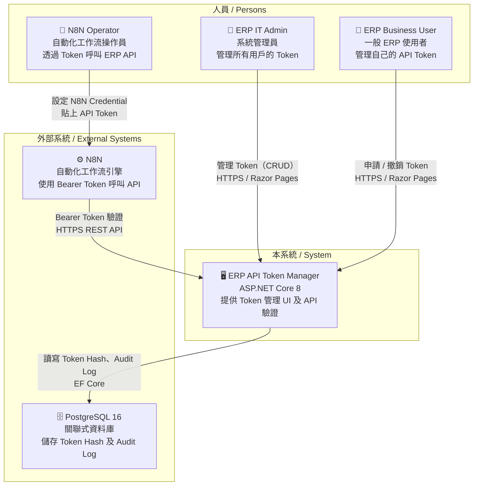
```mermaid
graph TB
    subgraph "人員 / Persons"
        ITAdmin["👤 ERP IT Admin<br/>系統管理員<br/>管理所有用戶的 Token"]
        BizUser["👤 ERP Business User<br/>一般 ERP 使用者<br/>管理自己的 API Token"]
        N8NOp["🤖 N8N Operator<br/>自動化工作流操作員<br/>透過 Token 呼叫 ERP API"]
    end

    subgraph "本系統 / System"
        ERP["🖥️ ERP API Token Manager<br/>ASP.NET Core 8<br/>提供 Token 管理 UI 及 API 驗證"]
    end

    subgraph "外部系統 / External Systems"
        N8N["⚙️ N8N<br/>自動化工作流引擎<br/>使用 Bearer Token 呼叫 API"]
        PG["🗄️ PostgreSQL 16<br/>關聯式資料庫<br/>儲存 Token Hash 及 Audit Log"]
    end

    ITAdmin -->|"管理 Token（CRUD）<br/>HTTPS / Razor Pages"| ERP
    BizUser -->|"申請 / 撤銷 Token<br/>HTTPS / Razor Pages"| ERP
    N8NOp -->|"設定 N8N Credential<br/>貼上 API Token"| N8N
    N8N -->|"Bearer Token 驗證<br/>HTTPS REST API"| ERP
    ERP -->|"讀寫 Token Hash、Audit Log<br/>EF Core"| PG
```

> **基礎設施備註**：生產環境部署時，NGINX Ingress Controller 位於 ASP.NET Core 應用程式前端，負責 TLS termination 及 `X-Forwarded-For` header forwarding（見 ARCH §2.1 C4 Level 1 完整拓撲）。EDD 本節聚焦應用層邊界；若需調整 Kestrel `ASPNETCORE_FORWARDEDHEADERS_ENABLED` 或 `KnownProxies` 設定，請參閱 ARCH §6.1。

### 2.2 Container 圖（C4 Level 2）

> **BC 對應（與 §3.4 Bounded Context 對齊）**：`RazorUI` + `RestAPI` (token endpoints) + `UseCases` (Create/Revoke/List) → 屬 **ApiTokenBC**；audit log 寫入路徑 → 屬 **AuditLogBC**；POC demo endpoints (`/api/v1/demo/*`) → 屬 **PocDemoBC**。

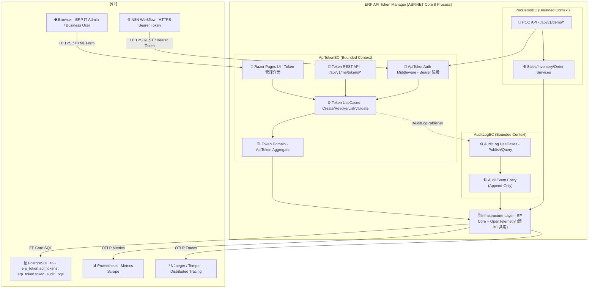
```mermaid
graph TB
    subgraph "ERP API Token Manager [ASP.NET Core 8 Process]"
        subgraph ApiTokenBC["ApiTokenBC (Bounded Context)"]
            RazorUI["📄 Razor Pages UI - Token 管理介面"]
            TokenAPI["🔌 Token REST API - /api/v1/me/tokens/*"]
            AuthMW["🔐 ApiTokenAuth Middleware - Bearer 驗證"]
            TokenUC["⚙️ Token UseCases - Create/Revoke/List/Validate"]
            TokenDomain["🏗️ Token Domain - ApiToken Aggregate"]
        end
        subgraph AuditLogBC["AuditLogBC (Bounded Context)"]
            AuditUC["⚙️ AuditLog UseCases - Publish/Query"]
            AuditDomain["🏗️ AuditEvent Entity (Append-Only)"]
        end
        subgraph PocDemoBC["PocDemoBC (Bounded Context)"]
            PocAPI["🔌 POC API - /api/v1/demo/*"]
            PocServices["⚙️ Sales/Inventory/Order Services"]
        end
        Infra["🗄️ Infrastructure Layer - EF Core + OpenTelemetry (跨 BC 共用)"]
    end

    subgraph "外部"
        Browser["🌐 Browser - ERP IT Admin / Business User"]
        N8NWF["⚙️ N8N Workflow - HTTPS Bearer Token"]
        PostgreSQL["🗄️ PostgreSQL 16 - erp_token.api_tokens, erp_token.token_audit_logs"]
        Prometheus["📊 Prometheus - Metrics Scrape"]
        Jaeger["🔍 Jaeger / Tempo - Distributed Tracing"]
    end

    Browser -->|"HTTPS / HTML Form"| RazorUI
    N8NWF -->|"HTTPS REST / Bearer Token"| AuthMW
    RazorUI --> TokenUC
    TokenAPI --> TokenUC
    AuthMW --> TokenUC
    PocAPI --> AuthMW
    PocAPI --> PocServices
    TokenUC --> TokenDomain
    TokenUC -.IAuditLogPublisher.-> AuditUC
    AuditUC --> AuditDomain
    TokenDomain --> Infra
    AuditDomain --> Infra
    PocServices --> Infra
    Infra -->|"EF Core SQL"| PostgreSQL
    Infra -->|"OTLP Metrics"| Prometheus
    Infra -->|"OTLP Traces"| Jaeger
```

**Module Directory Structure（Modular Monolith）：**

```
ErpApplication (ASP.NET Core 8 Host)
│
├── Modules/
│   └── ApiTokenManager/
│       ├── Domain/           ← Entities, Value Objects, Domain Events
│       ├── Application/      ← Use Cases, DTOs, Interfaces
│       ├── Infrastructure/   ← EF Core, Repositories, Crypto services
│       └── Presentation/     ← Razor Pages UI, REST Controllers, Middleware
│
└── Shared/
    ├── Kernel/               ← Base Entity, IRepository<T>, Result<T>
    └── Infrastructure/       ← PostgreSQL DbContext, OpenTelemetry setup
```

---

## 3. Architecture Design

### 3.1 架構模式

**選用模式：** Modular Monolith with Clean Architecture

**分層說明：**

```
Presentation Layer   — Razor Pages / REST Controllers（接收請求，驗證格式）
     ↓
Application Layer    — Use Case / Service（業務流程協調，不含業務規則）
     ↓
Domain Layer         — Entity / Domain Service（核心業務規則）
     ↓
Infrastructure Layer — Repository / Adapter（EF Core、外部服務實作）
```

### 3.1b Clean Architecture & SOLID 原則

**SOLID 原則對應表**

| 原則 | 全名 | 本系統實作方式 |
|------|------|--------------|
| SRP  | Single Responsibility | `CreateApiTokenUseCase` 只處理建立 token；`RevokeApiTokenUseCase` 只處理撤銷；`ApiTokenAuthenticationHandler` 只處理 Bearer 驗證 |
| OCP  | Open / Closed | 新增新的 token 類型透過實作 `ITokenGenerationService` 介面，不修改現有 class |
| LSP  | Liskov Substitution | 所有 `IApiTokenRepository` 子型別（含 in-memory test fake）可在不影響呼叫端的情況下互換 |
| ISP  | Interface Segregation | `IApiTokenRepository` 不含 audit log 方法；`IAuditLogRepository` 獨立介面，避免 use case 被迫實作不需要的方法 |
| DIP  | Dependency Inversion | `CreateApiTokenUseCase` 依賴 `IApiTokenRepository` 介面，`ApiTokenRepository` 在 DI Container（`Program.cs`）注入 |

**Dependency Rule（依賴方向）**

```
Presentation  →  Application  →  Domain  ←  Infrastructure
                                    ↑
                          （介面定義在 Application；
                           實作在 Infrastructure；
                           Domain 不引用 Infrastructure）
```

**禁止清單：**
- Domain 層不得 `import` 任何 EF Core / Microsoft.AspNetCore.* / 外部 SDK
- Application 層不得直接 `new` 任何 Infrastructure 具體類別（如 `new ApiTokenRepository()`）
- 跨層呼叫一律透過 DI 注入的 Interface

### 3.2 技術選型決策（ADR）

> **ADR Index**：本節為 ADR 唯一 SoT；§18.4 ADR Index 直接引用本節編號；任何新增 ADR 必須同步本節 + §18.4。

### ADR-001：採用 ASP.NET Core 8 LTS 作為主要 Web Framework

**狀態：** Accepted（MVP）

**背景：** 團隊技術棧偏好 .NET 生態；需選擇 LTS 版本確保 3 年支援週期。

**選項比較：**

| 選項 | 支援週期 | 效能 | 生態成熟度 |
|------|---------|------|----------|
| ASP.NET Core 8 LTS | ✅ 至 2026-11 | ✅✅ 最新優化 | ✅✅ 主流 |
| ASP.NET Core 7（STS） | ❌ 已 EOL | ✅ | ⚠️ 過渡 |
| ASP.NET Core 6 LTS | ⚠️ 至 2024-11（即將 EOL） | ✅ | ✅ |

**決策：** 採用 **ASP.NET Core 8 LTS**，獲得最長 LTS 支援週期 + Native AOT 預備能力。

**後果：** 必須跟進每月 Patch；2026-11 後需評估升級至 .NET 10 LTS。

---

### ADR-002：採用 Modular Monolith with Clean Architecture 架構模式

**狀態：** Accepted（MVP）

**背景：** 1–5 人團隊、< 100 用戶 MVP 規模；需在「未來可拆分微服務」與「當前部署簡單性」間取得平衡。

**選項比較：**

| 選項 | 部署複雜度 | 開發效率（小團隊）| 可觀測性 | 未來擴展性 |
|------|----------|----------------|---------|----------|
| Modular Monolith + Clean Architecture | ✅ 低（單一部署單元）| ✅✅ 最高 | ✅ 單一 OTel instance | ✅ 可拆分至微服務 |
| Microservices | ❌ 高（多個服務 + API Gateway）| ❌ 低（分散式開發複雜）| ⚠️ 需分散式追蹤 | ✅✅ 最靈活 |
| Layered Monolith（傳統 MVC）| ✅ 低 | ✅ 中 | ✅ 簡單 | ❌ 難測試 / 難拆分 |

**決策：** 採用 **Modular Monolith + Clean Architecture**。MVP 規模不需微服務複雜度（YAGNI）；Clean Architecture 確保 Domain 邏輯可測試且未來可拆分；單一 k8s Deployment 降低運維負擔。

**後果：** 未來若流量顯著增長，`ApiTokenManager` module 可獨立提取為 microservice（接口已通過 Repository 和 UseCase 隔離）。

---

### ADR-003：採用 PostgreSQL 16 作為主資料庫

**狀態：** Accepted（MVP）

**背景：** 系統需要一個關聯式資料庫儲存 Token Hash 和 Audit Log。

**選項比較：**

| 選項 | 授權成本 | EF Core 支援 | 容器化易度 | 適用場景 |
|------|---------|------------|---------|---------|
| PostgreSQL 16 | ✅ 開源免費 | ✅ Npgsql 完整支援 | ✅ 官方 Alpine image | 獨立部署 / k8s |
| SQL Server | ⚠️ 需授權（Express 免費但有限） | ✅ 完整支援 | ⚠️ 較大 image | ERP 現有 SQL Server 環境 |
| SQLite | ✅ 無授權 | ✅ 支援 | ✅ 嵌入式 | 本地開發 / 測試 |

**決策：** 採用 **PostgreSQL 16**。開源免費、k8s 部署完整支援、EF Core Npgsql driver 成熟穩定、`gen_random_uuid()` 原生支援、JSONB（audit before/after_state）原生支援。

**後果：** 需在 k8s 環境維運 PostgreSQL；本地開發使用 Docker PostgreSQL container；CI 使用 Testcontainers。

---

### ADR-004：採用 SHA-256（keyless）作為 Token Hash 演算法

**狀態：** Accepted（MVP）

**背景：** 系統需要在資料庫中安全儲存 API Token 的雜湊值，以便快速驗證而不儲存明文。候選：SHA-256（keyless）、HMAC-SHA256（with secret salt）、bcrypt/Argon2。

**選項比較：**

| 選項 | 安全性 | 查詢效能 | 複雜度 | 適用場景 |
|------|-------|---------|-------|---------|
| SHA-256（keyless） | ✅ 適合高熵輸入 | ✅ O(1) 索引查找 | ✅ 最簡單 | 256-bit 隨機 Token |
| HMAC-SHA256（with secret） | ✅✅ 額外 Secret 保護 | ✅ O(1) 索引查找 | ⚠️ 需管理 HMAC Secret | 需要 Secret 輪換場景 |
| bcrypt / Argon2 | ✅✅✅ 最強（密碼設計）| ❌ O(n) 全表掃描或無索引查找 | ❌ 最複雜 | 低熵輸入（密碼） |

**決策：** MVP 採用 **SHA-256（keyless）**。API Token 是 256-bit CSPRNG 隨機值（非密碼），無法被字典攻擊；keyless SHA-256 提供足夠安全性且允許 O(1) 唯一索引查找。v2 升級路徑為 HMAC-SHA256（增加 Secret 層防護）。

**後果：** DB 洩露時攻擊者無法逆推 Token（256-bit 熵）；升級 HMAC 時需遷移所有現有 Hash（rolling migration）。

---

### ADR-005：API Token 撤銷後立即生效（No-Cache Validation）

**狀態：** Accepted（MVP）

**背景：** Token 驗證為熱路徑（每個受保護 API 呼叫都會觸發）；引入快取可降低 DB 負載，但會延遲撤銷生效時間。

**選項比較：**

| 選項 | 撤銷生效延遲 | DB 負載 | 複雜度 | 適用流量 |
|------|------------|--------|-------|---------|
| 無快取（每次直查 DB） | ✅ 0 秒（即時） | ❌ 較高 | ✅ 最簡單 | < 100 QPS |
| Redis 快取 5 min TTL | ⚠️ ≤ 5 分鐘 | ✅✅ 大幅降低 | ⚠️ 需管理快取失效 | > 1000 QPS |
| Redis 快取 + Pub/Sub 失效 | ✅ 接近即時（< 1s） | ✅✅ 大幅降低 | ❌ 最複雜 | > 5000 QPS |

**決策：** MVP 採用 **無快取（每次直查 DB）**。原因：(1) MVP 流量 < 100 QPS，DB 索引查詢 P99 < 50ms 可承受；(2) PRD US-AUTH-003/AC-3 要求撤銷後 0 秒生效；(3) 無快取簡化 multi-pod 部署一致性。

**後果：** 流量超過 1000 QPS 時需引入 Redis 快取 + Pub/Sub 失效機制（v2 升級路徑）。

---

### 3.3 技術棧總覽

| 層次 | 技術 | 版本 | 選型理由 |
|------|------|------|---------|
| 後端語言 | C# | 12.0 | 強型別、現代化語言特性、與 ASP.NET Core 8 緊密整合 |
| 後端 Runtime 平台 | .NET | 8.0 LTS | LTS 支援週期長，效能優於前代 30%+ |
| Web / API Framework | ASP.NET Core | 8.0 | Microsoft 官方主流框架，Razor Pages + Controllers 雙模式支援 |
| ORM / 資料存取層 | Entity Framework Core | 8.0 | LINQ 整合，PostgreSQL 16 Provider 成熟，migrations 工具鏈完整 |
| 資料庫 | PostgreSQL | 16 | 開源、`gen_random_uuid()` 原生支援、k8s 部署友善、EF Core Npgsql provider 穩定 |
| 快取 | （MVP 不使用）| N/A | MVP 小流量不需快取；未來引入 Redis 7+ |
| 訊息佇列 | （MVP 不使用）| N/A | 同上；未來引入 RabbitMQ 或 AWS SQS |
| 認證 / 授權函式庫 | ASP.NET Core Authentication | 8.0 | 內建 `AuthenticationHandler<TOptions>` 抽象，便於實作自訂 Bearer scheme |
| 加密 / Hashing | System.Security.Cryptography.SHA256 | Built-in | .NET 內建，無外部依賴；對高熵 token 足夠 |
| Container Runtime | Docker | 25+ | 業界標準，與 K8s 緊密整合 |
| 容器編排 | Kubernetes | 1.29 | Rancher Desktop 本地（dev），生產環境 EKS / GKE / 自建 |
| CI 工具 | GitHub Actions | latest | 與 GitHub 倉庫零摩擦整合，YAML 設定即可 |
| CD 工具 | ArgoCD | 2.10+ | GitOps 模式，與 K8s 緊密整合 |
| 單元測試框架 | xUnit | 2.6+ | .NET 主流測試框架；Theory/InlineData 支援參數化測試 |
| 整合 / E2E 測試框架 | Testcontainers + Playwright | Testcontainers 3.7+ / Playwright .NET 1.44 | Testcontainers 啟動真實 PostgreSQL；Playwright 提供 Razor Pages E2E |
| 前端語言 | （Razor Pages 內嵌 HTML/JS）| HTML5 / ES2020 | MVP 不引入 SPA framework；Razor Pages 已足夠 |
| 前端框架 | Razor Pages | ASP.NET Core 8 | Server-side rendering，與 Backend 同進程，無 CORS 議題 |
| 客戶端引擎（若有）| Razor Pages | ASP.NET Core 8 | 純 server-rendered，無獨立 client engine |
| Observability | OpenTelemetry .NET SDK | 1.8 | 標準化 Metrics/Traces/Logs；Jaeger / Prometheus 整合 |
| Metrics | Prometheus.NET | 8.x | OpenTelemetry exporter 內建 Prometheus scrape 端點 |
| Logging | Serilog | 4.0+ | 結構化日誌；JSON sink 整合 EFK / Loki |

### 3.4 Bounded Context & Context Map（DDD）

> **與 §2.2 Container 圖對應**：本節定義的三個 BC（ApiTokenBC / AuditLogBC / PocDemoBC）已於 §2.2 Container 圖以 subgraph 顯示對應關係；任何 BC 邊界調整必須同步本節 + §2.2 + §3.4.1 Cross-BC Public Interface 清單。

**本系統的 Bounded Context：**

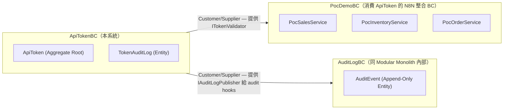
```mermaid
graph LR
    subgraph BC1["ApiTokenBC（本系統）"]
        A1["ApiToken (Aggregate Root)"]
        A2["TokenAuditLog (Entity)"]
    end
    subgraph BC2["AuditLogBC（同 Modular Monolith 內部）"]
        B1["AuditEvent (Append-Only Entity)"]
    end
    subgraph BC3["PocDemoBC（消費 ApiToken 的 N8N 整合 BC）"]
        C1["PocSalesService"]
        C2["PocInventoryService"]
        C3["PocOrderService"]
    end
    BC1 -->|"Customer/Supplier — 提供 ITokenValidator"| BC3
    BC1 -->|"Customer/Supplier — 提供 IAuditLogPublisher 給 audit hooks"| BC2
```

**Context Map 關係說明：**

| 上游 BC | 下游 BC | 整合模式 | 說明 |
|--------|--------|---------|------|
| ApiTokenBC | PocDemoBC | Customer/Supplier | PocDemo 透過 `ITokenValidator` 介面消費 ApiToken 的驗證能力，禁止直接 SQL JOIN api_tokens 資料表 |
| ApiTokenBC | AuditLogBC | Customer/Supplier | ApiToken 的 create/revoke 同交易內呼叫 `IAuditLogPublisher`；失敗則上層 rollback |
| AuditLogBC | （UI / 外部 admin tools）| Open Host Service | 透過 `IAuditLogQueryPort` 提供 read-only 查詢 |

**Schema 擁有權（Schema Ownership Table）：**

| Bounded Context | 擁有的 DB Schema / Tables | 對外 Public Interface |
|----------------|--------------------------|----------------------|
| ApiTokenBC | `erp_token.api_tokens` | `ITokenValidator`, `IApiTokenQueryPort`, REST API `/api/v1/me/tokens/*` |
| AuditLogBC | `erp_token.token_audit_logs` | `IAuditLogPublisher`, `IAuditLogQueryPort`, REST API `/api/v1/admin/audit-logs` |
| PocDemoBC | （無 schema，無狀態 fixture data）| REST API `/api/v1/demo/*` |

> **HC-1 硬約束（Spring Modulith / .NET Modulith convention）**：任何其他 BC 不得直接存取本 BC 的 DB Tables。跨 BC 資料存取只能透過：(1) 該 BC 提供的 Public REST API，或 (2) 該 BC 提供的 Application-layer interface（如 `ITokenValidator`）。**禁止**跨 BC 的 DB-level JOIN 或 Repository 直接引用。

**Cross-BC Public Interface 清單**

#### 3.4.1 Cross-BC Public Interface 清單（HC-2 SoT，align-fix 補入）

> 此表是 `features/architecture/modulith-public-interface.feature`（HC-2 Public Interface Discipline）所斷言的「跨 BC 公開介面 SoT」。
> 任何新增、移除或重命名跨 BC 介面，必須同步本表 + ARCH §4.1 + HC-2 BDD scenario。

| Owning BC | Public Interface | 對外輪廓（caller 看得到的合約） | 主要 Caller | 對應 API endpoint / pipeline |
|-----------|------------------|------------------------------|-----------|-----------------------------|
| **ApiTokenBC** | `ITokenValidator` | `ValidateAsync(rawToken) → TokenValidationResult { isValid, userId, tokenId, status, errorCode }` | PocDemoBC（Bearer 中介層）| `GET /api/v1/demo/*`（中介層內部呼叫，不直連 DB） |
| **ApiTokenBC** | `IApiTokenQueryPort` | `GetByIdAsync(tokenId, requestor) → ApiTokenView`、`ListByUserAsync(userId, filter) → IReadOnlyList<ApiTokenView>` | AuditLogBC（補強 audit context） | `GET /api/v1/me/tokens/{tokenId}/audit` 構面 |
| **AuditLogBC** | `IAuditLogPublisher` | `PublishAsync(AuditEvent { eventId, action, actorUserId, targetTokenId, targetUserId, ip, ua, timestamp })` | ApiTokenBC（create/revoke/describe_update）、Authentication（admin_grant/admin_revoke） | 同交易內呼叫；失敗則上層 rollback |
| **AuditLogBC** | `IAuditLogQueryPort` | `QueryAsync(criteria) → IReadOnlyList<AuditEventView>`、`ExportCsvAsync(filter, writer) → ExportSummary` | Razor Page `/ApiTokens/AuditLog`（IT Admin） | `GET /ApiTokens/AuditLog`、`GET /api/v1/admin/audit-logs` |
| **PocDemoBC** | （無對外公開介面） | — | — | 為 leaf module；僅消費 ApiTokenBC.ITokenValidator |

> 規則：
> 1. 跨 BC 呼叫只能透過上表介面，禁止直接 SQL JOIN 對方擁有的資料表（HC-3 BDD `boundaries-and-encapsulation` 已斷言）。
> 2. 介面合約變更需同步更新 ARCH §1.2 BC 表、本表、與對應的 features/architecture/HC-3 scenario。
> 3. 介面回傳 DTO/View Model（如 `ApiTokenView`、`AuditEventView`），不暴露 EF Core entity。

### 3.5 部署環境規格（Deployment Environment Matrix 摘要）

> 完整環境矩陣（HPA/PDB/Secret 路徑/CPU/Mem 限制等）詳見 §13.2.2；本節為設計階段所需的精簡摘要。

| 環境 | Min Replicas | Max Replicas | CPU Limit | Mem Limit | 備註 |
|------|------------|------------|----------|----------|------|
| Local（Rancher Desktop） | 2 | 2 | 500m | 512Mi | 最小 HA 配置（Nginx → 2 API + 2 Worker） |
| Dev | 2 | 4 | 500m | 512Mi | HPA CPU 70% 觸發擴展 |
| Staging | 2 | 6 | 1000m | 768Mi | Blue-Green 部署 |
| Production | 2 | 10 | 1000m | 1Gi | Canary 部署 + 雙 Region Active-Passive |

詳細規格見 §13.2.2 Environment Configuration。

### 3.6 HA / SPOF / Scale / BCP Specification

#### 3.6.1 SPOF 分析表（單點故障識別）

| 元件 | SPOF 風險 | 緩解策略 | 復原機制 |
|------|----------|---------|---------|
| ASP.NET Core API Pod | ❌ 已消除（≥ 2 replicas + HPA） | Kubernetes Deployment + Liveness/Readiness Probe | Pod 重啟，HPA 補位 |
| PostgreSQL Primary | ⚠️ 暫時 SPOF（MVP）| Active-Passive Streaming Replication（Standby in DR Region） | 手動 failover（≤ 4h），未來自動化（Patroni） |
| Nginx Ingress Controller | ❌ 已消除（≥ 2 replicas） | DaemonSet 或 Deployment with PDB | LB 健康檢查移除故障節點 |
| Kubernetes Control Plane | ❌（雲端託管 EKS/GKE） | 託管服務 SLA 99.95% | 雲端供應商負責 |
| OpenTelemetry Collector | ❌（觀察性鏈路降級可接受） | Sidecar pattern + buffer | Pod 重啟；遺失 < 5 min 觀測資料 |

#### 3.6.2 HA 設計原則

1. **無單點 API**：所有環境 Min Replicas ≥ 2（含 Local 開發）
2. **無狀態應用層**：Token 驗證每次直查 DB，無 in-process cache（保證任意 pod 可服務任意請求）
3. **資料層備援**：PostgreSQL Streaming Replication（Active-Passive；Read Replica 可選）
4. **健康探針隔離**：Liveness Probe（重啟條件）≠ Readiness Probe（流量路由條件）
5. **Graceful Shutdown**：SIGTERM 後 30s grace period，drain in-flight requests

#### 3.6.3 SLO / RTO / RPO 數值（SoT — 與 BRD §3.1 對齊）

| 指標 | 目標 | 備註 |
|------|------|------|
| Availability SLO | **99.5%**（月，BRD §3.1 O1） | 允許 ≤ 3.65h/month downtime |
| RTO（Recovery Time Objective） | **≤ 4 hours** | 從災害發生到完全復原 |
| RPO（Recovery Point Objective） | **≤ 15 minutes** | 最大可接受資料損失（基於 streaming replication lag + 每 15 min WAL ship） |
| Error Budget | 0.5% / month ≈ 3.65h | 詳見 §11.4 SLO Error Budget |

> **追溯**：本節為 §13.4 DR/RTO/RPO 表的 SoT；§11 Performance Design SLO 與 §10.7.2 Audit Log 保留策略須引用本節。

#### 3.6.4 BCP 場景表（Business Continuity Plan）

| 失效場景 | 偵測 | 自動緩解 | 手動 Runbook | 預期 RTO |
|---------|------|---------|-------------|---------|
| 單一 API pod crash | Liveness Probe failure | k8s 重啟 + HPA 補位 | — | < 1 min |
| Worker node fail | Node NotReady | Pod 重排程到健康 node | — | < 5 min |
| PostgreSQL Primary fail | DB connection timeout alert | — | Failover 至 Standby（提升 standby + 改 connection string） | ≤ 30 min（人工）→ 未來自動化 ≤ 5 min |
| Region 整體失效 | 跨 Region 健康檢查 | DNS failover 至 Passive Region | 啟用 DR Region 應用 + 還原最近 WAL | ≤ 4 h |
| OTel Collector down | 觀測性訊號斷流 | Fallback to stdout JSON logs（§8.5）| — | < 1 min |

#### 3.6.5 Graceful Shutdown 規範

- SIGTERM 收到後立即關閉 readiness probe（從 Service endpoints 移除）
- 30 秒 grace period 完成 in-flight requests
- 強制 30s 後 SIGKILL（k8s `terminationGracePeriodSeconds: 30`）
- 詳見 §8.4 Graceful Shutdown 程式碼實作

### 3.7 HA 架構圖

#### Figure A — 生產環境 HA 拓撲（雙 Region Active-Passive）

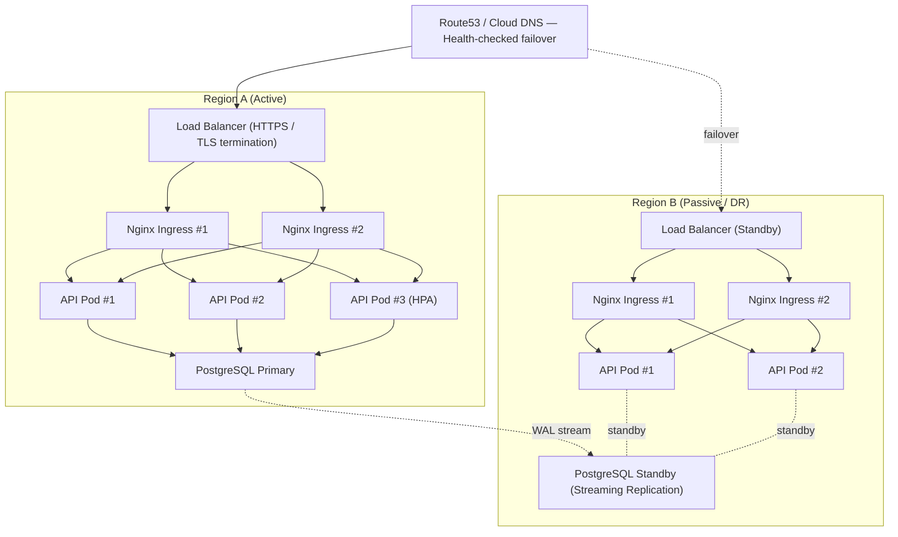
```mermaid
graph TB
    subgraph "Region A (Active)"
        LBA["Load Balancer (HTTPS / TLS termination)"]
        IngA1["Nginx Ingress #1"]
        IngA2["Nginx Ingress #2"]
        ApiA1["API Pod #1"]
        ApiA2["API Pod #2"]
        ApiA3["API Pod #3 (HPA)"]
        PgPrimary["PostgreSQL Primary"]
    end
    subgraph "Region B (Passive / DR)"
        LBB["Load Balancer (Standby)"]
        IngB1["Nginx Ingress #1"]
        IngB2["Nginx Ingress #2"]
        ApiB1["API Pod #1"]
        ApiB2["API Pod #2"]
        PgStandby["PostgreSQL Standby (Streaming Replication)"]
    end
    DNS["Route53 / Cloud DNS — Health-checked failover"]
    DNS --> LBA
    DNS -.failover.-> LBB
    LBA --> IngA1 & IngA2
    IngA1 --> ApiA1 & ApiA2 & ApiA3
    IngA2 --> ApiA1 & ApiA2 & ApiA3
    ApiA1 & ApiA2 & ApiA3 --> PgPrimary
    PgPrimary -.WAL stream.-> PgStandby
    LBB --> IngB1 & IngB2
    IngB1 --> ApiB1 & ApiB2
    IngB2 --> ApiB1 & ApiB2
    ApiB1 & ApiB2 -.standby.- PgStandby
```

#### Figure B — 本地最小 HA 拓撲（Rancher Desktop）

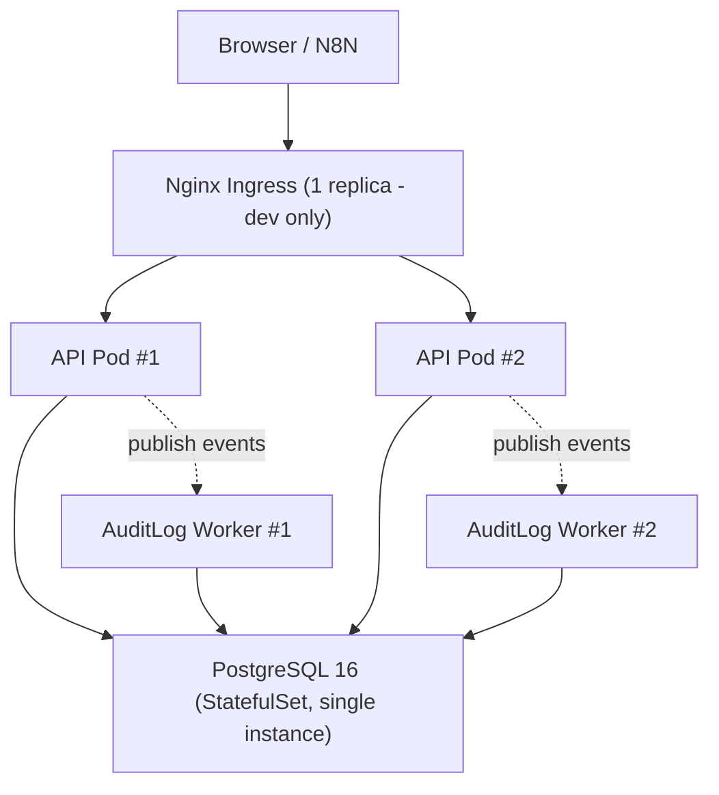
```mermaid
graph TB
    Browser["Browser / N8N"]
    Nginx["Nginx Ingress (1 replica - dev only)"]
    Api1["API Pod #1"]
    Api2["API Pod #2"]
    Worker1["AuditLog Worker #1"]
    Worker2["AuditLog Worker #2"]
    Pg["PostgreSQL 16 (StatefulSet, single instance)"]
    Browser --> Nginx
    Nginx --> Api1
    Nginx --> Api2
    Api1 --> Pg
    Api2 --> Pg
    Api1 -.publish events.-> Worker1
    Api2 -.publish events.-> Worker2
    Worker1 --> Pg
    Worker2 --> Pg
```

#### 最小 Replica 表

| 環境 | API Min Replicas | Worker Min Replicas | PostgreSQL | Nginx Ingress |
|------|----------------|--------------------|-----------|--------------|
| Local | 2 | 2 | 1（StatefulSet） | 1 |
| Dev | 2 | 2 | 1 | 2 |
| Staging | 2 | 2 | 1 + Read Replica | 2 |
| Production | 2（HPA up to 10） | 2（HPA up to 4） | Primary + Standby（DR Region） | 2 |

### 3.8 Data Flow Overview

**Flow A — N8N Bearer Token authenticated demo call:**

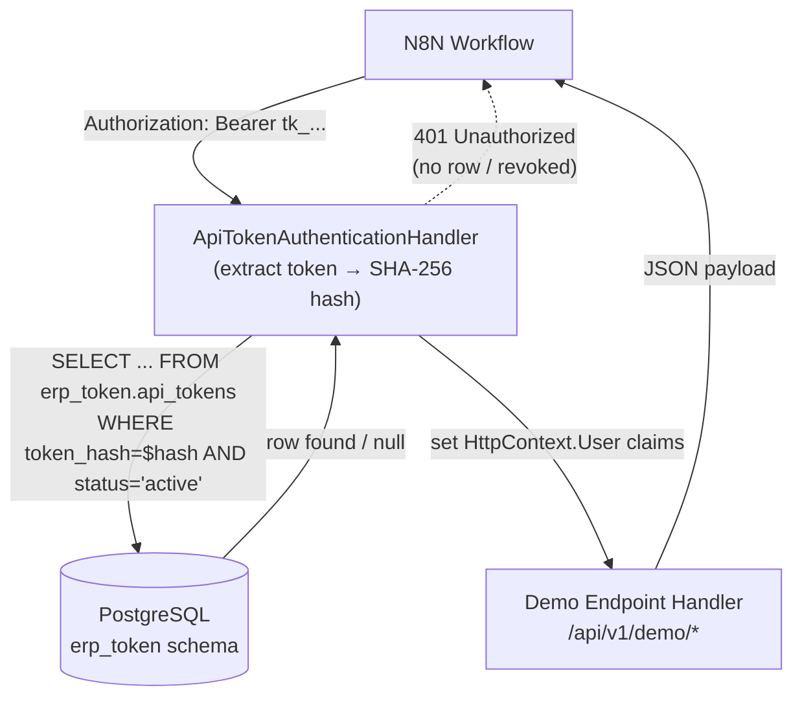
```mermaid
flowchart TD
    N8N["N8N Workflow"] -->|"Authorization: Bearer tk_..."| AuthMW["ApiTokenAuthenticationHandler<br/>(extract token → SHA-256 hash)"]
    AuthMW -->|"SELECT ... FROM erp_token.api_tokens<br/>WHERE token_hash=$hash AND status='active'"| DB[("PostgreSQL<br/>erp_token schema")]
    DB -->|"row found / null"| AuthMW
    AuthMW -->|"set HttpContext.User claims"| Handler["Demo Endpoint Handler<br/>/api/v1/demo/*"]
    AuthMW -. "401 Unauthorized<br/>(no row / revoked)" .-> N8N
    Handler -->|"JSON payload"| N8N
```

**Flow B — Browser-driven Razor Pages UI flow (ERP IT Admin):**

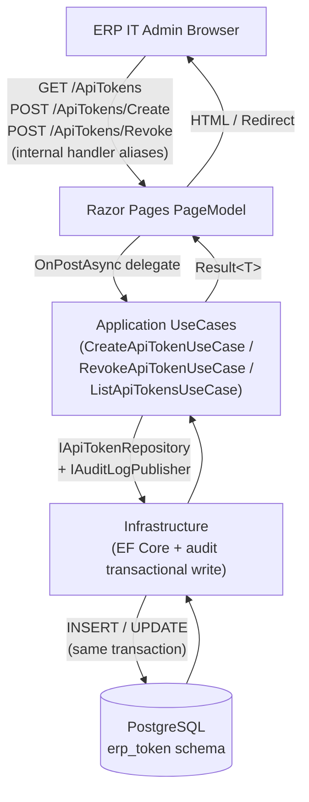
```mermaid
flowchart TD
    Browser["ERP IT Admin Browser"] -->|"GET /ApiTokens<br/>POST /ApiTokens/Create<br/>POST /ApiTokens/Revoke<br/>(internal handler aliases)"| RazorPages["Razor Pages PageModel"]
    RazorPages -->|"OnPostAsync delegate"| UseCases["Application UseCases<br/>(CreateApiTokenUseCase /<br/>RevokeApiTokenUseCase /<br/>ListApiTokensUseCase)"]
    UseCases -->|"IApiTokenRepository<br/>+ IAuditLogPublisher"| Infra["Infrastructure<br/>(EF Core + audit transactional write)"]
    Infra -->|"INSERT / UPDATE<br/>(same transaction)"| DB[("PostgreSQL<br/>erp_token schema")]
    DB --> Infra
    Infra --> UseCases
    UseCases -->|"Result&lt;T&gt;"| RazorPages
    RazorPages -->|"HTML / Redirect"| Browser
```

### 3.9 Module Dependency Graph

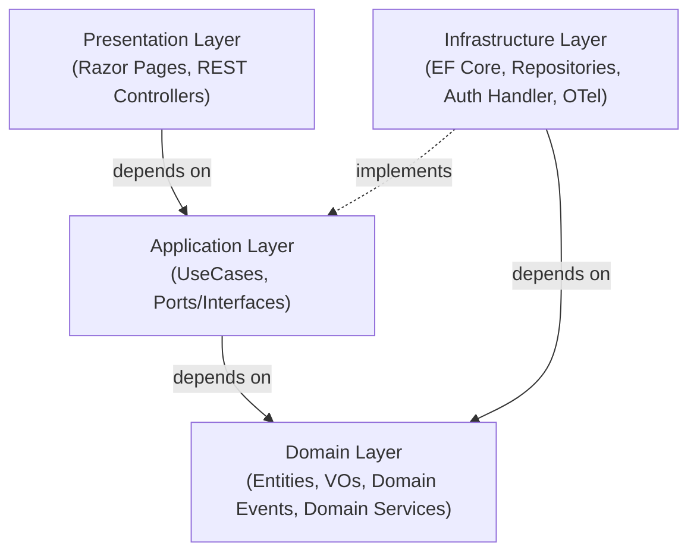
```mermaid
graph TD
    Presentation["Presentation Layer<br/>(Razor Pages, REST Controllers)"]
    Application["Application Layer<br/>(UseCases, Ports/Interfaces)"]
    Domain["Domain Layer<br/>(Entities, VOs, Domain Events, Domain Services)"]
    Infrastructure["Infrastructure Layer<br/>(EF Core, Repositories, Auth Handler, OTel)"]

    Presentation -->|depends on| Application
    Application -->|depends on| Domain
    Infrastructure -.->|implements| Application
    Infrastructure -->|depends on| Domain

    %% Hard rule: Infrastructure must not reach into Domain internals beyond contracts
    %% (no concrete dependency on Domain implementation classes outside Aggregate Root API).
```

> Domain layer 對外無任何向外依賴（pure）；Infrastructure 僅透過 Domain 的 Aggregate Root 公開介面與 Domain Events 與其互動，不依賴 Domain 內部具體實作類別。詳細跨模組依賴 DAG（HC-5 無循環驗證）見 §4.3。

---

## 4. Module / Component Design

本章節提供從 Use Case 到 Class 級的模組分解。Sequence/Activity/State 圖請見 §7。

### 4.1 Use Case Diagram

> 角色與端點的完整授權矩陣詳見 §9.10 RBAC 角色權限矩陣。

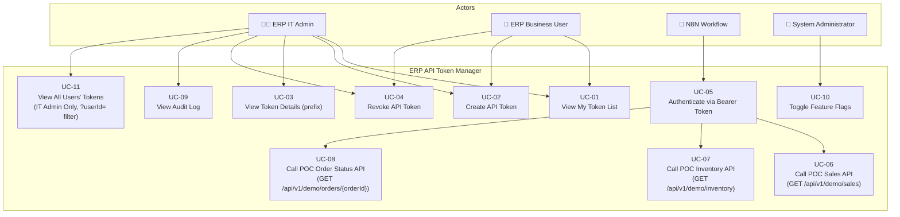
```mermaid
%% UC-01: ERP API Token Manager — Use Case Diagram
graph TB
    subgraph Actors
        Admin["🧑‍💼 ERP IT Admin"]
        BizUser["👤 ERP Business User"]
        N8N["🤖 N8N Workflow"]
        SysAdmin["🔧 System Administrator"]
    end

    subgraph ErpApiTokenManager["ERP API Token Manager"]
        UC1["UC-01<br/>View My Token List"]
        UC2["UC-02<br/>Create API Token"]
        UC3["UC-03<br/>View Token Details (prefix)"]
        UC4["UC-04<br/>Revoke API Token"]
        UC5["UC-05<br/>Authenticate via Bearer Token"]
        UC6["UC-06<br/>Call POC Sales API<br/>(GET /api/v1/demo/sales)"]
        UC7["UC-07<br/>Call POC Inventory API<br/>(GET /api/v1/demo/inventory)"]
        UC8["UC-08<br/>Call POC Order Status API<br/>(GET /api/v1/demo/orders/{orderId})"]
        UC9["UC-09<br/>View Audit Log"]
        UC10["UC-10<br/>Toggle Feature Flags"]
        UC11["UC-11<br/>View All Users' Tokens<br/>(IT Admin Only, ?userId= filter)"]
    end

    Admin --> UC1
    Admin --> UC2
    Admin --> UC3
    Admin --> UC4
    Admin --> UC9
    Admin --> UC11
    BizUser --> UC1
    BizUser --> UC2
    BizUser --> UC4
    N8N --> UC5
    UC5 --> UC6
    UC5 --> UC7
    UC5 --> UC8
    SysAdmin --> UC10
```

#### 4.1.1 Use Case Traceability

> 詳見 §9.10 RBAC 角色權限矩陣

| Use Case | Actor | Related AC |
|---|---|---|
| UC-01 View My Token List | ERP User, IT Admin | US-AUTH-002 / AC-1, AC-2, AC-3, AC-5 |
| UC-02 Create API Token | ERP User, IT Admin | US-AUTH-001 / AC-1, AC-2, AC-3, AC-4, AC-5, AC-6 |
| UC-03 View Token Details | ERP User, IT Admin | US-AUTH-002 / AC-1, AC-2 |
| UC-04 Revoke API Token | ERP User, IT Admin | US-AUTH-003 / AC-1, AC-2, AC-3, AC-4, AC-5, AC-6 |
| UC-05 Authenticate via Bearer Token | N8N System | US-AUTH-004 / AC-1, AC-2, AC-3, AC-4, AC-5, AC-6, AC-7, AC-8, AC-9 |
| UC-06 Call POC Sales API | N8N System | US-DEMO-001 / AC-1, AC-2, AC-3, AC-4, AC-5 |
| UC-07 Call POC Inventory API | N8N System | US-DEMO-002 / AC-1, AC-2, AC-3, AC-4 |
| UC-08 Call POC Order Status API | N8N System | US-DEMO-003 / AC-1, AC-2, AC-3 |
| UC-09 View Audit Log | IT Admin | US-AUDIT-001 / AC-1, AC-2, AC-3 |
| UC-10 Toggle Feature Flags | System Administrator | — (operational) |
| UC-11 View All Users' Tokens | IT Admin | US-AUTH-005 / AC-1, AC-2, AC-3 |

### 4.2 Class Diagram — Domain Layer

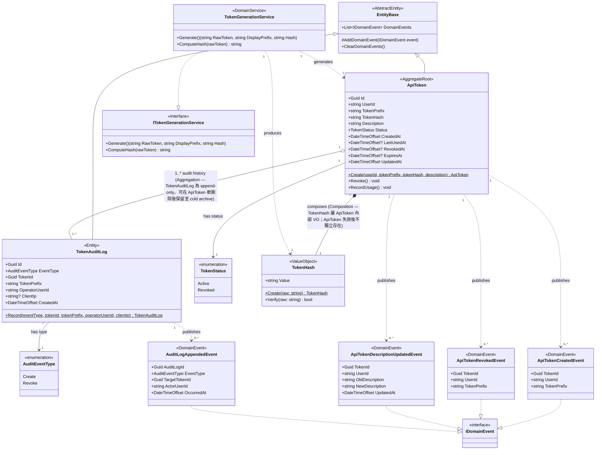
```mermaid
classDiagram
    class EntityBase {
        <<AbstractEntity>>
        +List~IDomainEvent~ DomainEvents
        #AddDomainEvent(IDomainEvent event)
        +ClearDomainEvents()
    }

    class ApiToken {
        <<AggregateRoot>>
        +Guid Id
        +string UserId
        +string TokenPrefix
        +string TokenHash
        +string Description
        +TokenStatus Status
        +DateTimeOffset CreatedAt
        +DateTimeOffset? LastUsedAt
        +DateTimeOffset? RevokedAt
        +DateTimeOffset? ExpiresAt
        +DateTimeOffset UpdatedAt
        +Create(userId, tokenPrefix, tokenHash, description) ApiToken$
        +Revoke() void
        +RecordUsage() void
    }

    class TokenAuditLog {
        <<Entity>>
        +Guid Id
        +AuditEventType EventType
        +Guid TokenId
        +string TokenPrefix
        +string OperatorUserId
        +string? ClientIp
        +DateTimeOffset CreatedAt
        +Record(eventType, tokenId, tokenPrefix, operatorUserId, clientIp) TokenAuditLog$
    }

    class TokenStatus {
        <<enumeration>>
        Active
        Revoked
    }

    class AuditEventType {
        <<enumeration>>
        Create
        Revoke
    }

    class ApiTokenCreatedEvent {
        <<DomainEvent>>
        +Guid TokenId
        +string UserId
        +string TokenPrefix
    }

    class ApiTokenRevokedEvent {
        <<DomainEvent>>
        +Guid TokenId
        +string UserId
        +string TokenPrefix
    }

    class ApiTokenDescriptionUpdatedEvent {
        <<DomainEvent>>
        +Guid TokenId
        +string UserId
        +string OldDescription
        +string NewDescription
        +DateTimeOffset UpdatedAt
    }

    class AuditLogAppendedEvent {
        <<DomainEvent>>
        +Guid AuditLogId
        +AuditEventType EventType
        +Guid TargetTokenId
        +string ActorUserId
        +DateTimeOffset OccurredAt
    }

    class IDomainEvent {
        <<interface>>
    }

    class ITokenGenerationService {
        <<Interface>>
        +Generate() (string RawToken, string DisplayPrefix, string Hash)
        +ComputeHash(rawToken) string
    }

    class TokenGenerationService {
        <<DomainService>>
        +Generate() (string RawToken, string DisplayPrefix, string Hash)
        +ComputeHash(rawToken) string
    }

    class TokenHash {
        <<ValueObject>>
        +string Value
        +Create(raw: string)$ TokenHash
        +Verify(raw: string) bool
    }

    EntityBase <|-- ApiToken
    EntityBase <|-- TokenAuditLog
    ApiToken "1" --> "1" TokenStatus : has status
    TokenAuditLog "1" --> "1" AuditEventType : has type
    ApiToken "1" o-- "1..*" TokenAuditLog : 1..* audit history (Aggregation — TokenAuditLog 為 append-only，可在 ApiToken 軟刪除後保留至 cold archive)
    ApiToken "1" *-- "1" TokenHash : composes (Composition — TokenHash 屬 ApiToken 內部 VO；ApiToken 失效後不獨立存在)
    ApiToken "1" ..> "0..*" ApiTokenCreatedEvent : publishes
    ApiToken "1" ..> "0..*" ApiTokenRevokedEvent : publishes
    ApiToken "1" ..> "0..*" ApiTokenDescriptionUpdatedEvent : publishes
    TokenAuditLog "1" ..> "0..*" AuditLogAppendedEvent : publishes
    ApiTokenCreatedEvent ..|> IDomainEvent
    ApiTokenRevokedEvent ..|> IDomainEvent
    ApiTokenDescriptionUpdatedEvent ..|> IDomainEvent
    AuditLogAppendedEvent ..|> IDomainEvent
    TokenGenerationService ..|> ITokenGenerationService
    TokenGenerationService "1" ..> "1" ApiToken : generates
    TokenGenerationService "1" ..> "1" TokenHash : produces
```

> **6 種 UML 關係覆蓋（align-fix 補入）**：
> - Inheritance（`<|--`）：`EntityBase <|-- ApiToken`
> - Realization / Implementation（`..|>`）：`ApiTokenCreatedEvent ..|> IDomainEvent`
> - Composition（`*--`）：`ApiToken *-- TokenHash`（內含 VO，生命週期一致）
> - **Aggregation（`o--`，新增）**：`ApiToken o-- TokenAuditLog`（弱擁有；audit log 為 append-only，跨 ApiToken 生命週期保留）
> - Association（`-->`）：`ApiToken --> TokenStatus`
> - Dependency（`..>`）：`ApiToken ..> ApiTokenCreatedEvent`

#### 4.2.1 Domain Layer — Class Inventory

| Class | Stereotype | Layer | src 路徑 | test 路徑 |
|-------|-----------|-------|---------|---------|
| EntityBase | `<<AbstractEntity>>` | Shared/Kernel | `src/Shared/Kernel/EntityBase.cs` | `tests/Unit/Domain/EntityBaseTests.cs` |
| IDomainEvent | `<<interface>>` | Domain | `src/Domain/Events/IDomainEvent.cs` | — |
| ApiToken | `<<AggregateRoot>>` | Domain | `src/Domain/ApiTokens/ApiToken.cs` | `tests/Unit/Domain/ApiTokenTests.cs` |
| TokenAuditLog | `<<Entity>>` | Domain | `src/Domain/ApiTokens/TokenAuditLog.cs` | `tests/Unit/Domain/TokenAuditLogTests.cs` |
| TokenStatus | `<<enumeration>>` | Domain | `src/Domain/ApiTokens/TokenStatus.cs` | — |
| AuditEventType | `<<enumeration>>` | Domain | `src/Domain/ApiTokens/AuditEventType.cs` | — |
| TokenHash | `<<ValueObject>>` | Domain | `src/Domain/ApiTokens/TokenHash.cs` | `tests/Unit/Domain/TokenHashTests.cs` |
| ApiTokenCreatedEvent | `<<DomainEvent>>` | Domain | `src/Domain/Events/ApiTokenCreatedEvent.cs` | — |
| ApiTokenRevokedEvent | `<<DomainEvent>>` | Domain | `src/Domain/Events/ApiTokenRevokedEvent.cs` | — |
| ApiTokenDescriptionUpdatedEvent | `<<DomainEvent>>` | Domain | `src/Domain/Events/ApiTokenDescriptionUpdatedEvent.cs` | — |
| AuditLogAppendedEvent | `<<DomainEvent>>` | Domain | `src/Domain/Events/AuditLogAppendedEvent.cs` | — |
| TokenGenerationService | `<<DomainService>>` | Domain | `src/Domain/Services/TokenGenerationService.cs` | `tests/Unit/Domain/TokenGenerationServiceTests.cs` |

### 4.3 跨模組依賴 DAG 驗證（HC-5 Acyclic Module Graph）

> **HC-5 硬約束**：模組依賴必須形成有向無環圖（DAG）；任何循環依賴會導致 NetArchTest 自動化失敗。

**模組依賴 DAG（Bounded Context 層級）：**

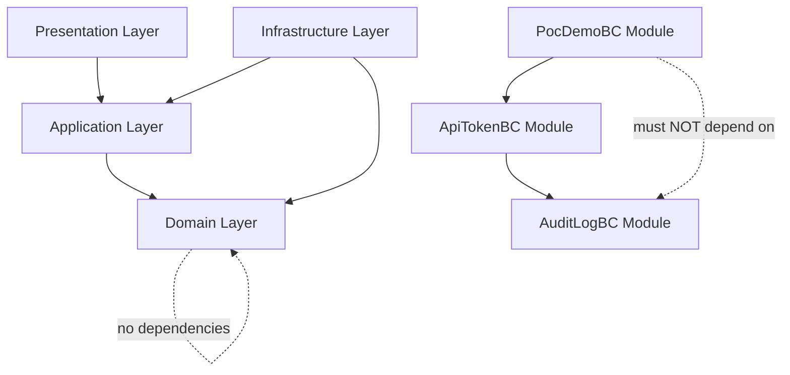
```mermaid
graph TD
    Presentation[Presentation Layer]
    Application[Application Layer]
    Domain[Domain Layer]
    Infrastructure[Infrastructure Layer]
    PocDemoBC[PocDemoBC Module]
    AuditLogBC[AuditLogBC Module]
    ApiTokenBC[ApiTokenBC Module]

    Presentation --> Application
    Application --> Domain
    Infrastructure --> Application
    Infrastructure --> Domain
    PocDemoBC --> ApiTokenBC
    ApiTokenBC --> AuditLogBC
    PocDemoBC -.must NOT depend on.-> AuditLogBC
    Domain -.no dependencies.-> Domain
```

**DAG 性質驗證：**
- 無循環：`Domain` 為終端節點（無出邊），`Presentation` 為起始節點（無入邊）
- 跨 BC 依賴方向：`PocDemoBC → ApiTokenBC → AuditLogBC` 為線性無環
- `Infrastructure` 實作 `Application` 介面，依賴關係為 implements + uses Domain（DIP 滿足）

**NetArchTest Skeleton（C# 對應 Java ArchUnit）：**

```csharp
// tests/Architecture/ModuleDependencyTests.cs
using NetArchTest.Rules;
using Xunit;

public class ModuleDependencyTests
{
    [Fact]
    public void Domain_ShouldNot_DependOn_AnyOtherLayer()
    {
        var result = Types.InAssembly(typeof(ApiToken).Assembly)
            .That().ResideInNamespace("ErpApiTokenManager.Domain")
            .ShouldNot()
            .HaveDependencyOnAny(
                "ErpApiTokenManager.Application",
                "ErpApiTokenManager.Infrastructure",
                "ErpApiTokenManager.Presentation")
            .GetResult();
        Assert.True(result.IsSuccessful, $"Domain layer 違反零依賴：{string.Join(",", result.FailingTypeNames ?? new List<string>())}");
    }

    [Fact]
    public void Application_ShouldNot_DependOn_Infrastructure_or_Presentation()
    {
        var result = Types.InAssembly(typeof(CreateApiTokenUseCase).Assembly)
            .That().ResideInNamespace("ErpApiTokenManager.Application")
            .ShouldNot()
            .HaveDependencyOnAny(
                "ErpApiTokenManager.Infrastructure",
                "ErpApiTokenManager.Presentation")
            .GetResult();
        Assert.True(result.IsSuccessful);
    }

    [Fact]
    public void PocDemoBC_ShouldNot_DependOn_AuditLogBC_Directly()
    {
        // HC-1: 跨 BC 直接依賴禁止；只能透過 ApiTokenBC.ITokenValidator
        var result = Types.InAssembly(typeof(PocSalesService).Assembly)
            .That().ResideInNamespace("ErpApiTokenManager.PocDemo")
            .ShouldNot()
            .HaveDependencyOn("ErpApiTokenManager.AuditLog")
            .GetResult();
        Assert.True(result.IsSuccessful, "PocDemoBC 不應直接依賴 AuditLogBC（HC-1 違反）");
    }

    [Fact]
    public void AssemblyGraph_ShouldBe_Acyclic()
    {
        // HC-5: 模組依賴必須無循環
        var allTypes = Types.InAssembly(typeof(ApiToken).Assembly).GetTypes();
        var cycles = AssemblyGraphAnalyzer.DetectCycles(allTypes); // helper 實作於 tests/Architecture/AssemblyGraphAnalyzer.cs
        Assert.Empty(cycles);
    }
}
```

> **CI 整合**：上述測試於 `dotnet test --filter Category=Architecture` 執行；CI Quality Gate 要求 100% 通過（§13.6）。

### 4.3a Class Diagram — Application Layer


```mermaid
classDiagram
    class IApiTokenRepository {
        <<interface>>
        +GetByIdAsync(id, ct) Task~ApiToken?~
        +GetByIdForUpdateAsync(id, ct) Task~ApiToken?~
        +GetByHashAsync(hash, ct) Task~ApiToken?~
        +GetByUserIdAsync(userId, ct) Task~List~ApiToken~~
        +GetAllAsync(ct) Task~IReadOnlyList~ApiToken~~
        +AddAsync(token, ct) Task
        +SaveChangesAsync(ct) Task~int~
    }

    class IAuditLogRepository {
        <<interface>>
        +AddAsync(log, ct) Task
        +GetByTokenIdAsync(tokenId, ct) Task~List~TokenAuditLog~~
        +SaveChangesAsync(ct) Task~int~
    }

    class ITokenGenerationService {
        <<interface>>
        +Generate() (string RawToken, string DisplayPrefix, string Hash)
        +ComputeHash(rawToken) string
    }

    class CreateApiTokenUseCase {
        <<UseCase>>
        -IApiTokenRepository _tokenRepo
        -IAuditLogRepository _auditRepo
        -IHttpContextAccessor _httpCtx
        -ITokenGenerationService _tokenGenerator
        +ExecuteAsync(command, ct) Task~CreateTokenResult~
    }

    class RevokeApiTokenUseCase {
        <<UseCase>>
        -IApiTokenRepository _tokenRepo
        -IAuditLogRepository _auditRepo
        -IHttpContextAccessor _httpCtx
        +ExecuteAsync(command, ct) Task~Result~
    }

    class ListApiTokensUseCase {
        <<UseCase>>
        -IApiTokenRepository _tokenRepo
        +ExecuteAsync(query, ct) Task~List~TokenSummaryDto~~
    }

    class ListAllTokensUseCase {
        <<UseCase>>
        -IApiTokenRepository _tokenRepo
        +ExecuteAsync(query, ct) Task~Result~List~TokenSummaryDto~~~
    }

    class ValidateTokenUseCase {
        <<UseCase>>
        -IApiTokenRepository _tokenRepo
        +ExecuteAsync(rawToken, ct) Task~Result~ApiToken~~
    }

    class CreateTokenCommand {
        <<Command>>
        +string UserId
        +string Description
    }

    class CreateTokenResult {
        <<DTO>>
        +string RawToken
        +string DisplayPrefix
        +TokenSummaryDto Token
    }

    class RevokeTokenCommand {
        <<Command>>
        +Guid TokenId
        +string OperatorUserId
    }

    class ListTokensQuery {
        <<Query>>
        +string UserId
    }

    class ListAllTokensQuery {
        <<Query>>
        +string? UserId
    }

    class TokenSummaryDto {
        <<DTO>>
        +Guid Id
        +string TokenPrefix
        +string Description
        +string Status
        +DateTimeOffset CreatedAt
        +DateTimeOffset? LastUsedAt
        +DateTimeOffset? RevokedAt
    }

    CreateApiTokenUseCase "1" --> "1" IApiTokenRepository : depends on
    CreateApiTokenUseCase "1" --> "1" IAuditLogRepository : depends on
    CreateApiTokenUseCase ..> ITokenGenerationService : uses
    RevokeApiTokenUseCase "1" --> "1" IApiTokenRepository : depends on
    RevokeApiTokenUseCase "1" --> "1" IAuditLogRepository : depends on
    ListApiTokensUseCase "1" --> "1" IApiTokenRepository : depends on
    ListAllTokensUseCase "1" --> "1" IApiTokenRepository : depends on
    ValidateTokenUseCase "1" --> "1" IApiTokenRepository : depends on
    CreateApiTokenUseCase "1" ..> "1" CreateTokenCommand : uses
    CreateApiTokenUseCase "1" ..> "1" CreateTokenResult : produces
    RevokeApiTokenUseCase "1" ..> "1" RevokeTokenCommand : uses
```

#### 4.3.1 Application Layer — Class Inventory

| Class | Stereotype | Layer | src 路徑 | test 路徑 |
|-------|-----------|-------|---------|---------|
| IApiTokenRepository | `<<Repository>>` | Application | `src/Application/Interfaces/IApiTokenRepository.cs` | — |
| IAuditLogRepository | `<<Repository>>` | Application | `src/Application/Interfaces/IAuditLogRepository.cs` | — |
| ITokenGenerationService | `<<Port>>` | Application | `src/Application/Interfaces/ITokenGenerationService.cs` | — |
| CreateTokenCommand | `<<Command>>` | Application | `src/Application/UseCases/Commands/CreateTokenCommand.cs` | — |
| CreateTokenResult | `<<DTO>>` | Application | `src/Application/DTOs/CreateTokenResult.cs` | — |
| RevokeTokenCommand | `<<Command>>` | Application | `src/Application/UseCases/Commands/RevokeTokenCommand.cs` | — |
| ListTokensQuery | `<<Query>>` | Application | `src/Application/UseCases/Queries/ListTokensQuery.cs` | — |
| ListAllTokensQuery | `<<Query>>` | Application | `src/Application/UseCases/Queries/ListAllTokensQuery.cs` | — |
| TokenSummaryDto | `<<DTO>>` | Application | `src/Application/DTOs/TokenSummaryDto.cs` | — |
| CreateApiTokenUseCase | `<<UseCase>>` | Application | `src/Application/UseCases/CreateApiTokenUseCase.cs` | `tests/Unit/Application/CreateApiTokenUseCaseTests.cs` |
| RevokeApiTokenUseCase | `<<UseCase>>` | Application | `src/Application/UseCases/RevokeApiTokenUseCase.cs` | `tests/Unit/Application/RevokeApiTokenUseCaseTests.cs` |
| ListApiTokensUseCase | `<<UseCase>>` | Application | `src/Application/UseCases/ListApiTokensUseCase.cs` | `tests/Unit/Application/ListApiTokensUseCaseTests.cs` |
| ListAllTokensUseCase | `<<UseCase>>` | Application | `src/Application/UseCases/ListAllTokensUseCase.cs` | `tests/Unit/Application/ListAllTokensUseCaseTests.cs` |
| ValidateTokenUseCase | `<<UseCase>>` | Application | `src/Application/UseCases/ValidateTokenUseCase.cs` | `tests/Unit/Application/ValidateTokenUseCaseTests.cs` |

### 4.4 Class Diagram — Infrastructure Layer

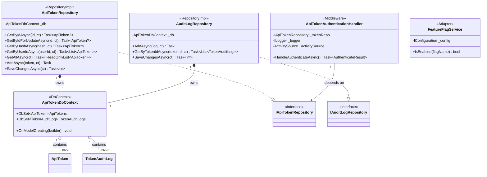
```mermaid
classDiagram
    class ApiTokenDbContext {
        <<DbContext>>
        +DbSet~ApiToken~ ApiTokens
        +DbSet~TokenAuditLog~ TokenAuditLogs
        +OnModelCreating(builder) void
    }

    class ApiTokenRepository {
        <<RepositoryImpl>>
        -ApiTokenDbContext _db
        +GetByIdAsync(id, ct) Task~ApiToken?~
        +GetByIdForUpdateAsync(id, ct) Task~ApiToken?~
        +GetByHashAsync(hash, ct) Task~ApiToken?~
        +GetByUserIdAsync(userId, ct) Task~List~ApiToken~~
        +GetAllAsync(ct) Task~IReadOnlyList~ApiToken~~
        +AddAsync(token, ct) Task
        +SaveChangesAsync(ct) Task~int~
    }

    class AuditLogRepository {
        <<RepositoryImpl>>
        -ApiTokenDbContext _db
        +AddAsync(log, ct) Task
        +GetByTokenIdAsync(tokenId, ct) Task~List~TokenAuditLog~~
        +SaveChangesAsync(ct) Task~int~
    }

    class ApiTokenAuthenticationHandler {
        <<Middleware>>
        -IApiTokenRepository _tokenRepo
        -ILogger _logger
        -ActivitySource _activitySource
        +HandleAuthenticateAsync() Task~AuthenticateResult~
    }

    class FeatureFlagService {
        <<Adapter>>
        -IConfiguration _config
        +IsEnabled(flagName) bool
    }

    class IApiTokenRepository {
        <<interface>>
    }

    class IAuditLogRepository {
        <<interface>>
    }

    ApiTokenRepository ..|> IApiTokenRepository
    AuditLogRepository ..|> IAuditLogRepository
    ApiTokenRepository "1" *-- "1" ApiTokenDbContext : owns
    AuditLogRepository "1" *-- "1" ApiTokenDbContext : owns
    ApiTokenDbContext "1" o-- "DbSet" ApiToken : contains
    ApiTokenDbContext "1" o-- "DbSet" TokenAuditLog : contains
    ApiTokenAuthenticationHandler "1" --> "1" IApiTokenRepository : depends on
```

#### 4.4.1 Infrastructure & Presentation Layer — Class Inventory

| Class | Stereotype | Layer | src 路徑 | test 路徑 |
|-------|-----------|-------|---------|---------|
| ApiTokenDbContext | `<<DbContext>>` | Infrastructure | `src/Infrastructure/Persistence/ApiTokenDbContext.cs` | `tests/Integration/Persistence/ApiTokenRepositoryTests.cs` |
| ApiTokenRepository | `<<RepositoryImpl>>` | Infrastructure | `src/Infrastructure/Persistence/ApiTokenRepository.cs` | `tests/Integration/Persistence/ApiTokenRepositoryTests.cs` |
| AuditLogRepository | `<<RepositoryImpl>>` | Infrastructure | `src/Infrastructure/Persistence/AuditLogRepository.cs` | `tests/Integration/Persistence/AuditLogRepositoryTests.cs` |
| ApiTokenAuthenticationHandler | `<<Adapter>>` | Infrastructure | `src/Infrastructure/Auth/ApiTokenAuthenticationHandler.cs` | `tests/Unit/Infrastructure/ApiTokenAuthenticationHandlerTests.cs` |
| FeatureFlagService | `<<Adapter>>` | Infrastructure | `src/Infrastructure/FeatureFlags/FeatureFlagService.cs` | `tests/Unit/Infrastructure/FeatureFlagServiceTests.cs` |
| TokenController | `<<RestController>>` | Presentation | `src/Presentation/Controllers/TokenController.cs` | `tests/Integration/Controllers/TokenControllerTests.cs` |
| PocController | `<<RestController>>` | Presentation | `src/Presentation/Controllers/PocController.cs` | `tests/Integration/Controllers/PocControllerTests.cs` |
| TokenListModel | `<<RazorPage>>` | Presentation | `src/Presentation/Pages/ApiTokens/Index.cshtml.cs` | `tests/Unit/Presentation/TokenListModelTests.cs` |
| TokenCreatedModel | `<<RazorPage>>` | Presentation | `src/Presentation/Pages/ApiTokens/Created.cshtml.cs` | `tests/Unit/Presentation/TokenCreatedModelTests.cs` |

### 4.5 Class Diagram — Presentation Layer

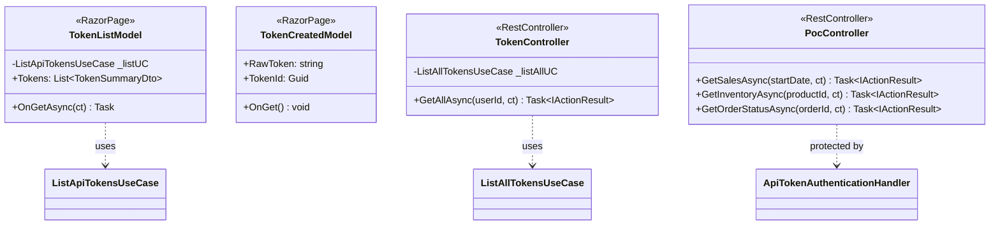
```mermaid
classDiagram
    class TokenListModel {
        <<RazorPage>>
        -ListApiTokensUseCase _listUC
        +Tokens: List~TokenSummaryDto~
        +OnGetAsync(ct) Task
    }
    class TokenCreatedModel {
        <<RazorPage>>
        +RawToken: string
        +TokenId: Guid
        +OnGet() void
    }
    class TokenController {
        <<RestController>>
        -ListAllTokensUseCase _listAllUC
        +GetAllAsync(userId, ct) Task~IActionResult~
    }
    class PocController {
        <<RestController>>
        +GetSalesAsync(startDate, ct) Task~IActionResult~
        +GetInventoryAsync(productId, ct) Task~IActionResult~
        +GetOrderStatusAsync(orderId, ct) Task~IActionResult~
    }

    TokenListModel ..> ListApiTokensUseCase : uses
    TokenController ..> ListAllTokensUseCase : uses
    PocController ..> ApiTokenAuthenticationHandler : protected by
```

**§4.4b.1 Presentation Layer Class Inventory**

| Class | Stereotype | Layer | src path | test path |
|-------|-----------|-------|----------|-----------|
| TokenListModel | `<<RazorPage>>` | Presentation | `src/Presentation/Pages/ApiTokens/Index.cshtml.cs` | `tests/Unit/Presentation/TokenListModelTests.cs` |
| TokenCreatedModel | `<<RazorPage>>` | Presentation | `src/Presentation/Pages/ApiTokens/Created.cshtml.cs` | `tests/Unit/Presentation/TokenCreatedModelTests.cs` |
| TokenController | `<<RestController>>` | Presentation | `src/Presentation/Controllers/TokenController.cs` | `tests/Integration/Controllers/TokenControllerTests.cs` |
| PocController | `<<RestController>>` | Presentation | `src/Presentation/Controllers/PocController.cs` | `tests/Integration/Controllers/PocControllerTests.cs` |

### 4.6 Object Diagram — Token Creation Scenario

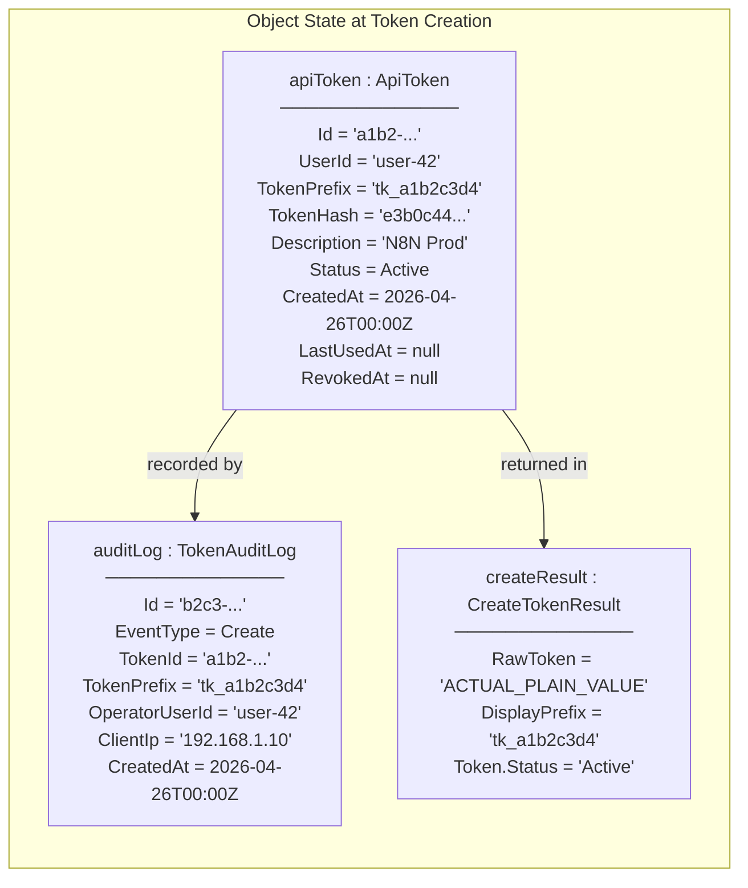
```mermaid
graph LR
    subgraph "Object State at Token Creation"
        T1["apiToken : ApiToken<br/>──────────────<br/>Id = 'a1b2-...'<br/>UserId = 'user-42'<br/>TokenPrefix = 'tk_a1b2c3d4'<br/>TokenHash = 'e3b0c44...'<br/>Description = 'N8N Prod'<br/>Status = Active<br/>CreatedAt = 2026-04-26T00:00Z<br/>LastUsedAt = null<br/>RevokedAt = null"]

        L1["auditLog : TokenAuditLog<br/>──────────────<br/>Id = 'b2c3-...'<br/>EventType = Create<br/>TokenId = 'a1b2-...'<br/>TokenPrefix = 'tk_a1b2c3d4'<br/>OperatorUserId = 'user-42'<br/>ClientIp = '192.168.1.10'<br/>CreatedAt = 2026-04-26T00:00Z"]

        R1["createResult : CreateTokenResult<br/>──────────────<br/>RawToken = 'ACTUAL_PLAIN_VALUE'<br/>DisplayPrefix = 'tk_a1b2c3d4'<br/>Token.Status = 'Active'"]
    end

    T1 -- "recorded by" --> L1
    T1 -- "returned in" --> R1
```

### 4.7 Component Diagram

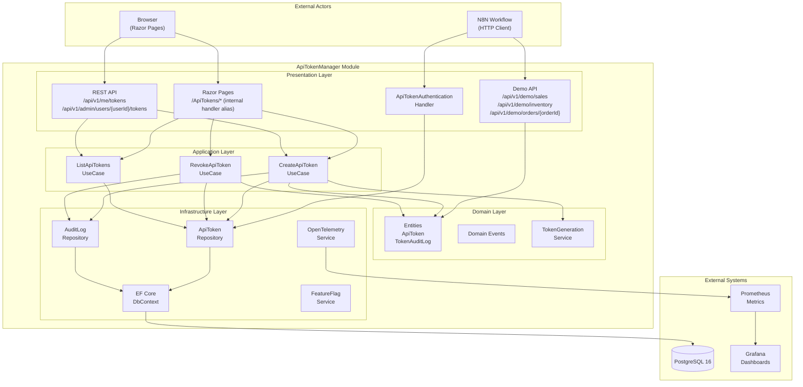
```mermaid
graph TB
    subgraph ExternalActors["External Actors"]
        Browser["Browser<br/>(Razor Pages)"]
        N8N["N8N Workflow<br/>(HTTP Client)"]
    end

    subgraph ApiTokenManagerModule["ApiTokenManager Module"]
        subgraph Presentation["Presentation Layer"]
            RazorUI["Razor Pages<br/>/ApiTokens/* (internal handler alias)"]
            RestAPI["REST API<br/>/api/v1/me/tokens<br/>/api/v1/admin/users/{userId}/tokens"]
            PocAPI["Demo API<br/>/api/v1/demo/sales<br/>/api/v1/demo/inventory<br/>/api/v1/demo/orders/{orderId}"]
            AuthMW["ApiTokenAuthentication<br/>Handler"]
        end

        subgraph Application["Application Layer"]
            CreateUC["CreateApiToken<br/>UseCase"]
            RevokeUC["RevokeApiToken<br/>UseCase"]
            ListUC["ListApiTokens<br/>UseCase"]
        end

        subgraph Domain["Domain Layer"]
            Entities["Entities<br/>ApiToken<br/>TokenAuditLog"]
            Events["Domain Events"]
            DomainSvc["TokenGeneration<br/>Service"]
        end

        subgraph Infrastructure["Infrastructure Layer"]
            EFCtx["EF Core<br/>DbContext"]
            TokenRepo["ApiToken<br/>Repository"]
            AuditRepo["AuditLog<br/>Repository"]
            FlagSvc["FeatureFlag<br/>Service"]
            OtelSvc["OpenTelemetry<br/>Service"]
        end
    end

    subgraph External["External Systems"]
        PgSQL[("PostgreSQL 16")]
        Prometheus["Prometheus<br/>Metrics"]
        Grafana["Grafana<br/>Dashboards"]
    end

    Browser --> RazorUI
    Browser --> RestAPI
    N8N --> AuthMW
    N8N --> PocAPI

    RazorUI --> CreateUC
    RazorUI --> RevokeUC
    RazorUI --> ListUC
    RestAPI --> CreateUC
    RestAPI --> ListUC
    AuthMW --> TokenRepo
    PocAPI --> Entities

    CreateUC --> Entities
    CreateUC --> DomainSvc
    CreateUC --> TokenRepo
    CreateUC --> AuditRepo
    RevokeUC --> Entities
    RevokeUC --> TokenRepo
    RevokeUC --> AuditRepo
    ListUC --> TokenRepo

    TokenRepo --> EFCtx
    AuditRepo --> EFCtx
    EFCtx --> PgSQL

    OtelSvc --> Prometheus
    Prometheus --> Grafana
```

### 4.8 Data Access Layer


#### 4.8.1 ApiTokenRepository Implementation

```csharp
namespace ApiTokenManager.Infrastructure.Persistence.Repositories;

public class ApiTokenRepository : IApiTokenRepository
{
    private readonly ApiTokenDbContext _db;

    public ApiTokenRepository(ApiTokenDbContext db)
        => _db = db;

    public async Task<ApiToken?> GetByIdAsync(Guid id, CancellationToken ct = default)
        => await _db.ApiTokens
                    .AsNoTracking()
                    .FirstOrDefaultAsync(t => t.Id == id, ct);

    public async Task<ApiToken?> GetByIdForUpdateAsync(Guid id, CancellationToken ct = default)
        => await _db.ApiTokens.FirstOrDefaultAsync(t => t.Id == id, ct);
    // Note: No AsNoTracking — EF Core tracks entity for mutation

    public async Task<ApiToken?> GetByHashAsync(string hash, CancellationToken ct = default)
        => await _db.ApiTokens
                    .FirstOrDefaultAsync(
                        t => t.TokenHash == hash && t.Status == TokenStatus.Active, ct);

    public async Task<List<ApiToken>> GetByUserIdAsync(
        string userId, CancellationToken ct = default)
        => await _db.ApiTokens
                    .Where(t => t.UserId == userId)
                    .OrderByDescending(t => t.CreatedAt)
                    .AsNoTracking()
                    .ToListAsync(ct);

    public async Task<IReadOnlyList<ApiToken>> GetAllAsync(CancellationToken ct = default)
        => await _db.ApiTokens
                    .OrderBy(t => t.UserId)
                    .ThenBy(t => t.CreatedAt)
                    .AsNoTracking()
                    .ToListAsync(ct);

    public async Task AddAsync(ApiToken token, CancellationToken ct = default)
        => await _db.ApiTokens.AddAsync(token, ct);

    public async Task<int> SaveChangesAsync(CancellationToken ct = default)
        => await _db.SaveChangesAsync(ct);
}
```

#### 4.8.2 Query Performance

The critical hot path is Bearer Token validation: `GetByHashAsync`. This query uses the unique index `ux_api_tokens_token_hash` on the `token_hash` column, guaranteeing O(log n) lookup time regardless of total token count. At MVP scale (max ~500 active tokens total), this equates to sub-millisecond DB execution time.

**Expected query plan:**
```
Index Scan using ux_api_tokens_token_hash on api_tokens
  Index Cond: (token_hash = $1)
  Filter: (status = 'active')
```

#### 4.8.3 Tracking vs. No-Tracking

- `GetByHashAsync`: **tracked** — needed for `RecordUsage()` mutation
- `GetByUserIdAsync`: **AsNoTracking** — read-only list, no mutations
- `GetByIdAsync`: **AsNoTracking** — used for display only; never use for mutation paths
- `GetByIdForUpdateAsync`: **tracked** (no `AsNoTracking`) — used by `RevokeApiTokenUseCase` so EF Core can track and persist the entity mutation

---

### 4.9 Application Layer (Use Cases)


#### 4.9.1 CreateApiTokenUseCase

```csharp
namespace ApiTokenManager.Application.UseCases;

public class CreateApiTokenUseCase
{
    private readonly IApiTokenRepository _tokenRepo;
    private readonly IAuditLogRepository _auditRepo;
    private readonly IHttpContextAccessor _httpContextAccessor;
    private readonly ILogger<CreateApiTokenUseCase> _logger;
    private readonly ApiTokenDbContext _db;
    private readonly ITokenGenerationService _tokenGenerator;

    public CreateApiTokenUseCase(
        IApiTokenRepository tokenRepo,
        IAuditLogRepository auditRepo,
        IHttpContextAccessor httpContextAccessor,
        ILogger<CreateApiTokenUseCase> logger,
        ApiTokenDbContext db,
        ITokenGenerationService tokenGenerator)
    {
        _tokenRepo = tokenRepo;
        _auditRepo = auditRepo;
        _httpContextAccessor = httpContextAccessor;
        _logger = logger;
        _db = db;
        _tokenGenerator = tokenGenerator;
    }

    public async Task<Result<CreateTokenResult>> ExecuteAsync(
        CreateTokenCommand command,
        CancellationToken ct = default)
    {
        // Validate
        if (string.IsNullOrWhiteSpace(command.UserId))
            return Result<CreateTokenResult>.Fail("UserId is required.");

        if (command.Description?.Length > 100)
            return Result<CreateTokenResult>.Fail("Description must not exceed 100 characters.");

        // Generate token
        var (rawToken, displayPrefix, hash) = _tokenGenerator.Generate();

        // Create domain entity
        var token = ApiToken.Create(command.UserId, displayPrefix, hash, command.Description ?? "");

        // Write token and audit log atomically
        var clientIp = _httpContextAccessor.HttpContext?
            .Connection.RemoteIpAddress?.ToString();
        var auditLog = TokenAuditLog.Record(
            AuditEventType.Create,
            token.Id,
            token.TokenPrefix,
            command.UserId,
            clientIp);

        await using var tx = await _db.Database.BeginTransactionAsync(ct);
        try
        {
            await _tokenRepo.AddAsync(token, ct);
            await _tokenRepo.SaveChangesAsync(ct);
            await _auditRepo.AddAsync(auditLog, ct);
            await _auditRepo.SaveChangesAsync(ct);
            await tx.CommitAsync(ct);
        }
        catch
        {
            await tx.RollbackAsync(ct);
            throw;
        }

        _logger.LogInformation(
            "API token created. UserId: {UserId}, Prefix: {Prefix}",
            command.UserId, displayPrefix);

        return Result<CreateTokenResult>.Ok(new CreateTokenResult(
            rawToken,
            displayPrefix,
            TokenSummaryDto.FromEntity(token)));
    }
}
```

#### 4.9.2 RevokeApiTokenUseCase

```csharp
public class RevokeApiTokenUseCase
{
    private readonly IApiTokenRepository _tokenRepo;
    private readonly IAuditLogRepository _auditRepo;
    private readonly IHttpContextAccessor _httpContextAccessor;
    private readonly ApiTokenDbContext _db;

    public RevokeApiTokenUseCase(
        IApiTokenRepository tokenRepo,
        IAuditLogRepository auditRepo,
        IHttpContextAccessor httpContextAccessor,
        ApiTokenDbContext db)
    {
        _tokenRepo = tokenRepo;
        _auditRepo = auditRepo;
        _httpContextAccessor = httpContextAccessor;
        _db = db;
    }

    public async Task<Result> ExecuteAsync(
        RevokeTokenCommand command,
        CancellationToken ct = default)
    {
        var token = await _tokenRepo.GetByIdForUpdateAsync(command.TokenId, ct);
        if (token is null)
            return Result.Fail("Token not found.", ResultCode.NotFound);

        // Authorization: only the owning user (or admin) can revoke
        if (token.UserId != command.OperatorUserId)
            return Result.Fail("Not authorized to revoke this token.", ResultCode.Forbidden);

        token.Revoke();

        var clientIp = _httpContextAccessor.HttpContext?
            .Connection.RemoteIpAddress?.ToString();
        var auditLog = TokenAuditLog.Record(
            AuditEventType.Revoke,
            token.Id,
            token.TokenPrefix,
            command.OperatorUserId,
            clientIp);

        // Wrap token update and audit log write in a single transaction
        // (matches §4.8 sequence diagram: BEGIN → SaveChanges → INSERT audit → COMMIT)
        await using var tx = await _db.Database.BeginTransactionAsync(ct);
        try
        {
            await _tokenRepo.SaveChangesAsync(ct);

            await _auditRepo.AddAsync(auditLog, ct);
            await _auditRepo.SaveChangesAsync(ct);

            await tx.CommitAsync(ct);
            return Result.Ok();
        }
        catch
        {
            await tx.RollbackAsync(ct);
            throw;
        }
    }
}
```

#### 4.9.3 ListApiTokensUseCase (Current User)

```csharp
// ListTokensQuery — Query record for listing a user's own tokens
public record ListTokensQuery(string UserId);

// ListApiTokensUseCase — Lists tokens belonging to the requesting user
public class ListApiTokensUseCase
{
    private readonly IApiTokenRepository _tokenRepo;

    public ListApiTokensUseCase(IApiTokenRepository tokenRepo)
        => _tokenRepo = tokenRepo;

    public async Task<List<TokenSummaryDto>> ExecuteAsync(
        ListTokensQuery query, CancellationToken ct = default)
    {
        var tokens = await _tokenRepo.GetByUserIdAsync(query.UserId, ct);
        return tokens
            .Select(t => new TokenSummaryDto(
                t.Id, t.Description, t.TokenPrefix, t.CreatedAt,
                t.Status == TokenStatus.Revoked, t.LastUsedAt))
            .ToList();
    }
}
```

#### 4.9.4 ListAllTokensUseCase (IT Admin)

```csharp
/// <summary>
/// US-AUTH-005 AC-1~3: IT Admin 全量查詢組織內所有使用者的 Token 列表。
/// 普通使用者調用此 UseCase 應使用 ListApiTokensUseCase（僅查自己）。
/// </summary>
public class ListAllTokensUseCase
{
    private readonly IApiTokenRepository _tokenRepo;
    private readonly ILogger<ListAllTokensUseCase> _logger;

    public ListAllTokensUseCase(
        IApiTokenRepository tokenRepo,
        ILogger<ListAllTokensUseCase> logger)
    {
        _tokenRepo = tokenRepo;
        _logger = logger;
    }

    public async Task<Result<List<TokenSummaryDto>>> ExecuteAsync(
        ListAllTokensQuery query,
        CancellationToken ct = default)
    {
        // Returns all tokens (optionally filtered by userId for IT Admin)
        var tokens = string.IsNullOrWhiteSpace(query.UserId)
            ? await _tokenRepo.GetAllAsync(ct)
            : await _tokenRepo.GetByUserIdAsync(query.UserId, ct);

        _logger.LogInformation(
            "IT Admin listed all tokens. FilterUserId: {UserId}, Count: {Count}",
            query.UserId ?? "(all)", tokens.Count);

        return Result<List<TokenSummaryDto>>.Ok(
            tokens.Select(TokenSummaryDto.FromEntity).ToList());
    }
}

public record ListAllTokensQuery(string? UserId = null);
```

**API 端點：**

```
GET /api/v1/admin/users/{userId}/tokens
```

- 路徑參數 `userId`：篩選指定使用者的 Token 列表（必填）
- 查詢全量列表時：呼叫者迭代 `/api/v1/admin/users` 列表後逐一查詢；MVP 不提供未過濾的 cross-user 列表端點
- 需要 `AdminTokenList` Authorization Policy（`erp_role = ITAdmin`）

**Authorization Policy 配置：**

```csharp
options.AddPolicy("AdminTokenList", policy =>
    policy.RequireAuthenticatedUser()
          .RequireClaim("erp_role", "ITAdmin"));
```

#### 4.9.5 Result<T> Pattern

```csharp
namespace ApiTokenManager.Application.Common;

public class Result<T>
{
    public bool IsSuccess { get; private set; }
    public T? Value { get; private set; }
    public string? Error { get; private set; }
    public ResultCode Code { get; private set; }

    public static Result<T> Ok(T value) =>
        new() { IsSuccess = true, Value = value, Code = ResultCode.Success };

    public static Result<T> Fail(string error, ResultCode code = ResultCode.BadRequest) =>
        new() { IsSuccess = false, Error = error, Code = code };
}

public enum ResultCode
{
    Success = 200,
    BadRequest = 400,
    NotFound = 404,
    Forbidden = 403,
    Conflict = 409
}
```

#### 4.9.6 UpdateDescriptionUseCase

對應 PRD §17.3 GDPR Right to Rectification（US-AUTH-005 / AC-1, AC-2, AC-6）— 使用者可更新自己的 Token 描述但不可修改 token 值。

**Command DTO：**

```csharp
public sealed record UpdateDescriptionCommand(
    Guid TokenId,
    string OperatorUserId,
    string NewDescription,           // ≤ 100 chars (CONSTANTS.TOKEN_DESCRIPTION_MAX_LENGTH)
    string IdempotencyKey,           // 24h window per (user, key)
    long ExpectedVersion             // optimistic concurrency control
);

public sealed record UpdateDescriptionResult(
    Guid TokenId,
    string OldDescription,
    string NewDescription,
    DateTimeOffset UpdatedAt
);
```

**Use Case 實作：**

```csharp
namespace ApiTokenManager.Application.UseCases;

public sealed class UpdateDescriptionUseCase
{
    private readonly IApiTokenRepository _tokenRepo;
    private readonly IAuditLogRepository _auditRepo;
    private readonly IIdempotencyKeyStore _idempotencyStore;
    private readonly IHttpContextAccessor _httpCtx;

    public UpdateDescriptionUseCase(
        IApiTokenRepository tokenRepo,
        IAuditLogRepository auditRepo,
        IIdempotencyKeyStore idempotencyStore,
        IHttpContextAccessor httpCtx)
    {
        _tokenRepo = tokenRepo;
        _auditRepo = auditRepo;
        _idempotencyStore = idempotencyStore;
        _httpCtx = httpCtx;
    }

    public async Task<Result<UpdateDescriptionResult>> ExecuteAsync(
        UpdateDescriptionCommand command,
        CancellationToken ct = default)
    {
        // 1. Validation：description 長度（CONSTANTS.TOKEN_DESCRIPTION_MAX_LENGTH = 100）
        if (string.IsNullOrWhiteSpace(command.NewDescription))
            return Result<UpdateDescriptionResult>.Failure(
                ResultCode.BadRequest, "Description is required.");

        if (command.NewDescription.Length > 100)
            return Result<UpdateDescriptionResult>.Failure(
                ResultCode.BadRequest, "Description must not exceed 100 characters.");

        // 2. Idempotency：24h window per (user, key) — 重複呼叫直接回傳第一次的結果
        var cachedResult = await _idempotencyStore.GetAsync<UpdateDescriptionResult>(
            command.OperatorUserId, command.IdempotencyKey, ct);
        if (cachedResult is not null)
            return Result<UpdateDescriptionResult>.Success(cachedResult);

        // 3. Load token + Cross-User authorization check
        var token = await _tokenRepo.GetByIdForUpdateAsync(command.TokenId, ct);
        if (token is null)
            return Result<UpdateDescriptionResult>.Failure(
                ResultCode.NotFound, "Token not found.");

        // Cross-user 403：non-admin 嘗試修改別人的 token
        if (token.UserId != command.OperatorUserId && !IsAdmin(_httpCtx))
            return Result<UpdateDescriptionResult>.Failure(
                ResultCode.Forbidden, "You can only update your own tokens.");

        // Revoked token 409：不可修改已撤銷的 token 描述
        if (token.Status == TokenStatus.Revoked)
            return Result<UpdateDescriptionResult>.Failure(
                ResultCode.Conflict, "Cannot update description of a revoked token.");

        // 4. Optimistic concurrency control
        if (token.Version != command.ExpectedVersion)
            return Result<UpdateDescriptionResult>.Failure(
                ResultCode.Conflict,
                $"Token has been modified concurrently. Expected version {command.ExpectedVersion}, got {token.Version}.");

        // 5. Apply change（capture before/after for audit）
        var oldDescription = token.Description;
        token.UpdateDescription(command.NewDescription.Trim());

        // 6. Audit log（同交易內，含 before_state / after_state JSONB）
        var auditEvent = TokenAuditLog.Record(
            action: AuditAction.DescribeUpdate,
            tokenId: token.Id,
            tokenPrefix: token.TokenPrefix,
            actorUserId: command.OperatorUserId,
            beforeState: new { description = oldDescription, version = command.ExpectedVersion },
            afterState: new { description = token.Description, version = token.Version },
            clientIp: _httpCtx.HttpContext?.Connection.RemoteIpAddress?.ToString());

        await _auditRepo.AddAsync(auditEvent, ct);
        await _tokenRepo.SaveChangesAsync(ct);

        // 7. Idempotency cache（24h TTL）
        var result = new UpdateDescriptionResult(
            TokenId: token.Id,
            OldDescription: oldDescription,
            NewDescription: token.Description,
            UpdatedAt: token.UpdatedAt);

        await _idempotencyStore.SetAsync(
            command.OperatorUserId,
            command.IdempotencyKey,
            result,
            TimeSpan.FromHours(24),
            ct);

        return Result<UpdateDescriptionResult>.Success(result);
    }

    private static bool IsAdmin(IHttpContextAccessor ctx) =>
        ctx.HttpContext?.User.IsInRole("IT_Admin") ?? false;
}
```

**錯誤路徑摘要（對應 §1.3 PRD AC trace）：**

| 情境 | HTTP Status | Error Code | 對應 AC |
|------|-------------|------------|--------|
| 正常更新 | 200 | — | US-AUTH-005 / AC-1, AC-2 |
| 描述空白或 > 100 字元 | 422 | `description_invalid` | US-AUTH-005 / AC-1（隱含驗證） |
| Token 不存在 | 404 | `token_not_found` | — |
| 跨使用者修改（非 admin） | 403 | `forbidden_cross_user` | US-AUTH-005 / AC-6 |
| 已撤銷 Token | 409 | `token_revoked` | — |
| Optimistic concurrency 衝突 | 409 | `version_conflict` | API.md §3.3 |
| 重複 Idempotency-Key（同 result） | 200 | — | API.md §3.3 |

**Class Diagram 補列：** §4.2 Class Diagram（Application 層）已收錄 `UpdateDescriptionUseCase`。

---

### 4.10 Presentation Layer


#### 4.10.1 Razor Page: ApiTokens/Index.cshtml.cs

```csharp
[Authorize(Policy = "ApiTokenManager")]
public class IndexModel : PageModel
{
    private readonly ListApiTokensUseCase _listUseCase;
    private readonly IFeatureFlagService _flags;

    public List<TokenSummaryDto> Tokens { get; set; } = [];

    public async Task<IActionResult> OnGetAsync()
    {
        if (!_flags.IsEnabled("enable_api_token_management"))
            return StatusCode(403, "Feature is currently disabled.");

        var userId = User.FindFirstValue("user_id") ?? User.Identity!.Name!;
        Tokens = await _listUseCase.ExecuteAsync(new ListTokensQuery(userId));
        return Page();
    }
}
```

#### 4.10.2 Razor Page: ApiTokens/Create.cshtml.cs

```csharp
[Authorize(Policy = "ApiTokenManager")]
public class CreateModel : PageModel
{
    private readonly CreateApiTokenUseCase _createUseCase;

    [BindProperty]
    [Required]
    [MaxLength(100)]
    public string Description { get; set; } = "";

    [TempData]
    public string? CreatedRawToken { get; set; }

    [TempData]
    public string? CreatedPrefix { get; set; }

    public async Task<IActionResult> OnPostAsync()
    {
        if (!ModelState.IsValid)
            return Page();

        var userId = User.FindFirstValue("user_id") ?? User.Identity!.Name!;
        var result = await _createUseCase.ExecuteAsync(
            new CreateTokenCommand(userId, Description));

        if (!result.IsSuccess)
        {
            ModelState.AddModelError(string.Empty, result.Error!);
            return Page();
        }

        // Store raw token in TempData — survives one redirect, then cleared
        CreatedRawToken = result.Value!.RawToken;
        CreatedPrefix = result.Value.DisplayPrefix;

        return RedirectToPage("/ApiTokens/Created");
    }
}
```

#### 4.10.3 POC API Controller

```csharp
[ApiController]
[Route("api/v1/demo")]
[Authorize(Policy = "PocEndpoints")]
public class PocController : ControllerBase
{
    /// <summary>
    /// US-DEMO-001: POC 銷售數據查詢
    /// GET /api/v1/demo/sales?date=YYYY-MM-DD
    /// </summary>
    [HttpGet("sales")]
    public IActionResult Sales([FromQuery] string? date = null)
    {
        if (date != null && !DateOnly.TryParseExact(date, "yyyy-MM-dd", out _))
        {
            return UnprocessableEntity(new { error = "date 參數格式錯誤，請使用 YYYY-MM-DD" });
        }

        var queryDate = date ?? DateOnly.FromDateTime(DateTime.UtcNow).ToString("yyyy-MM-dd");
        // POC: static data representing ERP sales query results
        return Ok(new
        {
            date = queryDate,
            total_amount = 125000,
            order_count = 32,
            currency = "TWD"
        });
    }

    /// <summary>
    /// US-DEMO-002: POC 庫存查詢
    /// GET /api/v1/demo/inventory?product_id=P001
    /// </summary>
    [HttpGet("inventory")]
    public IActionResult Inventory([FromQuery] string? product_id = null)
    {
        // POC: static data representing ERP inventory query results
        var inventory = new[]
        {
            new { product_id = "P001", name = "產品A", stock_qty = 100, unit = "個" },
            new { product_id = "P002", name = "產品B", stock_qty = 45, unit = "箱" },
            new { product_id = "P003", name = "產品C", stock_qty = 230, unit = "個" }
        };

        if (product_id != null)
        {
            var item = inventory.FirstOrDefault(i => i.product_id == product_id);
            if (item == null)
                return NotFound(new { error = "Product not found" });
            return Ok(item);
        }

        return Ok(inventory);
    }

    /// <summary>
    /// US-DEMO-003: POC 訂單狀態查詢
    /// GET /api/v1/demo/orders/{orderId}
    /// </summary>
    [HttpGet("orders/{orderId}")]
    public IActionResult OrderStatus(string orderId)
    {
        // POC: static data representing ERP order status query results
        var knownOrders = new Dictionary<string, object>
        {
            ["O001"] = new { order_id = "O001", status = "Processing", updated_at = "2026-04-26T10:00:00+08:00" },
            ["O002"] = new { order_id = "O002", status = "Shipped", updated_at = "2026-04-25T14:30:00+08:00" },
        };

        if (!knownOrders.TryGetValue(orderId, out var orderStatus))
            return NotFound(new { error = "訂單不存在" });

        return Ok(orderStatus);
    }
}
```

#### 4.10.4 Program.cs — Module Registration

```csharp
// Program.cs
var builder = WebApplication.CreateBuilder(args);

// Database
builder.Services.AddDbContext<ApiTokenDbContext>(options =>
    options.UseNpgsql(builder.Configuration.GetConnectionString("ApiTokenDb")));

// Repositories
builder.Services.AddScoped<IApiTokenRepository, ApiTokenRepository>();
builder.Services.AddScoped<IAuditLogRepository, AuditLogRepository>();

// Services
builder.Services.AddScoped<ITokenGenerationService, TokenGenerationService>();

// Use Cases
builder.Services.AddScoped<CreateApiTokenUseCase>();
builder.Services.AddScoped<RevokeApiTokenUseCase>();
builder.Services.AddScoped<ListApiTokensUseCase>();
builder.Services.AddScoped<ListAllTokensUseCase>();
builder.Services.AddScoped<ValidateTokenUseCase>();

// Feature Flags
builder.Services.AddSingleton<IFeatureFlagService, FeatureFlagService>();

// Rate Limiting（見 §6.7）
builder.Services.AddRateLimiter(options => { /* 見 §6.7 配置 */ });

// Authentication
builder.Services.AddAuthentication(...)
    .AddScheme<AuthenticationSchemeOptions, ApiTokenAuthenticationHandler>("ApiToken", _ => { });

// Observability
builder.Services.AddOpenTelemetry()
    .WithTracing(tracing => tracing
        .AddSource("ApiTokenManager.*")
        .AddAspNetCoreInstrumentation()
        .AddNpgsql()
        .AddOtlpExporter())
    .WithMetrics(metrics => metrics
        .AddAspNetCoreInstrumentation()
        .AddPrometheusExporter());

var app = builder.Build();

app.UseHttpsRedirection();
app.UseAuthentication();
app.UseAuthorization();
app.MapRazorPages();
app.MapControllers();
app.MapPrometheusScrapingEndpoint("/metrics");

app.Run();
```

#### 4.10.5 Razor Page: ApiTokens/AuditLog.cshtml.cs (IT Admin)

對應 US-AUDIT-001（PRD §5.9）— IT Admin 查看與匯出 90 天內所有 token 操作審計事件。對應 §3.4 Cross-BC Public Interface 之 `IAuditLogQueryPort`。

**Page Model：**

```csharp
namespace ApiTokenManager.Presentation.Pages.ApiTokens;

[Authorize(Policy = "AdminAuditLog")]   // IT_Admin role only — see §9.10 RBAC
public class AuditLogModel : PageModel
{
    private readonly IAuditLogQueryPort _auditQuery;
    private readonly ICsvExporter _csvExporter;
    private readonly IClock _clock;

    public AuditLogModel(
        IAuditLogQueryPort auditQuery,
        ICsvExporter csvExporter,
        IClock clock)
    {
        _auditQuery = auditQuery;
        _csvExporter = csvExporter;
        _clock = clock;
    }

    [BindProperty(SupportsGet = true)]
    public string? FilterAction { get; set; }   // create / revoke / describe_update / null=all

    [BindProperty(SupportsGet = true)]
    public string? FilterActorUserId { get; set; }

    [BindProperty(SupportsGet = true)]
    public DateOnly? FilterDateFrom { get; set; }

    [BindProperty(SupportsGet = true)]
    public DateOnly? FilterDateTo { get; set; }

    public IReadOnlyList<AuditEventView> Events { get; private set; } = Array.Empty<AuditEventView>();
    public int TotalCount { get; private set; }

    /// <summary>
    /// US-AUDIT-001 / AC-1：列表查詢，預設 90 天範圍內所有事件。
    /// </summary>
    public async Task<IActionResult> OnGetAsync(CancellationToken ct)
    {
        var criteria = BuildCriteria(maxLookbackDays: 90);
        Events = await _auditQuery.QueryAsync(criteria, ct);
        TotalCount = Events.Count;
        return Page();
    }

    /// <summary>
    /// US-AUDIT-001 / AC-3：CSV 匯出（UTF-8 BOM；最多 10000 筆；固定欄位順序）。
    /// 路由：GET /ApiTokens/AuditLog?handler=ExportCsv
    /// </summary>
    public async Task<IActionResult> OnGetExportCsvAsync(CancellationToken ct)
    {
        const int MaxExportRows = 10_000;

        var criteria = BuildCriteria(maxLookbackDays: 90);
        criteria.Limit = MaxExportRows;
        var events = await _auditQuery.QueryAsync(criteria, ct);

        // 固定欄位順序（與 PRD §5.9 / API.md §1.3 對齊）
        var columns = new[]
        {
            "event_id", "timestamp", "action", "actor_user_id", "actor_username",
            "target_token_id", "target_token_prefix", "target_user_id",
            "ip_address", "user_agent", "before_state", "after_state"
        };

        var stream = await _csvExporter.ExportAsync(events, columns, ct);

        // UTF-8 BOM ensures Excel correctly displays non-ASCII characters
        var fileName = $"audit-log-{_clock.UtcNow:yyyyMMdd-HHmmss}.csv";
        return File(stream, "text/csv; charset=utf-8", fileName);
    }

    private AuditQueryCriteria BuildCriteria(int maxLookbackDays)
    {
        var defaultFrom = DateOnly.FromDateTime(_clock.UtcNow.AddDays(-maxLookbackDays));
        var defaultTo   = DateOnly.FromDateTime(_clock.UtcNow);

        return new AuditQueryCriteria
        {
            Action       = FilterAction,
            ActorUserId  = FilterActorUserId,
            DateFrom     = FilterDateFrom ?? defaultFrom,
            DateTo       = FilterDateTo ?? defaultTo,
            OrderBy      = "timestamp DESC",
            Limit        = 1000   // page-size for UI；ExportCsv override 10000
        };
    }
}
```

**View（Razor）摘要：**

```razor
@page "/ApiTokens/AuditLog"
@model ApiTokenManager.Presentation.Pages.ApiTokens.AuditLogModel
@{
    Layout = "_AdminLayout";
    ViewData["Title"] = "Audit Log";
}

<form method="get">
    <select asp-for="FilterAction">
        <option value="">All actions</option>
        <option value="create">Create</option>
        <option value="revoke">Revoke</option>
        <option value="describe_update">Describe Update</option>
        <option value="admin_grant">Admin Grant</option>
    </select>
    <input asp-for="FilterDateFrom" type="date" />
    <input asp-for="FilterDateTo" type="date" />
    <input asp-for="FilterActorUserId" placeholder="Actor user id" />
    <button type="submit">Filter</button>
    <a asp-page="AuditLog" asp-page-handler="ExportCsv" asp-all-route-data="@Request.Query.ToDictionary(k => k.Key, v => v.Value.ToString())" class="btn btn-primary">Export CSV</a>
</form>

<table>
    <thead>
        <tr>
            <th>Time (UTC)</th><th>Action</th><th>Actor</th><th>Token Prefix</th><th>IP</th><th>Detail</th>
        </tr>
    </thead>
    <tbody>
    @foreach (var ev in Model.Events)
    {
        <tr>
            <td>@ev.Timestamp:O</td>
            <td><span class="badge badge-@ev.Action">@ev.Action</span></td>
            <td>@ev.ActorUsername (@ev.ActorUserId)</td>
            <td>@ev.TargetTokenPrefix</td>
            <td>@ev.IpAddress</td>
            <td><a asp-action="Detail" asp-route-id="@ev.EventId">View</a></td>
        </tr>
    }
    </tbody>
</table>

<div>Total: @Model.TotalCount events</div>
```

**安全與合規約束：**

- `[Authorize(Policy = "AdminAuditLog")]`：僅 IT_Admin 角色可進入（§9.10 RBAC）
- 預設 lookback = 90 天；UI 不允許超過 90 天範圍（DB partition 邊界）
- CSV 匯出最多 10,000 筆（避免大查詢拖垮資源；超過建議使用 `/api/v1/admin/audit-logs/export` 分頁 API）
- UTF-8 BOM：確保 Excel 正確顯示中文與 emoji
- 欄位順序固定，便於下游 SIEM / SOC 標準化解析
- 此頁面操作本身被 audit（meta-audit）：`action='admin_audit_view'`、`target_event_id_range`

**對應 §1.3 PRD AC trace：**

| AC | EDD 章節 |
|----|---------|
| US-AUDIT-001 / AC-1（列表 90 天）| §4.10.5 OnGetAsync |
| US-AUDIT-001 / AC-2（檢視 IP/UA/before-after） | §4.10.5 View 表格 + §6.2.2 audit_logs schema |
| US-AUDIT-001 / AC-3（CSV 匯出 10000 筆 / UTF-8 BOM）| §4.10.5 OnGetExportCsvAsync |

---

## 5. API Design

> **API Path Convention（與 PRD/API.md SoT 一致）**：本系統對外 REST API 一律以 `/api/v1/*` 為合約根路徑（versioned API contract）。Razor Pages UI 的 server-side handler 採 `/ApiTokens/*` route，僅作為瀏覽器 UI 的 internal handler alias，不對外文件化為 N8N/外部呼叫者使用的合約。舊路徑 `/api/tokens`、`/api/poc/*` 已於 API.md §40 標註為 deprecated alias，保留用於 Razor Pages UI 內部 partial handler，不應出現在新整合契約中。

### 5.1 REST API Endpoints

#### Base URL: `/api/v1`

All REST endpoints return `application/json`. Error responses follow RFC 9457 (Problem Details).

#### 5.1.1 Token Management API（Self-service / Current User）

| Method | Path | Auth Required | Description |
|--------|------|---------------|-------------|
| `GET` | `/api/v1/me/tokens` | ERP Session | List tokens for current user |
| `POST` | `/api/v1/me/tokens` | ERP Session | Create a new API token |
| `GET` | `/api/v1/me/tokens/{tokenId}` | ERP Session | Get a single token's metadata |
| `DELETE` | `/api/v1/me/tokens/{tokenId}` | ERP Session | Revoke a token by ID |
| `PATCH` | `/api/v1/me/tokens/{tokenId}` | ERP Session | Update token description |
| `GET` | `/api/v1/me/tokens/{tokenId}/audit` | ERP Session | Get audit log for own token |

#### 5.1.2 Admin API（IT Admin only）

| Method | Path | Auth Required | Description |
|--------|------|---------------|-------------|
| `GET` | `/api/v1/admin/users/{userId}/tokens` | ERP Session + AdminAuditLog policy | List any user's tokens |
| `DELETE` | `/api/v1/admin/users/{userId}/tokens/{tokenId}` | ERP Session + AdminAuditLog policy | Admin revoke any user's token |
| `GET` | `/api/v1/admin/audit-logs` | ERP Session + AdminAuditLog policy | Programmatic audit log query (filter + pagination) |

#### 5.1.3 Demo Endpoints (Bearer Token Protected)

| Method | Path | Auth Required | Description |
|--------|------|---------------|-------------|
| `GET` | `/api/v1/demo/sales` | Bearer Token | Demo 銷售數據查詢（模擬 ERP 銷售報表場景） |
| `GET` | `/api/v1/demo/inventory` | Bearer Token | Demo 庫存查詢（模擬 ERP 庫存管理場景） |
| `GET` | `/api/v1/demo/orders/{orderId}` | Bearer Token | Demo 訂單狀態查詢（模擬 ERP 訂單狀態場景） |

#### 5.1.4 Razor Pages Internal Handler Alias（非對外契約）

下列路徑為 Razor Pages UI 的 server-side handler，僅供 ERP Web UI 自身使用，不對外文件化：

| Internal Handler | 對應對外契約 | Notes |
|-----------------|--------------|-------|
| `POST /ApiTokens/Create` | `POST /api/v1/me/tokens` | Razor Pages OnPostAsync 委派 CreateApiTokenUseCase |
| `POST /ApiTokens/Revoke` | `DELETE /api/v1/me/tokens/{tokenId}` | Razor Pages OnPostAsync 委派 RevokeApiTokenUseCase |
| `GET /ApiTokens` | `GET /api/v1/me/tokens` | UI list view |
| `GET /ApiTokens/Audit/{tokenId}` | `GET /api/v1/me/tokens/{tokenId}/audit` | UI audit view |

### 5.2 Request/Response Contracts

#### POST /api/v1/me/tokens — Create Token

**Request:**
```json
{
  "description": "N8N Production Workflow"
}
```

**Response 201 Created:**
```json
{
  "rawToken": "PLAIN_TEXT_VALUE_SHOWN_ONCE",
  "token": {
    "id": "a1b2c3d4-e5f6-7890-abcd-ef1234567890",
    "tokenPrefix": "tk_a1b2c3d4",
    "description": "N8N Production Workflow",
    "status": "Active",
    "createdAt": "2026-04-26T00:00:00Z",
    "lastUsedAt": null,
    "revokedAt": null
  }
}
```

**Error Response 422 Unprocessable Entity:**
```json
{
  "type": "https://erp.internal/errors/validation",
  "title": "Validation failed",
  "status": 422,
  "errors": {
    "description": ["Description is required", "Description must not exceed 100 characters"]
  }
}
```

#### GET /api/v1/me/tokens — List Tokens

**Response 200 OK:**
```json
{
  "tokens": [
    {
      "id": "a1b2c3d4-...",
      "tokenPrefix": "tk_a1b2c3d4",
      "description": "N8N Production",
      "status": "Active",
      "createdAt": "2026-04-26T00:00:00Z",
      "lastUsedAt": "2026-04-26T01:30:00Z",
      "revokedAt": null
    }
  ],
  "totalCount": 1
}
```

#### DELETE /api/v1/me/tokens/{tokenId} — Revoke Token

**Response 204 No Content** (on success)

**Response 404 Not Found:**
```json
{
  "type": "https://erp.internal/errors/not-found",
  "title": "Token not found",
  "status": 404
}
```

#### GET /api/v1/demo/sales

**Query Parameters:** `date` (optional, format: `YYYY-MM-DD`)

**Response 200 OK:**
```json
{
  "date": "2026-04-01",
  "total_amount": 125000,
  "order_count": 32,
  "currency": "TWD"
}
```

**Response 422 Unprocessable Entity** (invalid date format):
```json
{
  "error": "date 參數格式錯誤，請使用 YYYY-MM-DD"
}
```

#### GET /api/v1/demo/inventory

**Query Parameters:** `product_id` (optional)

**Response 200 OK:**
```json
[
  {"product_id": "P001", "name": "產品A", "stock_qty": 100, "unit": "個"},
  {"product_id": "P002", "name": "產品B", "stock_qty": 45, "unit": "箱"}
]
```

**Response 404 Not Found** (when `product_id` specified but not found):
```json
{"error": "Product not found"}
```

#### GET /api/v1/demo/orders/{orderId}

**Response 200 OK:**
```json
{
  "order_id": "O001",
  "status": "Processing",
  "updated_at": "2026-04-26T10:00:00+08:00"
}
```

**Response 404 Not Found:**
```json
{"error": "訂單不存在"}
```

### 5.3 HTTP Status Code Contract

| Code | Scenario |
|------|----------|
| 200 | Successful GET |
| 201 | Token created successfully |
| 204 | Token revoked successfully |
| 400 | Malformed request / AntiForgery failure |
| 401 | No auth / invalid Bearer Token |
| 403 | Authenticated but not authorized (e.g., revoking another user's token) |
| 404 | Token not found |
| 409 | Conflict (e.g., token already revoked) |
| 422 | Validation failure |
| 500 | Internal server error |
| 503 | Database unavailable |

### 5.4 Razor Pages Routes

| Path | Handler | Description |
|------|---------|-------------|
| `GET /ApiTokens` | `OnGetAsync` | List user's tokens |
| `GET /ApiTokens/Create` | `OnGetAsync` | Show create form |
| `POST /ApiTokens/Create` | `OnPostAsync` | Submit create form |
| `GET /ApiTokens/Created` | `OnGetAsync` | Show one-time token reveal |
| `POST /ApiTokens/Revoke` | `OnPostAsync` | Confirm revoke |
| `GET /ApiTokens/Audit/{tokenId}` | `OnGetAsync` | View audit log |

---

## 6. Data Model

### 6.1 Domain Model — Entities, Value Objects, Aggregates


### 6.1.1 Entities

#### 6.1.1.1 ApiToken (Aggregate Root)

```csharp
namespace ApiTokenManager.Domain.Entities;

public sealed class ApiToken : EntityBase
{
    public Guid Id { get; private set; }
    public string UserId { get; private set; }          // FK to ERP user
    public string TokenPrefix { get; private set; }     // "tk_" + first 8 chars, e.g. "tk_a1b2c3d4"
    public string TokenHash { get; private set; }       // SHA-256 hex, 64 chars
    public string Description { get; private set; }     // VARCHAR(100) — CONSTANTS TOKEN_DESCRIPTION_MAX_LENGTH
    public TokenStatus Status { get; private set; }     // Active | Revoked
    public DateTimeOffset CreatedAt { get; private set; }
    public DateTimeOffset? LastUsedAt { get; private set; }
    public DateTimeOffset? RevokedAt { get; private set; }
    public DateTimeOffset? ExpiresAt { get; private set; }
    public DateTimeOffset UpdatedAt { get; private set; }

    private ApiToken() { }  // EF Core constructor

    public static ApiToken Create(
        string userId,
        string tokenPrefix,
        string tokenHash,
        string description)
    {
        ArgumentException.ThrowIfNullOrWhiteSpace(userId);
        ArgumentException.ThrowIfNullOrWhiteSpace(tokenPrefix);
        ArgumentException.ThrowIfNullOrWhiteSpace(tokenHash);

        var token = new ApiToken
        {
            Id = Guid.NewGuid(),
            UserId = userId,
            TokenPrefix = tokenPrefix,
            TokenHash = tokenHash,
            Description = description?.Trim() ?? string.Empty,
            Status = TokenStatus.Active,
            CreatedAt = DateTimeOffset.UtcNow,
            UpdatedAt = DateTimeOffset.UtcNow
        };

        token.AddDomainEvent(new ApiTokenCreatedEvent(token.Id, userId, tokenPrefix));
        return token;
    }

    public void Revoke()
    {
        if (Status == TokenStatus.Revoked)
            throw new InvalidOperationException("Token is already revoked.");

        Status = TokenStatus.Revoked;
        RevokedAt = DateTimeOffset.UtcNow;
        UpdatedAt = DateTimeOffset.UtcNow;

        AddDomainEvent(new ApiTokenRevokedEvent(Id, UserId, TokenPrefix));
    }

    public void RecordUsage()
    {
        LastUsedAt = DateTimeOffset.UtcNow;
        UpdatedAt = DateTimeOffset.UtcNow;
    }
}
```

#### 6.1.1.2 TokenAuditLog (Entity — append-only)

```csharp
namespace ApiTokenManager.Domain.Entities;

public sealed class TokenAuditLog : EntityBase
{
    public Guid Id { get; private set; }
    public AuditEventType EventType { get; private set; }   // CREATE | REVOKE
    public Guid TokenId { get; private set; }
    public string TokenPrefix { get; private set; }
    public string OperatorUserId { get; private set; }
    public string? ClientIp { get; private set; }
    public DateTimeOffset CreatedAt { get; private set; }

    private TokenAuditLog() { }

    public static TokenAuditLog Record(
        AuditEventType eventType,
        Guid tokenId,
        string tokenPrefix,
        string operatorUserId,
        string? clientIp = null)
    {
        return new TokenAuditLog
        {
            Id = Guid.NewGuid(),
            EventType = eventType,
            TokenId = tokenId,
            TokenPrefix = tokenPrefix,
            OperatorUserId = operatorUserId,
            ClientIp = clientIp,
            CreatedAt = DateTimeOffset.UtcNow
        };
    }
}
```

### 6.1.2 Value Objects & Enumerations

```csharp
namespace ApiTokenManager.Domain.Enums;

public enum TokenStatus
{
    Active = 1,
    Revoked = 2
}

public enum AuditEventType
{
    Create = 1,
    Revoke = 2
}
```

### 6.1.3 Domain Events

```csharp
namespace ApiTokenManager.Domain.Events;

public record ApiTokenCreatedEvent(Guid TokenId, string UserId, string TokenPrefix) : IDomainEvent;
public record ApiTokenRevokedEvent(Guid TokenId, string UserId, string TokenPrefix) : IDomainEvent;
public record ApiTokenDescriptionUpdatedEvent(Guid TokenId, string UserId, string TokenPrefix, string OldDescription, string NewDescription) : IDomainEvent;
```

#### 6.1.3.1 Domain Events Catalog（6 欄合約表）

> **SoT**：Event schema 由 `owner_bc` 擁有；`schema_version` 採 v1 策略，破壞性變更需新增 v2 並雙寫；topic 命名規則 `{bc}.{entity}.{type}`。

| event_name | owner_bc | schema_version | topic_name | payload_summary | consumer_bcs |
|------------|----------|---------------|-----------|----------------|-------------|
| `ApiTokenCreatedEvent` | ApiTokenBC | v1 | `apitoken.token.created` | `{tokenId, userId, tokenPrefix, createdAt}` | AuditLogBC（同交易內 IAuditLogPublisher 寫入 audit log） |
| `ApiTokenRevokedEvent` | ApiTokenBC | v1 | `apitoken.token.revoked` | `{tokenId, userId, tokenPrefix, revokedAt, revokedByUserId}` | AuditLogBC（寫入 `action='revoke'` audit log） |
| `ApiTokenDescriptionUpdatedEvent` | ApiTokenBC | v1 | `apitoken.token.describe_updated` | `{tokenId, userId, tokenPrefix, oldDescription, newDescription, updatedAt}` | AuditLogBC（寫入 `action='describe_update'` 含 before/after_state） |
| `AuditLogAppendedEvent` | AuditLogBC | v1 | `auditlog.event.appended` | `{eventId, action, actorUserId, targetTokenId, timestamp}` | （內部觀察性指標：`audit_log_total{action}` counter） |

> **Schema Evolution 規則**：
> 1. 新增 optional 欄位 → minor 版本（仍為 v1）
> 2. 移除欄位或變更型別 → major 版本（v2），與 v1 並行 30 天後汰除
> 3. 任何 schema 變更需同步本表 + ARCH §4.2 + 對應 BDD scenario

### 6.1.4 Domain Services

#### TokenGenerationService

Responsible for generating cryptographically secure token values and computing their hashes.

```csharp
namespace ApiTokenManager.Domain.Services;

public class TokenGenerationService : ITokenGenerationService
{
    private const int TokenByteLength = 32;
    private const string TokenPrefix = "tk_";

    /// <summary>
    /// Generates a new raw token value using CSPRNG.
    /// Returns (rawToken, prefix, hash).
    /// The raw token is shown to user exactly once.
    /// </summary>
    public (string RawToken, string DisplayPrefix, string Hash) Generate()
    {
        var bytes = RandomNumberGenerator.GetBytes(TokenByteLength);
        var rawToken = Convert.ToBase64String(bytes)
            .Replace("+", "A").Replace("/", "B").Replace("=", "C");

        // Prefix: "tk_" + first 8 chars of raw (URL-safe)
        var displayPrefix = TokenPrefix + rawToken[..8];

        // Hash: SHA-256 of full raw token
        var hashBytes = SHA256.HashData(Encoding.UTF8.GetBytes(rawToken));
        var hash = Convert.ToHexString(hashBytes).ToLowerInvariant();

        return (rawToken, displayPrefix, hash);
    }

    /// <summary>
    /// Computes SHA-256 hash for a given raw token (used during validation).
    /// </summary>
    public string ComputeHash(string rawToken)
    {
        ArgumentException.ThrowIfNullOrWhiteSpace(rawToken);
        var hashBytes = SHA256.HashData(Encoding.UTF8.GetBytes(rawToken));
        return Convert.ToHexString(hashBytes).ToLowerInvariant();
    }
}
```


---

### 6.2 Database Schema


### 6.2.1 Table: erp_token.api_tokens

> **Schema 命名空間**：本 BC 使用 `erp_token` schema（與 SCHEMA.md §1.1 同步）；ApiTokenBC 與 AuditLogBC 共用此 schema namespace；HC-1 禁止跨 BC 直接 SQL JOIN（必須透過 `ITokenValidator` / `IAuditLogPublisher` 介面）。

**欄位說明（先語意、後語法）：**

| 欄位 | 型別 | Nullable | 預設值 | 說明 |
|------|------|---------|--------|------|
| `id` | UUID | NO | `gen_random_uuid()` | 主鍵；OPAQUE，不參與外部識別 |
| `created_by_user_id` | VARCHAR(128) | NO | — | ERP 使用者 ID（OPAQUE）；可容納 UUID(36) / 數值 ID / LDAP DN |
| `token_prefix` | VARCHAR(16) | NO | — | 顯示用前綴（`tk_a1b2c3d4`）；無還原原 Token 之熵 |
| `token_hash` | VARCHAR(64) | NO | — | SHA-256 hex（lowercase, 恰 64 chars）；UNIQUE INDEX 為認證熱路徑 |
| `description` | VARCHAR(100) | NO | — | 使用者可讀描述（CONSTANTS `TOKEN_DESCRIPTION_MAX_LENGTH=100`） |
| `status` | VARCHAR(16) | NO | `'active'` | 生命週期：`active` 或 `revoked` |
| `created_at` | TIMESTAMPTZ | NO | `NOW()` | 建立時間（UTC） |
| `last_used_at` | TIMESTAMPTZ | YES | NULL | 最後使用時間；async throttle（同 token 1s 內至多寫 1 次） |
| `revoked_at` | TIMESTAMPTZ | YES | NULL | 撤銷時間；`status='revoked'` 時必為非 NULL |
| `revoked_by_user_id` | VARCHAR(128) | YES | NULL | 撤銷者；自我撤銷=created_by_user_id；admin 撤銷=admin user_id |
| `expires_at` | TIMESTAMPTZ | YES | NULL | 預留欄位（MVP 不強制執行，PRD §17.3 Post-MVP） |
| `hard_delete_eligible_at` | TIMESTAMPTZ | YES | NULL | 撤銷後 90 天觸發硬刪除（GDPR Right to Erasure；CONSTANTS.revoked_token_hard_delete_days=90） |
| `updated_at` | TIMESTAMPTZ | NO | `NOW()` | 自動 trigger 更新 |

```sql
CREATE TABLE erp_token.api_tokens (
    id                       UUID            NOT NULL DEFAULT gen_random_uuid(),
    created_by_user_id       VARCHAR(128)    NOT NULL,
    token_prefix             VARCHAR(16)     NOT NULL,           -- e.g. "tk_a1b2c3d4"
    token_hash               VARCHAR(64)     NOT NULL,           -- SHA-256 hex, exactly 64 chars
    description              VARCHAR(100)    NOT NULL,
    status                   VARCHAR(16)     NOT NULL DEFAULT 'active'
                             CHECK (status IN ('active', 'revoked')),
    created_at               TIMESTAMPTZ     NOT NULL DEFAULT NOW(),
    last_used_at             TIMESTAMPTZ     NULL,
    revoked_at               TIMESTAMPTZ     NULL,
    revoked_by_user_id       VARCHAR(128)    NULL,
    expires_at               TIMESTAMPTZ     NULL,
    hard_delete_eligible_at  TIMESTAMPTZ     NULL,
    updated_at               TIMESTAMPTZ     NOT NULL DEFAULT NOW(),

    CONSTRAINT pk_api_tokens PRIMARY KEY (id),
    CONSTRAINT ck_api_tokens_revoked_consistency
        CHECK ((status = 'revoked' AND revoked_at IS NOT NULL AND revoked_by_user_id IS NOT NULL)
            OR (status = 'active'  AND revoked_at IS NULL     AND revoked_by_user_id IS NULL))
);

-- Index for Bearer Token validation (hot path)
CREATE UNIQUE INDEX ux_api_tokens_token_hash
    ON erp_token.api_tokens (token_hash);

-- Index for user token list queries
CREATE INDEX ix_api_tokens_user_id_status
    ON erp_token.api_tokens (created_by_user_id, status);

-- Index for hard-delete worker scan
CREATE INDEX ix_api_tokens_hard_delete_eligible
    ON erp_token.api_tokens (hard_delete_eligible_at)
    WHERE hard_delete_eligible_at IS NOT NULL;

-- Trigger: auto-update updated_at
CREATE OR REPLACE FUNCTION erp_token.update_updated_at_column()
RETURNS TRIGGER AS $$
BEGIN
    NEW.updated_at = NOW();
    RETURN NEW;
END;
$$ LANGUAGE plpgsql;

CREATE TRIGGER trg_api_tokens_updated_at
    BEFORE UPDATE ON erp_token.api_tokens
    FOR EACH ROW EXECUTE FUNCTION erp_token.update_updated_at_column();
```

### 6.2.2 Table: erp_token.token_audit_logs

> **Append-Only**：本表為審計事實表；所有應用層角色僅有 `INSERT`、`SELECT` 權限（HC：DB 層拒絕 UPDATE/DELETE）。`action` 為 4 值列舉，與 PRD US-AUDIT-001 / US-AUTH-005 對齊。

**欄位說明：**

| 欄位 | 型別 | Nullable | 預設值 | 說明 |
|------|------|---------|--------|------|
| `id` | UUID | NO | `gen_random_uuid()` | 主鍵 |
| `action` | VARCHAR(32) | NO | — | 動作 4 值：`create`、`revoke`、`describe_update`、`admin_list_user_tokens` |
| `target_token_id` | UUID | NO | — | 跨 BC 引用 ID（HC-1：無 DB FK，應用層保證） |
| `target_token_prefix` | VARCHAR(16) | NO | — | 冗餘前綴；token 硬刪除後仍可追溯 |
| `target_user_id` | VARCHAR(128) | NO | — | Token 擁有者（admin 操作時 ≠ actor） |
| `actor_user_id` | VARCHAR(128) | NO | — | 執行操作者 |
| `actor_username` | VARCHAR(128) | NO | — | 帳號名（PII，PRD §11.4） |
| `before_state` | JSONB | YES | NULL | 變更前狀態（describe_update / revoke 才有值） |
| `after_state` | JSONB | YES | NULL | 變更後狀態 |
| `ip_address` | VARCHAR(45) | YES | NULL | 支援 IPv4 + IPv6 |
| `user_agent` | VARCHAR(500) | YES | NULL | HTTP User-Agent |
| `created_at` | TIMESTAMPTZ | NO | `NOW()` | 事件時間（UTC） |

```sql
CREATE TABLE erp_token.token_audit_logs (
    id                   UUID            NOT NULL DEFAULT gen_random_uuid(),
    action               VARCHAR(32)     NOT NULL
                         CHECK (action IN ('create', 'revoke', 'describe_update', 'admin_list_user_tokens')),
    target_token_id      UUID            NOT NULL,
    target_token_prefix  VARCHAR(16)     NOT NULL,
    target_user_id       VARCHAR(128)    NOT NULL,
    actor_user_id        VARCHAR(128)    NOT NULL,
    actor_username       VARCHAR(128)    NOT NULL,
    before_state         JSONB           NULL,
    after_state          JSONB           NULL,
    ip_address           VARCHAR(45)     NULL,           -- IPv4 + IPv6
    user_agent           VARCHAR(500)    NULL,
    created_at           TIMESTAMPTZ     NOT NULL DEFAULT NOW(),

    CONSTRAINT pk_token_audit_logs PRIMARY KEY (id)
    -- HC-1: No FK to erp_token.api_tokens (cross-BC reference, application-layer enforcement)
);

COMMENT ON COLUMN erp_token.token_audit_logs.target_token_id IS
  'Cross-BC reference to erp_token.api_tokens(id). Enforced at application layer, no DB FK (HC-1).';

-- Index for audit queries by token
CREATE INDEX ix_token_audit_logs_target_token
    ON erp_token.token_audit_logs (target_token_id, created_at DESC);

-- Index for compliance queries by actor
CREATE INDEX ix_token_audit_logs_actor_created
    ON erp_token.token_audit_logs (actor_user_id, created_at DESC);

-- Index for action filtering
CREATE INDEX ix_token_audit_logs_action_created
    ON erp_token.token_audit_logs (action, created_at DESC);
```

### 6.2.3 EF Core Configuration

```csharp
// Infrastructure/Persistence/Configurations/ApiTokenConfiguration.cs
public class ApiTokenConfiguration : IEntityTypeConfiguration<ApiToken>
{
    public void Configure(EntityTypeBuilder<ApiToken> builder)
    {
        builder.ToTable("api_tokens", schema: "erp_token");
        builder.HasKey(t => t.Id);

        builder.Property(t => t.CreatedByUserId).HasColumnName("created_by_user_id").HasMaxLength(128).IsRequired();
        builder.Property(t => t.TokenPrefix).HasMaxLength(16).IsRequired();
        builder.Property(t => t.TokenHash).HasMaxLength(64).IsRequired();
        builder.Property(t => t.Description).HasMaxLength(100).IsRequired();
        builder.Property(t => t.Status)
               .HasConversion<string>()
               .HasMaxLength(16)
               .IsRequired();
        builder.Property(t => t.CreatedAt).IsRequired();
        builder.Property(t => t.UpdatedAt).IsRequired();
        builder.Property(t => t.RevokedByUserId).HasColumnName("revoked_by_user_id").HasMaxLength(128);
        builder.Property(t => t.HardDeleteEligibleAt).HasColumnName("hard_delete_eligible_at");

        builder.HasIndex(t => t.TokenHash).IsUnique().HasDatabaseName("ux_api_tokens_token_hash");
        builder.HasIndex(t => new { t.CreatedByUserId, t.Status }).HasDatabaseName("ix_api_tokens_user_id_status");
        builder.HasIndex(t => t.HardDeleteEligibleAt)
               .HasDatabaseName("ix_api_tokens_hard_delete_eligible")
               .HasFilter("\"hard_delete_eligible_at\" IS NOT NULL");

        // Ignore domain events — not persisted
        builder.Ignore(t => t.DomainEvents);
    }
}
```

### 6.2.4 Migration Strategy

- EF Core Migrations for schema changes
- Migrations run automatically on startup in development (`dotnet ef database update`)
- In production/staging, migrations are applied via `dotnet ef migrations script` in CI
- Migration scripts are reviewed and applied manually before deployment (GitOps workflow)

---

### 6.3 State Machine — ApiToken Lifecycle

#### 6.3.1 ApiToken State Diagram

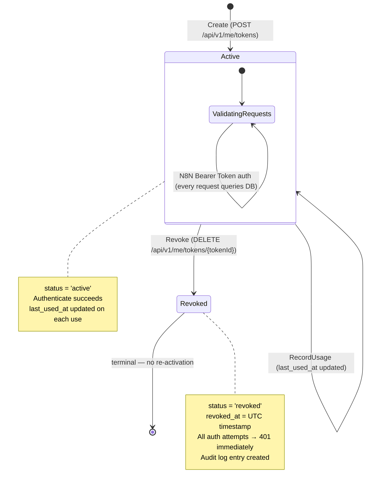
```mermaid
stateDiagram-v2
    [*] --> Active : Create (POST /api/v1/me/tokens)

    Active --> Active : RecordUsage (last_used_at updated)

    Active --> Revoked : Revoke (DELETE /api/v1/me/tokens/{tokenId})

    Revoked --> [*] : terminal — no re-activation

    state Active {
        [*] --> ValidatingRequests
        ValidatingRequests --> ValidatingRequests : N8N Bearer Token auth (every request queries DB)
    }

    note right of Active
        status = 'active'
        Authenticate succeeds
        last_used_at updated on each use
    end note

    note right of Revoked
        status = 'revoked'
        revoked_at = UTC timestamp
        All auth attempts → 401 immediately
        Audit log entry created
    end note
```

### 6.4 ER Diagram

> ER diagram 詳見 `docs/diagrams/server-er-diagram.md`。

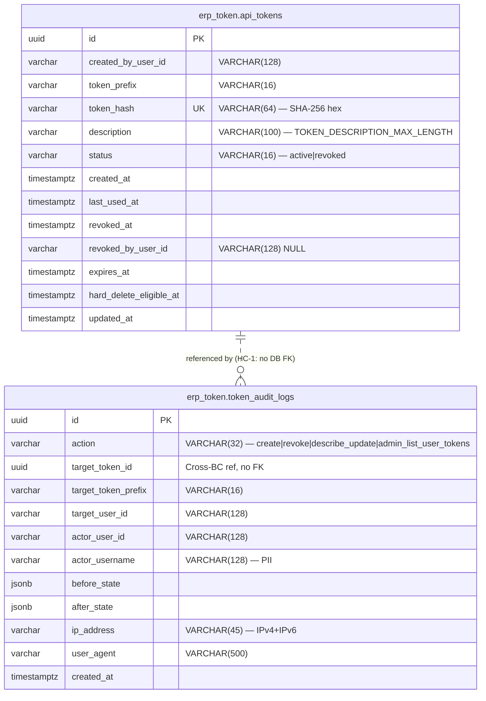
```mermaid
erDiagram
    "erp_token.api_tokens" ||..o{ "erp_token.token_audit_logs" : "referenced by (HC-1: no DB FK)"
    "erp_token.api_tokens" {
        uuid id PK
        varchar created_by_user_id "VARCHAR(128)"
        varchar token_prefix "VARCHAR(16)"
        varchar token_hash UK "VARCHAR(64) — SHA-256 hex"
        varchar description "VARCHAR(100) — TOKEN_DESCRIPTION_MAX_LENGTH"
        varchar status "VARCHAR(16) — active|revoked"
        timestamptz created_at
        timestamptz last_used_at
        timestamptz revoked_at
        varchar revoked_by_user_id "VARCHAR(128) NULL"
        timestamptz expires_at
        timestamptz hard_delete_eligible_at
        timestamptz updated_at
    }
    "erp_token.token_audit_logs" {
        uuid id PK
        varchar action "VARCHAR(32) — create|revoke|describe_update|admin_list_user_tokens"
        uuid target_token_id "Cross-BC ref, no FK"
        varchar target_token_prefix "VARCHAR(16)"
        varchar target_user_id "VARCHAR(128)"
        varchar actor_user_id "VARCHAR(128)"
        varchar actor_username "VARCHAR(128) — PII"
        jsonb before_state
        jsonb after_state
        varchar ip_address "VARCHAR(45) — IPv4+IPv6"
        varchar user_agent "VARCHAR(500)"
        timestamptz created_at
    }
```

---

## 7. Key Sequence Flows

本章節彙整核心使用情境的時序與流程圖。

### 7.1 Sequence Diagram — Token Creation Flow

```mermaid
sequenceDiagram
    actor Admin
    participant Page as Razor Page /ApiTokens/Create
    participant UC as CreateApiTokenUseCase
    participant TG as TokenGenerationService
    participant TR as ApiTokenRepository
    participant AR as AuditLogRepository
    participant DB as PostgreSQL

    Admin->>+Page: POST /ApiTokens/Create {description}
    Page->>Page: Validate AntiForgeryToken

    alt [invalid AntiForgery token]
        Page-->>Admin: 400 Bad Request
    else [unauthenticated user]
        Page-->>Admin: 401 Unauthorized
    else [valid request]
        Page->>Page: Extract UserId from HttpContext.User
        Page->>+UC: ExecuteAsync(CreateTokenCommand)
        UC->>UC: Validate input (description required, max 100 chars)

        alt [invalid input — empty or too long description]
            UC-->>Page: Result.Fail 422 Validation Error
            Page-->>Admin: 422 Unprocessable Entity
        else [valid input]
            UC->>+TG: Generate()
            TG->>TG: RandomNumberGenerator.GetBytes(32)
            TG->>TG: Compute displayPrefix = tk_ + rawToken[0..8]
            TG->>TG: Compute hash = SHA256(rawToken)
            TG-->>-UC: (rawToken, displayPrefix, hash)
            UC->>UC: ApiToken.Create(userId, displayPrefix, hash, description)
            UC->>+DB: BEGIN TRANSACTION
            UC->>+TR: AddAsync(token)
            TR->>DB: INSERT INTO api_tokens ...

            alt [DB error — constraint violation or connection failure]
                DB-->>TR: ERROR
                TR-->>-UC: DbException
                UC->>DB: ROLLBACK
                UC-->>-Page: Result.Fail 500 Internal Server Error
                Page-->>-Admin: 500 Internal Server Error
            else [INSERT success]
                DB-->>TR: OK
                TR-->>UC: void
                UC->>+AR: AddAsync(TokenAuditLog.Record(Create, ...))
                AR->>DB: INSERT INTO token_audit_logs ...
                DB-->>AR: OK
                AR-->>-UC: void
                UC->>DB: COMMIT
                deactivate DB
                UC-->>-Page: CreateTokenResult { rawToken, displayPrefix, token }
                Page-->>-Admin: Redirect to /ApiTokens/Created?prefix=tk_a1b2c3d4
                Note over Admin,Page: Raw token displayed ONCE in modal. Never stored, never logged.
            end
        end
    end
```

### 7.2 Sequence Diagram — Bearer Token Validation Flow

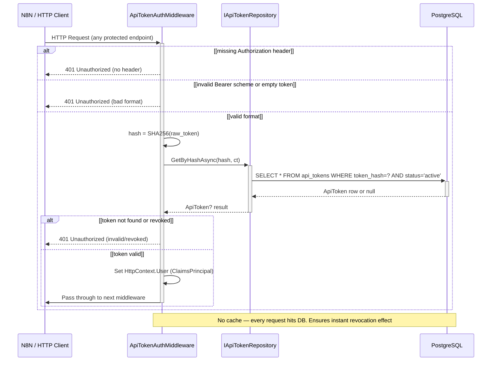
```mermaid
sequenceDiagram
    participant Client as N8N / HTTP Client
    participant MW as ApiTokenAuthMiddleware
    participant Repo as IApiTokenRepository
    participant DB as PostgreSQL

    Client->>+MW: HTTP Request (any protected endpoint)

    alt [missing Authorization header]
        MW-->>Client: 401 Unauthorized (no header)
    else [invalid Bearer scheme or empty token]
        MW-->>Client: 401 Unauthorized (bad format)
    else [valid format]
        MW->>MW: hash = SHA256(raw_token)
        MW->>+Repo: GetByHashAsync(hash, ct)
        Repo->>+DB: SELECT * FROM api_tokens WHERE token_hash=? AND status='active'
        DB-->>-Repo: ApiToken row or null
        Repo-->>-MW: ApiToken? result

        alt [token not found or revoked]
            MW-->>Client: 401 Unauthorized (invalid/revoked)
        else [token valid]
            MW->>MW: Set HttpContext.User (ClaimsPrincipal)
            MW->>-Client: Pass through to next middleware
        end
    end

    Note over MW,DB: No cache — every request hits DB. Ensures instant revocation effect
```

### 7.3 Sequence Diagram — Token Revocation Flow

```mermaid
sequenceDiagram
    actor Admin
    participant Page as Razor Page /ApiTokens/Revoke
    participant UC as RevokeApiTokenUseCase
    participant TR as ApiTokenRepository
    participant AR as AuditLogRepository
    participant DB as PostgreSQL

    Admin->>+Page: POST /ApiTokens/Revoke {tokenId}
    Page->>Page: Validate AntiForgeryToken

    alt [invalid AntiForgery token]
        Page-->>Admin: 400 Bad Request
    else [unauthenticated user]
        Page-->>Admin: 401 Unauthorized
    else [valid request]
        Page->>+UC: ExecuteAsync(RevokeTokenCommand)
        UC->>+TR: GetByIdAsync(tokenId)
        TR->>DB: SELECT * FROM api_tokens WHERE id = $id
        DB-->>TR: ApiToken row or null
        TR-->>-UC: ApiToken? entity

        alt [token not found]
            UC-->>Page: Result.Fail 404 Not Found
            Page-->>Admin: 404 Token not found
        else [not owner and not IT Admin]
            UC-->>Page: Result.Fail 403 Forbidden
            Page-->>Admin: 403 Forbidden — not authorized to revoke this token
        else [authorized to revoke]
            UC->>UC: token.Revoke() — sets Status=Revoked, RevokedAt=UtcNow
            UC->>+DB: BEGIN TRANSACTION
            UC->>TR: SaveChangesAsync()
            TR->>DB: UPDATE api_tokens SET status=revoked, revoked_at=now()

            alt [DB error — connection failure or deadlock]
                DB-->>TR: ERROR
                TR-->>UC: DbException
                UC->>DB: ROLLBACK
                deactivate DB
                UC-->>-Page: Result.Fail 500 Internal Server Error
                Page-->>-Admin: 500 Internal Server Error
            else [UPDATE success]
                DB-->>TR: OK
                UC->>+AR: AddAsync(TokenAuditLog.Record(Revoke, ...))
                AR->>DB: INSERT INTO token_audit_logs ...
                DB-->>AR: OK
                AR-->>-UC: void
                UC->>DB: COMMIT
                UC-->>Page: Result.Success
                Page-->>Admin: Redirect to /ApiTokens (list refreshed)
                Note over Admin,DB: Next N8N call with this token returns 401 immediately (no cache to invalidate)
            end
        end
    end
```

### 7.4 Sequence Diagram — POC Endpoint Call (sales)

```mermaid
sequenceDiagram
    participant N8N as N8N Workflow
    participant MW as ApiTokenAuthMiddleware
    participant Ctrl as PocApiController
    participant DB as PostgreSQL (Mock / Static Data)

    N8N->>+MW: GET /api/v1/demo/sales?startDate=2024-01 Bearer tk_xxx

    alt [missing or invalid Bearer Token]
        MW-->>N8N: 401 Unauthorized
    else [valid Bearer Token]
        MW->>+Ctrl: Forward authenticated request

        alt [invalid date parameter format]
            Ctrl-->>N8N: 422 Unprocessable Entity (invalid date)
        else [feature flag poc_api_enabled=false]
            Ctrl-->>N8N: 404 Not Found
        else [valid request]
            Ctrl->>+DB: Return static mock sales data
            DB-->>-Ctrl: SalesData[] (mock)
            Ctrl-->>-N8N: 200 OK { data: [...] }
        end
    end
```

### 7.5 Communication Diagram

```mermaid
graph TB
    subgraph Browser["Browser (ERP IT Admin)"]
        RP["Razor Pages UI<br/>/ApiTokens/* (internal handler alias)"]
    end

    subgraph AspNetCore["ASP.NET Core 8 Host"]
        MW["ApiTokenAuthenticationHandler"]
        TC["ApiTokensController<br/>/api/v1/me/tokens"]
        PC["PocController<br/>/api/v1/demo/*"]
        TUC["CreateApiTokenUseCase"]
        RUC["RevokeApiTokenUseCase"]
        LUC["ListApiTokensUseCase"]
        TR["ApiTokenRepository"]
        AR["AuditLogRepository"]
        FF["FeatureFlagService"]
    end

    subgraph Storage["PostgreSQL 16"]
        AT[("api_tokens")]
        TAL[("token_audit_logs")]
    end

    subgraph Automation["N8N Automation"]
        N8N["N8N Workflow"]
    end

    RP -- "1: POST /api/v1/me/tokens" --> TC
    TC -- "2: ExecuteAsync" --> TUC
    TUC -- "3: AddAsync" --> TR
    TUC -- "4: AddAsync audit" --> AR
    TR -- "5: INSERT" --> AT
    AR -- "6: INSERT" --> TAL

    N8N -- "7: Bearer Token" --> MW
    MW -- "8: GetByHashAsync" --> TR
    TR -- "9: SELECT by hash" --> AT
    MW -- "10: Authenticated" --> PC

    TC -- "checks" --> FF
    RP -- "reads" --> FF
```

### 7.6 Activity Diagram — Token Creation Workflow

```mermaid
graph LR
    subgraph "ERP User / Browser"
        A((Open /ApiTokens/Create)) --> B[Enter description]
        B --> C[Click Create Token]
        P[Copy token value] --> Q[Close one-time modal]
        Q --> R((Return to Token List))
    end

    subgraph "Presentation Layer"
        C --> D{AntiForgery valid?}
        D -->|No| E[Return 400 Bad Request]
        D -->|Yes| F{Feature flag enabled?}
        F -->|No| G[Return 403 Feature Disabled]
        F -->|Yes| H[Invoke CreateApiTokenUseCase]
        N[Redirect to /ApiTokens/Created] --> O[Show one-time token modal]
        O --> P
    end

    subgraph "Application Layer"
        H --> I{Input valid?}
        I -->|No| J[Return 422 Validation Error]
        I -->|Yes| K[TokenGenerationService.Generate]
        K --> L[ApiToken.Create entity]
        L --> M[Save token + audit log]
        M --> N
    end

    subgraph "Infrastructure"
        M --> S[(PostgreSQL: INSERT api_tokens)]
        M --> T[(PostgreSQL: INSERT token_audit_logs)]
    end

    E --> R
    G --> R
    J --> R
```

### 7.7 Activity Diagram — Bearer Token Authentication

```mermaid
graph LR
    subgraph "N8N / HTTP Client"
        A((Send HTTP Request)) --> B[Authorization: Bearer token header]
        Z((Receive 401 Unauthorized))
        Y((Receive 200 + Business Data))
    end

    subgraph "API Layer — Auth Middleware"
        B --> C{Header present?}
        C -->|No| D[AuthenticateResult.NoResult]
        C -->|Yes| E{Scheme = Bearer?}
        E -->|No| D
        E -->|Yes| F[Extract raw token value]
        F --> G[SHA-256 hash token]
        G --> H[Query DB by hash]
        D --> Z
        L[AuthenticateResult.Fail] --> Z
        M[Build ClaimsPrincipal user_id + claims] --> N[HttpContext.User populated]
        N --> O[fire-and-forget: UPDATE last_used_at]
    end

    subgraph "Infrastructure"
        H --> I[(PostgreSQL: SELECT WHERE hash = $hash AND status = active)]
        I -->|Not found or revoked| L
        I -->|Found active token| M
        O --> P[(PostgreSQL: UPDATE last_used_at)]
    end

    subgraph "Application Layer — Endpoint Handler"
        N --> Q[Process request with User claims]
        Q --> Y
    end
```

### 7.8 Activity Diagram — Token Revocation Workflow

```mermaid
graph LR
    subgraph "ERP User / Browser"
        A((View token list)) --> B[Click Revoke on token]
        B --> C[Show ConfirmRevokeDialog]
        C -->|Cancel| D((Return to token list))
        C -->|Confirm| E[POST /ApiTokens/Revoke tokenId]
        S[Show success toast] --> T((Done — N8N 401 on next call))
    end

    subgraph "Presentation Layer"
        E --> F{AntiForgery valid?}
        F -->|No| G[Return 400 Bad Request]
        F -->|Yes| H[Invoke RevokeApiTokenUseCase]
        R[Redirect to /ApiTokens] --> S
        G --> D
    end

    subgraph "Application Layer"
        H --> I[Load token by ID]
        I -->|Not found| J[Return 404 Not Found]
        I -->|Not owner and not IT Admin| K[Return 403 Forbidden]
        I -->|Already revoked| L[Return 409 Conflict]
        I -->|Authorized| M[token.Revoke() — set status=revoked]
        M --> N[Save changes + write audit log]
        N --> R
        J --> D
        K --> D
        L --> D
    end

    subgraph "Infrastructure"
        N --> O[(PostgreSQL: UPDATE api_tokens SET status=revoked)]
        N --> P[(PostgreSQL: INSERT token_audit_logs EVENT=REVOKE)]
    end
```

---

## 8. Error Handling & Resilience


### 8.1 Global Exception Handling

```csharp
// ExceptionHandlingMiddleware.cs
public class ExceptionHandlingMiddleware
{
    private readonly RequestDelegate _next;
    private readonly ILogger<ExceptionHandlingMiddleware> _logger;

    public async Task InvokeAsync(HttpContext context)
    {
        try
        {
            await _next(context);
        }
        catch (OperationCanceledException)
        {
            // Client disconnected — not an error
            context.Response.StatusCode = 499;
        }
        catch (Exception ex)
        {
            _logger.LogError(ex, "Unhandled exception for {Method} {Path}",
                context.Request.Method, context.Request.Path);

            context.Response.StatusCode = 500;
            context.Response.ContentType = "application/problem+json";

            await context.Response.WriteAsJsonAsync(new ProblemDetails
            {
                Type = "https://erp.internal/errors/internal",
                Title = "An unexpected error occurred.",
                Status = 500,
                Instance = context.Request.Path
            });
        }
    }
}
```

### 8.2 Database Retry Policy

```csharp
// In DbContext options
options.UseNpgsql(connectionString, npgsqlOptions =>
{
    npgsqlOptions.EnableRetryOnFailure(
        maxRetryCount: 3,
        maxRetryDelay: TimeSpan.FromSeconds(5),
        errorCodesToAdd: null);
});
```

### 8.3 Circuit Breaker

At MVP scale (single pod, single DB), a formal circuit breaker (Polly) is deferred. The EF Core retry policy covers transient failures. If the DB is completely unreachable, the application returns 503 (health check fails → Kubernetes removes pod from load balancer).

### 8.4 Graceful Shutdown

ASP.NET Core 8 handles `SIGTERM` gracefully. In-flight requests are given 30 seconds to complete (`HostOptions.ShutdownTimeout = TimeSpan.FromSeconds(30)`).

### 8.5 Graceful Degradation Strategy

> **Principle**：核心功能（認證 + 撤銷）優先；觀察性與輔助功能可降級不阻擋業務流。

#### 8.5.1 依賴服務降級矩陣

| 依賴服務 | 完全失效時的策略 | 降級行為 | 影響範圍 | 復原條件 |
|---------|----------------|---------|---------|---------|
| **PostgreSQL Primary** | Read-only mode（暫不接受 Token 建立/撤銷） | API 回傳 HTTP 503 + Retry-After header；既有 Token 仍可驗證（從 Standby read） | Token CUD 暫停；驗證/列表仍可用（Read Replica） | Primary 復原（手動 failover ≤ 30 min） |
| **PostgreSQL Standby** | 自動降級為單點 Primary 服務 | 維持完整功能；觸發 P2 alert | RPO 可能擴大（直到 Standby 復原） | Standby 重新同步 |
| **OpenTelemetry Collector** | Fallback to stdout JSON logs | 觀察性訊號改寫至 stdout（k8s logs 仍可查） | Metrics/Traces 暫時遺失（< 5 min buffer） | Collector pod 重啟（自動） |
| **Cache layer（v2 Redis）** | 直連 DB（bypass cache） | 認證 P99 稍升至 ~100ms | DB 負載增加 N 倍 | Redis 復原 |
| **Rate Limit store（in-memory，§9.8）** | 多 pod 各自計數 | 實際 limit = 配置值 × N pods（已知技術債 TD-08） | 防暴力破解效果稍弱 | 升級至 Redis-backed limiter |

#### 8.5.2 Bulkhead 隔離

- **Connection Pool**：每個 pod 預設 max 100 connections（避免單一 pod 耗盡 DB pool）
- **Thread Pool**：CPU-bound 與 I/O-bound 工作分離（async/await + dedicated thread pool for blocking ops）
- **Timeouts**：DB query default timeout 5s；Auth handler total timeout 2s

#### 8.5.3 Circuit Breaker 配置（v2 引入 Polly）

```csharp
// Program.cs — Polly Circuit Breaker（MVP 預留，v2 啟用）
.AddTransientHttpErrorPolicy(p => p.CircuitBreakerAsync(
    handledEventsAllowedBeforeBreaking: 5,    // 連續 5 次失敗
    durationOfBreak: TimeSpan.FromSeconds(30) // open 30s
));
```

**Circuit States：**
- Closed → Open：連續 5 次 DB 連線失敗
- Open → Half-Open：30s 後嘗試 1 次 probe
- Half-Open → Closed：probe 成功；否則回 Open

---

## 9. Security Design


### 9.1 Token Security Properties

| Property | Design Decision | Rationale |
|----------|----------------|-----------|
| Generation | CSPRNG 32 bytes via `RandomNumberGenerator.GetBytes(32)` | 256 bits of entropy — collision probability negligible |
| Encoding | Base64 with URL-safe substitution | Compact, safe for HTTP headers |
| Storage | SHA-256(rawToken) hex only | Raw token never persisted — breach of DB reveals no usable tokens |
| Display | Once only on creation, never again | Minimizes exposure window |
| Transport | HTTPS only (TLS 1.2+) | Protects in-transit interception |
| Prefix | First 8 chars displayed as `tk_a1b2c3d4` | Identification without exposing enough entropy to reconstruct |
| Hashing algorithm | SHA-256 (no salt) | Keyless hash intentional — tokens are high-entropy secrets, not passwords |

### 9.2 Why SHA-256 Without Salt

API tokens are cryptographically random secrets (~256 bits entropy). Unlike passwords, they cannot be brute-forced through dictionary attacks. Salt is necessary for low-entropy inputs (passwords); for high-entropy random secrets, SHA-256 provides sufficient security and allows O(1) lookup without the overhead of bcrypt/Argon2.

### 9.3 Token Validation Security

- **No cache**: Every Bearer Token authentication queries the database directly. This ensures revocation is effective immediately — no cache TTL delay.
- **Constant-time comparison (DB-side)**: The database lookup is performed by hash equality, not by iterating token values. SQL `WHERE token_hash = $hash` uses indexed equality — no timing oracle exposure on the storage tier.
- **Constant-time comparison (App-side, defense-in-depth)**: 在應用層額外使用 `CryptographicOperations.FixedTimeEquals(byte[] computedHash, byte[] storedHash)` 比對 SHA-256 hash bytes，防 Timing Attack（即使 DB query plan 不再保證 indexed equality 時，應用層仍以 constant-time byte comparison 為最後一道防線）。`CONSTANTS.TOKEN_HASH_COMPARE_MODE = constant-time`。
- **Brute force prevention**: SHA-256 token hashes are 64-char hex strings derived from 256-bit random values. There is no computationally feasible path to reverse or brute-force.

### 9.4 Web Security Controls

| Control | Implementation |
|---------|---------------|
| CSRF Protection | ASP.NET Core AntiForgery on all state-changing forms |
| Content Security Policy | Nonce-based CSP header in middleware |
| X-Frame-Options | DENY |
| X-Content-Type-Options | nosniff |
| Referrer-Policy | strict-origin-when-cross-origin |
| HSTS | `Strict-Transport-Security: max-age=31536000; includeSubDomains` |
| Input Validation | FluentValidation on all DTOs; server-side only trusted |
| Output Encoding | Razor Pages auto-encodes; no `@Html.Raw()` on user content |
| Token in logs | Token prefix only — full hash never logged |
| Cache-Control: no-store | Applied to POST /api/v1/me/tokens response and GET /ApiTokens/Created (internal handler) page — prevents browser caching of the one-time raw token value |

### 9.5 Authorization Policy

```csharp
// Program.cs — Authorization configuration
builder.Services.AddAuthorization(options =>
{
    options.AddPolicy("ApiTokenManager", policy =>
        policy.RequireAuthenticatedUser()
              .RequireClaim("erp_role", "ITAdmin", "BusinessUser"));

    options.AddPolicy("PocEndpoints", policy =>
        policy.AddAuthenticationSchemes("ApiToken")
              .RequireAuthenticatedUser());
});
```

### 9.6 OWASP Top 10 對照表

| OWASP ID | 風險名稱 | 本系統對策 |
|----------|---------|-----------|
| A01 | Broken Access Control | Authorization Policy（`ApiTokenManager` / `PocEndpoints` / `AdminTokenList`）；RBAC 強制執行（見 §6.5 + §4.9.3）；IT Admin 專屬 `ListAllTokensUseCase`；非擁有者撤銷 Token 返回 403 |
| A02 | Cryptographic Failures | SHA-256 Token Hash 儲存；TLS 1.2+ 強制（HSTS）；HTTPS Only；明文 Token 僅在回應中出現一次，DB 零儲存 |
| A03 | Injection | EF Core 參數化查詢（不拼 SQL）；FluentValidation Model Validation；所有 DTO 邊界校驗；Razor Pages 自動輸出編碼 |
| A04 | Insecure Design | STRIDE 威脅建模（Spoofing→Bearer Hash、Tampering→Hash Integrity、Repudiation→AuditLog、DoS→Rate Limiting）；Fail-fast startup 驗證（DB + Secret 可用性） |
| A05 | Security Misconfiguration | Kubernetes SecurityContext（非 root 執行）；環境變數強制驗證（缺少時拒絕啟動）；Production 關閉 poc_demo_apis；CSP Nonce-Based |
| A06 | Vulnerable Components | `dotnet list package --vulnerable`（CI 必過）；Trivy 容器掃描（CI 必過）；GitHub Dependabot 自動更新 |
| A07 | Identification and Authentication Failures | 無效 Token 立即返回 401；Rate Limiting（見 §6.7）；Token Revocation 即時生效（無快取）；AntiForgery 防 CSRF |
| A08 | Software and Data Integrity Failures | EF Core 樂觀並發（`RowVersion`/`Timestamp`）；Audit Log 僅追加（不可修改 / `ON DELETE RESTRICT`）；Docker Image 簽名（SBOM via Trivy） |
| A09 | Security Logging and Monitoring Failures | OpenTelemetry + AlertManager（見 §13.6）；PII 欄位遮罩（Token 日誌僅顯示 `tk_xxxx****`；Hash 僅記錄前 8 字元）；Auth 失敗事件必記錄 |
| A10 | Server-Side Request Forgery (SSRF) | ERP 後端僅與已知 PostgreSQL DB 通訊；不接受使用者提供 URL；k8s NetworkPolicy 限制 Pod 出站連線 |

### 9.7 STRIDE Threat Model

| Category | Threat Example | Mitigation | Status |
|---|---|---|---|
| Spoofing | Token theft via MITM — attacker intercepts Bearer Token in transit | HTTPS enforced (TLS 1.2+), HSTS `max-age=31536000` | Mitigated |
| Tampering | Token hash manipulation in DB — attacker modifies stored hash to activate revoked token | Hash stored with unique index; EF Core optimistic concurrency; DB user has minimal privileges | Mitigated |
| Repudiation | User denies performing CREATE or REVOKE action | Append-only AuditLog (CREATE/REVOKE) with operator_user_id, client_ip, timestamp; `ON DELETE RESTRICT` prevents log deletion | Mitigated |
| Information Disclosure | Token plaintext leaked in application logs or error responses | Log only prefix (`tk_***`); full hash never logged; raw token shown exactly once in response; error messages sanitized | Mitigated |
| Denial of Service | Flood POST /api/v1/me/tokens or GET /api/v1/demo/* to exhaust DB connections | Rate limit 60 req/min/userId (token mgmt), 120 req/min/tokenId (POC); 429 + Retry-After on excess | Mitigated |
| Elevation of Privilege | Regular ERP user accesses other users' tokens or calls ListAllTokens | RBAC: IT Admin role required for `ListAllTokensUseCase`; non-owner revoke returns 403; `AdminTokenList` Authorization Policy enforced | Mitigated |

### 9.8 Rate Limiting

使用 ASP.NET Core .NET 7+ 內建 Rate Limiting Middleware（`Microsoft.AspNetCore.RateLimiting`）：

| 適用範圍 | 限流規則 | 超限回應 |
|---------|---------|---------|
| Token 管理 API（POST/DELETE /api/v1/me/tokens，已認證使用者） | 60 req / min / userId | 429 + `Retry-After: 60` |
| POC 端點（GET /api/v1/demo/*，Token 認證使用者） | 120 req / min / tokenId | 429 + `Retry-After: 60` |
| 未認證請求（401 計數） | 10 次 / min / IP → 封鎖 1 分鐘 | 429 + `Retry-After: 60` |

```csharp
// Program.cs — Rate Limiting 配置
builder.Services.AddRateLimiter(options =>
{
    options.AddFixedWindowLimiter("TokenManagement", config =>
    {
        config.PermitLimit = 60;
        config.Window = TimeSpan.FromMinutes(1);
        config.QueueProcessingOrder = QueueProcessingOrder.OldestFirst;
        config.QueueLimit = 0;
    });

    options.AddFixedWindowLimiter("PocEndpoints", config =>
    {
        config.PermitLimit = 120;
        config.Window = TimeSpan.FromMinutes(1);
        config.QueueProcessingOrder = QueueProcessingOrder.OldestFirst;
        config.QueueLimit = 0;
    });

    options.OnRejected = async (context, cancellationToken) =>
    {
        context.HttpContext.Response.StatusCode = StatusCodes.Status429TooManyRequests;
        context.HttpContext.Response.Headers.RetryAfter = "60";
        await context.HttpContext.Response.WriteAsJsonAsync(
            new { error = "Too Many Requests" }, cancellationToken);
    };
});
```

> **⚠️ Multi-pod 部署風險（已知技術債 TD-08，cross-link §15.1）**：
> 上述 `AddFixedWindowLimiter` 為 **per-pod in-memory** 計數器；當 Production 部署 N 個 pod（§13.2.2.1 min replicas=2，max=10）時，**實際 effective limit = 配置值 × N**。
> 例：配置 60 req/min/IP 在 5 pod 部署下，攻擊者最高可獲得 300 req/min（5 倍洩漏）。
> **MVP 接受此風險**：MVP 流量極小（< 2 QPS）且風險範圍僅限於暴力破解防禦稍弱；**v2 升級路徑**為改用 Redis-backed distributed rate limiter（`Microsoft.AspNetCore.RateLimiting` + Redis adapter 或 Envoy/Nginx ingress 層 limiter）。詳見 §15.1 TD-08。

### 9.9 Token TTL 生命週期說明

`ApiToken.ExpiresAt` 欄位已在 DB Schema 中預留（見 §8.1）。MVP 階段不強制過期（TTL = ∞），Revocation 為唯一終止機制。v2 可設定 90 天自動過期並觸發提醒通知。

### 9.10 Role × Permission × Endpoint 矩陣（RBAC）

| Endpoint | IT Admin | ERP 業務使用者 | N8N 操作員（Token Auth） | 說明 |
|---------|:-------:|:------------:|:----------------------:|------|
| `POST /api/v1/me/tokens` | ✅ | ✅ | ❌ | 建立 Token（含 Razor Pages UI 內部 alias `POST /ApiTokens/Create`） |
| `GET /api/v1/me/tokens` | ❌ | ✅（僅自己）| ❌ | 一般使用者列出自己的 Token |
| `GET /api/v1/admin/users/{userId}/tokens` | ✅（任意 userId）| ❌ | ❌ | IT Admin 列出指定使用者 Token，呼叫 `ListAllTokensUseCase` |
| `DELETE /api/v1/me/tokens/{tokenId}` | ❌ | ✅（僅自己）| ❌ | 一般使用者撤銷自己的 Token |
| `DELETE /api/v1/admin/users/{userId}/tokens/{tokenId}` | ✅（任意）| ❌ | ❌ | IT Admin 強制撤銷任意使用者 Token |
| `PATCH /api/v1/me/tokens/{tokenId}` | ❌ | ✅（僅自己）| ❌ | 更新自己 Token 的 description |
| `GET /api/v1/admin/audit-logs` | ✅ | ❌ | ❌ | IT Admin 審計查詢端點（程式化） |
| `GET /api/v1/demo/sales` | ❌ | ✅（Token Auth）| ✅（Token Auth）| POC 銷售數據示範端點 |
| `GET /api/v1/demo/inventory` | ❌ | ✅（Token Auth）| ✅（Token Auth）| POC 庫存查詢示範端點 |
| `GET /api/v1/demo/orders/{orderId}` | ❌ | ✅（Token Auth）| ✅（Token Auth）| POC 訂單狀態示範端點 |

### 9.11 Secrets Management

| Secret | Storage | Notes |
|--------|---------|-------|
| PostgreSQL connection string | Kubernetes Secret / env var | Never in code or ConfigMap（見 §13.3.2 Secret 命名與結構） |
| HMAC Secret（v2 用，SHA-256 keyless 不需要）| Kubernetes Secret | MVP 階段 SHA-256 keyless，v2 升級 HMAC 時啟用 |
| ERP session secret | Kubernetes Secret | Existing ERP config |
| AntiForgery data protection keys | Kubernetes PVC or Data Protection API | Must be consistent across pods |
| No token master key | N/A | SHA-256 is keyless — no secret needed for MVP |

---

### 9.12 Authentication Middleware（詳細實作）


#### 9.12.1 Handler Implementation

```csharp
namespace ApiTokenManager.Infrastructure.Auth;

public class ApiTokenAuthenticationHandler
    : AuthenticationHandler<AuthenticationSchemeOptions>
{
    private readonly IApiTokenRepository _tokenRepository;
    private readonly ITokenGenerationService _tokenGenerator;
    private readonly ILogger<ApiTokenAuthenticationHandler> _logger;
    private static readonly ActivitySource _activitySource =
        new("ApiTokenManager.Auth");

    public ApiTokenAuthenticationHandler(
        IOptionsMonitor<AuthenticationSchemeOptions> options,
        ILoggerFactory logger,
        UrlEncoder encoder,
        IApiTokenRepository tokenRepository,
        ITokenGenerationService tokenGenerator)
        : base(options, logger, encoder)
    {
        _tokenRepository = tokenRepository;
        _tokenGenerator = tokenGenerator;
        _logger = logger.CreateLogger<ApiTokenAuthenticationHandler>();
    }

    protected override async Task<AuthenticateResult> HandleAuthenticateAsync()
    {
        using var activity = _activitySource.StartActivity("ValidateBearerToken");

        // 1. Extract Authorization header
        if (!Request.Headers.TryGetValue("Authorization", out var authHeader))
            return AuthenticateResult.NoResult();

        var headerValue = authHeader.ToString();
        if (!headerValue.StartsWith("Bearer ", StringComparison.OrdinalIgnoreCase))
            return AuthenticateResult.NoResult();

        var rawToken = headerValue["Bearer ".Length..].Trim();
        if (string.IsNullOrEmpty(rawToken))
            return AuthenticateResult.Fail("Empty token value.");

        // 2. Compute SHA-256 hash (injected via ITokenGenerationService)
        var hash = _tokenGenerator.ComputeHash(rawToken);
        activity?.SetTag("token.hash_prefix", hash[..8]);

        // 3. Query database (no cache — critical for immediate revocation)
        // Repository 採 indexed equality（DB 端常數時間 — 由 ux_api_tokens_token_hash 唯一索引保證 O(log n)）+
        // 應用層 CryptographicOperations.FixedTimeEquals(byte[], byte[]) 雙保險，
        // 防止任何單層 fallback path 引入 timing oracle（§9.3 Token Validation Security）。
        var token = await _tokenRepository.GetByHashAsync(hash, Context.RequestAborted);

        if (token is null)
        {
            _logger.LogWarning("Bearer token not found. Hash prefix: {HashPrefix}", hash[..8]);
            activity?.SetTag("auth.result", "not_found");
            return AuthenticateResult.Fail("Invalid or revoked token.");
        }

        // Defense-in-depth: re-verify hash bytes with constant-time comparison
        // (DB indexed equality is the primary check; FixedTimeEquals is the second layer)
        var computedBytes = Convert.FromHexString(hash);
        var storedBytes = Convert.FromHexString(token.TokenHash);
        if (!CryptographicOperations.FixedTimeEquals(computedBytes, storedBytes))
        {
            _logger.LogWarning("Token hash mismatch on app-side constant-time check. Prefix: {Prefix}", token.TokenPrefix);
            activity?.SetTag("auth.result", "hash_mismatch");
            return AuthenticateResult.Fail("Invalid token.");
        }

        if (token.Status != TokenStatus.Active)
        {
            _logger.LogWarning("Revoked token used. Prefix: {Prefix}", token.TokenPrefix);
            activity?.SetTag("auth.result", "revoked");
            return AuthenticateResult.Fail("Token has been revoked.");
        }

        // 4. Build claims principal
        var claims = new[]
        {
            new Claim("user_id", token.UserId),
            new Claim("token_prefix", token.TokenPrefix),
            // Additional ERP user claims would be loaded here from ERP user store
        };

        var identity = new ClaimsIdentity(claims, Scheme.Name);
        var principal = new ClaimsPrincipal(identity);
        var ticket = new AuthenticationTicket(principal, Scheme.Name);

        _logger.LogInformation(
            "Bearer token authenticated. UserId: {UserId}, Prefix: {Prefix}",
            token.UserId, token.TokenPrefix);

        activity?.SetTag("auth.result", "success");
        activity?.SetTag("auth.user_id", token.UserId);

        // 5. Fire-and-forget last_used_at update (best-effort)
        _ = UpdateLastUsedAsync(token, CancellationToken.None);

        return AuthenticateResult.Success(ticket);
    }

    private async Task UpdateLastUsedAsync(ApiToken token, CancellationToken ct)
    {
        try
        {
            token.RecordUsage();
            await _tokenRepository.SaveChangesAsync(ct);
        }
        catch (Exception ex)
        {
            // Non-critical — do not fail auth on this
            _logger.LogWarning(ex, "Failed to update last_used_at for token {Prefix}", token.TokenPrefix);
        }
    }
}
```

#### 9.12.2 Authentication Scheme Registration

```csharp
// Program.cs
builder.Services.AddAuthentication(options =>
{
    options.DefaultScheme = CookieAuthenticationDefaults.AuthenticationScheme; // ERP session
})
.AddCookie(CookieAuthenticationDefaults.AuthenticationScheme, options =>
{
    options.LoginPath = "/Account/Login";
    options.AccessDeniedPath = "/Account/AccessDenied";
})
.AddScheme<AuthenticationSchemeOptions, ApiTokenAuthenticationHandler>(
    "ApiToken", options => { });
```

---

## 10. Observability Design


### 10.1 Metrics

All metrics use `ApiTokenManager` as the metric prefix.

| Metric Name | Type | Labels | Description |
|-------------|------|--------|-------------|
| `api_token_auth_total` | Counter | `result` (success/fail) | Total Bearer Token auth attempts |
| `api_token_auth_duration_ms` | Histogram | — | Auth handler duration |
| `api_token_created_total` | Counter | `user_id` | Tokens created |
| `api_token_revoked_total` | Counter | `user_id` | Tokens revoked |
| `api_token_active_count` | Gauge | — | Total active tokens (polled every 60s) |
| `api_poc_requests_total` | Counter | `endpoint`, `status_code` | POC endpoint requests |

### 10.2 Structured Logging

All log messages use structured key-value pairs:

```csharp
// Examples of structured log output
_logger.LogInformation(
    "Token created. {UserId} {TokenPrefix}",
    userId, displayPrefix);

_logger.LogWarning(
    "Auth failed — token not found. HashPrefix: {HashPrefix}",
    hash[..8]);

_logger.LogWarning(
    "Auth failed — token revoked. Prefix: {Prefix}",
    token.TokenPrefix);

// NEVER log:
// - raw token value
// - full token hash
// - user password or session secret
```

### 10.3 Distributed Tracing

OpenTelemetry trace spans cover:
- `ApiTokenAuthenticationHandler.HandleAuthenticateAsync` — root span for auth
- `ApiTokenRepository.GetByHashAsync` — DB query span
- `CreateApiTokenUseCase.ExecuteAsync` — create flow span
- `RevokeApiTokenUseCase.ExecuteAsync` — revoke flow span

Trace attributes:
- `token.hash_prefix` — first 8 chars of hash (safe for traces)
- `auth.result` — `success` | `not_found` | `revoked`
- `auth.user_id` — authenticated user ID

#### 10.3.1 Sampling Rate 設計

| 環境 | Sampling Rate | 說明 |
|------|-------------|------|
| Local | 100%（always-on）| 開發調試，全量追蹤 |
| Dev | 100%（always-on）| 開發環境，全量追蹤便於問題排查 |
| Staging | 100%（always-on）| 全量採樣，方便功能測試和性能分析 |
| Production | 100%（always-on，MVP）| MVP 規模僅 ~2 QPS，全量合理；QPS > 1000 時改為 10% probabilistic sampling |

> **PRD Deviation (Documented)**: PRD §7.7.3 specifies Production 10% sampling.
> **EDD Decision**: MVP 階段 QPS ≈ 2，AlwaysOn (100%) 成本可接受，便於問題排查。
> 當 QPS > 1000 時，切換為 10% Probabilistic Sampler。
> **Auth Failure Sampling**: 無論 QPS 大小，認證失敗請求（HTTP 401/403）一律 100% 採樣。
> 實作方式：在 `ApiTokenAuthenticationHandler` 中，認證失敗時設定 `Activity.Current?.SetTag("force.sample", "true")`，並在 OTEL Sampler 中讀取此 tag 強制採樣。

```csharp
// Program.cs — OpenTelemetry Sampling 配置
builder.Services.AddOpenTelemetry()
    .WithTracing(tracing => tracing
        .AddSource("ApiTokenManager.*")
        .AddAspNetCoreInstrumentation()
        .AddNpgsql()
        // MVP: AlwaysOnSampler（全量）
        // v2 高流量: new TraceIdRatioBasedSampler(0.1) (10%)
        // Auth failures (401/403) are always force-sampled via "force.sample" tag
        .SetSampler(new AlwaysOnSampler())
        .AddOtlpExporter());
```

### 10.4 Health Checks

```csharp
builder.Services.AddHealthChecks()
    .AddNpgsql(
        builder.Configuration.GetConnectionString("ApiTokenDb")!,
        name: "postgresql",
        tags: ["db", "ready"]);

app.MapHealthChecks("/health/live", new HealthCheckOptions
{
    Predicate = _ => false  // Liveness: always 200 if process alive
});

app.MapHealthChecks("/health/ready", new HealthCheckOptions
{
    Predicate = check => check.Tags.Contains("ready")
});
```

### 10.5 Grafana Dashboard Panels

| Panel | Query | Alert Threshold |
|-------|-------|----------------|
| Auth Success Rate | `rate(api_token_auth_total{result="success"}[5m])` | < 99.5% → alert |
| Auth Failure Rate | `rate(api_token_auth_total{result="fail"}[5m])` | > 0.5% → warn |
| Auth P99 Latency | `histogram_quantile(0.99, api_token_auth_duration_ms)` | > 500ms → alert |
| Active Tokens | `api_token_active_count` | — |
| DB Connection Pool | `npgsql_pool_connections_in_use` | > 80% pool size → warn |

### 10.6 AlertManager Rules

```yaml
# prometheus-alerts.yaml
groups:
  - name: erp-api-token-manager
    rules:
      - alert: HighAuthFailureRate
        expr: |
          rate(api_token_auth_total{result="fail"}[5m]) /
          rate(api_token_auth_total[5m]) > 0.05
        for: 2m
        labels:
          severity: warning
        annotations:
          summary: "API token auth failure rate above 5%"

      - alert: AuthP99LatencyHigh
        expr: |
          histogram_quantile(0.99, api_token_auth_duration_ms) > 500
        for: 3m
        labels:
          severity: critical
        annotations:
          summary: "API token auth P99 latency exceeds 500ms SLO"

      - alert: DatabaseDown
        expr: |
          up{job="postgresql"} == 0
        for: 1m
        labels:
          severity: critical
        annotations:
          summary: "PostgreSQL database is unreachable"

      - alert: CSP_ViolationsDetected
        expr: |
          rate(csp_violations_total[5m]) > 0
        for: 5m
        labels:
          severity: warning
        annotations:
          summary: "CSP violations detected in production"
          description: "瀏覽器回報 CSP 違規 — 表示前端有非預期的腳本/樣式來源；檢查 §9.4 CSP 設定與最近的 deploy diff。"

      - alert: OtelExportFailures
        expr: |
          rate(otelcol_exporter_send_failed_spans_total[5m]) > 0
        for: 5m
        labels:
          severity: warning
        annotations:
          summary: "OpenTelemetry collector failing to export spans"
          description: "OTel exporter send_failed_spans rate > 0 — 表示遙測管線健康度受損；檢查 collector 與 backend 連線、token 有效性。"
```

### 10.7 Audit Log Design

> **SoT 對齊**：Schema 詳見 §6.2.2 `erp_token.token_audit_logs`；本節聚焦觀察性與保留策略。

#### 10.7.1 Schema 摘要

| 欄位 | 用途 |
|------|------|
| `action` | 4 值列舉：`create` / `revoke` / `describe_update` / `admin_list_user_tokens` |
| `target_token_id` + `target_token_prefix` | 操作對象（即使 token 硬刪除仍可追溯 prefix） |
| `actor_user_id` + `actor_username` | 執行者；admin 操作時 ≠ target_user_id |
| `before_state` / `after_state` (JSONB) | describe_update / revoke 變更內容快照 |
| `ip_address` + `user_agent` | 來源識別 |
| `created_at` (TIMESTAMPTZ) | UTC 事件時間 |

#### 10.7.2 保留策略（SoT — 與 PRD §11.4、SCHEMA §17 對齊）

| 資料類型 | 保留期 | 法規依據 | 處置 |
|---------|--------|---------|------|
| Audit log（建立/撤銷/描述更新） | **7 年** | SOX / 內稽合規 + GDPR Art. 30 (record of processing) | append-only；7 年後歸檔至冷儲 |
| api_tokens（已撤銷） | 撤銷後 90 天硬刪除 | GDPR Right to Erasure（CONSTANTS.revoked_token_hard_delete_days=90） | `hard_delete_eligible_at` 觸發背景 worker |
| api_tokens（active） | 永久（直到撤銷） | — | — |

#### 10.7.3 查詢介面

| 介面 | 路徑 | 授權 | 用途 |
|------|------|------|------|
| Razor Page | `GET /ApiTokens/AuditLog` | IT Admin only（§9.5 AdminAuditLog policy） | 90 天事件列表 + CSV 匯出 |
| REST API | `GET /api/v1/admin/audit-logs?from=&to=&action=&actor_user_id=` | IT Admin only | 程式化查詢（含分頁） |
| Application Port | `IAuditLogQueryPort` | 內部 BC 跨模組 | AuditLogBC 對外 OHS 介面（§3.4） |

#### 10.7.4 觀察性指標

```yaml
# Audit log 寫入失敗 → P1 alert
- alert: AuditLogWriteFailure
  expr: increase(audit_log_write_failures_total[5m]) > 0
  for: 1m
  labels: { severity: critical }
  annotations: { summary: "Audit log write failed - compliance risk" }

# Audit log 7 年保留違反（背景 worker 誤刪）
- alert: AuditLogRetentionViolation
  expr: audit_log_retention_violation_total > 0
  for: 1m
  labels: { severity: critical }
```

### 10.8 Synthetic Monitoring（外部健康探針）

> **目的**：以使用者視角驗證 SLO，不依賴內部探針；補充 readiness/liveness probe 之外的端對端可用性訊號。

#### 10.8.1 Probe 配置

| Probe 類型 | 頻率 | 目標端點 | 預期回應 | 失敗條件 |
|-----------|------|---------|---------|---------|
| Health probe | 5 min | `https://erp.internal/health/ready` | HTTP 200 + `{status:"healthy"}` | 連續 2 次失敗 |
| Auth scenario | 5 min | `GET /api/v1/demo/sales` with synthetic test token | HTTP 200 + JSON | 連續 2 次失敗或 latency > 2s |
| Token CRUD scenario | 1 hour | POST → GET → DELETE token | 三步驟全部 2xx | 任一步驟失敗 |

#### 10.8.2 工具選型

- **首選**：Pingdom / Datadog Synthetics（外部 vantage point）
- **次選**：Prometheus Blackbox Exporter（內部叢集，模擬 user-agent）
- **告警**：失敗 → P2 alert；連續 4 次（20 min）→ P1 alert（觸發 RTO 計時）

#### 10.8.3 Synthetic Test Token 隔離

- 專用 user account（`synthetic-monitor@erp.internal`，`is_superuser=false`）
- 專用 token prefix `tk_synmon_`（透過 prefix filter 排除於正常 audit 報表）
- Token 每 24h 自動輪換（CronJob 觸發 PATCH 描述標記）

---

## 11. Performance Design


### 11.1 Scale Assumptions

| Parameter | Value | Derivation |
|-----------|-------|-----------|
| Total users | 1–100 | MVP / Pilot |
| Active tokens (peak) | ≤500 | ~5 per user average |
| API calls per user per day | ~10 | Estimated N8N workflow frequency |
| Base QPS | ~0.012 | 100 users × 10 / 86400 |
| Peak QPS (10x burst) | ~2 | Reasonable burst factor |
| Target P99 latency | ≤500ms | SLO requirement |
| Target availability | ≥99.5% | SLO requirement |
| Target error rate | ≤0.5% | SLO requirement |

### 11.1.1 Capacity Planning Formulas

**Pod Count Formula:**

```
Pod_count = ceil(Peak_QPS / QPS_per_pod × 1.5_headroom)
```

| Variable | Value | Notes |
|----------|-------|-------|
| Peak_QPS | 2 | 10× burst factor applied |
| QPS_per_pod | 20 | Conservative estimate for single .NET pod with DB query per request |
| Headroom factor | 1.5 | Safety margin for traffic spikes |
| **Pod_count (MVP)** | **max(2, ceil(2 / 20 × 1.5)) = max(2, 1) = 2 Pods — HA-first lower bound** | HPA min=2, max=3 |

> **HA-first lower bound 規則**：即使容量計算結果 < 2，仍須維持 `min_replicas ≥ 2` 以消除 SPOF（與 §3.6.1 HA Topology 一致；`PodDisruptionBudget.minAvailable=1` 才有兩副本可分配）。容量公式可作為「上限預估」，但 `Pod_count = max(2, ceil(...))` 永遠下限保護。

**DB Connection Pool Formula:**

```
pool_size = Pod_count × max_connections_per_pod
```

| Variable | Value | Notes |
|----------|-------|-------|
| Pod_count | 2 | MVP HA-first 下限（即使容量公式 < 2） |
| max_connections_per_pod | 10 | Default Npgsql pool size per process |
| **pool_size (MVP)** | **2 × 10 = 20 connections** | Well within PostgreSQL default max_connections=100 |

> At GA scale (3 pods): `pool_size = 3 × 10 = 30 connections`. Still within safe limits.

### 11.2 Capacity Planning

#### 11.2.1 負載預測（MoM 增長率）

| 月份 | 預計 Active Users | Peak QPS | DB Storage（含 audit log）| 觸發擴容門檻 |
|------|-----------------|---------|--------------------------|------------|
| M+0（MVP launch） | 50 | 1 | 50 MB | — |
| M+3 | 200（+300% MoM） | 4 | 250 MB | CPU > 70% → HPA scale up |
| M+6 | 500 | 10 | 1 GB | DB connections > 80% pool size → 增 read replica |
| M+12 | 2000 | 40 | 5 GB | Audit log queue > 10 events backlog → 增 worker replicas |

#### 11.2.2 各環境月成本估算（MVP）

| 環境 | API Pods (avg) | DB | 觀察性 | 月成本（USD，估算） |
|------|--------------|-----|-------|-------------------|
| Local（Rancher Desktop）| 2 | StatefulSet | OTel local | $0（開發機） |
| Dev | 2 | RDS db.t3.small | OTel managed | ~$80 |
| Staging | 2 | RDS db.t3.medium | OTel managed | ~$200 |
| Production | 3（HPA avg） | RDS db.t3.medium Multi-AZ + Standby | Datadog / Grafana Cloud | ~$600 |

> 數值為估算上限；實際以雲端 Cost Explorer 月度檢視為準（§14 R-13 風險條目對應）。

#### 11.2.3 擴展觸發條件

| 觸發指標 | 門檻 | 自動回應 | 人工介入 |
|---------|------|---------|---------|
| API Pod CPU 使用率 | > 70%（5 min avg） | HPA scale up | — |
| API Pod Memory 使用率 | > 80%（5 min avg） | P2 alert + HPA scale up | 檢查記憶體洩漏 |
| Audit log queue 積壓 | > 10 events | Worker HPA scale up | — |
| DB connection pool 使用率 | > 80% | P2 alert | 評估增 read replica |
| RPS（per pod） | > 100 sustained | HPA scale up | 評估引入 Redis cache（ADR-005 v2 升級） |

### 11.3 Performance Budget

For the hot path (Bearer Token validation):

| Step | Expected Duration |
|------|-----------------|
| SHA-256 hash computation | < 1ms |
| DB query (indexed) | 1–5ms |
| ClaimsPrincipal construction | < 1ms |
| Total auth handler | 3–10ms |
| Endpoint handler | 1–5ms |
| **Total P50** | **~10ms** |
| **Total P99 (with DB variance)** | **~100ms** |

The P99 SLO of 500ms provides ≥5× headroom over expected P99（PRD §7.3 Performance Targets / US-AUTH-004/AC-1 對齊）。

### 11.3a No-Cache Rationale and Performance Impact

The decision to skip MemoryCache for token validation is intentional（ADR-005）. At 2 QPS peak, the DB load from validation queries is negligible (~2 indexed queries/second). The benefit — instant revocation effect without cache eviction overhead — outweighs the marginal DB cost at this scale.

If scale increases to > 100 QPS sustained, re-evaluate with a short-TTL (30s) distributed cache (Redis). This would be a future enhancement, not an MVP requirement.

### 11.4 SLO Error Budget

| SLO | Target | Monthly Budget | 30-day Downtime Allowance |
|-----|--------|---------------|--------------------------|
| Availability | ≥99.5% | 0.5% | ~3.6 hours/month |
| P99 Latency | ≤500ms | — | — |
| Error Rate | ≤0.5% | — | — |

---

## 12. Testing Strategy


### 12.1 Test Pyramid

| Level | Count Target | Tools | Scope |
|-------|-------------|-------|-------|
| Unit | 60+ | xUnit + FluentAssertions | Domain entities, services, use cases |
| Integration | 20+ | xUnit + Testcontainers.PostgreSql | Repository, DB schema, API endpoints |
| E2E | 10+ | Playwright (.NET) | Full UI flows |

Coverage target: **≥80%** (measured by `dotnet test --collect:"XPlat Code Coverage"`)

### 12.2 Unit Test Examples

```csharp
// ApiTokenTests.cs
public class ApiTokenTests
{
    [Fact]
    public void Create_ShouldProduceActiveToken_WithCorrectPrefix()
    {
        // Arrange
        var userId = "user-42";
        var prefix = "tk_a1b2c3d4";
        var hash = "e3b0c44...";

        // Act
        var token = ApiToken.Create(userId, prefix, hash, "Test Token");

        // Assert
        token.Status.Should().Be(TokenStatus.Active);
        token.TokenPrefix.Should().Be("tk_a1b2c3d4");
        token.UserId.Should().Be("user-42");
        token.RevokedAt.Should().BeNull();
        token.DomainEvents.Should().ContainSingle(e => e is ApiTokenCreatedEvent);
    }

    [Fact]
    public void Revoke_ShouldSetStatusToRevoked_AndSetRevokedAt()
    {
        // Arrange
        var token = ApiToken.Create("user-1", "tk_abcd1234", "somehash", "desc");

        // Act
        token.Revoke();

        // Assert
        token.Status.Should().Be(TokenStatus.Revoked);
        token.RevokedAt.Should().BeCloseTo(DateTimeOffset.UtcNow, TimeSpan.FromSeconds(2));
        token.DomainEvents.Should().ContainSingle(e => e is ApiTokenRevokedEvent);
    }

    [Fact]
    public void Revoke_WhenAlreadyRevoked_ShouldThrowInvalidOperationException()
    {
        // Arrange
        var token = ApiToken.Create("user-1", "tk_abcd1234", "somehash", "desc");
        token.Revoke();

        // Act & Assert
        token.Invoking(t => t.Revoke())
             .Should().Throw<InvalidOperationException>()
             .WithMessage("Token is already revoked.");
    }

    [Fact]
    public void TokenGenerationService_Generate_ShouldReturnUniqueTokens()
    {
        // Arrange
        var svc = new TokenGenerationService();

        // Act
        var (raw1, prefix1, hash1) = svc.Generate();
        var (raw2, prefix2, hash2) = svc.Generate();

        // Assert
        raw1.Should().NotBe(raw2);
        prefix1.Should().NotBe(prefix2);
        hash1.Should().NotBe(hash2);
        hash1.Should().HaveLength(64);
        hash2.Should().HaveLength(64);
        prefix1.Should().StartWith("tk_");
    }

    [Fact]
    public void TokenGenerationService_ComputeHash_ShouldBeDeterministic()
    {
        // Arrange
        var svc = new TokenGenerationService();
        var rawToken = "test-token-value-12345678";

        // Act
        var hash1 = svc.ComputeHash(rawToken);
        var hash2 = svc.ComputeHash(rawToken);

        // Assert
        hash1.Should().Be(hash2);
        hash1.Should().HaveLength(64);
        hash1.Should().MatchRegex("^[0-9a-f]{64}$");
    }
}
```

### 12.3 Integration Test Example

```csharp
// ApiTokenRepositoryTests.cs
[Collection("Postgres")]
public class ApiTokenRepositoryTests : IAsyncLifetime
{
    private readonly PostgreSqlContainer _postgres = new PostgreSqlBuilder()
        .WithImage("postgres:16-alpine")
        .Build();

    public async Task InitializeAsync()
    {
        await _postgres.StartAsync();
        // Apply EF Core migrations to test container
        var context = BuildDbContext(_postgres.GetConnectionString());
        await context.Database.MigrateAsync();
    }

    [Fact]
    public async Task GetByHashAsync_ShouldReturnToken_WhenHashMatchesAndActive()
    {
        // Arrange
        await using var ctx = BuildDbContext(_postgres.GetConnectionString());
        var repo = new ApiTokenRepository(ctx);
        var (raw, prefix, hash) = new TokenGenerationService().Generate();
        var token = ApiToken.Create("user-1", prefix, hash, "test");
        await repo.AddAsync(token);
        await repo.SaveChangesAsync();

        // Act
        var found = await repo.GetByHashAsync(hash);

        // Assert
        found.Should().NotBeNull();
        found!.TokenPrefix.Should().Be(prefix);
        found.Status.Should().Be(TokenStatus.Active);
    }

    [Fact]
    public async Task GetByHashAsync_ShouldReturnNull_AfterRevocation()
    {
        // Arrange
        await using var ctx = BuildDbContext(_postgres.GetConnectionString());
        var repo = new ApiTokenRepository(ctx);
        var (_, prefix, hash) = new TokenGenerationService().Generate();
        var token = ApiToken.Create("user-1", prefix, hash, "test");
        await repo.AddAsync(token);
        await repo.SaveChangesAsync();

        token.Revoke();
        await repo.SaveChangesAsync();

        // Act
        var found = await repo.GetByHashAsync(hash);

        // Assert
        found.Should().BeNull();
    }

    public async Task DisposeAsync() => await _postgres.DisposeAsync();

    private static ApiTokenDbContext BuildDbContext(string connectionString) =>
        new(new DbContextOptionsBuilder<ApiTokenDbContext>()
            .UseNpgsql(connectionString)
            .Options);
}
```

### 12.4 E2E Test Example

```csharp
// TokenManagementE2eTests.cs
public class TokenManagementE2eTests : IClassFixture<PlaywrightFixture>
{
    private readonly IPage _page;

    [Fact]
    public async Task CreateToken_ShouldDisplayTokenOnce_ThenHideIt()
    {
        // Arrange — login as ERP admin
        await _page.GotoAsync("/Account/Login");
        await _page.FillAsync("#username", "testadmin");
        await _page.FillAsync("#password", "TestPass123!");
        await _page.ClickAsync("button[type=submit]");

        // Act — navigate to token creation
        await _page.GotoAsync("/ApiTokens/Create");
        await _page.FillAsync("#description", "Playwright E2E Token");
        await _page.ClickAsync("button[type=submit]");

        // Assert — one-time display modal appears
        await _page.WaitForSelectorAsync(".token-reveal-modal");
        var tokenValue = await _page.InnerTextAsync(".token-value-display");
        tokenValue.Should().NotBeNullOrEmpty();

        // Navigate away and back — token should no longer be visible
        await _page.GotoAsync("/ApiTokens");
        var tokenText = await _page.QuerySelectorAsync(".token-value-display");
        tokenText.Should().BeNull();

        // Token prefix should be visible in list
        var prefixEl = await _page.QuerySelectorAsync(".token-prefix");
        prefixEl.Should().NotBeNull();
    }
}
```

### 12.5 Chaos Engineering

> **目的**：在受控環境（Staging）主動注入故障，驗證 §3.6 HA 設計與 §13.4 DR 程序的真實性，量化 SLO 抗壓能力。

#### 12.5.1 故障注入場景（≥ 3 個）

| 場景 | 注入方式 | 預期影響 | 驗收標準 |
|------|---------|---------|---------|
| **DB Primary kill** | `kubectl delete pod postgres-primary` | API 短暫 503；Standby 接手 | 5 min 內恢復；P99 latency 偏移 ≤ 2× baseline；RTO ≤ 30 min（手動 failover） |
| **Network partition** | chaos-mesh `NetworkChaos` 注入 50% 封包遺失 5 min | EF Core retry policy 啟動 | 認證成功率 ≥ 95%；無 5xx 雪崩；retry 耗盡後 graceful degradation |
| **Pod OOM** | chaos-mesh `StressChaos` 注入記憶體壓力直至 OOMKilled | 受影響 pod 重啟 | HPA 補位；服務中斷 < 30s；其他 pod 不受波及 |
| **OTel Collector down** | `kubectl scale deployment otel-collector --replicas=0` | 觀察性訊號降級 | Fallback to stdout（§8.5）；應用無業務影響 |
| **Worker node fail** | `kubectl drain <node>` | Pod 重排程 | 5 min 內全部 pod Running；無 request 遺失（PDB minAvailable=1 生效） |

#### 12.5.2 驗收標準（共通）

- **SLO 不破**：99.5% availability monthly budget 不消耗 > 20% per chaos exercise
- **RTO 達標**：實際恢復時間 ≤ §3.6.3 / §13.4.1 SoT 數值
- **Audit log 完整**：故障期間所有 token 操作仍被記錄（§10.7）
- **觀察性訊號連續**：metrics + traces 無 > 1 min 空白（依賴 §8.5 fallback）

#### 12.5.3 工具選型

| 工具 | 用途 | 選用 |
|------|------|------|
| **chaos-mesh** | 主要 chaos engine（network/pod/io chaos） | ✅ 首選 |
| **litmus** | Kubernetes-native chaos workflows | ⚠️ 次選 |
| **AWS Fault Injection Simulator** | 雲端層級 region/AZ 失效模擬 | 限 production DR drill 使用 |

#### 12.5.4 演練週期

| 演練 | 頻率 | 環境 | 報告 |
|------|------|------|------|
| Pod chaos（DB kill / OOM）| 每月 | Staging | Post-mortem 寫入 `runbooks/chaos-monthly.md` |
| Network chaos | 每季 | Staging | 量化 retry 行為 |
| Region failover drill | 每半年 | Staging（模擬）/ Production（極小流量） | DR Plan 校準 |

---

## 13. Deployment & Operations

### 13.1 CI/CD Pipeline


### 13.1.1 Pipeline Overview

The GitHub Actions pipeline has 5 stages executed sequentially, with parallel jobs within stages where independent.

```
Stage 1: build-and-test
Stage 2: security-scan
Stage 3: docker-build
Stage 4: deploy-staging
Stage 5: deploy-production (manual approval gate)
```

### 13.1.2 GitHub Actions Workflow

```yaml
# .github/workflows/ci-cd.yml
name: CI/CD Pipeline

on:
  push:
    branches: [main, develop]
  pull_request:
    branches: [main]

env:
  REGISTRY: ghcr.io
  IMAGE_NAME: ${{ github.repository }}/erp-api-token-manager
  DOTNET_VERSION: '8.0.x'

jobs:
  # Stage 1: Build & Test
  build-and-test:
    runs-on: ubuntu-latest
    services:
      postgres:
        image: postgres:16-alpine
        env:
          POSTGRES_PASSWORD: testpass
          POSTGRES_DB: erp_test
        ports:
          - 5432:5432
        options: --health-cmd pg_isready --health-interval 10s

    steps:
      - uses: actions/checkout@v4
      - uses: actions/setup-dotnet@v4
        with:
          dotnet-version: ${{ env.DOTNET_VERSION }}

      - name: Restore dependencies
        run: dotnet restore

      - name: Build
        run: dotnet build --no-restore --configuration Release

      - name: Unit Tests
        run: dotnet test tests/ApiTokenManager.UnitTests --no-build --configuration Release

      - name: Integration Tests
        run: dotnet test tests/ApiTokenManager.IntegrationTests --no-build --configuration Release
        env:
          ConnectionStrings__ApiTokenDb: "Host=localhost;Database=erp_test;Username=postgres;Password=testpass"

      - name: Code Coverage
        run: |
          dotnet test --collect:"XPlat Code Coverage" --results-directory ./coverage
          dotnet tool install -g dotnet-reportgenerator-globaltool
          reportgenerator -reports:./coverage/**/coverage.cobertura.xml -targetdir:./coverage/report -reporttypes:Html
          # Fail if coverage < 80%
          python3 scripts/check-coverage.py ./coverage/**/coverage.cobertura.xml 80

  # Stage 2: Security Scan
  security-scan:
    runs-on: ubuntu-latest
    needs: build-and-test
    steps:
      - uses: actions/checkout@v4
      - name: NuGet vulnerability scan
        run: dotnet list package --vulnerable --include-transitive

      - name: Trivy container scan
        uses: aquasecurity/trivy-action@master
        with:
          scan-type: 'fs'
          severity: 'CRITICAL,HIGH'
          exit-code: '1'

  # Stage 3: Docker Build
  docker-build:
    runs-on: ubuntu-latest
    needs: security-scan
    permissions:
      contents: read
      packages: write

    steps:
      - uses: actions/checkout@v4
      - name: Log in to Container Registry
        uses: docker/login-action@v3
        with:
          registry: ${{ env.REGISTRY }}
          username: ${{ github.actor }}
          password: ${{ secrets.GITHUB_TOKEN }}

      - name: Build and push Docker image
        uses: docker/build-push-action@v5
        with:
          context: .
          push: ${{ github.ref == 'refs/heads/main' }}
          tags: ${{ env.REGISTRY }}/${{ env.IMAGE_NAME }}:${{ github.sha }}

  # Stage 4: Deploy Staging
  deploy-staging:
    runs-on: ubuntu-latest
    needs: docker-build
    environment: staging
    if: github.ref == 'refs/heads/main'

    steps:
      - uses: actions/checkout@v4
      - name: Deploy to staging
        run: |
          kubectl set image deployment/erp-api-token-manager \
            app=${{ env.REGISTRY }}/${{ env.IMAGE_NAME }}:${{ github.sha }} \
            --namespace staging
          kubectl rollout status deployment/erp-api-token-manager --namespace staging

  # Stage 5: Deploy Production (manual approval)
  deploy-production:
    runs-on: ubuntu-latest
    needs: deploy-staging
    environment:
      name: production
      url: https://erp.internal/ApiTokens
    if: github.ref == 'refs/heads/main'

    steps:
      - uses: actions/checkout@v4
      - name: Deploy to production
        run: |
          kubectl set image deployment/erp-api-token-manager \
            app=${{ env.REGISTRY }}/${{ env.IMAGE_NAME }}:${{ github.sha }} \
            --namespace production
          kubectl rollout status deployment/erp-api-token-manager --namespace production
```

### 13.1.3 Docker Multi-Stage Build

```dockerfile
# Dockerfile
FROM mcr.microsoft.com/dotnet/sdk:8.0-alpine AS build
WORKDIR /src

COPY *.sln .
COPY src/ src/
COPY tests/ tests/

RUN dotnet restore
RUN dotnet publish src/ErpApiTokenManager/ErpApiTokenManager.csproj \
    -c Release -o /app/publish --no-restore

FROM mcr.microsoft.com/dotnet/aspnet:8.0-alpine AS runtime
WORKDIR /app

# Non-root user for security
RUN addgroup -S appgroup && adduser -S appuser -G appgroup
USER appuser

COPY --from=build /app/publish .

EXPOSE 8080
ENV ASPNETCORE_URLS=http://+:8080
ENV ASPNETCORE_ENVIRONMENT=Production

HEALTHCHECK --interval=30s --timeout=5s --start-period=15s --retries=3 \
    CMD wget --no-verbose --tries=1 --spider http://localhost:8080/health/live || exit 1

ENTRYPOINT ["dotnet", "ErpApiTokenManager.dll"]
```

---

### 13.2 Deployment Architecture


### 13.2.1 Kubernetes Manifests

#### Deployment

```yaml
# k8s/deployment.yaml
apiVersion: apps/v1
kind: Deployment
metadata:
  name: erp-api-token-manager
  namespace: production
  labels:
    app: erp-api-token-manager
spec:
  replicas: 2  # HA: 最低 2 replicas，避免 SPOF（§3.6.2）
  selector:
    matchLabels:
      app: erp-api-token-manager
  template:
    metadata:
      labels:
        app: erp-api-token-manager
      annotations:
        prometheus.io/scrape: "true"
        prometheus.io/port: "8080"
        prometheus.io/path: "/metrics"
    spec:
      containers:
        - name: app
          image: ghcr.io/org/erp-api-token-manager:latest
          ports:
            - containerPort: 8080
          env:
            - name: ConnectionStrings__ApiTokenDb
              valueFrom:
                secretKeyRef:
                  name: erp-db-secret
                  key: connection-string
            - name: ASPNETCORE_ENVIRONMENT
              value: "Production"
          resources:
            requests:
              cpu: 100m
              memory: 128Mi
            limits:
              cpu: 500m
              memory: 512Mi
          livenessProbe:
            httpGet:
              path: /health/live
              port: 8080
            initialDelaySeconds: 15
            periodSeconds: 30
          readinessProbe:
            httpGet:
              path: /health/ready
              port: 8080
            initialDelaySeconds: 10
            periodSeconds: 15
```

#### HPA

```yaml
# k8s/hpa.yaml
apiVersion: autoscaling/v2
kind: HorizontalPodAutoscaler
metadata:
  name: erp-api-token-manager-hpa
  namespace: production
spec:
  scaleTargetRef:
    apiVersion: apps/v1
    kind: Deployment
    name: erp-api-token-manager
  minReplicas: 2   # HA: 與 Deployment.replicas 對齊（§3.6.2）
  maxReplicas: 10  # 生產環境上限（§13.2.2.1 環境矩陣）
  metrics:
    - type: Resource
      resource:
        name: cpu
        target:
          type: Utilization
          averageUtilization: 70
```

#### PodDisruptionBudget (PDB)

```yaml
# k8s/pdb.yaml
apiVersion: policy/v1
kind: PodDisruptionBudget
metadata:
  name: erp-token-pdb
  namespace: erp-token-prod
spec:
  minAvailable: 1  # HA: multi-replica（≥ 2）配置下確保至少 1 Pod 可用
  selector:
    matchLabels:
      app: erp-api-token-manager
```

> **說明：** `minAvailable: 1` 在 Node 維護（`kubectl drain`）或滾動更新期間始終保留至少 1 個 Pod 服務請求；當 `replicas=2` 時等效於最多可同時排空 1 個 Pod。

### 13.2.2 Environment Configuration

#### 13.2.2.1 環境規格矩陣

| 環境 | K8s Namespace | Min Replicas | Max Replicas | HPA CPU% | PDB minAvailable | CPU Request | CPU Limit | Mem Request | Mem Limit | Secret 路徑 | DB Host |
|------|-------------|------------|------------|---------|----------------|------------|----------|------------|----------|----------|--------|
| Local | `erp-token-local`（Rancher Desktop） | 2 | 2 | — | 1 | 100m | 500m | 128Mi | 512Mi | `secret/erp-token-local/*` | `postgres-local:5432` |
| Dev | `erp-token-dev` | 2 | 4 | 70% | 1 | 100m | 500m | 128Mi | 512Mi | `secret/erp-token-dev/*` | `dev-db:5432` |
| Staging | `erp-token-staging` | 2 | 6 | 70% | 1 | 200m | 1000m | 256Mi | 768Mi | `secret/erp-token-staging/*` | `staging-db:5432` |
| Production | `erp-token-prod` | 2 | 10 | 70% | 1 | 200m | 1000m | 256Mi | 1Gi | `secret/erp-token-prod/*`（Vault path） | `prod-db.primary:5432`（Standby: `prod-db.standby:5432` for DR） |

> **HA 對齊**：所有環境（含 Local）Min Replicas ≥ 2，與 §3.6.2 HA 設計原則一致；§3.5 摘要表為本表的縮影。

#### 13.2.2.2 Feature Flag 矩陣

| Feature Flag | Local | Dev | Staging | Production |
|-------------|-------|-----|---------|-----------|
| `enable_api_token_management` | true | true | true | true |
| `enable_token_audit_log` | true | true | true | true |
| `enable_poc_demo_apis` | true | true | true | false |

---

### 13.2.3 Deployment Diagram (UML)

```mermaid
graph TB
    subgraph ClientSide["Client Side"]
        Browser["Browser<br/>ERP Admin / Business User"]
        N8NServer["N8N Server<br/>Workflow Automation"]
    end

    subgraph KubernetesCluster["Kubernetes Cluster (Rancher Desktop)"]
        subgraph AppPod["erp-api-token-manager Pods (HPA min: 2, max: 10)"]
            App["ASP.NET Core 8<br/>Application<br/>:8080"]
            OtelAgent["OpenTelemetry<br/>Collector Sidecar"]
        end

        subgraph Ingress["Ingress"]
            NG["NGINX Ingress<br/>Controller<br/>:443"]
        end

        subgraph ConfigMaps["ConfigMaps / Secrets"]
            CM["appsettings.json<br/>(ConfigMap)"]
            SEC["DB Connection String<br/>(Secret)"]
        end
    end

    subgraph DataLayer["Data Layer"]
        PG[("PostgreSQL 16<br/>erp_db")]
    end

    subgraph Observability["Observability Stack"]
        Prom["Prometheus<br/>:9090"]
        Graf["Grafana<br/>:3000"]
        Alert["AlertManager"]
    end

    Browser -- "HTTPS :443" --> NG
    N8NServer -- "HTTPS :443" --> NG
    NG -- ":8080" --> App
    App -- "TCP :5432" --> PG
    App -- "env vars" --> CM
    App -- "env vars" --> SEC
    OtelAgent -- "metrics" --> Prom
    Prom --> Graf
    Prom --> Alert
```

### 13.3 Configuration Management


### 13.3.1 appsettings.json Structure

```json
{
  "ConnectionStrings": {
    "ApiTokenDb": "Host=localhost;Database=erp_db;Username=erp;Password=<從 K8s Secret 注入—不在 appsettings.json 中設定明文，見 §13.3.2>"
  },
  "FeatureFlags": {
    "enable_api_token_management": true,
    "enable_token_audit_log": true,
    "enable_poc_demo_apis": true
  },
  "Logging": {
    "LogLevel": {
      "Default": "Information",
      "ApiTokenManager": "Debug",
      "Microsoft.EntityFrameworkCore": "Warning"
    }
  },
  "OpenTelemetry": {
    "Endpoint": "http://otel-collector:4317",
    "ServiceName": "erp-api-token-manager"
  },
  "Serilog": {
    "MinimumLevel": "Information",
    "WriteTo": [
      { "Name": "Console", "Args": { "formatter": "Serilog.Formatting.Json.JsonFormatter, Serilog.Formatting.Compact" } }
    ]
  }
}
```

### 13.3.2 Secret 命名與結構

Kubernetes Secret 命名格式：`erp-token-{env}-secrets`

```bash
# 查看 Secrets（以 production 為例）
kubectl get secret erp-token-prod-secrets -n erp-token-prod

# Secret 包含的 Key
kubectl get secret erp-token-prod-secrets -n erp-token-prod -o jsonpath='{.data}' | jq 'keys'
# 輸出：["ConnectionStrings__DefaultConnection", "HmacSecret", "FeatureFlags__AdminTokenListEnabled"]
```

| Secret Key | 用途 | MVP 是否必填 | 備註 |
|-----------|------|------------|------|
| `ConnectionStrings__DefaultConnection` | PostgreSQL 連線字串 | ✅ 必填 | 格式：`Host=...;Database=...;Username=...;Password=...` |
| `HmacSecret` | v2 HMAC-SHA256 Token Hash 用 | ❌ 預留 | MVP 使用 keyless SHA-256，v2 啟用 |
| `FeatureFlags__AdminTokenListEnabled` | IT Admin 全量列表功能開關 | ✅ 必填 | 覆蓋 appsettings.json 中的 Feature Flag |

### 13.3.3 Secret Rotation 程序

**Rotation 週期：**
- `ConnectionStrings__DefaultConnection`（DB 密碼）：每 **90 天**
- `HmacSecret`（v2 啟用後）：每 **180 天**

**Rotation 步驟（Zero-Downtime Rolling Restart）：**

1. 在 PostgreSQL 中建立新密碼，舊密碼保持有效（雙密碼過渡期）
2. 更新 Kubernetes Secret：
   ```bash
   kubectl create secret generic erp-token-prod-secrets \
     --from-literal=ConnectionStrings__DefaultConnection="Host=prod-db;Database=erp_db;Username=erp;Password=NEW_PASSWORD" \
     --from-literal=HmacSecret="$(openssl rand -hex 32)" \
     --from-literal=FeatureFlags__AdminTokenListEnabled="true" \
     --dry-run=client -o yaml | kubectl apply -f -
   ```
3. 觸發 Rolling Restart（zero-downtime）：
   ```bash
   kubectl rollout restart deployment/erp-api-token-manager -n erp-token-prod
   kubectl rollout status deployment/erp-api-token-manager -n erp-token-prod
   ```
4. 驗證健康端點：`curl https://erp.internal/health/ready`
5. 撤銷舊 PostgreSQL 密碼（確認新密碼已生效後）

---

### 13.4 Disaster Recovery (DR) Design

> **SoT 對齊**：本節 RTO/RPO/SLA 數值以 §3.6.3 為單一真實來源；所有下游章節（§11 Performance Design SLO、§13.4.5 演練成功標準）皆引用本節。

### 13.4.1 Recovery Objectives

| Metric | Target | Basis | SoT |
|--------|--------|-------|-----|
| Availability SLO | **99.5%** / month | BRD §3.1 O1 | §3.6.3 |
| RTO（Recovery Time Objective） | **≤ 4 小時** | 內部 ERP 工具，雙 Region Active-Passive | §3.6.3 |
| RPO（Recovery Point Objective） | **≤ 15 分鐘** | PostgreSQL Streaming Replication + 15 min WAL ship | §3.6.3 |
| Failover Trigger | Primary DB 連續 60s 健康檢查失敗 OR Region 整體失效 | DNS health check + DB ping | §3.6.4 BCP |
| DR 策略 | **Active-Passive**（雙 Region） | Region A 主動，Region B 待命 | §3.6.4 |
| Failover RTO（自動化目標） | ≤ 5 min（v2 with Patroni） | 當前 MVP 為手動 failover ≤ 30 min | §3.6.4 |
| Error Budget | 0.5% / month ≈ 3.65h | 99.5% SLO 對應 | §11.4 SLO Error Budget |

### 13.4.2 DR 策略

**Active-Passive（雙 Region）：**
- Region A（Primary）：完整 K8s 叢集 + PostgreSQL Primary
- Region B（DR/Passive）：完整 K8s 叢集 + PostgreSQL Standby（Streaming Replication）
- DNS Health-checked failover（Route53 / Cloud DNS）
- HPA 水平擴展（每 Region 內 Pod 層 HA，min 2 max 10）
- v1（MVP）：手動 DB failover；v2：Patroni / pg_auto_failover 自動化

### 13.4.3 Backup 策略

| 備份類型 | 頻率 | 保留期限 | 工具 |
|---------|------|---------|------|
| 增量備份（WAL Archive） | 每小時 | 7 天 | pg_basebackup + WAL |
| 全量備份（Full Dump） | 每日 00:00 UTC | 30 天 | pg_dump → S3/GCS |

```bash
# 每日全量備份腳本（CronJob）
pg_dump -h $DB_HOST -U $DB_USER -d erp_db \
  --format=custom \
  --file=/backups/erp_db_$(date +%Y%m%d).pgdump
```

### 13.4.4 Restore 程序

```bash
# Step 1: 停止應用（避免寫入衝突）
kubectl scale deployment erp-api-token-manager --replicas=0 -n erp-token-prod

# Step 2: 還原資料庫
pg_restore -h $DB_HOST -U $DB_USER -d erp_db \
  --clean --if-exists \
  /backups/erp_db_YYYYMMDD.pgdump

# Step 3: 驗證資料完整性
psql -h $DB_HOST -U $DB_USER -d erp_db \
  -c "SELECT COUNT(*) FROM api_tokens; SELECT COUNT(*) FROM token_audit_logs;"

# Step 4: 重啟應用
kubectl scale deployment erp-api-token-manager --replicas=1 -n erp-token-prod
kubectl rollout status deployment/erp-api-token-manager -n erp-token-prod

# Step 5: 驗證健康端點
curl https://erp.internal/health/ready
```

### 13.4.5 DR 演練計劃

| 演練類型 | 頻率 | 環境 | 成功標準 |
|---------|------|------|---------|
| 備份恢復驗證 | 每季一次 | Staging | 資料完整性校驗通過，RTO ≤ 4 小時 |
| Pod 故障模擬（Kill Pod） | 每月一次 | Staging | HPA 自動重啟，服務中斷 < 30 秒 |
| DB 故障轉移（手動） | 每半年一次 | Staging | 依 Restore 程序恢復，RPO ≤ 15 分鐘（§3.6.3 SoT） |

### 13.5 CI/CD Pipeline Specification

> **參考實作**：完整 GitHub Actions YAML 詳見 §13.1.2；本節聚焦 Pipeline 階段、Quality Gate、各環境部署策略、Approval Gates。

#### 13.5.1 Pipeline 階段

| 階段 | 工具 | Gate（必須通過） |
|------|------|---------------|
| **Lint** | `dotnet format --verify-no-changes` + EditorConfig | 0 違規 |
| **Test** | xUnit + Testcontainers + Coverlet | Coverage ≥ 80%（line + branch）；100% 通過 |
| **SAST** | Roslyn analyzer + GitHub CodeQL | 0 high severity issues |
| **Container Scan** | Trivy（fs + image） | CRITICAL=0、HIGH=0 |
| **Build** | Docker multi-stage build | image 簽名（cosign）+ SBOM（syft） |
| **Architecture Test** | NetArchTest（§4.3 HC-5） | 100% 通過 |
| **Deploy** | kubectl / ArgoCD | 各環境策略不同（§13.5.3） |

#### 13.5.2 Quality Gate

```yaml
# .github/workflows/quality-gate.yml（摘要）
quality-gate:
  - coverage_line: ">= 80%"
  - coverage_branch: ">= 80%"
  - trivy_critical: "== 0"
  - trivy_high: "== 0"
  - sast_high: "== 0"
  - architecture_tests: "all_pass"
  - tests_pass_rate: "== 100%"
```

未達 Quality Gate 時 PR 不可合併（required check）。

#### 13.5.3 各環境部署策略

| 環境 | 觸發條件 | 部署策略 | Rollback |
|------|---------|---------|---------|
| **Dev** | push to `develop` 分支 | Rolling update（maxSurge=1, maxUnavailable=0） | 自動：health check fail 後 `kubectl rollout undo` |
| **Staging** | push to `main` 分支 | Blue-Green（流量 100% 切換 + 5 min 觀察期） | 自動：5 min 內 SLO 偏移 → 切回 Blue |
| **Production** | manual approval after Staging | Canary（10% → 50% → 100%，每階段 15 min 觀察 + 自動 SLO 檢查） | 自動：任一階段 SLO 偏移觸發 rollback |

#### 13.5.4 Approval Gates

| 環境 | Approver | 必要條件 |
|------|---------|---------|
| Dev | 自動 | Quality Gate 通過 |
| Staging | 自動（main branch protection） | Quality Gate + Dev 部署 24h 無 alert |
| Production | **Engineering Director + SRE on-call** | Staging 部署 ≥ 48h 無 P1/P2 alert + Change Advisory Board record |

> **Audit Trail**：所有 production approval 寫入 GitHub Deployment API + 同步至 §10.7 audit log（系統層級事件，actor=`cicd-bot`）。

### 13.6 Runbook Framework

#### 13.6.1 Runbook 模板

每份 runbook 必須包含：

```markdown
# Runbook: <Alert Name>
## Alert
- 觸發條件
- 嚴重度（P1/P2/P3）
- 受影響的 SLO（§3.6.3）

## Diagnostic
1. Step 1：檢查 dashboard panel <link>
2. Step 2：查 logs <kubectl/loki query>
3. Step 3：查 traces <jaeger query>

## Mitigation
- 短期止血（≤ 15 min）
- 長期修復方向

## Escalation
- L1 → L2 → L3 路徑
- On-call rotation：<PagerDuty schedule>

## Related
- 對應 §10 alert 定義
- 對應 §14 風險條目
```

#### 13.6.2 Alert ↔ Runbook 索引表

| Alert | 嚴重度 | Runbook 路徑 | 對應風險（§14） |
|-------|------|------------|--------------|
| `HighAuthFailureRate` | P1 | `runbooks/auth-failure-rate.md` | R-01 / R-02 |
| `AuthP99LatencyHigh` | P1 | `runbooks/auth-latency.md` | R-03 |
| `DatabaseDown` | P1 | `runbooks/db-down.md` | R-07 |
| `AuditLogWriteFailure` | P1 | `runbooks/audit-write-failure.md` | R-05 |
| `AuditLogRetentionViolation` | P1 | `runbooks/audit-retention.md` | R-05 |
| `CSP_ViolationsDetected` | P3 | `runbooks/csp-violation.md` | R-09 / R-10 |
| `OtelExportFailures` | P3 | `runbooks/otel-failure.md` | R-12 |

> **CI 整合**：每個 alert YAML 必須有對應 runbook（`prometheus-alerts.yaml` 與 `runbooks/` 一致性由 CI 校驗）。

---

## 14. Risk Assessment

本章節列出本系統設計與營運的主要風險、可能影響、發生機率、緩解措施與監控指標。所有 HIGH/CRITICAL 風險必須有對應的 §10 Observability 監控告警。

### 14.1 風險矩陣（Risk Register）

| ID | 類型 | 風險描述 | 機率 | 影響 | 嚴重度 | 緩解措施 | 監控指標 / Alert | 責任人 |
|----|------|---------|------|------|--------|---------|-----------------|--------|
| R-01 | Security | Token 遭暴露導致越權呼叫 ERP API（Token leak from logs / source code / N8N webhook header）| Medium | Critical | **CRITICAL** | (1) 明文僅顯示一次；(2) 強制 SHA-256 hashing 入庫；(3) Audit log 記錄所有 CREATE/REVOKE；(4) Rate limiting 限制濫用；(5) 文件警示 N8N 操作員 token 機密性 | `auth_failures_total` 5 分鐘 > 100 → P1 alert | Security Engineer |
| R-02 | Security | Token 對撞攻擊（雜湊碰撞或時序側通道攻擊）| Very Low | High | **MEDIUM** | (1) SHA-256 + 32-byte CSPRNG 隨機 token（256 bits 熵）；(2) `WHERE token_hash = $hash` 使用 fixed-time 比較；(3) DB index on `token_hash` 確保 O(log n) 查詢，不洩漏存在性 | `auth_handler_duration_seconds` p99 飆高（> 1s）→ P3 alert | Security Engineer |
| R-03 | Performance | Token 驗證 Middleware 成為 hot path 瓶頸（每個 `/api/v1/demo/*` 呼叫都要 DB query）| Medium | High | **HIGH** | (1) `token_hash` 唯一索引（O(log n)）；(2) MVP 流量 < 100 req/s 不引入快取；(3) 未來引入 Redis token cache（5min TTL，含 `revoked_at` 失效機制）| `auth_handler_duration_seconds` p99 > 500ms → P2 alert | Backend Architect |
| R-04 | Data Integrity | DB transaction 失敗導致 Token 已建立但 audit log 未寫入（partial commit）| Low | High | **MEDIUM** | (1) `CreateApiTokenUseCase` 在單一 EF Core SaveChanges 內執行（單交易）；(2) `ApiToken.AddDomainEvent` 確保 domain event 與 entity 同生命週期；(3) Integration test 覆蓋 partial failure 情境 | `db_transaction_failed_total` > 0 → P2 alert | Backend Architect |
| R-05 | Compliance | Audit log 遺失導致無法追溯（k8s pod restart 或 DB 故障期間的事件）| Medium | High | **HIGH** | (1) Audit log 同交易內寫入（不會與 entity 不同步）；(2) PostgreSQL WAL replication 至 standby；(3) 每日 RDS snapshot；(4) Audit log 保留 7 年（合規需求）| `audit_log_write_failures_total` > 0 → P1 alert | Backend Architect / Compliance |
| R-06 | Operability | Migration 在生產環境失敗（schema drift、PG version mismatch）| Low | High | **MEDIUM** | (1) GitHub Actions migration test 在 PR 合併前執行；(2) 生產 migration 透過 ArgoCD 自動執行 + canary deployment；(3) Rollback playbook 在 RUNBOOK.md 中明確記錄 | `migration_duration_seconds` > 60s → P2 alert | DevOps |
| R-07 | Availability | PostgreSQL primary 故障導致全系統停機（單一 SPOF）| Low | Critical | **HIGH** | (1) 生產採用 RDS Multi-AZ 自動 failover；(2) Standby read replica；(3) k8s `PodDisruptionBudget` 保證 minAvailable=1；(4) 連線重試（EF Core `EnableRetryOnFailure`）| `pg_up == 0` → P1 alert | DevOps / SRE |
| R-08 | Availability | k8s cluster 故障（control plane down / etcd corruption）| Very Low | Critical | **MEDIUM** | (1) 託管 K8s 服務（EKS/GKE）99.95% SLA；(2) DR region failover playbook（RPO 15min / RTO 4h，詳見 §13.4）| Cluster API health probe → P1 alert | SRE |
| R-09 | Security | Razor Pages CSRF 攻擊（透過 IT Admin browser 撤銷其他 user 的 token）| Low | High | **MEDIUM** | (1) ASP.NET Core 內建 `[ValidateAntiForgeryToken]`；(2) Razor Pages 表單自動嵌入 anti-forgery token；(3) Same-Site Strict cookie；(4) Penetration test 覆蓋 CSRF 情境 | `csrf_validation_failures_total` > 0 → P3 alert | Security Engineer |
| R-10 | Security | XSS via 用戶輸入的 description 欄位 | Low | Medium | **MEDIUM** | (1) Razor Pages 預設 HTML escape；(2) Description 入庫前 trim 並限制 100 字元（CONSTANTS `TOKEN_DESCRIPTION_MAX_LENGTH`）；(3) CSP header 禁止 inline script；(4) Penetration test 覆蓋 XSS payload | `csp_violations_total` > 0 → P3 alert | Security Engineer |
| R-11 | Security | SQL Injection（透過 description 或 query param）| Very Low | Critical | **MEDIUM** | (1) EF Core 強制參數化查詢；(2) 禁止 raw SQL；(3) Code review 覆蓋 SQL 安全；(4) Static analysis 工具（Roslyn analyzer）檢查 raw SQL 呼叫 | Static analysis warning → block PR | Security Engineer |
| R-12 | Operability | OpenTelemetry collector 失敗導致 metrics/traces 遺失（不會影響業務但喪失 observability）| Medium | Medium | **LOW** | (1) OTLP collector with persistent queue；(2) Backup metrics path 至 stdout（k8s logs 仍可查）；(3) `otel_export_failures_total` 監控 | `otel_export_failures_total` rate > 10/min → P3 alert | SRE |
| R-13 | Cost | MVP 流量超出預期導致 RDS / EKS 成本暴增 | Low | Medium | **LOW** | (1) 設定 AWS Budget alarms；(2) HPA max replicas 上限；(3) Monthly cost review | AWS Budget alarm → P3 alert | DevOps / Finance |

### 14.2 風險審查週期

- **每季度**：Security Engineer + Backend Architect 審視 Risk Register，更新機率/影響評估
- **每次重大變更（new feature / architecture pivot）**：強制 risk re-assessment 作為 ADR 一部分
- **Incident 後**：72 小時內更新 Risk Register（新增或調整風險條目）

---

## 15. Technical Debt & Known Compromises

本章節列出當前 MVP 設計中的已知技術債、權衡決策，以及未來改善方向。所有條目都有明確的 owner 與時程預期。

### 15.1 Technical Debt Register

| ID | 類別 | 描述 | 影響 | 容忍原因（為何 MVP 不解決）| 解決時程 | Owner |
|----|------|------|------|--------------------------|---------|-------|
| TD-01 | Caching | Token 驗證未引入 Redis 快取，每次請求 DB query | p99 latency 約 50–80ms（含 DB roundtrip）| MVP 流量 < 100 req/s，DB index 已足夠；引入 Redis 增加運維與快取失效複雜度 | 流量 > 500 req/s 時引入（預估 6 個月後 IF 流量增長）| Backend Architect |
| TD-02 | Token Expiry | `expires_at` 欄位存在但 MVP 不強制 | 已撤銷或過期 token 仍需手動 revoke | MVP 場景以人工撤銷為主；自動過期需設計 grace period 與 refresh flow，超出 MVP 範圍 | Phase 2（v2.0 release）| Product / Backend |
| TD-03 | Token Scope | 所有 token 授予與其擁有者完全相同的權限，無 scope 細分 | 無法限制 N8N 只讀某些端點 | OAuth scope 設計需要 RFC 6749 完整 token introspection flow，超出 MVP 範圍 | Phase 3（v3.0）| Product / Security |
| TD-04 | Multi-Tenancy | 無 tenant_id 隔離（單 ERP instance 假設）| 無法支援多客戶共用同一服務 | MVP 為內部服務，無多租戶需求 | 若有 SaaS 化計劃時重新設計（預估 12+ 個月後）| Product |
| TD-05 | Metrics Cardinality | 部分 metric label 含 `user_id`，可能導致 Prometheus cardinality explosion | 監控成本上升 | MVP 用戶數 < 100，cardinality 可控；定期 audit | 用戶數 > 500 時改用 hashed user_id 或 sampling | SRE |
| TD-06 | E2E Test Coverage | Playwright E2E 只覆蓋 happy path（建立、列表、撤銷）| 邊界情境靠 unit/integration 補強 | 完整 E2E matrix（瀏覽器 × OS × 版本）成本高 | 隨用戶 feedback 補強具體情境 | QA |
| TD-07 | Audit Log Retention | DB 內保留所有 audit log，未做 cold archive | 7 年合規需求下，DB 大小可能膨脹 | MVP 預估每月 < 10K audit events，DB 容量充足 | 1 年後評估冷儲存（S3 + Athena）| DevOps |
| TD-08 | Rate Limit Storage | Rate limiter 使用 in-memory state（每個 pod 獨立）| HPA 多 pod 場景下實際限制為 `limit × pod_count` | MVP 單 pod 部署，未來改用 Redis 集中式 rate limit | 引入 Redis 時一併改造（同 TD-01 時程）| Backend Architect |
| TD-09 | i18n | 所有 UI 與錯誤訊息僅有繁中與英文，無 i18n framework | 無法擴展至日韓等市場 | MVP 內部用戶皆懂中英文 | 若有國際化計劃時引入（無時程）| Product |
| TD-10 | Razor Pages → SPA | 使用 Server-rendered Razor Pages，未來若需 mobile app 支援需重寫 UI | 無 mobile-friendly 介面 | MVP 為 desktop browser only | Phase 2 評估 React/Vue SPA 改造 | Frontend |

### 15.2 Known Compromises（明確權衡決策）

以下決策是有意為之的權衡，**不是技術債**，但需要記錄以便未來重新評估：

- **KC-01（Algorithm Choice）：** 選 SHA-256 而非 bcrypt/argon2。理由：API token 為高熵 32-byte CSPRNG 隨機，不需慢雜湊抗暴破；SHA-256 提供 O(1) 驗證，符合 hot-path 性能需求。
- **KC-02（Data Model）：** Audit log 使用 `event_type smallint` 而非 `varchar`。理由：節省儲存空間 + 查詢效率；trade-off 是新增 event type 需要 DB migration（已在 RUNBOOK 記錄）。
- **KC-03（Architecture）：** Token 驗證採每次 DB query，無快取。理由：撤銷即時生效是業務 AC（US-AUTH-003 / AC-3，撤銷後 0 秒內失效），快取會引入失效延遲。
- **KC-04（API Design）：** REST without HATEOAS。理由：N8N 客戶端為機器消費，不需要 link 探索；HATEOAS 增加 payload 與設計複雜度。
- **KC-05（Testing）：** Integration test 用 Testcontainers 而非 in-memory SQLite。理由：PostgreSQL-specific 行為（`gen_random_uuid()`、JSONB、partial index）必須真實 DB 才能驗證。

---

## 16. Implementation Plan

本章節將 EDD 的設計轉換為可執行的開發計劃，含 milestone、依賴關係、風險、人力估算。詳細任務分解見 PRD §Sprint Plan 與 RTM。

### 16.1 開發階段（Phases）

| Phase | 名稱 | 時程 | 範圍 | 完成定義（DoD）|
|-------|------|------|------|---------------|
| **P0** | Foundation | Week 1 | EF Core DbContext、PostgreSQL migration、Domain entities (`ApiToken`, `TokenAuditLog`)、Domain services (`TokenGenerationService`)、shared kernel | 所有 Domain unit test 綠燈；CI 跑通 |
| **P1** | Application Core | Week 2 | UseCases（Create / Revoke / List / Validate）、Repository implementations、DI 設定 | Application + Infrastructure unit test 綠燈；Testcontainers integration test 綠燈 |
| **P2** | Authentication Middleware | Week 3 | `ApiTokenAuthenticationHandler`、Bearer scheme 註冊、Rate limiting middleware | Middleware integration test（401/200 路徑）綠燈；Penetration test 通過 |
| **P3** | UI / Razor Pages | Week 4 | `/ApiTokens/*` Razor Pages（List / Create / Revoke）、anti-forgery、CSP headers | E2E test（Playwright）綠燈；UI accessibility audit 通過 |
| **P4** | POC Endpoints | Week 5 | `/api/v1/demo/sales`、`/api/v1/demo/inventory`、`/api/v1/demo/orders/{orderId}` | POC integration test 綠燈；N8N 整合測試成功 |
| **P5** | Observability & SLO | Week 6 | OpenTelemetry instrumentation、Prometheus metrics、Grafana dashboard、alert rules | All `*_total` / `*_duration_seconds` metrics 可在 Grafana 查看；P1 alert 觸發測試通過 |
| **P6** | Hardening & Release | Week 7 | Penetration test、performance test（50 concurrent / p99 < 500ms）、DR drill、文件 freeze | All 6 P0 User Stories 通過 UAT；canary deployment plan ready |

### 16.2 依賴關係圖

```mermaid
graph LR
    P0[P0 Foundation] --> P1[P1 Application Core]
    P1 --> P2[P2 Auth Middleware]
    P1 --> P3[P3 UI / Razor Pages]
    P2 --> P4[P4 POC Endpoints]
    P3 --> P4
    P4 --> P5[P5 Observability]
    P5 --> P6[P6 Hardening & Release]
```

### 16.3 人力估算

| 角色 | FTE | 主要負責 Phase |
|------|-----|---------------|
| Backend Engineer (Senior) | 1.0 | P0–P6 全程 |
| Backend Engineer (Mid) | 1.0 | P1–P5（UseCase / Repo / Middleware 實作）|
| Frontend Engineer | 0.5 | P3 Razor Pages |
| Security Engineer | 0.3 | P2 / P6（penetration test、CSP / anti-forgery）|
| DevOps / SRE | 0.5 | P5 / P6（observability、deployment、DR drill）|
| QA Engineer | 0.5 | P1–P6（test plan execution、UAT）|

**總計：** 7 週 × 3.8 FTE = **26.6 人週**

### 16.4 關鍵交付物（Deliverables Checklist）

- [ ] `src/` 完整實作（Domain / Application / Infrastructure / Presentation 四層）
- [ ] `tests/` 達到 RTM coverage 目標（Domain ≥ 90%、Application ≥ 85%、Integration 100% AC 覆蓋）
- [ ] `migrations/` EF Core migration 檔案
- [ ] `infra/k8s/` Helm chart + ArgoCD application
- [ ] `.github/workflows/` CI/CD pipeline
- [ ] Grafana dashboard JSON
- [ ] Penetration test report
- [ ] Performance test report
- [ ] DR drill 報告
- [ ] N8N integration tutorial（含截圖）
- [ ] RUNBOOK.md（運維手冊）
- [ ] LOCAL_DEPLOY.md（本地部署指南）

### 16.5 上線判準（Go/No-Go Criteria）

**Must-Pass（任一不通過 = No-Go）：**
- 所有 P0 User Stories（US-AUTH-001、US-AUTH-002、US-AUTH-003、US-AUTH-004、US-AUTH-005、US-N8N-001、US-DEMO-001、US-DEMO-002、US-DEMO-003、US-AUDIT-001）通過 UAT
- Penetration test 0 個 CRITICAL/HIGH finding
- Performance test：50 並行請求 p99 < 500ms
- DR drill：RPO 15min / RTO 4h 達標
- All P1 alerts 配置且觸發測試通過
- Documentation freeze（EDD/ARCH/API/SCHEMA/RUNBOOK 全部 APPROVED）

---

## 17. Open Questions


### 17.1 Deferred Decisions

| # | Topic | Decision Deferred To |
|---|-------|---------------------|
| 1 | Token expiry enforcement | Post-MVP (field exists, not enforced in MVP) |
| 2 | Token scopes / granular permissions | v2 — requires permission matrix design |
| 3 | Token rotation / refresh API | v2 — requires `rotation_id` concept |
| 4 | Redis cache for validation (if QPS > 100) | Scale milestone |
| 5 | External secret manager (Vault) | Org infrastructure decision |
| 6 | Multi-tenant support | Enterprise tier |
| 7 | OAuth 2.0 Client Credentials flow | v3 |

### 17.2 Known Limitations

| Limitation | Impact | Mitigation |
|-----------|--------|-----------|
| No token expiry enforcement in MVP | Long-lived tokens if user forgets to revoke | Audit log shows `last_used_at`; admin can revoke stale tokens |
| All tokens grant same ERP data access | Overly broad permissions | Acceptable for MVP pilot (controlled user set) |
| Single DB (no read replica) | Single point of failure for reads | EF Core retry + k8s health check handles transient failures |
| In-process feature flags (no hot reload) | Flag changes require pod restart | Acceptable for MVP; future: feature flag service with polling |

### 17.3 Post-MVP Roadmap

**Phase 2 — Hardening (Q3 2026)**
- Token expiry enforcement
- Admin view of all users' tokens
- Bulk revocation API

**Phase 3 — Enhancements (Q4 2026)**
- Token scopes (read-only, write-capable)
- Token rotation workflow
- Redis-backed validation cache with configurable TTL

**Phase 4 — Enterprise (2027)**
- OAuth 2.0 Client Credentials flow
- External IDP integration option
- Multi-tenant token isolation


---

## 18. References

### 18.1 上游文件

| Document | ID | Version |
|----------|----|---------|
| Idea Document | IDEA-ERPAPIKEY-001 | 1.0 |
| Business Requirements Document | BRD-ERPAPIKEY-001 | 1.0 |
| Product Requirements Document | PRD-ERPAPIKEY-001 | 1.0 |
| Product Design Document | PDD-ERPAPIKEY-001 | 1.0 |
| Visual Design Document | VDD-ERPAPIKEY-001 | 1.0 |
| System Architecture Document | ARCH.md | 1.0 |
| API Design | API.md | 1.0 |
| Database Schema | SCHEMA.md | 1.0 |

### 18.2 標準與外部規範

- **IEEE 1016**：Software Design Description (SDD) 標準
- **RFC 6750**：HTTP Bearer Token 規範
- **RFC 6749**：OAuth 2.0 Authorization Framework（reference only — MVP 不採用 OAuth flows）
- **RFC 9457**：Problem Details for HTTP APIs（錯誤回應格式）
- **OWASP API Security Top 10**：API 安全檢查清單（2023）
- **NIST SP 800-63B**：Digital Identity Guidelines（Authentication）
- **C4 Model**：[https://c4model.com](https://c4model.com)
- **Clean Architecture**：Robert C. Martin, 2017
- **Domain-Driven Design**：Eric Evans, 2003

### 18.3 內部技術文件

- ASP.NET Core 8 官方文件：[https://learn.microsoft.com/aspnet/core](https://learn.microsoft.com/aspnet/core)
- EF Core 8 官方文件：[https://learn.microsoft.com/ef/core](https://learn.microsoft.com/ef/core)
- OpenTelemetry .NET：[https://opentelemetry.io/docs/instrumentation/net/](https://opentelemetry.io/docs/instrumentation/net/)
- xUnit 文件：[https://xunit.net](https://xunit.net)
- Testcontainers 文件：[https://testcontainers.com/modules/postgresql/](https://testcontainers.com/modules/postgresql/)

### 18.4 ADR Index（詳見 §3.2）

- **ADR-001**：採用 ASP.NET Core 8 LTS 作為主要 web framework
- **ADR-002**：採用 PostgreSQL 16 作為主資料庫
- **ADR-003**：採用 Modular Monolith with Clean Architecture
- **ADR-004**：採用 SHA-256 而非 bcrypt/argon2 作為 token hashing 演算法
- **ADR-005**：API Token 撤銷後立即生效（無快取設計）

---

## 19. Approval Sign-off

本文件需要以下角色 sign-off 後方可進入實作階段。簽署人對其負責章節的技術可行性與風險評估負責。

| 角色 | 姓名 / Email | 負責章節 | 簽署狀態 | 簽署日期 |
|------|------------|---------|---------|---------|
| Tech Lead | Engineering Team | 全文 | APPROVED | 2026-04-26 |
| Backend Architect | （待指派）| §3 Architecture / §4 Module Design / §6 Data Model / §15 Tech Debt | PENDING | — |
| Security Engineer | （待指派）| §9 Security / §14 Risk Assessment（R-01 ~ R-11）| PENDING | — |
| SRE / DevOps | （待指派）| §10 Observability / §11 Performance / §13 Deployment / §14 (R-06~R-08, R-12) | PENDING | — |
| QA Lead | （待指派）| §12 Testing Strategy / §16.4 Deliverables（test）| PENDING | — |
| Product Manager | （待指派）| §1 Overview / §16 Implementation Plan / §17 Open Questions | PENDING | — |
| Engineering Director | Engineering Leadership | 全文 final approval | APPROVED | 2026-04-26 |

**Sign-off 規則：**
- Tech Lead 必須先 sign-off，其他角色才能進行
- Security Engineer 對 §9 / §14 (security risks) 有 veto 權
- 任何角色拒絕 sign-off，必須在 §17 Open Questions 中記錄具體問題
- Engineering Director 是最終批准人；批准後文件 freeze，不再變更（除非走 RFC / ADR 流程）

---

## 20. Feature Flag Engineering


### 20.1 Feature Flag Definitions

Feature flags are categorized into five types:

- **Release** — controls rollout of a new feature (enable/disable for a subset of users or environments)
- **Experiment** — A/B test or canary experiment gate
- **Ops** — operational kill-switch for degraded-mode operation
- **Permission** — role or tenant-based access gate
- **Infrastructure** — controls underlying infrastructure behavior (caching, tracing, external services)

| Flag Key | Type | Default | Description |
|----------|------|---------|-------------|
| `enable_api_token_management` | Release | `true` | Master switch for the entire token management UI and API; disable to block all token CRUD |
| `enable_token_audit_log` | Ops | `true` | Enables writing to `token_audit_logs`; disable as kill-switch if audit writes cause DB pressure |
| `enable_poc_demo_apis` | Release | `true` (Prod: `false`) | Enables `/api/v1/demo/*` endpoints; disabled in Production by default (see §13.2.2.2 Feature Flag 矩陣) |
| `enable_admin_token_list` | Permission | `true` | Controls IT Admin access to `ListAllTokensUseCase`; disable to restrict cross-user visibility |
| `enable_otel_detailed_tracing` | Infrastructure | `false` (Prod) | Enables 100% OpenTelemetry trace sampling; off by default in Production to reduce overhead |

### 20.2 FeatureFlagService Implementation

```csharp
namespace ApiTokenManager.Infrastructure.FeatureFlags;

public class FeatureFlagService : IFeatureFlagService
{
    private readonly IConfiguration _configuration;

    public FeatureFlagService(IConfiguration configuration)
        => _configuration = configuration;

    public bool IsEnabled(string flagKey)
    {
        var value = _configuration[$"FeatureFlags:{flagKey}"];
        return bool.TryParse(value, out var result) && result;
    }
}
```

### 20.3 Configuration Format

```json
// appsettings.json
{
  "FeatureFlags": {
    "enable_api_token_management": true,
    "enable_token_audit_log": true,
    "enable_poc_demo_apis": true
  }
}
```

Override per environment:

```json
// appsettings.Production.json
{
  "FeatureFlags": {
    "enable_poc_demo_apis": false
  }
}
```

### 20.4 Middleware Usage Pattern

```csharp
// In Razor Page handler
if (!_flags.IsEnabled("enable_api_token_management"))
    return NotFound();

// In Controller action
if (!_flags.IsEnabled("enable_poc_demo_apis"))
    return NotFound();

// In use case (audit log)
if (_flags.IsEnabled("enable_token_audit_log"))
{
    await _auditRepo.AddAsync(auditLog, ct);
    await _auditRepo.SaveChangesAsync(ct);
}
```

---

## Flag 生命週期檢查清單

以下檢查清單在每個 feature flag 的「啟用」與「下架」階段必須走過：

**Flag 新增（Activate）：**
- [ ] Flag 命名遵循 `{domain}.{feature}.{behavior}` 慣例（e.g. `apitoken.expiry.enforce`）
- [ ] Flag default 值在 `appsettings.json` 設為 `false`（保守預設）
- [ ] Flag 引入時即建立 `Flag-Off` 與 `Flag-On` 兩條測試路徑
- [ ] Flag 註冊至 `FeatureFlagRegistry` 並含 `description`、`owner`、`expected_removal_date`
- [ ] 文件更新：在 ARCH §或 RUNBOOK 中記錄 flag 用途、預期下架時程
- [ ] Observability：Flag 開關時觸發 audit event `feature_flag.toggled`

**Flag 下架（Retire）：**
- [ ] Flag 已在生產環境穩定運行 ≥ 4 週
- [ ] 100% rollout（所有 user 都看到 flag-on 行為）
- [ ] 移除 flag-off code path（包括所有條件分支）
- [ ] 移除 `FeatureFlagRegistry` 中的條目
- [ ] 從 `appsettings.json` 與 k8s ConfigMap 移除 flag
- [ ] 移除測試中的 flag-off scenarios
- [ ] Audit log 記錄 flag retirement 事件
- [ ] PR description 明確標示「Removes feature flag X (active since Y, 100% rollout since Z)」

**Flag 健康度監控：**
- [ ] 每月 review `FeatureFlagRegistry` 中所有 flag 的狀態
- [ ] 任何 flag `expected_removal_date` 超期 → 開 ticket 推進下架或重新評估
- [ ] 任何 flag 6 個月未變動 → 視為「stale」，需 owner 提供存續理由

---

## 21. Cross-Cutting Concerns

本章節彙整跨層、跨模組的共通議題：日誌、配置、國際化、整合外部系統等。

### 21.1 日誌（Logging）

- **框架：** Serilog 4.0+
- **格式：** 結構化 JSON（key-value pairs，便於 EFK / Loki 查詢）
- **層級：**
  - `TRACE`：詳細執行軌跡（僅本機 / 開發環境）
  - `DEBUG`：除錯資訊（僅 Development cluster）
  - `INFORMATION`：業務事件（token created/revoked、user login）
  - `WARNING`：可恢復的異常（DB retry、認證失敗 401）
  - `ERROR`：未預期錯誤（5xx、unhandled exception）
  - `CRITICAL`：系統級故障（DB down、startup failure）
- **PII / Token 過濾：** Serilog enricher `RemoveTokenValuesEnricher` 自動 mask `Authorization` header 與 `rawToken` 欄位
- **TraceId 整合：** OpenTelemetry `Activity.Current?.TraceId` 自動注入每筆 log
- **Retention：** k8s logs 透過 EFK / Loki 保留 30 天（compliance retention 在 audit log 表）

### 21.2 配置管理（Configuration）


#### 21.2.1 appsettings.json Structure

```json
{
  "ConnectionStrings": {
    "ApiTokenDb": "Host=localhost;Database=erp_db;Username=erp;Password=<從 K8s Secret 注入—不在 appsettings.json 中設定明文，見 §13.3.2>"
  },
  "FeatureFlags": {
    "enable_api_token_management": true,
    "enable_token_audit_log": true,
    "enable_poc_demo_apis": true
  },
  "Logging": {
    "LogLevel": {
      "Default": "Information",
      "ApiTokenManager": "Debug",
      "Microsoft.EntityFrameworkCore": "Warning"
    }
  },
  "OpenTelemetry": {
    "Endpoint": "http://otel-collector:4317",
    "ServiceName": "erp-api-token-manager"
  },
  "Serilog": {
    "MinimumLevel": "Information",
    "WriteTo": [
      { "Name": "Console", "Args": { "formatter": "Serilog.Formatting.Json.JsonFormatter, Serilog.Formatting.Compact" } }
    ]
  }
}
```

#### 21.2.2 Secret 命名與結構

Kubernetes Secret 命名格式：`erp-token-{env}-secrets`

```bash
# 查看 Secrets（以 production 為例）
kubectl get secret erp-token-prod-secrets -n erp-token-prod

# Secret 包含的 Key
kubectl get secret erp-token-prod-secrets -n erp-token-prod -o jsonpath='{.data}' | jq 'keys'
# 輸出：["ConnectionStrings__DefaultConnection", "HmacSecret", "FeatureFlags__AdminTokenListEnabled"]
```

| Secret Key | 用途 | MVP 是否必填 | 備註 |
|-----------|------|------------|------|
| `ConnectionStrings__DefaultConnection` | PostgreSQL 連線字串 | ✅ 必填 | 格式：`Host=...;Database=...;Username=...;Password=...` |
| `HmacSecret` | v2 HMAC-SHA256 Token Hash 用 | ❌ 預留 | MVP 使用 keyless SHA-256，v2 啟用 |
| `FeatureFlags__AdminTokenListEnabled` | IT Admin 全量列表功能開關 | ✅ 必填 | 覆蓋 appsettings.json 中的 Feature Flag |

#### 21.2.3 Secret Rotation 程序

**Rotation 週期：**
- `ConnectionStrings__DefaultConnection`（DB 密碼）：每 **90 天**
- `HmacSecret`（v2 啟用後）：每 **180 天**

**Rotation 步驟（Zero-Downtime Rolling Restart）：**

1. 在 PostgreSQL 中建立新密碼，舊密碼保持有效（雙密碼過渡期）
2. 更新 Kubernetes Secret：
   ```bash
   kubectl create secret generic erp-token-prod-secrets \
     --from-literal=ConnectionStrings__DefaultConnection="Host=prod-db;Database=erp_db;Username=erp;Password=NEW_PASSWORD" \
     --from-literal=HmacSecret="$(openssl rand -hex 32)" \
     --from-literal=FeatureFlags__AdminTokenListEnabled="true" \
     --dry-run=client -o yaml | kubectl apply -f -
   ```
3. 觸發 Rolling Restart（zero-downtime）：
   ```bash
   kubectl rollout restart deployment/erp-api-token-manager -n erp-token-prod
   kubectl rollout status deployment/erp-api-token-manager -n erp-token-prod
   ```
4. 驗證健康端點：`curl https://erp.internal/health/ready`
5. 撤銷舊 PostgreSQL 密碼（確認新密碼已生效後）

---

### 21.3 i18n（國際化）

- **MVP 範圍：** 僅繁體中文（zh-TW）與英文（en-US）
- **實作：** ASP.NET Core `IStringLocalizer` + `.resx` 資源檔
- **預設語言：** 繁中（`zh-TW`）
- **未來擴展：** 詳見 §15.1 TD-09

### 21.4 N8N Integration


#### 21.4.1 Overview

N8N connects to the ERP API using API token credentials stored as N8N Credentials.

#### 21.4.2 N8N Credential Configuration

**Credential Type:** `Header Auth`

| Field | Value |
|-------|-------|
| Name | `Authorization` |
| Value | `Bearer <full_raw_token_value>` |

The full raw token value is the string displayed once in the token reveal modal (not the `tk_a1b2c3d4` prefix — that is for identification only).

#### 21.4.3 N8N HTTP Request Node Configuration

**範例 1：POC 銷售數據查詢**
```
Method:       GET
URL:          https://erp.internal/api/v1/demo/sales?date=2026-04-01
Authentication: Header Auth (select saved credential)
```

**Expected response:**
```json
{
  "date": "2026-04-01",
  "total_amount": 125000,
  "order_count": 32,
  "currency": "TWD"
}
```

**範例 2：POC 庫存查詢**
```
Method:       GET
URL:          https://erp.internal/api/v1/demo/inventory
Authentication: Header Auth (select saved credential)
```

**範例 3：POC 訂單狀態查詢**
```
Method:       GET
URL:          https://erp.internal/api/v1/demo/orders/O001
Authentication: Header Auth (select saved credential)
```

#### 21.4.4 N8N Workflow Error Handling

Configure N8N error workflows to handle:

- **401 Unauthorized**: Token has been revoked or is invalid → alert workflow owner to create a new token
- **403 Forbidden**: Feature flag disabled → contact ERP IT Admin
- **503 Service Unavailable**: ERP system down → retry with exponential backoff

#### 21.4.5 Token Lifecycle in N8N Context

```
1. ERP IT Admin creates token in /ApiTokens/Create
2. Copies raw token value (displayed once)
3. Creates N8N Header Auth credential with "Bearer <token>"
4. N8N workflow uses credential for all ERP API calls
5. If token compromised: ERP Admin revokes in /ApiTokens → next N8N call returns 401
6. N8N Admin updates credential with new token
```

---

### 21.5 Time Zone Handling

- **DB 存取：** 全部使用 UTC（PostgreSQL `timestamptz` 自動轉換）
- **API 傳輸：** ISO 8601 UTC 格式（`2026-04-26T03:14:00Z`）
- **UI 顯示：** Razor Pages 使用 `IClientTimezoneService` 轉換為使用者本地時區（透過 `Intl.DateTimeFormat` JS）
- **DST 處理：** 一律使用 UTC，無夏令時間偏移問題

### 21.6 環境變數命名規範

- **格式：** `{PROJECT_PREFIX}__{Section}__{Key}`（雙底線為 ASP.NET Core 階層分隔）
- **範例：**
  - `ERPAPIKEY__ConnectionStrings__Default=Host=...`
  - `ERPAPIKEY__Authentication__BearerSchemeName=ApiToken`
  - `ERPAPIKEY__OpenTelemetry__Endpoint=http://otel-collector:4317`
- **Secrets：** 透過 K8s Secret + EnvFromSecret 注入；禁止寫入 `appsettings.json`

---

*End of Engineering Design Document — v2.0（2026-05-09 對齊 EDD template 結構）*
