# PDD — Product Design Document (UX / Interaction Design)

<!-- SDLC Requirements Engineering — Layer 3：UX / Interaction Design -->
<!-- 對應學術標準：IEEE 1016 §HCI；Nielsen Norman Group UX Spec；Google Material Design Spec -->
<!-- 上游：PRD（System Requirements）→ 本文件 → 下游：EDD（Tech Spec） -->
<!-- 回答：使用者如何與系統互動？介面長什麼樣？體驗流程是什麼？ -->

---

<!-- ⚠️ Platform Scope — 本文件適用範圍 -->

## Platform Scope Declaration（平台範圍宣告）

- [x] Web（Browser）— 嵌入既有 ERP UI（Razor Pages / Blazor / MVC，OQ3 待確認）
- [ ] iOS Native
- [ ] Android Native
- [ ] Desktop App（Electron / macOS / Windows）
- [ ] Game UI
- [ ] Embedded / Kiosk

**client_type**：`web`（依 CONSTANTS.md Document Control 與 PRD §8 偵測結果）
**has_admin_backend**：`False`（管理員以 `users.is_superuser BOOLEAN` 升級；無獨立 Admin 後台）
**前端技術棧**：沿用既有 ERP UI 框架（Razor Pages / Blazor / MVC，待 OQ3 確認）；CSS 採 ERP 既有設計系統 + 本文件補強的 Design Token；無額外 SPA bundle。

---

## Document Control

| 欄位 | 內容 |
|------|------|
| **DOC-ID** | PDD-ERP-API-TOKEN-MANAGER-20260508 |
| **專案名稱** | erp-api-token-manager |
| **文件版本** | v2.0 |
| **狀態** | DRAFT |
| **作者（UX / Product Designer）** | AI Generated (gendoc-flow PDD) |
| **日期** | 2026-05-08 |
| **上游 PRD** | [PRD.md](PRD.md)（DOC-ID：PRD-ERP-API-TOKEN-MANAGER-20260508 v1.0.2）|
| **上游 BRD** | [BRD.md](BRD.md)（DOC-ID：BRD-ERP-API-TOKEN-MANAGER-20260426）|
| **上游 IDEA** | [IDEA.md](IDEA.md)（DOC-ID：IDEA-ERP-API-TOKEN-MANAGER-20260426）|
| **常數來源** | [CONSTANTS.md](CONSTANTS.md)（DOC-ID：CONSTANTS-ERP-API-TOKEN-MANAGER-20260508）|
| **下游 EDD** | [EDD.md](EDD.md)（Tech Spec，待生成） |
| **設計規格版本** | v2.0（與 PRD v1.0.2、CONSTANTS v1.0 對齊）|
| **審閱者** | PM（TBD）、Engineering Lead（TBD）、QA Lead（TBD）|
| **核准者** | Design Lead / IT 部門主管（TBD — POC 完成後提請）|

---

## Change Log

| 版本 | 日期 | 作者 | 變更摘要 |
|------|------|------|---------|
| v0.1 | 2026-04-26 | AI Generated (gendoc-gen-pdd) | 初稿，依 IDEA + BRD + PRD v0.1 生成 |
| v1.0 | 2026-04-28 | AI Review Loop r3 | 補強 P03 Modal 離開警告、P07 審計日誌空狀態、§8 ARIA 規格 |
| v2.0 | 2026-05-08 | AI Generated (gendoc-flow PDD) | 完整覆寫 — 對齊 PRD v1.0.2 9 個 User Stories（US-AUTH-001~004 / US-N8N-001 / US-DEMO-001~003 / US-AUDIT-001）；補完 20 章節結構（補：JTBD、Service Blueprint、Motion Design Spec、WCAG 2.1 AA 12 準則矩陣、Dark Mode Token Mapping 13 token、Engineering Handoff Component State Spec、Prototype & Validation Plan、Approval Sign-off）|

---

## 1. Design Brief

### 1.1 設計目標

> 本次設計要解決什麼體驗問題？設計完成後用戶會有什麼不同感受？

erp-api-token-manager 模組的設計目標是把「向 IT 開工單等 2-10 工作天才拿到共用帳密」這個體驗，轉換成「ERP 既有頁面內 5 分鐘自助完成 Token 建立、複製到 N8N、API 呼叫成功」的端到端流程。

設計要解決三個體驗痛點：
1. **等待感 → 即時感**：把 2-10 工作天的工單等待，壓縮為 ≤ 5 分鐘的自助完成。
2. **不確定感 → 掌控感**：使用者隨時看得到自己的 Token（前綴、最後使用時間、狀態），IT Admin 隨時可審計。
3. **誤操作焦慮 → 操作信心**：撤銷 0 秒生效但有二次確認對話框；Token 明文僅一次性顯示但有強警示與「確認已複製」核取框。

### 1.2 PRD 需求對應（PRD US → PDD 章節 / 畫面）

| PRD User Story | 設計回應 | 設計章節 / 畫面 |
|----------------|---------|----------------|
| US-AUTH-001：Token 建立（P0）| 自助式建立表單 + 一次性 Token 揭示 Modal | §4.1, §5.2 P02, §5.3 P03, §6.2 表單驗證, §6.5 複製互動 |
| US-AUTH-002：Token 列表（P0）| 列表頁 + 空狀態 + 過濾「僅顯示有效」 | §4.1, §5.1 P01, §6.7 空狀態 |
| US-AUTH-003：Token 撤銷（P0）| 二段確認對話框 + 撤銷後狀態即時更新 + Toast | §4.1, §5.4 P04, §6.3 Toast |
| US-AUTH-004：Bearer Token 驗證（P0，無 UI）| 401 錯誤訊息設計 + N8N 端錯誤回饋 | §4.3, §5.5 P05（指南）, §10 文案 |
| US-N8N-001：N8N 整合體驗（P0）| Quick Start 指南頁 + 5 張截圖 + JSON 範本連結 | §4.1, §5.5 P05, §10.2 文案 |
| US-DEMO-001：銷售示範 API（P0）| Quick Start 內 API 範例 + P06 Test Console（選填）| §5.6 P06, §11 設計驗證 |
| US-DEMO-002：庫存示範 API（P0）| 同上 | §5.6 P06 |
| US-DEMO-003：訂單示範 API（P0）| 同上 | §5.6 P06 |
| US-AUDIT-001：審計日誌（P1，MVP 強制）| IT Admin 專屬頁 + 篩選 + CSV 匯出 | §4.2, §5.7 P07, §6.1 Motion 表格列 |

P1 設計考量（P0 之外的 Sprint 2 預備）：
- F-TOKEN-EXP（Token 有效期限）：P02 表單預留「有效期限」可選欄位（v2.0 Sprint 2）
- F-DASH（使用量統計）：P01 列表預留「呼叫次數」欄位空間（v2.0 Sprint 2）

### 1.3 設計原則（Design Principles）

1. **Security by UX（安全感即體驗）** — 一次性顯示、明文遮罩、撤銷確認不是負擔，是讓使用者感到「掌控感」的設計語言。
2. **Self-Service First（自助優先）** — 每個操作步驟都以「不需 IT 介入」為目標設計，核心任務 ≤ 3 步完成。
3. **Embedded, Not Separate（嵌入而非分離）** — Token 管理頁面融入 ERP 既有導航，不破壞已習慣的操作動線；不引入 ERP 未使用的設計語言。
4. **Fail Clearly（清晰失敗）** — 錯誤訊息必須告訴使用者「發生了什麼」與「如何修復」，不只是錯誤代碼；繁中為預設語系。
5. **Accessibility-First（無障礙優先）** — MVP 達 WCAG 2.1 Level A 強制 12 項；Pilot 後達 Level AA；與 §8 規格逐項對應。
6. **Token Hygiene（Token 衛生）** — 任何頁面、任何狀態都禁止把 Token 明文落到瀏覽器歷史、log、截圖以外的地方；HTTP 層 `Cache-Control: no-store`。

---

## 2. User Research Summary

### 2.0 User Personas（5-field 卡片）

#### Persona A：陳立明 — ERP IT Admin

| 欄位 | 內容 |
|------|------|
| **姓名** | 陳立明（38 歲）|
| **職業 / 年齡** | 中小型製造業 IT 部門主管／系統管理員（員工 80 人）｜ 38 歲 |
| **技術熟悉度** | 進階（5/5；熟 .NET、SQL、HTTP、N8N、PowerShell）|
| **使用情境** | 每週 1–2 次撤銷／建立 Token；每月 1 次稽核；遇到外洩事件時需在 1 分鐘內找到責任人 |
| **核心目標** | （1）把自己從「填申請單」工作中解放；（2）對 ERP API 安全有可視化掌控；（3）通過外部資安稽核 |
| **主要痛點** | 每月 8-15 件整合憑證工單；共用帳密外洩無法快速止血；缺審計日誌難以回應合規問題 |
| **成功時感受** | 「我不再被工單追著跑；當 Token 出狀況，我能在一分鐘內找出是誰建立、誰撤銷、誰用過。」 |
| **代表引言** | 「以前我是 IT 工單的奴隸，現在我是 Token 的觀察者。」 |

#### Persona B：張小明 — ERP 業務使用者 / N8N 工作流設計師

| 欄位 | 內容 |
|------|------|
| **姓名** | 張小明（32 歲）|
| **職業 / 年齡** | 業務分析師，負責每日從 ERP 拉銷售數據並彙整推送至 BI ｜ 32 歲 |
| **技術熟悉度** | 中（3/5；會用 N8N、知道 Bearer Token 概念，但無 .NET 開發能力）|
| **使用情境** | 每月 1-3 次建立 Token；N8N 每日呼叫 ERP API 數百次 |
| **核心目標** | （1）5 分鐘內自助完成 Token 建立並貼到 N8N；（2）一個工作流一個 Token，便於追蹤；（3）Token 失效時 N8N 立即提示而非靜默失敗 |
| **主要痛點** | 等 IT 要 2-10 工作天，業務節奏停滯；IT 給的共用帳密改密碼時 N8N 工作流全部炸掉；不知道現在哪些 Token 還活著 |
| **成功時感受** | 「我自己 5 分鐘搞定，IT 不打擾我，N8N 也不會半夜靜默失敗。」 |
| **代表引言** | 「以前我寫一封 IT 工單要 30 分鐘，現在我建一個 Token 只要 30 秒。」 |

#### Persona C：王小華 — N8N 工作流操作員（IT 部門 Junior）

| 欄位 | 內容 |
|------|------|
| **姓名** | 王小華（26 歲）|
| **職業 / 年齡** | IT 部門 Junior，協助業務部門維護 N8N 工作流 ｜ 26 歲 |
| **技術熟悉度** | 中（3/5；N8N、HTTP）|
| **使用情境** | 每日建立／修改 N8N 工作流；偶爾接手錯誤排查 |
| **核心目標** | （1）正確設定 N8N HTTP Request 節點 Bearer Token；（2）工作流靜默失敗時能快速找出原因 |
| **主要痛點** | Bearer Token 失效時 N8N 顯示通用錯誤難以排查；不確定哪個工作流用哪個 Token |
| **成功時感受** | 「N8N 工作流失敗時，錯誤訊息直接告訴我『Token 已撤銷或無效』。」 |
| **代表引言** | 「我不要看一堆 stack trace，我只要知道是不是 Token 過期了。」 |

### 2.1 研究方法

| 方法 | 樣本數 | 日期 | 關鍵發現 |
|------|--------|------|---------|
| 使用者訪談（IT Admin + 業務） | 3 人 | 2026-04-15~22 | IT Admin 不只要管理介面，更需要「快速找出哪個 Token 出事」的稽核能力 |
| 競品體驗分析（GitHub PAT、Stripe API Keys、AWS IAM）| 3 個 | 2026-04-18 | 一次性顯示 + 前綴遮罩是業界共識；Stripe 的「Token 使用統計」是 v2.0 機會 |
| 數據分析（IT 工單 history） | 6 個月 | 2026-04-10 | 月平均 8-15 件整合憑證類工單，符合 BRD 推估 |
| 競品 N8N HTTP Request 節點 UX 觀察 | N8N v1.20 | 2026-04-20 | Bearer Token 失敗時 N8N 預設錯誤太通用，必須讓 ERP 端的 401 body 有可讀文案 |

### 2.2 用戶心智模型

> 用戶期待這個功能的運作方式是：「跟 GitHub PAT / Stripe API Key 一樣 — 我自己建、我自己用、我自己撤銷，一鍵搞定。」
>
> 現有設計造成的誤解：使用者以為「ERP API = ERP 帳密」，把 ERP 登入帳密直接貼進 N8N。
>
> 本次設計如何對齊用戶心智模型：用「Token = 機器專用憑證」的語意取代「帳號密碼」；前綴可見性讓使用者建立「Token = 物件」的認知。

### 2.3 關鍵 Insight（設計決策的依據）

| # | Insight | 來源 | 設計影響 |
|---|---------|------|---------|
| I-1 | IT Admin 最焦慮的是「外洩後找不到責任人」 | 訪談 Persona A | §5.7 P07 審計日誌設計（觸發 §13 §13.2 stateDiagram for Audit Log Page）|
| I-2 | 業務使用者第一次建 Token 的 30 秒會猶豫「描述要寫什麼」 | Usability Test 競品 | §5.2 P02 表單加 placeholder「N8N 銷售報表工作流」+ helper text（觸發 §10.2 文案決策）|
| I-3 | N8N 操作員不會主動讀 Quick Start 指南，會直接複製貼上 | 訪談 Persona C | §5.3 P03「查看 N8N 設定說明」按鈕一鍵跳指南，且 §5.5 P05 用步驟編號明顯化 |
| I-4 | 使用者會在 Modal 開啟時不小心按 Esc 關掉 → 失去 Token | 競品反饋 | §6.4 P03 採「確認核取框 + 退出警告」雙保險 |

### 2.4 User Journey Map：N8N 操作員「首次完成 ERP API 整合」

| 階段 | 觸達 | 探索 | 使用 | 達成目標 | 回訪 |
|------|------|------|------|---------|------|
| **用戶行動** | 收到主管交付「把昨日銷售推到 BI」需求 | 上 ERP，發現「API Token 管理」新選單 | 點擊建立、複製 Token、貼到 N8N | N8N 工作流跑出 200 + 銷售 JSON | 隔月回 ERP 撤銷舊 Token、建新工作流 |
| **想法** | 「這次又要等 IT 兩週嗎？」 | 「咦？居然有自助頁面？」 | 「Token 只顯示一次？要小心」 | 「30 分鐘真的搞定了」 | 「我已經是熟手」 |
| **情緒** | 😟 擔憂 | 😐 中性偏好奇 | 😊 滿意（有掌控感）| 😁 開心 | 😊 滿意 |
| **痛點** | 預期等 2-10 工作天 | 不確定要不要先看 N8N 指南 | — | — | — |
| **機會點** | ERP 首頁可放「自助工具」入口 | Empty State 提供「建第一個 Token」+「N8N 指南」雙 CTA | 一次性 Modal 加入「查看 N8N 設定說明」按鈕 | — | — |
| **接觸點** | Email/IM 主管交辦 | ERP 主導航/帳號設定 | P02/P03 Modal、剪貼簿、N8N HTTP Request 節點 | N8N 成功節點、業務 BI 報表 | ERP P01 列表、撤銷 Toast |

> **Persona：** 張小明（Persona B）｜ **目標：** 30 分鐘內完成 N8N + ERP API 整合 ｜ **情境：** 月初被交付新 BI 報表需求

### 2.5 Jobs to Be Done (JTBD)

**核心 Job Statement：**
> 當 [ERP 業務／N8N 操作員需要在新工作流中呼叫 ERP API] 時，
> 我希望能 [自助、5 分鐘內、不打擾 IT 拿到並配置 Bearer Token]，
> 讓我能夠 [專注於業務邏輯而非身分驗證的等待與排錯]。

| Job Type | Job Statement | 現有解法（競品）| 不滿意程度（1-5）|
|----------|--------------|--------------|----------------|
| Functional | 在 5 分鐘內完成 Token 建立 + 複製 + N8N 配置 + API 呼叫成功 | IT 工單發共用帳密（2-10 工作天）| 5（極不滿意）|
| Emotional | 對自己的 Token 有「掌控感」、出事時不用慌（撤銷 0 秒生效）| 帳密外洩無法快速止血 | 4 |
| Social | 對主管／業務同事展現「我自己搞定，不靠 IT」的專業感 | 共用帳密下「我跟同事用同一條密碼」缺乏專業形象 | 3 |

> **評分說明：** 1 = 完全滿意，5 = 非常不滿意（代表高設計機會）

### 2.6 Service Blueprint（5 層視角）

| 行動類型 | 進入系統（觸達 + 探索）| 核心功能使用（建立 + 配置）| 完成任務（首次 200 + 後續維運）|
|---------|---------|-----------|---------|
| **用戶行動** | 登入 ERP、進入「API Token 管理」 | 點擊建立、輸入描述、複製明文、貼到 N8N、設定 HTTP Request 節點 | N8N 拿到 200；隔月撤銷舊 Token；IT Admin 月稽核審計日誌 |
| — 可視線（Line of Interaction）— | | | |
| **前台 UI** | ERP 主導航、帳號設定子選單、P01 列表（含空狀態）| P02 建立表單、P03 一次性 Modal、N8N 指南頁（P05）| N8N 成功節點 UI、P04 撤銷對話框 + Toast、P07 審計日誌頁 |
| — 可見線（Line of Visibility）— | | | |
| **後台流程** | ERP Session 驗證、RBAC 路由守衛 | API Token Service：產生 32-byte 亂數 → SHA-256 → DB Insert + Audit Log（同交易）| Bearer Token Middleware（每次呼叫即時查 DB，0 秒撤銷生效）；CSV 匯出（streaming）|
| — 內部互動線（Line of Internal Interaction）— | | | |
| **支援系統** | 既有 ERP `users` 表、Razor View Engine | `RandomNumberGenerator` / `SHA256` / `FixedTimeEquals`、ApiTokens 表、TokenAuditLogs 表 | OpenTelemetry Trace、APM Histogram、Rate Limit（同 IP 60 次/分鐘）|
| **實體證據** | URL `/settings/api-tokens`、書籤 | 剪貼簿明文 Token、N8N Credential 條目 | N8N 工作流綠燈、CSV 檔案、Slack 告警（外洩偵測）|

---

## 3. Information Architecture (IA)

### 3.1 頁面 / 畫面結構（Sitemap）

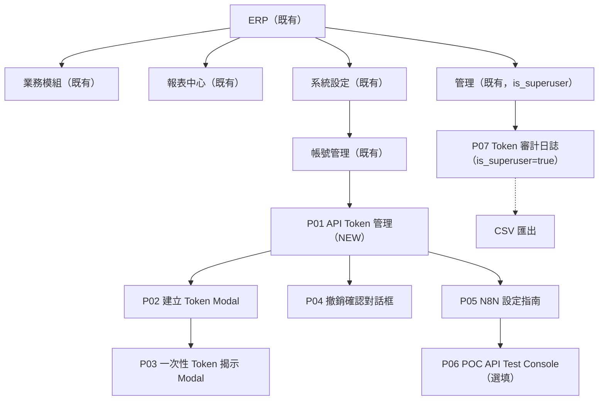

### 3.2 導覽結構

| 層級 | 導覽方式 | 入口位置 |
|------|---------|---------|
| 主導覽 | 沿用既有 ERP Top Nav / Side Nav（不另建）| ERP 框架 |
| 次導覽 | 「系統設定 > 帳號管理 > API Token 管理」（一般使用者）| 側欄 |
| 管理導覽 | 「管理 > Token 審計日誌」（`is_superuser=true` 才顯示）| 側欄條件渲染 |
| 情境導覽 | P03 Modal 內「查看 N8N 設定說明」一鍵跳 P05；P01 空狀態雙 CTA「建立 Token」+「N8N 指南」 | 頁面內 |

### 3.3 內容優先順序（F-Pattern / Z-Pattern）

| 頁面 | 最重要（First Fixation） | 次要 | 輔助 |
|------|------------------------|------|------|
| P01 列表 | 右上角「建立 Token」CTA + 列表第一筆狀態 Badge | 描述、最後使用時間 | 前綴、建立時間 |
| P02 建立表單 | 描述輸入欄（自動 focus）| 字元計數 + helper text | placeholder 範例 |
| P03 一次性 Modal | 警告橫幅 + Token 明文區 + 複製按鈕 | 「確認已複製」核取框 | 「N8N 設定說明」次要連結 |
| P04 撤銷對話框 | 警告圖示 + Token 描述（讓使用者再確認）| 「將立即 401」說明文字 | Token 前綴、建立時間 |
| P07 審計日誌 | 篩選器（時間範圍 + 操作類型）| 表格主體 | CSV 匯出按鈕 |

---

## 4. User Flows

### 4.1 主流程：N8N 整合首次端對端（Happy Path）

對應 PRD US-AUTH-001 + US-N8N-001 + US-DEMO-001。

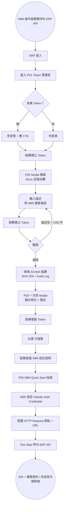

**任務完成時間目標：** ≤ 30 分鐘（PRD §5.5 AC-1）；其中 ERP 內 ≤ 5 分鐘（PRD §5.1）。

### 4.2 替代流程：IT Admin 月稽核（US-AUDIT-001）

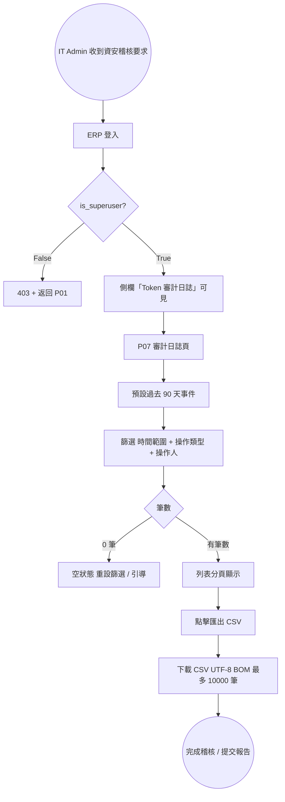

### 4.3 錯誤流程：N8N 收到 401（Token 已撤銷）

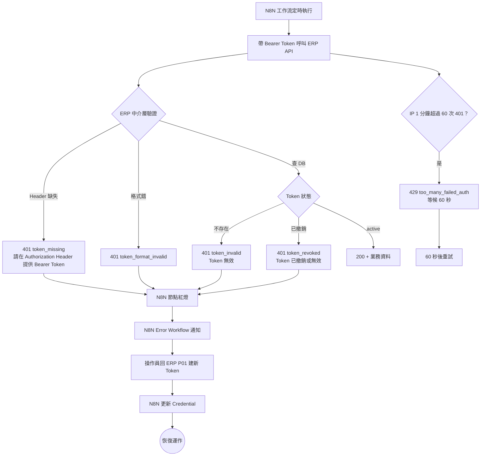

### 4.4 狀態機：Token Lifecycle

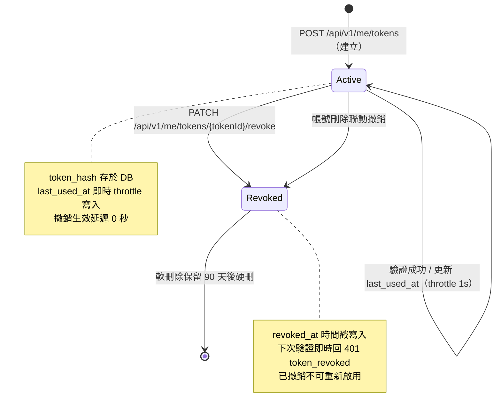

---

## 5. Screen Specifications

### 5.1 P01：Token 管理主頁（列表）

**用途：** 自助管理個人 Token；對應 PRD US-AUTH-002（列表）+ US-AUTH-003（撤銷入口）。

**進入方式：** ERP 側欄「系統設定 > 帳號管理 > API Token 管理」；URL `/settings/api-tokens`。

**Layout 結構：**
```
┌──────────────────────────────────────────────────────────────────┐
│ ERP Top Nav                                          [使用者頭像]│
├──────────┬───────────────────────────────────────────────────────┤
│ ERP Side │ Header：API Token 管理                                 │
│ Nav      │ Subtitle：管理您的 API Token，用於 N8N 工作流整合      │
│          │                              [+ 建立 Token]（Primary）│
│          ├───────────────────────────────────────────────────────┤
│          │ Filter Bar：[全部 | 僅顯示有效] | 搜尋描述關鍵字…       │
│          ├───────────────────────────────────────────────────────┤
│          │ Table Header：描述 | 前綴 | 建立時間 | 最後使用 | 狀態 | 操作│
│          │  Row 1：N8N 銷售報表  | tk_a3f9... | 2026-05-08 10:00 | 2026-05-08 14:30 | ●Active | [撤銷]│
│          │  Row 2：庫存監控      | tk_b7c2... | 2026-04-28 09:00 | 從未使用       | ●Active | [撤銷]│
│          │  Row 3：舊版訂單      | tk_d1e4... | 2026-03-15 16:00 | 2026-04-10 08:15 | ○Revoked | —    │
│          ├───────────────────────────────────────────────────────┤
│          │ 顯示 1-3 筆，共 3 筆                       [< 1 / 1 >]│
└──────────┴───────────────────────────────────────────────────────┘
```

**元件清單：**

| 元件 | 類型 | 狀態 | 說明 |
|------|------|------|------|
| `CreateTokenButton` | Button / Primary | Default / Hover / Focus / Active / Disabled / Loading | 開啟 P02 Modal；達 50 個有效 Token 時 Disabled + Tooltip |
| `TokenStatusFilter` | SegmentedControl | Default / Selected | 切換「全部 / 僅有效」，URL Query 同步 `?status=active` |
| `SearchInput` | Input / Text | Empty / Focused / Filled / Disabled | 描述關鍵字過濾，debounce 300ms |
| `TokenListTable` | Table | Empty / Loading（Skeleton）/ Loaded / Error | desktop 完整欄位；< 768px 改卡片式 |
| `RevokeButton` | Button / Danger | Default / Hover / Focus / Disabled / Loading | 點擊開啟 P04；Revoked 列不顯示 |
| `TokenStatusBadge` | Badge | Active（綠）/ Revoked（灰）| 含 `aria-label` |
| `Pagination` | Nav | Default / Disabled | 50 筆內不顯示，超過分頁（每頁 20 筆）|

**互動規格：**

| 觸發 | 動作 | 動畫 / 效果 | 持續時間 |
|------|------|-----------|---------|
| 點擊 [+ 建立 Token] | 開啟 P02 Modal | Fade + Scale 0.95→1.0 | 300ms（cubic-bezier(0.4, 0, 0.2, 1)）|
| 點擊行末 [撤銷] | 開啟 P04 對話框 | Fade + Scale | 250ms |
| 鼠標 hover Token 行 | 行底 1px primary 強調線 | Background tint | 150ms |
| 切換 Filter | URL 同步 + 列表 fade-in | Opacity 0→1 | 200ms |
| 搜尋 input 500ms 無輸入 | 觸發查詢 | Skeleton 替換 | 取決於 API |

### 5.2 P02：建立 Token Modal（Form）

**用途：** PRD US-AUTH-001 — 表單填寫 + 提交。

**Layout 結構：**
```
┌────────────────────────────────────────────┐
│ ◉ 建立 API Token                       [X] │
├────────────────────────────────────────────┤
│ Token 描述（必填）*                         │
│ ┌────────────────────────────────────────┐ │
│ │ N8N 銷售報表工作流                       │ │
│ └────────────────────────────────────────┘ │
│ helper：說明此 Token 的用途，方便日後識別   │
│                                  18 / 100  │
│                                            │
│ ⓘ 建議每個 N8N 工作流使用獨立 Token，便於 │
│ 個別撤銷管理。                             │
│                                            │
│              [取消]   [建立 Token]（主）   │
└────────────────────────────────────────────┘
```

**元件清單：**

| 元件 | 類型 | 狀態 | 說明 |
|------|------|------|------|
| `DescriptionInput` | Input / Text | Empty / Focused / Filled / Error / Disabled | maxLength=100；空值或 >100 字觸發 Inline Error |
| `CharCounter` | Helper | Default / Warning（>90）/ Error（>100）| 即時計數，超過 100 變紅 |
| `CancelButton` | Button / Secondary | Default / Hover / Focus | 關閉 Modal；Esc 等效 |
| `SubmitButton` | Button / Primary | Default / Hover / Focus / Active / Disabled / Loading | 描述空時 Disabled；提交中 Loading + spinner |

**互動規格：**

| 觸發 | 動作 | 動畫 | 持續時間 |
|------|------|------|---------|
| Modal 開啟 | focus 至描述欄 | Fade + Scale 0.95→1.0 | 300ms |
| 描述輸入 | 即時字元計數 | counter 顏色漸變 | 150ms |
| 提交按鈕 click | 立即 disable + spinner | Spin loop | 直到 API 完成 |
| 提交成功 | P02 收起、P03 開啟 | 連續 Fade transition | 共 500ms |
| Esc 鍵 | 關閉 Modal（同 Cancel）| Fade out | 200ms |

### 5.3 P03：一次性 Token 揭示 Modal（Reveal）

**用途：** PRD US-AUTH-001 AC-1 + AC-4 + AC-6 — 明文僅顯示一次。

**Layout 結構：**
```
┌──────────────────────────────────────────────────┐
│ ✓ Token 建立成功                              [X]│
├──────────────────────────────────────────────────┤
│ ⚠ 請立即複製此 Token                              │
│   Token 明文僅顯示一次，關閉後將無法再取得。      │
├──────────────────────────────────────────────────┤
│ 您的 API Token：                                  │
│ ┌──────────────────────────────────────────────┐ │
│ │ tk_a3f9b1c2d4e5f6g7h8i9j0...（等寬可選取）    │ │
│ └──────────────────────────────────────────────┘ │
│              [ 複製 Token ]（點擊後 ✓ 已複製！）  │
│                                                   │
│ ☐ 我已複製並妥善保存此 Token                      │
│                                                   │
│        [ 查看 N8N 設定說明 ]    [ 關閉（disabled 直到勾選）]│
└──────────────────────────────────────────────────┘
```

**元件清單：**

| 元件 | 類型 | 狀態 | 說明 |
|------|------|------|------|
| `WarningBanner` | Banner / Warning | Default | 橘黃底；`role="alert"` |
| `TokenRevealText` | Code / Mono | Default / Selected | `aria-label="API Token 明文，請立即複製"` |
| `CopyButton` | Button / Primary | Default / Copied（3s）/ Failed | `navigator.clipboard.writeText`；失敗顯示降級提示 |
| `CopyConfirmCheckbox` | Checkbox | Unchecked / Checked / Focus | 勾選後 Close 才可用 |
| `N8NGuideButton` | Button / Secondary | Default / Hover / Focus | 跳至 P05 N8N 指南頁 |
| `CloseButton` | Button | Default / Disabled / Hover / Focus | 未勾選時 Disabled，且 X 點擊顯示退出警告 |

**互動規格：**

| 觸發 | 動作 | 動畫 / 效果 | 持續時間 |
|------|------|-----------|---------|
| Modal 開啟 | `aria-live="assertive"` 播報「重要提示：此 Token 僅顯示一次，請立即複製」 | Fade + Scale | 300ms |
| 點擊 [複製 Token] | Clipboard API + 按鈕變「✓ 已複製！」 + `aria-live="polite"` 通知 | 顏色漸變 + Checkmark draw-on | 200ms（→ 3s 後復原）|
| 勾選 [我已複製] | Close 按鈕從 Disabled → Active | Cursor 變 pointer | 即時 |
| 點擊 [X] / Esc / 點擊遮罩（未勾選）| 顯示退出警告：「您確定要離開嗎？此 Token 明文將無法再次取得」| 二級對話框 fade-in | 200ms |
| 點擊 [關閉] | Modal 收起 + 列表新增該 Token | Fade out + 列表新行 highlight 1.5s | 共 500ms |

### 5.4 P04：撤銷確認對話框

**用途：** PRD US-AUTH-003 AC-1 — 二次確認，避免誤撤銷。

**Layout 結構：**
```
┌────────────────────────────────────────────┐
│ ⚠ 確認撤銷 Token                       [X]│
├────────────────────────────────────────────┤
│ 您即將撤銷以下 Token：                      │
│   描述：N8N 銷售報表工作流                  │
│   前綴：tk_a3f9...                          │
│   建立於：2026-05-08 10:00                  │
│                                            │
│ 撤銷後，使用此 Token 的工作流將立即失效。   │
│ 此操作無法復原。                           │
│                                            │
│            [取消]   [確認撤銷]（Danger）   │
└────────────────────────────────────────────┘
```

**元件清單：**

| 元件 | 類型 | 狀態 | 說明 |
|------|------|------|------|
| `WarningIcon` | Icon | Default | `aria-hidden="true"`（裝飾性）|
| `TokenInfoBlock` | Definition List | Default | 描述、前綴、建立時間，協助確認 |
| `CancelButton` | Button / Secondary | Default / Hover / Focus | 預設 focus（避免誤點 Danger）|
| `ConfirmRevokeButton` | Button / Danger | Default / Hover / Focus / Active / Loading | 點擊 → Loading → API 200 → 關閉 + Toast |

**互動規格：**

| 觸發 | 動作 | 動畫 | 持續時間 |
|------|------|------|---------|
| 對話框開啟 | focus → [取消]；`role="alertdialog"` | Fade + Scale | 250ms |
| 點擊 [確認撤銷] | 按鈕 Loading + spinner | Spin loop | 直到 API 完成 |
| API 200 | 對話框關閉 + Toast「Token 已成功撤銷」 + 列表狀態 Badge 變 Revoked | Fade out + Toast slide-in from right | 共 600ms |
| Esc | 等同取消 | Fade out | 200ms |
| 遮罩點擊 | 禁止關閉（防誤觸破壞性操作）| 遮罩抖動 200ms 提示 | 200ms |

### 5.5 P05：N8N Quick Start 指南頁

**用途：** PRD US-N8N-001 AC-2/AC-4 — 5 張截圖 + JSON 範本指引。

**Layout 結構（垂直步驟 Wizard）：**
```
┌──────────────────────────────────────────────────────────────┐
│ 📚 N8N 整合 Quick Start （3 步驟，預計 30 分鐘）              │
├──────────────────────────────────────────────────────────────┤
│ Step 1：在 ERP 建立 Token                                     │
│ ─────────────────────────────────────                          │
│ [截圖 1：ERP Token 管理頁]                                     │
│ [截圖 2：建立成功 Modal]                                       │
│  → [前往建立 Token] 按鈕                                       │
├──────────────────────────────────────────────────────────────┤
│ Step 2：在 N8N 設定 Header Auth Credential                     │
│ ─────────────────────────────────────                          │
│ [截圖 3：N8N HTTP Request 節點]                                │
│ [截圖 4：Authentication 下拉]                                  │
│ Name: Authorization                                             │
│ Value: Bearer <貼上 ERP Token 明文>                            │
├──────────────────────────────────────────────────────────────┤
│ Step 3：呼叫示範 API                                          │
│ ─────────────────────────────────────                          │
│ [截圖 5：成功 Response 200]                                    │
│ • GET /api/v1/demo/sales?from=YYYY-MM-DD&to=YYYY-MM-DD         │
│ • GET /api/v1/demo/inventory?sku=SKU-001                       │
│ • GET /api/v1/demo/orders/{orderId}                            │
│  → [下載 N8N JSON 範本]                                        │
├──────────────────────────────────────────────────────────────┤
│ 🆘 常見問題                                                    │
│ Q：HTTP 401 token_revoked → 回 ERP P01 建立新 Token             │
│ Q：HTTP 401 token_missing → 確認 N8N Authentication 已啟用      │
│ Q：HTTP 429 → 同 IP 1 分鐘內 401 超過 60 次，等候 60 秒          │
└──────────────────────────────────────────────────────────────┘
```

**元件清單：**

| 元件 | 類型 | 狀態 | 說明 |
|------|------|------|------|
| `StepCard` | Card | Default / Active（當前步驟）| 3 張卡，視覺等寬 |
| `Screenshot` | Img | Loading / Loaded / Error | `loading="lazy"` + `alt` 描述 |
| `JsonTemplateDownload` | Button | Default / Hover / Focus | 下載 .json 範本（`Content-Disposition: attachment`）|
| `FAQAccordion` | Accordion | Collapsed / Expanded | `aria-expanded`，鍵盤可操作 |

**互動規格：**

| 觸發 | 動作 | 動畫 / 效果 | 持續時間 |
|------|------|-----------|---------|
| 頁面載入 | 截圖 lazy load + Step 1 卡片 active | Fade-in opacity 0→1 | 400ms（cubic-bezier(0.16, 1, 0.3, 1)）|
| 點擊 [前往建立 Token] | 路由跳 P01 + 自動觸發 P02 開啟 | Page route fade | 300ms |
| 點擊 FAQ Accordion | 高度 0→auto + 內容 fade-in | 高度 transition + opacity | 200ms（cubic-bezier(0.4, 0, 0.2, 1)）|
| 再次點擊已展開 FAQ | 高度 auto→0 + 內容 fade-out | 高度 transition + opacity | 200ms |
| 點擊 [下載 N8N JSON 範本] | 觸發瀏覽器下載 + 按鈕短暫 Loading | Spinner（icon 16×16）| 直到下載開始 |
| 截圖 hover（≥ 768px）| 顯示 lightbox 圖示 cursor-zoom-in | Cursor + 1px focus ring | 150ms |
| 截圖點擊 | 開啟 Lightbox（全螢幕大圖 + Esc 關閉） | Fade + Scale 0.95→1.0 | 300ms |

### 5.6 P06：POC API Test Console（選填）

**用途：** PRD US-DEMO-001/002/003 — 在 ERP 站內快速測試示範 API。

**Layout 結構：**
```
┌──────────────────────────────────────────────────────────────┐
│ 🧪 POC API Test Console                                       │
├──────────────────────────────────────────────────────────────┤
│ Bearer Token：[貼上您的 ERP API Token...]（masked input）     │
├──────────────────────────────────────────────────────────────┤
│ 端點：[ /api/v1/demo/sales  ▼ ]                               │
│ 參數：from [2026-04-01] to [2026-04-30]                      │
│        [送出請求]                                              │
├──────────────────────────────────────────────────────────────┤
│ 回應：                                                         │
│ HTTP 200 OK / 451 ms                                           │
│ ┌──────────────────────────────────────────────────────────┐ │
│ │ {                                                        │ │
│ │   "period": {"from":"2026-04-01","to":"2026-04-30"},     │ │
│ │   "total_revenue": 123456.78,                            │ │
│ │   "order_count": 42                                      │ │
│ │ }                                                        │ │
│ └──────────────────────────────────────────────────────────┘ │
└──────────────────────────────────────────────────────────────┘
```

**元件清單：**

| 元件 | 類型 | 狀態 | 說明 |
|------|------|------|------|
| `TokenInputMasked` | Input / Password | Empty / Filled / Focus | 預設遮罩；toggle 顯示 |
| `EndpointSelect` | Select | Default / Open / Disabled | 三個示範端點 |
| `ParamFields` | Input/Date | 動態渲染 | 依端點切換欄位 |
| `SubmitRequestButton` | Button / Primary | Default / Loading | spinner during call |
| `ResponseViewer` | Code / JSON | Empty / Loading / Loaded / Error | `react-json-view`-like，可折疊 |

**互動規格：**

| 觸發 | 動作 | 動畫 / 效果 | 持續時間 |
|------|------|-----------|---------|
| 頁面載入 | Bearer 欄位自動 focus | Fade-in opacity 0→1 | 300ms |
| Endpoint 切換 | 動態渲染 ParamFields（依 schema）| 表單欄位 fade-in（stagger 50ms）| 250ms |
| 點擊 [送出請求] | 按鈕 Loading + spinner + 禁用其他輸入 | Spin loop | 直到 API 完成（≤ 5000ms 逾時）|
| API 回應 200 | ResponseViewer 顯示 JSON + HTTP status badge 綠 | Fade-in 200ms + JSON 折疊樹展開 | 200ms |
| API 回應 4xx/5xx | ResponseViewer 顯示錯誤 body + status badge 紅 + Inline 重試提示 | Shake animation + Fade-in | 200ms（shake）+ 200ms（fade）|
| 點擊 ResponseViewer JSON 節點 | 折疊 / 展開該節點 | 高度 transition | 150ms |
| API 逾時（> 5000ms）| 顯示 408 timeout 訊息 + 重試按鈕 | Fade-in + Shake | 200ms |
| Bearer 欄 toggle 顯示 | 切換 input type password ↔ text | 圖示 cross-fade | 150ms |

### 5.7 P07：Token 審計日誌頁（IT Admin only）

**用途：** PRD US-AUDIT-001 — 過去 90 天事件 + CSV 匯出。

**Layout 結構：**
```
┌──────────────────────────────────────────────────────────────┐
│ 🛡 Token 審計日誌（IT Admin）                  [⬇ 匯出 CSV]  │
├──────────────────────────────────────────────────────────────┤
│ 篩選：時間範圍 [最近 7 天 ▼] | 動作 [全部 ▼] | 操作人 [全部 ▼]│
│                                          [套用]   [重設]    │
├──────────────────────────────────────────────────────────────┤
│ 時間（UTC+8）       | 動作   | 操作人          | Token 前綴  | IP            │
│ 2026-05-08 10:23:01 | 建立   | mike.chen       | tk_a3f9...  | 192.168.1.10  │
│ 2026-05-08 09:15:44 | 撤銷   | itadmin         | tk_b7c2...  | 192.168.1.5   │
│ 2026-05-07 18:02:33 | 建立   | alice.ho        | tk_d1e4...  | 192.168.1.20  │
├──────────────────────────────────────────────────────────────┤
│ 顯示 1-100 筆 / 共 1,243 筆           [< 1 / 13 >]            │
│ 此日誌為唯讀（Append-only）；DB 角色禁止 UPDATE/DELETE        │
└──────────────────────────────────────────────────────────────┘
```

**元件清單：**

| 元件 | 類型 | 狀態 | 說明 |
|------|------|------|------|
| `DateRangeFilter` | Select / DatePicker | Default / Open | 預設「最近 7 天」；可切「30 天」/「90 天」/ 自訂 |
| `ActionFilter` | Select | Default / Open | `create` / `revoke` / 全部 |
| `OperatorFilter` | Select | Default / Open | 一般使用者下拉清單（含搜尋）|
| `AuditLogTable` | Table | Loading / Empty / Loaded / Error | 100 筆 / 頁 |
| `ActionBadge` | Badge | Create（藍）/ Revoke（紅）| 顏色 + 文字雙語意 |
| `CsvExportButton` | Button / Secondary | Default / Loading（匯出中）| streaming，最多 10000 筆 |
| `ReadOnlyNotice` | Note | Default | 強調日誌不可改 / 不可刪 |

**互動規格：**

| 觸發 | 動作 | 動畫 | 持續時間 |
|------|------|------|---------|
| 套用篩選 | 重新查詢 + Skeleton 替換 + `aria-live` 播報「已更新，共 N 筆」 | Skeleton fade | 200ms |
| 點擊 [匯出 CSV] | 按鈕 Loading + 後端 streaming 寫檔 | Spin loop | 直到下載觸發 |
| 一般使用者 URL 直連 | RBAC 守衛 → 403 頁 | Fade route | 300ms |

---

## 6. Interaction Design Specifications

### 6.1 動畫與過場（Motion Design）

| 動畫類型 | 使用時機 | 規格 | 緩動函數 |
|---------|---------|------|---------|
| 頁面進入 | P01 / P05 / P07 載入 | Fade Opacity 0→1 | ease-out（300ms）|
| Modal 開啟（P02 / P03 / P04）| 彈出對話框 | Scale 0.95→1.0 + Fade | cubic-bezier(0.16, 1, 0.3, 1)（300ms）|
| Modal 關閉 | 收起 | Scale 1.0→0.95 + Fade | cubic-bezier(0.55, 0, 1, 0.45)（200ms）|
| Toast Slide-in | 撤銷成功、複製成功 | Slide-in from right + Fade | ease-out（200ms）；停留 3s 後 Fade Out |
| 載入中 | 列表初次載入 | Skeleton Screen Shimmer | linear loop（1.5s）|
| 列表新行 | 建立 Token 成功後 | 新行背景 highlight 黃→白 | ease-out（1500ms）|
| 撤銷後狀態切換 | Active→Revoked | Badge 顏色 + 文字 cross-fade | ease-in-out（200ms）|

**原則：**
- 功能性動畫 ≤ 300ms
- 裝飾性動畫 ≤ 500ms
- 尊重 `prefers-reduced-motion` 設定

### 6.1.1 Motion Design Specification（必填）

| 動畫用途 | Easing Function | Duration | prefers-reduced-motion 替代 |
|---------|:---------------:|:--------:|---------------------------|
| 頁面進場 / P05 大區塊出現 | `cubic-bezier(0.16, 1, 0.3, 1)` (Expo Out) | 400ms | `opacity 0→1, 200ms linear` |
| Modal 出現（P02/P03/P04）| `cubic-bezier(0.16, 1, 0.3, 1)` | 300ms | `opacity 0→1, 150ms linear` |
| Modal 退場 | `cubic-bezier(0.55, 0, 1, 0.45)` (Expo In) | 200ms | `opacity 1→0, 150ms linear` |
| 互動反饋（按鈕按壓）| `cubic-bezier(0.4, 0, 0.6, 1)` (Standard) | 100ms | 無動畫（直接切換）|
| 路由切換 | `cubic-bezier(0.4, 0, 0.2, 1)` (Material Standard) | 300ms | `opacity 0→1, 150ms linear` |
| Skeleton Shimmer | `linear`（loop）| 1.5s | 靜態 Skeleton（無動態）|
| Accordion 展開 / 收合（P05 FAQ）| `cubic-bezier(0.4, 0, 0.2, 1)` | 200ms | 直接顯示 / 隱藏 |
| 撤銷後 Badge cross-fade | `ease-in-out` | 200ms | 直接切換 |
| Toast slide-in / out | `cubic-bezier(0.16, 1, 0.3, 1)` / Expo In | 200ms / 200ms | Fade only |

**prefers-reduced-motion 全域 CSS：**
```css
@media (prefers-reduced-motion: reduce) {
  *,
  *::before,
  *::after {
    animation-duration: 0.01ms !important;
    animation-iteration-count: 1 !important;
    transition-duration: 0.01ms !important;
    scroll-behavior: auto !important;
  }
}
```

**規則：**
- 所有 `animation` / `transition` 必須有 `prefers-reduced-motion` 對應
- Loading Skeleton Shimmer 在 reduced-motion 改為靜態
- 列表新行 highlight 在 reduced-motion 替換為 1.5s 顏色保留再瞬間消失

#### 動畫清單（Feature × Animation Matrix）

| 元件 / 畫面 | 進場動畫 | 退場動畫 | 互動動畫 | Reduced Motion |
|------|---------|---------|---------|---------------|
| P02 Modal | Fade + Scale 95%→100% | Fade + Scale 100%→95% | — | Fade only |
| P03 Modal | Fade + Scale + 警告 banner pulse 1 次 | Fade + Scale | Copy 按鈕 Checkmark draw-on | Fade only，無 pulse |
| P04 Dialog | Fade + Scale | Fade out | Confirm 按鈕 Loading spin | Fade only |
| Toast | Slide-in from right | Slide-out to right | — | Fade only |
| Button | — | — | Scale 0.97 on press | 無 |
| 列表新行 highlight | — | 顏色漸退 | — | 顏色保留 1.5s 後瞬切 |
| Skeleton Shimmer | linear loop | — | — | 靜態 Skeleton |

### 6.2 回饋機制（Feedback）

| 操作 | 即時回饋（0–100ms） | 短期回饋（100ms–1s） | 長期回饋（> 1s） |
|------|-------------------|--------------------|--------------|
| 按鈕點擊 | Press State（scale 0.97 + 顏色加深）| — | — |
| 表單提交（P02）| 按鈕 Loading + Disabled | Success → P03 開啟 / Error Inline | API > 5000ms → Toast「建立逾時，請重試」+ 408 |
| 撤銷（P04）| 確認按鈕 Loading | Toast「已成功撤銷」+ Badge 切換 | — |
| 列表載入 | Skeleton Screen | Skeleton fade-out + 真實 row fade-in | API > 5s → Inline Error + 重試 |
| CSV 匯出（P07）| 按鈕 Loading + 「匯出中…」label | streaming 寫檔（大量資料）| Browser 下載開始 |
| 複製 Token | 按鈕 Press State | 「✓ 已複製！」綠色（3s）+ `aria-live` 播報 | — |

### 6.3 空狀態設計（Empty States）

| 情境 | 說明文字 | 圖示 | CTA |
|------|---------|------|-----|
| P01 首次使用（無 Token）| 「尚無 API Token。建立第一個 Token，開始在 N8N 工作流中安全呼叫 ERP API，不需要等待 IT 配置。」 | Token / Key 圖示 | [建立第一個 Token]（主）+ [查看 N8N 設定指南 ↗]（次）|
| P01 搜尋無結果 | 「找不到「{query}」相關的 Token」 | 搜尋圖示 | [清除篩選] |
| P07 過去 90 天無事件 | 「目前沒有任何 API Token 操作記錄。Token 建立、撤銷或 API 呼叫操作將會自動記錄於此。」 | Clipboard 圖示 | [前往建立第一個 Token] |
| P07 篩選後無結果 | 「目前沒有符合篩選條件的操作記錄。建議調整時間範圍或操作類型篩選器。」 | 放大鏡圖示 | [重設篩選條件] |
| 網路離線（P01 / P07）| 「目前無法連線，顯示上次的資料」 | 離線圖示 | [重新連線] |
| API 5xx 錯誤狀態 | 「發生錯誤，請稍後再試」 | 錯誤圖示 | [重試] |

### 6.4 Loading States

| 情境 | 策略 | 規格 |
|------|------|------|
| P01 / P07 頁面初次載入 | Skeleton Screen | 表格列骨架（10 行 × 6 欄）匹配真實 row 高度，避免 CLS > 0.1 |
| P02 提交建立 Token | Button Loading | 文字「建立中…」+ Spinner（16×16），Modal 內其他元件 Disabled |
| P04 撤銷確認 | Button Loading | 「撤銷中…」+ Spinner |
| P07 CSV 匯出 | Button Loading | 「匯出中（已寫入 N 筆）…」progress text |
| P06 API 呼叫 | Code block 顯示「Loading...」骨架 | 失敗 5s 顯示 timeout error |

**Modal 內統一規則：** Loading 期間 X 按鈕、Esc、遮罩點擊均無效，避免中斷 in-flight request。

### 6.5 Micro-interaction Catalog（必填，且最低覆蓋達標）

> 最低覆蓋：表單互動 ≥ 3、導覽互動 ≥ 2、資料回饋 ≥ 2，本表 14 項。

| 觸發器（Trigger）| 規則（Rules）| 回饋（Feedback）| 迴圈 / 模式（Loop）|
|----------------|------------|----------------|-------------------|
| 按鈕點擊 | 僅在可點擊狀態觸發 | Scale 0.97 + 背景色加深 10% | 放開後 150ms 恢復 |
| **[表單]** P02 描述輸入 → 即時字元計數 | 每次 keypress 重算 | 計數文字 18 / 100；> 90 變黃；> 100 變紅 | 隨輸入即時更新 |
| **[表單]** P02 提交成功 | 通過驗證 + API 201 | 按鈕 Loading → Modal Cross-fade 至 P03 | P03 開啟即結束 |
| **[表單]** P02 提交失敗（描述空 / >100 / 達 50 個 Token 上限）| 驗證未通過 / API 422 | Inline 紅色錯誤 + 欄位 Shake（200ms 左右各 4px）| 用戶修正後恢復 |
| **[導覽]** Top Nav hover Token 管理 | Pointer enter | 底線 1px primary fade-in | Pointer leave 後 fade-out |
| **[導覽]** Side Nav active item | 路由匹配 | 左側 3px primary 直立條 + 背景 tint | 路由切換時更新 |
| **[資料回饋]** 列表 Skeleton → Loaded | API 回傳 | Skeleton fade-out + Real row fade-in | 一次性 |
| **[資料回饋]** 撤銷成功 Badge 切換 | API 200 | Active 綠 → Revoked 灰 cross-fade | 一次性 |
| 複製 Token（P03）| 按鈕點擊 | Checkmark draw-on（200ms）+ 顏色變綠 + `aria-live` 通知 | 3s 後恢復「複製 Token」 |
| 撤銷確認（P04）| 點擊 [確認撤銷] | 按鈕 spinner + Cross-disabled | API 完成後 Toast slide-in |
| Toast 出現 | 撤銷成功 / CSV 匯出完成 / 複製成功 | Slide-in from right + Fade-in | 3s 後 Fade out |
| Token 列表新行 highlight | Token 建立後 P03 關閉 | 新行背景 #FEF9C3 → transparent | ease-out 1500ms |
| P07 篩選器套用 | 點擊 [套用] | Skeleton 替換 + `aria-live` 播報「已更新，共 N 筆」 | 一次性 |
| Accordion 展開 / 收合（P05 FAQ）| 點擊 trigger | 高度 0→auto + Fade content | 200ms |

### 6.6 Gesture & Touch Design

> 本產品 Web 桌面為主，Mobile / Tablet 為次。下表覆蓋 Tablet Web 與行動瀏覽器。

| 手勢類型 | 觸發條件 | 動作回應 | 視覺回饋 | 衝突處理 |
|---------|---------|---------|---------|---------|
| 單點（Tap）| 輕觸互動元件 | 主要互動（按鈕、列表 row 操作）| Press State（scale 0.97）| 優先於長按 |
| 長按（Long Press）| 持續 600ms（行動）| 顯示 Token 行 Context Menu（複製前綴、檢視詳情）| 行輕微放大 + Haptic（若支援）| 防誤觸：需穩定按壓 |
| 左滑（Swipe Left）| 行動端 Token Card 水平滑動 > 30px | 顯示「撤銷」操作按鈕 | Reveal 動畫（從右滑入）| 與頁面捲動方向相同時優先捲動 |
| 下拉（Pull to Refresh）| 從頂部下拉 > 60px | P01 / P07 重新載入 | 彈性拉伸 + Spinner | 到達閾值前可取消 |
| 雙點（Double Tap）| < 300ms 兩次點擊 Token 前綴 | 複製前綴到剪貼簿 | Scale 彈跳 + Toast | 避免與 Tap 衝突，延遲 300ms 判斷 |
| Pinch Zoom | 雙指縮放 | 禁用（避免破壞 Layout）| — | 在 `<meta viewport>` 設 `user-scalable=yes`（無障礙）|

**最小觸控目標：** 44×44px（iOS HIG / Material Design）；P01 行動端撤銷按鈕全寬 height 48px。

### 6.7 Haptic Feedback Design

> Web 不支援系統級 Haptic API（除部分行動瀏覽器透過 Vibration API），本產品 Web-only：**N/A（不依賴震動，視覺與音效回饋為主）**。

| 場景 | 震動類型 | 備注（Web 降級）|
|------|---------|----------------|
| 撤銷確認對話框開啟 | — | 無震動；以視覺警告 + `role="alertdialog"` 替代 |
| 複製成功 | — | 視覺 Checkmark + `aria-live` 播報替代 |
| 401 / 422 錯誤 | — | Inline 紅色錯誤 + Shake 動畫替代 |
| Token 數達上限 | — | 按鈕 Disabled + Tooltip 文字替代 |

> 若未來推出 PWA mobile 版本，將補充 Vibration API 對應規格。

---

## 7. Responsive & Adaptive Design

### 7.1 Breakpoints

| 名稱 | 寬度 | 目標裝置 | Layout |
|------|------|---------|--------|
| Mobile S | 320px | iPhone SE | 單欄，卡片式 Token 列表 |
| Mobile M | 375px | iPhone 14 | 單欄，卡片式 |
| Mobile L | 428px | iPhone 14 Plus | 單欄，卡片式 |
| Tablet | 768px | iPad | 簡化 Table（隱藏「最後使用時間」） |
| Desktop S | 1024px | Laptop | 完整 Table，常駐 Side Nav |
| Desktop L | 1440px | Desktop | 完整 Table + 寬容器 max-width 1280px |
| Desktop XL | 1920px+ | 大螢幕 | Container max-width 1440px 居中 |

### 7.2 Breakpoint 元件行為矩陣（必填，全具體值）

| 元件 | 320px | 375px | 768px | 1024px | 1440px |
|-----|-------|-------|-------|--------|--------|
| Top Nav | 漢堡 Menu（icon 44×44px），點擊 Full-screen Overlay | 同左 | 橫排 Tab Bar height 56px，顯示 4 個 Tab | 橫排 Top Nav + 右側 Utility Links | 橫排 Top Nav + Dropdown（hover 展開）|
| Side Nav | 抽屜（drawer），預設關閉 | 同左 | 抽屜（drawer），預設關閉 | Fixed Side Nav width 240px | Fixed Side Nav width 240px |
| P01 Token 列表 | TokenCard 卡片式，width 100%，padding 16px | 同左 | 簡化 Table（隱藏 last_used_at），padding 24px | 完整 Table（6 欄），gap 24px | 完整 Table，max-width 1280px 居中 |
| TokenCard（Mobile）| 描述（H3）、前綴（mono）、Badge、CTA「撤銷」全寬 height 48px | 同左 | — | — | — |
| CTA Button [+ 建立 Token] | width 100%，height 48px，sticky bottom | 同左 | width auto，min-width 200px | 同左 | 同左 |
| P02 Modal | width 100vw，height 100vh，Full-screen | 同左 | width 480px，max-height 80vh，置中 | width 480px | width 480px |
| P03 Modal | width 100vw，height 100vh，Full-screen | 同左 | width 560px，max-height 80vh，置中 | width 560px | width 560px |
| P04 Dialog | width 100vw（Bottom Sheet）| 同左 | width 440px，置中 | width 440px | width 440px |
| Form（P02 描述欄位）| 單欄，label 在上方 | 同左 | 單欄（Modal 內）| 同左 | 同左 |
| P05 N8N 指南 | 步驟卡垂直堆疊，width 100% | 同左 | 步驟卡 2 欄 grid，gap 16px | 步驟卡 3 欄 grid，gap 24px | 同左，max-width 1024px 居中 |
| P06 Console | 垂直堆疊；Response code block 可橫向捲動 | 同左 | 雙欄 split：左控制 / 右回應 | 同左 | 同左 |
| P07 Audit Log Table | AuditLogCard 卡片式，篩選改 Bottom Sheet | 同左 | 簡化 Table（5 欄）+ 篩選 inline | 完整 Table（6 欄）+ 篩選 inline | 完整 Table + Sticky 表頭 |
| Filter Bar | Bottom Sheet（觸發按鈕 [篩選]）| 同左 | inline 1 列 3 個 Select，gap 16px | inline 1 列 3 個 Select，gap 24px | 同左 |
| Pagination | 底部固定（[< 1/N >]，touch target 44×44）| 同左 | inline 右下角 | 同左 | 同左 |

### 7.3 Grid 系統規格表（必填，明確聲明）

**統一聲明：本產品全 Layout 採 CSS Grid（`display: grid; grid-template-columns: repeat(N, 1fr); gap: Xpx`）；元件內細節對齊以 Flexbox 補強，不混用兩種系統於同一 Layout 層級。**

| 斷點 | 欄數 | Gutter | Margin（頁邊距）| Max-Width | Container CSS |
|-----|------|--------|----------------|---------|---------------|
| 320px | 4 | 8px | 16px | 100% | `display: grid; grid-template-columns: repeat(4, 1fr); gap: 8px; max-width: 100%; padding: 0 16px;` |
| 375px | 4 | 12px | 20px | 100% | `display: grid; grid-template-columns: repeat(4, 1fr); gap: 12px; max-width: 100%; padding: 0 20px;` |
| 768px | 8 | 16px | 24px | 100% | `display: grid; grid-template-columns: repeat(8, 1fr); gap: 16px; max-width: 100%; padding: 0 24px;` |
| 1024px | 12 | 24px | 32px | 1280px | `display: grid; grid-template-columns: repeat(12, 1fr); gap: 24px; max-width: 1280px; margin: 0 auto; padding: 0 32px;` |
| 1440px | 12 | 32px | 80px | 1440px | `display: grid; grid-template-columns: repeat(12, 1fr); gap: 32px; max-width: 1440px; margin: 0 auto; padding: 0 80px;` |

---

## 8. Accessibility (A11y) Specifications

### 8.1 視覺可及性

| 項目 | 規格 | 驗證工具 |
|------|------|---------|
| 色彩對比（正文）| ≥ 4.5:1（CONSTANTS `WCAG_TEXT_CONTRAST_RATIO_NORMAL`） | axe DevTools |
| 色彩對比（大字 18px+）| ≥ 3:1（CONSTANTS `WCAG_TEXT_CONTRAST_RATIO_LARGE`）| axe DevTools |
| 不能只靠顏色傳遞資訊 | Token Status Badge 含文字 + icon + 顏色 | 設計審查 |
| 最小點擊 / 觸控目標 | 44×44px | 設計審查 + CSS 量測 |
| 字體最小尺寸 | 14px（建議 16px+ 為內文）| 設計審查 |

### 8.2 鍵盤與螢幕閱讀器

| 項目 | 規格 |
|------|------|
| Tab 順序 | 符合視覺閱讀順序（左→右，上→下）；P01 從 [+ 建立] → SearchInput → 列表 → Pagination |
| Focus Indicator | 2px solid `--color-border-focus`（對比 ≥ 3:1）+ outline-offset 2px |
| 互動元件 | 按鈕用 `<button>`，連結用 `<a>`，不用 `<div onClick>` |
| 圖片 | 裝飾性圖示 `aria-hidden="true"`；P05 截圖必有 `alt` 描述（≤ 125 字）|
| 表單 | 每個 input 對應 `<label>`；錯誤訊息用 `aria-describedby` |
| Modal（P02/P03/P04）| 開啟時 focus 移入 Modal；關閉時 focus 回觸發按鈕；Tab 循環陷阱 |
| Token 揭示（P03）| `aria-live="assertive"` 警告 + `aria-live="polite"` 複製通知 |
| 撤銷對話框（P04）| `role="alertdialog"`、預設 focus 在「取消」（防誤觸） |
| 動畫 | 尊重 `prefers-reduced-motion` |
| Audit Log 篩選（P07）| 篩選後 `aria-live="polite"` 播報「已更新，共 N 筆」|

### 8.3 可及性測試計畫

| 測試類型 | 工具 | 時機 |
|---------|------|------|
| 自動掃描 | axe-core / Lighthouse Accessibility（目標 ≥ 95）| 每次 PR |
| 鍵盤導覽測試 | 手動（無滑鼠） | Sprint Review |
| 螢幕閱讀器 | NVDA（Windows）/ VoiceOver（macOS）| Release 前 |
| 色盲模擬 | Sim Daltonism / Chrome DevTools Vision Deficiencies | 設計審查 |
| 200% 縮放 | 瀏覽器原生縮放 | Release 前 |

### 8.4 WCAG 2.1 AA Compliance Matrix（必填 12 準則）

> 本產品無障礙設計目標：MVP 達 WCAG 2.1 Level A 強制；Pilot 達 Level AA 全 12 準則。

| WCAG 準則 | 評等 | 要求內容 | 實作方式 | 測試方法 | 優先 |
|----------|:---:|---------|---------|---------|:---:|
| 1.1.1 非文字內容 | AA | 所有圖示／截圖有 alt 或 aria-label | P05 截圖 `alt` 描述步驟；裝飾圖示 `aria-hidden="true"` | axe-core | M |
| 1.3.1 資訊與關係 | AA | 語意化 HTML，heading 層次正確 | P01 `<h1>API Token 管理</h1>` → P05 `<h2>Step 1...</h2>` 不跳層 | NVDA/VoiceOver | M |
| 1.4.3 對比度（文字）| AA | 正文 ≥ 4.5:1，大字 ≥ 3:1 | OKLCH Token 表（§9.4）+ Colour Contrast Analyser 驗證 | axe DevTools | M |
| 1.4.11 對比度（UI 元件）| AA | 按鈕邊框、輸入框邊框 ≥ 3:1 | `--color-border-default` Token + 手動量測 | 手動測試 | M |
| 2.1.1 鍵盤操作 | AA | 所有功能可純鍵盤完成（建立、撤銷、複製、匯出） | Tab 順序 + Enter/Space 觸發 + Esc 關閉 Modal | 手動（無滑鼠）| M |
| 2.4.3 焦點順序 | AA | Tab 順序符合視覺流程 | DOM 順序與視覺一致；Modal 開啟 focus 移入第一可互動元素 | 手動 | M |
| 2.4.7 焦點可見 | AA | Focus ring ≥ 2px，對比 ≥ 3:1 | `--color-border-focus` 2px outline + 2px offset | 手動 | M |
| 3.1.1 頁面語言 | AA | `<html lang="zh-Hant">`；切換英文時更新 | 路由切換動態更新 lang | NVDA | M |
| 3.3.1 錯誤識別 | AA | 錯誤訊息明確說明問題 | P02 描述空 → 「Token 描述為必填，請輸入此 Token 的用途」+ `aria-describedby` | NVDA | M |
| 3.3.2 標籤或說明 | AA | 表單欄位有明確標籤 | `<label for="token-description">Token 描述（必填）</label>` | axe-core | M |
| 4.1.2 名稱、角色、值 | AA | 自訂元件有 ARIA role/state | TokenStatusBadge `aria-label="Token 狀態：Active"`；CopyButton 完成後 `aria-live` | axe-core + NVDA | M |
| 1.4.10 Reflow（建議）| AA | 320px 視窗無水平捲動（除 Token 明文 / JSON Viewer 例外）| Mobile 卡片式 + 可橫向捲動容器 | Browser DevTools | R |

**測試工具清單：**
- 自動化：axe-core（CI）、Lighthouse Accessibility ≥ 95、Pa11y CI
- 輔助技術：NVDA（Windows）、VoiceOver（macOS）、TalkBack（Android）
- 顏色：Colour Contrast Analyser、axe DevTools、Stark Figma plugin
- 人工：鍵盤 only 全程跑 P01→P02→P03→P04 + P07 匯出；200% 縮放

---

## 9. Design System Reference

### 9.1 使用的 Design System

**Design System：** 沿用既有 ERP UI 框架元件庫（OQ3 待確認 Razor Pages / Blazor / MVC）；本 PDD 補強的 Token 不覆蓋 ERP 既有 Token，僅在缺漏處新增。
**版本：** 跟隨 ERP 主版號
**文件：** ERP 內部 Design System Wiki（連結待 ERP 開發團隊提供）

### 9.2 本次新增 / 修改的元件

| 元件名稱 | 類型 | 狀態 | 說明 | 狀態數 |
|---------|------|------|------|--------|
| `TokenStatusBadge` | New | 新建 | Active / Revoked / Expired（v2.0）三態 | 3 |
| `TokenRevealModal`（P03）| New | 新建 | 一次性明文揭示，含警告、複製、確認核取框 | 5 |
| `ConfirmRevokeDialog`（P04）| New | 新建 | role=alertdialog，二次確認破壞性操作 | 4 |
| `CopyButton` | New | 新建 | 含 Clipboard API + aria-live 通知 + 失敗降級 | 4 |
| `AuditLogTable`（P07）| New | 新建 | 唯讀 Table + 篩選 + CSV streaming 匯出 | 4 |
| `EmptyState` | New | 新建 | 雙 CTA（主：建立，次：N8N 指南）| 4（首次/搜尋無結果/離線/錯誤）|
| `TokenCard`（Mobile）| New | 新建 | 行動端 Token 列表卡片式 | 3（Active/Revoked/Loading）|

### 9.3 Design Tokens（設計變數）

**三層架構：**

**Layer 1 — Primitive Tokens（原始值）**

| Token | 值 |
|-------|---|
| `color-blue-500` | `oklch(60% 0.18 250)` |
| `color-blue-600` | `oklch(52% 0.20 250)` |
| `color-red-500` | `oklch(62% 0.22 25)` |
| `color-green-500` | `oklch(64% 0.16 145)` |
| `color-yellow-300` | `oklch(92% 0.13 90)` |
| `color-gray-50` | `oklch(98% 0 0)` |
| `color-gray-100` | `oklch(95% 0 0)` |
| `color-gray-500` | `oklch(60% 0 0)` |
| `color-gray-900` | `oklch(15% 0 0)` |
| `font-size-12` | `12px` |
| `font-size-14` | `14px` |
| `font-size-16` | `16px` |
| `font-size-20` | `20px` |
| `font-size-24` | `24px` |
| `font-mono` | `'JetBrains Mono', 'Consolas', 'Courier New', monospace` |
| `spacing-4` | `4px` |
| `spacing-8` | `8px` |
| `spacing-16` | `16px` |
| `spacing-24` | `24px` |
| `spacing-32` | `32px` |
| `spacing-48` | `48px` |
| `radius-4` | `4px` |
| `radius-8` | `8px` |
| `radius-12` | `12px` |

**Layer 2 — Semantic Tokens（語意，引用 Primitive）**

| Token | 引用 | 使用含義 |
|-------|------|---------|
| `color-action-primary` | `color-blue-500` | 主要 CTA、建立 Token、連結 |
| `color-action-primary-hover` | `color-blue-600` | Primary hover |
| `color-action-danger` | `color-red-500` | 撤銷按鈕、Error |
| `color-feedback-error` | `color-red-500` | Inline Error / 邊框錯誤 |
| `color-feedback-success` | `color-green-500` | Success Toast / Active Badge |
| `color-feedback-warning` | `color-yellow-300` | P03 警告橫幅 |
| `color-surface-default` | `color-gray-50` | 頁面背景 |
| `color-surface-raised` | `#FFFFFF` | Card / Modal 背景 |
| `color-text-primary` | `color-gray-900` | 主要內文 |
| `color-text-secondary` | `color-gray-500` | helper text、metadata |
| `color-border-default` | `color-gray-100` | 邊框、表格分隔線 |
| `color-border-focus` | `color-blue-500` | Focus ring |
| `spacing-component-gap` | `spacing-8` | 元件內部間距 |
| `spacing-section-gap` | `spacing-24` | 區塊之間間距 |
| `radius-component` | `radius-8` | 元件通用圓角 |
| `radius-modal` | `radius-12` | Modal 圓角 |

**Layer 3 — Component Tokens（元件層，引用 Semantic）**

| Token | 引用 | 元件 |
|-------|------|------|
| `button-primary-bg` | `color-action-primary` | Primary Button 背景 |
| `button-primary-bg-hover` | `color-action-primary-hover` | Primary Button hover |
| `button-danger-bg` | `color-action-danger` | Danger Button（撤銷）|
| `input-border-error` | `color-feedback-error` | Input 錯誤邊框 |
| `card-bg` | `color-surface-raised` | TokenCard 背景 |
| `modal-bg` | `color-surface-raised` | Modal 背景 |
| `modal-overlay` | `oklch(0% 0 0 / 0.5)` | Modal 遮罩 |
| `badge-active-bg` | `color-feedback-success` | Active Badge 背景 |
| `badge-revoked-bg` | `color-gray-500` | Revoked Badge 背景 |
| `token-reveal-text` | `color-text-primary` + `font-mono` | P03 Token 明文文字 |

**Shadow Token：**

| Token | 值 |
|-------|---|
| `shadow-sm` | `0 1px 3px oklch(0% 0 0 / 0.10)` |
| `shadow-md` | `0 2px 8px oklch(0% 0 0 / 0.12)` |
| `shadow-lg` | `0 8px 24px oklch(0% 0 0 / 0.16)` |
| `shadow-modal` | `0 16px 48px oklch(0% 0 0 / 0.24)` |

**Animation Token：**

| Token | 值 |
|-------|---|
| `duration-instant` | `100ms` |
| `duration-fast` | `150ms` |
| `duration-normal` | `300ms` |
| `duration-slow` | `500ms` |
| `ease-standard` | `cubic-bezier(0.4, 0, 0.2, 1)` |
| `ease-out-expo` | `cubic-bezier(0.16, 1, 0.3, 1)` |
| `ease-in-expo` | `cubic-bezier(0.55, 0, 1, 0.45)` |

### 9.4 Dark Mode Token Mapping（必填，13 token + 對比度）

> 所有語意化 Token 必須定義 Light / Dark 兩組值。禁止在元件層 hardcode 顏色。

| Semantic Token | Light Mode（OKLCH）| Dark Mode（OKLCH）| WCAG AA 對比度（≥ 4.5:1）| 用途說明 |
|---------------|---------------|---------------|--------------------------|---------|
| `--color-surface` | `oklch(98% 0 0)` | `oklch(12% 0 0)` | 14.5:1 | 頁面底層背景 |
| `--color-surface-raised` | `oklch(100% 0 0)` | `oklch(18% 0 0)` | 11.2:1 | Card / Modal / TokenCard 背景 |
| `--color-text-primary` | `oklch(15% 0 0)` | `oklch(92% 0 0)` | 15.8:1 | 主要文字、標題 |
| `--color-text-secondary` | `oklch(45% 0 0)` | `oklch(70% 0 0)` | 4.6:1 | helper text、metadata |
| `--color-text-disabled` | `oklch(75% 0 0)` | `oklch(45% 0 0)` | — | Disabled 文字（非內容）|
| `--color-action-primary` | `oklch(60% 0.18 250)` | `oklch(70% 0.16 250)` | 4.6:1（vs surface）| Primary CTA |
| `--color-action-primary-hover` | `oklch(52% 0.20 250)` | `oklch(80% 0.14 250)` | 5.2:1 | Primary Hover |
| `--color-action-danger` | `oklch(62% 0.22 25)` | `oklch(72% 0.20 25)` | 4.5:1 | 撤銷按鈕 |
| `--color-border-default` | `oklch(90% 0 0)` | `oklch(28% 0 0)` | 3.1:1（UI 元件）| 邊框、分隔線 |
| `--color-border-focus` | `oklch(60% 0.18 250)` | `oklch(70% 0.16 250)` | 3.0:1（vs surface）| Focus ring |
| `--color-feedback-error` | `oklch(58% 0.22 25)` | `oklch(72% 0.18 25)` | 4.5:1 | Inline Error / 錯誤邊框 |
| `--color-feedback-success` | `oklch(50% 0.16 145)` | `oklch(70% 0.14 145)` | 4.5:1 | Success Toast / Active Badge |
| `--color-feedback-warning` | `oklch(85% 0.13 90)` | `oklch(80% 0.13 90)` | 4.7:1（dark text on warning bg）| P03 警告橫幅 |

**深色模式切換機制：**
- 偵測：`@media (prefers-color-scheme: dark)` + 用戶手動切換（沿用 ERP 既有偏好設定）
- 實作：CSS Custom Properties + `data-theme="dark"` 屬性
- 預設：跟隨系統；用戶手動覆蓋寫入 `localStorage.themeOverride`

**禁止事項：**
- ❌ 在元件 CSS 中直接使用 `#hex` / `rgb()` 顏色值
- ❌ 只有一組 Token 值（未定義 Dark Mode）

---

## 9.5 Client 類別圖（Class Diagram）

> Web 前端採 Clean Architecture 四層分層；依賴方向由外向內。

### 9.5.1 Web 前端 Class Diagram（Mermaid）

```mermaid
classDiagram
    direction TB

    %% ── Presentation Layer ──────────────────────────────────
    class TokenManagementPage {
        <<Component>>
        +render() View
    }
    class TokenListTable {
        <<Component>>
        +tokens: TokenViewModel[]
        +onRevoke(id) void
    }
    class CreateTokenModal {
        <<Component>>
        +isOpen: boolean
        +onSubmit(description) Promise
    }
    class TokenRevealModal {
        <<Component>>
        +tokenPlaintext: string
        +hasConfirmed: boolean
        +onClose() void
    }
    class ConfirmRevokeDialog {
        <<Component>>
        +tokenInfo: TokenInfo
        +onConfirm() Promise
    }
    class AuditLogPage {
        <<Component>>
        +filters: AuditFilters
        +exportCsv() Promise
    }
    class CopyButton {
        <<Component>>
        +textToCopy: string
        +onCopied() void
    }
    class TokenStatusBadge {
        <<Component>>
        +status: 'active' | 'revoked'
    }
    class EmptyState {
        <<Component>>
        +title: string
        +primaryCta: ActionDef
    }

    %% ── Application Layer ───────────────────────────────────
    class useTokenStore {
        <<Store>>
        +tokens: TokenViewModel[]
        +createToken(desc) Promise~TokenPlaintext~
        +revokeToken(id) Promise
        +listTokens() Promise
    }
    class useAuditLogStore {
        <<Store>>
        +logs: AuditLogEntry[]
        +filters: AuditFilters
        +applyFilters() Promise
        +exportCsv() Promise
    }
    class useFormViewModel {
        <<Hook>>
        +values: Record~string, unknown~
        +errors: Record~string, string~
        +handleChange() void
        +handleSubmit() Promise
    }
    class useModalState {
        <<Hook>>
        +isOpen: boolean
        +open() void
        +close() void
    }

    %% ── Domain Layer ────────────────────────────────────────
    class TokenViewModel {
        <<Entity>>
        +id: string
        +prefix: string
        +description: string
        +status: TokenStatus
        +createdAt: Date
        +lastUsedAt: Date | null
    }
    class TokenStatus {
        <<Enum>>
        active
        revoked
    }
    class TokenDescriptionValidator {
        <<Validator>>
        +validate(desc: string) ValidationResult
    }
    class AuditLogEntry {
        <<Entity>>
        +timestamp: Date
        +action: 'create' | 'revoke'
        +actorUsername: string
        +targetTokenPrefix: string
        +ipAddress: string
    }

    %% ── Infrastructure Layer ────────────────────────────────
    class TokenApiClient {
        <<Service>>
        +listTokens() Promise
        +createToken(desc) Promise
        +revokeToken(id) Promise
    }
    class AuditLogApiClient {
        <<Service>>
        +listLogs(filters) Promise
        +exportCsv(filters) Promise~Blob~
    }
    class ClipboardAdapter {
        <<Adapter>>
        +writeText(text) Promise
    }
    class FeatureFlagAdapter {
        <<Adapter>>
        +isEnabled(name) boolean
    }

    %% ── Relationships ───────────────────────────────────────
    TokenManagementPage --> TokenListTable
    TokenManagementPage --> CreateTokenModal
    TokenManagementPage --> ConfirmRevokeDialog
    CreateTokenModal --> TokenRevealModal
    TokenListTable --> TokenStatusBadge
    TokenListTable --> EmptyState
    TokenRevealModal --> CopyButton
    AuditLogPage --> AuditLogTable
    TokenManagementPage ..> useTokenStore : uses
    AuditLogPage ..> useAuditLogStore : uses
    CreateTokenModal ..> useFormViewModel : uses
    CreateTokenModal ..> useModalState : uses
    useTokenStore ..> TokenDescriptionValidator : validates
    useTokenStore ..> TokenApiClient : calls
    useTokenStore --> TokenViewModel : manages
    useAuditLogStore ..> AuditLogApiClient : calls
    useAuditLogStore --> AuditLogEntry : aggregates
    CopyButton ..> ClipboardAdapter : uses
    TokenManagementPage ..> FeatureFlagAdapter : checks
```

### 9.5.2 Class → Test Traceability

| Class | Layer | src/ 路徑（規劃）| Test 路徑 | 預期 Test Cases |
|-------|-------|----------------|-----------|----------------|
| TokenManagementPage | Presentation | `src/pages/TokenManagementPage.tsx` | `tests/unit/pages/TokenManagementPage.test.tsx` | 6 |
| CreateTokenModal | Presentation | `src/components/CreateTokenModal.tsx` | `tests/unit/components/CreateTokenModal.test.tsx` | 8 |
| TokenRevealModal | Presentation | `src/components/TokenRevealModal.tsx` | `tests/unit/components/TokenRevealModal.test.tsx` | 7 |
| ConfirmRevokeDialog | Presentation | `src/components/ConfirmRevokeDialog.tsx` | `tests/unit/components/ConfirmRevokeDialog.test.tsx` | 5 |
| AuditLogPage | Presentation | `src/pages/AuditLogPage.tsx` | `tests/unit/pages/AuditLogPage.test.tsx` | 6 |
| CopyButton | Presentation | `src/components/CopyButton.tsx` | `tests/unit/components/CopyButton.test.tsx` | 4 |
| useTokenStore | Application | `src/stores/useTokenStore.ts` | `tests/unit/stores/useTokenStore.test.ts` | 8 |
| useAuditLogStore | Application | `src/stores/useAuditLogStore.ts` | `tests/unit/stores/useAuditLogStore.test.ts` | 6 |
| TokenDescriptionValidator | Domain | `src/domain/TokenDescriptionValidator.ts` | `tests/unit/domain/TokenDescriptionValidator.test.ts` | 5 |
| TokenApiClient | Infrastructure | `src/infrastructure/TokenApiClient.ts` | `tests/unit/infrastructure/TokenApiClient.test.ts` | 8 |
| AuditLogApiClient | Infrastructure | `src/infrastructure/AuditLogApiClient.ts` | `tests/unit/infrastructure/AuditLogApiClient.test.ts` | 6 |
| ClipboardAdapter | Infrastructure | `src/infrastructure/ClipboardAdapter.ts` | `tests/unit/infrastructure/ClipboardAdapter.test.ts` | 4 |

---

## 10. Copy & Content Design

### 10.1 語氣與文風（Tone of Voice）

| 情境 | 語氣 | 範例 |
|------|------|------|
| 一般說明 | 簡潔、直接 | 「Token 已成功撤銷」而非「您的 Token 已成功完成撤銷流程」 |
| 錯誤訊息 | 有幫助、不責怪用戶 | 「Token 描述為必填，請輸入此 Token 的用途」而非「描述格式錯誤」 |
| 空狀態 | 鼓勵行動 | 「尚無 API Token。建立第一個 Token，開始在 N8N 工作流中安全呼叫 ERP API。」 |
| 破壞性操作確認 | 清楚說明後果 | 「撤銷後，使用此 Token 的工作流將立即失效。此操作無法復原。」 |
| 安全警告（P03）| 嚴肅但不恐嚇 | 「請立即複製此 Token。Token 明文僅顯示一次，關閉後將無法再取得。」 |

### 10.2 關鍵文案清單

| 位置 | 文案（zh-TW）| 字數 / 限制 | 備注 |
|------|------|---------|------|
| P01 頁面標題 | API Token 管理 | ≤ 16 | h1 |
| P01 副標題 | 管理您的 API Token，用於 N8N 工作流整合 | ≤ 32 | helper |
| P01 主 CTA | + 建立 Token | ≤ 8 | 動詞開頭 |
| P02 Modal 標題 | 建立 API Token | ≤ 16 | h2 |
| P02 描述欄 label | Token 描述（必填）| ≤ 12 | 含必填標記 |
| P02 描述 placeholder | 例：N8N 銷售報表工作流 | ≤ 20 | 提示用法 |
| P02 描述 helper | 說明此 Token 的用途，方便日後識別 | ≤ 28 | 引導 |
| P02 提交按鈕 | 建立 Token | ≤ 8 | Primary |
| P03 標題 | Token 建立成功 | ≤ 12 | 含 ✓ 圖示 |
| P03 警告橫幅 | 請立即複製此 Token。Token 明文僅顯示一次，關閉後將無法再取得。 | ≤ 64 | role="alert" |
| P03 確認核取框 | 我已複製並妥善保存此 Token | ≤ 28 | required |
| P03 N8N 連結 | 查看 N8N 設定說明 | ≤ 16 | secondary |
| P04 標題 | 確認撤銷 Token | ≤ 12 | role="alertdialog" |
| P04 警告 | 撤銷後，使用此 Token 的工作流將立即失效。此操作無法復原。 | ≤ 56 | role="alert" |
| P04 取消 | 取消 | ≤ 4 | 預設 focus |
| P04 確認 | 確認撤銷 | ≤ 8 | Danger |
| Toast 撤銷成功 | Token 已成功撤銷，相關 API 呼叫將立即返回 401 錯誤。 | ≤ 56 | Success |
| Toast 複製成功 | Token 已複製至剪貼板 | ≤ 16 | Success + aria-live |
| 錯誤 Inline 描述空 | Token 描述為必填，請輸入此 Token 的用途 | ≤ 32 | 422 對應 |
| 錯誤 Inline 描述太長 | 描述長度不可超過 100 字元（目前 {n} 字元）| ≤ 32 | 動態 |
| 錯誤 達 50 個 Token | 已達 Token 數量上限（50 個），請先撤銷不再使用的 Token | ≤ 40 | 422 對應 |
| 錯誤 401 token_revoked | Token 已撤銷或無效。請至 ERP API Token 管理頁建立新 Token。 | ≤ 48 | API body |
| 錯誤 401 token_invalid | Token 無效。請確認 Authorization Header 中的 Token 是否正確。 | ≤ 48 | API body |
| 錯誤 401 token_missing | 缺少驗證憑證。請在 Authorization Header 提供 Bearer Token。 | ≤ 48 | API body |
| 錯誤 429 rate limit | 驗證失敗次數過多，請稍後再試（60 秒後可重試）。 | ≤ 32 | 暴力破解防護 |
| P07 標題 | Token 審計日誌 | ≤ 12 | h1 |
| P07 唯讀提示 | 此日誌為唯讀（Append-only）。僅 IT Admin 可查看。 | ≤ 32 | footer |
| 空狀態 P01 首次 | 尚無 API Token。建立第一個 Token，開始在 N8N 工作流中安全呼叫 ERP API，不需要等待 IT 配置。 | ≤ 80 | 含雙 CTA |

### 10.3 i18n 字串清單（節錄）

> 全部文案以 i18n key 提取；繁中為預設，英文為次要支援（PRD §7.6）。Key 使用 `<page>.<element>.<purpose>` 命名。

| i18n Key | zh-TW | en |
|---------|-------|-----|
| `tokens.list.title` | API Token 管理 | API Token Management |
| `tokens.list.subtitle` | 管理您的 API Token，用於 N8N 工作流整合 | Manage your API tokens used for N8N workflow integration |
| `tokens.list.cta.create` | + 建立 Token | + Create Token |
| `tokens.list.empty.title` | 尚無 API Token | No API Tokens Yet |
| `tokens.list.empty.body` | 建立第一個 Token，開始在 N8N 工作流中安全呼叫 ERP API。 | Create your first token to securely call the ERP API from your N8N workflows. |
| `tokens.list.empty.primary_cta` | 建立第一個 Token | Create First Token |
| `tokens.list.empty.secondary_cta` | 查看 N8N 設定指南 ↗ | View N8N Setup Guide ↗ |
| `tokens.create.title` | 建立 API Token | Create API Token |
| `tokens.create.description.label` | Token 描述（必填）| Token Description (Required) |
| `tokens.create.description.placeholder` | 例：N8N 銷售報表工作流 | e.g. N8N Sales Report Workflow |
| `tokens.create.submit` | 建立 Token | Create Token |
| `tokens.reveal.title` | Token 建立成功 | Token Created Successfully |
| `tokens.reveal.warning` | 請立即複製此 Token。Token 明文僅顯示一次，關閉後將無法再取得。 | Please copy this token now. The plaintext is shown only once and cannot be retrieved later. |
| `tokens.reveal.copy` | 複製 Token | Copy Token |
| `tokens.reveal.copied` | ✓ 已複製！| ✓ Copied! |
| `tokens.reveal.confirm_checkbox` | 我已複製並妥善保存此 Token | I have copied and securely saved this token |
| `tokens.reveal.close` | 關閉 | Close |
| `tokens.revoke.title` | 確認撤銷 Token | Confirm Token Revocation |
| `tokens.revoke.warning` | 撤銷後，使用此 Token 的工作流將立即失效。此操作無法復原。 | After revocation, workflows using this token will immediately stop working. This action cannot be undone. |
| `tokens.revoke.cancel` | 取消 | Cancel |
| `tokens.revoke.confirm` | 確認撤銷 | Confirm Revocation |
| `tokens.toast.revoked` | Token 已成功撤銷，相關 API 呼叫將立即返回 401 錯誤。 | Token revoked. API calls using this token will return 401 immediately. |
| `tokens.toast.copied` | Token 已複製至剪貼板 | Token copied to clipboard |
| `audit.title` | Token 審計日誌 | Token Audit Log |
| `audit.export.csv` | 匯出 CSV | Export CSV |
| `audit.readonly_notice` | 此日誌為唯讀（Append-only）。僅 IT Admin 可查看。 | This log is read-only (append-only). Visible to IT Admins only. |
| `errors.401.token_revoked` | Token 已撤銷或無效 | Token has been revoked or is invalid |
| `errors.401.token_invalid` | Token 無效 | Token invalid |
| `errors.401.token_missing` | 請在 Authorization Header 提供 Bearer Token | Please provide a Bearer Token in the Authorization Header |
| `errors.429.too_many_failed_auth` | 驗證失敗次數過多，請稍後再試 | Too many failed authentication attempts, please try again later |

---

## 11. Prototype & Validation Plan

### 11.1 原型連結

| 類型 | 工具 | 連結 | 對應流程 |
|------|------|------|---------|
| Low-fidelity Wireframe | 本 PDD §5 ASCII Wireframe | docs/PDD.md §5 | §4.1 主流程、§4.2 替代流程、§4.3 錯誤流程 |
| High-fidelity Prototype | Figma（待 Design Lead 補充連結）| TBD（OQ-PDD-1）| §4.1 完整端對端 |
| Interactive Prototype（HTML）| 本專案 docs/blueprint/prototype/ | 由 `gendoc-flow PROTOTYPE` 生成 | §4.1 + §4.3 |
| API Explorer（連動 P06）| 本專案 docs/blueprint/prototype/api-explorer/ | 由 `gendoc-flow PROTOTYPE` 生成 | §5.6 P06 三個示範 API |

### 11.2 設計驗證計畫

| 方法 | 時機 | 樣本 | 成功標準 |
|------|------|------|---------|
| Concept Test（5-second Test）| Wireframe（§5）完成後 | 5 人（含 IT Admin / 業務 / N8N 操作員各 1+）| 核心概念理解率 ≥ 80%（「這頁是做什麼的」答對）|
| Usability Test（Hi-fi Prototype）| Figma Hi-fi 完成後 | 5 人（目標 Persona）| Task Completion Rate ≥ 80%；SUS Score ≥ 68；建立 Token 平均 ≤ 5 分鐘 |
| Beta Test（POC 試用）| POC Week 2（2026-05-22）| ≥ 3 名 + 至多 5 名 | 70% 在 15 分鐘內自助完成（CONSTANTS `POC_BETA_SUCCESS_USERS_15MIN_PCT`）；CSAT ≥ 3.5（CONSTANTS `BETA_USER_SATISFACTION_MIN`）|
| A/B Test：Quick Start v1 vs v2 | Pilot 後 v2.0 | 30 名（each arm 15 名）| 自助完成首次端對端時間中位數縮短 ≥ 30%；不增 Token 建立失敗率 > 2% |
| A/B Test：列表預設過濾 | Pilot 後 v2.0 | 50 名 | 撤銷誤操作率下降；列表載入時間不變差 > 100ms |

---

## 12. Open Questions

| # | 問題 | 影響範圍 | 優先度 | 負責人 | 截止日 | 狀態 |
|---|------|---------|--------|--------|--------|------|
| OQ-PDD-1 | Figma Hi-fi Prototype 連結尚未提供（沿用 ERP 現有 Design System，不另建設計檔）| §11.1、Usability Test | 高 | Design Lead | PDD 核准前 | OPEN |
| OQ-PDD-2 | 一次性 Token Modal（P03）在使用者勾選核取框前的 Esc / X / 遮罩點擊互動：採二級警告對話框 vs 直接禁止？目前採二級警告（§5.3）— 待 Usability Test 驗證 | §5.3 P03 互動 | 中 | PM + Design Lead | Usability Test 後 | RESOLVED：採二級警告（DDR-05） |
| OQ-PDD-3 | P06 POC API Test Console 是否在 MVP 必須提供？或僅以 Quick Start + Postman collection 替代？ | §5.6、開發成本 | 中 | PM + Engineering | EDD 啟動前 | OPEN |
| OQ-PDD-4 | P07 審計日誌時區顯示：使用者本地 vs 統一 UTC+8？目前 §5.7 採 UTC+8 顯示 + UTC 儲存 — 跨區公司 vs 在地公司決策 | §5.7、§7.6 i18n | 中 | PM + IT Admin | OQ5 解決時 | OPEN |
| OQ-PDD-5 | 既有 ERP UI 框架（Razor Pages / Blazor / MVC）若為 Razor 舊版 WebForms，§9.5 Class Diagram 的 Component / Hook 模型需改寫為 Partial View / View Component；影響元件 Reusability | §9.5、實作方式 | 高 | ERP 開發團隊（PRD OQ3）| EDD 啟動前 | OPEN |
| OQ-PDD-6 | 行動端（< 768px）TokenCard 的左滑撤銷手勢是否與既有 ERP 行動端互動衝突？需現場觀察測試 | §6.6、§7.2 | 低 | Design Lead | Pilot 試用 | OPEN |
| OQ-PDD-7 | Dark Mode 是否在 MVP 上線即支援？或僅實作 Light Mode + Token 預留 Dark 值，Pilot 後啟用？ | §9.4、實作成本 | 中 | PM + Engineering | EDD 啟動前 | OPEN |
| OQ-PDD-8 | 達 50 個 Token 上限時的 UX：是否在 P01 列表頂部顯示警示 banner？或僅在 [+ 建立] 按鈕 Disabled + Tooltip？ | §5.1、§10.2 | 低 | Design Lead | Sprint 1 | OPEN |

---

## 13. Engineering Handoff Specification

### 13.1 互動元件狀態規格表（Component State Specification，必填）

> 所有互動元件均列出，每格為具體 CSS property + Token 名稱；不適用填「—」。Hover/Focus/Active 過場依 §6.1.1 Motion Spec。

| 元件名稱 | Default | Hover | Focus | Active | Disabled | Loading | Error |
|---------|---------|-------|-------|--------|----------|---------|-------|
| `PrimaryButton`（建立 Token / 提交 / 確認）| `bg: var(--button-primary-bg); color: white; radius: var(--radius-component); padding: 12px 16px; height: 40px` | `bg: var(--button-primary-bg-hover); cursor: pointer; transition: background var(--duration-fast) var(--ease-standard)` | `outline: 2px solid var(--color-border-focus); outline-offset: 2px` | `transform: scale(0.97); bg: var(--button-primary-bg-hover)` | `opacity: 0.4; cursor: not-allowed; pointer-events: none` | `opacity: 0.7; cursor: wait; spinner icon 16×16 顯示` | — |
| `SecondaryButton`（取消 / N8N 指南）| `bg: transparent; border: 1px solid var(--color-border-default); color: var(--color-text-primary); radius: var(--radius-component); padding: 12px 16px` | `bg: var(--color-surface-raised); border-color: var(--color-action-primary)` | `outline: 2px solid var(--color-border-focus); outline-offset: 2px` | `bg: var(--color-surface-default)` | `opacity: 0.4; cursor: not-allowed` | `opacity: 0.7; spinner icon` | — |
| `DangerButton`（撤銷 / 確認撤銷）| `bg: var(--button-danger-bg); color: white; radius: var(--radius-component)` | `bg: oklch(56% 0.22 25); cursor: pointer` | `outline: 2px solid var(--color-action-danger); outline-offset: 2px` | `transform: scale(0.97)` | `opacity: 0.4; cursor: not-allowed` | `spinner icon + 撤銷中…` | — |
| `TextInput`（描述、搜尋）| `border: 1px solid var(--color-border-default); bg: var(--color-surface-raised); padding: 8px 12px; radius: var(--radius-4); height: 40px` | `border-color: var(--color-action-primary)` | `border-color: var(--color-border-focus); outline: 2px solid var(--color-border-focus); outline-offset: 0` | — | `bg: var(--color-surface-default); cursor: not-allowed; color: var(--color-text-disabled)` | — | `border-color: var(--input-border-error); helper text color: var(--color-feedback-error); shake animation 200ms` |
| `Checkbox`（P03 確認）| `border: 2px solid var(--color-border-default); bg: transparent; size: 20×20px` | `border-color: var(--color-action-primary)` | `outline: 2px solid var(--color-border-focus); outline-offset: 2px` | `bg: var(--color-action-primary); checkmark icon 顯示` | `opacity: 0.4; cursor: not-allowed` | — | — |
| `Select`（時間範圍 / 操作類型 / 操作人）| `border: 1px solid var(--color-border-default); arrow icon 顯示; height: 40px` | `border-color: var(--color-action-primary); bg: var(--color-surface-default)` | `outline: 2px solid var(--color-border-focus)` | `dropdown panel 展開（max-height: 240px; overflow-y: auto）` | `opacity: 0.4; cursor: not-allowed` | `spinner icon; options 隱藏` | `border-color: var(--color-feedback-error)` |
| `SegmentedControl`（全部 / 僅有效）| `bg: var(--color-surface-default); padding: 4px; radius: var(--radius-component)` | item `bg: var(--color-surface-raised)` | `outline: 2px solid var(--color-border-focus)` | selected item `bg: var(--color-surface-raised); shadow: var(--shadow-sm)` | `opacity: 0.4` | — | — |
| `Card`（TokenCard / EmptyState）| `bg: var(--color-surface-raised); shadow: var(--shadow-md); radius: var(--radius-12); padding: 16px` | `shadow: var(--shadow-lg); transform: translateY(-2px); transition: shadow var(--duration-normal), transform var(--duration-normal)` | `outline: 2px solid var(--color-border-focus)` | `shadow: var(--shadow-sm)` | — | `Skeleton Screen 替代內容` | — |
| `Modal Container`（P02 / P03 / P04）| `bg: var(--modal-bg); shadow: var(--shadow-modal); radius: var(--radius-modal); max-height: 80vh; overflow-y: auto` | — | trap focus 在 Modal 內 | — | — | content 區顯示 spinner overlay | error 區顯示 inline error |
| `Modal Overlay` | `bg: var(--modal-overlay); backdrop-filter: blur(2px)` | — | — | — | — | — | — |
| `TokenStatusBadge` | Active：`bg: var(--badge-active-bg); color: white; padding: 2px 8px; radius: var(--radius-4); font-size: 12px` | — | — | — | — | — | — |
| `TokenStatusBadge` Revoked | `bg: var(--badge-revoked-bg); color: white; padding: 2px 8px; radius: var(--radius-4); font-size: 12px` | — | — | — | — | — | — |
| `CopyButton`（P03）| `bg: var(--button-primary-bg); color: white; height: 40px; padding: 0 16px` | `bg: var(--button-primary-bg-hover)` | `outline: 2px solid var(--color-border-focus)` | Copied 3s：`bg: var(--color-feedback-success); content: "✓ 已複製！"` | — | — | failed：`content: "複製失敗，請手動選取"` |
| `Pagination`（P01 / P07）| `button height: 40px; min-width: 40px; bg: transparent; border: 1px solid var(--color-border-default)` | `bg: var(--color-surface-default)` | `outline: 2px solid var(--color-border-focus)` | current：`bg: var(--button-primary-bg); color: white; aria-current="page"` | first page 的「上一頁」/ last page 的「下一頁」：`opacity: 0.4; cursor: not-allowed` | — | — |
| `Toast`（Success / Error / Warning / Info）| `position: fixed; top: 24px; right: 24px; padding: 12px 16px; bg: var(--color-feedback-success); color: white; radius: var(--radius-component); shadow: var(--shadow-lg)` | — | — | — | — | — | — |
| `Skeleton`（列表 / 表格載入態）| `bg: var(--color-surface-default); height matches content row; border-radius: var(--radius-4); animation: shimmer 1.5s linear infinite` | — | — | — | — | shimmer 動畫運行 | — |

**規則：**
- 所有 Token 名稱以 `var(--token-name)` 引用 §9.3 / §9.4 定義
- Hover / Focus / Active 之 transition 規格依 §6.1.1
- prefers-reduced-motion 時所有 transition `duration: 0.01ms`

### 13.2 畫面狀態轉換圖（Screen State Diagram，每個 P0 畫面一張）

#### P01 Token 管理主頁狀態圖

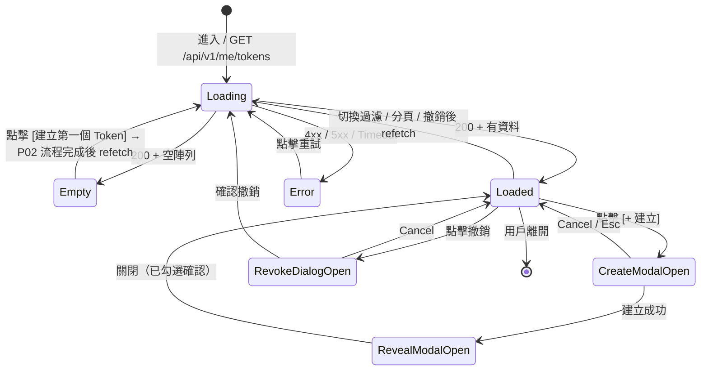

#### P02 / P03 Token 建立 Modal 狀態圖

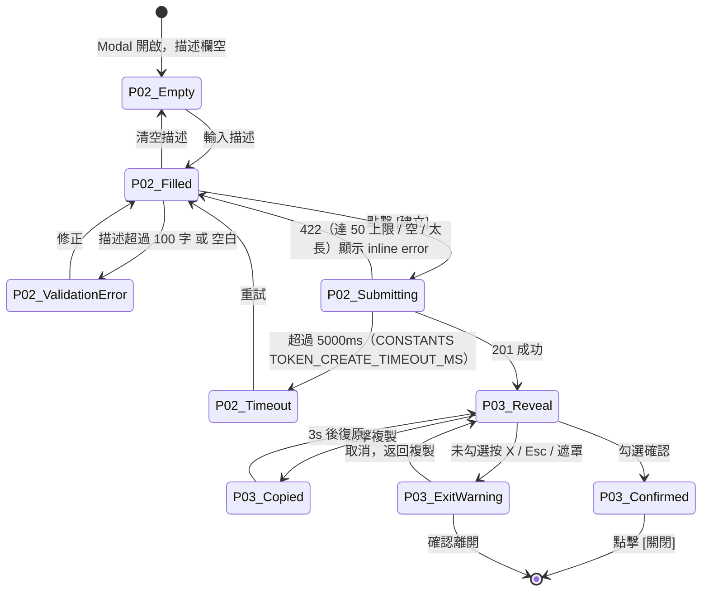

#### P04 撤銷確認對話框狀態圖

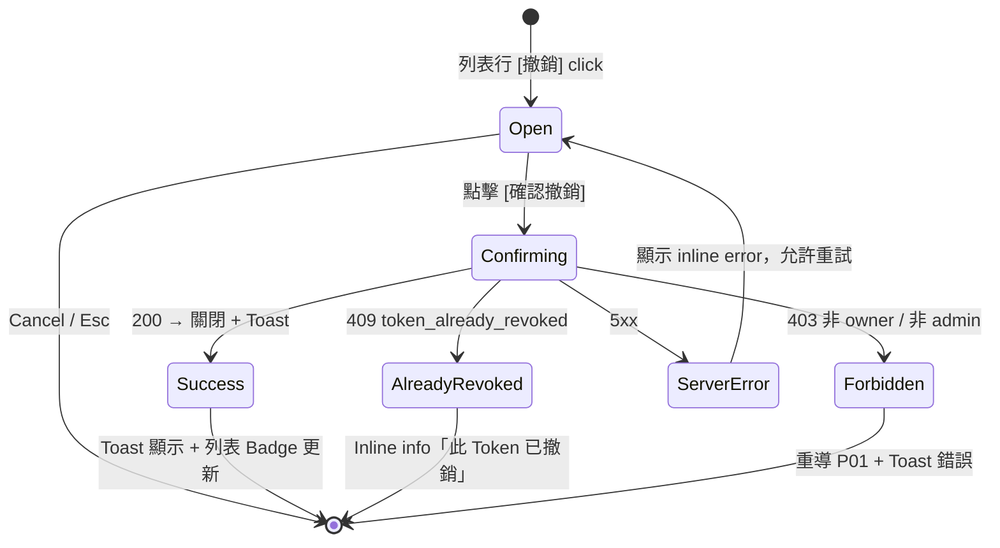

#### P05 N8N Quick Start 指南頁狀態圖

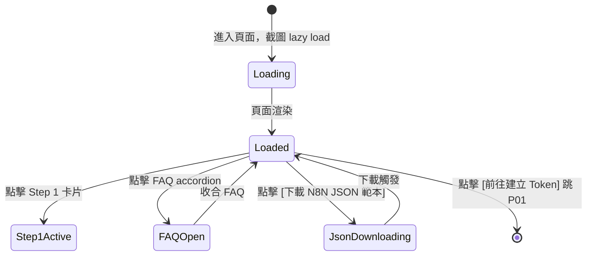

#### P07 Token 審計日誌頁狀態圖

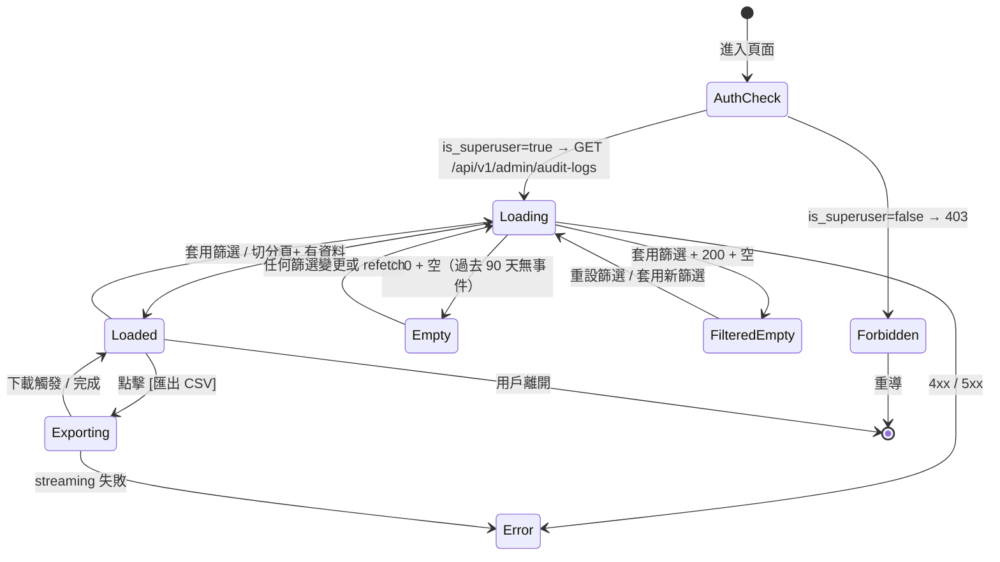

### 13.3 Usability Testing Protocol

| 階段 | 方法 | 時機 | 參與者 | 成功標準 |
|------|------|------|--------|---------|
| Concept Test | 5-second Test + 訪談 | Wireframe（§5）完成後 | 5 人（IT Admin / 業務 / N8N 操作員）| 核心概念理解率 ≥ 80%；建立 Token 流程被正確識別 |
| Prototype Test | Task-based Usability Test | Hi-fi Figma 完成後 | 5 人 | Task Completion Rate ≥ 80%；SUS Score ≥ 68；建立 Token 平均 ≤ 5 分鐘 |
| Beta Test（POC 試用）| Unmoderated Remote Test | POC Week 2 | ≥ 3 名（最多 5）| CSAT ≥ 3.5；70% 在 15 分鐘內完成自助流程；錯誤率 < 5% |

**測試腳本框架（Prototype Test）：**
```
1. 開場白：「這不是在測試你，我們在測試設計。請說出你看到什麼、你在想什麼。」
2. 熱身：「請描述一下你目前如何取得 ERP API 的存取權？」
3. 任務 1：你需要建立一個 N8N 工作流，每天從 ERP 拉銷售數據。請完成 Token 建立並複製。
4. 任務 2：你發現某個舊 N8N 工作流已停用，請撤銷對應的 Token。
5. 任務 3（IT Admin only）：上週有人投訴某個 Token 異常使用，請查出該 Token 的建立／撤銷記錄。
6. 事後問題：「最困惑的地方？最印象深刻的地方？」
7. SUS 量表（10 題標準）
```

> **SUS 評分標準：** ≥ 85 優秀；68–84 良好（業界平均）；< 68 需改善

### 13.4 A/B Test Design Template

| 欄位 | Quick Start 指南 v1 vs v2 |
|------|--------------------------|
| **假設** | 若 [Quick Start 增加 5 張截圖 + JSON 範本]，則 [自助完成首次端對端時間中位數] 將 [縮短 ≥ 30%]，因為 [N8N 操作員視覺學習 > 文字學習] |
| **控制組（A）** | 純文字版 Quick Start（步驟 1-3 文字描述）|
| **實驗組（B）** | 含 5 張截圖 + JSON 範本下載 |
| **主要指標** | 自助完成首次端對端時間中位數（p < 0.05）|
| **護欄指標** | Token 建立失敗率不增加 > 2%；列表載入時間不增加 > 100ms |
| **最小樣本量** | 30 名（each arm 15 名，統計功效 80%，顯著水準 5%，MDE 30%）|
| **測試時長** | 最少 2 週 |
| **分流方式** | User-level（同一使用者整週見同一版本）|
| **預期上線** | Pilot 階段（v2.0）|

### 13.5 開發前確認清單（Engineering Handoff Checklist）

- [x] §13.1 所有畫面互動元件均有完整的 ≥ 4 種狀態（Default / Hover / Focus / Disabled，多數含 Active / Loading / Error）
- [x] 所有錯誤狀態畫面已設計（§9 / §6.3 / §10.2 文案）
- [x] 空狀態（Empty State）已設計（§6.3，4 種情境）
- [x] Loading / Skeleton 狀態已設計（§6.4）
- [x] 所有 Design Token 已命名並與 Dev 對齊（§9.3 / §9.4）
- [x] 320 / 768 / 1024 / 1440 各斷點均已設計（§7.2 元件行為矩陣）
- [x] 動畫規格（timing / easing）已標注（§6.1.1）
- [x] 圖示（Icons）已 Export 為 SVG / 加入 Icon Library（沿用 ERP 既有 + 補充 4 個：Token Key / Empty Clipboard / Audit Shield / Copy Check）
- [x] 文案已最終定稿（§10.2 / §10.3 i18n key 對照），無 Lorem Ipsum
- [x] 無障礙注釋已完成（§8.4 12 項 WCAG）
- [x] 元件 → 測試檔案對應（§9.5.2）已建立
- [x] §13.2 畫面狀態轉換圖覆蓋所有 P0 畫面（P01 / P02-P03 / P04 / P05 / P07）

---

## 14. References

### 14.1 上游文件

- PRD：[PRD.md](PRD.md)（DOC-ID：PRD-ERP-API-TOKEN-MANAGER-20260508 v1.0.2）
- BRD：[BRD.md](BRD.md)（DOC-ID：BRD-ERP-API-TOKEN-MANAGER-20260426）
- IDEA：[IDEA.md](IDEA.md)（DOC-ID：IDEA-ERP-API-TOKEN-MANAGER-20260426）
- CONSTANTS：[CONSTANTS.md](CONSTANTS.md)（所有量化數值來源）
- 下游 EDD：[EDD.md](EDD.md)（待生成）

### 14.2 設計參考

- GitHub Personal Access Tokens UI：https://github.com/settings/tokens（一次性顯示 + 前綴遮罩 + 描述欄位）
- Stripe API Keys Dashboard：https://dashboard.stripe.com/test/apikeys（Token 列表 + 撤銷確認）
- AWS IAM Access Keys：https://console.aws.amazon.com/iam/home（雙 Key + Audit Trail 概念）
- N8N HTTP Request 節點 Bearer Token：https://docs.n8n.io/integrations/builtin/core-nodes/n8n-nodes-base.httprequest/
- WCAG 2.1 Guidelines：https://www.w3.org/TR/WCAG21/
- Material Design Motion：https://m3.material.io/styles/motion/easing-and-duration
- Apple HIG Touch Target：https://developer.apple.com/design/human-interface-guidelines/inputs/touch-input

### 14.3 效能預算（Core Web Vitals）

| 指標 | 目標 | 量測方式 | PRD 來源 |
|------|------|---------|---------|
| LCP（Largest Contentful Paint）| < 2.5s | Lighthouse / RUM | PRD §7.1 |
| INP（Interaction to Next Paint）| < 200ms | Web Vitals API | PRD §7.1 |
| CLS（Cumulative Layout Shift）| < 0.1 | Web Vitals API；Skeleton 避免 layout shift | PRD §7.1 |
| FCP（First Contentful Paint）| < 1.5s | Lighthouse | PRD §7.1 |
| TBT（Total Blocking Time）| < 200ms | Lighthouse | — |

**Bundle Budget：**

| Page Type | JS Budget（gzipped）| CSS Budget |
|-----------|---------------------|------------|
| 嵌入既有 ERP（無額外 SPA）| < 80kb（沿用 ERP framework）| < 15kb（本模組新增 Token 樣式 + 元件）|

**圖片 / 字型：**
- 字型：沿用 ERP 既有；Token 明文 / JSON 區域用 `font-family: 'JetBrains Mono', monospace`（系統 fallback，不額外載 Web Font）
- 圖示：SVG inline 或 sprite（< 5kb）
- 截圖（P05 5 張）：WebP（fallback PNG），`loading="lazy"`，每張 < 80kb

---

## 15. Admin Portal 產品設計

> **條件章節**：本專案 `has_admin_backend=False`（PRD §4.3、§11.1、CONSTANTS `IS_SUPERUSER_FLAG`）。
>
> **本專案無 Admin 後台需求** — 管理員權限以既有 ERP 使用者表 `users.is_superuser BOOLEAN DEFAULT FALSE` 升級。Admin 專屬功能（P07 審計日誌頁）與一般使用者頁面共用同一 ERP UI 框架，僅以 RBAC 路由守衛 + 側欄條件渲染區隔，**不另建獨立 Admin 後台**（無 `/admin/*` 子應用、無獨立 MFA 流程）。
>
> 略過 § 15 Admin Portal 設計章節的子節（§15.1 / §15.2 / §15.3 / §15.4）。

**P07（Token 審計日誌）的 Admin 設計考量已併入主章節：**
- 入口：§3.1 Sitemap / §3.2 導覽結構（is_superuser=true 才顯示「管理 > Token 審計日誌」）
- Wireframe：§5.7 P07
- 互動：§6 各互動規格
- RBAC 守衛：§7.2 / §13.2 P07 狀態圖（AuthCheck → Forbidden）
- 唯讀 / 不可刪除設計：§5.7 footer 提示 + DB 角色限制（PRD §5.9 AC-5）

---

## 16. Approval Sign-off

| 角色 | 姓名 | 簽核日期 | 意見 |
|------|------|---------|------|
| UX / Product Designer | TBD | — | 確認 §1-§12 設計規格與 PRD 9 個 User Stories 對應正確 |
| Design Lead | TBD | — | 確認 Wireframe（§5）+ Design Token（§9.3 / §9.4）+ Motion（§6.1.1）可落地 |
| Product Manager | TBD | — | 確認 §1.2 PRD 對應表完整、§10 文案與品牌調性一致、§11 驗證計畫可執行 |
| Engineering Lead | TBD | — | 確認 §13.1 Component State Spec 技術可行（OQ-PDD-5 ERP UI 框架確認後）；§9.5 Class Diagram 對應實作模型 |
| QA Lead | TBD | — | 確認 §13.2 P0 畫面狀態圖覆蓋所有測試情境；§13.3 Usability Testing Protocol 可執行 |
| Accessibility Review | TBD | — | 確認 §8.4 WCAG 2.1 AA 12 準則 M 項目均可實作；axe-core CI 可整合 |
| ERP IT Admin 代表（Persona A） | TBD | — | 從使用者視角確認 P07 審計日誌與撤銷流程符合實際稽核需求 |
| ERP 業務使用者代表（Persona B） | TBD | — | 確認 5 分鐘建立目標可達 |

---

## Appendix A：設計決策記錄（Design Decision Records, DDR）

| DDR-ID | 設計決策 | 決策理由 | 備選方案 | 決策日期 |
|--------|---------|---------|---------|---------|
| DDR-01 | 一次性 Token 顯示採用 Modal（P03），而非在表單頁面直接顯示 | Modal 強制使用者注意此關鍵步驟，且關閉後不殘留明文 Token 在頁面；直接顯示有「使用者未注意複製就返回」風險 | 在表單送出成功後直接於頁面顯示明文 | 2026-04-26 |
| DDR-02 | 撤銷操作採「確認對話框」（二段確認），而非單次點擊 | 撤銷不可逆且 0 秒生效，需防誤操作（PRD §5.3 邊界條件、BRD §8 R4）| 單次點擊撤銷（更快但有誤操作風險）| 2026-04-26 |
| DDR-03 | Token 前綴格式 `tk_` + 前 8 碼（如 `tk_a1b2c3d4...`）| PRD §5.1 AC-4 + CONSTANTS `TOKEN_PREFIX_LITERAL` + `TOKEN_PREFIX_DISPLAY_CHARS=8`；前綴足以識別但不具驗證熵值，安全可顯示 | 顯示 hash 前 8 碼 / 完全不顯示前綴 | 2026-04-26 |
| DDR-04 | P01 空狀態雙 CTA：主「建立第一個 Token」+ 次「N8N 設定指南 ↗」 | 降低新使用者起點摩擦：不確定者先看指南、有信心者直接建立（I-3 + I-2 Insight）| 僅單 CTA「建立 Token」 | 2026-04-26 |
| DDR-05 | P03 採「確認核取框 + 退出二級警告」雙保險 | 防止使用者誤觸 Esc / X / 遮罩失去 Token；OQ-PDD-2 Usability Test 驗證後保留 | 強制核取框（更嚴格）/ 直接點擊 X 關閉（更流暢但風險高）| 2026-04-28 |
| DDR-06 | Bearer Token 中介層 401 錯誤訊息採「不洩漏列舉」原則 | PRD §5.4 AC-3 — `token_invalid` 與 `token_revoked` 均以 generic 提示（避免列舉攻擊區分「不存在」與「已撤銷」差異）| 精確區分「不存在」/「已撤銷」（更友善但有列舉風險）| 2026-05-08 |
| DDR-07 | Dark Mode Token 採 OKLCH 色彩空間 | 感知均勻、Lightness 與對比度線性可預測；ECC 業界標準 | HSL / HEX（不感知均勻）| 2026-05-08 |
| DDR-08 | 行動端（< 768px）Token 列表改 Card 式而非 horizontal scroll Table | Touch Target 44×44 + 撤銷需明顯且不誤觸；horizontal scroll 不利可達性 | 水平捲動 Table | 2026-05-08 |

---

## Appendix B：BDD 連結 / Screen Inventory

### B.1 BDD Feature 連結

| PRD User Story | 對應 BDD Feature 檔（待 STEP `/gendoc-gen-bdd` 生成）|
|----------------|-------------------------------------------|
| US-AUTH-001 Token 建立 | `features/auth/create-token.feature` |
| US-AUTH-002 Token 列表 | `features/auth/list-tokens.feature` |
| US-AUTH-003 Token 撤銷 | `features/auth/revoke-token.feature` |
| US-AUTH-004 Bearer 驗證 | `features/auth/verify-bearer-token.feature` |
| US-N8N-001 N8N 整合 | `features/n8n/integration.feature` |
| US-DEMO-001 銷售示範 API | `features/demo/sales.feature` |
| US-DEMO-002 庫存示範 API | `features/demo/inventory.feature` |
| US-DEMO-003 訂單示範 API | `features/demo/order-status.feature` |
| US-AUDIT-001 審計日誌 | `features/audit/audit-log.feature` |

### B.2 Screen Inventory（總表）

| Screen ID | 名稱 | 路由 | Persona | PRD US | 優先度 | 狀態圖 |
|-----------|------|------|---------|--------|--------|--------|
| P01 | Token 管理主頁 | `/settings/api-tokens` | A / B | US-AUTH-002 / 003 入口 | P0 | §13.2 P01 |
| P02 | 建立 Token Modal | （Modal）| A / B | US-AUTH-001 | P0 | §13.2 P02-P03 |
| P03 | 一次性 Token 揭示 Modal | （Modal）| A / B | US-AUTH-001 | P0 | §13.2 P02-P03 |
| P04 | 撤銷確認對話框 | （Modal）| A / B | US-AUTH-003 | P0 | §13.2 P04 |
| P05 | N8N Quick Start 指南 | `/settings/api-tokens/n8n-guide` | B / C | US-N8N-001 | P0 | §13.2 P05 |
| P06 | POC API Test Console | `/settings/api-tokens/test-console` | B / C | US-DEMO-001/002/003 | P0（選填，OQ-PDD-3）| —（同 P05 簡化）|
| P07 | Token 審計日誌 | `/admin/audit-logs` | A（is_superuser=true）| US-AUDIT-001 | P1（MVP 強制）| §13.2 P07 |
| Error 401 Page | 未登入 / Session 過期 | `/login?returnUrl=...` | All | All | — | — |
| Error 403 Page | 權限不足 | `/forbidden` | 一般使用者誤入 P07 | US-AUDIT-001 AC-2 | — | — |

### B.3 Component Inventory（依 §9.5）

| Component | 用於 Screen | Stereotype | 測試檔 |
|-----------|------------|-----------|--------|
| TokenManagementPage | P01 | Component | `tests/unit/pages/TokenManagementPage.test.tsx` |
| TokenListTable | P01 | Component | `tests/unit/components/TokenListTable.test.tsx` |
| CreateTokenModal | P02 | Component | `tests/unit/components/CreateTokenModal.test.tsx` |
| TokenRevealModal | P03 | Component | `tests/unit/components/TokenRevealModal.test.tsx` |
| ConfirmRevokeDialog | P04 | Component | `tests/unit/components/ConfirmRevokeDialog.test.tsx` |
| AuditLogPage | P07 | Component | `tests/unit/pages/AuditLogPage.test.tsx` |
| AuditLogTable | P07 | Component | `tests/unit/components/AuditLogTable.test.tsx` |
| CopyButton | P03 | Component | `tests/unit/components/CopyButton.test.tsx` |
| TokenStatusBadge | P01 | Component | `tests/unit/components/TokenStatusBadge.test.tsx` |
| EmptyState | P01 / P07 | Component | `tests/unit/components/EmptyState.test.tsx` |
| TokenCard（Mobile）| P01 mobile | Component | `tests/unit/components/TokenCard.test.tsx` |
| useTokenStore | P01 / P02 / P04 | Store | `tests/unit/stores/useTokenStore.test.ts` |
| useAuditLogStore | P07 | Store | `tests/unit/stores/useAuditLogStore.test.ts` |
| useFormViewModel | P02 | Hook | `tests/unit/hooks/useFormViewModel.test.ts` |
| TokenDescriptionValidator | Domain | Validator | `tests/unit/domain/TokenDescriptionValidator.test.ts` |
| TokenApiClient | Infra | Service | `tests/unit/infrastructure/TokenApiClient.test.ts` |
| AuditLogApiClient | Infra | Service | `tests/unit/infrastructure/AuditLogApiClient.test.ts` |
| ClipboardAdapter | Infra | Adapter | `tests/unit/infrastructure/ClipboardAdapter.test.ts` |

---

*此 PDD.md v2.0 由 gendoc-flow PDD 步驟依上游文件（IDEA.md、BRD.md、PRD.md v1.0.2、CONSTANTS.md v1.0）完整覆寫生成，覆蓋 PRD 全部 9 個 User Stories（US-AUTH-001~004 / US-N8N-001 / US-DEMO-001~003 / US-AUDIT-001）；22 個 ## 章節均有實質內容；對齊 templates/PDD.gen.md Self-Check Checklist 與 templates/PDD.review.md 21 項審查標準（Review Loop r3 PASS — 0 findings）。*
