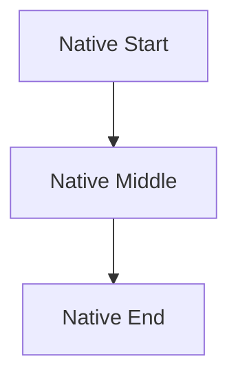

# K Group Fixture

完整 K1-K8 場景集中在這份文件，跑 gen_html 後可一站驗證所有 K 群修法。

---

## §1. K1+K3 — 單欄垂直流（純 flow，含 ▼ + edge annotation）

```
┌──────────────────┐
│ Player browser   │
└──────────────────┘
        │
        │  fetch() to localhost:3000
        ▼
┌──────────────────────────┐
│ Vite dev server          │
└──────────────────────────┘
        │
        │  HMR websocket
        ▼
┌──────────────────────────┐
│ Fastify API              │
└──────────────────────────┘
```

預期：3 個 mermaid box 線性連，每個 box 可點放大；`▼` 不變 node，
`fetch()`、`HMR websocket` 變 edge label。

---

## §2. K2 — 檔案目錄樹（保留 ASCII，不轉 mermaid）

```
apps/player/
├── index.html
├── vite.config.ts
├── tsconfig.json
└── src/
    ├── main.tsx
    ├── App.tsx
    └── components/
        ├── layout/
        │   ├── NavBar.tsx
        │   └── Layout.tsx
        ├── landing/
        │   ├── LandingPage.tsx
        │   └── ClaimCTA.tsx
        └── pet/
            ├── PetPage.tsx
            └── StatsPanel.tsx
```

預期：渲染為 `<pre>` 等寬字體 ASCII，**不**變 mermaid，**不**包 lightbox。

---

## §3. K2 — Sitemap（URL paths in tree branches，保留 ASCII）

```
pixel-pet-arena.com
│
├── / (Landing Page — Guest Mode)
│   ├── Canvas: Random pixel pet display
│   ├── "Claim This Pet" CTA → /claim
│   └── Nav: Leaderboard, [My Pet if URL known]
│
├── /claim (Claim Pet Page)
│   ├── Email input form
│   └── URL reveal screen
│
└── /pet/:petId (My Pet Page)
    ├── Pet canvas
    └── Stats panel
```

預期：渲染為 `<pre>` ASCII，不變 mermaid。

---

## §4. K2 — 元件樹 React（保留 ASCII）

```
<App>
├── <Layout>
│   ├── <NavBar>
│   └── <Outlet>
│       ├── <LandingPage>
│       ├── <ClaimPage>
│       └── <PetPage>
└── <Router>
```

預期：渲染為 `<pre>` ASCII，不變 mermaid。

---

## §5. K2 — Traceability tree（└─►，保留 ASCII）

```
IDEA.md (本文件)
  └─► BRD.md       ← /gendoc brd
        └─► PRD.md      ← /gendoc prd
              └─► PDD.md      ← /gendoc pdd
                    └─► EDD.md      ← /gendoc edd
```

預期：渲染為 `<pre>` ASCII，不變 mermaid（即使有 `─►` 系統箭頭也不轉）。

---

## §6. K4 — 多欄並排 + fan-in（arch §1.2 風格）

```
┌─────────────┐  ┌──────────────────┐  ┌───────────────────┐  ┌───────────────┐
│ Guest Player│  │ Pet Owner        │  │Competitive Player │  │Admin Operator │
│ (no token)  │  │ (URL token)      │  │(token + arena)    │  │(TOTP session) │
└──────┬──────┘  └────────┬─────────┘  └─────────┬─────────┘  └──────┬────────┘
       │  HTTPS            │  HTTPS                  │  HTTPS            │  HTTPS
       ▼                   ▼                         ▼                   ▼
┌─────────────────────────────────────────────────────────────────────────────────────┐
│  CDN / Edge (Vercel)                                                                │
└─────────────────────────────────────────────────────────────────────────────────────┘
```

預期：4 個 actor mermaid node + 1 個 CDN node + 4 條 fan-in edges 帶
HTTPS label；node label **無** `│` 殘留；可點放大。

---

## §7. K5 — 多行框 linear flow（cicd L347 風格）

```
Developer workstation
        │
        │  git push origin feature/my-feature
        ▼
┌───────────────────────────────────────────────────────┐
│  GitHub Pull Request (feature/* → develop)           │
│  ci.yml  ─── pnpm install                            │
│           ├── ESLint + tsc                            │
│           ├── Vitest unit tests (≥80% coverage)       │
│           ├── Supabase local stack                    │
│           ├── Docker build                            │
│           └── Playwright E2E smoke tests              │
│  All checks green → PR can be merged                 │
└───────────────────────────────────────────────────────┘
        │
        │  Merge PR into develop
        ▼
┌───────────────────────────────────────────────────────┐
│  deploy-staging.yml                                   │
│  ├── Build Docker images                              │
│  ├── Push to ghcr.io/...                              │
│  ├── Run db:migrate                                   │
│  └── ArgoCD auto-sync                                 │
└───────────────────────────────────────────────────────┘
```

預期：3 個 mermaid node（Developer / GitHub PR / deploy-staging），
每個大 box 變成一個含 `<br/>` 的 multi-line label，box 內 `├──`
視覺裝飾保留；可點放大。

---

## §8. K6 — UML state machine（proto/arena 風格）

```
          ┌─────────────────────────────────────────────────────┐
          │                                                     │
  ┌───────▼──────┐   user selects   ┌────────────────────┐      │
  │    IDLE      │─────opponent────▶│   CHALLENGING      │      │
  │ (opponent    │                  │ (POST /arena/battle│      │
  │  list shown) │                  │  in-flight)        │      │
  └──────────────┘                  └─────────┬──────────┘      │
          ▲                                   │ response 200     │
          │                                   ▼                  │
          │                         ┌──────────────────┐        │
          │                         │    BATTLING      │        │
          │                         │ (Phaser animates │        │
          │                         │  battle log)     │        │
          │                         └────────┬─────────┘        │
          │                                  │ animation done   │
          │                                  ▼                  │
          │                         ┌──────────────────┐        │
          └──────"Fight Again"───── │     RESULT       │────────┘
                                    │  (winner, XP,    │  "Back to
                                    │   rank shown)    │   Pet View"
                                    └──────────────────┘
```

預期：用 mermaid `stateDiagram-v2`（**不**是 `graph TD`），4 個 state
（IDLE / CHALLENGING / BATTLING / RESULT）皆出現，含 `[*] --> IDLE`
初始 arrow，可點放大。

---

## §9. K7+K8 — UI mock 螢幕設計（含 emoji，變 umock，可放大）

```
┌───────────────────────────────────────────────┐
│                                               │
│           🏆  BLAZEKIN WINS!                  │
│                                               │
│        ┌────────────────────────┐             │
│        │  Phaser victory anim   │             │
│        │  (confetti + sparkles) │             │
│        └────────────────────────┘             │
│                                               │
│  XP Gained:    +120                           │
│  New Rank:     #39  (was #43  ↑ +4)           │
│  Total XP:     4,820 / 6,000 to Lv 13        │
│                                               │
│  ┌────────────────┐    ┌────────────────────┐ │
│  │  Fight Again   │    │   Back to Pet View  │ │
│  └────────────────┘    └────────────────────┘ │
│                                               │
└───────────────────────────────────────────────┘
```

預期：渲染成 umock UI 線圖（`<div class="umock__card">` 等），包在
`<div class="diagram-container diagram-container--umock">` 內，可點
放大顯示完整內容。

---

## §10. K8 — 既有 ` ```ui-mock ` DSL fence 也包 wrapper

```ui-mock
page title:"Login Page" {
  card title:"Sign In" {
  }
}
```

預期：渲染為 umock，包 `.diagram-container--umock` wrapper，可點放大。

---

## §11. 對照組 — 原生 mermaid（K1 regression check）



預期：原生 mermaid 路徑不變，包 `.diagram-container`，可點放大。

---

## §12. K9 generic fix 驗證 — Battle Animation 螢幕（新案例，多行 stats）

```
┌───────────────────────────────────────────────┐
│  SUMO BATTLE  ·  Round 1 of 3                 │
│                                               │
│  Blazekin               vs          Voltclaw  │
│  HP: ████████░░          HP: █████░░░░░       │
│                                               │
│  ┌─────────────────────────────────────────┐  │
│  │                                         │  │
│  │         Phaser 3 Battle Canvas          │  │
│  │           480 × 320 px                  │  │
│  │                                         │  │
│  │   [pet A sprite]     [pet B sprite]     │  │
│  │                                         │  │
│  └─────────────────────────────────────────┘  │
│                                               │
│  ⚡ Voltclaw uses Static Shock!               │
│  Blazekin takes 18 damage.                    │
└───────────────────────────────────────────────┘
```

預期（K9 generic fix 驗證）：
- title `SUMO BATTLE · Round 1 of 3` 置中（K9-e）
- 「Blazekin vs Voltclaw」與「HP: bars」**分兩行**（K9 generic：每行各自一個 info node，不再 space-join）
- 內框 Phaser Canvas + 尺寸 + 內框 sprite 標示作為 code-block / inner box
- 攻擊訊息「⚡ Voltclaw uses Static Shock!」與「Blazekin takes 18 damage.」**分兩行**
- 整段在 lightbox 內可放大；3 張截圖（.md / .html inline / lightbox）結構元素一致
