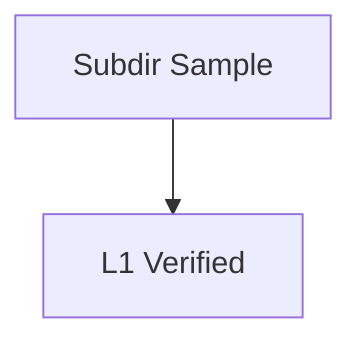

# Sample Diagram (L1 subdir verification)

This page lives at `pages/diagrams/sample-diag.html` (depth=1).

L1 verifies:
- `<head><link href="../assets/style.css">` (prefix added)
- nav-brand `<a href="../index.html">` (prefix added)
- breadcrumb `<a href="../index.html">k-group</a>` (prefix added)

## Sample Content

